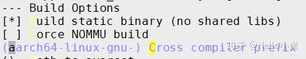

# QEMU模拟ARM64内核

## 一、安装交叉编译器 aarch64-none-linux-gnu- 10.3

网址：[https://developer.arm.com/downloads/-/gnu-a](https://developer.arm.com/downloads/-/gnu-a) 

工具选择：AArch64 GNU/Linux target (aarch64-none-linux-gnu) 

下载链接：[https://developer.arm.com/-/media/Files/downloads/gnu-a/10.3-2021.07/binrel/gcc-arm-10.3-2021.07-x86_64-aarch64-none-linux-gnu.tar.xz?rev=1cb9c51b94f54940bdcccd791451cec3&hash=B380A59EA3DC5FDC0448CA6472BF6B512706F8EC](https://developer.arm.com/-/media/Files/downloads/gnu-a/10.3-2021.07/binrel/gcc-arm-10.3-2021.07-x86_64-aarch64-none-linux-gnu.tar.xz?rev=1cb9c51b94f54940bdcccd791451cec3&hash=B380A59EA3DC5FDC0448CA6472BF6B512706F8EC) 

```bash
wget https://armkeil.blob.core.windows.net/developer/Files/downloads/gnu-a/10.3-2021.07/binrel/gcc-arm-10.3-2021.07-x86_64-aarch64-none-linux-gnu.tar.xz
tar xvf gcc-arm-10.3-2021.07-x86_64-aarch64-none-linux-gnu.tar.xz
ls gcc-arm-10.3-2021.07-x86_64-aarch64-none-linux-gnu/bin/
```

安装完成，记住路径，本机在：/root/gcc-arm-10.3-2021.07-x86_64-aarch64-none-linux-gnu/bin/aarch64-none-linux-gnu-

## 二、编译安装QEMU 7.2

1. wget [https://download.qemu.org/qemu-7.2.1.tar.xz](https://download.qemu.org/qemu-7.2.1.tar.xz)
2. tar 解压
3. mkdir build %% cd build
4. ../qemu-7.2.0/configure --enable-kvm --enable-slirp --enable-debug --target-list=aarch64-softmmu,x86_64-softmmu
5. make -j2

## 三、编译Kernel 5.4

```bash
git clone https://github.com/torvalds/linux -b v5.4 --depth=1
cd linux
git checkout v5.4

make ARCH=arm64 CROSS_COMPILE=/root/gcc-arm-10.3-2021.07-x86_64-aarch64-none-linux-gnu/bin/aarch64-none-linux-gnu- defconfig
make ARCH=arm64 CROSS_COMPILE=/root/gcc-arm-10.3-2021.07-x86_64-aarch64-none-linux-gnu/bin/aarch64-none-linux-gnu- Image -j$(nproc)
```

编译完毕，内核文件：arch/arm64/boot/Image

## 四、编译 busybox 1.36.0 （文件系统）

```bash
wget https://busybox.net/downloads/busybox-1.36.0.tar.bz2
tar -jxvf busybox-1.36.0.tar.bz2

cd busybox-1.36.0
make menuconfig
```

- > Settings

[*] Build static binary (no shared libs)

(/root/gcc-arm-10.3-2021.07-x86_64-aarch64-none-linux-gnu/bin/aarch64-none-linux-gnu-) Cross compiler prefix



```bash
# 编译安装
make -j$(nproc) && make install
```

编译完毕后busybox生成在_install目录。

## 五、**文件系统创建console**

```bash
cd _install
mkdir dev
cd dev
sudo mknod console c 5 1
sudo mknod null c 1 3
sudo mknod tty1 c 4 1
sudo mknod tty2 c 4 2
sudo mknod tty3 c 4 3
sudo mknod tty4 c 4 4
cd ..
mkdir -p etc/init.d/ 
cd etc/init.d; touch rcS
chmod +x rcS
vi rcS

# 压缩成cpio.gz文件系统
find . | cpio -o -H newc |gzip > ../rootfs.cpio.gz
```

## 六、****启动arm64内核****

把上述文件放在同一个目录上：


```bash
qemu-system-aarch64 \
        -machine virt,virtualization=true,gic-version=3 \
        -nographic \
        -m size=1024M \
        -cpu cortex-a57 \
        -smp 2 \
        -kernel Image \
        -initrd rootfs.cpio.gz \
        --append "console=ttyAMA0 rdinit=/linuxrc"
```

效果：


由于busybox制作的文件系统过于简单（如没有apt工具），因此，我们需要使用更丰富的ubuntu文件系统来定制。

## 八、基于ubuntu 20.04 arm64 base构建

下载：[ubuntu-base-20.04.5-base-arm64.tar.g](http://cdimage.ubuntu.com/ubuntu-base/releases/20.04/release/ubuntu-base-20.04.5-base-arm64.tar.gz)z  

链接：[http://cdimage.ubuntu.com/ubuntu-base/releases/20.04/release/ubuntu-base-20.04.5-base-arm64.tar.gz](http://cdimage.ubuntu.com/ubuntu-base/releases/20.04/release/ubuntu-base-20.04.5-base-arm64.tar.gz)

```bash
wget http://cdimage.ubuntu.com/ubuntu-base/releases/20.04/release/ubuntu-base-20.04.5-base-arm64.tar.gz

mkdir rootfs
dd if=/dev/zero of=ubuntu-20.04-rootfs_ext4.img bs=1M count=4096 oflag=direct
mkfs.ext4 ubuntu-20.04-rootfs_ext4.img
sudo mount -t ext4 ubuntu-20.04-rootfs_ext4.img rootfs/
sudo tar -xzf ubuntu-base-20.04.5-base-arm64.tar.gz -C rootfs/

sudo cp /usr/bin/qemu-system-aarch64 rootfs/usr/bin/
sudo cp /etc/resolv.conf rootfs/etc/resolv.conf
sudo mount -t proc /proc rootfs/proc
sudo mount -t sysfs /sys rootfs/sys
sudo mount -o bind /dev rootfs/dev
sudo mount -o bind /dev/pts rootfs/dev/pts

# 安装内核模块（可选）
cd linux-5.4
make ARCH=arm64 modules -j$(nproc) CROSS_COMPILE=/root/gcc-arm-10.3-2021.07-x86_64-aarch64-none-linux-gnu/bin/aarch64-none-linux-gnu-
sudo make ARCH=arm64 modules_install CROSS_COMPILE=/root/gcc-arm-10.3-2021.07-x86_64-aarch64-none-linux-gnu/bin/aarch64-none-linux-gnu- INSTALL_MOD_PATH=/root/rootfs

sudo chroot rootfs

apt-get update
apt-get install git sudo vim bash-completion -y
apt-get install net-tools ethtool ifupdown network-manager iputils-ping -y
apt-get install rsyslog resolvconf udev -y

# 如果上面软件包没有安装，至少要安装下面的包
apt-get install systemd -y

apt-get install build-essential git wget flex bison libssl-dev bc libncurses-dev kmod -y

################# 编译kernel
# 1. 安装交叉编译工具链
# 2. git clone linux ## bug: no /dev/null , solu: sudo mknod /dev/null c 1 3。注意，在chroot内，不用加交叉编译器参数CROSS_COMPILE
# 3. 编译kernel , 先make Image, 然后make, 然后make modules_install
# 4. 编译jailhouse, make ARCH=arm64 KDIR=~/linux && make ARCH=arm64 install KDIR= DESTDIR=
# 5. qemu启动arm64
# 6. 启动jailhouse
#################

adduser arm64
adduser arm64 sudo
echo "kernel-5_4" >/etc/hostname
echo "127.0.0.1 localhost" >/etc/hosts
echo "127.0.0.1 kernel-5_4">>/etc/hosts
dpkg-reconfigure resolvconf
dpkg-reconfigure tzdata
exit

sudo umount rootfs/proc
sudo umount rootfs/sys
sudo umount rootfs/dev/pts
sudo umount rootfs/dev
sudo umount rootfs
```

然后模拟运行来验证：

```bash
qemu-system-aarch64 \
	-machine virt,gic_version=3 \
	-machine virtualization=true \
	-cpu cortex-a57 \
	-machine type=virt \
	-nographic \
	-smp 16 \
	-m 1024 \
	-kernel Image \
	-append "console=ttyAMA0 root=/dev/vda rw" \
	-drive if=none,file=ubuntu-20.04-rootfs_ext4.img,id=hd0,format=raw \
	-device virtio-blk-device,drive=hd0 \
	-netdev tap,id=net0,ifname=tap0,script=no,downscript=no \
	-device virtio-net-device,netdev=net0,mac=52:55:00:d1:55:01
```

**Q**：在使用ubuntu-base启动虚拟aarch64平台时，等待dev-ttyAMA0.device超时而卡住，从而导致无法登录进入bash

```bash
sudo mount ubuntu-20.04-rootfs_ext4.img rootfs/
sudo chroot rootfs/
cp lib/systemd/system/serial-getty\@.service lib/systemd/system/serial-getty\@ttyAMA0.service
systemctl enable serial-getty\@ttyAMA0.service
exit
```

**修改内容**

```bash
sudo vim rootfs/lib/systemd/system/serial-getty@ttyAMA0.service
```


将BindsTo和After开头的行注释掉

参考地址：

[systemd for Administrators, Part XVI](http://0pointer.de/blog/projects/serial-console.html)

最后卸载挂载，完成根文件系统的制作。

## 九、配置qemu网络，与外部通信

```bash
+-----------------------------------------------------------------+
|  Host                                                           |
| +---------------------+                                         |
| |                     |                                         |
| | br0:                |                                         |
| |   192.168.0.32/24 +-----+                                   |
| |                     |     |                                   |
| +----+----------------+     |       +-------------------------+ |
|      |                      |       |  Guest                  | |
|      |                      |       | +---------------------+ | |
| +----+----------------+  +--+---+   | |                     | | |
| |                     |  |      |   | | eth0:               | | |
| | eth1:               |  | tap0 |   | |   192.168.0.33/24 | | |
| |   192.168.0.175/24   |  |      +-----+                     | | |
| |                     |  |      |   | +---------------------+ | |
| +---------------------+  +------+   +-------------------------+ |
+-----------------------------------------------------------------+
```

网络连接图

配置网桥 `br0`

```bash
sudo ip link add name br0 type bridge
sudo ip link set dev br0 down
sudo ip addr flush dev br0
sudo ip addr add 192.168.0.32/24 dev br0
sudo ip link set dev br0 up
```

配置 tap 设备 `tap0`

```bash
sudo ip tuntap add name tap0 mode tap
sudo ip link set dev tap0 up
```

将宿主机网络接口 `eth0`和 `tap0`接入网桥 `br0`

```bash
sudo ip link set eth1 master br0
sudo ip link set tap0 master br0
```

然后qemu启动虚拟机，在虚拟机内

```bash
sudo ifconfig eth0 up
sudo ifconfig eth0 192.168.0.33
```

现在可以实现guest ping通host

### 优化网络，让其可以与外部通信 (暂不可信)

以上步骤完成后虚拟机可与宿主机所在网络的其他设备互连（包括宿主机），也可以通过指定的网关连接互联网，但是此时宿主机无法连接互联网，解决方法如下:

删除 `eth0`接口的默认网关：

```bash
sudo ip route del default dev eth1
```

为 `br0`添加默认网关：

```bash
sudo ip route add default via 192.168.0.1 dev br0
```

## 十、利用chroot编译jailhouse

```bash
sudo mount ubuntu-18.04.1-rootfs_ext4.img rootfs/
sudo chroot rootfs/
```

## 附一、编译jailhouse✅

```bash
# for x86
git clone https://github.com/siemens/jailhouse.git
cd jailhouse 
make

# for aarch64
git clone https://github.com/siemens/jailhouse.git
cd jailhouse 
# scripts/include.mk
make ARCH=arm64 CROSS_COMPILE=/root/gcc-arm-10.3-2021.07-x86_64-aarch64-none-linux-gnu/bin/aarch64-none-linux-gnu- KDIR=/root/hypervisor/linux

## 在qemu中install
sudo make ARCH=arm64 KDIR=/home/arm64/linux DESTDIR=/home/arm64/linux install 
```

说明：编译jailhouse一定要指定KDIR，说明sysroot目标，才可以编译成功，并且需要提前编译一个linux作为sysroot，否则默认从本机linux源码目录中去找相应的库代码。

## 附二、img扩容

当rootfs chroot空间不足时，需要扩容，按照以下步骤进行无损扩容：

```bash
# 首先取消挂载img
umount ./rootfs

## bug: umount: /root/rootfs: target is busy.
## 解决：umount ./rootfs -l 强行卸载（慎用）

dd if=/dev/zero of=add.img bs=1M count=4096 # 新建4G空间
cat add.img >> ubuntu-20.04-rootfs_ext4.img
e2fsck -f ubuntu-20.04-rootfs_ext4.img
resize2fs ubuntu-20.04-rootfs_ext4.img

mount ubuntu-20.04-rootfs_ext4.img rootfs
```
