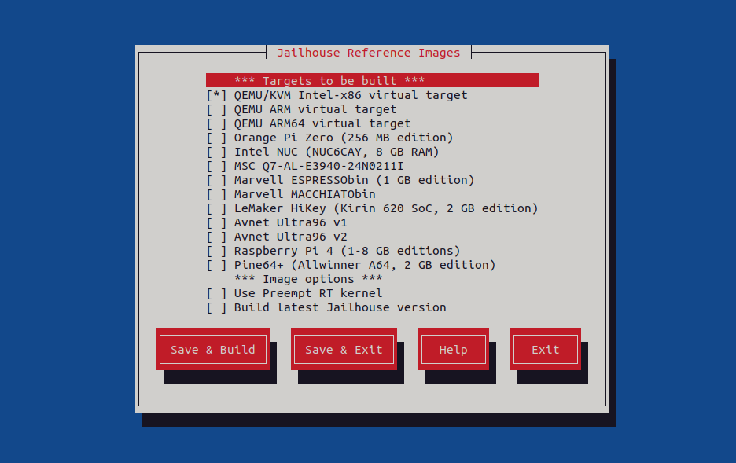
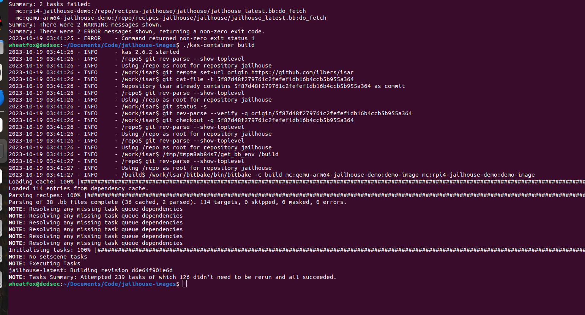
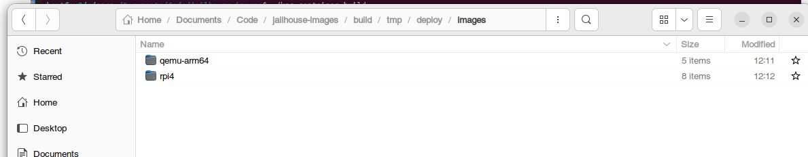
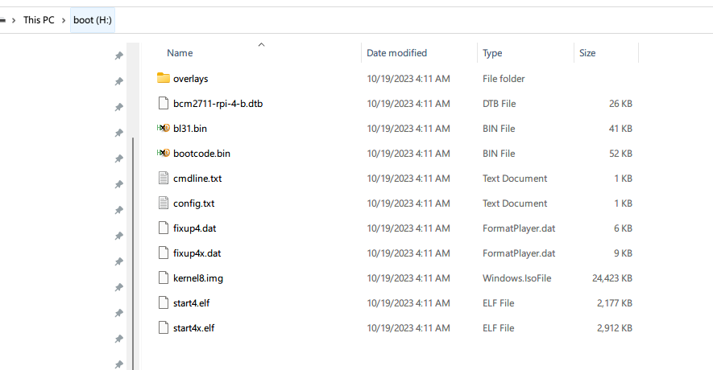
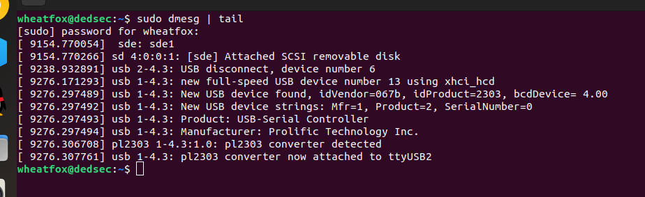
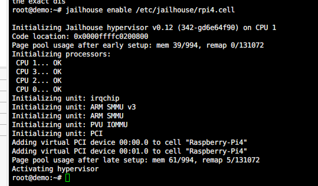
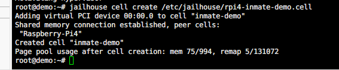
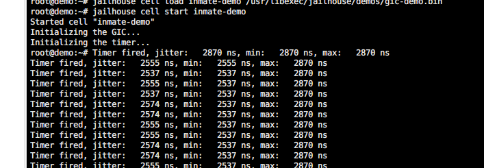
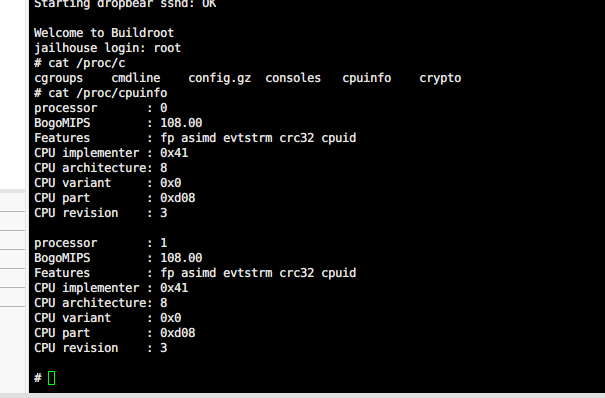

# Jailhouse在树莓派硬件平台上的移植

时间：2023.6.6

作者：杨竣轶

## Preparation

🔧工具： Jailhouse-Image

☑️平台：Raspiberry Pi 4B 8GB

## 开始

```bash
git clone 
```

## jailhouse-images配置分析

## 详解dts文件在jailhouse中的使用🌟

```bash
## 原则：在Arm平台上，每一个Jail Linux(包括root/guest)都需要有一个相应的设备树支持其启动。
# root cell使用的设备树，与硬件上直接启动Linux使用的设备树别无二致，存在于Linux源码中，在编译Jailhouse时使用KDIR指定
# guest cell使用的设备树，在config/arm64/dts中可以看见，您可以根据不同的需要定制设备树文件（例如：设备直通、CPU指定），该设备树文件应该是Linux源码中设备树的“子”树。
# 关于cell配置：对于guest中的设备配置，根据guest cell dts的配置，可以轻松的配置其地址位置。
```

## 在mac上的读写sd卡操作

```bash
diskutil list
diskutil umountDisk /dev/diskx
sudo dd if=/linux.dmg of=/dev/rdiskx bs=1m
diskutil eject /dev/diskx
```

## 修改Jailhouse源码重新编译

1. 克隆仓库
2. 修改文件
3. 生成patch: git diff > ../0001-xxx-xx.patch
4. 添加到SRC_URI
5. 重新运行

---

# 树莓派4B运行jailhouse

https://github.com/siemens/jailhouse

## jailhouse-images

### 编译镜像

https://github.com/siemens/jailhouse-images

首先克隆jailhouse-images库

需要安装docker环境 - https://docs.docker.com/engine/install/ubuntu/

启动docker `sudo systemctl start docker`


运行jailhouse-images的kas-container需要配置non-root docker环境 - https://www.digitalocean.com/community/questions/how-to-fix-docker-got-permission-denied-while-trying-to-connect-to-the-docker-daemon-socket，可以运行：`sudo chmod 666 /var/run/docker.sock`

之后运行 `./kas-container menu` 即可正常使用docker，并进入菜单界面，这里我选择树莓派4B+QEMU ARM64两个target，使用空格进行选择




如果出现remote connection error，打开recipes-jailhouse/jailhouse/jailhouse.inc，修改第28行为`    git://github.com/siemens/jailhouse;branch=next;protocol=https \`





得到树莓派和qemu的jailhouse镜像


### 烧写SD卡

首先找到sd卡（USB读卡器）的设备号 - `lsblk`


例如，我使用的64G的sd卡在上图中寻找，知其挂载为`sdd1`

运行`dd if=demo-image-jailhouse-demo-rpi4.wic.img of=/dev/sdd1 bs=4M status=progress `

**上面的方法写入后无法启动机器（待研究）**

采用windows下的rufus重新将img写入sd卡




### 启动机器

树莓派使用串口转USB连接到电脑（PL2303）



这里使用windows下的xshell登录串口（由于未知原因，我在linux下使用screen、stty或minicom均无法输入）


树莓派4B成功启动jailhouse环境







尝试启动linux inmate


可以看到第二个启动的linux只有两个CPU（总共4个）



