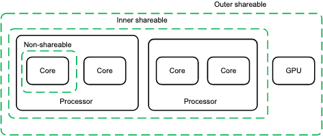

# Jailhouse中操作的arm64特殊寄存器

vcpu的主要行为是恢复和保存系统上下文

- 发生vm_entry时，标志寄存器自动保存（每个EL都有一份），通用寄存器需要手动保存
- 发生vm_exit时，标志寄存器自动恢复（每个EL都有一份），通用寄存器需要手动恢复

## HCR_EL2

HCR（Hypervisor Configuration Register）虚拟机监控器配置寄存器 0x80280019

### HCR_VM, bit [0]

启用虚拟化

- 0：禁用二阶段地址翻译
- **1：启用二阶段地址翻译**

### HCR_IMO, bit [4]

- 0：在EL1中处理中断请求IRQ
- **1：在EL2中处理中断请求IRQ**

### HCR_FMO, bit [3]

- 0：在EL1中处理快速中断请求FIQ
- **1：在EL2中处理快速中断请求FIQ**

### HCR_TSC, bit [19]

- 0：不会导致指令被捕获
- **1：在EL1执行SMC的尝试会被捕获到EL2执行**

### HCR_TACR, bit [21]

TACR（trap auxiliary control register）

- 0：不会导致指令被捕获
- **1：启用EL2时，在EL1对ACTLR寄存器的访问会被捕获到EL2执行**

### HCR_RW, bit [31]

- 0：EL1和EL0使用AArch32
- **1：EL1使用的是AArch64**

如果EL1不支持AArch32，该位为 RAO/WI（Read-As-One, Writes Ignored，该位永远为1，忽略对该字段的写入）

## VTCR_EL2

VTCR（Virtualization Translation Control Register）虚拟化翻译控制寄存器 0x80043594

### VTCR_T0SZ, bit [5:0]

VTTBR_EL2寻址的内存区域的大小偏移量为字节 T0SZ = 20

### VTCR_IRGN0, bit [9:8]

Inner 内层缓存属性

- 00：不使用缓存cache
- **01：写回 Write-Back，读分配，写分配**
- 10：直写 Write-Through，读分配，非写分配
- 11：写回 Write-Back，读分配，非写分配

Inner代表L1，Outer代表L2

### VTCR_ORGN0, bit [11:10]

Outer 外层缓存属性

- 00：不使用缓存cache
- **01：写回 Write-Back，读分配，写分配**
- 10：直写 Write-Through，读分配，非写分配
- 11：写回 Write-Back，读分配，非写分配

### VTCR_SH0, bit [13:12]

共享属性

- 00：不可共享
- 10：外层可共享
- **11：内层可共享**

### VTCR_PS, bit [18:16]

二阶段地址翻译的物理地址大小（**P**hysical address **S**ize）PS = 4

- 000：32位，4GB
- 001：36位，64GB
- 010：40位，1TB
- 011：42位，4TB
- 100：44位，16TB
- 101：48位，256TB
- 110：52位，4PB

### VTCR_VS, bit [19]

VMID的大小：hypervisor分配的虚拟机的id的大小

### VTCR_RES1, bit [31]

- 保留位为1，RES1

## VTTBR_EL2

VTTBR（Virtualization Translation Table Base Register）虚拟化转换表基址寄存器 0x7fc72000

保存用于二阶段地址转换初始查找的转换表的基地址

### VTTBR_VMID, bit [63:48]

转换表的VMID

- 当VTCR_EL2_VS为0时，使用8位，高8位为RES0

### VTTBR_BADDR, bit [47:1]

转换表基地址

## SPSR_EL2

SPSR（Saved Program Status Register）备份程序状态寄存器 0x3c5

### SPSR_D, bit [9]

调试异常掩码。EL2发生异常时设置为PSTATE.D的值，在EL2执行异常返回时复制到PSTATE.D

### SPSR_A, bit[8]

系统错误SError掩码。EL2发生异常时设置为PSTATE.A的值，在EL2执行异常返回时复制到PSTATE.A

### SPSR_I, bit [7]

IRQ中断掩码。EL2发生异常时设置为PSTATE.I的值，在EL2执行异常返回时复制到PSTATE.I

### SPSR_F, bit [6]

FIQ中断掩码。EL2发生异常时设置为PSTATE.F的值，在EL2执行异常返回时复制到PSTATE.F

### SPSR_M, bit [3:0]

AArch64异常级别和选定的堆栈指针

- 0000：EL0t
- 0100：EL1t
- 0101：EL1h
- 1000：EL2t
- 1001：EL2h

## ELR_EL2

ELR（Exception Link Register）

异常链接寄存器，存放异常的返回地址

VTCR_CELL = 80043594

SPSR = 3c5

vttbr = 7fc72000

hcr = 80280019
