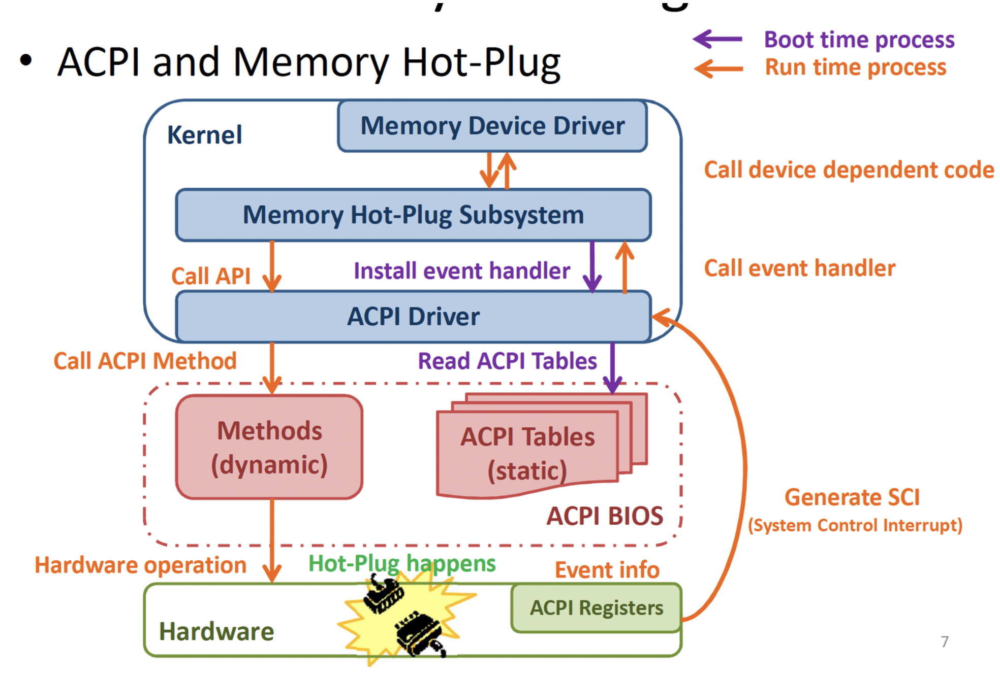
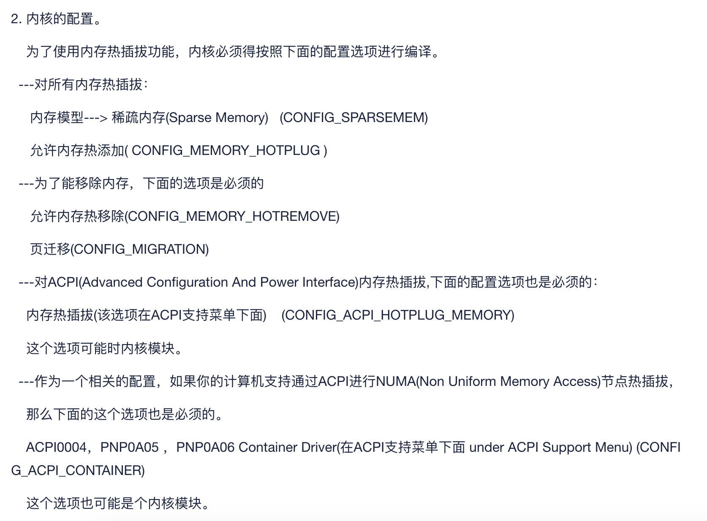
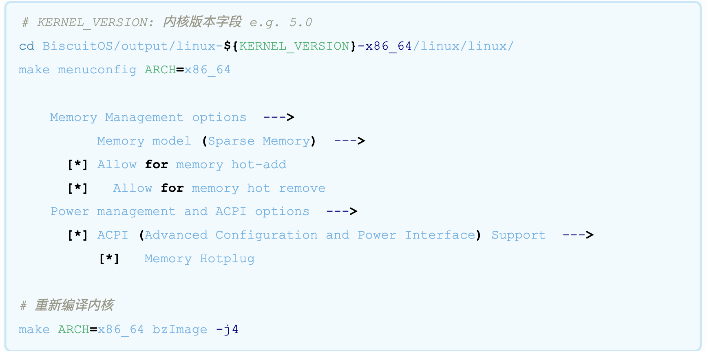
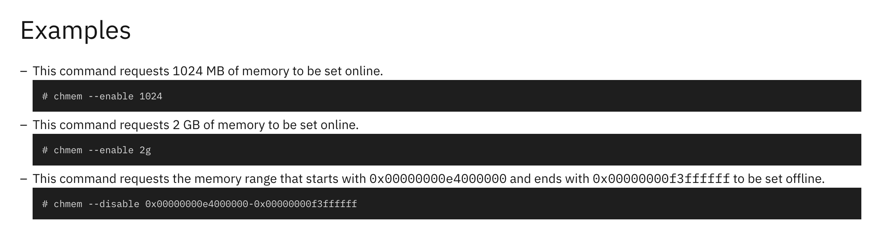

# Linux Memory Hotplug

时间：2023.7.21

作者：杨竣轶

## 一、背景：为什么需要Memory Hotplug

1. 实现了内存热插拔；
2. 降低系统能耗；
3. 动态调整OS的可用内存；【虚拟化场景下需支持】

存在形式：是OS的一个子系统（Memory Hotplug subsystem）

- 具体
    
    在Linux内核中，Memory Hotplug子系统由多个组件组成，包括内核模块、内核配置选项、用户空间工具等等。其中，内核模块是Memory Hotplug子系统的核心，它包括了多个模块，例如memory_hotplug、offline_pages等等。这些模块提供了一组接口，允许用户空间工具或其他内核模块来操作物理内存。内核配置选项则用于配置内核模块的行为，例如启用或禁用Memory Hotplug子系统、设置内存热插拔策略等等。用户空间工具则用于管理和操作Memory Hotplug子系统，例如检测可用内存容量、添加或移除内存等等。
    
    使用Memory Hotplug子系统，用户可以在运行时添加或移除物理内存，而无需重新启动系统。这对于需要动态分配内存的应用程序或者虚拟化环境非常有用，可以提高系统的灵活性和可用性。
    
    总之，Memory Hotplug是Linux操作系统中的一个子系统，它允许在运行时添加或移除物理内存，从而增加或减少系统可用的内存容量。Memory Hotplug子系统由多个组件组成，包括内核模块、内核配置选项、用户空间工具等等。使用Memory Hotplug子系统，用户可以动态分配内存，提高系统的灵活性和可用性。
    

## 二、ACPI（Advanced Configuration and Power Interface）介绍

中文：高级配置与电源接口

概念：一种电源管理标准，旨在提供一种统一的接口，使操作系统和硬件设备之间可以进行有效的通信和控制。ACPI 标准的目的是为了解决早期计算机硬件多样性和电源管理的问题，提高计算机的可靠性、可用性和节能性。

存在形式：内核模块

规范种类：****SBSA、SBBR等。详细****参考ARM手册，以及软件编程模型：

[5. ACPI Software Programming Model — ACPI Specification 6.4 documentation](https://uefi.org/htmlspecs/ACPI_Spec_6_4_html/05_ACPI_Software_Programming_Model/ACPI_Software_Programming_Model.html)

- tips: 和设备树的区别
    
    设备树主要用于描述硬件设备和资源，是一个数据接口。在系统启动时被加载，操作系统可以通过解析设备树了解硬件设备的属性和状态，并控制硬件设备的行为。设备树可以提供硬件资源管理、设备配置和驱动程序加载等功能。而ACPI，定义了操作系统和计算机硬件之间的接口。ACPI允许操作系统控制计算机的电源管理，例如休眠和唤醒，以及设备的配置和控制。ACPI定义了一种描述系统硬件和固件的语言，即ACPI语言。ACPI语言可以描述系统的层次结构、设备资源和设备配置，以便操作系统可以理解和控制硬件。它们可以同时使用。
    

ACPI的主要目标是优化计算机的能源消耗，使系统在不同的电源状态下（例如待机、睡眠、唤醒）之间无缝切换，并能够自动管理硬件资源。这包括对CPU、内存、存储、外设等的功耗进行智能调整，从而提高计算机的能效。

总结起来，ACPI是一种电源管理和硬件配置的标准，使得操作系统能够更有效地管理计算机的能源消耗，并且在不同的电源状态间进行切换，从而实现更好的性能和能效。

### ACPI实现内存热插拔

(1) x86平台

ACPI实现内存热插拔的原理如下：

1. 插入或移除内存模块时，ACPI BIOS会检测到这些变化并发送通知给操作系统。
2. 操作系统接收到通知后，会重新扫描系统中的内存资源，并更新系统的内存管理数据结构。
3. 如果插入了新的内存模块，操作系统会将其初始化，并将其添加到可用内存池中。
4. 如果移除了内存模块，操作系统会从内存管理数据结构中删除对应的内存区域，并将其释放回可用内存池中。

需要注意的是，ACPI实现内存热插拔需要硬件系统支持，包括内存控制器和内存插槽的设计。在实现内存热插拔时，需要确保插入或移除内存模块不会影响系统的稳定性和数据完整性。同时，对于操作系统来说，需要具备相应的内存管理能力，以支持内存热插拔的实现。

(2) Armv8

在ARMv8架构中，内存热插拔通常需要依赖于UEFI固件标准+ACPI。

UEFI固件负责启动操作系统和初始化硬件资源，而ACPI标准则定义了操作系统和计算机硬件之间的接口。当插入或移除内存模块时，UEFI固件会检测到这些变化并更新ACPI表，然后将信息传递给操作系统。操作系统接收到通知后，会重新扫描系统中的内存资源，并更新内存管理数据结构。

- tips: ARM下UEFI+ACPI的好处
    
    在ARM架构下，UEFI+ACPI可以提供以下功能：
    
    1. 启动管理：UEFI+ACPI提供了更加灵活的启动管理支持，可以支持多个操作系统和启动选项，同时也可以通过网络或其他渠道实现远程启动。
    2. 硬件管理：UEFI+ACPI支持更多的硬件设备和资源管理，可以实现更高效的硬件配置和控制。
    3. 电源管理：UEFI+ACPI可以提供更加精细的电源管理支持，包括休眠和唤醒功能。
    4. 设备热插拔：UEFI+ACPI可以支持设备的热插拔，包括网络设备、存储设备和其他外设。

### QEMU上实践ACPI内存热插拔

1. 启动QEMU虚拟机：使用以下命令启动QEMU虚拟机，并指定ACPI启动参数：

```bash
$ qemu-system-x86_64 -m 512M -enable-kvm -smp 2 \
    -bios /usr/share/qemu/OVMF.fd \
    -drive file=ubuntu.qcow2,format=qcow2 \
    -device virtio-net,netdev=net0 \
    -netdev user,id=net0 \
    -acpitable file=/path/to/acpi_table.bin
```

在上面的命令中，-acpitable参数指定了ACPI表的位置和名称。ACPI表是一个包含了设备和资源信息的二进制文件，用于描述系统的硬件和配置信息。

1. 模拟内存插入：可以使用以下命令在运行中的虚拟机中模拟内存插入：

```bash
$ sudo qemu-monitor-command \
    --pretty \
    --hmp \
    "device_add pc-dimm,id=dimm1,slot=0,size=1G"
```

这个命令会在虚拟机中模拟插入一块1GB的内存条。

1. 查看系统日志：可以使用以下命令查看虚拟机中的系统日志，以了解设备的变化和系统的响应：

```bash
$ sudo tail -f /var/log/syslog
```

在系统日志中，可以查看到相关的设备变化和ACPI事件，例如以下信息：

```bash
Jul 15 12:35:44 ubuntu kernel: [  406.345619] ACPI: Added _OSI(Linux-Dell-Video)
Jul 15 12:35:44 ubuntu kernel: [  406.345622] ACPI: Added _OSI(Linux-Lenovo-NV-HDMI-Audio)
Jul 15 12:35:44 ubuntu kernel: [  406.345624] ACPI: Added _OSI(Linux-HPI-Hybrid-Graphics)
Jul 15 12:35:44 ubuntu kernel: [  406.354652] ACPI: bus type PCI registered
Jul 15 12:35:44 ubuntu kernel: [  406.354655] acpiphp: ACPI Hot Plug PCI Controller Driver version: 0.5
Jul 15 12:35:44 ubuntu kernel: [  406.355600] pciehp: PCI Express Hot Plug Controller Driver version: 0.4
Jul 15 12:36:08 ubuntu kernel: [  430.904285] ACPI: bus type MEMORY registered
Jul 15 12:36:08 ubuntu kernel: [  430.904288] acpiphp: ACPI Hot Plug PCI Controller Driver version: 0.5
Jul 15 12:36:08 ubuntu kernel: [  430.904366] pciehp: PCI Express Hot Plug Controller Driver version: 0.4
```

这表示系统已经检测到内存模块的插入，并执行了相应的操作。

在ARM中类似操作，只需要在qemu中加入acpi启动参数。

## 三、sysfs介绍

sysfs是Linux内核的一部分，它是一个虚拟文件系统，提供了一种机制，**用于向用户空间公开内核数据结构**。sysfs通常被用来提供有关系统硬件和设备的信息，例如CPU、内存、磁盘、网络接口等。

作用：

使用sysfs，可以获取系统硬件和设备的各种信息，以及控制它们的行为。以下是sysfs的一些用途：

1. 查看硬件信息：sysfs提供了有关系统硬件和设备的详细信息，例如CPU、内存、磁盘、网络接口等。通过sysfs，你可以查看这些设备的属性、状态、驱动程序信息等。
例如，要查看系统中的CPU信息，可以使用以下命令：

```bash
$ cat /sys/devices/system/cpu/cpu0/cpufreq/scaling_cur_freq
```

这个命令会显示CPU0的当前频率。也可以使用其他文件来查看CPU温度、电源状态等信息。

1. 控制硬件行为：sysfs也可以用于控制系统硬件和设备的行为。例如，你可以通过sysfs来禁用某个设备、设置设备的功耗管理模式、修改设备的诊断选项等。
要禁用某个网卡设备，可以使用以下命令：

```bash
$ echo 0 > /sys/class/net/eth0/device/enable
```

这个命令会禁用eth0网卡设备。也可以使用其他文件来设置设备的功耗管理模式、修改设备的诊断选项等。

1. 监控系统性能：sysfs提供了有关系统性能的信息，例如CPU使用率、内存使用情况、系统负载等。通过sysfs，你可以实时监控这些性能指标，以便优化系统性能。
要查看系统当前的CPU使用率，可以使用以下命令：

```bash
$ cat /proc/stat | grep '^cpu '
```

这个命令会显示CPU的使用情况。也可以使用其他文件来查看内存使用情况、系统负载等信息。

1. 自定义内核模块：如果正在编写自己的内核模块，可以使用sysfs来创建自定义接口，以便与用户空间交互。
【来自chatgpt】以下是一个简单的内核模块，它创建了一个名为mydriver的文件，当用户将数据写入这个文件时，内核模块会打印一条消息：

```c
#include <linux/module.h>
#include <linux/kernel.h>
#include <linux/init.h>
#include <linux/fs.h>

static struct file_operations mydriver_fops = {
    .write = mydriver_write,
};

static ssize_t mydriver_write(struct file *file, const char __user *buf,
                              size_t count, loff_t *ppos)
{
    printk(KERN_INFO "mydriver: received %zu bytes\n", count);
    return count;
}

static int __init mydriver_init(void)
{
    int ret = register_chrdev(0, "mydriver", &mydriver_fops);
    if (ret < 0) {
        printk(KERN_ERR "mydriver: failed to register device\n");
        return ret;
    }
    printk(KERN_INFO "mydriver: registered\n");
    return 0;
}

static void __exit mydriver_exit(void)
{
    unregister_chrdev(0, "mydriver");
    printk(KERN_INFO "mydriver: unregistered\n");
}

module_init(mydriver_init);
module_exit(mydriver_exit);
```

编译这个内核模块并加载它之后，用户就可以在/sys/devices/platform/mydriver目录下找到mydriver文件，并将数据写入它。例如，以下命令将字符串"hello"写入mydriver文件：

```bash
$ echo "hello" > /sys/devices/platform/mydriver/mydriver
```

这个命令会在内核日志中打印一条消息："mydriver: received 5 bytes

总之，sysfs提供了一种简单而有效的机制，用于向用户空间公开内核数据结构，从而使得用户可以方便地访问系统硬件和设备的信息，并控制它们的行为。

## 四、Linux 可使用ACPI的硬件中如何完成内存热插拔

内存热插拔事件，通过ACPI进行通知。

内存热插拔的实现主要依赖于 ACPI和 sysfs 文件系统。ACPI 提供了内存热插拔事件的通知机制，而 sysfs 文件系统则提供了一种机制，使操作系统能够动态添加和删除内存资源。

具体来说，在 Linux 中实现 内存热插拔需要完成以下步骤：

1. 通过 ACPI 监测内存事件。
2. 识别新插入的内存模块，并将其添加到系统的内存映射中。
3. 将新的内存资源添加到 sysfs 文件系统中。
4. 分配新的内存资源，并将其添加到内存映射中。
5. 卸载和释放内存资源，如果需要从系统中移除内存模块。

补充：一个内存热插拔动作，将导致哪些操作，以x86平台为例：



前提（紫色箭头），系统启动时，内存热插拔子系统应该将读取ACPI表的中断处理函数注册到ACPI驱动当中。

当发生一个硬件热插（拔）事件后（橙色箭头），

1. ACPI Registers的值发生变化，这将触发ACPI事件通知机制（由ACPI驱动程序注册了一个中断处理函数），向OS发送一个事件通知，产生SCI，触发ACPI驱动的事件通知处理函数执行。
2. ACPI驱动程序调用Memory Hotplug子系统的内存设备驱动程序，最终ACPI内核驱动程序调用对应接口，调整系统内存映射，系统硬件信息。

## 五、Memory HotPlug

Linux Memory Hotplug机制由多个组件组成，**内核模块、内核配置选项、用户空间工具**等。

其中，内核模块是Memory Hotplug子系统的核心，它包括了多个模块，例如memory_hotplug、offline_pages等。这些模块提供了一组接口，允许用户空间工具或其他内核模块来操作物理内存。

内核配置选项则用于配置内核模块的行为，例如启用或禁用Memory Hotplug子系统、设置内存热插拔策略等等。

用户空间工具则用于管理和操作Memory Hotplug子系统，例如检测可用内存容量、添加或移除内存等等。

使用Linux Memory Hotplug机制，用户可以在运行时添加或移除物理内存，而无需重新启动系统。

在添加内存时，用户可以通过命令行工具或者脚本来执行Memory Hotplug子系统提供的接口，例如`echo 1 > /sys/devices/system/memory/memoryX/online`。

在移除内存时，用户需要先使用操作系统内核的内存管理功能，将内存页迁移到其他可用内存区域，然后再执行Memory Hotplug子系统提供的接口，例如echo 0 > /sys/devices/system/memory/memoryX/online。

有关Memory Hotplug的具体内容，参考Linux官方文档：

### 1、编译内核时支持Memory Hotplug





## 五、Hypervisor中如何实现【deprecated】

支持的特性：

一、硬件（固件）支持UEFI+ACPI的情况

此时Hypervisor能够自动收到来自ACPI驱动的物理DIMM内存热插拔事件。

1. 更新物理可用内存大小，预留给上层Guest。
2. 应该有一种机制能够通知Guest OS的memory Hotplug子系统（并且告知它最大可用内存量），让其能够动态操作可用内存。（可以由hypervisor实现虚拟ACPI固件）
3. 捕获硬件层面的内存热插拔事件，然后动态更新Hypervisor可管理内存。

二、不支持（低性能）

hypervisor手动探测内存热插拔事件，然后实现虚拟ACPI设备，提供给上层。

## 六、实现Hotplug的项目：

1. cloud-hypervisor

[GitHub - cloud-hypervisor/cloud-hypervisor: A Virtual Machine Monitor for modern Cloud workloads. Features include CPU, memory and device hotplug, support for running Windows and Linux guests, device offload with vhost-user and a minimal compact footprint. Written in Rust with a strong focus on security.](https://github.com/cloud-hypervisor/cloud-hypervisor#hot-plug)

1. RUST-VMM

[https://d1.awsstatic.com/events/reinvent/2019/Rust-VMM_Playing_Lego_with_virtualization_components_OPN403.pdf](https://d1.awsstatic.com/events/reinvent/2019/Rust-VMM_Playing_Lego_with_virtualization_components_OPN403.pdf)

[https://www.cl.cam.ac.uk/research/security/seminars/archive/slides/2019-05-07-b.pdf](https://www.cl.cam.ac.uk/research/security/seminars/archive/slides/2019-05-07-b.pdf)

[https://d1.awsstatic.com/events/reinvent/2019/Rust-VMM_Playing_Lego_with_virtualization_components_OPN403.pdf](https://d1.awsstatic.com/events/reinvent/2019/Rust-VMM_Playing_Lego_with_virtualization_components_OPN403.pdf)

[https://www.cl.cam.ac.uk/research/security/seminars/archive/slides/2019-05-07-b.pdf](https://www.cl.cam.ac.uk/research/security/seminars/archive/slides/2019-05-07-b.pdf)

## 七、实践

### x86下参考下面的文章

[内存热插拔机制(未完成,边写中)](http://www.biscuitos.cn/blog/MEMORY-HOTPLUG/)

## 八、chmem

主要用途：

结合Memory-hotplug，可以上（下）线逻辑内存段。

1. 实现代码

[](https://github.com/util-linux/util-linux/blob/master/sys-utils/chmem.c)

1. 操作文档（command line）

[chmem - Set memory online or offline on SUSE Linux Enterprise Server 12 SP4 for IBM Z (mainframe)](https://www.ibm.com/docs/en/linux-on-systems?topic=commands-chmem)

1. Linux文档

[chmem(8) - Linux manual page](https://man7.org/linux/man-pages/man8/chmem.8.html)



## 附录：其他文档与文章

1. Hotplug部分

[https://events.static.linuxfound.org/sites/events/files/lcjp13_chen.pdf](https://events.static.linuxfound.org/sites/events/files/lcjp13_chen.pdf)

[https://ieeexplore.ieee.org/stamp/stamp.jsp?tp=&arnumber=1592570](https://ieeexplore.ieee.org/stamp/stamp.jsp?tp=&arnumber=1592570)

[https://biblio.telecom-paristech.fr/cgi-bin/download.cgi?id=18457](https://biblio.telecom-paristech.fr/cgi-bin/download.cgi?id=18457)

[https://pastel.hal.science/tel-02464021v1/document](https://pastel.hal.science/tel-02464021v1/document)