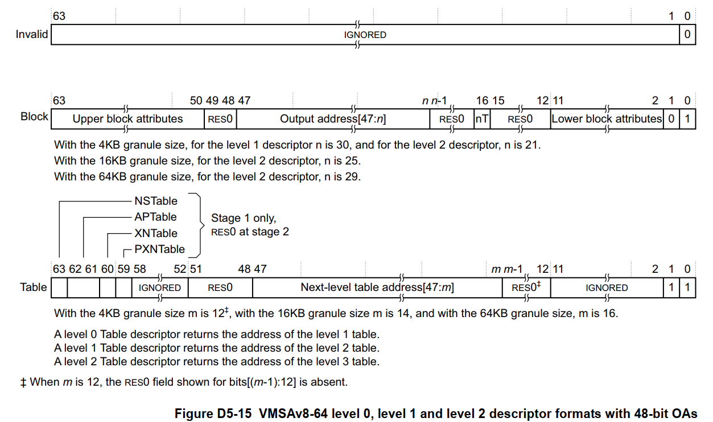
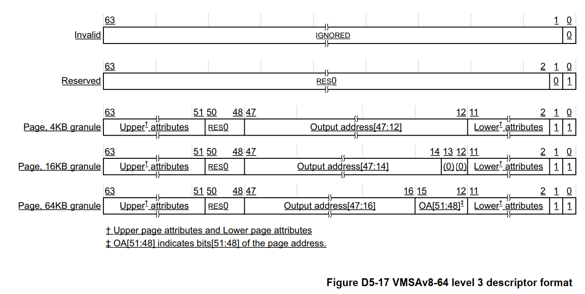

# ARMv8 内存虚拟化

时间：2023.7.28

作者：汪文韬

## 简介

地址转换的单个阶段的目标是将 Input Address（IA）映射到 Output Address （OA）。AArch64架构支持两种地址转换机制，一种是单阶段地址转换，一种是两阶段地址转换。

当启用内存虚拟化后，需要使用两阶段地址转换。一个阶段由操作系统控制（stage 1），其将将 Virtual address（VA）映射到 Intermediate physical address（IPA）；另一个阶段则由Hypervisor控制（Stage 2），其将IPA映射到 Physical address（PA）。

## 需要注意的细节

1. 硬件支持的物理地址范围需要通过读取 ID_AA64MMFR0_EL1.PARange 获得，并根据读取结果设置 VTCR_EL2.{PS, T0SZ}；
2. 内存属性需注意 XN 位设置，JAILHOUSE_MEM_EXECUTE 在 jailhouse 中未进行处理；
3. 内存属性需注意 AF 位设置，需要软件进行置位；
4. Hypervisor 映射区域需确保完整。

## Stage 2 translations  

### 相关寄存器

- [SCTLR_EL2](https://developer.arm.com/documentation/ddi0595/2021-06/AArch64-Registers/SCTLR-EL2--System-Control-Register--EL2-?lang=en)：在EL2提供对系统（包括其内存系统）的顶级控制。
  - I, bit [12]：用于EL2访问的指令访问可缓存性控制。
  - C, bit [2]：用于EL2访问的数据访问可缓存性控制。
  - M, bit [0]：MMU启用EL2或EL2&0 stage 1 地址转换。

- [HCR_EL2](https://developer.arm.com/documentation/ddi0595/2021-06/AArch64-Registers/HCR-EL2--Hypervisor-Configuration-Register?lang=en)：为虚拟化提供配置控制，包括定义各种操作是否被陷入到EL2。
  - VM, bit [0]：启用虚拟化。在当前安全状态下启用EL2时，为EL1&0转换机制启用 stage 2 地址转换。

- [VTCR_EL2](https://developer.arm.com/documentation/ddi0595/2020-12/AArch64-Registers/VTCR-EL2--Virtualization-Translation-Control-Register?lang=en)：EL1&0地址转换 Stage 2 阶段的控制寄存器。
  - HA, bit [21]：当EL2在当前安全状态下启用时，硬件访问标志在非安全和安全 stage 2 转换中更新。依赖FEAT_HAFDBS。
  - PS, bits [18:16]：stage 2 转换的物理地址大小。需结合ID_AA64MMFR0_EL1.PARange设置。
  - TG0, bits [15:14]：VTTBR_EL2的细粒度。
  - SH0, bits [13:12]：与使用VTTBR_EL2或VSTTBR_EL2的转换表遍历相关联的内存的可共享性属性。
  - ORGN0, bits [11:10]：与使用VTTBR_EL2或VSTTBR_EL2的转换表遍历相关联的内存的外部可缓存性属性。
  - IRGN0, bits [9:8]：与使用VTTBR_EL2或VSTTBR_EL2的转换表遍历相关联的内存的内部可缓存性属性。
  - SL0, bits [7:6]：stage 2 转换查找的起始级别。依赖FEAT_TTST。
  - T0SZ, bits [5:0]：由VTTBR_EL2寻址的存储器区域的大小偏移。需结合ID_AA64MMFR0_EL1.PARange设置。

- [VTTBR_EL2](https://developer.arm.com/documentation/ddi0595/2020-12/AArch64-Registers/VTTBR-EL2--Virtualization-Translation-Table-Base-Register)：保存转换表的基地址，用于EL1&0转换机制中地址转换的 stage 2 的初始查找，以及此转换机制的其他信息。
  - BADDR, bits [47:1]：转换表基地址。
-  [ID_AA64MMFR0_EL1](https://developer.arm.com/documentation/ddi0595/2020-12/AArch64-Registers/ID-AA64MMFR0-EL1--AArch64-Memory-Model-Feature-Register-0?lang=en)：提供有关在AArch64状态下实现的内存模型和内存管理支持的信息。
  - PARange, bits [3:0]：支持物理地址范围。

### 描述符格式

参照[Arm Architecture Reference Manual Armv8, for Armv8-A architecture profile](https://developer.arm.com/documentation/ddi0487/fc/)。

#### 转换表

- level 0, level 1, and level 2 描述符格式
  - 
  
- level 3 描述符格式
  - 
  - Page, bits[1]：4KB、16KB或64KB内存页。
  - Valid, bits[0]：有效描述符为1。如果查找返回无效的描述符，则相关联的输入地址将被取消映射，并且任何访问该地址的尝试都会生成转换错误。

#### 内存属性字段

- XN[1:0], bits[54:53]：从不执行字段。
- Contiguous, bit[52]：指示转换表条目是一个或多个连续条目中的一个。
- AF, bit[10]：Access标志位。
- SH, bits[9:8]：可共享性字段。
- S2AP, bits[7:6]：数据访问权限字段。
- MemAttr, bits[5:2]：内存区域属性字段。

#### Hypervisor 映射区域

- hypervisor_memory
- mem_regions
- pci_mmconfig_region
