# 龙芯Loongarch架构研究笔记

wheatfox 2023.9
enkerewpo@hotmail.com

## QEMU环境配置

本机环境：


参考仓库：

[https://github.com/foxsen/qemu-loongarch-runenv](https://github.com/foxsen/qemu-loongarch-runenv)

缺少依赖：`libnettle.so.7`

apt检查libnettle8发现已安装，说明版本过高而缺少7版本的apt安装包（Ubuntu 22的仓库找不到libnettle7）,手动下载deb进行gdebi安装：

```bash
wget http://security.ubuntu.com/ubuntu/pool/main/n/nettle/libnettle7_3.5.1+really3.5.1-2ubuntu0.2_amd64.deb
sudo gdebi libnettle7_3.5.1+really3.5.1-2ubuntu0.2_amd64.deb
```

成功启动Mini Linux：


```bash
Run a loongarch virtual machine.

Syntax: run_loongarch.sh [-b|c|d|D|g|h|i|k|m|q]
options:
b <bios>    use this file as BIOS
c <NCPU>    simulated cpu number
d use -s to listen on 1234 debug port
D use -s -S to listen on 1234 debug port and stop waiting for attach
g     Use graphic UI.
h     Print this Help.
i <initrd> use this file as initrd
k <kernel> use this file as kernel
m <mem> specify simulated memory size
q <qemu> use this file as qemu
```

使用图形启动：


## 测试qemu-loongarch-runenv/devel分支

切换到devel分支，运行：

```bash
docker build -t qemu-la .
docker run -it qemu-la /bin/bash
./setup.sh
./run.sh
```


其会依次进行cross compile工具包下载、qemu编译、tianocore(UEFI)编译、linux-v6.1.4内核编译（编译时均指定target arch为`loongarch64-unknown-linux-gnu`）。

在运行`run.sh`发生`-append未找到错误`，在上一行末尾还需要再手动加一个`\`，如图：


之后就可以启动loongarch64-linux-v6.1.4：


打印一下CPU信息：


## QEMU支持情况

模拟设备CPU: Loongson3A5000

qemu目前实现了virtio设备、PCIe控制器、UART口、实时时钟和电源管理端口。未实现：

1. Address Routing Registers
2. IOCSR只能用iocsr指令访问，不能通过MMIO
3. 部分IOCSR未实现：所有Chip Configuration Register和Legacy Interrupts（手册第4章和第11章）
4. 未实现GPIO
5. 未实现温度传感器
6. 未实现DDR4 SDRAM控制器
7. 未实现HyperTransport控制器
8. 未实现UART1, SPI, I2C

## 中断控制

中断路径: `sources -> level3 -> level 2 -> level 1`

```
- level 1: CPU core interrupt controller(HWI0-HWI7)
- level 2: extended Interrupt controller(extioi_pic in qemu, 256 irqs)
- level 3: LS7A1000 interrupt controller(pch_pic in qemu, 64 irqs; pch_msi, 192 irqs, refer to 7A1000 user manual)
- interrupt sources:
    - 4 PCIE interrupt output connect to pch_pic 16,17,18,19
    - LS7A UART/RTC/SCI connect to pch_pic 2/3/4
```

### 有关CPU核中断控制器

有些CPU产生的中断直接连接本控制器，如Stable Timer、Performance Counter、IPI等。

### 有关拓展IO中断控制

1. 每个拓展IO中断irq被映射到CPU核中断控制器HWI0-7
    - 默认所有256个irq被路由到HWI0(CPU int2)
    - 默认情况下所有irq路由到node 0 core 0
    - 不支持轮转分发
2. qemu实现情况：
    - 表11-6. iocsr 0x420 只实现了读，写无效. EXT_INT_en默认打开
    - 表11-7. 基本上总是enabled
    - 表11-8. 可读写，但不会生效
    - 表11-9, 未实现
    - 表11-10, 实现
    - 表11-12, 实现
    - 表11-13/14/15 基本实现，但不支持轮转

### LS7A1000中断控制器

1. 所有pch-pic irq被映射到extioi_pic irq，使用的是HT Message Interrupt向量（offset `0x200-0x238`），默认所有irq映射到extioi input 0
2. qemu实现情况：
    - offset 0/0x20/0x60/0x80/0x380/0x3a0/0x3e0 实现
    - offset 0x40/0xc0/0xe0/0x100-0x13f, 可读写，但不会生效
    - offset 0x200-0x23f, 默认全零
    - offset 0x300/0x320, 未实现

### 如何打开UART中断

io port at `0x1fe001e0`

1. LS7A1000中断控制器：
    - unmask input pin2 (bit 2 of reg at `0x20`)
    - set edge trigger or level trigger mode(`0x60`)
    - set ht message interrupt vector (byte at offset `0x202` equal the target extioi irq number)
2. 设置extioi
    - enable mapped extioi irq
3. 设置cpu core irq
4. 打开global irq

### 当UART irq触发时的操作

1. 响应cpu中断控制器
    - 需要清除中断源，即下一步的动作
2. 响应extioi中断控制器
    - iocsr `0x1800-`写入1
3. 响应LS7A1000中断控制器
    - 写`1<<irq`到intclr寄存器
4. 接收串口字符

# Loongarch手册笔记

[loongsonlab/qemu](https://gitee.com/loongsonlab/qemu)

[龙芯架构文档](https://loongson.github.io/LoongArch-Documentation/README-CN.html)

[在x86平台体验龙芯LoongArch--使用Qemu-7.2安装LoongArch版的ArchLinux_小菜刀_的博客-CSDN博客](https://blog.csdn.net/mxcai2005/article/details/129631722)

[qemu运行虚拟机无反应，只输出一行提示信息:VNC server running on 127.0.0.1:5900_Imagine Miracle的博客-CSDN博客](https://blog.csdn.net/qq_36393978/article/details/118353939?ydreferer=aHR0cHM6Ly93d3cuZ29vZ2xlLmNvbS8=)

编译安装支持Loongarch64的LLVM16+Clang16（Ubuntu22只能apt安装到14）


[https://github.com/sunhaiyong1978/CLFS-for-LoongArch](https://github.com/sunhaiyong1978/CLFS-for-LoongArch)

[国产loongarch64（龙芯）GCC的初体验](http://www.taodudu.cc/news/show-6268324.html?action=onClick)

之后我下载了官方的cross compile工具包，编译简单的loongarch64程序成功，这里使用的qemu是我自己编译的版本（Github最新release版src），编译时只打开了`qemu-loongarch64`的target。


查看生成的loongarch汇编：


## 要点整理

1. **龙芯架构组成**
    1. 龙芯基础指令集（Loongson Base）
    2. 二进制翻译扩展（LBT）
    3. 向量扩展（LSX）
    4. 高级向量扩展（LASX）
    5. 虚拟化扩展（LVZ）
    
2. 控制状态寄存器（Control and Status Register, **CSR**）
    在实现虚拟化拓展的情况下，处理器中会有两套CSR，一套属于Host，一套属于Guest。

3. **龙芯存储访问类型**
    1. 一致可缓存（Coherent Cached）**CC**
    *最终存储对象+缓存*
    2. 强序非缓存（Strongly-ordered UnCached）**SUC**
    *最终存储对象*
    满足顺序一致性，访存操作依次执行
    3. 弱序非缓存（Weakly-ordered UnCached）**WUC**
    *最终存储对象*
    读访问允许推测执行，写访问则可以内部合并为更大规模，如一个Cache行，之后采用Burst方式写入
    
    其类型在页表项的MAT（Memory Access Type）中标记，龙芯架构要求只有SUC类型的访存指令不能用副作用，即不可推测地执行，通常用于访问IO设备。但是，龙芯架构允许SUC的**取指**操作有副作用。
    
    WUC通常用于加速非缓存内存数据，如显存。
    
4. **原子访存指令**
    AM*, LL, SC
    原子地进行“读+修改+写”操作

5. **同步操作指令**
    龙芯的存储一致性为弱一致性（Weakly Consistency）WC
    使用同步操作保护写共享单元，保证多个处理器核对写共享单元的访问是互斥的
    `dbar`,`ibar`,带有dbar功能的AM原子访存指令,`LL-SC`指令对

6. **龙芯特权架构**
   
    1. 特权等级
    `PLV0-PLV3`，其中`PLV0`权限最高，可以执行特权指令
    `CSR.CRMD.PLV`域指示当前运行在哪个特权等级
    2. CSR访问指令
        1. `csrrd` 将CSR的值写入rd
        2. `csrwr` 将rd的值写入CSR，同时将CSR的旧值写入rd
        3. `csrxchg` 根据rj中的掩码信息，只将rd写入CSR对于掩码为1的位置，其余值不变，同时将CSR的旧值写入rd
    3. 上述指令中需要`csr_num`由14位立即数给出。（0号CSR的csr_num=0，依此类推）
    4. IOCSR访问指令
        1. `iocsrrd` IOCSR采用直接地址映射方式，地址来自寄存器rj
        2. `iocsrwr`
    5. IOCSR寄存器通常可以被多个处理器core同时访问，多个处理器核上的IOCSR访问指令满足顺序一致性（[https://blog.laisky.com/p/sequential-consistent/](https://blog.laisky.com/p/sequential-consistent/)）*sequential consistency*。
    [http://zhangtielei.com/posts/blog-distributed-strong-weak-consistency.html](http://zhangtielei.com/posts/blog-distributed-strong-weak-consistency.html)
    6. CACHE维护指令
    7. TLB维护指令
        1. `tlbsrch` 若未实现LVZ，则使用`CSR.ASID`和`CSR.TLBEHI`的信息去查TLB，如果命中，则将索引写入`CSR.TLBIDX.Index`，将`CSR.TLBIDX`的NE=0，若未命中则NE=1
        2. `tlbrd` 若未实现LVZ，则将`CSR.TLBIDX.Index`作为索引去读TLB
        3. `tlbwr` 若未实现LVZ，将CSR中存放的页表项信息依据`CSR.TLBIDX.Index`存入TLB（CSR.TLBEHI, CSR.TBLELO0, CSR.TLBLO1, CSR.TLBIDX.PS）
        4. `tlbfill`
        5. `tlbclr` 维持TLB与内存页表数据的一致性，依据`CSR.TLBIDX.Index`，当其落入STLB范围时，执行一条tlbclr，将STLB中由Index低位所指示的那一组中的所有路中G=0且ASID=`CSR.ASID.ASID`的页表项无效掉。
        6. `tlbflush` 当Index落在MTLB范围内时，执行tlbflush，将MTLB中所有页表置无效；若落在STLB中则将Index低位所指示的那一组所有路的页表无效掉
        7. `invtlb [op,rj,rk]` ，主要用于无效TLB中的内容，详情见《LoongArch-Vol1-v1.02-CN》P75页操作表格，op=0x0-0x6对应不同的操作。
    8. 软件遍历页表指令
       
       
        | level | CSR |
        | --- | --- |
        | 1 | `CSR.PWCL.PT` |
        | 2 | `CSR.PWCL.Dir1` |
        | 3 | `CSR.PWCL.Dir2` |
        | 4 | `CSR.PWCL.Dir3` |
        1. `lddir [rd,rj,level]` level指定当前访问的是哪一级页表
            1. 若rj[6]=0，此时rj中是level级页表的基址的物理地址，并根据当前的TLB重填地址（？）访问level页表，取得level+1级的页表基址。
            2. 若rj[6]=1，则这时一个大页（Huge Page）的页表项，rj的值直接写入rd。
        2. `ldpte [rj.req]` 若rj[6]=0则rj内容是PTE那一级页表的基址的物理地址，根据当前TLB重填地址访问PTE级页表，取回页表项写入对应CSR中，若rj[6]=1则直接将rj中的值转换为最终的页表项格式写入CSR。
    9. 其他指令
        1. `ertn` 从例外处理返回
        2. `dbcl` 进入调试模式
        3. `idle` 处理器核等待，直至被中断唤醒或被复位
    
7. **虚拟地址空间**
    1. 直接地址翻译模式
    物理地址默认等于虚拟地址`[PALEN-1:0]`位
    2. 映射地址翻译模式
        1. 直接映射地址翻译模式
        配置映射窗口
        `CSR.DMW0`-`CSR.DMW3`寄存器
        虚地址的`[PALEN-1:0]`位与物理地址一致，但高位需要和配置窗口寄存器中的`VSEG`域相等。
        2. 页表映射地址翻译模式
    
8. **页表映射存储管理**
    1. 包含两种TLB：STLB和MTLB，前者页大小一致（`CSR.STLBPS`的PS域配置），后者每一个页表项对应的页可以不一样大。
    2. STLB多路组相联、MTLB全相联。
       
        
        
    3. 页表项奇偶共用，即不保存奇偶位置，由虚页号最低位判断。
    4. TLB相关例外：
        1. **TLB重填例外**
        访存的虚地址在TLB中没找到，进行TLB重填
        2. **load操作页无效例外**
        load操作找到了但V=0
        3. **store操作页无效例外**
        store操作找到了但V=0
        4. **取指操作无效例外**
        取指找到了但V=0
        5. **页特权等级不合规例外**
        V=1但特权不合规
        6. **页修改例外**
        store且V=1，特权合规，但D=0
        7. **页不可读例外**
        load且V=1，特权合规，但NR=1
        8. **页不可执行例外**
        取指且V=1，特权合规，但NX=1
    5. TLB的初始化 - `invtlb r0.r0`
       
        
        
        
        
    
9. **例外与中断**
    1. **中断**
        1. 中断类型
        1个核间中断（IPI），1个定时器中断（TI），1个性能检测计数溢出中断（PMI），8个硬中断（HWI0-HWI7），2个软中断（SWI0-SWI1）。
        2. 中断号越大优先级越高
        3. 中断入口
        在计算入口地址时，中断对应的例外号=自身的中断号+64，中断信号被采样至`CSR.ESTAT.IS`域。
    2. **例外**
        1. TLB重填例外入口来自`CSR.TLBRENTRY`
        2. 机器错误例外入口来自`CSR.MERRENTRY`
        3. 其他例外称为普通例外，入口地址为“入口页号|页内偏移“的计算方式（按位或），入口页号来自`CSR.EENTRY`
        入口偏移=
        4. 例外优先级：中断大于例外、取指阶段产生的优先级最高、译码次之、执行次之。
    
10. **控制状态寄存器一览表**


1. 虚拟化LVZ拓展部分暂未公开文档

## 龙芯架构手册发现的一些问题

1. 在小节2.1.7存储访问类型开头，P10，第四段，”即此类指令不可推测的执行“，”的“应为”地“。（LoongArch-Vol1-v1.02-CN）
2. 在小节4.2.4.5中，“所有路中等于G=0”应去掉”等于“。
3. 在小节4.2.5.2 LDPTE中， 指令格式处的 req 应为 seq。

# 龙芯CPU手册（LS3A5000）

1. **芯片配置寄存器**

   1. 基址为`0x1fe0_0000`，也可以使用IOCSR指令进行访问
   2. 版本寄存器 `0x0000`
   3. 芯片特性寄存器 `0x0008`
   4. 功能设置寄存器 `0x0180`
   5. 引脚驱动设置寄存器 `0x0188`
   6. 功能采样寄存器 `0x0190`
   7. 频率配置寄存器 `0x01B0`
   8. 路由设置寄存器 `0x0400`
   9. 其他功能 `0x0420` 包括JTAG, LA132, Stable Clock, extioi等

2. **软件时钟系统**

   1. Stable Counter
      3A5000中的恒定时钟源，处理器核时钟和结点时钟均来自主时钟，并可以控制分频，而Stable Counter来自输入参考时钟，不随其他时钟频率而变化。

3. **GPIO**

   1. 中断控制寄存器 `0x0510` GPIO中断使能等

4. **处理器核间中断与通信**

5. **IO中断**

   

   1. **传统IO中断**
   2. **拓展IO中断**
      1. 除了兼容原有的传统 IO 中断方式，3A5000 开始支持扩展 I/O 中断，用于将 HT 总线上的 256 位中断直接分发给各个处理器核，而不再通过 HT 的中断线进行转发，提升 IO 中断使用的灵活性。
      2. **扩展 IO 中断与传统 HT 中断处理的区别**
         传统的 HT 中断处理方式下，HT 中断由 HT 控制器进行内部处理，直接映射到 HT 配置寄存器上的 256 个中断向量，再由 256 个中断向量分组产生 4 个或 8 个中断，再路由至各个不同的处理器核。由于采用的是传统的中断线连接，不能直接产生跨片中断，由此所有的 HT IO 中断都只能直接由单个芯片进行处理。另一方面，芯片内硬件分发的中断只是以最终的 4 个或 8 个中断为单位，不能按位处理，由此导致硬件中断分发不好用的问题。
         扩展 IO 中断方式，HT 中断由 HT 控制器直接发给芯片的中断控制器进行处理，中断控制器能直接得到 256 位中断，而不是之前的 4 个或 8 个中断，这 256 位中断每一位都可以独立路由，独立分发，而且可以实现跨片的分发及轮转。

6. 低速IO控制器

   1. UART控制器

      1. UART0 `0x1fe001e0`
      2. UART1 `0x1fe001e8`

   2. SPI控制器

   3. I2C控制器等

# sysHyper平台移植Loongarch

rust目前已支持loongarch*-unknown-none的target，这也是我们的目标架构。

[Loongarch Rust编译器](http://www.loongnix.cn/zh/toolchain/Rust/)

[loongarch*-unknown-none* - The rustc book](https://doc.rust-lang.org/rustc/platform-support/loongarch-none.html)

首先导出一份自定义的target JSON：

```bash
rustc -Z unstable-options --target=loongarch64-unknown-none-softfloat --print target-spec-json > loongarch64.json
```

下一步则需要将代码中aarch64相关的代码用loongarch体系结构重写，并用rust的cfg进行target控制。

## Jailhouse Hypervisor


## sysHyper

### config.rs

`HvResult` - 对`Result`的包装，包含`HvError`

`HvError` - sysHyper的错误信息：

```rust
pub struct HvError {
   num: HvErrorNum,
   loc_line: u32,
   loc_col: u32,
   loc_file: &'static str,
   msg: Option<String>,
}
```

可使用`hv_err`辅助宏打印错误信息。

`HvSystemConfig` - 包含jailhouse等相关信息：

```rust
/// General descriptor of the system.
#[derive(Clone, Copy, Debug)]
#[repr(C, packed)]
pub struct HvSystemConfig {
   pub signature: [u8; 6],
   pub revision: u16,
   flags: u32,

   /// Jailhouse's location in memory
   pub hypervisor_memory: HvMemoryRegion,
   pub debug_console: HvConsole,
   pub platform_info: PlatformInfo,
   pub root_cell: HvCellDesc,
   // CellConfigLayout placed here.
}
```

`HvMemoryRegion` - 用于存储内存区域信息

```rust
#[derive(Clone, Copy, Debug)]
#[repr(C, packed)]
pub struct HvMemoryRegion {
   pub phys_start: u64,
   pub virt_start: u64,
   pub size: u64,
   pub flags: MemFlags,
}
```

`HvCellDesc` - Jailhouse Cell信息

```rust
/// The jailhouse cell configuration.
///
/// @note Keep Config._HEADER_FORMAT in jailhouse-cell-linux in sync with this
/// structure.
#[derive(Clone, Copy, Debug)]
#[repr(C, packed)]
pub struct HvCellDesc {
   signature: [u8; 6],
   revision: u16,

   name: [u8; HV_CELL_NAME_MAXLEN + 1],
   id: u32, // set by the driver
   flags: u32,

   pub cpu_set_size: u32,
   pub num_memory_regions: u32,
   pub num_cache_regions: u32,
   pub num_irqchips: u32,
   pub pio_bitmap_size: u32,
   pub num_pci_devices: u32,
   pub num_pci_caps: u32,

   vpci_irq_base: u32,

   cpu_reset_address: u64,
   msg_reply_timeout: u64,

   console: HvConsole,
}
```

`main.rs`的`main`流程：

1. 检查当前进入的CPU是否为0号primary，若是则进入`primary_init_early`
2. 否则`wait_for_counter(INIT_EARLY_OK<1)`，即等待`primary_init_early`完成
  3. `primary_init_early`流程：
     1. `memory::init_heap`
     2. `system_config.check`
     3. `memory::init_frame_allocator`
     4. `memory::init_hv_page_table`
     5. `cell::init`
4. 所有CPU等待是否全部CPU均初始化完成
5. 若上一条成功，则CPU0进入`primary_init_late`
6. 其他同上，等待CPU0完成
   1. `primary_init_late`目前内部无操作
7. 运行`gicv3_cpu_init`
8. 运行`cpu_data.activate_vmm`（每个CPU都进入）
   1. `PerCpu::return_linux`
      1. `vmreturn(PerCpu::guest_reg())`

### tock registers

利用tock registers库可以方便地进行寄存器字段定义。

[tock-registers](https://crates.io/crates/tock-registers)

### hypercall module

`HyperCallCode`，即HyperCall构造函数中的code信息，表示对Hypervisor的操作

```rust
numeric_enum! {
    #[repr(u64)]
    #[derive(Debug, Eq, PartialEq, Copy, Clone)]
    pub enum HyperCallCode {
        HypervisorDisable = 0,
        HypervisorCellCreate = 1,
    }
}
```

`HyperCall`结构，数据成员为cpu_data（`PerCpu`）

```rust
pub struct HyperCall<'a> {
    cpu_data: &'a mut PerCpu,
}
```

`HyperCall`的impl函数成员

```rust
pub fn new(cpu_data: &'a mut PerCpu) -> Self
pub fn hypercall(&mut self, code: u64, arg0: u64, _arg1: u64) -> HvResult // 构造函数
fn hypervisor_disable(&mut self) -> HyperCallResult // Disable
fn hypervisor_cell_create(&mut self) -> HyperCallResult // 创建一个Hypervisor Cell
```

该module下还有一个`arch_send_event`函数，用于向体系结构进行对应的配置，通过`ICC_SGI1R_EL1`寄存器实现。

[ARM GIC（十） GICv3软中断](https://zhuanlan.zhihu.com/p/212546832)

# ARM 体系结构虚拟化

## Overview

ARM® Architecture Reference Manual
ARMv8, for ARMv8-A architecture profile

Chapter D1 The AArch64 System Level Programmers’ Model

1. **异常等级模型(Exception Level Model)**
    1. `EL0` 应用程序
    2. `EL1` OS内核
    3. `EL2` Hypervisor
    4. `EL3` Secure Monitor
2. **Security State**
   
    1. `Secure State` - 此时PE可以访问安全和非安全的物理地址空间
    2. `Non-secure State` - PE只能访问非安全物理地址空间，不能访问Secure System Control相关资源
3. 整体结构
    1. 如下图
       
        
    
4. **虚拟化**
    1. 硬件实现需要支持EL2
    2. 虚拟机运行于Non-secure EL1, Non-secure EL0（分别对应OS和Application）
    3. Hypervisor给每个虚拟机分配VMID(Virtual Machine Identifier)
    4. EL2提供：
        1. 一些Identification Registers的虚拟值（给Guest OS）
        2. 在许多场景下Trap，如内存相关、访问寄存器，此时Trap会进入EL2
        3. 中断路由：
            1. 路由给当前的Guest OS
            2. 路由给当前没在运行的Guest OS
            3. 路由给Hypervisor
    5. Stage 2转换
        1. `Stage 1` 将Virtual Address转化为Intermediate Physical Address（VA→IPA）
        2. `Stage 2` 将IPA转化为Physical Address（IPA→PA）
5. **虚拟中断**
    1. SError → Virtual SError
    2. IRQ → Virtual IRQ
    3. FIQ → Virtual FIQ
    4. 启动虚拟中断：`HCR_EL2.{FMO,IMO,AMO}`的routing control bit → 1
    5. 虚拟中断：Non-secure EL0→EL1 / Non-secure EL1→EL1
6. **Saved Program Status Registers(SPSRs)**
   
    1. 用于保存PE状态（当发生异常）
       
        
        
    2. 例如target到EL2的exception，则PE state保存到`SPSR_EL2`，EL1和EL3同理
7. **Exception Link Registers(ELRs)** 用于保存异常返回地址
8. **ESR(Exception Syndrome Register)** 负责指示异常的信息
   
    
    
9. System registers
10. **System Calls**
    1. **SVC(Supervisor Call)**
        1. 运行在EL0的应用程序通过这个指令通知EL1（发送Supervisor Call exception）
    2. **HVC(Hypervisor Call)**
        1. 当在Non-secure EL1或更高等级运行时，可以通过该指令通知EL2（发送Hypervisor Call exception）
    3. **SMC(Secure Monitor Call)**
        1. 当运行在EL1或更高等级时，该指令可以通知EL3（Secure Monitor Call exception）

## ARM PSCI

Arm Power State Coordination Interface Platform Design Document


[ARM系列 -- PSCI - 极术社区 - 连接开发者与智能计算生态](https://aijishu.com/a/1060000000297005)

下面的function功能翻译来自上面的技术博客

- `PSCI_VERSION`：可以调用此API得到当前PSCI的版本信息；
- `CPU_SUSPEND`：OSPM调用此API使处理器核进入低功耗模式；
- `CPU_OFF`：此API用于hotplug，从系统中动态移除某个处理器核。被CPU_OFF移除的处理器核只能通过CPU_ON再次加载。与CPU_SUSPEND不同的是，这个接口函数不需要返回值；
- `CPU_ON`：此API用于动态加载处理器核；
- `AFFINITY_INFO`：此API允许调度方查询亲和实体（affinity instance）的状态；
- `MIGRATE`：用于将受信任的操作系统（trusted OS）迁移到另一个处理器核，从而原处理器核可以调用CPU_OFF关闭电源；
- `MIGRATE_INFO_TYPE`：允许调用方识别受信任操作系统中存在的多核支持级别，通过返回值可以判定受信任操作系统是否必须运行在单一处理器上，是否支持迁移；
- `MIGRATE_INFO_UP_CPU`：指示受信任的操作系统当前的位置；
- `SYSTEM_OFF`：系统关闭；
- `SYSTEM_RESET`：系统冷复位；
- `SYSTEM_RESET2`：此API是对SYSTEM_RESET的扩展；
- `MEM_PROTECT`：此API确保内存在交给操作系统加载程序之前被重写，从而提供防止冷重启攻击的保护；
- `MEM_PROTECT_CHECK_RANGE`：此API用于检查某段内存范围是否受MEM_PROTECT保护；
- `PSCI_FEATURES`：此API允许调用方检测已实现的PSCI函数及其属性；
- `CPU_FREEZE`：此API将处理器核设置于低功耗状态（依赖具体设计实现）。与CPU_SUSPEND和CPU_DEFAULT_SUSPEND不同，中断不能唤醒该处理器；与CPU_OFF也不同，不需要迁移；
- `CPU_DEFAULT_SUSPEND`：此API将处理器核设置于低功耗状态（依赖具体设计实现），与CPU_FREEZE的调用参数不同；
- `NODE_HW_STATE`：此API允许直接从电源控制器或电源控制逻辑确定节点的电源状态。与AFFINITY_INFO不同，此API返回电源状态的物理视图；
- `SYSTEM_SUSPEND`：此API相当于CPU_SUSPEND到最深的低功耗状态，但实际系统中有可能实现比CPU_SUSPEND更深的低功耗状态，比如支持RAM挂起；
- `PSCI_SET_ SUSPEND_MODE`：此API允许设置CPU_SUSPEND用于协调电源状态的模式；
- `PSCI_STAT_RESIDENCY`：此API返回自冷启动后平台处于某个电源状态的时间；
- `PSCI_STAT_COUNT`：此API返回自冷启动后平台使用某个电源状态的次数；

## ARM SCMI

Arm® System Control and Management Interface Platform Design Document

[ARM系列 -- SCMI - 极术社区 - 连接开发者与智能计算生态](https://aijishu.com/a/1060000000300745?eqid=fd4b5abf000a80f50000000664816b13)

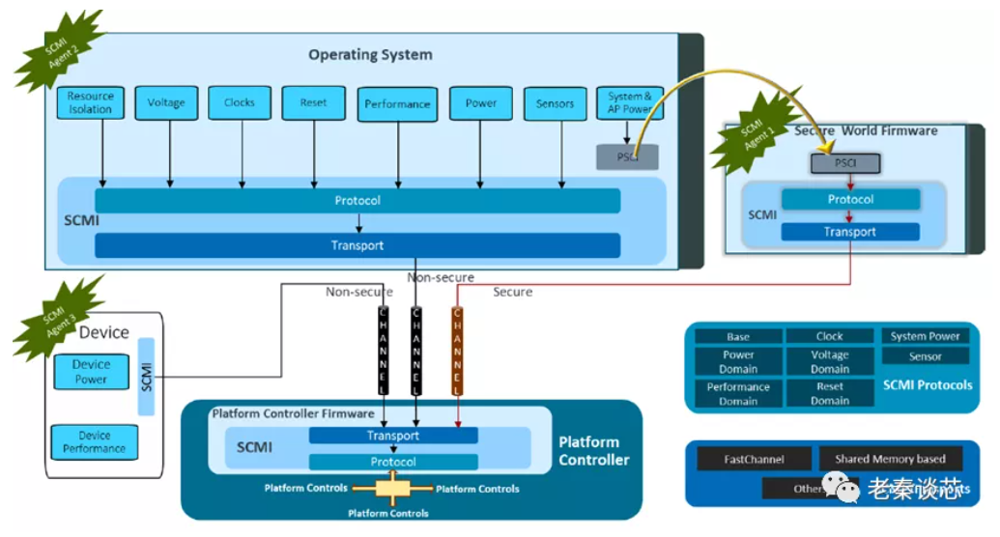

[ARM SCP入门-AP与SCP通信-电子发烧友网](https://www.elecfans.com/d/2184468.html)

1. 包含协议层和传输层
    1. Protocol
    2. Transport
2. OS通常为agent，SCP为platform，**SCP(System Control Processor)** 是一个协处理器，专门负责电源等系统管理。
3. 包含协议：
    1. Base Protocol - 指示协议的基本信息，如实现了哪些协议，当前有哪些agents等
    2. Power Domain Management Protocol - 管理电源域的电源状态（Power State）
    3. System Power Management Protocol - 管理系统关闭、重置、暂停等。
    4. Performance Domain Management Protocol - 管理性能域（Performance Domain）
    5. Clock Management Protocol - 管理时钟相关
    6. Sensor Management Protocol - 管理传感器
    7. Voltage Domain Management Protocol - 管理电压域的电压值（Voltage Level）
    8. Power Capping and Monitoring Protocol - 管理功耗限制
        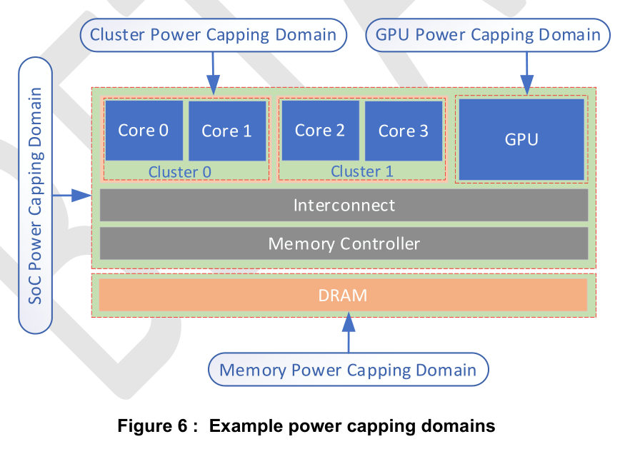
    9. Pin Control Protocol - 引脚管理
        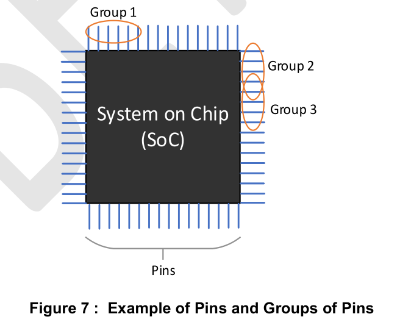


## GICv3

GICv3 and GICv4 Software Overview

[GIC 中断虚拟化](https://zhuanlan.zhihu.com/p/535997324)

1. **基本概念**
   
    
    
    1. **SPI** (Shared Peripheral Interrupt) - 一种全局外围中断，可以路由到指定PE，或到一组PEs
    2. **PPI** (Private Peripheral Interrupt) - 某个PE自身的外围中断，如Generic Timer
    3. **SGI** (Software Generated Interrupt) - 软件写SGI寄存器触发
       
        
        
    4. **LPI** (Locality-specific Peripheral Interrupt) - *message-based*中断
       
        
        
        
        
    5. 一个中断路由示例
    6. **Distributor** (`GICD_*`)
       
        1. SPI的中断优先级配置
        2. SPI开关配置
        3. 生成message-based SPIs
        4. 控制active和pending的SPIs
        5. …
    7. **Redistributors** (`GICR_*`)
       
        1. SGI和PPI的开关配置
        2. SGI和PPI优先级配置
        3. SGI和PPI分组
        4. …
    8. **CPU interfaces** (`ICC_*_ELn`)
       
        1. 打开中断处理的相关配置
        2. 接收中断
        3. 设置PE中断抢占策略
        4. 选择PE最高优先级的pending中断
        5. …
2. **GICv3虚拟化相关**
   
    
    
    
    
    1. CPU Interface
        1. Physical CPU interface (`ICC_*_ELn`)
        2. Virtualization Control (`ICH_*_EL2`)
        3. Virtual CPU interface (`ICV_*_ELn`)
	    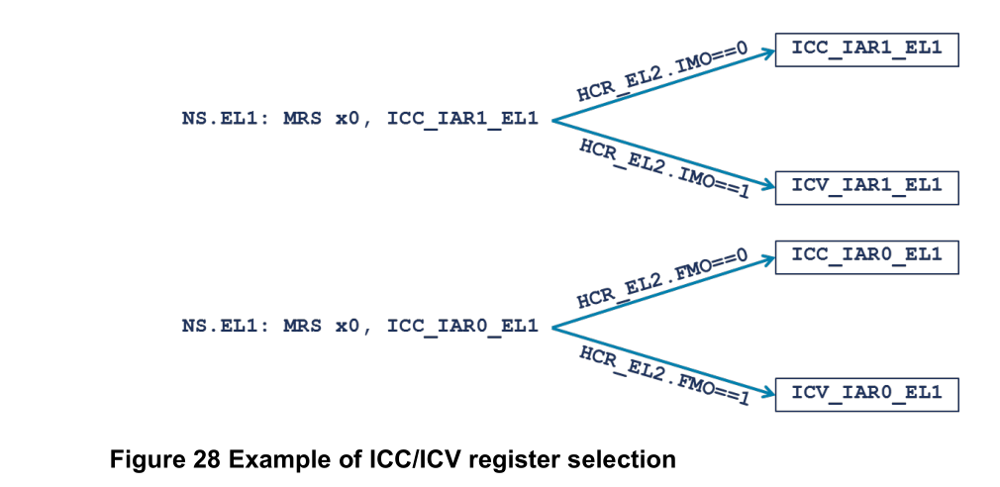
    2. 通过配置 `HCR_EL2.IMO` 项，可以控制NS.EL1级别运行的程序访问` ICC_IAR1_EL1`时取得的是物理值还是虚拟值。
        

# rust-shyper 学习记录

由于rust-shyper相关文档过少，目前首先进行qemu平台的运行尝试

## QEMU

### 编译rust-shyper

首先编译rust-shyper

```bash
make qemu
```


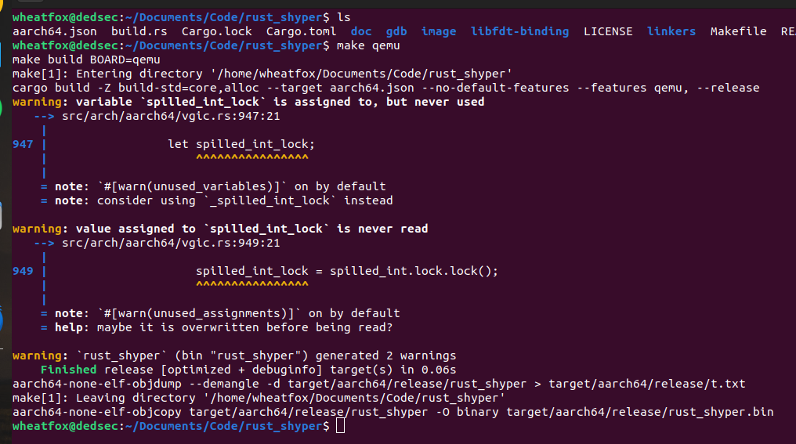

通过阅读MAKEFILE，可以得知其需要一个rootfs img，即`vm0.img`，需要注意的是，rust-shyper中存在MVM（Managerment VM）的概念，这个MVM系统可以通过加载shyper内核模块，和shyper进行交互，方便地进行控制，其独占0号处理器，且虚拟机号为0

https://blog.csdn.net/zhuwade/article/details/127173739

https://wiki.beyondlogic.org/index.php?title=Cross_Compiling_BusyBox_for_ARM

### 制作rootfs

这里我采用busybox编译一个rootfs，首先去官网下载最新源码，我在menuconfig中打开了 `Build Options / Build static library (no shared libs)` 选项，之后进行编译和rootfs配置

```bash
make ARCH=aarch64 CROSS_COMPILE=aarch64-linux-gnu- menuconfig
make ARCH=aarch64 CROSS_COMPILE=aarch64-linux-gnu- CONFIG_PREFIX=../build install -j8
```

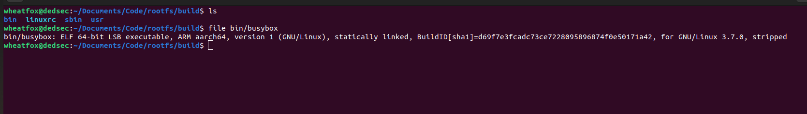

```bash
cd ../build
mkdir -p dev etc home lib mnt proc root sys tmp var
vim etc/inittab
::sysinit:/etc/init.d/rcS
::respawn:-/bin/sh
::askfirst:-/bin/sh
::cttlaltdel:/bin/umount -a -r

chmod 755 etc/inittab
mkdir -p etc/init.d/
vim etc/init.d/rcS
/bin/mount -a

mkdir -p /dev/pts
mount -t devpts devpts /dev/pts
echo /sbin/mdev > /proc/sys/kernel/hotplug
/sbin/mdev -s
chmod 755 etc/init.d/rcS

vim etc/fstab
#device mount-point type option dump fsck
proc  /proc proc  defaults 0 0
temps /tmp  rpoc  defaults 0 0
none  /tmp  ramfs defaults 0 0
sysfs /sys  sysfs defaults 0 0
mdev  /dev  ramfs defaults 0 0

cd dev
sudo mknod console c 5 1
sudo mknod null c 1 3
```

之后创建一个ext4 img，并把上面配置好的busybox system root放进去，作为`vm0.img`

```bash
dd if=/dev/zero of=vm0.img bs=4k count=2048
mkfs.ext4 vm0.img
tune2fs -c0 -i0 vm0.img
mkdir vm0
sudo mount vm0.img vm0/
sudo cp -a ./build/* ./vm0/
sudo umount vm0
```

### rust-shyper, 启动

复制img到rust-shyper根目录，运行

```bash
make run # qemu simulation
```

可以看到成功启动了rust-shyper和终端

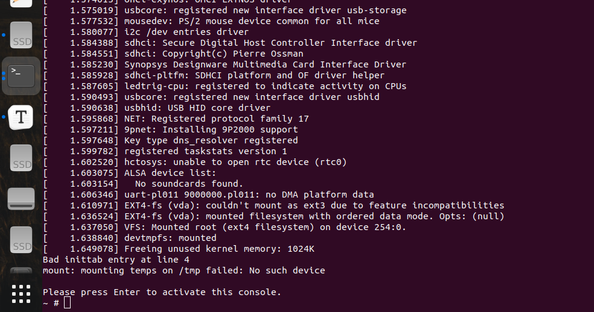

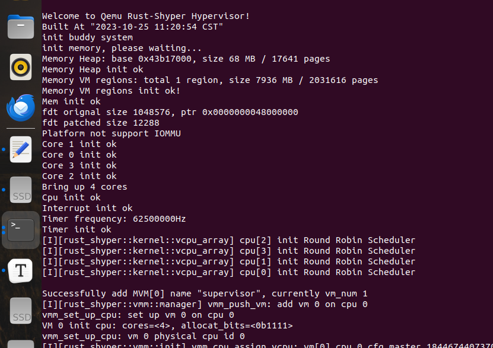

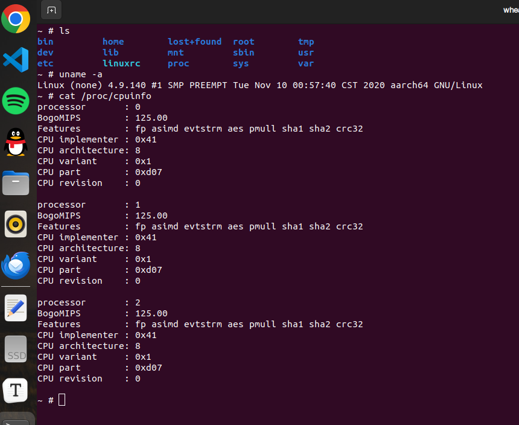

但是当我尝试运行tools下的shyper工具，以及安装kernel mod时却无法安装，rust-shyper仓库中的预编译程序无法正常使用

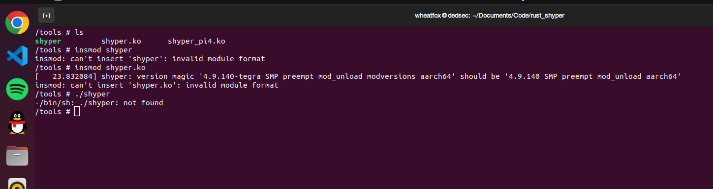

## 树莓派4B

编译面向树莓派4B的rust-shyper

```bash
make pi4
```

### U-Boot

首先编译uboot

```bash
git clone https://github.com/u-boot/u-boot
cd u-boot
export CROSS_COMPILE=aarch64-linux-gnu-
make distclean
make rpi_4_defconfig
make -j8
```

将编译生成的`uboot.bin`放入树莓派启动SD卡的boot分区

```
# Two partitions for SD card
/boot  FAT32
/      EXT4
```

插入SD卡（USB读卡器）到电脑

```bash
sudo dmesg | tail
```

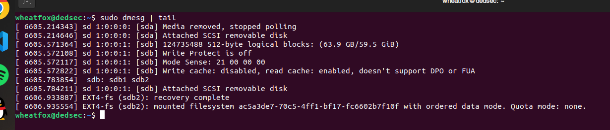

 可以看到SD卡挂载到了`sdb`，接下来进行分区删除和新建，fdisk指令可参考https://hechao.li/2021/12/20/Boot-Raspberry-Pi-4-Using-uboot-and-Initramfs/

```bash
sudo fdisk /dev/sdb
```

我给`/boot`分区分了256MB，剩下的空间作为`/`

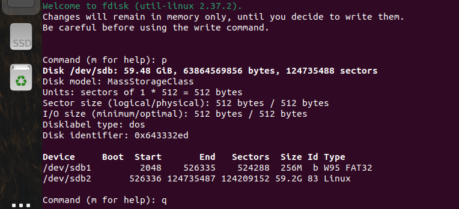

接下来对分区进行格式化

```bash
sudo mkfs.vfat -F 32 -n boot /dev/sdb1
sudo mkfs.ext4 -L root /dev/sdb2
```

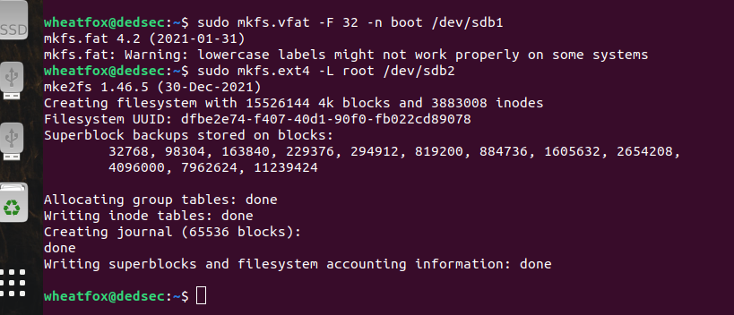

挂载分区

```bash
sudo mkdir /mnt/boot /mnt/root
sudo mount /dev/sdb1 /mnt/boot
sudo mount /dev/sdb2 /mnt/root
```

```bash
cd /mnt/boot
sudo wget https://raw.githubusercontent.com/raspberrypi/firmware/master/boot/bcm2711-rpi-4-b.dtb -o /mnt/bcm2711-rpi-4-b.dtb
sudo wget https://raw.githubusercontent.com/raspberrypi/firmware/master/boot/start4.elf -o /mnt/start4.elf
sudo wget https://raw.githubusercontent.com/raspberrypi/firmware/master/boot/bootcode.bin -o /mnt/bootcode.bin
sudo touch config.txt # modified later
# copy u-boot.bin into /boot as well
```

https://www.raspberrypi.com/documentation/computers/config_txt.html

树莓派使用`/boot/config.txt`文件来代替传统的BIOS启动配置，修改`/boot/config.txt`如下

```
arm_64bit=1

[all]
kernel=u-boot.bin
enable_uart=1
core_freq=500
```

https://zhuanlan.zhihu.com/p/92689086

把之前制作的busybox rootfs同理，复制到`/mnt/root`中

```bash
sudo cp -a /home/wheatfox/Documents/Code/rootfs/build/* /mnt/root # replace the first path to your busybox build dir
```

全都做好了之后，卸载SD卡，上板启动

```bash
sudo umount /mnt/boot
sudo umount /mnt/root
```

成功启动uboot

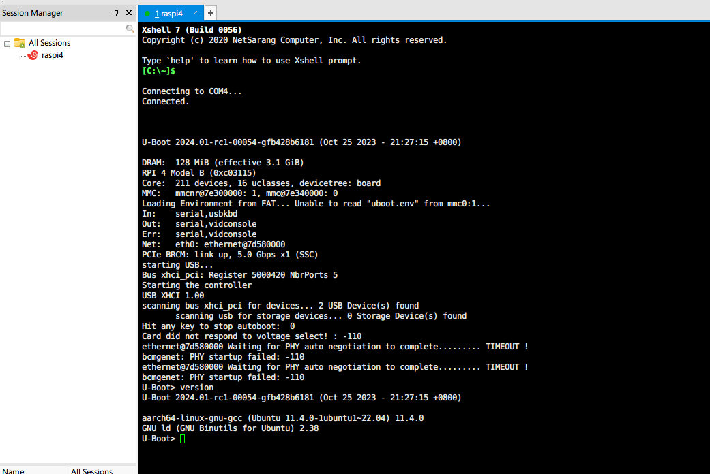

> **动态启动内核**
>
> 启动树莓派进入uboot命令行，这时我们还没有加载任何“实际的OS内核”，又因为每次修改内核后重新拔出SD卡写入再插回去太繁琐，而uboot可以通过网络动态加载位于开发机的最新kernel，提高效率。

https://stdrc.cc/post/2021/02/23/u-boot-qemu-virt/
https://stackoverflow.com/questions/39767332/embedded-linux-arm-booting-address/39779338#39779338

```bash
sudo apt install u-boot-tools
# mkimage -A arm64 -T kernel -C none -a 0x40000000 -e 0x40000000 -d rust_shyper Image

cat << EOF > boot_cmd.txt
fatload mmc 0:1 \${kernel_addr_r} Image # load rust-shyper image
setenv bootargs "console=serial0,115200 console=tty1 root=/dev/mmcblk0p2 rw rootwait init=/bin/sh"
booti \${kernel_addr_r} - \${fdt_addr}
EOF

mkimage -A arm64 -O -T script -C none -d boot_cmd.txt boot.scr
sudo cp boot.scr /mnt/boot/
```

暂未成功通过uboot启动rust-shyper，研究中

### baremetal

接下来尝试不使用uboot，直接在树莓派上启动rust-shyper

#### 树莓派4B启动流程

1. **First Stage Bootloader** (ROM)
   只读，用于挂载SD卡的FAT32分区
2. **Second Stage Bootloader** (`bootcode.bin`)
   该阶段会从SD上检索GPU固件，并将固件写入GPU并启动
3. **GPU Firmware** (`start.elf`)
   GPU启动后，搜索附加配置文件`config.txt` `fixup.dat`，并配置CPU，之后将用户代码加载至内存
4. **User Code** (`kernel8.img` or custom program)
   即`config.txt`中kernel一项所配置的程序，若不写则使用板子型号对应的默认值

> https://forums.raspberrypi.com/viewtopic.php?t=328000
> There are currently four default kernel load and start addresses:
>
> - `0x8000` for 32-bit kernels ("arm_64bit=1" in config.txt not set)
> - `0x80000` for older 64-bit kernels ("arm_64bit=1" set, flat image)
> - `0x200000` for newer 64-bit kernels ("arm_64bit=1" set, gzip'ed Linux ARM64 image)
> - `0x0` if "kernel_old=1" set

### QEMU-raspi4b

除此之外，我还试着使用民间的支持树莓派4b的QEMU版本启动rust-shyper-pi4，也没有任何串口输出，根据以上信息，暂时不清楚rust-shyper对树莓派4B是否已经实现了完整支持，关于这一点有待继续研究。

# Loongarch Linux KVM

## 尝试编译运行

虽然目前龙芯LVZ拓展暂时没有公开手册，但龙芯于10月提交了linux kvm部分的源码，其中涉及到体积结构虚拟化的部分，通过阅读源码，可以了解一部分LVZ的设计

https://lwn.net/Articles/938724/ - Add KVM LoongArch support

首先下载loongarch-linux-kvm源码 https://github.com/loongson/linux-loongarch-kvm 注意切换到kvm-loongarch分支


然后确保系统内能够找到loongarch-gcc交叉编译工具集 `loongarch64-unknown-linux-gnu-*`

（下载链接：https://github.com/loongson/build-tools/releases/download/2022.09.06/loongarch64-clfs-6.3-cross-tools-gcc-glibc.tar.xz）

```bash
wget https://github.com/loongson/build-tools/releases/download/2022.09.06/loongarch64-clfs-6.3-cross-tools-gcc-glibc.tar.xz
sudo tar -vxf loongarch64-clfs-6.3-cross-tools-gcc-glibc.tar.xz  -C /opt
export PATH=/opt/cross-tools/bin:$PATH
export LD_LIBRARY_PATH=/opt/cross-tools/lib:$LD_LIBRARY_PATH
export LD_LIBRARY_PATH=/opt/cross-tools/loongarch64-unknown-linux-gnu/lib/:$LD_LIBRARY_PATH
```

编译linux

```bash
git checkout kvm-loongarch
make ARCH=loongarch CROSS_COMPILE=loongarch64-unknown-linux-gnu- loongson3_defconfig
make ARCH=loongarch CROSS_COMPILE=loongarch64-unknown-linux-gnu-
```

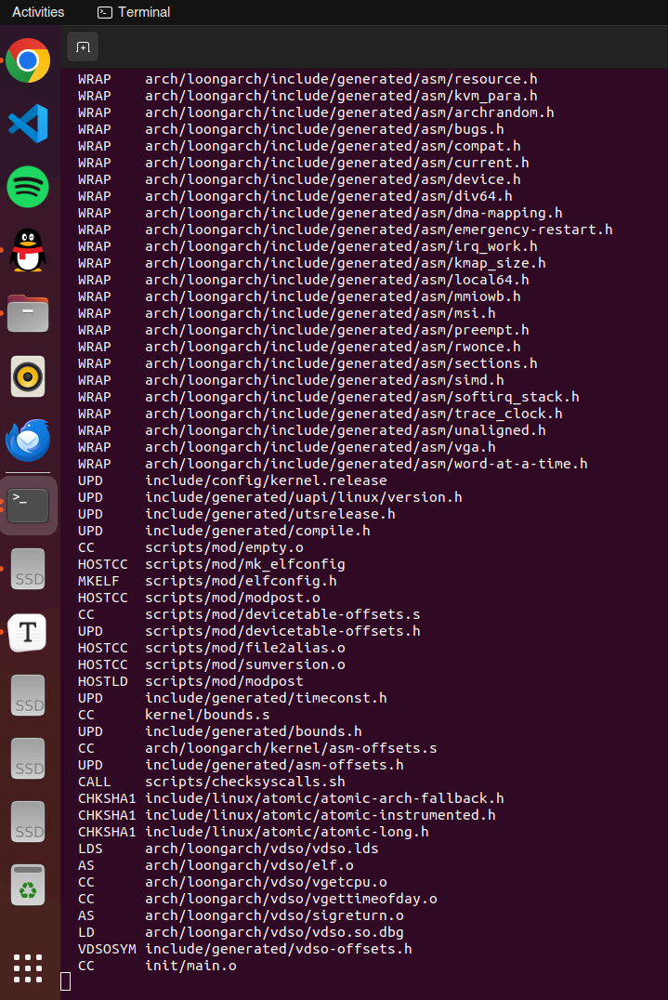

遗憾的是，目前最新的代码似乎还不能正常编译（head=commit-8a9d24f2b0b270c50906564f8ba3dc9d413dc519,https://github.com/loongson/linux-loongarch-kvm/commit/8a9d24f2b0b270c50906564f8ba3dc9d413dc519）

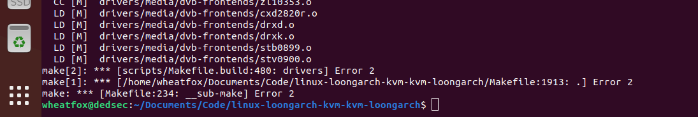

如果需要在QEMU中运行支持linux kvm的龙芯架构版本，需要编译使用龙芯自己的QEMU fork（https://github.com/loongson/qemu），以支持虚拟化

```bash
git checkout kvm-loongarch
./configure --target-list="loongarch64-softmmu"  --enable-kvm
make
```

对应版本的qemu也出现了编译错误：


## 阅读loongarch kvm源码

换一个思路，直接阅读kvm部分的源码，从中找到LVZ相关的设计

```
./arch/loongarch/kvm/*
./arch/loongarch/include/asm/*
```

### kvm/main.c

```C
unsigned long vpid_mask;
struct kvm_world_switch *kvm_loongarch_ops;
static struct kvm_context __percpu *vmcs;
```

`kvm_world_switch`
`kvm_context`

```c
struct kvm_context {
	unsigned long vpid_cache;
	struct kvm_vcpu *last_vcpu;
};

struct kvm_world_switch {
	int (*exc_entry)(void);
	int (*enter_guest)(struct kvm_run *run, struct kvm_vcpu *vcpu);
	unsigned long page_order;
};
```

可以看到`kvm_context`中有一个`kvm_vcpu`

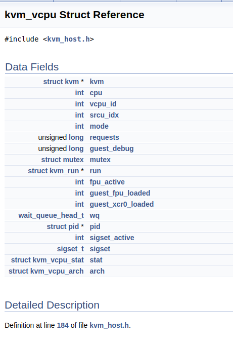

```c
/*
 * The default value of gcsr_flag[CSR] is 0, and we use this
 * function to set the flag to 1 (SW_GCSR) or 2 (HW_GCSR) if the
 * gcsr is software or hardware. It will be used by get/set_gcsr,
 * if gcsr_flag is HW we should use gcsrrd/gcsrwr to access it,
 * else use software csr to emulate it.
 */
static int gcsr_flag[CSR_MAX_NUMS];
```

`gcsr_flag[CSR]`数组涉及到两种赋值——软件模拟/硬件

```c
static inline void set_gcsr_sw_flag(int csr) // 设置对应的CSR为软件模拟模式
static inline void set_gcsr_hw_flag(int csr) // 设置对应的CSR为硬件模式
```

`static void kvm_init_gcsr_flag(void)`函数进行了GCSR的初始化

关键部分，启动硬件虚拟化的函数：

```c
int kvm_arch_hardware_enable(void)
{
	unsigned long env, gcfg = 0;

	env = read_csr_gcfg();

	/* First init gcfg, gstat, gintc, gtlbc. All guest use the same config */
	write_csr_gcfg(0);
	write_csr_gstat(0);
	write_csr_gintc(0);
	clear_csr_gtlbc(CSR_GTLBC_USETGID | CSR_GTLBC_TOTI);

	/*
	 * Enable virtualization features granting guest direct control of
	 * certain features:
	 * GCI=2:       Trap on init or unimplement cache instruction.
	 * TORU=0:      Trap on Root Unimplement.
	 * CACTRL=1:    Root control cache.
	 * TOP=0:       Trap on Previlege.
	 * TOE=0:       Trap on Exception.
	 * TIT=0:       Trap on Timer.
	 */
	if (env & CSR_GCFG_GCIP_ALL)
		gcfg |= CSR_GCFG_GCI_SECURE;
	if (env & CSR_GCFG_MATC_ROOT)
		gcfg |= CSR_GCFG_MATC_ROOT;

	gcfg |= CSR_GCFG_TIT;
	write_csr_gcfg(gcfg);

	kvm_flush_tlb_all();

	/* Enable using TGID  */
	set_csr_gtlbc(CSR_GTLBC_USETGID);
	kvm_debug("GCFG:%lx GSTAT:%lx GINTC:%lx GTLBC:%lx",
		  read_csr_gcfg(), read_csr_gstat(), read_csr_gintc(), read_csr_gtlbc());

	return 0;
}
```

从 https://lwn.net/Articles/938724/ 中也可以得到虚拟化一些信息，如涉及到kvm mmu的虚拟化、standard kvm_interrupt

```c
static int kvm_loongarch_env_init(void)
    
/*
 * PGD register is shared between root kernel and kvm hypervisor.
 * So world switch entry should be in DMW area rather than TLB area
 * to avoid page fault reenter.
 *
 * In future if hardware pagetable walking is supported, we won't
 * need to copy world switch code to DMW area.
 */
order = get_order(kvm_exception_size + kvm_enter_guest_size);
addr = (void *)__get_free_pages(GFP_KERNEL, order);
if (!addr) {
    free_percpu(vmcs);
    vmcs = NULL;
    kfree(kvm_loongarch_ops);
    kvm_loongarch_ops = NULL;
    return -ENOMEM;
}
```

PTE - Page Table Entry
PGD - Page Global Directory

> Linux系统中每个进程对应用户空间的pgd是不一样的，但是linux内核的pgd是一样的。当创建一个新的进程时，都要为新进程创建一个新的页面目录PGD，并从内核的页面目录`swapper_pg_dir`中复制内核区间页面目录项至新建进程页面目录PGD的相应位置，具体过程如下：`do_fork() --> copy_mm() --> mm_init() --> pgd_alloc() --> set_pgd_fast() --> get_pgd_slow() --> memcpy(&PGD + USER_PTRS_PER_PGD, swapper_pg_dir +USER_PTRS_PER_PGD, (PTRS_PER_PGD - USER_PTRS_PER_PGD) * sizeof(pgd_t))`
>
> 这样一来，每个进程的页面目录就分成了两部分，第一部分为“用户空间”，用来映射其整个进程空间（`0x0000 0000`－`0xBFFF FFFF`）即3G字节的虚拟地址；第二部分为“系统空间”，用来映射（`0xC000 0000`－`0xFFFF FFFF`）1G字节的虚拟地址。可以看出Linux系统中每个进程的页面目录的第二部分是相同的，所以从进程的角度来看，每个进程有4G字节的虚拟空间，较低的3G字节是自己的用户空间，最高的1G字节则为与所有进程以及内核共享的系统空间。每个进程有它自己的PGD( Page Global Directory)，它是一个物理页，并包含一个`pgd_t`数组。 关键字：
>
> - PTE:  页表项（page table entry）
> - PGD (Page Global Directory)
> - PUD (Page Upper Directory)
> - PMD (Page Middle Directory)
> - PT (Page Table)
>
> PGD中包含若干PUD的地址，PUD中包含若干PMD的地址，PMD中又包含若干PT的地址。每一个页表项指向一个页框，页框就是真正的物理内存页。

函数调用顺序

```c
// module_init(kvm_loongarch_init);
kvm_loongarch_init
-> kvm_loongarch_env_init
    -> kvm_init_gcsr_flag
-> kvm_init // 不在loongarch/kvm目录下
```

### kvm/switch.S

这一部分主要包含了重要的macro`kvm_switch_to_guest`，并且汇编的最后绑定了上文中的`kvm_enter_guest`的汇编代码入口如下

```assembly
SYM_FUNC_START(kvm_enter_guest)
	/* Allocate space in stack bottom */
	addi.d	a2, sp, -PT_SIZE
	/* Save host GPRs */
	kvm_save_host_gpr a2

	/* Save host CRMD, PRMD to stack */
	csrrd	a3, LOONGARCH_CSR_CRMD
	st.d	a3, a2, PT_CRMD
	csrrd	a3, LOONGARCH_CSR_PRMD
	st.d	a3, a2, PT_PRMD

	addi.d	a2, a1, KVM_VCPU_ARCH
	st.d	sp, a2, KVM_ARCH_HSP
	st.d	tp, a2, KVM_ARCH_HTP
	/* Save per cpu register */
	st.d	u0, a2, KVM_ARCH_HPERCPU

	/* Save kvm_vcpu to kscratch */
	csrwr	a1, KVM_VCPU_KS
	kvm_switch_to_guest
SYM_INNER_LABEL(kvm_enter_guest_end, SYM_L_LOCAL)
SYM_FUNC_END(kvm_enter_guest)
```

### kvm/tlb.c

```c
// SPDX-License-Identifier: GPL-2.0
/*
 * Copyright (C) 2020-2023 Loongson Technology Corporation Limited
 */

#include <linux/kvm_host.h>
#include <asm/tlb.h>
#include <asm/kvm_csr.h>

/*
 * kvm_flush_tlb_all() - Flush all root TLB entries for guests.
 *
 * Invalidate all entries including GVA-->GPA and GPA-->HPA mappings.
 */
void kvm_flush_tlb_all(void)
{
	unsigned long flags;

	local_irq_save(flags);
	invtlb_all(INVTLB_ALLGID, 0, 0);
	local_irq_restore(flags);
}

void kvm_flush_tlb_gpa(struct kvm_vcpu *vcpu, unsigned long gpa)
{
	unsigned long flags;

	local_irq_save(flags);
	gpa &= (PAGE_MASK << 1);
	invtlb(INVTLB_GID_ADDR, read_csr_gstat() & CSR_GSTAT_GID, gpa);
	local_irq_restore(flags);
}
```

注意到里面提到了 GVA->GPA, GPA->HPA 的二级翻译

```
Guest Virtual Address
Guest Physical Address
Hypervisor Physical Address
```

猜测与ARM的stage2翻译类似

### kvm/vcpu.c

`kvm_one_reg`- https://docs.huihoo.com/doxygen/linux/kernel/3.7/structkvm__one__reg.html

```c
struct kvm_one_reg {
    __u64 id;
    __u64 addr;
};
```

`int kvm_vcpu_ioctl_interrupt(struct kvm_vcpu *vcpu, struct kvm_interrupt *irq)`

`kvm_interrupt` - https://docs.huihoo.com/doxygen/linux/kernel/3.7/structkvm__interrupt.html

```c
/* for KVM_INTERRUPT */
struct kvm_interrupt {
    /* in */
    __u32 irq;
};
```

```c
/*
 * kvm_check_requests - check and handle pending vCPU requests
 *
 * Return: RESUME_GUEST if we should enter the guest
 *         RESUME_HOST  if we should exit to userspace
 */
static int kvm_check_requests(struct kvm_vcpu *vcpu)
    
/*
 * Check and handle pending signal and vCPU requests etc
 * Run with irq enabled and preempt enabled
 *
 * Return: RESUME_GUEST if we should enter the guest
 *         RESUME_HOST  if we should exit to userspace
 *         < 0 if we should exit to userspace, where the return value
 *         indicates an error
 */
static int kvm_enter_guest_check(struct kvm_vcpu *vcpu)
    
/*
 * Called with irq enabled
 *
 * Return: RESUME_GUEST if we should enter the guest, and irq disabled
 *         Others if we should exit to userspace
 */
static int kvm_pre_enter_guest(struct kvm_vcpu *vcpu)

/*
 * Return 1 for resume guest and "<= 0" for resume host.
 */
static int kvm_handle_exit(struct kvm_run *run, struct kvm_vcpu *vcpu)
    
int kvm_arch_vcpu_runnable(struct kvm_vcpu *vcpu)
int kvm_arch_vcpu_should_kick(struct kvm_vcpu *vcpu)
bool kvm_arch_vcpu_in_kernel(struct kvm_vcpu *vcpu)
vm_fault_t kvm_arch_vcpu_fault(struct kvm_vcpu *vcpu, struct vm_fault *vmf)
int kvm_arch_vcpu_ioctl_translate(struct kvm_vcpu *vcpu,
				  struct kvm_translation *tr)
int kvm_cpu_has_pending_timer(struct kvm_vcpu *vcpu)
int kvm_arch_vcpu_dump_regs(struct kvm_vcpu *vcpu)
int kvm_arch_vcpu_ioctl_get_mpstate(struct kvm_vcpu *vcpu,
				struct kvm_mp_state *mp_state)
int kvm_arch_vcpu_ioctl_set_mpstate(struct kvm_vcpu *vcpu,
				struct kvm_mp_state *mp_state)
int kvm_arch_vcpu_ioctl_set_guest_debug(struct kvm_vcpu *vcpu,
					struct kvm_guest_debug *dbg)
```

``` c
/**
 * kvm_migrate_count() - Migrate timer.
 * @vcpu:       Virtual CPU.
 *
 * Migrate hrtimer to the current CPU by cancelling and restarting it
 * if the hrtimer is active.
 *
 * Must be called when the vCPU is migrated to a different CPU, so that
 * the timer can interrupt the guest at the new CPU, and the timer irq can
 * be delivered to the vCPU.
 */
static void kvm_migrate_count(struct kvm_vcpu *vcpu)
{
	if (hrtimer_cancel(&vcpu->arch.swtimer))
		hrtimer_restart(&vcpu->arch.swtimer);
}

static int _kvm_getcsr(struct kvm_vcpu *vcpu, unsigned int id, u64 *val)
static int _kvm_setcsr(struct kvm_vcpu *vcpu, unsigned int id, u64 val)
static int kvm_get_one_reg(struct kvm_vcpu *vcpu,
		const struct kvm_one_reg *reg, u64 *v)
static int kvm_get_reg(struct kvm_vcpu *vcpu, const struct kvm_one_reg *reg)
static int kvm_set_one_reg(struct kvm_vcpu *vcpu,
			const struct kvm_one_reg *reg, u64 v)
static int kvm_set_reg(struct kvm_vcpu *vcpu, const struct kvm_one_reg *reg)
int kvm_arch_vcpu_ioctl_get_sregs(struct kvm_vcpu *vcpu, struct kvm_sregs *sregs)
int kvm_arch_vcpu_ioctl_set_sregs(struct kvm_vcpu *vcpu, struct kvm_sregs *sregs)
int kvm_arch_vcpu_ioctl_get_regs(struct kvm_vcpu *vcpu, struct kvm_regs *regs)
int kvm_arch_vcpu_ioctl_set_regs(struct kvm_vcpu *vcpu, struct kvm_regs *regs)
static int kvm_vcpu_ioctl_enable_cap(struct kvm_vcpu *vcpu,
				     struct kvm_enable_cap *cap)
long kvm_arch_vcpu_ioctl(struct file *filp,
			 unsigned int ioctl, unsigned long arg)
int kvm_arch_vcpu_ioctl_get_fpu(struct kvm_vcpu *vcpu, struct kvm_fpu *fpu)
int kvm_arch_vcpu_ioctl_set_fpu(struct kvm_vcpu *vcpu, struct kvm_fpu *fpu)
/* Enable FPU and restore context */
void kvm_own_fpu(struct kvm_vcpu *vcpu)
/* Save context and disable FPU */
void kvm_lose_fpu(struct kvm_vcpu *vcpu)
int kvm_vcpu_ioctl_interrupt(struct kvm_vcpu *vcpu, struct kvm_interrupt *irq)
long kvm_arch_vcpu_async_ioctl(struct file *filp,
			       unsigned int ioctl, unsigned long arg)
int kvm_arch_vcpu_precreate(struct kvm *kvm, unsigned int id)
int kvm_arch_vcpu_create(struct kvm_vcpu *vcpu)
void kvm_arch_vcpu_postcreate(struct kvm_vcpu *vcpu)
void kvm_arch_vcpu_destroy(struct kvm_vcpu *vcpu)
static int _kvm_vcpu_load(struct kvm_vcpu *vcpu, int cpu)
void kvm_arch_vcpu_load(struct kvm_vcpu *vcpu, int cpu)
static int _kvm_vcpu_put(struct kvm_vcpu *vcpu, int cpu)
void kvm_arch_vcpu_put(struct kvm_vcpu *vcpu)
int kvm_arch_vcpu_ioctl_run(struct kvm_vcpu *vcpu)
```

### kvm/interrupt.c

```c
static int kvm_irq_deliver(struct kvm_vcpu *vcpu, unsigned int priority)
static int kvm_irq_clear(struct kvm_vcpu *vcpu, unsigned int priority)
void kvm_deliver_intr(struct kvm_vcpu *vcpu)
int kvm_pending_timer(struct kvm_vcpu *vcpu)
    
/*
 * Only support illegal instruction or illegal Address Error exception,
 * Other exceptions are injected by hardware in kvm mode
 */
static void _kvm_deliver_exception(struct kvm_vcpu *vcpu,
				unsigned int code, unsigned int subcode)
    
void kvm_deliver_exception(struct kvm_vcpu *vcpu)
```

