# Linux initrd机制

时间：2023.11.3

作者：熊思民

## 什么是initrd

`initrd`，英文全称`initial RAM disk`，是一个小型的临时文件系统，在系统引导过程中用于根文件系统被挂载之前的准备工作。

当系统启动的时候，`boot loader`会把`initrd`文件读到内存中，然后把`initrd`文件在内存中的起始地址和大小传递给内核。内核在启动初始化过程中会解压缩`initrd`文件，然后将解压后的`initrd`挂载为根目录，然后执行根目录中的`/linuxrc`脚本（`cpio`格式的`initrd`为`/init`），在这个脚本中加载`realfs`（真实文件系统）、存放设备的驱动程序以及在`/dev`目录下建立必要的设备节点。这样，就可以mount真正的根目录，并切换到这个根目录中来，最后执行`sbin/init`。

## 为什么需要initrd

### 让内核兼容不同存储介质

在早期的linux系统中，一般只有硬盘或者软盘被用来作为linux根文件系统的存储设备，因此也就很容易把这些设备的驱动程序集成到内核中。但是现在的嵌入式系统中可能将根文件系统保存到各种存储设备上，包括scsi、sata，u-disk等等。内核若要兼容所有的存储介质，则要将对应的所有驱动都编译进内核，这会导致内核冗余巨大。
为了解决这一矛盾，于是出现了基于ram disk的initrd。initrd是一个被压缩过的小型根目录，这个目录中包含了启动阶段中必须的驱动模块，可执行文件和启动脚本。内核先挂载initrd，initrd根据当前的硬件环境加载对应的驱动，然后再挂载对应硬件的文件系统。

### 文件系统挂载前可能需要复杂的工作

如挂载网络文件系统前，需要配置网络，此外某些文件系统还需要解压，解密等操作。为保证内核的稳定，我们希望将这些操作实现为应用程序，但是启动应用程序需要内核能访问存储介质，可此时没有尚未挂载文件系统，所以可以先挂载initrd，完成文件系统挂载前的工作，再挂载新文件系统。

## initrd与initramfs

**initrd**
initrd是基于 ram disk 的技术，是基于内存的块设备。因此 initrd 具有块设备的一切属性。

1. initrd 容量固定，一旦创建无法动态调整

2. initrd 需要按照一定的文件系统格式进行组织，因此制作时需要mke2fs这样的工具格式化initrd，访问initrd时需要文件系统驱动

3. initrd 是伪块设备，从内核角度，与真实块设备无区别，所以内核访问 initrd 也使用缓存机制，ram disk上的数据被拷贝到page cache(对于文件数据)和dentry cache(对于目录项)。这导致了内存的浪费，因为initrd本就在内存中。

**initramfs**
在 Linux2.5 内核中被引入。最初的想法是 Linus 提出的：把 cache 当作一个文件系统直接挂载使用。他在一个叫 ramfs 的 cache 实现上加了一层很薄的封装，其它内核开发人员编写了一个改进版 tmpfs，这个文件系统上的数据可以写出到交换分区，而且可以设定一个 tmpfs 装载点的最大尺寸以免耗尽内存。initramfs 就是 tmpfs 的一个应用。
优点:

1. tmpfs随着其中数据的增减自动增减容量

2. 在tmpfs和page cache/dentry cache之间没有重复数据

3. tmpfs重复利用了Linux caching的代码, 因此几乎没有增加内核尺寸, 而caching的代码已经经过良好测试，所以tmpfs的代码质量也有保证

4. 不需要额外的文件系统驱动

## 构建initramfs

### 挂载rootfs

`rootfs`本质上就是一个`ramfs`文件系统。

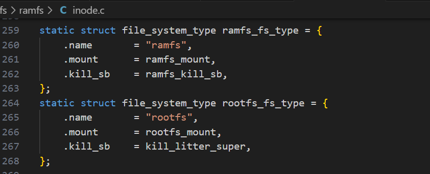

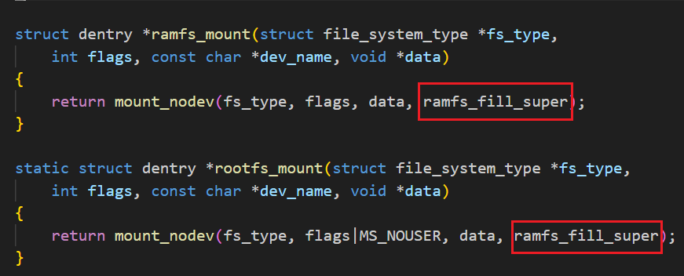

`roofs_mount`创建超级块使用的函数恰恰就是创建`ramfs`文件系统的函数`ramfs_fill_super`，可见`rootfs`就是`ramfs`。

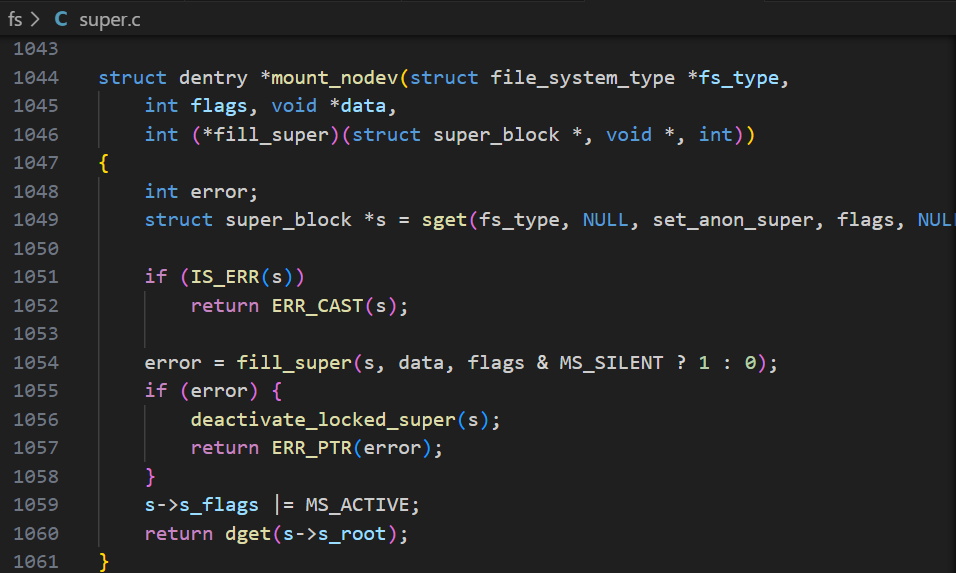

内核引导过程的调用链：
`start_kernel`：内核启动的入口 ->
`vfs_caches_init`：初始化虚拟文件系统 ->
`mnt_init`：初始化虚拟文件系统的挂载点

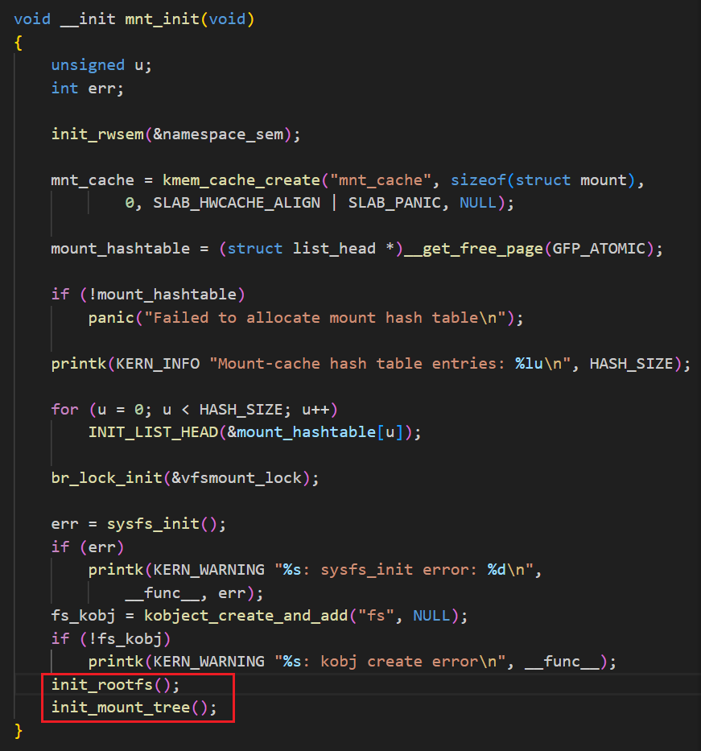

`mnt_init`先调用`init_rootfs`向内核中注册了`rootfs`文件系统：

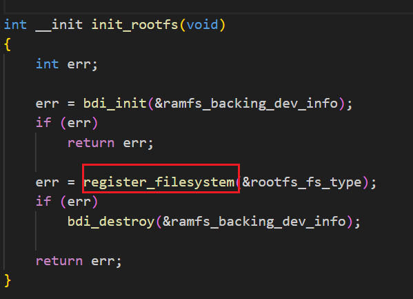

之后调用`init_mount_tree`挂载`rootfs`：


挂载`rootfs`的过程是由`do_kern_mount`来完成的。

### 解压initramfs到rootfs

挂载了`rootfs`后，内核将`Bootloader`加载到内存中的`initramfs`中的文件解压到`rootfs`中。这些文件包含了驱动以及挂载真正的根文件系统的工具。

配置内核支持`initramfs`，内核将编译`initramfs.c`：

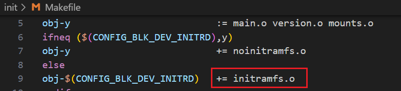

`initramfs.c`中，有如下代码：

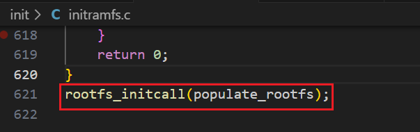

`rootfs_initcall`宏告诉编译器将函数`populate_rootfs`链接在段".initcall"部分。

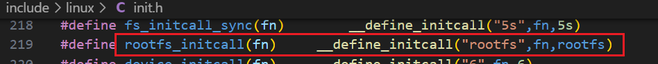

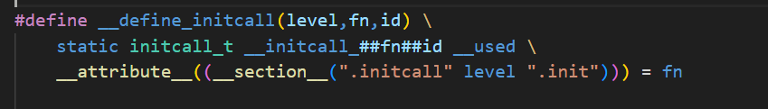

在内核初始化时，函数`do_basic_setup`调用`do_initcalls`，`do_initcalls`调用`do_initcall_levels`，按优先级执行。最终由`do_initcall_levels`调用`do_one_initcall`执行段".initcall"中包含的函数。调用链如下：
`kernel_init`
-> `kernel_init_freeable`
-> `do_basic_setup`
-> `do_initcalls`
-> `do_initcall_level`
-> `do_one_initcall`

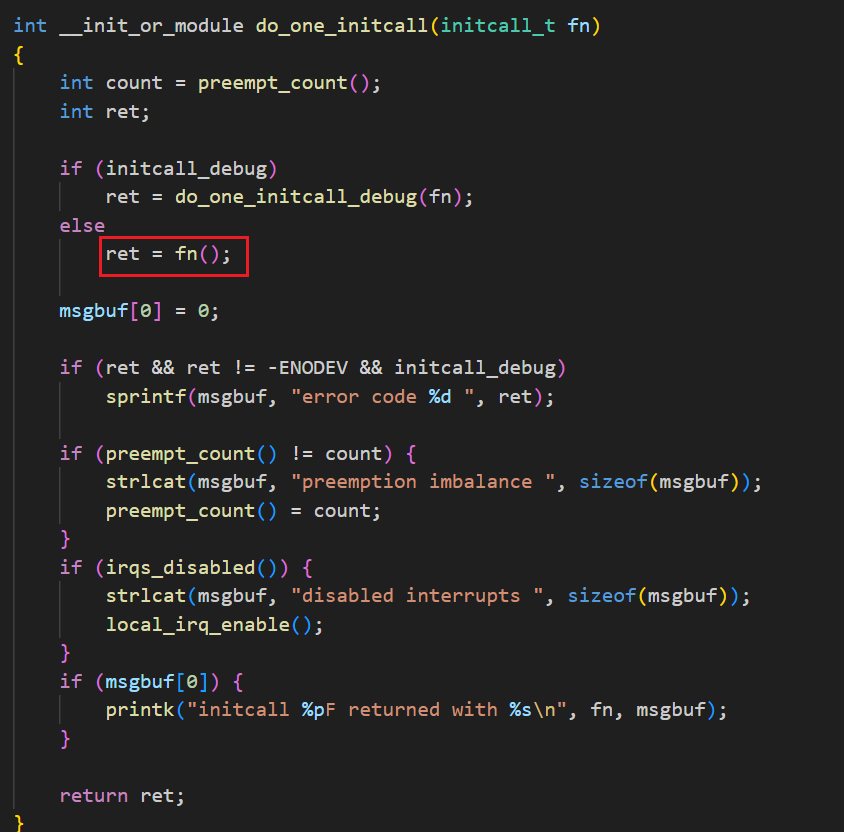

`populate_rootfs`如下所示：

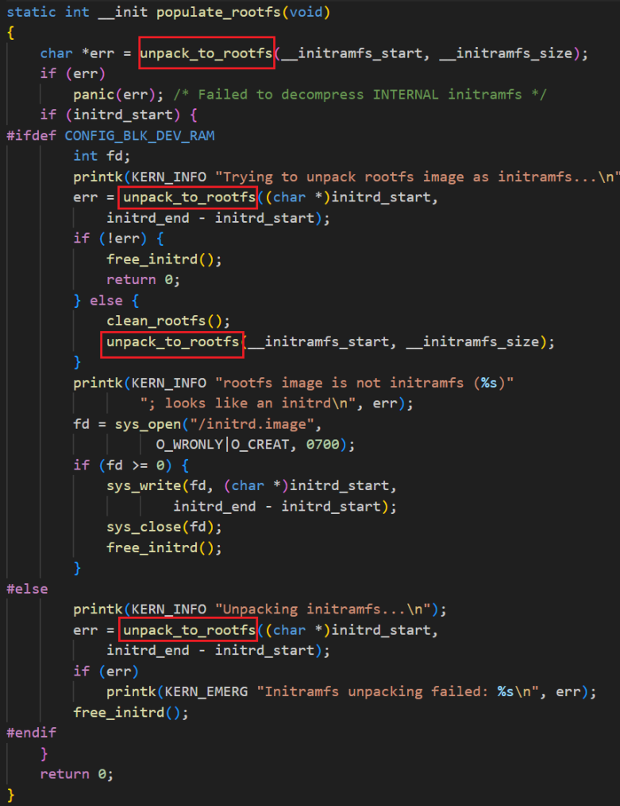

1. 首先调用`unpack_to_rootfs`将内核内置的`initramfs`解压到`rootfs`中
2. 如果`initrd_start`不为0，说明还有一个外部的`initramfs`通过`Bootloader`加载进内存了，内核将这个`initramfs`也解压到`rootfs`中。`CONFIG_BLK_DEV_RAM`对应于使用`ramdisk`机制的情况。

`initramfs`通常作为独立的外部文件存在，由`Bootloader`加载到内存。但内核也支持`initramfs`和内核`image`构建在一起，统一通过内核加载。可通过`menuconfig`配置。

第一次调用`unpack_to_rootfs`是无条件执行的，因为内核会构建一个内置的`initramfs`。

过程如下：

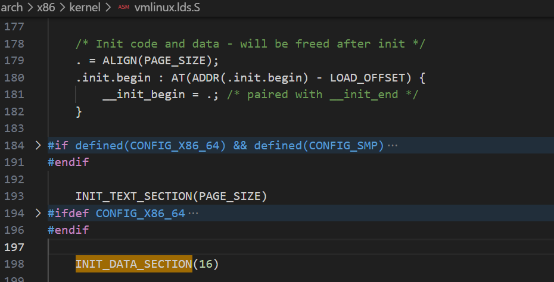

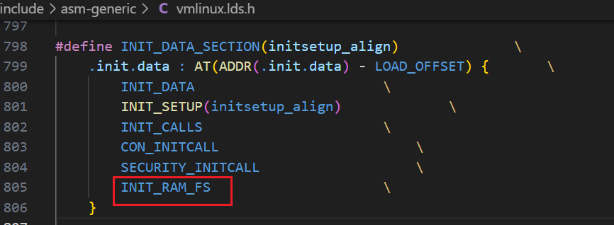

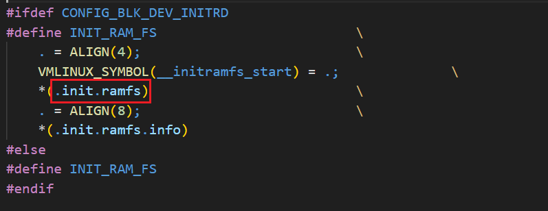

".init.begin:"和".init.end"中的部分代码是用于内核初始化的，在内核初始化完成后就会被释放。

".init.ramfs"段就在这之间，由`__initramfs_start`指向其开头。

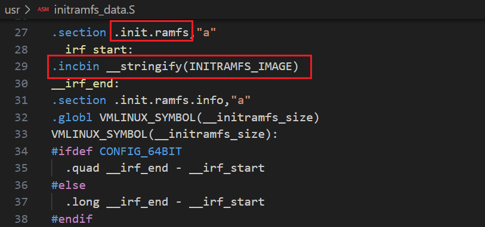

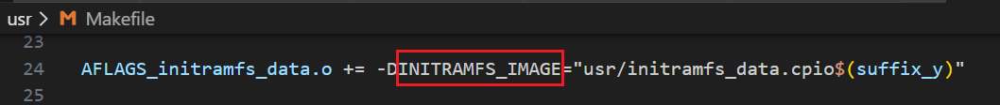

所以".init.ramfs"中的内容就是`initramfs_data.cpio`，下面看看`initramfs_data.cpio`是怎么生成的。


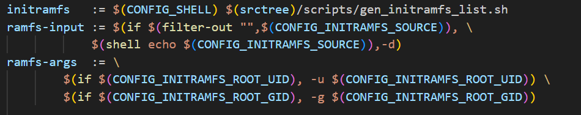

展开大致为：

```shell
sh gen_initramfs_list.sh \
    -o usr/initramfs_data.cpio \
    -u 0 -g 0 \
    /path/to
```

未指定输入源则为-d，调用下面这个函数来生成。


这就是内核构建内置`initramfs`的流程。

即使不支持`initramfs`，内核依然会存在一个`initramfs`。


与支持`initramfs`下生成的内容相同。
这样保证了任何情况下内核都会有一个`initramfs`，这个默认的`initramfs`确保了内核不会因为第一个进程打不开`console`而`panic`。

## 实验

### 配置内核支持并构建基本的initramfs

#### 内核配置

略

#### 构建基本initramfs

```shell
#!/bin/bash

set -xe

[ -e initramfs ] && rm -rf initramfs
mkdir initramfs && cd initramfs

cat > init << EOF
#!/bin/bash
echo "Hello Linux!"
echo "Hello Linux!"
echo "Hello Linux!"
echo "Hello Linux!"
exec /bin/bash
EOF

chmod a+x init

mkdir bin
cp ../sysroot/bin/bash bin/
ldd bin/bash

mkdir lib
cp -d /vita/sysroot/lib/libdl* lib/
cp /vita/sysroot/lib/libc-2.15.so lib/
cp -d /vita/sysroot/lib/libc.so.6 lib/
cp /vita/cross-tool/i686-none-linux-gnu/lib/libgcc_s.so.1 lib/
cp -d /vita/sysroot/lib/ld-* lib/

chown -R root:root .

ldd lib/libdl.so.1
ldd lib/libc.so.6
ldd lib/ld-linux.so.2
ldd lib/libgcc_s.so.1

tree lib

find . | cpio -o -H newc |gzip -9 > /vita/10.initrd.img
cp /vita/10.initrd.img /vita/boot
```

#### GRUB配置

```
menuentry 'vita-10'  {
    set root='(hd0,2)'
    linux  /boot/10.bzImage root=/dev/sda3 ro
    initrd /boot/10.initrd.img
}
```

#### 结果

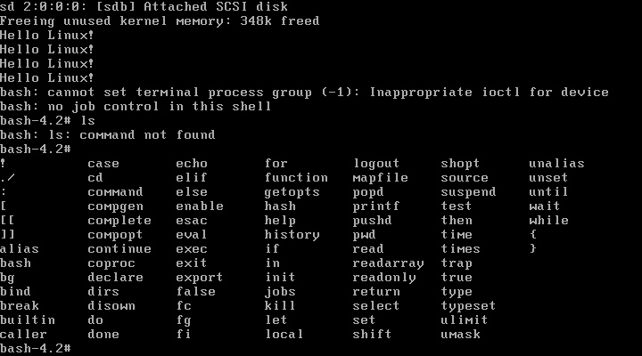

### 配置devtmpfs

#### devtmpfs

devtmpfs就是/dev，用于存放设备文件。在linux早期所有设备节点都是手动事先创建的，为此需要把所有可能的节点一并创建。后面提出了devfs和udev，devfs可以按需创建，udev则直接支持动态创建。
[Article链接](https://lwn.net/Articles/330985/)

简单来说，devtmpfs就是在initramfs中创建一个tmpfs（也可以是ramfs），然后把设备基本都注册一遍，避免了手动创建，同时提高了效率，因为不需要等待完整的冷插拔运行（udev做的，设备越多越慢），缩短了开机时间。
使用mount进行挂载，需在initramfs中安装工具mount。借助util-linux，过程略。（还安装了ls，借助coreutils）

安装完成后在init脚本中添加`mount -n -t devtmpfs udev /dev`

#### 内核配置

略

#### GRUB配置

```
menuentry 'vita-11'  {
    set root='(hd0,2)'
    linux  /boot/11.bzImage root=/dev/sda3 ro
    initrd /boot/11.initrd.img
}
```

#### 结果

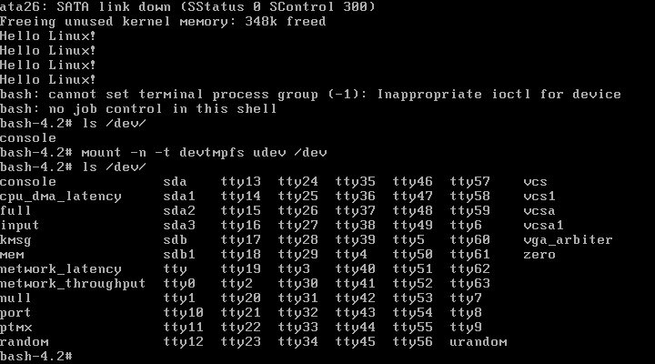

### 将硬盘控制器驱动配置为模块

虚拟机使用的是SATA虚拟磁盘，挂在PCI总线上，使用PCI接口，需要配置内核支持PCI总线。在内核中，SATA设备可能被实现为一个SCSI设备，因此还需配置SCSI。

SATA控制器一般都提供两种模式：Compatibility模式和ACHI模式。内核分别实现了驱动ata_piix和ahci。之前我们直接将这两个驱动编进内核，为了体现initramfs动态加载驱动的作用，我们现在将其配置为模块，之后再有initramfs进行加载。

#### 内核配置

```shell
make bzImage && make modules
make INSTALL_MOD_PATH=$SYSROOT modules_install

# 拷贝进initramfs
mkdir -p /vita/initramfs/lib/modules/3.7.4
cp  -drf  /vita/sysroot/lib/modules/3.7.4 /vita/initramfs/lib/modules/
```

#### 安装模块管理工具

为了加载内核模块，需安装加载、卸载等管理模块的工具。我们借助kmod包进行安装，该包提供insmod、rmmod用于安装和卸载模块，lsmod用于查看已安装模块，modprobe可以检测模块并安装。

lsmod是通过proc和sys获取内核信息的，因此为了使用该命令验证是否安装模块成功，需先挂载proc和sysfs文件系统。同样使用mount挂载即可。

过程略。

#### GRUB配置

```
menuentry 'vita-12'  {
    set root='(hd0,2)'
    linux  /boot/12.bzImage root=/dev/sda3 ro
    initrd /boot/12.initrd.img
}
```

#### 结果

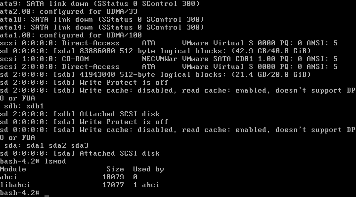

### 挂载根文件系统

#### 准备工作

我为虚拟机添加了一块新磁盘用于挂载。

```shell
fdisk /dev/sdb  # 磁盘分区
mkfs -t ext4 /dev/sdb1 # 对分区格式化
mount /dev/sdb1  /root/rootfs # 挂载
```

修改/etc/fstab以进行自动挂载。

#### 脚本

```shell
#!/bin/bash
echo "Hello Linux!"
echo "Hello Linux!"
echo "Hello Linux!"
echo "Hello Linux!"

export PATH=/usr/sbin:/usr/bin:/sbin:/bin
export ROOTMNT=/root
export ROFLAG=-r
mount -n -t proc proc /proc
mount -n -t sysfs sysfs /sys
mount -n -t devtmpfs udev /dev

for x in $(cat /proc/cmdline); do
    case $x in
    root=*)
        ROOT=${x#root=}
        ;;
    ro)
        ROFLAG=-r
        ;;
    rw)
        ROFLAG=-w
        ;;
    esac
done
mount ${ROFLAG} ${ROOT} ${ROOTMNT}

# must before exec
exec /bin/bash
```

#### GRUB配置

```
menuentry 'vita-13'  {
    set root='(hd0,2)'
    linux  /boot/13.bzImage root=/dev/sdb1 rw
    initrd /boot/13.initrd.img
}
```

#### 结果

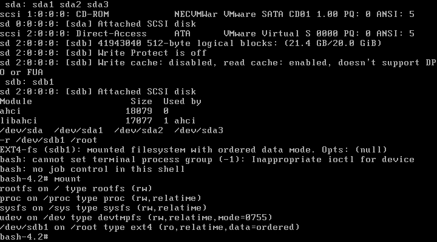

### 切换到根文件系统

1. 删除rootfs文件系统中不再需要的内容，释放内存空间
删除之前要注意：停止正在运行的进程以及将/dev、/proc、/sys目录移动到真正的文件系统上
2. 将根文件系统从”/root“移动到”/“下
3. 更改进程的文件系统namespace，使其指向真正的根文件系统
4. 运行真正文件系统中的init程序