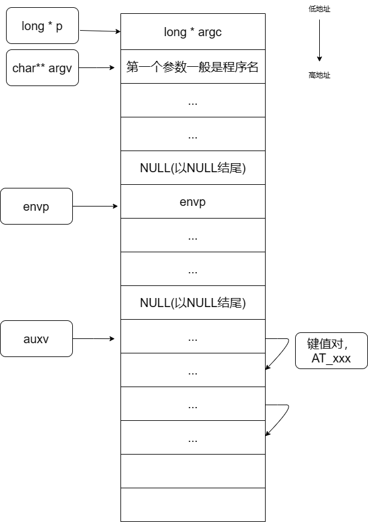

# c程序的启动

本文将以两个阶段介绍c程序的启动：系统到libc，libc到应用代码。前者将会介绍rukos以及linux，后者将会介绍musl以及linux glibc
同时也会介绍启动时的栈的情况

## 系统方面的工作

### rukos中从系统启动到应用main函数

（参考doc/build.md）

#### 编译

通过根目录的makefile进行编译与运行：

`build: $(OUT_DIR) $(OUT_BIN)`

`run: build justrun`

``justrun:$(call run_qemu)``

生成build时，进入scripts/make/build.mk来生成`$(OUT_DIR) $(OUT_BIN)`

具体方式是在build.mk中，调用

```makefile
$(OUT_BIN): _cargo_build $(OUT_ELF)
	$(call run_cmd,$(OBJCOPY),$(OUT_ELF) --strip-all -O binary $@)
```

通过.bin文件，期中cargo_build的规则在cargo.mk中，如果是c程序，还需要进入build_c.mk中获取OUT_ELF（build_c.mk中还会调用对应c程序的axbuild.mk）

得到.bin以及.elf文件后，通过justrun指令，进入scripts/make/qemu.mk，执行run_qemu命令来运行qemu，系统启动

```makefile
qemu_args-aarch64 := \
  -cpu cortex-a72 \
  -machine virt \
  -kernel $(OUT_BIN)

qemu_args-y := -m 128M -smp $(SMP) $(qemu_args-$(ARCH)) \
  -append ";$(ARGS);$(ENVS)"
  
define run_qemu
  @printf "    $(CYAN_C)Running$(END_C) on qemu...\n"
  $(call run_cmd,$(QEMU),$(qemu_args-y))
endef
```

在运行 `make A=apps/c/helloworld LOG=info NET=y BLK=y ARCH=aarch64 run`时，最后实际被执行的命令是：

```shell
qemu-system-aarch64 -m 128M -smp 1 -cpu cortex-a72 -machine virt -kernel apps/c/helloworld/helloworld_aarch64-qemu-virt.bin -append ";;" -device virtio-blk-device,drive=disk0 -drive id=disk0,if=none,format=raw,file=disk.img -device virtio-net-device,netdev=net0 -netdev user,id=net0,hostfwd=tcp::5555-:5555,hostfwd=udp::5555-:5555 -nographic
```

#### 系统启动

modules/axhal/linker.lds.S规定了程序的入口点是_start

在`unsafe extern "C" fn _start()`中，系统进行了一些底层设置（比如保存DTB,切换模式等）后跳进rust_entry

```rust
/// The earliest entry point for the primary CPU.
#[naked]
#[no_mangle]
#[link_section = ".text.boot"]
unsafe extern "C" fn _start() -> ! {
    // PC = 0x8_0000
    // X0 = dtb
    core::arch::asm!("
        mrs     x19, mpidr_el1
        and     x19, x19, #0xffffff     // get current CPU id
        mov     x20, x0                 // save DTB pointer

        adrp    x8, {boot_stack}        // setup boot stack
        add     x8, x8, {boot_stack_size}
        mov     sp, x8

        bl      {switch_to_el1}         // switch to EL1
        bl      {init_boot_page_table}
        bl      {init_mmu}              // setup MMU
        bl      {enable_fp}             // enable fp/neon

        mov     x8, {phys_virt_offset}  // set SP to the high address
        add     sp, sp, x8

        mov     x0, x19                 // call rust_entry(cpu_id, dtb)
        mov     x1, x20
        ldr     x8, ={entry}
        blr     x8
        b      .",
        switch_to_el1 = sym switch_to_el1,
        init_boot_page_table = sym init_boot_page_table,
        init_mmu = sym init_mmu,
        enable_fp = sym enable_fp,
        boot_stack = sym BOOT_STACK,
        boot_stack_size = const TASK_STACK_SIZE,
        phys_virt_offset = const axconfig::PHYS_VIRT_OFFSET,
        entry = sym crate::platform::rust_entry,
        options(noreturn),
    )
}
```

在rust_entry中进行一些系统底层的初始化（比如设置异常向量表，禁用低地址访问）后进入rust_main

```rust
pub(crate) unsafe extern "C" fn rust_entry(cpu_id: usize, dtb: usize) {
    crate::mem::clear_bss();
    crate::arch::set_exception_vector_base(exception_vector_base as usize);
    crate::arch::write_page_table_root0(0.into()); // disable low address access
    unsafe {
        dtb::init(crate::mem::phys_to_virt(dtb.into()).as_ptr());
    }
    crate::cpu::init_primary(cpu_id);
    super::aarch64_common::pl011::init_early();
    super::aarch64_common::generic_timer::init_early();
    rust_main(cpu_id, dtb);
}
```

在rust_main中，系统算是正式启动，在里面调用一些系统上的初始化（如初始化网路驱动与文件系统，内存分配器等）最后调用应用程序的main函数

```rust
#[cfg_attr(not(test), no_mangle)]
pub extern "C" fn rust_main(cpu_id: usize, dtb: usize) -> ! {
    ...
	unsafe {
        #[cfg(feature = "alloc")]
        main(argc, argv);
        #[cfg(not(feature = "alloc"))]
        main(argc, core::ptr::null_mut());
    };
    ...
}
```


### 从linux shell输入命令到启动main函数

`shell`本身就是一个程序, 如果试图执行另一个程序:

```bash
./prog1
```

`shell`会调用`execve()`, 可以`man execve`看看具体做了什么

```c
int execve(const char *pathname, char *const argv[], char *const envp[]);
```

总之大概发生了下列的事情:

- 设置好一个栈, 然后推入`argc, argv, envp`, 至于文件描述符`0,1,2`, 由`shell`设定
- `loader`会搞定重定向工作, 然后调用`_start`

## 库方面的工作

### C Start Up总介绍


#### CSU 是什么

`CSU`(C Start Up), 是一个C语言程序`main`执行前要做的事情, 每个`libc`都要实现他

- 从程序员的角度来看, main是程序的入口点，
- 从OS的角度来看, _start是通常的入口点(从OS启动程序后执行的第一条指令)

linux系统下, 程序的入口是`_start`，这个函数是`Glibc`的一部分，通常位于某个目标文件或库中(例如`crt0.o`) - 这通常会由链接器自动添加到您的可执行文件中，类似添加 C 运行时库的方式。可以告诉许多链接器不要这样做，例如，如果您正在编写不使用标准 C 库的东西，或者如果您想提供自己的`_start`。

在调用`_start`之前，操作系统的`loader`就会将用户的参数(比如`argv`)和环境变量(`envp`)压入栈中。代码将类似于: 

```python
def spawnProg(progName):
    id = newProcess()                       # make process address space
    loadProgram(pid = id, file = progName)  # load program into it
    newThread(pid, initialPc = '_start')    # make new thread to run it
```

在`main`函数运行前后, 还有很多准备工作:

- 设置`C`环境
  - 设置静态数据
  - 将`argc`和`argv`入栈，甚至准备堆栈本身
  - 设置特定于线程的数据结构
  - 以其他方式初始化 C 库
- 设置标准库
- `main`
- 卸载标准库
- 卸载`C`环境
- `exit`: 返回到`OS`
  - 调用`atexit`
  - 释放共享资源
  - 释放进程未自动清理的任何其他资源

`loader`运行时, 会将可执行文件复制到内存的代码段和数据段, 然后运行程序入口点(一般是`_start`), `_start`传递`main`的地址给`__libc_start_main`(in libc.so.6), `__libc_start_main`调用`startup`/`init`函数, 然后通过函数指针调用`main`, 

As to what needs to be initialized -- standard C libraries like glibc are hugely complex, and a lot of stuff needs to be initialized. To take one example, the memory allocator's block table has to be set up, so that malloc() doesn't start with a random pattern of memory allocation.

在`Linux`里, `OS`会将`argc, argv, envp`推入栈, 但是对于大多数架构来说, `main`会从寄存器里找参数, 所以标准库的初始化代码会把参数再写入寄存器

不同的标准库对于`_start`的实现不一样, 可能会用“constructors”`_dl_start_user`, 也可能会用`__libc_start_main`.

`__libc_start_main`负责调用`main`, 也负责执行`exit`, 之后程序会直接死去.

`__libc_start_main`负责初始化标准库`libc, pthreads, atexit`, 然后调用`main`, `glibc`开源, 所以[just look at it](https://github.com/lattera/glibc/blob/master/csu/libc-start.c#L308)

为什么标准库还需要初始化? 

- 比如: 全局变量`program_invocation_name`
  - [man7的详细信息](https://man7.org/linux/man-pages/man3/program_invocation_name.3.html)
  - [glibc源码: 通过init-misc()设置这个变量](https://codebrowser.dev/glibc/glibc/misc/init-misc.c.html#31)
- 比如: 析构器(destructors)
  - 析构器需要在退出的时候执行, 但不会在`_exit`里执行, 所以在`main`之前, `atexit`就需要被初始化, 所有的析构器都在这儿注册(取决于实现)

还有什么要初始化的?

- 比如: 线程的本地变量需要在线程运行前就分配内存

生成程序的时候, 编译器将`crt`的一些`stratup`代码也写入程序, 比如`__libc_start_main`, 当`loader`加载一个进程时, 标准库被链接进来, 然后执行`_start`

### musl中从执行到进入main

#### musl 源码

查看musl的源码，调用栈如下

arch/aarch64/crt_arch.h

_start_c

​	__libc_start_main

​		__init_libc

​		libc_start_main_stage2

​			__libc_start_init

​			exit(main(argc, argv, envp));

```c
//arch/aarch64/crt_arch.h
__asm__(
".text \n"
".global " START "\n"
".type " START ",%function\n"
START ":\n"
"	mov x29, #0\n"
"	mov x30, #0\n"
"	mov x0, sp\n"
".weak _DYNAMIC\n"
".hidden _DYNAMIC\n"
"	adrp x1, _DYNAMIC\n"
"	add x1, x1, #:lo12:_DYNAMIC\n"
"	and sp, x0, #-16\n"
"	b " START "_c\n"
);
```

crt/crt1.c

```c
void _start_c(long *p)
{
	int argc = p[0];
	char **argv = (void *)(p+1);
	__libc_start_main(main, argc, argv, _init, _fini, 0);
}
```

src/env/__libc_start_main.c

```c
int __libc_start_main(int (*main)(int,char **,char **), int argc, char **argv,
	void (*init_dummy)(), void(*fini_dummy)(), void(*ldso_dummy)())
{
	char **envp = argv+argc+1;

	/* External linkage, and explicit noinline attribute if available,
	 * are used to prevent the stack frame used during init from
	 * persisting for the entire process lifetime. */
	__init_libc(envp, argv[0]);

	/* Barrier against hoisting application code or anything using ssp  
	 * or thread pointer prior to its initialization above. */
	lsm2_fn *stage2 = libc_start_main_stage2;
	__asm__ ( "" : "+r"(stage2) : : "memory" );
	return stage2(main, argc, argv);
}

static int libc_start_main_stage2(int (*main)(int,char **,char **), int argc, char **argv)
{
	char **envp = argv+argc+1;
	__libc_start_init();

	/* Pass control to the application */
	exit(main(argc, argv, envp));
	return 0;
}
```

init_libc

```c
void __init_libc(char **envp, char *pn)
{
    size_t i, *auxv, aux[AUX_CNT] = { 0 };
    #存储环境变量的起始地址
    __environ = envp;
    
    #找到环境变量结束的地址
    for (i=0; envp[i]; i++);
    
    #环境变量数组后面紧跟着的是辅助向量
    libc.auxv = auxv = (void *)(envp+i+1);

    #读取辅助数组
    for (i=0; auxv[i]; i+=2) if (auxv[i]<AUX_CNT) 
        aux[auxv[i]] = auxv[i+1];

    #硬件特性的位掩码
    __hwcap = aux[AT_HWCAP];

    #设置系统调用和页大小
    if (aux[AT_SYSINFO]) __sysinfo = aux[AT_SYSINFO];
    libc.page_size = aux[AT_PAGESZ];
	
    if (!pn) pn = (void*)aux[AT_EXECFN];
    if (!pn) pn = "";
    
    __progname = __progname_full = pn;
    for (i=0; pn[i]; i++) if (pn[i]=='/') __progname = pn+i+1;

    #初始化线程
    __init_tls(aux);
    __init_ssp((void *)aux[AT_RANDOM]);

    if (aux[AT_UID]==aux[AT_EUID] && aux[AT_GID]==aux[AT_EGID]
        && !aux[AT_SECURE]) return;

    struct pollfd pfd[3] = { {.fd=0}, {.fd=1}, {.fd=2} };
    int r =
        #ifdef SYS_poll
        __syscall(SYS_poll, pfd, 3, 0);
    #else
    __syscall(SYS_ppoll, pfd, 3, &(struct timespec){0}, 0, _NSIG/8);
    #endif
    if (r<0) a_crash();
    for (i=0; i<3; i++) if (pfd[i].revents&POLLNVAL)
        if (__sys_open("/dev/null", O_RDWR)<0)
            a_crash();
    libc.secure = 1;
}
```


### linux Glibc中从执行到main

函数调用过程参考下面的图片

[Linux x86 Program Start Up or - How the heck do we get to main()? by Patrick Horgan](http://dbp-consulting.com/tutorials/debugging/linuxProgramStartup.html)


#### _start

`objdump -d prog1`里可以看到具体行动

```bash
080482e0 <_start>:
80482e0:       31 ed                   xor    %ebp,%ebp                         # 将`ebp`置 0, 即标记出最外部的栈帧
80482e2:       5e                      pop    %esi                              # 栈弹出一个值到`esi`, 即`argc`. 
80482e3:       89 e1                   mov    %esp,%ecx                         # 现在`esp`应该指向`argv`, 即把`argv`存入`ecx`
80482e5:       83 e4 f0                and    $0xfffffff0,%esp                  # 将`esp`后4位置0, 即`esp`减少0~15, 即对齐 16 字节
80482e8:       50                      push   %eax              # 垃圾参数, 用于对齐
80482e9:       54                      push   %esp              # 栈指针
80482ea:       52                      push   %edx              # `rtld_fini`: 动态链接器的`Destructor` 
80482eb:       68 00 84 04 08          push   $0x8048400        # `fini`: __libc_csu_fini 
80482f0:       68 a0 83 04 08          push   $0x80483a0        # `init`: __libc_csu_init
80482f5:       51                      push   %ecx              # `ubp_av`: argv
80482f6:       56                      push   %esi              # `argc`
80482f7:       68 94 83 04 08          push   $0x8048394        # `main`
80482fc:       e8 c3 ff ff ff          call   80482c4 <__libc_start_main@plt>  # 调用`__libc_start_main`
8048301:       f4                      hlt                                     # 停机
```

- 对齐 16 字节: 提高内存和cache的效率, 但需要`SSE`(Streaming SIMD Extensions), 一种指令, 使用单精度浮点数矢量
- 垃圾参数: `__libc_start_main`需要 7 个参数, 共 32 字节, 所以需要提前多`push` 4 字节, 保持 16 字节对齐
- `__libc_start_main`链接于`glibc`, 本身代码是没有这个函数的, 一些参数的解释如下:
  - 动态链接器的清理例程: 由`loader`写入`%edx`, to call the FINI for dynamic libraries that got loaded before us.
  - `__libc_csu_fini`: 程序的清理例程, 由`__libc_start_main`注册到`__cxat_exit()`
  - `__libc_csu_init`: 程序的`Constructor`, 由`__libc_start_main`在`main`之前调用.


#### __libc_start_main

调用`__libc_init_first`, 其会行动如下:

- 读取`argv`和`argc`
- 通过`argv[argc + 1]`得到环境变量`envp`
- 将`envp`写入一个全局变量`__environ`, 由`__libc_start_main`之后使用
- `__libc_init (argc, argv, envp);`

`__libc_start_main`也会使用类似的操作

- `envp[count+1]`实际上指向`ELF auxiliary vector`, 这是`loader`用来像程序传递信息所用的东西

总的来说, `__libc_start_main`干了:

- 处理了`setuid`和`setgid`程序的一些安全问题
- 启动线程
- 注册`fini`和`rtld_fini`参数, 将由`at_exit`调用, 执行程序和`loader`的清理例程
- 调用`init`
- 调用`main(argc, argv, __environ)`
- 调用`exit`, 参数为`main`的返回值


#### 插曲: get_pc_thunk 和 PIC

位置无关代码`pic`(position independent code): 用于方便动态链接和虚拟地址

考虑一个普遍的情况: 一个代码试图调用`printf`函数, 经过编译, 生成的汇编应该是:

```asm
call <printf函数的地址>
```

`printf`的地址, 只有程序开始运行, 完成动态链接了, 才能确定

考虑一个问题: 确定了地址之后, 如何重定位

- 直接修改指令? 不行, 因为代码段是只读的

编译器是怎么做的: 

- 编译: `call`一个随机的数, 并打上标记, 表示链接时需要重定位

- 链接: 发现函数在动态库里, 无法重定位, 于是生成一个函数`printf_stub`, 而`printf`的地址就重定位为`printf_stub`的地址(相对寻址)

  ```asm
  printf_stub:
    mov rax, printf入口地址 // 获取printf重定位之后的地址
    jmp rax     // 跳过去执行printf函数
  ```

- `printf入口地址`: 由`GOT`(全局偏移表)和`PLT`(程序链接表)存储


考虑下面的汇编, 其调用了`get_pc_thunk.bx`(编译选项里有`-pic`的时候就会使用)

```asm
call   8048405 <__i686.get_pc_thunk.bx>  # 将`call`的下一条指令的地址保存于`ebx`
add  $_GLOBAL_OFFSET_TABLE_,%ebx   # ebx += `_GLOBAL_OFFSET_TABLE_` 
```

`get_pc_thunk.bx`的原理

- 一般函数调用里, `caller`会将参数和返回地址入栈, 所以对于`callee`来说, 现在`esp`指向的就是返回地址
- 一般的`callee`会`push ebx ; mov esp,ebx`, 然后执行一系列操作, 然后清空栈使得`esp`重新指向返回地址, 调用`ret`
- `get_pc_thunk.bx`只有: `mov esp,ebx ; ret`

所以上述汇编等效于`add  $_GLOBAL_OFFSET_TABLE_,%pc`, 为什么还要加上`pc`?

- 因为`_GLOBAL_OFFSET_TABLE_`不是`GOT`的地址, 而是`GOT`的地址减去`PC`值    
  - why???


#### __libc_start_main 调用了 init

`__libc_start_main`的参数之一, `init`, 其实就是`__libc_csu_init`函数(程序的构造器), 他也被链接到我们代码中, 执行如下行动:

- 调用`_init()`
  - 若`GOT`-4所指的内容不为0: 调用`__gmon_start__` -> [gmon_start是什么](https://stackoverflow.com/questions/12697081/what-is-the-gmon-start-symbol)
  - 调用`frame_dummy`: 调用`__register_frame_info`以设置关于异常处理的一些参数
  - 调用`__do_global_ctors_aux`: 真正的构造函数
    - 循环, 调用所有注册为`constructor`的函数, 如`void __attribute__ ((constructor)) foo()`. 
- 遍历一个全局函数数组`__init_array_start`, 调用里面所有的函数, 参数为`argc, argv, envp`

小知识: `xchg %ax,%ax`, 一个特殊伎俩, 等价于`nop`, 用于对齐


#### __libc_start_main 调用了 main

进入用户代码


#### __libc_start_main 调用了 exit

和`__libc_csu_init`类似, 循环调用一些清理函数.

- 首先是用`atexit`注册的函数, 比如`atexit(foo);`, 遵循先进后出
- 然后是`fini`, 调用`__attribute__((section(".fini_array")))`标记的函数
- 最后是`__attribute__ ((destructor))`标记的函数

以此程序为例

```c
#include <stdio.h>

void preinit(int argc, char **argv, char **envp) {
 printf("%s\n", __FUNCTION__);
}

void init(int argc, char **argv, char **envp) {
 printf("%s\n", __FUNCTION__);
}

void fini() {
 printf("%s\n", __FUNCTION__);
}

__attribute__((section(".init_array"))) typeof(init) *__init = init;
__attribute__((section(".preinit_array"))) typeof(preinit) *__preinit = preinit;
__attribute__((section(".fini_array"))) typeof(fini) *__fini = fini;

void  __attribute__ ((constructor)) constructor() {
 printf("%s\n", __FUNCTION__);
}

void __attribute__ ((destructor)) destructor() {
 printf("%s\n", __FUNCTION__);
}

void my_atexit() {
 printf("%s\n", __FUNCTION__);
}

void my_atexit2() {
 printf("%s\n", __FUNCTION__);
}

int main() {
 atexit(my_atexit);
 atexit(my_atexit2);
}
```

运行上述`C`程序, 结果为

```bash
$ ./a.out
preinit
constructor
init
my_atexit2
my_atexit
fini
destructor
$
```


## 系统与c程序之间的沟通

除了调用之外，系统与c程序之间还需要传递一些信息，这些信息使用elf向量的格式传递给程序，并最终进入程序进程的堆栈上

### ELF辅助向量

ELF辅助向量: 将某些内核级信息传输到用户进程的机制, 

- 这些信息本质上是动态的，只有在内核完成加载后才会知道。
- 信息通过二进制加载器传递给用户进程, 二进制加载器将二进制文件程序转换为系统上的进程
- 大多数基于Linux的系统现在使用ELF二进制文件。ELF二进制加载器在 `/usr/src/linux/fs/binfmt_elf.c` 中定义。
- ELF加载程序解析ELF文件，映射内存中的各个程序段，设置入口点并初始化进程堆栈。它将ELF辅助向量与argc，argv，envp等其他信息一起放在进程堆栈上

### 运行时的堆栈

堆栈示意如下



具体的格式如下：

* ELF auxiliary vector

```shell
AT_NULL (0): 用作辅助向量列表的终止标志。

AT_IGNORE (1): 
    忽略该辅助向量。

AT_EXECFD (2): 
    表示可执行文件的文件描述符。

AT_PHDR (3): 0x400040
    指向程序的程序头表（Program Header Table）的指针。

AT_PHENT (4): 0x38
    程序头表中每个条目的大小（字节）。

AT_PHNUM (5): 0x6
    程序头表中的条目数量。

AT_PAGESZ (6): 0x1000
    页面的大小（字节）。

AT_BASE (7): 0x0
    可执行文件的基地址，即程序加载到内存中的起始地址。

AT_FLAGS (8): 0x0
    与可执行文件相关的标志。

AT_ENTRY (9): 0x40102f
    程序的入口地址，即程序开始执行的地址。

AT_NOTELF (10): 0x0
    表示程序不是一个 ELF 文件。

AT_UID (11): 0x3e8
    运行程序的用户的用户标识符。

AT_EUID (12): 0x3e8
    执行程序的有效用户的用户标识符。

AT_GID (13): 0x3e8
    运行程序的用户组的组标识符。

AT_EGID (14): 0x3e8
    执行程序的有效用户组的组标识符。

AT_PLATFORM	(15):0x7ffe19d83389
    字符串标识平台。

AT_HWCA (16):0x78bfbff
    机器相关提示处理器能力。

AT_CLKTCK (17): 0x64
    每秒的时钟滴答数。
```

|      position       |            content             | size+comment |
| :-----------------: | :----------------------------: | :----------: |
|  `<stack pointer>`  |              argc              |     4/8      |
|        sp+4         |            argv[0]             |     4/8      |
|      sp+4(k+1)      |              ...               |     4/8      |
|      sp+4(n+1)      |          argv[n]=NULL          |  4/8(NULL)   |
|         ...         |            envp[0]             |     4/8      |
|         ...         |            envp[1]             |     4/8      |
|         ...         |              ...               |     4/8      |
|         ...         |        envp[term]=NULL         |  4/8(NULL)   |
|         ...         | auxv[0]=(AUX_TYPE<<32+AUX_VAL) |     8/16     |
|         ...         |            auxv[1]             |     8/16     |
|         ...         |              ...               |     8/16     |
|         ...         |        auxv[term]=NULL         |  8/16(NULL)  |
|         ...         |            padding             |     0~16     |
|         ...         |    argument ASCIIZ strings     |     >=0      |
|         ...         |    environment ASCIIZ str.     |     >=0      |
| `<bottom of stack>` |        End marker=NULL         |  4/8(NULL)   |

* Data structure of `auxv` for 32-bit ELF:

```c
typedef struct
{
  uint32_t a_type;              /* Entry type */
  union
    {
      uint32_t a_val;           /* Integer value */
      /* We use to have pointer elements added here.  We cannot do that,
         though, since it does not work when using 32-bit definitions
         on 64-bit platforms and vice versa.  */
    } a_un;
} Elf32_auxv_t
```

* Data structure of `auxv` for 64-bit ELF:

```c
typedef struct {
  uint64_t a_type;
  union {
      uint64_t a_val;
  } a_un;
} Elf64_auxv_t;
```

* TYPE of `auxv`:

```c
/* Legal values for a_type (entry type).  */
#define AT_NULL         0               /* End of vector */
#define AT_IGNORE       1               /* Entry should be ignored */
#define AT_EXECFD       2               /* File descriptor of program */
#define AT_PHDR         3               /* Program headers for program */
#define AT_PHENT        4               /* Size of program header entry */
#define AT_PHNUM        5               /* Number of program headers */
#define AT_PAGESZ       6               /* System page size */
#define AT_BASE         7               /* Base address of interpreter */
#define AT_FLAGS        8               /* Flags */
#define AT_ENTRY        9               /* Entry point of program */
#define AT_NOTELF       10              /* Program is not ELF */
#define AT_UID          11              /* Real uid */
#define AT_EUID         12              /* Effective uid */
#define AT_GID          13              /* Real gid */
#define AT_EGID         14              /* Effective gid */
#define AT_CLKTCK       17              /* Frequency of times() */
/* Pointer to the global system page used for system calls and other nice things.  */
#define AT_SYSINFO      32
#define AT_SYSINFO_EHDR 33
```

