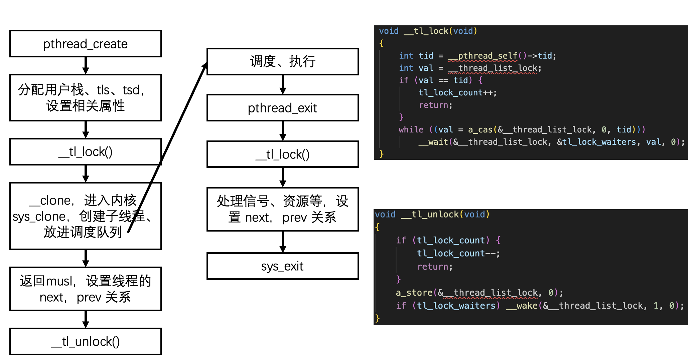

# MUSL_on_Rukos

时间：2023.11.15

作者：晏巨广

联系方式：coolyanjg@163.com

## 摘要

本文简要介绍了musl到系统调用的过程、libc-bench 集成到 rukos 的过程以及这一过程中遇到的各种困难，最后附上了 rukos 现有的各个 APP 的测试结果。

## musl 到系统调用API的调用链

- musl 提供给 C 程序相应的 C 函数接口，对底层的系统调用 API 进行了封装，同时，并不是所有的 C 函数都需要系统调用，大量的字符串处理函数则不需要系统调用，这一类不需要系统调用的函数在 musl 中提供了较为完善和高效的实现。因此将 musl libc 集成到 rukos 之后，原有的 axlibc 中自己实现的字符串等相关的函数则不再需要，并且提供了更多的 API，不需要再逐个实现。
- 系统调用是内核定义的，较为固定的一组可移植 API，不同架构的系统调用对应的系统调用号可能是不同的。在 AARCH64 中，可以通过查看 musl/arch/aarch64/bits/syscall.h.in 来获取 A64 定义的系统调用及其调用号。
  - 对比不同架构的系统调用，可以发现，不只是系统调用号不同，种类也有差别。例如 A64 提供了 dup 和 dup3 两个系统调用，但没有 dup2，dup2 是通过 dup + fcntl 来实现的；但 x86_64 就提供了 dup/dup2/dup3。
- 如何从 libc 库函数进入到内核的系统调用？以 read() 函数为例。
  - read() 是 C 标准库提供的函数，在 musl/src/unistd/read.c 中进行了实现，可以看到调用了 syscall_cp(SYS_read, fd, buf, count)，这里通过宏来调用系统调用，定义在 musl/arch/aarch64/syscall_arch.h 中。可以看到这里通过 `svc 0` ，并且将相关的参数存储到了 x0~x5，系统调用号存到了 x8，也就是说最多支持 6 个参数。
  - `svc 0` 会触发中断，并进入内核的中断异常向量表中，会触发一个同步异常，由内核对该异常进行接管并处理。处理方式以下面 rukos 的为例。

## musl 到 rukos，libc-bench

- 同步异常会进入到 rukos 的 modules/axhal/src/arch/aarch64/trap.rs 的 handle_sync_exception() 中，通过判断 ESR 异常状态寄存器获取异常触发原因，并通过读取 x0~x5，以及 x8 获取系统调用号及系统调用参数，进入到系统调用的处理函数中。

- 这里对 modules/axhal/src/trap.rs 的 TrapHandler trait 添加了方法 handle_syscall()， 并且只针对 带有 musl 的时候进行实现。系统调用进入到此函数中，具体实现在 ulib/axmusl/src/trap.rs 中，可以看到这里对系统调用号进行了解析，然后进行分发。

- 分发过程在 ulib/axmusl/src/syscall/mod.rs 中，系统调用号的定义在 ulib/axmusl/src/syscall/syscall_id.rs 中，与标准的系统调用号保持一致，但目前还没有完全实现，需要后续补全。分发过程即匹配系统调用号的过程，并根据不同的系统调用号解析不同数量的参数，然后调用 arceos-posix-api 中的具体系统调用实现。

- 编译说明：已修改相关的 makefile 集成了 MUSL 这个 feature，在编译 C 程序的时候加入 MUSL=y 即可通过 musl 来编译应用程序。

  - musl 必须带的部分 feature，已加入到 makefile 中，不需要额外写：
    - fp_simd：由于 musl 需要编译所有的 C 标准库函数，涉及到 double 类型，因此需要打开浮点数寄存器。
    - fd：由于 musl 需要初始化 stdin/stdout/stderr，以文件的形式，因此需要打开该 feature
    - tls：musl 在创建的线程中自己管理了 tls，并且需要通过 tls 来获取 pthread_self() 之类的东西，因此需要打开
  - makefile 会自动拉取、编译 musl 源码，需要主要必须加上 ARCH=aarch64，因为目前仅针对 A64 进行了集成。
  - 编译流程与之前的 axlibc 类似，以前的 axlibc 会在 target/ 目录下面编译出一个 .a 文件，而 musl 编译后也会在 install/ 目录下面生成 libc.a 文件，用这个 .a 文件做链接即可（已集成到 makefile）

- libc-bench

  - 静态链接，只包含几个文件
    - malloc.c：malloc 的测试，包括大、小、压力测试，用到了 pthread
      - malloc，memset，free，pthread_self，rng，pthread_mutex_lock/unlock，pthread_create/join
    - pthread.c：涉及到 create、join、锁、attr 的测试
      - pthread_create/join，pthread_attr_init/setstacksize/setguardsize，pthread_mutex_lock/unlock
    - regex.c：
      - setlocale，regcomp，regfree，memset，regexec
    - stdio.c
      - tmpfile，puts，fseeko，getc，fclose，putc_unlocked，fseeko，getc_unlocked
    - string.c
      - strlen，malloc，memcpy，strstr，free，memset，strchr
    - uft8.c
      - setlocale，strcmp，nl_langinfo，mbstowcs，free
    - main.c：测试其他函数，用了 fork
      - clock_gettime，fopen -> /proc/self/smaps，fgets，sscanf，strstr，strchr，fclose，fork / wait，puts，exit
  - 几个测试参数：
    - virt / res / dirty：表示的是虚拟内存占用、物理内存占用、系统可回收内存占用
    - time：运行时间
  - 把内存的统计结果相关代码注释掉了，以及原有的测试是 fork+execv 来运行的，修改为了直接在主线程中串行执行。

- 集成过程中的问题记录：

  - 需要修改入口函数为 musl 的 \__libc_start_main()，并且在传入的参数 argv 中设置好栈内的固定参数，具体的排布顺序参考对 musl 的分析文档。代码实现在 modules/axruntime/src/env.rs 的 init_argv() 中，这里需要依次放置 argv，envp（需要从 RX_ENVIRON 中复制过来），auxv（需要补充），其中 argv 和 envp 使用空指针结尾。

  - free 需要注释掉 secrect number 的判断？是因为没有打开 tls 的原因，打开后并正确设置好 tls 即解决。

  - send/sendto，recv/recvfrom，是否允许 TCP 调用 sendto/recvfrom？在 musl 的实现里面 send 和 recv 统一调用 sendto 和 recvfrom，即只有 sendto/recvfrom 这两个系统调用，而原有的 rukos 并不允许 TCP 调用这两个方法，因此修改为对参数进行判断，在 send 调用 sendto 或者 recv 调用 recvfrom 的时候，里面的 addr 参数为0，通过检查这个参数来进行具体的调用。

  - 对 sys_clone 的处理，sys_clone 是最难处理的一个系统调用，里面涉及到内存管理、tls、调度、多核情况下的并发等问题，记录如下：

    - 参数：stack, flags, arg, ptid（往父进程的某个地址写入新生成的 task 的 id）, tls, ctid（往子进程的某个地址写入新生成的 task 的 id）

    - __clone -> sys_clone

    - // __clone(func, stack, flags, arg, ptid, tls, ctid)

      //                   x0,   x1,    w2,    x3,  x4,   x5,  x6

      // syscall(SYS_clone, flags, stack, ptid, tls, ctid)

      //                        x8,        x0,    x1,    x2,   x3,  x4

    - x0 和 x3 存到了 x1 指的栈上

    - 这里的 arg 不是简单的子线程的参数，而是包含了子线程函数+子线程参数的一个结构体

      - 真正运行的函数叫 start()，会在这里面调用子线程函数

    - flags (pthread_create)：

      - CLONE_VM：共享地址空间，只有一个地址空间，不处理
      - CLONE_FS/FILES/SIGHAND：共享文件系统信息/ fd table，一直是共享的，信号不管
      - CLONE_THREAD：表示是个线程
      - CLONE_SYSVSEM：共享 system V semaphore
      - CLONE_SETTLS：设置 tls
      - CLONE_PARENT_SETTID：把子进程的 tid 存到父进程的某个地址（ptid），实际传进来的是子线程的 tid 地址
      - CLONE_CHILD_CLEARTID：在退出时清除 ctid 上的地址
      - CLONE_DETACHED：表示子进程结束后是否需要向父进程发信号，通常忽略

    - sys_clone 不能返回 0

  - pthread_create 调用过程：

  - 在解决的过程中涉及到了如下问题：

    - tls 在 musl 中已经通过 mmap 分配好了，并传到了 sys_clone，因此只需要保存这个指针即可，而不是新生成 tls
    - 需要保存 ctid 这个地址，并在线程退出的时候把他写成0
    - 固定在运行了几百个或者一千多个线程后出现 page fault，后来发现是因为 tls 二次释放以及内存对齐的问题。在 musl 中对 tls 进行了管理，并会自己调用 munmap 进行释放，但在内核中会通过线程退出的 drop 机制释放掉 task_inner 里面的所有内容，即包含了这里的 tls，出现了二次释放的错误。另一方面 musl 传进来的 tls 是按指针大小对齐，也就是8字节对齐的，而内核在释放的时候是按16字节对齐来进行释放的，导致了可能会多释放内存单元。因此修改了内核中所有的内存对齐为8字节。
    - 只有 slab 分配器能用？其他分配器有 bug？bug 的表现为不断地扩大堆分配器的大小，反复分配出来内存却总是不能满足。在正确对齐了 tls 之后该问题解决，所有分配器都能正常工作。
    - 需要扩大内存到 2G 左右。
    - 多线程程序开启 SMP 的情况下会出错，不同的 log 等级或者 log 数目会影响运行结果，并且出错的位置随机
      - 分析下来原因是多核调度的bug，内核创建的子线程直接就被扔进了调度队列，并且在父线程还没设置好一些指针（在 musl 中的 next 和 prev 等指针关系），子线程就被调度到空闲的核上运行，并且很快运行完进入到回收资源阶段，这时候访问上面那些指针就出现了空指针
      - 分析本来在musl中通过了 \__tl_lock() 和 __tl_unlock() 来加了锁，但是锁并没有生效。没有生效的原因有两点：
        - 原本代码的bug，原本在设置了 CLONE_CHILD_CLEARTID 的时候对 ctid 进行了置零，但是这里应该是在退出的时候才置零，修复这个 bug 之后出错概率变的极小
      - 继续分析剩下的出错原因，发现是在于多核情况下的并行导致的错误：
        - 原本的调用链：sys_clone -> pcreate -> axtask::pspawn -> pspawn_raw ->new_musl 之后，就会将该 task 放入调度队列 RUN_QUEUE 里面，即该任务可以调度运行了。
        - 在 new_musl 里面，通过 `t.ctx.get_mut().init()` 设置了入口函数和相关的寄存器，这里就涉及到了 tpidr_el0 寄存器，设置为了 tls_area，这个寄存器会被 musl 在调用 pthread_self() 的时候拿到，读取其中的 tls 数据，包括 id 等
        - 回到 sys_clone，这时候 pcreate() 已经完成，新线程被放到了调度队列中，但是在这之后因为有 CLONE_PARENT_SETTID 这个选项，需要写 ptid 为新的线程号，会在这里写入 tid，也就是上面新的子线程如果在这之前被调度到，并且读取 pthread_self() ->tid 为 0，即默认值，注意这里 pthread_self() 读到的是正确的地址。由于读到的 tid 为0，在 \__tl_lock() 中，在 cas(&\_\_thread_list_lock, 0, tid) 检查中会返回0，退出这个 while 循环，即认为自己成功拿到了锁，然后继续运行导致了读取 self->prev 和 self->next 出错（因为这个 prev 和 next 指针需要再父线程 sys_clone 结束后才设置），这就导致了两个线程同时进入了临界区，指针错误，出现 pagefault。
        - 这种情况仅仅会出现在主线程正在创建这个子线程的时候，如果主线程正在创建别的线程，不会影响
        - 修改方法即延迟子线程放到调度队列的时机，放在 sys_clone 的结尾。
    - b_regex_search 会出错，出错现象是访问了一个值为 0x6161 6161 6161 6161 的地址
      - 分析原因发现是爆栈，原来的栈是 256K，但这里创建了一个 260000B 的数组，并且调用 memset 写入 a，正好对应 0x61，导致了栈溢出，溢出之后修改了不该访问的地址
      - 扩大栈到 512K 就解决了，这里是否应该进行一些保护？

## 使用说明

- 需要将内存扩大到4G，注意修改 platforms 下的参数配置，以及 qemu 的参数配置
  - 2G 是否可以？测试发现2G在不开启 SMP 的情况下不够。
- 需要将内核栈扩大到 512K，需要修改 axconfig/defconfig.toml 的配置
- 运行带 net feature 的程序时请将 musl 源码的 `getaddrinfo` 和 `freeaddrinfo` 注释掉。后续会修改。

## 现有 APP 测试结果

### envtest

测试命令: 

```sh
make A=apps/c/envtest/ ARGS=envtest,test1,test2 ENVS=hello=world,world=hello ARCH=aarch64 run MUSL=y
```

发生错误:

```
EL1 Page Fault @ 0xffff000040080ca8, FAR=0x0, ISS=0x4:
```

解决过程

- 发现问题:
  - `musl libc`使用`envp = argv+argc+1`取得环境变量, 
  - 系统初始化时没有将环境变量放在这里, 导致`musl`取到的地址为`0`, 访问`0`地址造成错误
- 解决: 初始化`argv`时, 将环境变量一起`push`进去

### filetest

命令:

```sh
make run BLK=y ACCEL=n A=apps/c/filetest/ ARCH=aarch64 MUSL=y
```

错误

```sh
can not create the file
: No such file or directory
```

解决过程

- 发现问题: 缺少系统调用`sys_unlinkat`和`sys_mkdirat`
- 增加系统调用后, 测例可以继续运行, 但是之后仍然报错
- 尝试在`Linux`运行该测例, 依然报错, 说明测例本身有问题

### helloworld 

运行良好

### httpclient

命令

```sh
make run ARCH=aarch64 A=apps/c/httpclient/ NET=y MUSL=y
```

报错

```
rust-lld: error: duplicate symbol: getaddrinfo
>>> defined at getaddrinfo.c
>>>            getaddrinfo.lo:(getaddrinfo) in archive ulib/axmusl/install/lib/libc.a
>>> defined at axmusl.fd85a6ad1ff6d950-cgu.0
>>>            axmusl-898e685786b1c25a.axmusl.fd85a6ad1ff6d950-cgu.0.rcgu.o:(.text.getaddrinfo+0x0) in archive target/aarch64-unknown-none-softfloat/release/libaxmusl.a

rust-lld: error: duplicate symbol: freeaddrinfo
>>> defined at freeaddrinfo.c
>>>            freeaddrinfo.lo:(freeaddrinfo) in archive ulib/axmusl/install/lib/libc.a
>>> defined at axmusl.fd85a6ad1ff6d950-cgu.0
>>>            axmusl-898e685786b1c25a.axmusl.fd85a6ad1ff6d950-cgu.0.rcgu.o:(.text.freeaddrinfo+0x0) in archive target/aarch64-unknown-none-softfloat/release/libaxmusl.a
make: *** [scripts/make/build_musl.mk:65: apps/c/httpclient//httpclient_aarch64-qemu-virt.elf] Error 1
```

解决过程

- 将`musl`源码里的这两个函数注释掉, 重新编译即可

### httpserver 

运行良好


### iperf

命令

```sh
make ARCH=aarch64 BLK=y NET=y A=apps/c/iperf/ MUSL=y run
```

报错问题同`httpclient`测例, 使用同样的方法解决之后, 遇到新错误

```
-----------------------------------------------------------
Server listening on 5555
-----------------------------------------------------------
error - select failed: Bad file descriptor

-----------------------------------------------------------
Server listening on 5555
-----------------------------------------------------------
error - select failed: Bad file descriptor

too many errors, exiting
```

解决过程: 

- 缺少 `pselect6` 这个系统调用

### memtest 

运行良好

### pthread

命令

```sh
make ARCH=aarch64 A=apps/c/pthread/basic/ SMP=4 run
```

错误

```
[  0.019689 axruntime::mp:54] Secondary CPU 2 init OK.
Pass NULL argument
Recieve: Main thread pass message
test_create_join: Child thread return message
A message before call pthread_exit
[  0.023700 1:9 arceos_posix_api::imp::pthread:138] Exit_musl, tid: 9
test_create_exit: (null)
[  0.024481 1:2 axruntime::lang_items:14] panicked at modules/axhal/src/arch/aarch64/trap.rs:88:13:
EL1 Page Fault @ 0xffff00004008abac, FAR=0x2, ISS=0x4:
```

原因

- 在`pthread_exit`中针对`musl`做了些特殊处理, 忘记加上编译选项`#[cfg(...)]`

### redis 

命令

```sh
make A=apps/c/redis/ LOG=error NET=y BLK=y ARCH=aarch64 SMP=4 ARGS="./redis-server,--bind,0.0.0.0,--port,5555,--save,\"\",--appendonly,no,--protected-mode,no,--ignore-warnings,ARM64-COW-BUG" MUSL=y run
```

错误

```
error: none of the selected packages contains these features: axmusl/poll, did you mean: axmusl/tls?
```

解决方式: 同`httpclient`

### sqlite3

命令

```sh
make run BLK=y ARCH=aarch64 A=apps/c/sqlite3/ MUSL=y
make run BLK=y ARCH=aarch64 A=apps/c/sqlite3/ MUSL=y FEATURES=driver-ramdisk
```

错误 

```
sqlite open /file.sqlite status 14 
sqlite open error
```


解决过程:

- 测例运行到`file()`时, 发生错误
- 原因: 
  - `fsync`没实现导致`sqlite`退出 
  - `fstat`等系统调用参数类型不匹配，需要添加 kstat 这个结构体


### system

命令

```sh
make run ARCH=aarch64 A=apps/c/systime/ MUSL=y
```

错误

```
now time: 1699871545 : 6265
now time: 1699871548 : 856770
settimeofday: Function not implemented
```

原因

- 系统调用`settimeofday`未实现

### udpserver

运行良好
