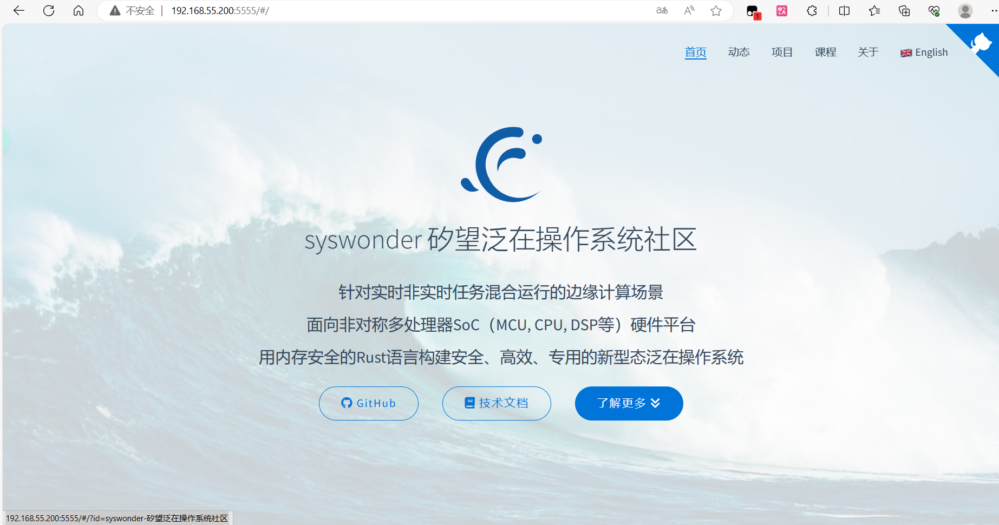

# **在 RuxOS 上支持 Nginx**

Nginx 是一个高性能的HTTP和反向代理web服务器软件。

目前RuxOS支持运行nginx并通过nginx构建网页服务器

## 如何在RuxOS上运行nginx

```shell
//首先要确保机器中有musl libc,可以运行RusOS的c程序，具体可以参考RuxOS的README中运行c程序的部分
git clone https://github.com/syswonder/syswonder-web.git
mkdir -p apps/c/nginx/html
cp -r syswonder-web/docs/* apps/c/nginx/html
rm -f -r syswonder-web
make A=apps/c/nginx/ LOG=info NET=y BLK=y ARCH=aarch64 SMP=4 run
```

当运行完成时，访问本机ip的5555端口即可访问到网页服务器

# 运行方法的解释

## 运行要求

RuxOS的文件系统中需要有以下文件

`/nginx/logs/error.log`

`/nginx/conf/nginx.conf`

`/nginx/conf/mime.types`

其中，error.log是日志文件（但是实际上没有用到），nginx.conf是nginx配置文件，告诉nginx如何运行以及一些运行的参数。mime.type是类型转化文件，告诉nginx如何看待不同类型的文件。

在apps/c/nginx文件中，可以运行create_nginx_img.sh，创建含有上述文件的磁盘

### nginx.conf

需要着重设置的是nginx.conf，目前运行的syswonder-web，其具体内容如下：

```nginx
worker_processes  1;
daemon off;
master_process off;

error_log  logs/error.log debug;

events {
    worker_connections  32;
}

http {
    include       mime.types;
    default_type  application/octet-stream;

    keepalive_timeout  65;

    server {
        listen       5555;
        server_name  localhost;

        index index.html;
    
        root /v9fs;

        location / {
            try_files $uri $uri/ /404.html;
        }

        error_page 404 /404.html;
        location = /404.html {
            root /v9fs;
        }

        error_page   500 502 503 504  /50x.html;
        location = /50x.html {
            root   /v9fs;
        }

    }
}
```

上面的设置会在本机的5555端口建立一个服务器，向请求者发送Index.html文件

其中需要注意的点是：1.RuxOS是单进程系统，无法分出第二个进程，需要使用`daemon off;`设置将守护进程关闭。2.server的文件在机器的/v9fs/下，这是由`root /v9fs;`这一项设置的，可以根据需求设置其他的路径。3. `try_files $uri $uri/ /404.html;`的意思是尝试请求的uri是否存在，不存在的话返回404页面。

可以通过修改`apps/c/nginx`目录下的nginx.conf文件来对nginx的配置进行修改，包括修改nginx服务器功能、修改服务器参数、修改Nginx运行选项等。

注意：

* 除http服务器之外的功能尚未验证
* 如果修改服务器参数（比如端口），请对qemu的相应设置（比如端口映射）做相应更改
* 修改完nginx.conf后请将其复制到文件系统镜像中，您可以通过在`apps/c/nginx`目录下运行`./create_nginx_img.sh`来完成
* 使用9pfs时的nginx.conf会有所不同，其内容在`apps/c/nginx`目录下的nginx_9p.conf中，可以通过`./create_nginx_img.sh 9p`的命令来将其复制到文件系统镜像中

### 网页文件

需要确保nginx.conf中设置的网页文件的位置正确，比如在上面的conf中，需要保证文件/v9fs/index.html存在才能访问到主页。其余的文件只需要按照index.html的内容在本文件夹下放到应有的位置。

运行前可以将网页复制到apps/c/nginx/html/文件夹下，并将主目录下的disk.img删除，或者重新运行`apps/c/nginx/create_disk_img.sh`，这样程序在运行时会自动新建一个磁盘并将html文件夹下的文件复制到磁盘中

如果使用v9p，则只需要在运行参数中改变v9p的共享目录为位置。

## 运行命令

```shell
make A=apps/c/nginx/ LOG=info NET=y BLK=y ARCH=aarch64 SMP=4 run
```

### 使用musl libc运行

默认情况下，nginx通过Ruxos的自带的c程序库ruxlibc运行，可以在运行命令中加入MUSL=y选项，来启用musl libc运行nginx

```shell
make A=apps/c/nginx/ LOG=info NET=y BLK=y ARCH=aarch64 SMP=4 MUSL=y run
```

### 在x86架构下运行

可以通过修改ARCH选项，来在x86架构下运行

```shell
make A=apps/c/nginx/ LOG=info NET=y BLK=y ARCH=x86_64 SMP=4 run
```

### 使用v9p运行

默认情况下，RuxOS 通过命令行中的 `ARGS` 参数来向应用传递参数，这种方法可能会带来不便。现在 RuxOS 已经成功集成了 9pfs，用于 host 和 qemu 进行文件目录的共享，即可以通过应用自己的配置文件来传递参数。

运行下面的命令:

```shell
make A=apps/c/nginx/ LOG=info NET=y BLK=y FEATURES=virtio-9p V9P=y V9P_PATH=./apps/c/nginx/html/ ARCH=aarch64 SMP=4 run
```

参数解释:

* `V9P`: 使用 `V9P=y` 来使能 qemu 的 virtio-9p 后端。
* `FEATURES=virtio-9p`：告诉RuxOS启用9p功能
* `V9P_PATH`: `V9P_PATH` 指向 host 上的用于共享的目录，默认情况下这是网页文件的位置。

注意，如果在第一次运行之后修改了源码或者运行参数，请运行下面的命令清理应用文件

```shell
make clean_c A=apps/c/nginx
```

## app源码

目前使用的nginx版本是nginx-1.24.0

在对于nginx源码的编译方法以及相关设置，可以在[syswonder/rux-nginx](https://github.com/syswonder/rux-nginx)中查看。

在编译nginx时，RukOS会从远端下载rux-nginx，并根据其内部的设置，对nginx-1.24.0的源码进行编译

## 运行结果

通过机器的ip地址访问5555端口可以访问到网页服务器，能够看到syswonder的网页

