# Linux console,tty,serial学习笔记

wheatfox 2023.12
enkerewpo@hotmail.com

## tty

什么是tty？其全称为Teletypewriter，即电传打字机，其与普通typewriter的区别是，电传打字机将直接发送输入的消息。随着计算机的出现，电传打字机便被用于作为非常方便的输入设备。


*上图为1956 年的 LGP-30 计算机，附带 TTY*

后来电传打印机被抽象化，作为了“虚拟”的tty。那么terminal（终端）和tty之间是什么关系呢？实际上，每个terminal都在和一个虚拟tty（pty）进行交互。

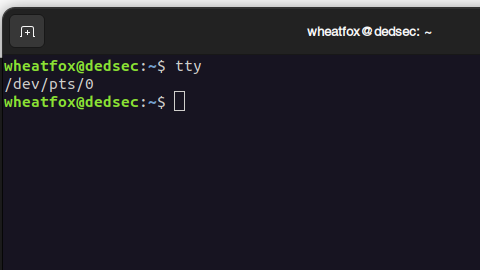

https://www.linusakesson.net/programming/tty/index.php


上面的图给出了tty在软件层方面的一种设计思路，实际上通过tty能够实现line editing, session management等丰富的功能。


上面的两张图片展示了在xterm中运行`cat`和`ls | sort`指令时，各个linux进程和tty等结构的对应关系。

## console与terminal

什么是terminal终端？终端可以理解为是人机交互的界面，终端分为本地终端（如通过VGA连接到显示器外加键盘）、串口终端（通过串口线和串口终端软件对另外的一台机器进行访问）、远程终端（如SSH终端）。

那什么是console控制台呢？在历史上，物理console和terminal是有区别的，物理terminal是人使用的界面，而物理console则只显示操作系统相关的信息。

在linux中，**显示系统消息的terminal即为console**，并且默认认为所有虚拟terminal都可以显示系统消息，都可以是console，**可以说linux中淡化了二者的区别**。注意到，我们使用gnome-terminal打开一个终端的时候，tty指令显示的为`/dev/pts/0`，这里的pts是**pseudo-terminal slave**，是对pty（虚拟tty）的一种SSH实现，要和`/dev/tty*`做区别。

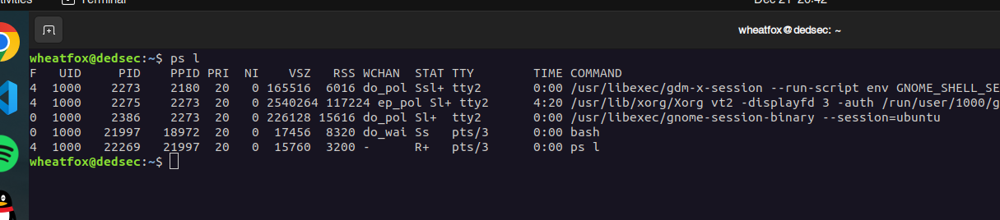

上图是我运行`ps l`的结果，可以注意到，gnome-terminal打开的bash使用了`pts/3`，而Xorg和gdm-x-session则是直接输出到`tty2`。

https://blog.csdn.net/qq_27825451/article/details/101307195

> tty是最令人熟悉的了，在Linux中，/dev/ttyX代表的都是上述的物理终端，其中，/dev/tty1~/dev/tty63代表的是本地终端，也就是接到本机的键盘显示器可以操作的终端。事实上Linux内核在初始化时会生成63个本地终端，通过键盘上的Fn-Alt-FX(X为1,2,3…)可以在这些终端之间切换，每切换到一个终端，该终端就是当前的**焦点终端**，比如说，你按下了Fn-Alt-F4组合键，那么此时第4个终端就是焦点终端，即/dev/tty4就是焦点终端设备。

向`/dev/console`中写入东西的时候，就会出现在**焦点终端**上，除此之外，`/dev/tty`则指向的是当前正在使用的tty。

串口终端则以`ttyS0,ttyS1,...`来命名，即另外一台机器通过串口线连接到本台机器上，在本台机器上访问另外一台机器的终端。

## early console

> printk的log输出是由console实现。由于在kernel刚启动的过程中，还没有为串口等设备等注册console（在device probe阶段实现），此时无法通过正常的console来输出log。为此，linux提供了early console机制，用于实现为设备注册console之前的早期log的输出，对应console也称为boot console，简称bcon。这个console在kernel启动的早期阶段就会被注册，主要通过输出设备（比如串口设备）的简单的write方法直接进行数据打印。而这个write方法也就是平台实现。
> 

## 阅读源码

### include/linux/tty.h

struct tty_struct

部分成员：

1. kref - 当前tty的tty_kref_get()值，即引用数
2. dev - device结构体，如ptys,serdev
3. driver - tty_driver结构体
4. ops - tty_operations结构体
5. index - 当前tty的编号
6. ldisc_sem - line discipline semaphore?（用于保护）
7. ldisc - line discipline行规程
8. atomic_write_lock - 并发写锁（用于保护）
9. legacy_mutex - 历史遗留的成员
10. throttle_mutex - 保护并发tty_throttle_safe()？
11. termios_rwsem - termios读写信号量（用于保护）
12. winsize_mutex - winsize互斥锁（用于保护）
13. termios - 当前tty的终端控制
14. termios_locked - 被锁住的termios？
15. name - 如ttyS3
16. flags - bitwise OR of %TTY_THROTTLED, %TTY_IO_ERROR, ...
17. count - 当前tty打开的进程数
18. winsize - 终端的“窗口”大小
19. flow - 流设置，有一组flow.lock,flow.stopped.flow.tco_stopped,flow.unused
20. ctrl - 控制设置
    1. ctrl.lock
    2. ctrl.pgrp - 当前tty的进程组
    3. ctrl.session - 当前tty的session
    4. ctrl.pktstatus
    5. ctrl.packet
    6. ctrl.unused
21. link - 链接到pty
22. disc_data - ldisc的私有数据
23. driver_data - driver的私有数据
24. tty_files - list of (re)openers of this tty (i.e. linked &struct tty_file_private)？tty打开的文件的列表
25. write_buf - temporary buffer used during tty_write() to copy user data to
26. write_cnt - count of bytes written in tty_write() to @write_buf

### include/linux/tty_driver.h

The usual handling of &struct `tty_driver` is to allocate it by `tty_alloc_driver()`, set up all the necessary members, and register it by `tty_register_driver()`. At last, the driver is torn down by calling `tty_unregister_driver()` followed by `tty_driver_kref_put()`.

### include/linux/console.h

struct consw - consoles的回调函数集合

1. con_startup
2. con_init
3. con_clear
4. con_putc
5. con_putcs
6. con_cursor
7. con_scroll
8. con_font_set
9. con_resize
10. con_set_palette
11. ...

struct console - 核心的console结构

成员：

1. name - console driver的名字
2. write: - write回调函数
3. read - read回调函数
4. device - tty device driver回调函数
5. unblank - unblank回调函数
6. setup - console初始化回调函数
7. exit - console退出回调函数
8. match - match回调函数？
9. flags - cons_flags
10. index - console编号
11. cflag - TTY control mode flags
12. ispeed - TTY input speed
13. ospeed - TTY output speed
14. seq -Sequence number of the next ringbuffer record to print
15. dropped -Number of unreported dropped ringbuffer records
16. data - Driver private data
17. node - hlist node for the console list
18. write_atomic - Write callback for atomic context
19. nbcon_state - State for nbcon consoles
20. nbcon_seq - Sequence number of the next record for nbcon to print
21. pbufs - Pointer to nbcon private buffer

头文件里重要函数

`extern void register_console(struct console *);`

该函数的定义是在`kernel/printk/printk.c`中，其函数注释如下：

The console driver calls this routine during kernel initialization to register the console printing procedure with printk() and to print any messages that were printed by the kernel before the console driver was initialized. This can happen pretty early during the boot process (because of early_printk) - sometimes before setup_arch() completes - be careful of what kernel features are used - they may not be initialised yet. There are two types of consoles - bootconsoles (early_printk) and "real" consoles (everything which is not a bootconsole) which are handled differently. Any number of bootconsoles can be registered at any time. As soon as a "real" console is registered, all bootconsoles will be unregistered automatically. Once a "real" console is registered, any attempt to register a bootconsoles will be rejected.

这个控制台驱动程序在内核初始化期间调用此例程，用于使用printk()注册控制台打印过程，并打印在控制台驱动程序初始化之前内核打印的任何消息。这可能发生在引导过程的相当早期阶段（因为有early_printk），有时甚至在setup_arch()完成之前，要小心使用了哪些内核特性，它们可能尚未初始化。有两种类型的控制台 - 引导控制台（early_printk）和“真实”控制台（不是引导控制台的所有内容），它们被不同地处理。**可以随时注册任意数量的引导控制台（boot consoles）。一旦注册了“真实”控制台，所有引导控制台将自动取消注册。**一旦注册了“真实”控制台，任何尝试注册引导控制台的操作都将被拒绝。

### include/linux/device.h

struct device - linux中对设备的描述结构

## dts注册serial

下面的内容来自龙芯的2K1000板子的dts文件loongson2k1000.dtsi。

```c
aliases {
    serial0 = &cpu_uart0;
    serial1 = &uart1;
    ...
};
soc {
    ...
    cpu_uart0: serial@0x1fe20000 {
        compatible = "ns16550a";
        pinctrl-names = "default";
        pinctrl-0 = <&uart0_4_default>;
        reg = <0 0x1fe20000 0 0x10>;
        clocks = <&clks CLK_UART>;
        interrupt-parent = <&icu>;
        interrupts = <0>;
        no-loopback-test;
        status = "okay";
    };
    ...
}
```

linux通过dts文件编译得到的dtb文件进行硬件设备树的配置。

device tree中关于serial部分的文档

https://www.kernel.org/doc/Documentation/devicetree/bindings/serial/serial.txt

https://en.ica123.com/device-tree-parsing-during-kernel-boot/

linux首先进行设备树解析？

start_kernel()

setup_arch()

unflatten_device_tree()

之后读取串口驱动（driver/tty/serial目录下包含串口驱动），之后对相对应的串口进行初始化

驱动代码调用register_console函数，实现console注册

通过console_setup函数配置console

之前在自制rootfs时，在dev目录下进行了mknode操作

```bash
mknod console c 5 1
```

其中c代表character device, 5是主设备号，1是第一个子设备，这样就创建了/dev/console设备

# 探究linux kernel启动流程

搞清楚aarch64下linux从entry开始到注册实际console的调用过程，以及linux kernel如何读取硬件dtb，并读出serial相关信息。

这里使用linux kernel 6.6.8的源码进行阅读

TODO

# NXP板子研究笔记

启动扳子，连接DEBUG到电脑，我这里默认连接到的串口tty为/dev/ttyACM0

使用gtkterm打开NXP板子的串口终端

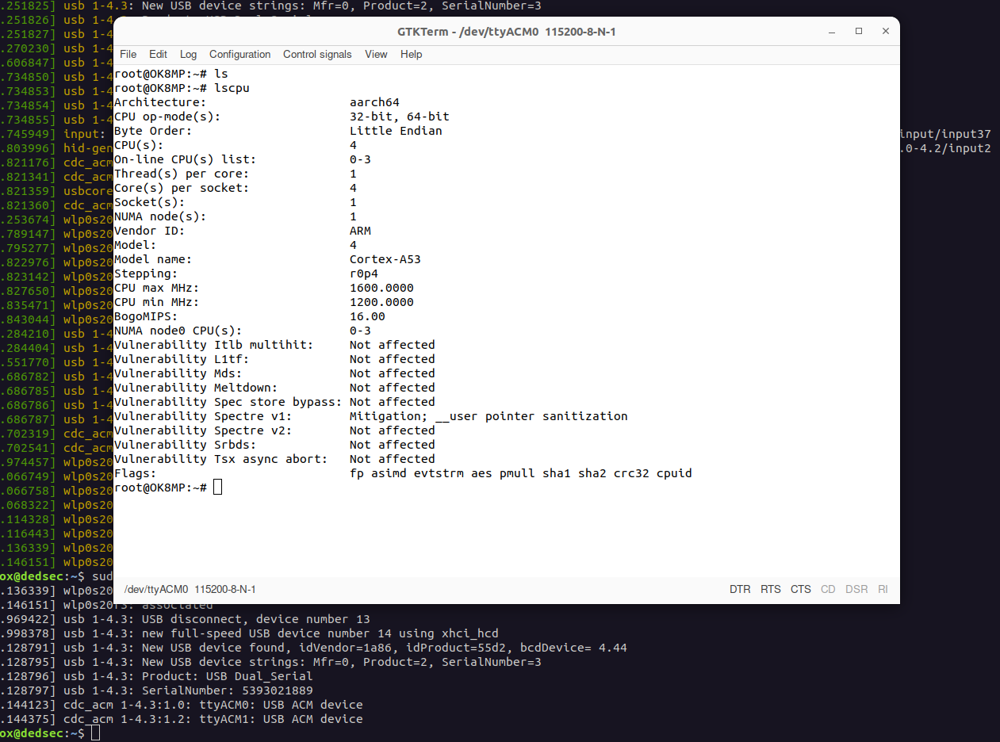

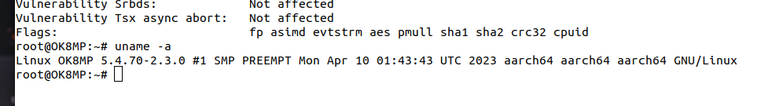

默认启动的是自带的linux 5.4.70，通过查看启动拨码开关，默认是配置为eMMC启动。

## NXP jailhouse初探

### 编译jailhouse

https://github.com/nxp-imx/imx-jailhouse

i.MX Jaihouse Hypervisor

```bash
cd imx-jailhouse
cd ci
wget http://www.kiszka.org/downloads/jailhouse-ci/kernel-build.tar.xz
tar xJf kernel-build.tar.xz
cd .. # enter root dir of imx-jailhouse
```

由于我们只需要aarch64的target，修改build-all-configs.sh

```
CONFIGS="amd-seattle"
...
make KDIR=ci/linux/build-$CONFIG ARCH=$ARCH \
     CROSS_COMPILE=$CROSS_COMPILE clean 去掉clean
->
make KDIR=ci/linux/build-$CONFIG ARCH=$ARCH \
	     CROSS_COMPILE=$CROSS_COMPILE
```

之后运行

```
./ci/build-all-configs.sh
```

可以发现编译得到了

```bash
imx-jailhouse/driver/jailhouse.ko # kernel module
jailhouse.ko: ELF 64-bit LSB relocatable, ARM aarch64, version 1 (SYSV), BuildID[sha1]=459e049bd217f3160316f7d5c0ef3fdda618db38, not stripped

imx-jailhouse/tools/jailhouse # 可执行文件
jailhouse: ELF 64-bit LSB executable, ARM aarch64, version 1 (SYSV), dynamically linked, interpreter /lib/ld-linux-aarch64.so.1, BuildID[sha1]=196d6db5c30a4524323ca77e3584743161fa96e3, for GNU/Linux 3.7.0, with debug_info, not stripped

imx-jailhouse/configs/arm64下生成的cell文件和dtb文件

imx-jailhouse/tools/jailhouse-* # 工具脚本文件
```

写一个脚本把这些文件专门整理好：

```bash
rm -rf export
mkdir export
cp driver/jailhouse.ko export/jailhouse.ko
cp tools/jailhouse export/jailhouse
```

试着把生成的文件在nxp板子上运行，出现glibc问题

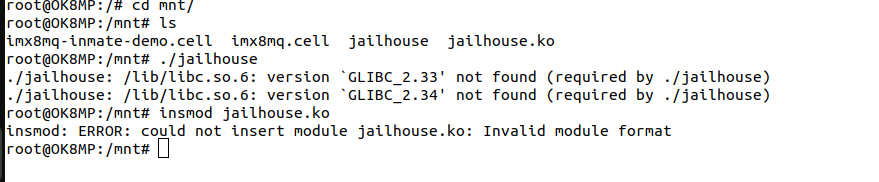

检查一下板子自带系统的glibc版本：

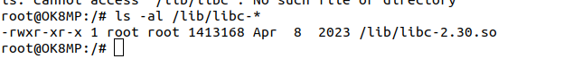

果然版本太低了，试着编译一个glibc-2.34版本的放在板子上。

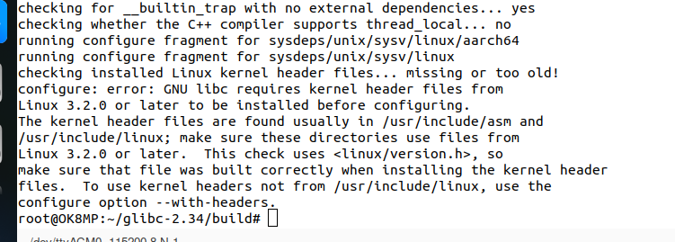

然后configure的时候发现板子上缺少linux的headers

https://github.com/OK8MQ-linux-sdk/OK8MQ-linux-sdk

这个问题可以通过使用NXP提供的编译器以及环境来解决，从上面的URL中下载aarch64-poky-linux工具链并解压安装

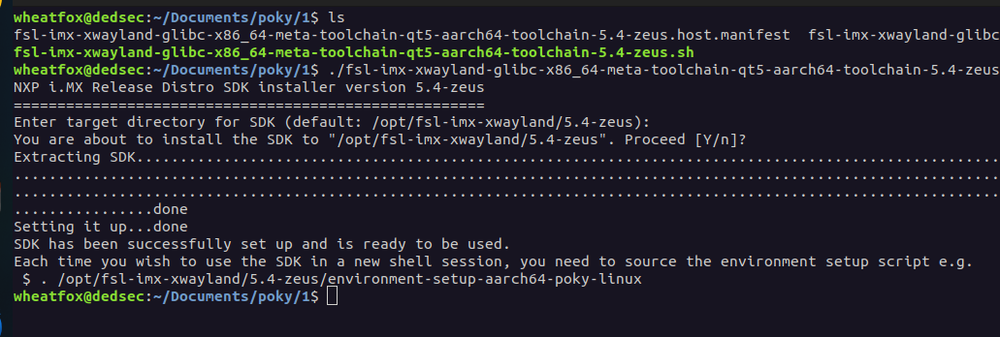

```bash
Each time you wish to use the SDK in a new shell session, you need to source the environment setup script e.g.
. /opt/fsl-imx-xwayland/5.4-zeus/environment-setup-aarch64-poky-linux
```

SDK源码包，包括linux kernel, 文件系统等 https://github.com/Comet959/-ok8mq-jailhouse-linux/releases/tag/v1.0.0

aarch64-poky-linux-gcc "stdio.h" not found https://blog.iotot.com/?p=346

由于之前是直接下载的linux-kernel build，那个build是使用aarch64-gnu-linux-gcc编译的，和这一套aarch64-poky工具链还是有区别的，所有我重新执行了

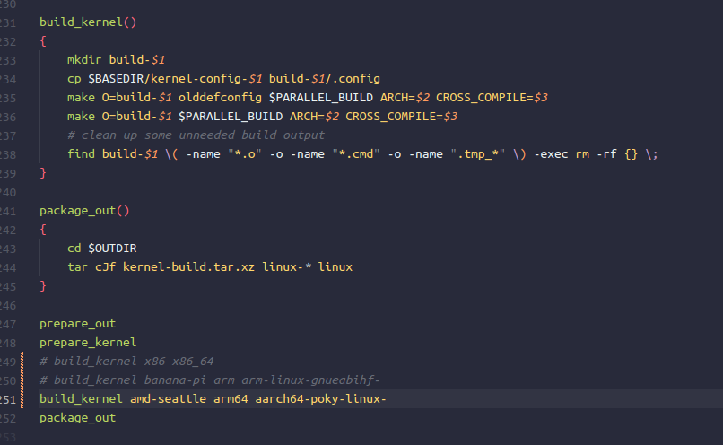

```bash
./ci/gen-kernel-build.sh
```

使用aarch64-poky工具链编译linux kernel 5.10

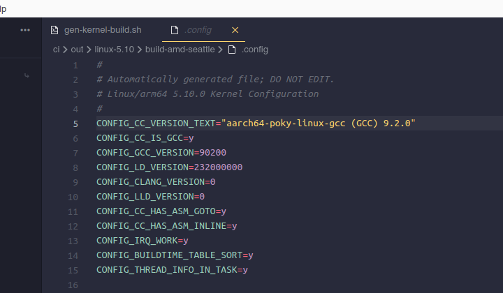

之后重新编译jailhouse，需要注意此时aarch64-poky的脚本依然生效，所以没有指定ARCH等变量

```bash
make KDIR=ci/out/linux/build-amd-seattle
```

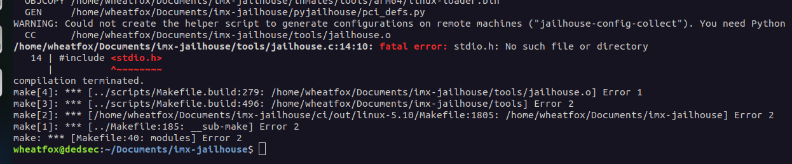

依然找不到stdio.h，原因还是因为编译jailhouse的之后没有指定好sysroot，即使初始化脚本里设置了CC的sysroot，但是jailhouse编译的时候猜测并没有成功传入这个参数

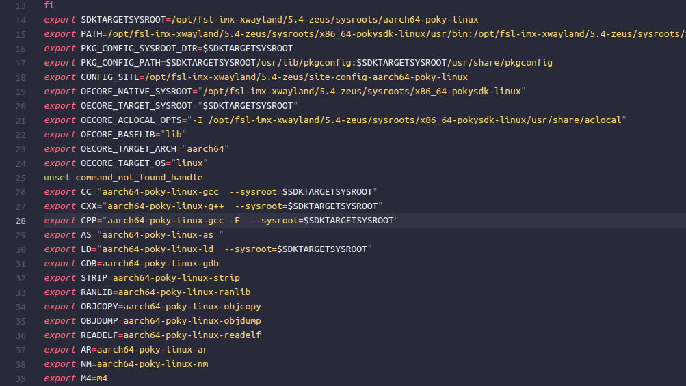

检查发现hypervisor目录下的源代码都成功生成了object文件，而stdio.h是tools下的源码使用的，尝试修改tools/Makefile

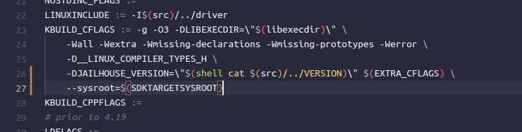

在KBUILD_CFLAGS中加一行，--sysroot指向aarch64-poky环境变量

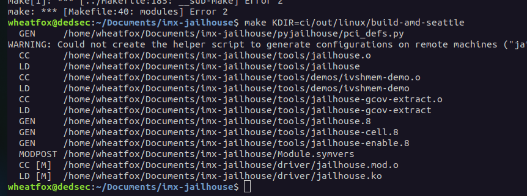

成功编译了jailhouse可执行程序和jailhouse.ko，上板运行

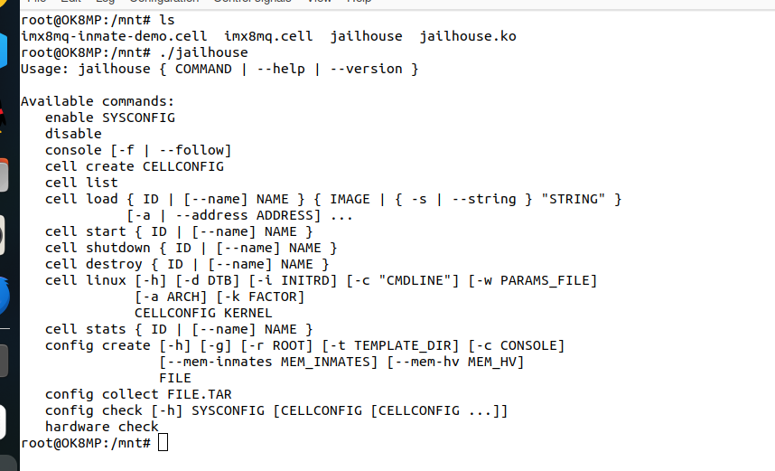

jailhouse工具成功启动，但是添加内核模块的时候报错 invalid module format

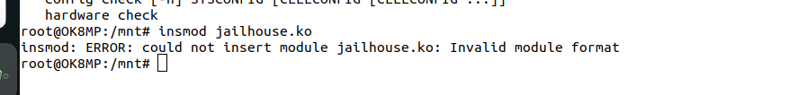

```bash
Linux OK8MP 5.4.70-2.3.0 #1 SMP PREEMPT Mon Apr 10 01:43:43 UTC 2023 aarch64 aarch64 aarch64 GNU/Linux
```

刚才通过jailhouse的ci脚本编译的的是linux 5.10的内核，猜测是因为用的linux源码版本不对

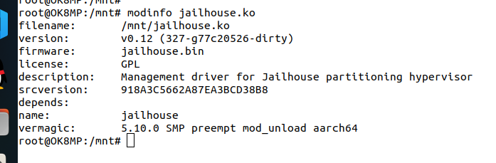

模块加载时 insmod “Invalid module format ”问题解决 https://blog.csdn.net/ymangu666/article/details/22872439

> 内核无法加载模块的原因是因为记载版本号的字符串和当前正在运行的内核模块的不一样，这个版本印戳作为一个静态的字符串存在于内核模块中，叫vermagic

而手头的NXP板子是5.4的系统。

接下来的目标就明确了，即在 https://github.com/Comet959/-ok8mq-jailhouse-linux/releases/tag/v1.0.0 下载厂家给的linux源码。

下载好之后放在opt目录，对应的linux-kernel源码目录位于`/opt/OK8MQ-linux-sdk/OK8MQ-linux-kernel`

出现报错

````
usr/bin/ld: scripts/dtc/dtc-parser.tab.o:(.bss+0x10): multiple definition of 'yylloc'; scripts/dtc/dtc-lexer.lex.o:(.bss+0x0): first defined here
````

查到的解决方法：

```
vim scripts/dtc/dtc-lexer.lex.c +640
    extern YYLTYPE yylloc;
```

在IMX的SDK下编写build.sh

```bash
cd ./OK8MQ-linux-kernel
make -j16 imx_v8_defconfig
make -j16
```

这样在jailhouse编译的时候使用:

```bash
make KDIR=/opt/OK8MQ-linux-sdk/OK8MQ-linux-kernel
```

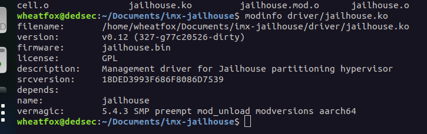

编译出来了面向linux 5.4内核的jailhouse.ko,上板试一下

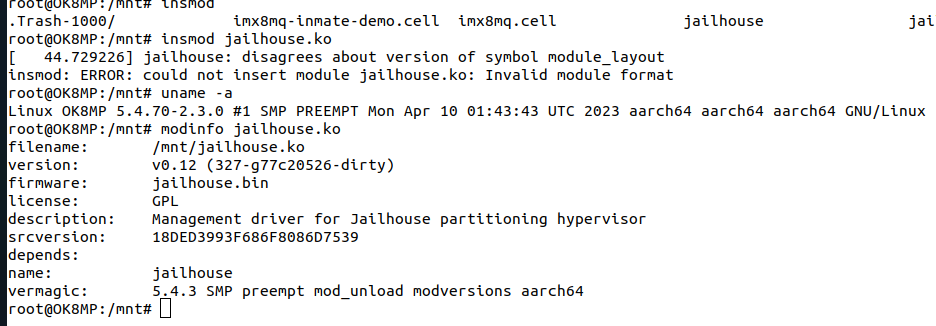

还是报错,可以看到虽然都是5.4,但是和我目前板子运行的linux版本还是有区别的,注意到jailhouse本身也报了一个错是disagrees about version of symbol module_layout

和当前板子上的kernel module对比:

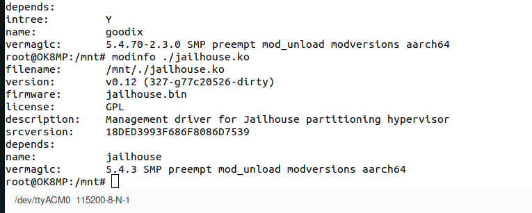

```bash
5.4.70-2.3.0 SMP preempt mod_unload modversions aarch64 # goodix
5.4.3 SMP preempt mod_unload modversions aarch64 # jailhouse
```

所以目前这份厂家提供的linux源码版本并不对,需要再向厂商要板子的linux 5.4.70源码.

目前在向厂家要了，在29号拿到了下载权限

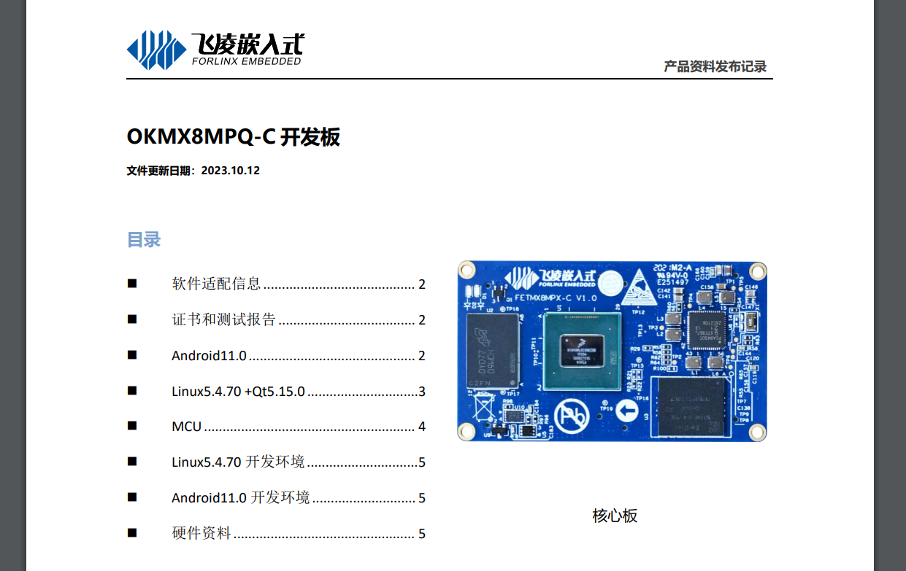

可以看到当前这版资料这里的linux内核和板子上的版本一致。

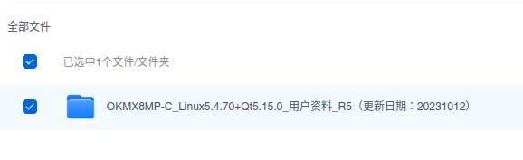

在下载这个版本的SDK后，我发现其根目录有一个build.sh

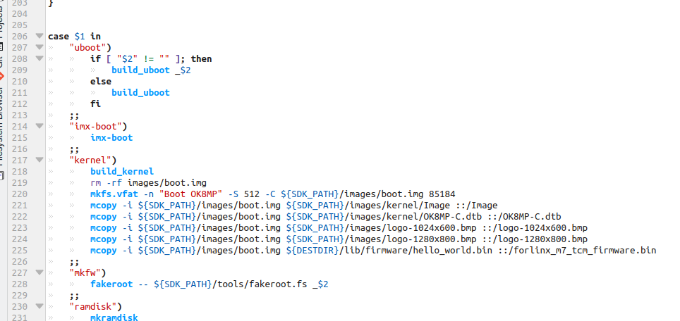

试着用这个脚本编译IMX linux kernel 5.4.70

```
. /opt/fsl-imx-xwayland/5.4-zeus/environment-setup-aarch64-poky-linux
./build.sh kernel
```

需要注意的是，我修改了build.sh，配置`MAKE_JOBS=8`，因为如果设置为16的话，会导致我的ubuntu直接死机，之前编译内核的之后没有出现过这种问题，所以我还是减少了并行编译的线程数。

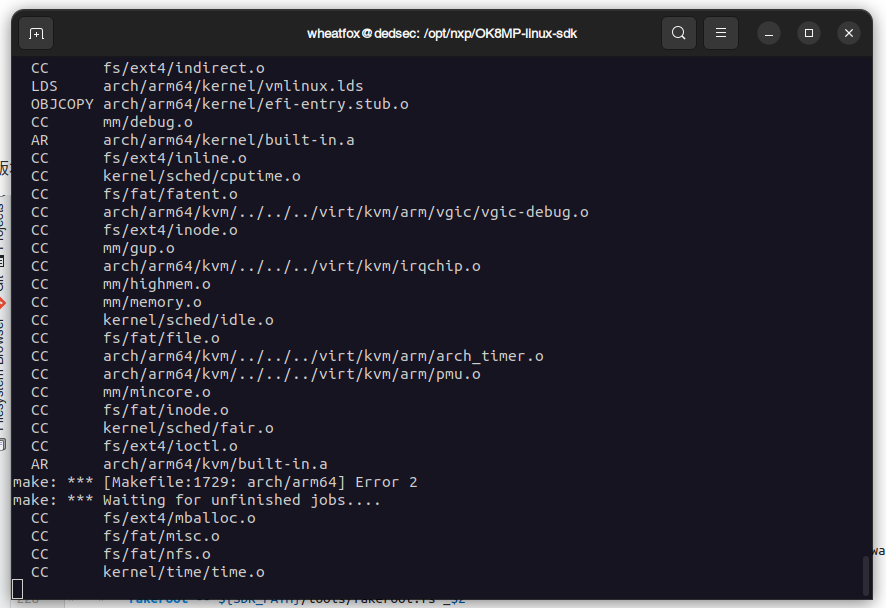

我突然发现这个脚本甚至把jailhouse也编译了，也就算说这个SDK里是有jailhouse的源码的……


位于OK8MP-linux-kernel/extra/jailhouse，这下方便了许多，并且能够保证jailhouse.ko的版本和内核一致。

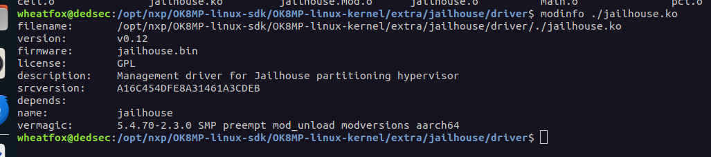

这里的vermagic终于对上了

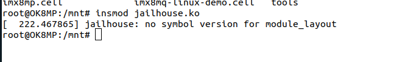

### 上板运行jailhouse

上板成功加载module

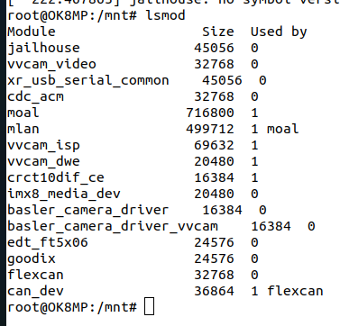

/dev下会多一个jailhouse设备

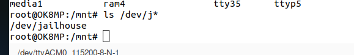

接下来就是在板子上试一下jailhouse

```bash
./jailhouse enable ../imx8mp.cell
```

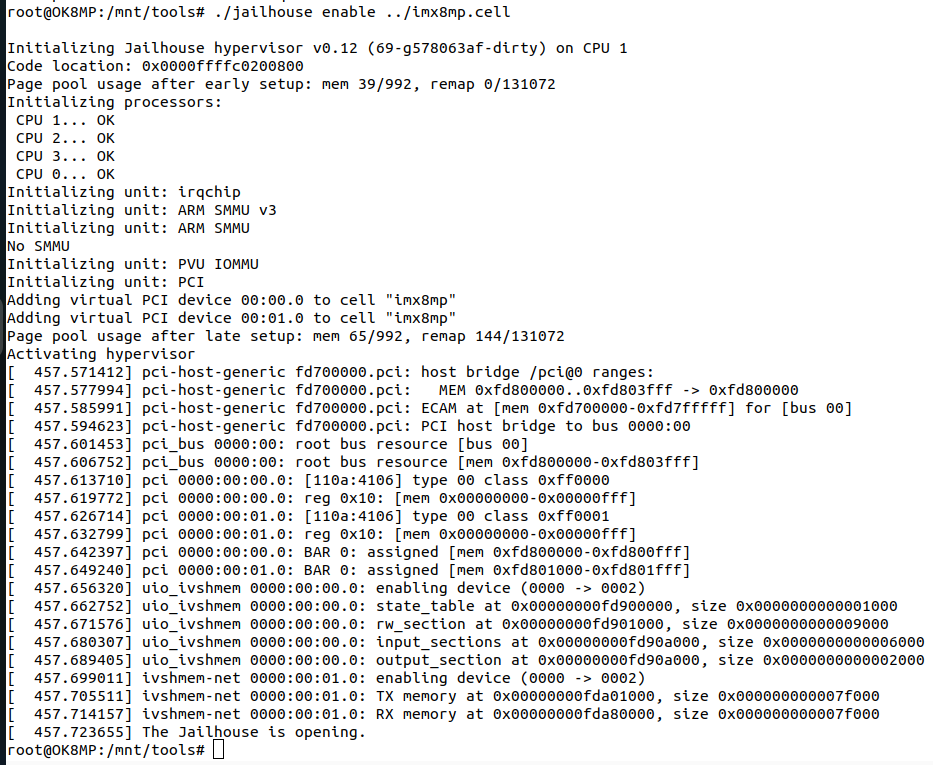

成功配置了默认的板卡配置文件im8mp.cell，可以看到4个CPU都被识别到了。

```bash
./jailhouse cell create ../imx8mp-gic-demo.cell
```

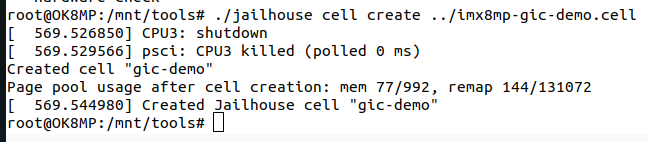

开启gic-demo配置后，CPU3被关闭，查看cell list

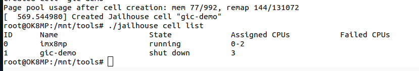

这里gic-demo被分配到了单独的CPU3上，还没有开始运行

```bash
./jailhouse cell start --name gic-demo
```

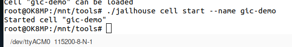

接下来试着启动一个non-root linux cell

准备好kernel和ramdisk

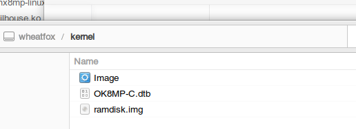


```bash
./tools/jailhouse cell linux ./imx8mp-linux-demo.cell ./kernel/Image -i ./kernel/ramdisk.img
```

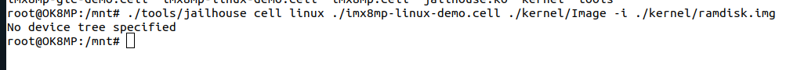

看起来必须传入dtb文件

```bash
./tools/jailhouse cell linux ./imx8mp-linux-demo.cell ./kernel/Image --initrd ./kernel/ramdisk.img --dtb ./kernel/OK8MP-C.dtb
```

报错：

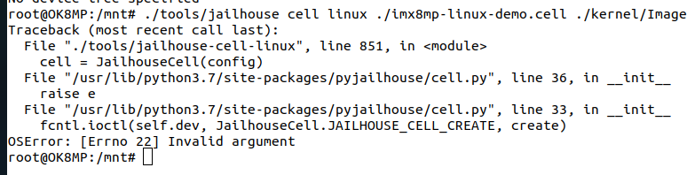

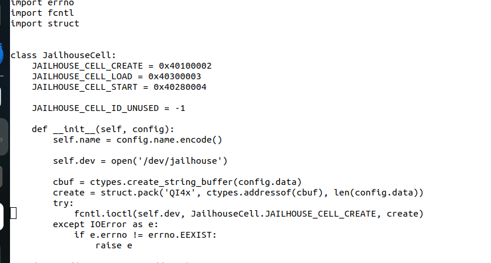

可以看到是`fcntl.ioctl(self.dev, JailhouseCell.JAILHOUSE_CELL_CREATE, create)`出现了问题，报错OSError no.22

首先这段代码将self.dev指向了打开的/dev/jailhouse文件，之后执行了fcntl.ioctl，这里是执行了一个系统调用ioctl

https://docs.python.org/zh-cn/3/library/fcntl.html

https://manpages.debian.org/ioctl(2)

> The **ioctl**() system call manipulates the underlying device parameters of special files. In particular, many operating characteristics of character special files (e.g., terminals) may be controlled with **ioctl**() requests. The argument *fd* must be an open file descriptor.

fcntl.**ioctl**(*fd*, *request*, *arg=0*, *mutate_flag=True*)

fd为文件描述符，request是一个termios参数（https://docs.python.org/zh-cn/3/library/termios.html#module-termios），arg指向一个buffer，ioctl可以理解为对一个device进行操作。怀疑是/dev/jailhouse没有权限写？

```
chmod 777 /dev/jailhouse
```

依然报错`OSError: [Errno 22] Invalid argument`

Error when testing linux on jailhouse https://groups.google.com/g/jailhouse-dev/c/WaSMOYB_XQ4/m/Kp62ClTpCgAJ

https://www.mail-archive.com/jailhouse-dev@googlegroups.com/msg07264.html

```bash
vi /usr/lib/python3.7/site-packages/pyjailhouse/cell.py
```

```bash
insmod jailhouse.ko
./tools/jailhouse enable ./imx8mp.cell
./tools/jailhouse cell linux ./imx8mp-linux-demo.cell ./kernel/Image --initrd ./kernel/ramdisk.img --dtb ./kernel/OK8MP-C.dtb
```

问题解决，应该首先使用enable启动jailhouse！

此时出现新的报错：

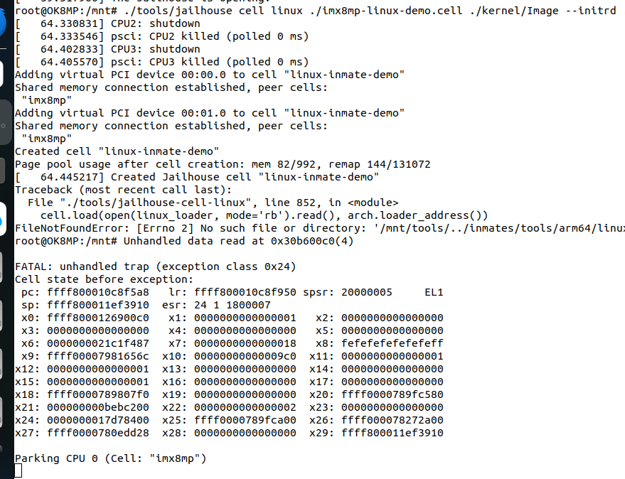

可以看到linux-inmate-demo cell是成功创建了，但是：

```
FileNotFoundError: [Errno 2] No such file or directory: '/mnt/tools/../inmates/tools/arm64/linux-loader.bin'
```

jailhouse在/mnt目录下寻找`inmates/tools/arm64/linux-loader.bin`，但是我U盘里并没有这个文件。

然后板子就死机了：

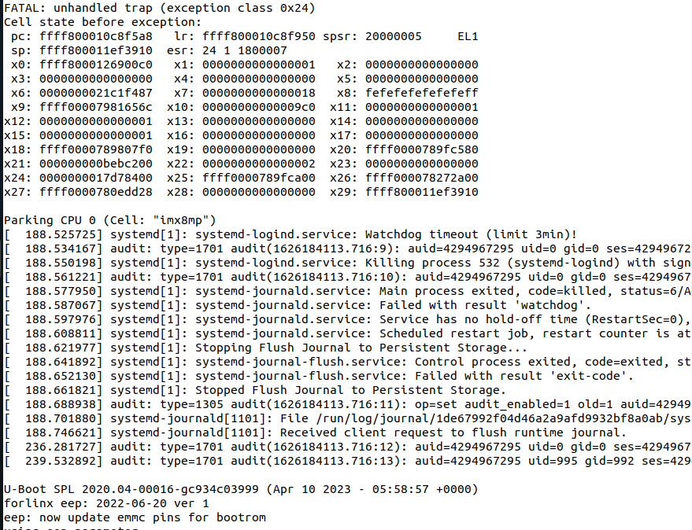

```bash
insmod jailhouse.ko
./tools/jailhouse enable ./imx8mp.cell
./tools/jailhouse cell linux \
	./imx8mp-linux-demo.cell \
	./kernel/Image \
	--initrd ./kernel/ramdisk.img \
	--dtb ./kernel/OK8MP-C.dtb
```

我在jailhouse源码里找到了这个目录

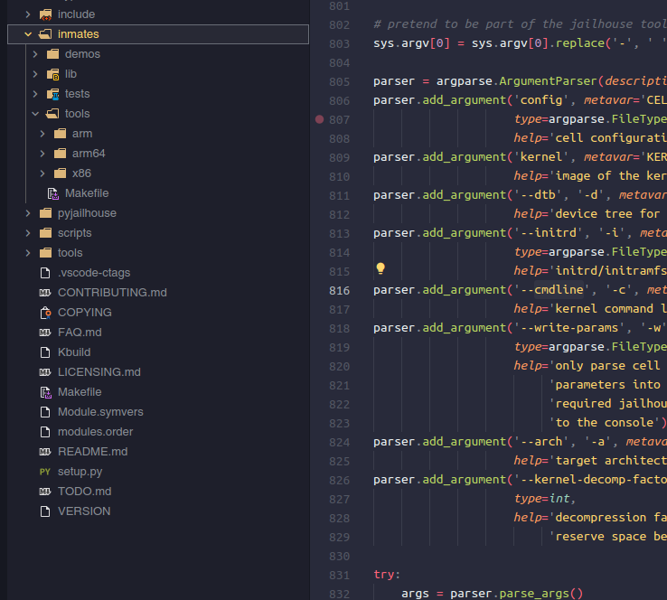

之后没有报错了，但是好像输出并没有打印出来：

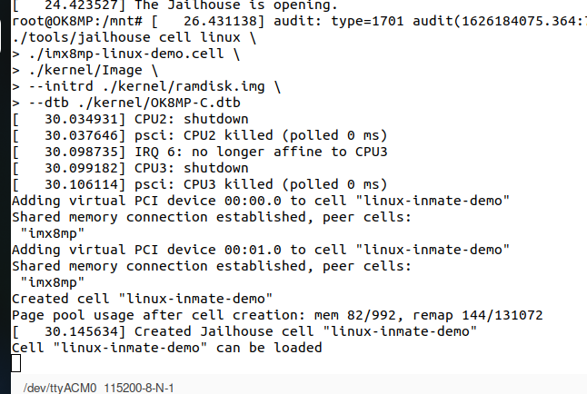

```bash
mount /dev/sda1 /mnt && cd /mnt
insmod jailhouse.ko
./tools/jailhouse enable ./imx8mp.cell
./tools/jailhouse cell linux \
	./imx8mp-linux-demo.cell \
	./kernel/Image \
	-i ./kernel/ramdisk.img \
	-d ./kernel/OK8MP-C.dtb \
	-c "console=ttymxc1,30890000,115200 earlycon=ttymxc1,0x30890000,115200"
```

查看一下板子的串口位置：

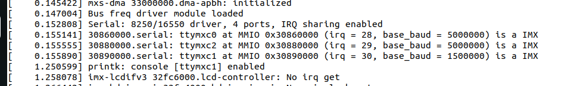

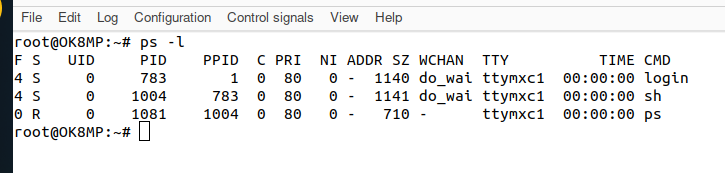

可以看到板子默认使用的是ttymxc1，无论是console还是用户程序都往这个串口输出，通过USB线连接到我的ubuntu的/dev/ttyACM0外部tty。

non-root linux没输出的问题待解决！

## jailhouse cell探究

猜测出问题的一个原因是设备配置的问题，目前jailhouse的启动流程是，首先通过板卡的cell启动jailhouse，之后通过启动linux或自定义的cell以启动一个“虚拟器”并运行linux或裸机程序，而在启动non-root linux时，需要传递一个dtb文件，作为虚拟机linux启动的设备树，这些环节都需要进行研究和配置

在搜索资料的时候，发现了一个jailhouse资料仓库：https://github.com/CJTSAJ/jailhouse-learning

### cell配置文件

`configs/arm64/imx8mp.c`

```c
.header
	.signature = JAILHOUSE_SYSTEM_SIGNATURE,
	.hypervisor_memory = {
        .phys_start = 0xfdc00000,
        .size =       0x00400000, // 保留了4MB的内存供hypervisor使用
    },
    .debug_console = {
        .address = 0x30890000, // 串口MMIO地址
        .size = 0x1000, // 串口寄存器MMIO区域大小
        .flags = JAILHOUSE_CON_ACCESS_MMIO |
             JAILHOUSE_CON_REGDIST_4,
        .type = JAILHOUSE_CON_TYPE_IMX,
    },
    .root_cell = {
        .name = "imx8mp",

        .num_pci_devices = ARRAY_SIZE(config.pci_devices),
        .cpu_set_size = sizeof(config.cpus), // 子配置域cpus
        .num_memory_regions = ARRAY_SIZE(config.mem_regions), // 子配置域mem_regions
        .num_irqchips = ARRAY_SIZE(config.irqchips), // 子配置域irqchips
        /* gpt5/4/3/2 not used by root cell */
        .vpci_irq_base = 51, /* Not include 32 base */
    },

.cpus = {
    0xf, // 4'b1111
},

.mem_regions = {
	... // IVSHMEM 部分（inter vm shared memory)
        // start at 0xfd9f....
    /* IO */ {
        .phys_start = 0x00000000,
        .virt_start = 0x00000000,
        .size =	      0x38800000, // 从0x0开始的984MB是IO区域
        .flags = JAILHOUSE_MEM_READ | JAILHOUSE_MEM_WRITE |
            JAILHOUSE_MEM_IO,
    },
    /* RAM 00*/ {
        .phys_start = 0x40000000,
        .virt_start = 0x40000000,
        .size = 0x80000000, // 从0x4000_0000开始的2G区域是RAM空间
        .flags = JAILHOUSE_MEM_READ | JAILHOUSE_MEM_WRITE |
            JAILHOUSE_MEM_EXECUTE,
    },
    /* Inmate memory */{ // 这里配置好了虚拟机的内存区域
        				 // 从0xc0000000开始，分配了983MB的内存
        .phys_start = 0xc0000000,
        .virt_start = 0xc0000000,
        .size = 0x3d700000,
        .flags = JAILHOUSE_MEM_READ | JAILHOUSE_MEM_WRITE |
            JAILHOUSE_MEM_EXECUTE,
    },
    /* Loader */{
        .phys_start = 0xfdb00000,
        .virt_start = 0xfdb00000,
        .size = 0x100000, // 0xfdb00000存放loader
        				  // 这里的loader指的是什么？查手册
        .flags = JAILHOUSE_MEM_READ | JAILHOUSE_MEM_WRITE |
            JAILHOUSE_MEM_EXECUTE,
    },
    /* OP-TEE reserved memory?? */{
        .phys_start = 0xfe000000,
        .virt_start = 0xfe000000,
        .size = 0x2000000,
        .flags = JAILHOUSE_MEM_READ | JAILHOUSE_MEM_WRITE,
    },
    /* RAM04 */{
        .phys_start = 0x100000000,
        .virt_start = 0x100000000,
        .size = 0xC0000000,
        // RAM04，从0x1_0000_0000开始，3G大小的内存空间
        .flags = JAILHOUSE_MEM_READ | JAILHOUSE_MEM_WRITE,
    },
},

.irqchips // 涉及GIC地址等信息
	/* GIC */ {
        .address = 0x38800000,
        .pin_base = 32, // 这里的pin指什么，查一下NXP的CPU手册
        .pin_bitmap = {
            0xffffffff, 0xffffffff, 0xffffffff, 0xffffffff,
        },
    },
	...

.pci_devices // 挂载了四个JAILHOUSE_PCI_TYPE_IVSHMEM设备
```

接下来看一下linux-inmate的cell配置文件

`configs/arm64/imx8mp-linux-demo.c`

```c
.cell = {
    .signature = JAILHOUSE_CELL_DESC_SIGNATURE, // 不是SYSTEM配置而是CELL描述文件
    .revision = JAILHOUSE_CONFIG_REVISION,
    .name = "linux-inmate-demo",
    .flags = JAILHOUSE_CELL_PASSIVE_COMMREG,

    .cpu_set_size = sizeof(config.cpus),
    .num_memory_regions = ARRAY_SIZE(config.mem_regions),
    .num_irqchips = ARRAY_SIZE(config.irqchips),
    .num_pci_devices = ARRAY_SIZE(config.pci_devices),
    .vpci_irq_base = 154, /* Not include 32 base */
},

.cpus = {
    0xc, // 4'b1100，也就是使用CPU0+1，之前启动这个cell的时候，CPU2和3被关闭了
},

.mem_regions = {
/* UART2 earlycon */ {
        .phys_start = 0x30890000, // 跟上面的debug_console一致
        .virt_start = 0x30890000,
        .size = 0x1000,
        .flags = JAILHOUSE_MEM_READ | JAILHOUSE_MEM_WRITE |
            JAILHOUSE_MEM_IO | JAILHOUSE_MEM_ROOTSHARED,
    },
    /* UART4 */ {
        .phys_start = 0x30a60000, // 加了一个新的UART地址，这个地址我记得是ttymxc0
        /*
        	[    0.154619] 30860000.serial: ttymxc0 at MMIO 0x30860000 (irq = 28, base_baud = 5000000) is a IMX
			[    0.155042] 30880000.serial: ttymxc2 at MMIO 0x30880000 (irq = 29, base_baud = 5000000) is a IMX
			[    0.155376] 30890000.serial: ttymxc1 at MMIO 0x30890000 (irq = 30, base_baud = 1500000) is a IMX
			[    1.250079] printk: console [ttymxc1] enabled
		*/
        .virt_start = 0x30a60000,
        .size = 0x1000,
        .flags = JAILHOUSE_MEM_READ | JAILHOUSE_MEM_WRITE |
            JAILHOUSE_MEM_IO,
    },
    /* SHDC3 */ {
        // SD卡IO区域位于0x30b6_0000
        .phys_start = 0x30b60000,
        .virt_start = 0x30b60000,
        .size = 0x10000,
        .flags = JAILHOUSE_MEM_READ | JAILHOUSE_MEM_WRITE |
            JAILHOUSE_MEM_IO,
    },
    /* RAM: Top at 4GB Space */ {
        .phys_start = 0xfdb00000,
        .virt_start = 0,
        .size = 0x10000, /* 64KB */
        .flags = JAILHOUSE_MEM_READ | JAILHOUSE_MEM_WRITE |
            JAILHOUSE_MEM_EXECUTE | JAILHOUSE_MEM_LOADABLE,
    },
    /* RAM */ {
        /*
         * We could not use 0x80000000 which conflicts with
         * COMM_REGION_BASE
         
        	#define COMM_REGION_BASE	0x80000000
        	
        	位于include/inmate.h中定义，COMM REGION：
        */
        		/** Communication region between hypervisor and a cell. */
        		// 这个内存区域用于hypervisor和cell进行通信
                struct jailhouse_comm_region { // 这里给出x86下的结构定义，ARM也有类似的定义
                    COMM_REGION_GENERIC_HEADER;
                    /** I/O port address of the PM timer (x86-specific). */
                    __u16 pm_timer_address;
                    /** Number of CPUs available to the cell (x86-specific). */
                    __u16 num_cpus;
                    /** Calibrated TSC frequency in kHz (x86-specific). */
                    __u32 tsc_khz;
                    /** Calibrated APIC timer frequency in kHz or 0 if TSC deadline timer
                     * is available (x86-specific). */
                    __u32 apic_khz;
                } __attribute__((packed));
        
                #define COMM_REGION_GENERIC_HEADER					\
                /** Communication region magic JHCOMM */			\
                char signature[6];						\
                /** Communication region ABI revision */			\
                __u16 revision;							\
                /** Cell state, initialized by hypervisor, updated by cell. */	\
                volatile __u32 cell_state;					\
                /** Message code sent from hypervisor to cell. */		\
                volatile __u32 msg_to_cell;					\
                /** Reply code sent from cell to hypervisor. */			\
                volatile __u32 reply_from_cell;					\
                /** Holds static flags, see JAILHOUSE_COMM_FLAG_*. */		\
                __u32 flags;							\
                /** Debug console that may be accessed by the inmate. */	\
                struct jailhouse_console console;				\
                /** Base address of PCI memory mapped config. */		\
                __u64 pci_mmconfig_base;
        
        /*
        	
         */
        .phys_start = 0xc0000000,
        .virt_start = 0xc0000000,
        .size = 0x3d700000, // 983MB内存，从0xc000_0000物理地址开始
        .flags = JAILHOUSE_MEM_READ | JAILHOUSE_MEM_WRITE |
            JAILHOUSE_MEM_EXECUTE | JAILHOUSE_MEM_DMA |
            JAILHOUSE_MEM_LOADABLE,
    },
    /* communication region */ {
        .virt_start = 0x80000000, // 上面提到的通信区域
        .size = 0x00001000, // 4KB
        .flags = JAILHOUSE_MEM_READ | JAILHOUSE_MEM_WRITE |
            JAILHOUSE_MEM_COMM_REGION,
    },
```

### i.MX8板子的dts文件

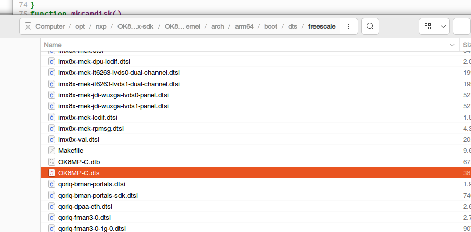

位于厂家SDK中的`{linux kernel src}/arch/arm64/boot/dts/freescale/OK8MP-C.dts`

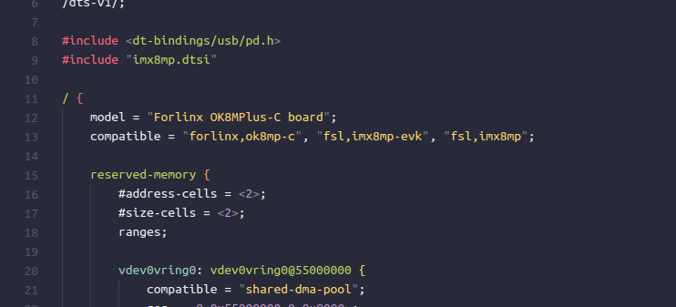

依赖头文件`imx8mp.dtsi`和`pd.h`，正如之前学长所讲的各级厂商针对自己的板子对上游dts文件进行改造。

在OK8MP-C的dts中有一个`/chosen/stdout-path`节点指向了uart2：

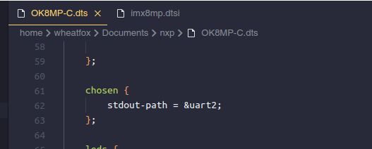

https://community.nxp.com/t5/i-MX-Processors/Specify-console-in-device-tree-chosen-stdout-path/td-p/1286547

一般也可以写成`stdout-path = "/serial@{addr}:115200"`，这里写uart2是因为头文件里有定义：

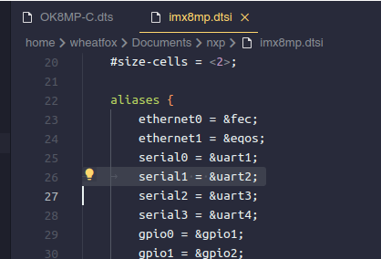


根据NXP提供的i.MX手册：

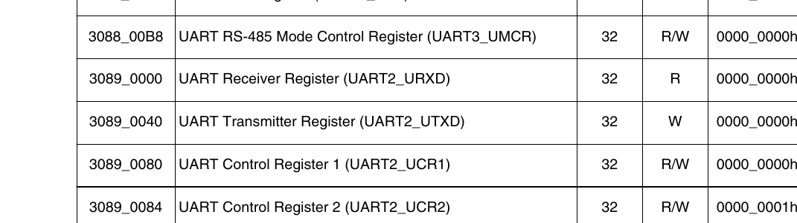

这里就和uboot启动linux时的：

```
[    0.155376] 30890000.serial: ttymxc1 at MMIO 0x30890000 (irq = 30, base_baud = 1500000) is a IMX
[    1.250079] printk: console [ttymxc1] enabled
```

对应上了，并且dtb中定义的3个UART都被linux识别出来了

接下来先看OK8MP-C的设备树

```bash
/reserved-memory
	/vdev0vring0
	/vdev0vring1
	/vdevbuffer
	/rsc-table
	/rpmsg_reserved
	/imx8mp-cm7

/chosen
	/stdout-path=&uart2
	
/leds # 灯
/keys # 按键

/reg_usb1_host_vbus
/reg_usdhc2_vmmc
/usdhc1_pwrseq
/reg_audio_pwr # 音频
/cbtl04gp # 交叉开关crossbar
/bt_sco_codec # 编码器
/sound-bt-sco # 声卡
/sound-hdmi # HDMI
/sound-wm8960 # wm8960声卡
/sound-nau8822 # nau8822立体声音频解码器
/sound-xcvr # 收发器模组
/lvds_backlight # 低振幅差分信号背光
/dsi_backlight # dsi LCD 背光

# 下面是设备树追加数据，对已存在的节点追加定义

&aud2htx { # Audio Subsystem TO HDMI TX Subsystem
	status = "okay";
};

&clk { # 时钟
	init-on-array = <IMX8MP_CLK_HSIO_ROOT>;
};

&A53_0 # CPU
...
&i2c* # I2C
...
&pcie
...
&uart1 { /* BT */
	pinctrl-names = "default";
	pinctrl-0 = <&pinctrl_uart1>;
	assigned-clocks = <&clk IMX8MP_CLK_UART1>;
	assigned-clock-parents = <&clk IMX8MP_SYS_PLL1_80M>;
	fsl,uart-has-rtscts;
	status = "okay";
};
&uart2 {
	/* console */
	pinctrl-names = "default";
	pinctrl-0 = <&pinctrl_uart2>;
	status = "okay";
};
&uart3 {
	pinctrl-names = "default";
	pinctrl-0 = <&pinctrl_uart3>;
	assigned-clocks = <&clk IMX8MP_CLK_UART3>;
	assigned-clock-parents = <&clk IMX8MP_SYS_PLL1_80M>;
	fsl,uart-has-rtscts;
	status = "okay";
};
...
&wdog1 # watchdog
&iomuxc # pin 控制
	/pinctrl_uart*
...
&gpu_3d {
	status = "okay";
};
&gpu_2d {
	status = "okay";
};
```

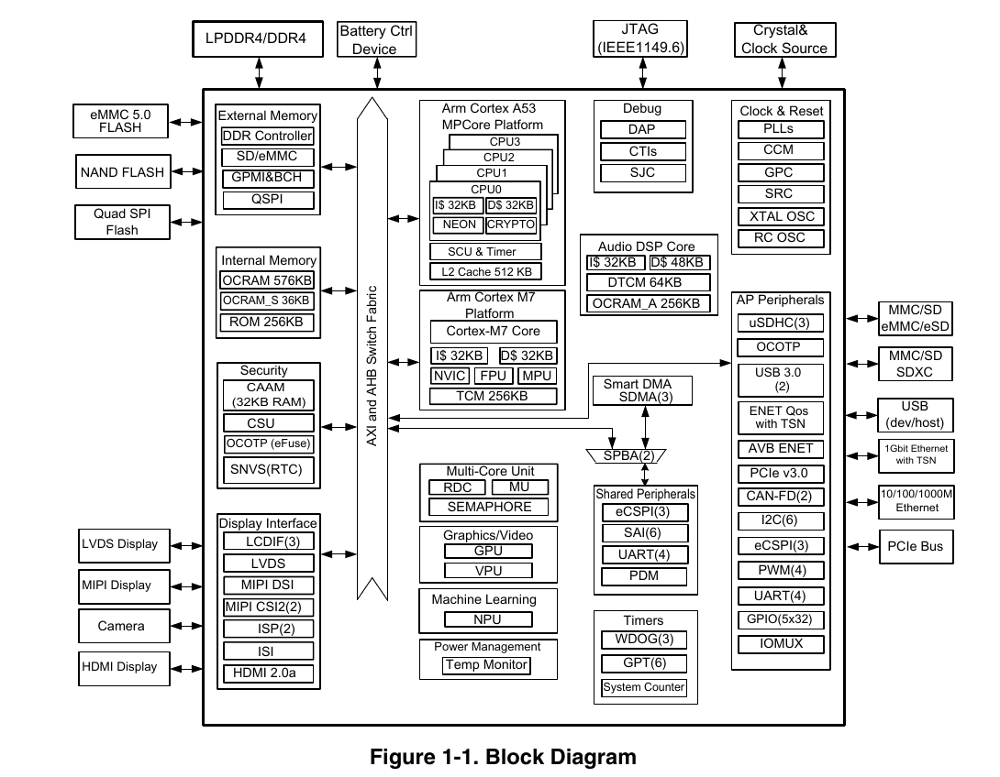

**AXI** (Advanced eXtensible Interface) 高级可拓展接口

**AHB** (Advanced High-performance Bus) 高级高性能总线

**SPBA** (Shared Peripheral Bus Arbiter)

**SDMA** (Smart Direct Memory Access)

**AP Peripherals** (Application Processor Peripherals) ?

## 修改dts并编译

https://zhuanlan.zhihu.com/p/656691650

需要在厂家提供的linux源码里添加修改后的dts文件，位于`arch/arm64/boot/dts`

```bash
cd /opt/nxp/OK8MP-linux-sdk/OK8MP-linux-kernel
. /opt/fsl-imx-xwayland/5.4-zeus/environment-setup-aarch64-poky-linux
make ARCH=arm64 -j8 CROSS_COMPILE=aarch64-poky-linux- dtbs # += Image for build image
```

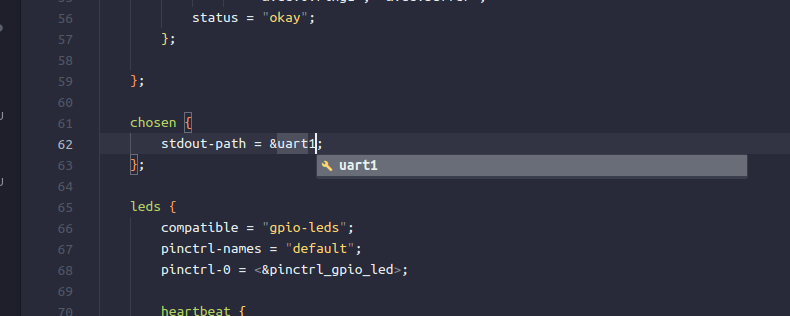

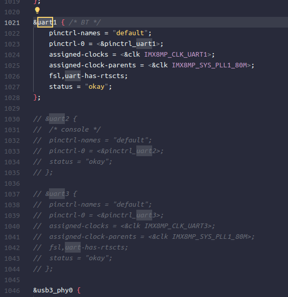

修改Makefile，添加`OK8MP-C-wheatfox.dtb`

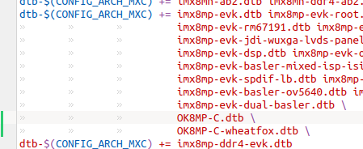

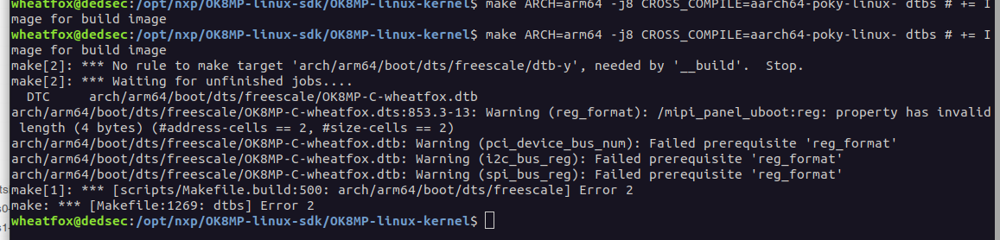

虽然有报错，但实际上dtc只是报出了warning，不过makefile默认认为失败了，可以看到新的dtb文件也生成了：

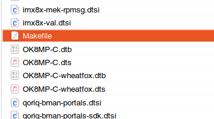

接下来修改扳子启动时的dtb

`OK8MP-C-board.dts`

只留下默认的那个uart2（serial1, ttymxc1）

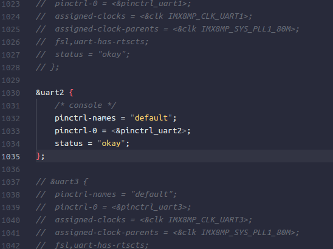

编译后放到u盘里

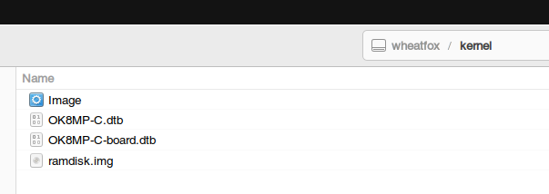

## 修改imx8mp板子启动的设备树

打电话问forlinx技术，了解到进入`/run/media/mmcblk2p`，对应eMMC存储，这个里面放着Image等启动文件

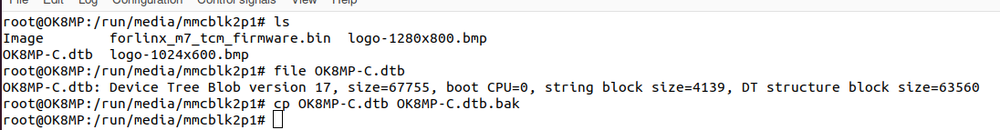

修改启动时使用的dtb，只需要替换这里的`OK8MP-C.dtb`即可，注意名字一定保持不变，否则uboot无法找到设备树文件。

接下来将刚刚修改好的板子启动dtb对原dtb进行替换。

```bash
cp OK8MP-C-board.dtb /run/media/mmcblk2p1/OK8MP-C.dtb
```

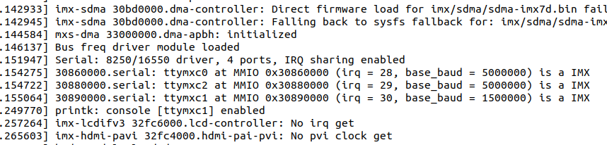

重启后发现设备还是被识别出来了，因为之前只是注释了&节点追加定义，如果要彻底隐藏节点，推测需要在头文件里把根下的节点去掉才可以！

所以需要修改`imx8mp.dtsi` ？


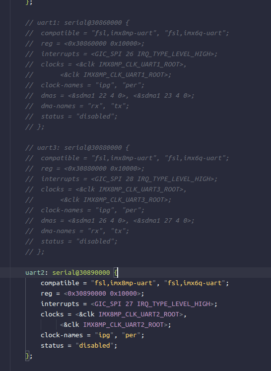

直接修改头文件会导致大量的dts编译报错，因为很多dts需要这些uart1和uart3节点：

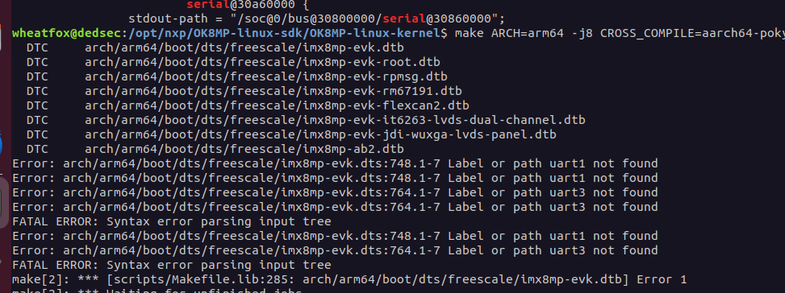

试着在OK8MP厂家dts添加节点补充属性status = "disabled"？

```c
&uart1 {
	status = "disabled";
};

&uart3 {
	status = "disabled";
};

&uart2 {
	/* console */
	pinctrl-names = "default";
	pinctrl-0 = <&pinctrl_uart2>;
	status = "okay";
};
```

成功！更换dtb并重启后，**linux只初始化了uart2(serial1,ttymxc1)**：

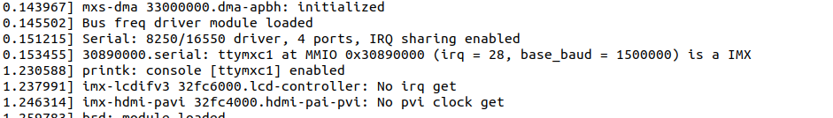

可以看到uart1和uart3都没有被linux识别。

## 启动linux inmate研究

我注意到，厂家给的dts里是有linux inmate系列的dts的：

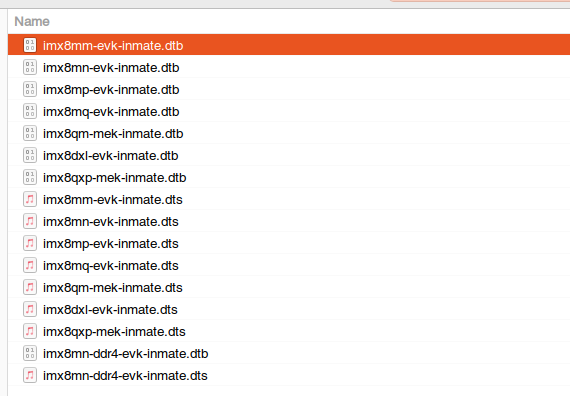

复制一份进行修改：`arch/arm64/boot/dts/freescale/imx8mp-evk-inmate-wheatfox.dts`

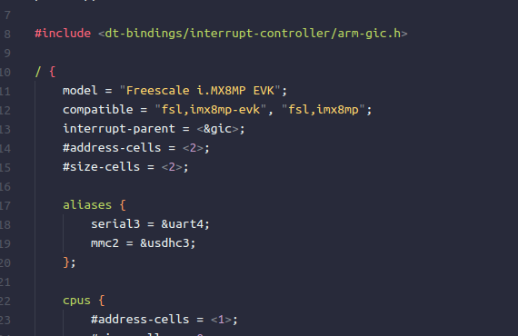

发现这个inmate dts使用的是uart4（恰好和板子定义的前三个串口没有冲突），先试着用这个默认的设备树启动inmate，串口暂时还是用serial1

```bash
./tools/jailhouse enable ./imx8mp.cell
./tools/jailhouse cell linux \
	./imx8mp-linux-demo.cell \
	./kernel/Image \
	-i ./kernel/ramdisk.img \
	-d ./kernel/imx8mp-evk-inmate-wheatfox.dtb \
	-c "clk_ignore_unused console=ttymxc1,0x30890000,115200 earlycon=ec_imx6q,0x30890000,115200"
```

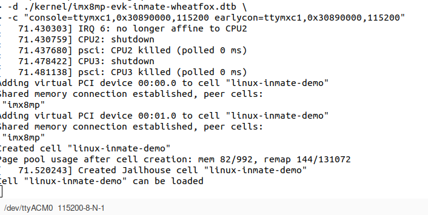

理论上应该要看到Started cell "linux-inmate-demo"才说明成功启动

尝试修改jailhouse源码，在cell_start函数添加printk输出调试信息

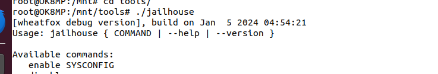

从`cell_set_loadable`函数开始排查。

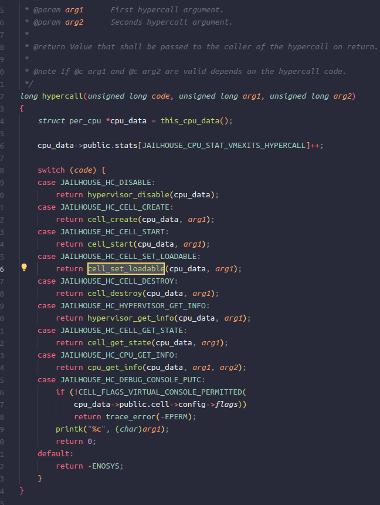

这里涉及到jailhouse对hypercall的处理，也就是说，cell_start是通过一个hypercall进行函数执行的。

在cell.c中，jailhouse_cmd_cell_start执行了hypercall：

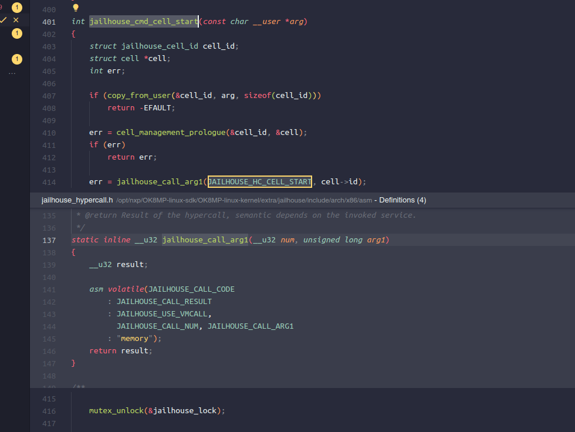

可以看到在cell_load之后，jailhouse cmd又发送了一个cell_load的hypercall。

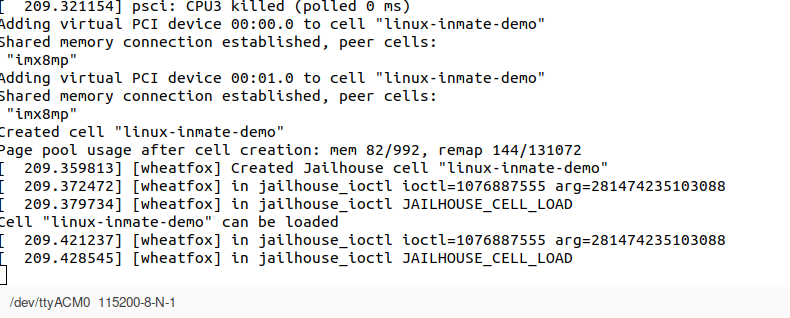

编译的时候出现了问题，在修改了hypervisor firmware部分的代码后，kernel module对应部分并没有更新，及时代码已经被修改了。

在driver/main.c中制定了MODULE_FIRMWARE，在我手动修改为jailhouse.bin1，后，上板运行出现了报错：

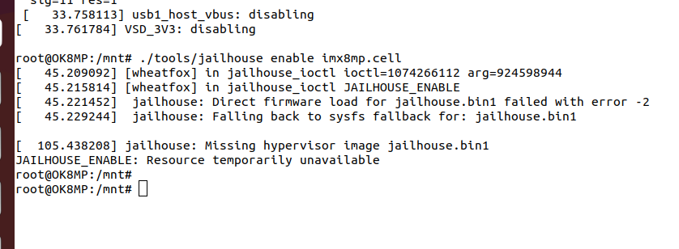

说明kernel module和其注册的firmware（这里即为jailhouse baremetal部分的程序）是分离的，我刚刚修改了firmware代码后，并没有更新在板子上。

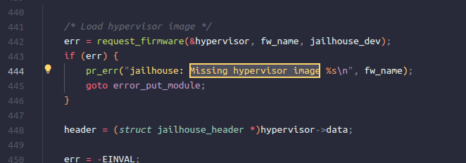

request_firware第一个参数用来保存读取的firmware，第二个参数是固件文件名，第三个是申请固件的设备。

那么固件应该放在哪里呢：

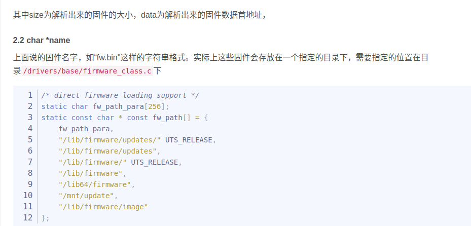

果然在板子的lib/firmware里找到了一直没被更新的固件jailhouse.bin：

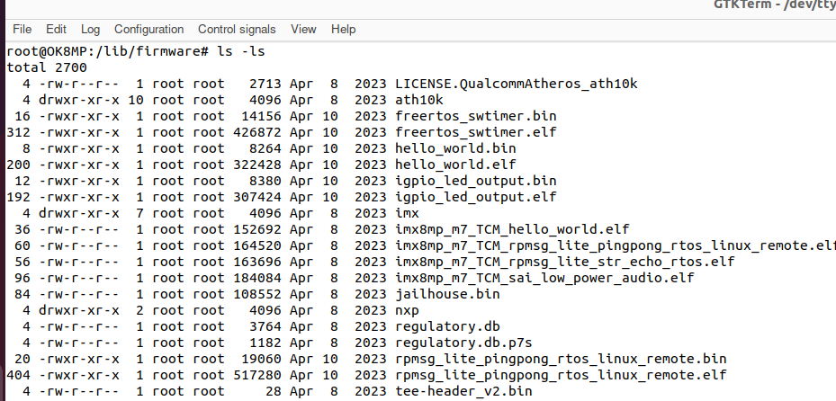

```bash
cp jailhouse.bin /lib/firmware/jailhouse.bin
```

成功更新jailhouse firmware：

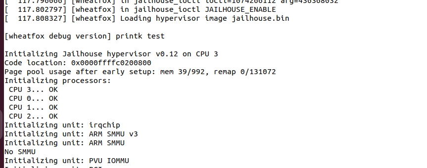

printk排查问题后，发现python脚本在load linux kernel的时候就卡住了，甚至没有开始执行load dtb和load initrd，如何解决？

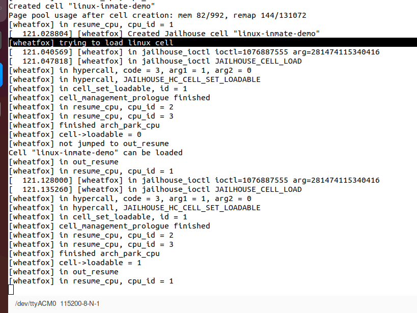

继续打print输出，最后定位到`driver/cell.c:load_image`函数：

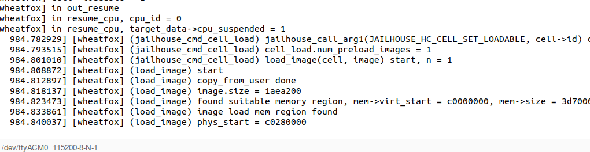

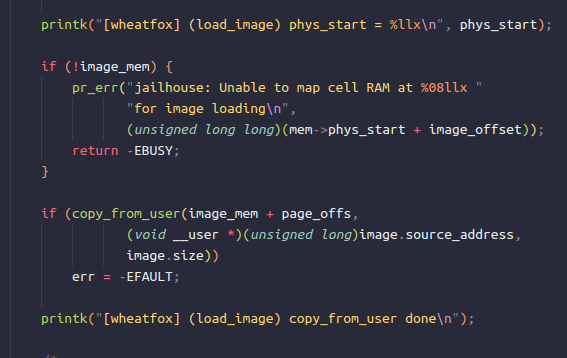

可以看到，卡在了：

```c
if (copy_from_user(image_mem + page_offs,
           (void __user *)(unsigned long)image.source_address,
           image.size))
    err = -EFAULT;
```

导致后面的printk并没有输出，可以确定的是image传递是成功的，并且也找到了放image的内存区域`0xc000_0000`，image加载的物理地址为`0xc0280000`，image大小为`0x1aea200`，为`26.91455078125MB`，这个和传入的文件大小吻合。

也就是说目前整个inmate linux启动程序在`load_image`中的`copy_from_user`函数卡住了！

查了一下发现，copy_from_user并不是jailhouse定义的函数，而是linux kernel提供的函数。

(linux 6.7)

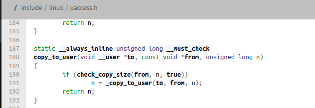

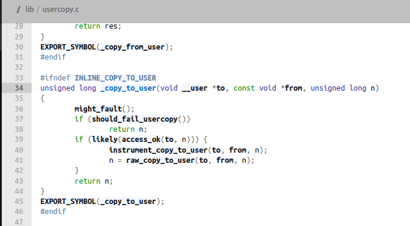


其中to是需要加载到的目标内核空间地址，from则是用户空间中的源地址，n表示需要copy多少字节。

### OK8MP硬件信息梳理

`CPU: i.MX8MP[8] rev1.1 1600 MHz (running at 1200 MHz)`

*i.MX 8M Plus Applications Processor Reference Manual Document Number: IMX8MPRM Rev. 1, 06/2021*

执行cat /proc/iomem后，涉及RAM的部分：                                                                                                                                                                                                                                                                                                                                                                                                                                                                                                                                                                                                                                                                                                                                                                                                                                                                                                                                                                                                                                                                                                                                                                                                                                                                                                                                                                                                                                                                                                                                                                                                                                                                                                                                                                                                                                                                                                                                                                                                                                                                                                                                                                                                                                                                                                                                                                                                                                                                                                                                                                                                                                                                                                                                                                                                                                                                                                                                                                                                                                                                                                                                                                                                                                                                                                                                                                                                                                                                                                                                                                                                                                                                                                                                                                                                                                                                                                                                                                                                                                                                                                                                                                                                                                                                                                                                                                                                                                                                                                                                                                                                                                                                                                                                                                                                                                                                                                                                                                                                                                                                                                                                                                                                                                                                                                                                                                                                                                                                                                                                                                                                                                                                                                                                                                                                                                                                                                                                                                                                                                                                                                                                                                                                                                                                                                                                                                                                                                                                                                                                                                                                                                                                                                                                                                                                                                                                                                                                                                                             

```
40000000-53ffffff : System RAM
  40480000-41b5ffff : Kernel code
  41b60000-41e2ffff : reserved
  41e30000-4206bfff : Kernel data
  43000000-43010fff : reserved
54ff0000-54ffffff : System RAM
55010000-550fefff : System RAM
55100000-553fffff : System RAM
55500000-557fffff : System RAM
58000000-923fffff : System RAM
  62000000-91ffffff : reserved
94400000-bfffffff : System RAM
  bd600000-bd9fffff : reserved
  bdbfe000-bf9fffff : reserved
  bfa72000-bfb72fff : reserved
  bfb73000-bfbd2fff : reserved
  bfbd5000-bfbdafff : reserved
  bfbdb000-bfbdbfff : reserved
  bfbdc000-bfffffff : reserved
```

结合imx8mp.cell：

```c
IO: 		0x00000000 - 0x40000000 size=0x40000000 1G
RAM01: 		0x40000000 - 0xc0000000 size=0x80000000 2G
Inmate RAM: 0xc0000000 - 0xfd700000 size=0x3d700000 983M
Loader:		0xfdb00000 - 0xfdc00000 size=0x100000 1M
...
RAM04:		0x100000000 - 0x1c0000000 size=0xC0000000 3G
```

imx8mq-linux-demo.cell：

```c
UART1_ec:	0x30860000
UART2:		0x30890000
SHDC1:		0x30b40000
RAM:		0xc0000000 - 0xfdc00000 size=0x3dc00000 988M
Comm:		vaddr 0x80000000
```

这里我发现了一个问题，板子上打印出来的iomem中的物理内存区域和cell文件里的对不上，以及Image的load_addr：

```c
[wheatfox|python] trying to load kernel into cell, addr=0xc0280000
```

这个地址是保存在哪里的？如果0xc这个地址并没有在板子上被映射到RAM，那为什么编译出来的Image要加载到这里？还有一个Loader区域，这个区域是能够正常加载linux-loader.bin的，但是0xfdb这个地址也没有在iomem中显示。

接下来启动jailhouse，然后再打印一下iomem：

```bash
...
3d800000-3dbfffff : 3d800000.ddr_pmu ddr_pmu@3d800000
# END OF IO MEM
40000000-53ffffff : System RAM
  40480000-41b5ffff : Kernel code
  41b60000-41e2ffff : reserved
  41e30000-4206bfff : Kernel data
  43000000-43010fff : reserved
54ff0000-54ffffff : System RAM
55010000-550fefff : System RAM
55100000-553fffff : System RAM
55500000-557fffff : System RAM
58000000-923fffff : System RAM
  62000000-91ffffff : reserved
94400000-bfffffff : System RAM
  bd600000-bd9fffff : reserved
  bdbfe000-bf9fffff : reserved
  bfa72000-bfb72fff : reserved
  bfb73000-bfbd2fff : reserved
  bfbd5000-bfbdafff : reserved
  bfbdb000-bfbdbfff : reserved
  bfbdc000-bfffffff : reserved
# 下面这部分是jailhouse新建的映射
fd700000-fd7fffff : PCI ECAM
fd800000-fd803fff : pci@0
  fd800000-fd800fff : 0000:00:00.0
    fd800000-fd800fff : uio_ivshmem[0000:00:00.0]
  fd801000-fd801fff : 0000:00:01.0
    fd801000-fd801fff : ivshmem-net
fd900000-fd900fff : uio_ivshmem[0000:00:00.0]
fd901000-fd909fff : uio_ivshmem[0000:00:00.0]
fd90a000-fd90ffff : uio_ivshmem[0000:00:00.0]
fda00000-fda00fff : ivshmem-net
fda01000-fdafefff : ivshmem-net
fdc00000-fdffffff : Jailhouse hypervisor
```

虽然启动jailhouse后有一些新的mem区域，但是里面也没有0xc0000000和0xfdb00000。

### 调整linux inmate内存配置

查一下jailhouse的python脚本是如何获得image的load addr的，其核心逻辑位于`ARMCommon.setup()`中：

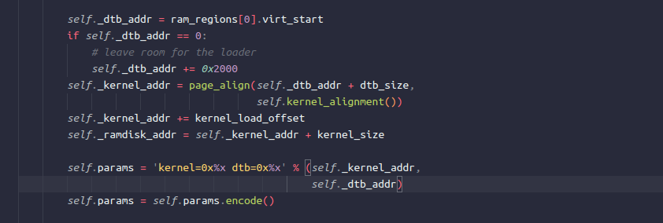

这里的逻辑是，如果找到一个内存区域，则load会自动设置为这个内存区域的开头，然后dtb等附加文件依次摆放。

我修改了imx8mp-linux-demo.c的配置，将0xc开头的内存区域调整为0x6000_0000，大小暂定为256MB，因为我目前的板子是2G内存的型号，而默认的cell文件似乎是为4G内存准备的，0xc开头的部分在我的板子上并不存在。调整后成功加载并启动linux inmate：

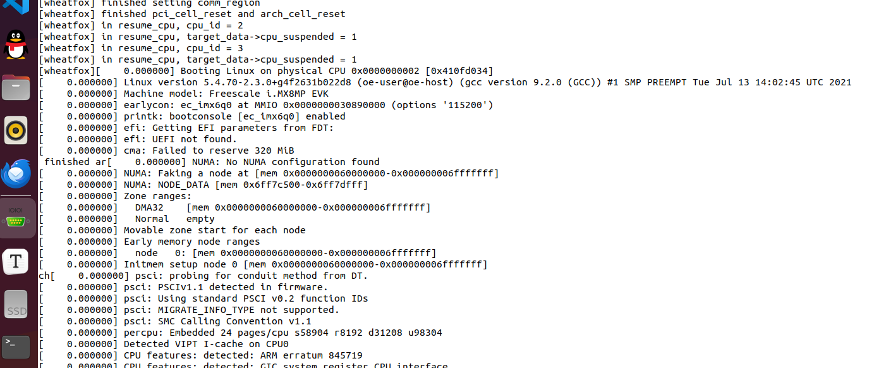

可以看到内存区域确实是限制在0x6000这里的配置好的区域了：

```c
[    0.000000] NUMA: Faking a node at [mem 0x0000000060000000-0x000000006fffffff]
[    0.000000] NUMA: NODE_DATA [mem 0x6ff7c500-0x6ff7dfff]
[    0.000000] Zone ranges:
[    0.000000]   DMA32    [mem 0x0000000060000000-0x000000006fffffff]
[    0.000000]   Normal   empty
[    0.000000] Movable zone start for each node
[    0.000000] Early memory node ranges
[    0.000000]   node   0: [mem 0x0000000060000000-0x000000006fffffff]
[    0.000000] Initmem setup node 0 [mem 0x0000000060000000-0x000000006fffffff]
```

并且启动的CPU也确实只有两个：

```c
[    0.000000] Booting Linux on physical CPU 0x0000000002 [0x410fd034]
...
[    0.063542] CPU1: Booted secondary processor 0x0000000003 [0x410fd034]
[    0.063602] smp: Brought up 1 node, 2 CPUs
[    0.083838] SMP: Total of 2 processors activated.
[    0.088338] CPU features: detected: 32-bit EL0 Support
[    0.093262] CPU features: detected: CRC32 instructions
```

启动时遇到的第一个严重的问题是ramdisk“损坏”：

```c
[    0.442452] Unpacking initramfs...
[    0.445603] Initramfs unpacking failed: invalid magic at start of compressed archive
[    0.455219] Freeing initrd memory: 8696K
...
[    1.292349] Kernel panic - not syncing: VFS: Unable to mount root fs on unknown-block(0,0)
```

因为我传递的不是cpio格式的ramfs而是一个ramdisk.img，猜测可能是这里的原因，那么就需要手动编译一个loongarch64的rootfs并打包为cpio

### 编译一个rootfs

下载busybox 1.36.0源码。

```bash
. /opt/fsl-imx-xwayland/5.4-zeus/environment-setup-aarch64-poky-linux
make ARCH=arm64 CROSS_COMPILE=aarch64-poky-linux- menuconfig
make ARCH=arm64 CROSS_COMPILE=aarch64-poky-linux- -j16
make ARCH=arm64 CROSS_COMPILE=aarch64-poky-linux- install CONFIG_PREFIX=./build
```

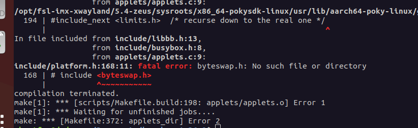

https://community.nxp.com/t5/Layerscape/busybox-compile/td-p/735970

实际上在厂家提供的SDK里就有编译rootfs和ramdisk的部分，可以研究一下：

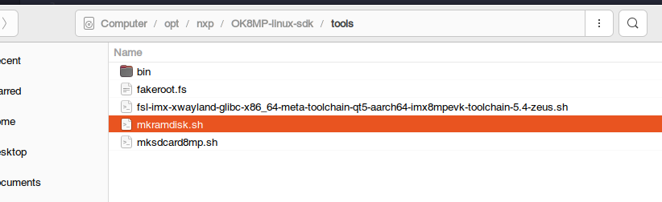

```bash
#!/bin/bash
 
dd if=/dev/zero of=$SDK_PATH/images/ramdisk.ext4 bs=1M count=0 seek=32
mkfs.ext4 -F -i 4096 $SDK_PATH/images/ramdisk.ext4 -d $SDK_PATH/tools/ramdisk
gzip --best -c $SDK_PATH/images/ramdisk.ext4 > $SDK_PATH/images/ramdisk.ext4.gz

mkimage -n "ramdisk" -A arm -O linux -T ramdisk -C gzip -d $SDK_PATH/images/ramdisk.ext4.gz $SDK_PATH/images/ramdisk.img
rm $SDK_PATH/images/ramdisk.ext4 $SDK_PATH/images/ramdisk.ext4.gz
#pushd $SDK_PATH/tools/ramdisk/
#find . | cpio -o -Hnewc  | gzip -9 > $SDK_PATH/tools/ramdisk.cpio.gz
#popd

#$SDK_PATH/tools/bin/mkimage -n "ramdisk" -A arm -O linux -T ramdisk -C none -d $SDK_PATH/tools/ramdisk.cpio.gz $SDK_PA#TH/images/ramdisk.img
 
#rm $SDK_PATH/tools/ramdisk.cpio.gz
```

可以看到，这里的img实际上是uboot image镜像，通过把ramdisk.ext4文件mkimage制作而成，接下来需要尝试制作cpio文件。

因为之前在启动rust-shyper的时候，我编译了一份arm64的busybox的rootfs，试着打包为cpio：

```bash
find ./build | cpio -o -H newc | gzip > rootfs.cpio.gz
```

更换cpio后没有unpacking报错了，但是出现了新的unhandled trap：

```
FATAL: unhandled trap (exception class 0x24)
Cell state before exception:
 pc: ffff800010a5dbd8   lr: ffff800010a50f38 spsr: 20000005     EL1
 sp: ffff800011c93bd0  esr: 24 1 1830006 ESR_RAW=0000000093830006
 x0: ffff000078818110   x1: ffff00007881ab80   x2: ffff800011f581f0
  x3: ffff800010a5dbd8   x4: 0000000000000000   x5: ffff80006e349000
 x6: 0000000002dbd7d7   x7: ffff00007fb80540   x8: ffff000015097a20
 x9: ffff800011c93d50  x10: 00000000000009c0  x11: 0000000000000166
x12: 0000000000000030  x13: 0000000000000000  x14: ffffffffffffffff
x15: ffff0000151f4a70  x16: 0000000000000000  x17: 0000000000000000
x18: 0000000000000010  x19: 0000000000000000  x20: 0000000000000000
x21: ffff000078818840  x22: ffff800011f581f0  x23: 00000000000023e0
x24: ffff0000771ee3e0  x25: 000000000000012c  x26: ffff0000771ec000
x27: ffff00007881ab80  x28: ffff000078818840  x29: ffff800011c93bd0
```

这里的FATAL: unhandled trap (exception class 0x24)是jailhouse的输出：

```c
void arch_handle_trap(union registers *guest_regs)
{
	struct trap_context ctx;
	trap_handler handler;
	int ret = TRAP_UNHANDLED;

	fill_trap_context(&ctx, guest_regs);

	handler = trap_handlers[ESR_EC(ctx.esr)];
	if (handler)
		ret = handler(&ctx);

	if (ret == TRAP_UNHANDLED || ret == TRAP_FORBIDDEN) {
		panic_printk("\nFATAL: %s (exception class 0x%02llx)\n",
			     (ret == TRAP_UNHANDLED ? "unhandled trap" :
						      "forbidden access"),
			     ESR_EC(ctx.esr));
		panic_printk("Cell state before exception:\n");
		dump_regs(&ctx);
		panic_park();
	}
}
```

调查一下ESR的内容：`0000000093830006`

https://esr.arm64.dev/#2474835974

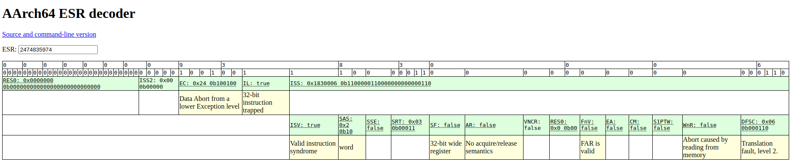

```
EC: 0x24 0b100100
Data Abort from a lower Exception level
32-bit instruction trapped
Abort caused by reading from memory
Translation fault, level 2.
```

## 调试non-root linux

### jailhouse flags研究

jailhouse中对内存属性的配置flag位于`include/jailhouse/cell-config.h`

```c
#define JAILHOUSE_MEM_READ		0x0001 // 内存可读
#define JAILHOUSE_MEM_WRITE		0x0002 // 内存可写
#define JAILHOUSE_MEM_EXECUTE		0x0004 // 内存可执行
#define JAILHOUSE_MEM_DMA		0x0008 // 用于外设进行DMA的区域
#define JAILHOUSE_MEM_IO		0x0010 // IO区域
#define JAILHOUSE_MEM_COMM_REGION	0x0020 // jailhouse communication区域
#define JAILHOUSE_MEM_LOADABLE		0x0040 // 可加载（image, loader, dtb, initramfs...）
#define JAILHOUSE_MEM_ROOTSHARED	0x0080 // root和non-root的共享内存区域
#define JAILHOUSE_MEM_NO_HUGEPAGES	0x0100 // 该区域的映射不使用大页
#define JAILHOUSE_MEM_IO_UNALIGNED	0x8000 // IO，访问的地址需要在access data size上对齐，若未对齐则报错，除非mem配置了这个flag
#define JAILHOUSE_MEM_IO_WIDTH_SHIFT	16 /* uses bits 16..19 */
#define JAILHOUSE_MEM_IO_8		(1 << JAILHOUSE_MEM_IO_WIDTH_SHIFT) // 下面4个在jailhouse源码里并没有处理的代码
#define JAILHOUSE_MEM_IO_16		(2 << JAILHOUSE_MEM_IO_WIDTH_SHIFT) // 其主要通过size<<JAILHOUSE_MEM_IO_WIDTH_SHIFT进行判断
#define JAILHOUSE_MEM_IO_32		(4 << JAILHOUSE_MEM_IO_WIDTH_SHIFT) // 即配置了IO区域访问时的“data size“大小，分为4档
#define JAILHOUSE_MEM_IO_64		(8 << JAILHOUSE_MEM_IO_WIDTH_SHIFT)
```

**jailhouse subpage**

小于最小page

`static enum mmio_result mmio_handle_subpage(void *arg, struct mmio_access *mmio)`

对于一块jailhouse mem，可以注册其为subpage，此时会绑定一个mmio_handle_subpage函数

这个函数会检查：

1. 区域的flags和mmio本身的请求（读/写）进行匹配
2. mmio访问指定的size和区域之前配置的size一致
3. 检查mmio访问的对齐
4. 调用paging_create，修改当前的页表添加一片临时映射
5. mmio_perform_access，通过临时页表进行实际的MMIO访问

报错的地址`0x62099abc`，调查一下这个地址是位于哪个部分：

```
linux_loader, size=0x34b0, addr=0x0
kernel image, size=0x1ab7200, addr=0x60280000
dtb, size=0xc75, addr=
initd, size=0x202574, addr=0x637f0000
```

推测6200_0000这个地方有区域不能作为内存来用，移动inmate mem，避开这个区域

去NXP的CPU手册里看一下这个0x60的地址属于哪个部分：

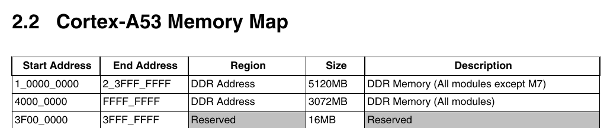

可以看到从0x4000_0000往上一直到0xffff_ffff都是DDR的内存区域，所以为什么将kernel和其他东西从0x6000_0000开始放的时候0x62099abc会报错？这个地址也不是kernel代码地址，也不是dtb地址。

### unable to mount rootfs错误

```
[    1.290936] Warning: unable to open an initial console.
[    1.296010] VFS: Cannot open root device "(null)" or unknown-block(0,0): error -6
[    1.303085] Please append a correct "root=" boot option; here are the available partitions:
[    1.311087] Kernel panic - not syncing: VFS: Unable to mount root fs on unknown-block(0,0)
```

从console可以看到cpio的initramfs成功进行了解压，猜测问题出现在rootfs的格式上，重新进行打包：

```
cd build
find .| cpio -o -H newc | gzip > ../rootfs.cpio.gz
```

更新boot cmdline：

```
./tools/jailhouse cell linux \
	./imx8mp-linux-demo-wheatfox.cell \
	/boot/Image \
	-i ./kernel/rootfs.cpio.gz \
	-d ./kernel/imx8mp-evk-inmate-wheatfox.dtb \
	-c "clk_ignore_unused console=ttymxc3,0x30a60000,115200 earlycon=ec_imx6q,0x30890000,115200 root=/dev/ram rdinit=/sbin/init rootwait rw"
```

rootwait会让linux不立即去寻找root挂载设备（如使用USB作为root），这里通过设置root=/dev/ram和rdinit将initramfs挂载上。rw则表示该root device是挂载为可读写的（我这里的root device即initramfs在内存中的一个虚拟的设备）。同时这里我也指定了non-root linux使用ttymxc3串口。

### ttymxc3串口

目前这个串口虽然启用了，但是向串口echo时并没有任何输出。

调查发现OK8MP-C.dts里的pinctrl写错了，修改之后跑通了：

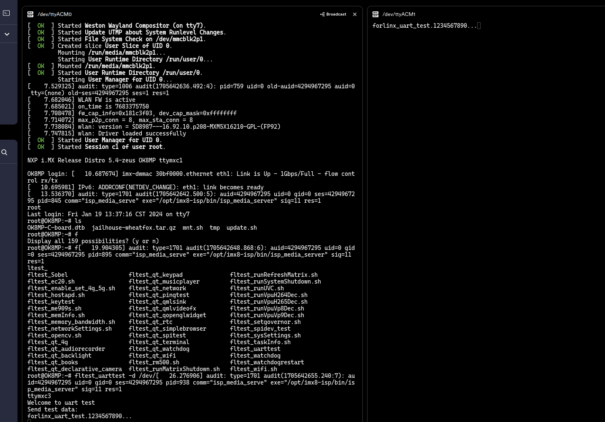

但是串口驱动这个新串口的时候报错SError，原因未知。

完整的报错信息：

```log
[    0.688492] Serial: 8250/16550 driver, 4 ports, IRQ sharing enabled
[    0.693056] 30a60000.serial: ttymxc3 at MMIO 0x30a60000 (irq = 5, base_baud = 1500000) is a IMX
[    0.700479] SError Interrupt on CPU0, code 0xbf000002 -- SError
[    0.700481] CPU: 0 PID: 1 Comm: swapper/0 Not tainted 5.4.70-2.3.0+g4f2631b022d8 #1
[    0.700483] Hardware name: Freescale i.MX8MP EVK (DT)
[    0.700484] pstate: 20000085 (nzCv daIf -PAN -UAO)
[    0.700485] pc : imx_uart_readl+0x80/0xa0
[    0.700487] lr : imx_uart_console_putchar+0x24/0x40
[    0.700488] sp : ffff80001002b790
[    0.700489] x29: ffff80001002b790 x28: ffff800011a66cf8 
[    0.700493] x27: ffff800011b47328 x26: 0000000000000484 
[    0.700496] x25: 0000000000000000 x24: 000000000000402b 
[    0.700498] x23: 0000000000000001 x22: ffff80001069fc18 
[    0.700501] x21: ffff0000283ab880 x20: ffff800011b478b1 
[    0.700504] x19: ffff800011b47882 x18: 0000000000000010 
[    0.700507] x17: 0000000000000000 x16: 0000000000000001 
[    0.700510] x15: ffff000028040470 x14: ffffffffffffffff 
[    0.700513] x13: ffff80009002b7f7 x12: ffff80001002b7ff 
[    0.700516] x11: ffff800011a21000 x10: ffff800011b47328 
[    0.700519] x9 : 0000000000000000 x8 : ffff800011b48000 
[    0.700522] x7 : ffff80001069fd78 x6 : 0000000000000006 
[    0.700525] x5 : 0000000000000003 x4 : 0000000000000020 
[    0.700528] x3 : ffff0000283ab880 x2 : ffff0000283ab880 
[    0.700531] x1 : ffff8000122100b4 x0 : 0000000000000060 
[    0.700535] Kernel panic - not syncing: Asynchronous SError Interrupt
[    0.700537] CPU: 0 PID: 1 Comm: swapper/0 Not tainted 5.4.70-2.3.0+g4f2631b022d8 #1
[    0.700538] Hardware name: Freescale i.MX8MP EVK (DT)
[    0.700539] Call trace:
[    0.700540]  dump_backtrace+0x0/0x140
[    0.700542]  show_stack+0x14/0x20
[    0.700543]  dump_stack+0xb4/0x114
[    0.700544]  panic+0x158/0x324
[    0.700545]  nmi_panic+0x84/0x88
[    0.700546]  arm64_serror_panic+0x74/0x80
[    0.700547]  do_serror+0x80/0x138
[    0.700548]  el1_error+0x84/0xf8
[    0.700550]  imx_uart_readl+0x80/0xa0
[    0.700551]  uart_console_write+0x58/0x78
[    0.700552]  imx_uart_console_write+0x114/0x1f0
[    0.700554]  console_unlock.part.0+0x234/0x3b0
[    0.700555]  vprintk_emit+0x16c/0x298
[    0.700556]  vprintk_default+0x38/0x40
[    0.700557]  vprintk_func+0xe4/0x2c0
[    0.700558]  printk+0x5c/0x7c
[    0.700560]  register_console+0x298/0x378
[    0.700561]  uart_add_one_port+0x4a0/0x4c8
[    0.700562]  imx_uart_probe+0x4cc/0x718
[    0.700563]  platform_drv_probe+0x50/0xa0
[    0.700564]  really_probe+0xd4/0x318
[    0.700566]  driver_probe_device+0x54/0xe8
[    0.700567]  device_driver_attach+0x6c/0x78
[    0.700568]  __driver_attach+0x54/0xd0
[    0.700569]  bus_for_each_dev+0x6c/0xc0
[    0.700571]  driver_attach+0x20/0x28
[    0.700572]  bus_add_driver+0x140/0x1e8
[    0.700573]  driver_register+0x60/0x110
[    0.700574]  __platform_driver_register+0x44/0x50
[    0.700576]  imx_uart_init+0x38/0x5c
[    0.700577]  do_one_initcall+0x50/0x1a8
[    0.700578]  kernel_init_freeable+0x194/0x23c
[    0.700579]  kernel_init+0x10/0x100
[    0.700581]  ret_from_fork+0x10/0x1c
[    0.700594] SMP: stopping secondary CPUs
[    0.700596] Kernel Offset: disabled
[    0.700597] CPU features: 0x0002,2000200c
[    0.700598] Memory Limit: none
```

可以看到是imx_uart_readl函数出现了报错，并且lr寄存器指向的是imx_uart_console_putchar。猜测可能是因为root linux已经分配了uart4（板子启动的设备树里有），然后启动non-root linux的时候重复初始化导致报错？试着在root linux里禁用uart4，只留给non root linux用。

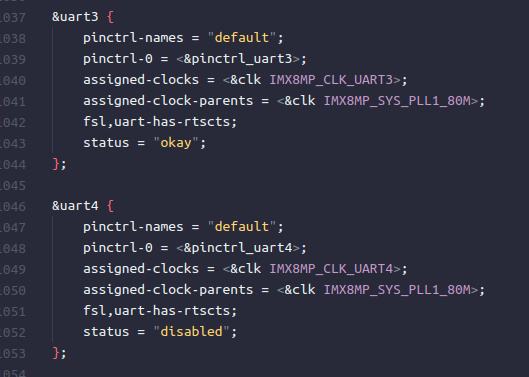

替换板子dtb后重启并启动non root linux依然会有同样的报错，所以不是这个原因：

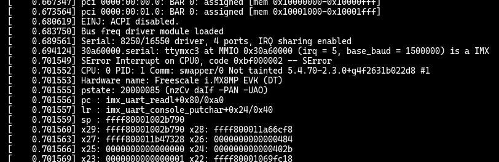

调查一下这个Kernel Panic: Asynchronous SError Interrupt

手册中的描述：

> **物理中断**是响应处理器外部信号而生成的中断。通常由外围设备生成。系统不会让核心不断轮询外部信号，而是通过生成中断来通知核心需要进行某些操作。
>
> 例如，一个系统可能使用通用异步收发器/发送器（UART）接口与外部世界进行通信。当UART接收到数据时，它需要一种机制来告诉处理器新数据已经到达并且可以被处理。UART可以使用的一种机制是生成中断来向处理器发出信号。
>
> 复杂的系统可能具有许多不同优先级的中断源，包括嵌套中断处理的能力，其中更高优先级的中断可以中断较低优先级的中断。处理器对这些事件的响应速度可能是系统设计中的关键问题，称为中断延迟。接下来，我们将看一下不同类型的物理中断。
>
> **SError**
>
> 系统错误（SError）是一种异常类型，旨在由内存系统响应意外事件而生成。我们不期望这些事件，但需要知道它们是否发生。这些是异步报告的，因为触发事件的指令可能已经被执行。
>
> SError的一个典型示例是以前称为外部异步中止的情况。SError中断的示例包括：
>
> 1. 内存访问已通过所有MMU检查，但在内存总线上遇到错误
> 2. 一些RAM的奇偶校验或纠错码（ECC）检查，例如内置缓存中的RAM
> 3. 由于将脏数据从高速缓存行写回到外部存储器而触发的中止
>
> SError被视为一种单独的异步异常类别，因为通常会针对这些情况有单独的处理程序。SError的生成是实现定义的。
>
> **IRQ和FIQ**
>
> Arm体系结构具有两种异步异常类型，IRQ和FIQ，旨在支持外围中断的处理。它们用于信号外部事件，例如定时器触发，不代表系统错误。它们是预期的事件，与处理器指令流是异步的。IRQ和FIQ具有独立的路由控制，并且通常用于实现安全和非安全中断，如Arm通用中断控制器v3和v4指南中所讨论的。如何使用这两种异常类型是实现定义的。

下面是传递给inmate linux的dts中涉及到UART4的部分：

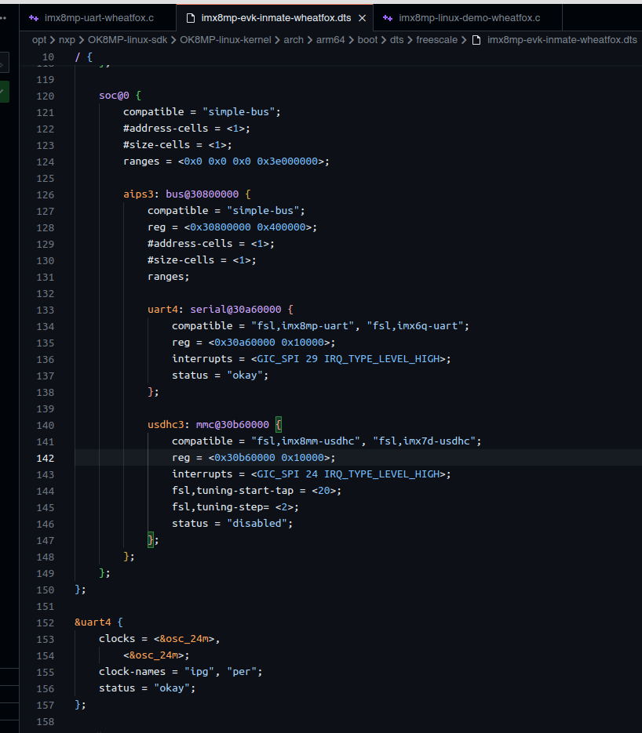

然后在linux inmate cell中打开UART2和UART4的irq_chip：

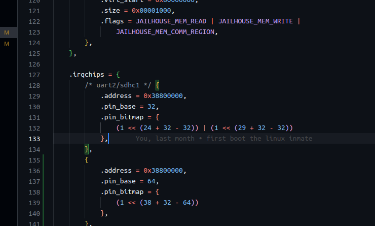

依然还是同样的报错Kernel panic - not syncing: Asynchronous SError Interrupt。

根据我在uart-inmate中的实验，推测UART4这块MMIO区域并不能读写，即使linux拿到了设备树中UART4的信息并注册了console，在真正去读写这块区域的时候就会发生内存错误。

## jailhouse inmate程序开发

写一个测试板子上uart4串口的裸机程序（.bin），并使用jailhouse启动。

在源码里的inmates目录仿照已有的结构创建一个新的`uart-wheatfox.c`文件。

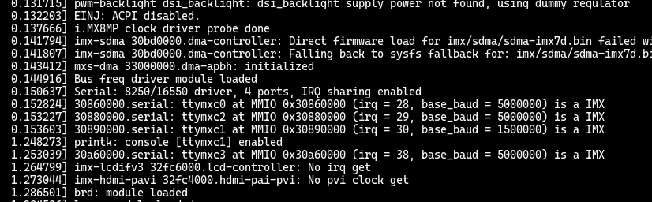

发现一个有趣的事情，root linux启动时给串口分配的irq和手册里写的不一样……
```
NXP manual page 988
irq 24 : USDHC3
irq 26 : UART1
irq 27 : UART2
irq 28 : UART3
irq 29 : UART4
```

也就是说irq=38才是uart4实际的中断号

编写了一个最小baremetal os后，向ttymxc3的MMIO地址进行读写，但是程序立马崩溃了（读写ttymxc1的MMIO反而不会有问题，可以正常打印uart）。

之后我写了一个memtest，用来测试分配给这个jailhouse inmate的可读写内存区域能不能正常使用，结果出现了同样的问题。

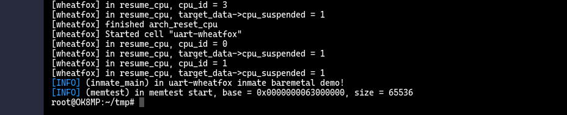

可以看到memtest并没有成功，甚至在读这块内存时就直接没有后文了。

ARM64 异常定义：http://www.wowotech.net/armv8a_arch/238.html

向ttymxc1对应的UART2打印完全没有问题：

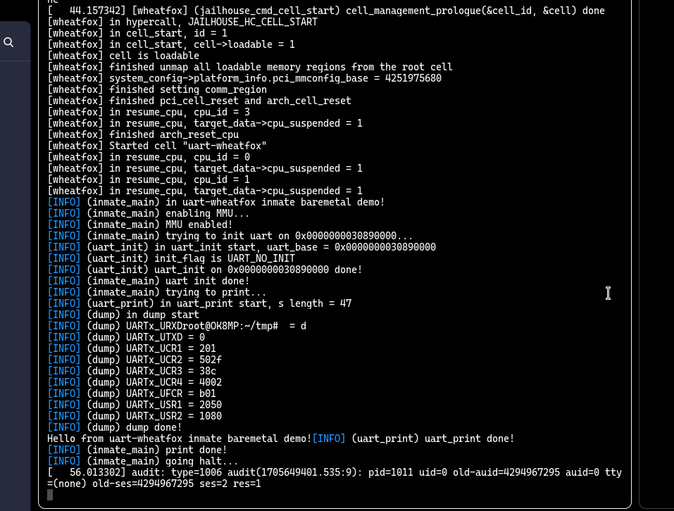

并且可以看到通过读写串口寄存器也确实把数据打印到了当前串口（这里通过ttyACM0连接了板子的UART2）。而当我去读写UART4的MMIO区域时，程序直接没有输出了：

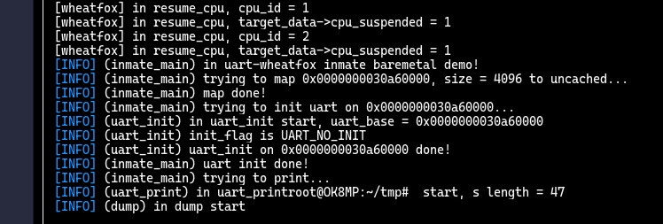

这里已经通过jailhouse提供的map_page接口添加了UART4对应的页表，但是仍然不行，推测是触发了exception，但目前jailhouse的inmate编程框架只适配了irq handle，对于其他的exception都没有处理，如果要加其他exception处理的话不太好加，需要手动修改汇编和链接文件等。

# 附录

## imx8mp的4x10pin串口连接电脑

打电话问forlinx技术，一种办法是焊接飞线连出来到TTL转USB的杜邦线上，另一种就是用专门的2x5 2mm间距的线，这个10pin的座叫做“牛角座”。

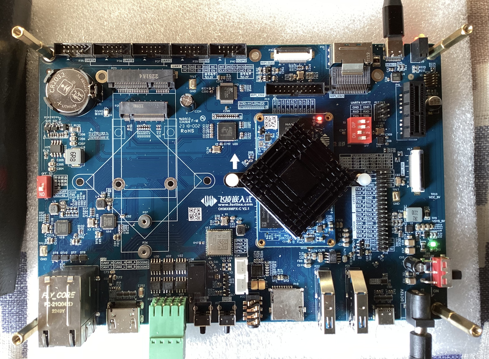

左上角有四个UART口，采用2x5 2mm间距，为牛角座，引脚如下：

```
+------+------+------+------+------+
|  NC  |  GND |  5V  |  RXD |  NC  |
+------+------+------+------+------+
|  NC  |  TXD |  5V  |  GND |  NC  |
+------+------+------+------+------+
```

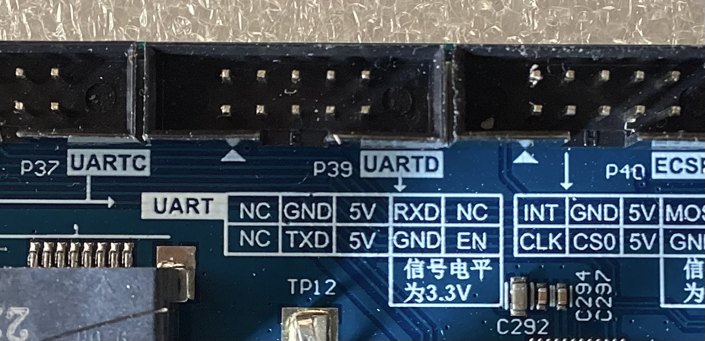

对于一般的TTL转USB，需要使用三个pin，即TXD, RXD和GND，上面的10pin中需要连接3pin。

需要注意的是，这里的pin间距只有2mm，而普通杜邦线间距是2.54mm，并且TTL转USB一般都是杜邦线母头，如下图：

白色代表RXD（接板子TXD），绿色为TXD（接板子RXD），黑色接地。

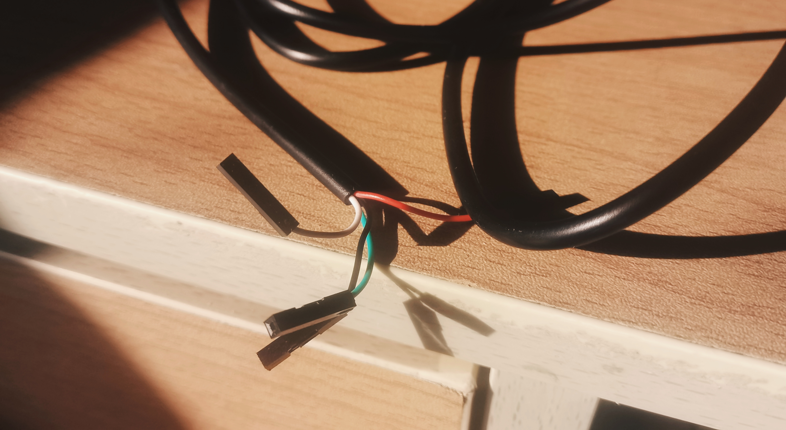

整个流程就是：

```
牛角座10pin(2mm)【公头】 -> 【母头】2mm转2.54mm杜邦线【母头】 <- 【公头】杜邦线【公头】 -> 【公头】TTL转USB【USB】
```

UPDATE：学长说DEBUG口可以复用两个串口，需要在板子设备树里打开第四个串口，就可以使用了。

```
[    0.152731] 30860000.serial: ttymxc0 at MMIO 0x30860000 (irq = 28, base_baud = 5000000) is a IMX
[    0.153139] 30880000.serial: ttymxc2 at MMIO 0x30880000 (irq = 29, base_baud = 5000000) is a IMX
[    0.153475] 30890000.serial: ttymxc1 at MMIO 0x30890000 (irq = 30, base_baud = 1500000) is a IMX
[    1.248171] printk: console [ttymxc1] enabled
[    1.252944] 30a60000.serial: ttymxc3 at MMIO 0x30a60000 (irq = 38, base_baud = 5000000) is a IMX
```

