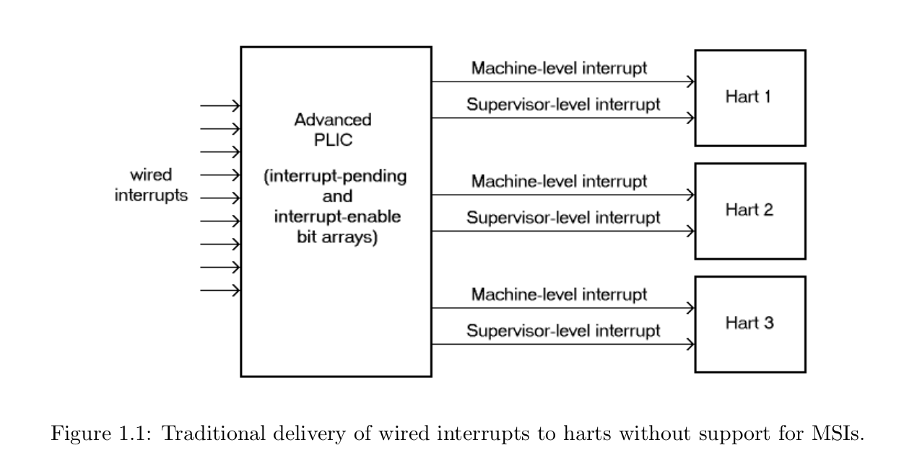
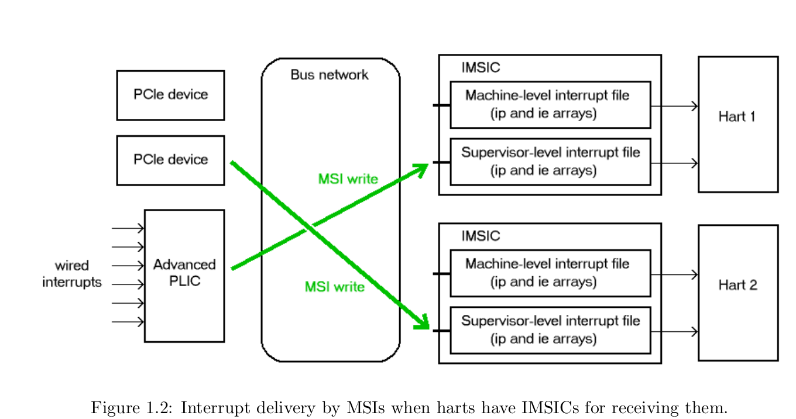
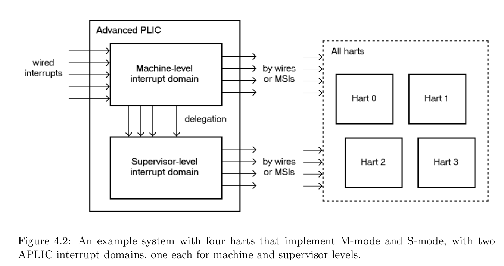
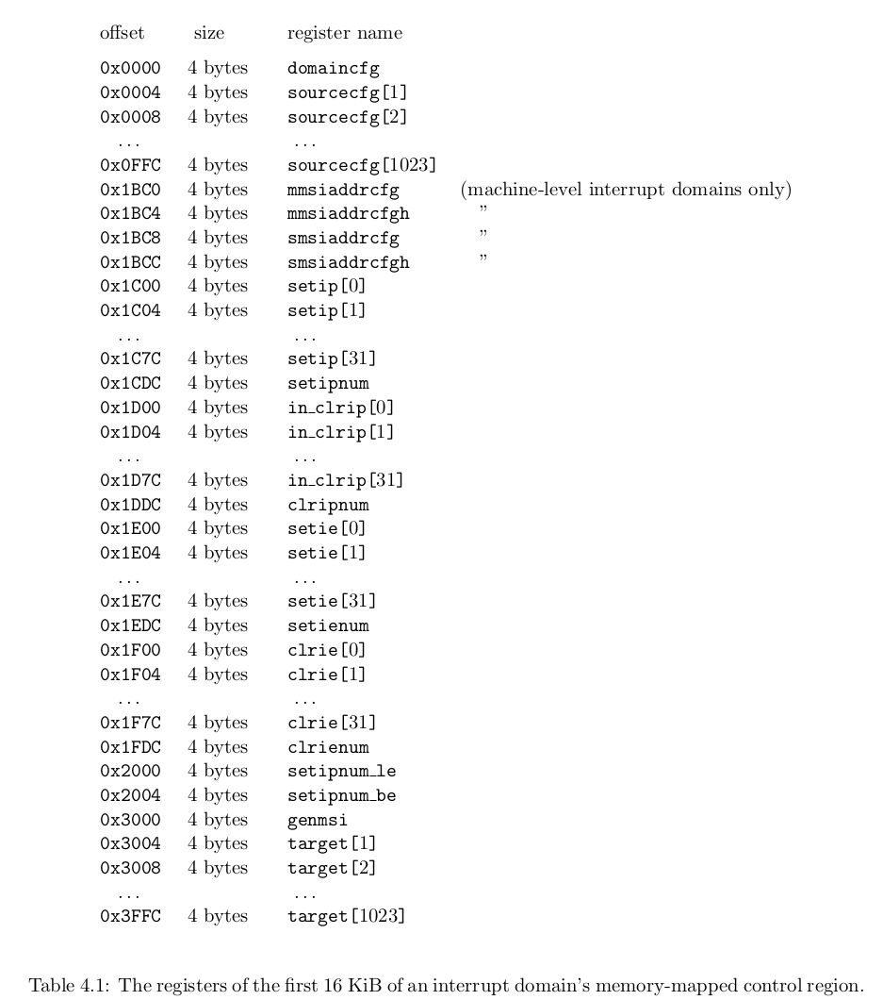
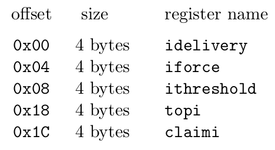
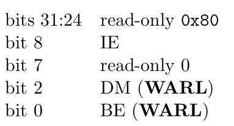
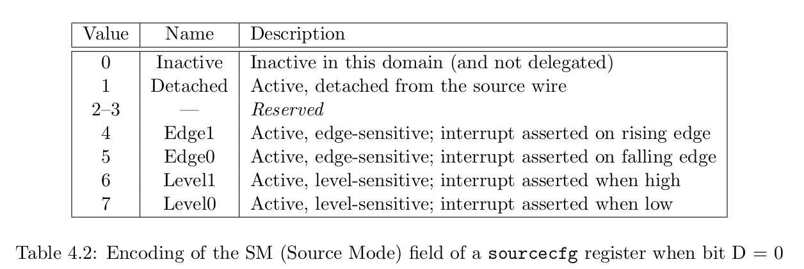
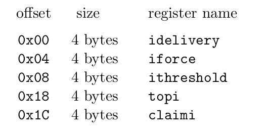

## 一、APLIC

> 官方文档仓库：https://github.com/riscv/riscv-aia

### 1、介绍

在 RISC-V 系统中，平台级中断控制器（PLIC）负责处理通过导线而非 MSI 发出信号的外部中断。

高级 PLIC（APLIC），它与早期的 RISC-V PLIC 不兼容。

在没有 IMSIC （Incoming MSI Controller）的机器中，每个 RISC-V hart 都接受来自 PLIC 或 APLIC 的中断，该 PLIC 或 APLIC 是 hart 的外部中断控制器，参考下图：



采用 IMSIC 作为外部中断控制器的 RISC-V Harts 只能以 MSI 的形式接收外部中断，参考下图：




单个 APLIC 支持固定数量的中断源，与 APLIC 的物理输入中断线完全对应。通常情况下，每个中断源的输入线都与单个设备或设备控制器的输出中断线相连。

APLIC 的每个中断源都有一个固定的唯一标识号，范围从 1 到 N，其中 N 是 APLIC 的中断源总数。在 APLIC 中，0 不是有效的中断标识号。APLIC 最多可支持 1023 个中断源。

APLIC 支持一个或多个中断域，每个中断域与一个特权级（Machine 或 Supervisor）的 RISC-V Harts 子集相关联。每个域在机器地址空间中都有自己的内存映射控制区。

下图显示的是对称多处理（SMP）系统的中断域视图，该系统有多个实现了 Supervisor 模式的 hart。在这种情况下，APLIC 通常会为 Supervisor 模式提供一个单独的中断域。这种 Supervisor 中断域允许在多处理器上以 Supervisor 模式运行的操作系统直接接收中断。



Qemu 模拟的典型的系统即是 SMP 系统，即符合上述的中断域视图，下面是 Qemu 关于 virt 机型的 APLIC 地址描述，可以看到其包含了 M-level 中断域，以及 S-level 中断域。

```c
// Qemu 中关于两个中断域的物理地址描述
static const MemMapEntry virt_memmap[] = {
	...
    [VIRT_APLIC_M] =      {  0xc000000, APLIC_SIZE(VIRT_CPUS_MAX) },
    [VIRT_APLIC_S] =      {  0xd000000, APLIC_SIZE(VIRT_CPUS_MAX) },
	...
};
```

APLIC 的中断域层次结构符合以下规则：

- 根中断域必须是 M-level 中断域
- 任何 S-level 中断域的父域都是一个 M-level 中断域，至少包括相同的 harts，父域在 M-level 可能有更大的 Harts 集
- 对于每个中断域，来自该中断域的中断信号都是通过线或 MSI 以相同的方式发送给各中断单元的，即同一中断域中的中断方式都一致，要么都为线中断，要么都为 MSI 中断

所有中断域的控制接口都具有相同的结构，每个中断域都有自己独立的物理控制接口，比如上述 Qemu 描述的 M-level 中断域和 S-level 中断域。

大多数情况下，每个域对软件而言都表现为一个根域，不可见其上层中断域。

### 2、单个中断域的内存布局

每个中断域都有一个专用的内存映射控制区，用于管理该域中的中断，最小的有效控制区域为 16 KiB。

从偏移量 0x4000 开始，中断域的控制区域可选择包含一个中断发送控制（IDC）结构数组，从 0 到某个最大值（至少与中断域的最大 hart 索引号一样大）范围内的每个潜在 hart 索引号都有一个 IDC 结构。IDC 结构仅在中断域配置为直接向 hart 发送中断而非由 MSI 转发时使用。仅支持由 MSI 转发中断而不支持由 APLIC 直接发送中断的中断域不需要在其控制区域中使用 IDC 结构。

控制区的内存映射如下：



一个 IDC 结构的内存映射如下：



### 3、直接传递中断方式(非MSI)重要配置

#### 3.1、domaincfg



位 IE（中断使能）是该中断域中所有活动中断源的全局使能。只有当 IE = 1 时，pending-and-enabled 的中断才会实际发出信号或转发给 hart。

位 DM（发送模式）决定了该中断域向 Harts 发送中断的方式。DM 的两个可能值是：0 为直接传递中断模式，1 为 MSI 发送模式。

位 BE（大端）确定中断域内存映射控制区域中大多数寄存器的字节顺序。如果 BE = 0，则字节顺序为小端，如果 BE =  1，则为大端。

在系统复位时，domaincfg 中的所有可写位都被初始化为零，包括 IE。

#### 3.2、sourcecfg

对于每个中断源 i，寄存器 sourcecfg[i] 控制该中断域中源 i 的源模式以及该中断源到子中断域的委托。

sourcecfg 的 bit 10 是一个 1 位的字段，称为 D（委托）。 如果 D = 1，则中断源 i 被委托给子中断域，如果 D = 0，则不被委托给子中断域。

当中断源 i 被委托给子中断域时，sourcecfg[i] 具有以下格式，Child Index 指定该源被委托到的中断域：

```
	bit 10	    D = 1
	bits 9:0	Child Index（WLRL）
```

当中断源 i 未委托给子中断域时，sourcecfg[i] 具有以下格式：

```
	bit 10	    D = 0
	bits 2:0	SM (WARL)
```

其中 SM（源模式）控制中断源在此域中是否处于活动状态，可取值如下：



如果中断源被委派给子域 (D = 1) 或未委派 (D = 0) 并且 SM 处于非活动状态，则中断源在中断域中处于非活动状态。

#### 3.3、target

如果中断源 i 在此域中不活动，则寄存器 target[i] 为只读零。如果中断源 i 处于活动状态，则 target[i] 确定将来自中断源 i 的中断发信号通知或转发到哪个 hart。

对于活动中断源 i，如果域配置为直接传递模式 (domaincfg.DM = 0)，则寄存器 target[i] 具有以下格式：

```
	bits 31:18		Hart Index (WLRL)
	bits 7:0	    IPRIO (WARL)
```

Hart Index 指定来自中断源 i 的中断将传送到的 Hart 索引。

IPRIO 字段指定中断源的优先级编号。

较小的优先级数字表示较高的优先级。 当中断源具有相同的优先级编号时，具有最低标识号的源具有最高优先级。

#### 3.4、setip、setie、setipnum、in_clrip、clrie、clripnum

用于读写（设置、清除）中断源的 pending 以及 enable 状态。

每一位对应一个中断源。

num 表示 by number，即根据中断源编号进行读写。

#### 3.5、IDC



idelivery 用于控制是否将针对相应 hart 的中断传递到 hart，以便它们在 hart 的 mip CSR 中显示为待处理中断。

```
	0 = interrupt delivery is disabled
	1 = interrupt delivery is enabled
```

iforce 是一个可用于测试的寄存器，只要 domaincfg 的 IE 字段为1并且 idelivery 寄存器启用到 hart 的中断传送，设置 iforce = 1 就会强制向相应的 hart 发出中断。

ithreshold 用于确定要向相应 hart 发出信号的中断的最小中断优先级（最大优先级编号）。当 ithreshold 为非 0 值 P 时，优先级编号为 P 及更高的中断源不会向 hart 发送中断信号。但是当 ithreshold 为 0 时，所有启用的中断源都可以向 hart 发出中断信号。

topi 是一个只读寄存器，其值指示当前 hart 的 pending-and-enabled 的中断的最高优先级。topi 的值超过由 ithreshold 指定的优先级阈值（如果不为零）。

claimi 与 topi 具有相同的值。

仅通过APLIC进行外部中断的 trap 处理程序大致如下：

```
	save processor registers
	i = read register claimi from the hart’s IDC structure at the APLIC
	i = i>>16
	call the interrupt handler for external interrupt i (minor identity)
	restore processor registers
	return from trap
```

