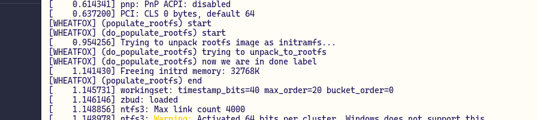
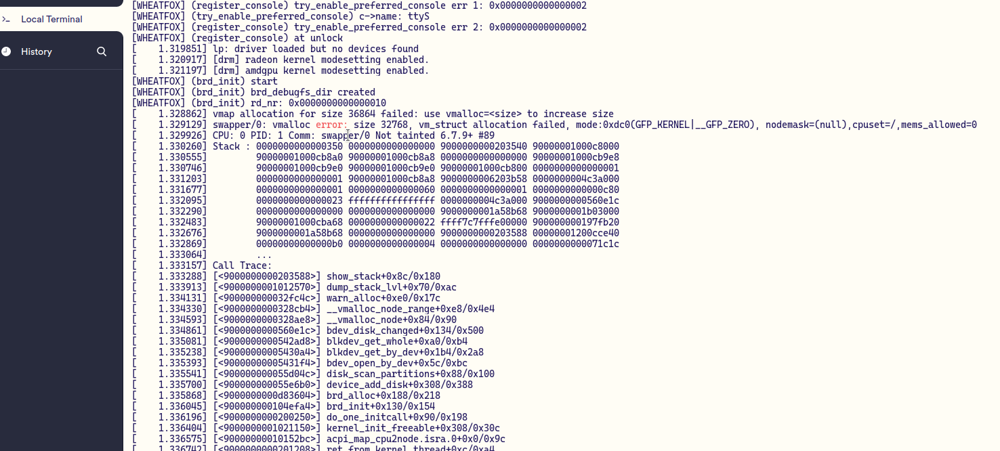
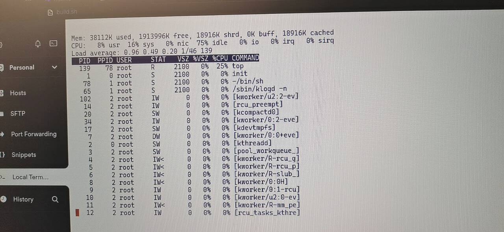
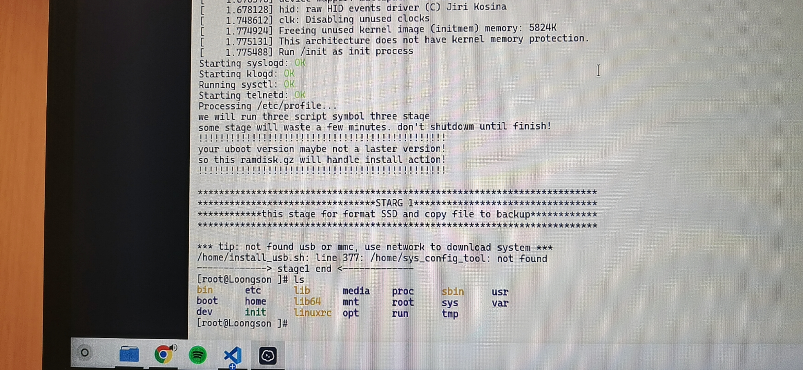

# 在hvisor(loongarch)里启动linux vm

wheatfox 2024.3.12

目前选定的linux版本是6.7.9(stable 2024.3.12)
由于可能需要修改linux源码进行调试（加一些新的printk，用于测试在zone中被启动时的流程），我自己fork的linux源码位于：https://github.com/enkerewpo/linux-loongarch64

其中的loongson3_defconfig为我已经修改后的版本，并且对原始config进行了备份。

新的config我主要做了以下修改：

1. 移除网络、USB驱动、CD-ROM驱动，以及其他暂时不用的功能，如kvm虚拟化（作为虚拟机运行的镜像没必要再开一次层虚拟化，而且本来也用不了）
2. 添加内核驱动调试输出、修改printk输出格式显示调用者信息
3. 对irq等功能打开调试输出

## boot

```c
# linux boot procedure
kernel_entry
start_kernel
```

## printk

```c
pr_info/pr_error...->_printk->vprintk->vprintk_default->vprint_emit

asmlinkage int vprintk_emit(int facility, int level,
			    const struct dev_printk_info *dev_info,
			    const char *fmt, va_list args)
{
	int printed_len;
	bool in_sched = false;

	/* Suppress unimportant messages after panic happens */
	if (unlikely(suppress_printk))
		return 0;

	if (unlikely(suppress_panic_printk) &&
	    atomic_read(&panic_cpu) != raw_smp_processor_id())
		return 0;

	if (level == LOGLEVEL_SCHED) {
		level = LOGLEVEL_DEFAULT;
		in_sched = true;
	}

	printk_delay(level);

	printed_len = vprintk_store(facility, level, dev_info, fmt, args);

	/* If called from the scheduler, we can not call up(). */
	if (!in_sched) {
		/*
		 * The caller may be holding system-critical or
		 * timing-sensitive locks. Disable preemption during
		 * printing of all remaining records to all consoles so that
		 * this context can return as soon as possible. Hopefully
		 * another printk() caller will take over the printing.
		 */
		preempt_disable();
		/*
		 * Try to acquire and then immediately release the console
		 * semaphore. The release will print out buffers. With the
		 * spinning variant, this context tries to take over the
		 * printing from another printing context.
		 */
		if (console_trylock_spinning())
			console_unlock();
		preempt_enable();
	}

	if (in_sched)
		defer_console_output();
	else
		wake_up_klogd();

	return printed_len;
}

-> vprintk_store
```

`vprintk_store`中一个比较有意思的点时它只是把需要输出的信息放在了printk ring buffer里，并不会直接通过earlycon或console进行输出，调用的是`printk_sprint`向ring buffer中保存数据。

由于qemu加载ELF看起来并不支持ACPI，不过看arch/loongarch里的platform init源码是默认要读一下FDT设备树的，可以先从这里开始调，如果没有设备树，linux连可用内存的范围都拿不到，之后肯定不能运行，包括从自己的allocator申请内存。

`early_init_fdt_scan_reserved_mem [drivers/of/fdt.c]`

`unflatten_and_copy_device_tree`

```c
/**
 * unflatten_and_copy_device_tree - copy and create tree of device_nodes from flat blob
 *
 * Copies and unflattens the device-tree passed by the firmware, creating the
 * tree of struct device_node. It also fills the "name" and "type"
 * pointers of the nodes so the normal device-tree walking functions
 * can be used. This should only be used when the FDT memory has not been
 * reserved such is the case when the FDT is built-in to the kernel init
 * section. If the FDT memory is reserved already then unflatten_device_tree
 * should be used instead.
 */
```

https://elinux.org/Device_Tree_What_It_Is

https://docs.kernel.org/admin-guide/kernel-parameters.html boot params，好像可以从这里传memory信息？

试着把dtb用incbin的方式塞到了vmlinux里，并且能够在fdt.c驱动中拿到这个设备树dtb。

但是之后调用`memblock_alloc`失败了，这里是希望申请一块给dtb的内存，然后把刚才的那个地址的传入的dtb复制到新地址（但是并没有必要啊？），这个时候linux还没拿到fdt中内存的信息，肯定没法分配的，也许和之前编译选项打开了earlyfdt有关。

在early fdt的时候也传入了3A5000的dtb之后，确实可以进行内存分配了，linux得到了node0的内存节点就是来自fdt中的memory信息。

但是printk始终没有成功输出（目前都是手动在printk_sprint时通过一个单独加的串口驱动print_char输出的，也就是说linux内核的earlycon和console都没有跑起来，对应的驱动也没有在工作）。

需要好好捋一遍`console_init`以及serial驱动的查找、与fdt中compatible字段的对应，以及最终拿到对应的驱动代码并启动。

https://www.cnblogs.com/schips/p/linux_kernel_initcall_and_module_init.html

```c
start_kernel  
	-> rest_init();
		-> kernel_thread(kernel_init, NULL, CLONE_FS);
			-> kernel_init()
				-> kernel_init_freeable();
					-> do_basic_setup();
						-> do_initcalls();  
```

`trace_initcall_start`

http://www.pedestrian.com.cn/kernel/kernel_start/kernel_start_overview.html

console_init函数执行控制台的初始化工作，在`console_init`函数执行之前的`printk`打印信息，需要在`console_init`函数执行之后才能打印出来，在此之前`printk`的打印信息都被保存在一个缓存中（printk ring buffer）。

如果这里的earlycon初始化的有问题，那无论是earlycon还是正式的console就跑不起来。

目前我编译的vmlinux中有三个con init entry:

```c
con_init					// drivers/tty/vt/vt.c
hvc_console_init			// drivers/tty/hvc/hvc_console.c
univ8250_console_init		// drivers/tty/serial/8250/8250_core.c
```

而且是按顺序依次调用！

2024.3.18 earlycon跑起来了，但是只有bootconsole成功启动了，real console启动失败，这会导致之后open /dev/console时出现“无设备”报错。


但是出现的问题有：vmalloc失败，tty ldisc（即line discipline终端控制）也跑不起来。先看一下vmalloc为啥分配不了。

## initramfs

https://docs.kernel.org/admin-guide/initrd.html



目前解压和加载我自己做的rootfs.cpio.gz到设备树中声明好的initrd内存区域目前看起来没啥问题，但是到block dev驱动初始化的时候去拿这个ramdisk的时候就会出现第一次vmalloc错误：



这个函数调用也是相当的长：

```c
brd_init
brd_alloc
device_add_disk
disk_scan_partitions
// 可以看到这里要去拿/dev的信息，这里和rootfs中提前准备好的dev node以及cmdline中的root=/dev/xxx都可能有关
bdev_open_by_dev
blkdev_get_by_dev
blkdev_get_whole
bdev_disk_changed
// 然后出现了vmalloc申请内存失败，不过这个失败并不会导致驱动加载失败
-> vmalloc failed!
```

加一些debug输出调一调。

https://www.kernel.org/doc/Documentation/blockdev/ramdisk.txt

### unpack_to_rootfs

https://blog.csdn.net/u012489236/article/details/103084290 讲的很详细，涉及到ramdisk和cmdline的交互

https://wiki.gentoo.org/wiki/Initramfs/Guide/en

https://wiki.gentoo.org/wiki/Tmpfs/en

## fdt

https://elinux.org/Device_Tree_Usage

/chosen https://www.kernel.org/doc/Documentation/devicetree/bindings/chosen.txt

## unable to open initial console

看一下内核里调用open系统调用的流程，看一下为什么/dev/console用不了

open(2)的flags:

```c
/*
 * FMODE_EXEC is 0x20
 * FMODE_NONOTIFY is 0x4000000
 * These cannot be used by userspace O_* until internal and external open
 * flags are split.
 * -Eric Paris
 */

/*
 * When introducing new O_* bits, please check its uniqueness in fcntl_init().
 */

#define O_ACCMODE	00000003
#define O_RDONLY	00000000
#define O_WRONLY	00000001
#define O_RDWR		00000002
#define O_CREAT		00000100	/* not fcntl */
#define O_EXCL		00000200	/* not fcntl */
#define O_NOCTTY	00000400	/* not fcntl */
#define O_TRUNC		00001000	/* not fcntl */
#define O_APPEND	00002000
#define O_NONBLOCK	00004000
#define O_DSYNC		00010000	/* used to be O_SYNC, see below */
#define FASYNC		00020000	/* fcntl, for BSD compatibility */
#define O_DIRECT	00040000	/* direct disk access hint */
#define O_LARGEFILE	00100000
#define O_DIRECTORY	00200000	/* must be a directory */
#define O_NOFOLLOW	00400000	/* don't follow links */
#define O_NOATIME	01000000
#define O_CLOEXEC	02000000	/* set close_on_exec */

#define __O_SYNC	04000000
#define O_PATH		010000000
#define __O_TMPFILE	020000000

// see include/uapi/asm-generic/fcntl.h for details :)
```

一些ERROR NUMBER的值：

```c
#define	EPERM		 1	/* Operation not permitted */
#define	ENOENT		 2	/* No such file or directory */
#define	ESRCH		 3	/* No such process */
#define	EINTR		 4	/* Interrupted system call */
#define	EIO		 5	/* I/O error */
#define	ENXIO		 6	/* No such device or address */
#define	E2BIG		 7	/* Argument list too long */
#define	ENOEXEC		 8	/* Exec format error */
#define	EBADF		 9	/* Bad file number */
#define	ECHILD		10	/* No child processes */
#define	EAGAIN		11	/* Try again */
#define	ENOMEM		12	/* Out of memory */
#define	EACCES		13	/* Permission denied */
#define	EFAULT		14	/* Bad address */
#define	ENOTBLK		15	/* Block device required */
#define	EBUSY		16	/* Device or resource busy */
#define	EEXIST		17	/* File exists */
#define	EXDEV		18	/* Cross-device link */
#define	ENODEV		19	/* No such device */
#define	ENOTDIR		20	/* Not a directory */
#define	EISDIR		21	/* Is a directory */
#define	EINVAL		22	/* Invalid argument */
#define	ENFILE		23	/* File table overflow */
#define	EMFILE		24	/* Too many open files */
#define	ENOTTY		25	/* Not a typewriter */
#define	ETXTBSY		26	/* Text file busy */
#define	EFBIG		27	/* File too large */
#define	ENOSPC		28	/* No space left on device */
#define	ESPIPE		29	/* Illegal seek */
#define	EROFS		30	/* Read-only file system */
#define	EMLINK		31	/* Too many links */
#define	EPIPE		32	/* Broken pipe */
#define	EDOM		33	/* Math argument out of domain of func */
#define	ERANGE		34	/* Math result not representable */
```

测试了一下在rootfs里放了文本文件，在kernel里通过filp_open手动打开（RW）没有问题，但是打开console（设备文件，RW）时会返回一个-ENODEV（0x13，即19号错误），由于前者是和tmpfs交互（并且没有问题，包括加载ELF以及打开目录、遍历目录都没有问题），而后者实际上是要和驱动层进行交互，有一个问题就是/dev/console是在制作rootfs时手动加上的，拿这个设备如何和设备树上的serial设备绑定？这个和之前已经启动的earlycon（bootconsole）之前的关系是什么？理论上来说earlycon会在real console注册时卸载。

有一个需要注意的点是，rootfs里的dev设备是通过本机linux的mknode指令制作的（随后打包入cpio）：

```bash
cd $(TMP_ROOTFS_OUTPUT)/dev && sudo mknod -m 666 null c 1 3
cd $(TMP_ROOTFS_OUTPUT)/dev && sudo mknod -m 666 console c 5 1
```

这里的console c 5 1实际上对应着char device以及主设备号、次设备的信息，所以mknode是如何制作device node节点的？这个/dev/console的二进制到底保存了什么样的信息？（能猜出来至少和一些设备相关，例如是不是character device（c）等）

所以需要调一下do_open函数，看一下在open调用时访问/dev/console，到底是如何解析到这是一个设备node节点，并通过读取这个文件的信息拿到实际的设备进行绑定的（对/dev/console的读写在最底下实际上是对串口这个设备的寄存器的读写，写console意味者向UART打印、而读console意味者从UART读输入，不知道读输入这部分是不是会和3A5000的中断控制器有关？还是朴素的阻塞读串口的RXD FIFO？）【2024.3.24】

https://www.kernel.org/doc/Documentation/admin-guide/serial-console.rst 涉及到cmdline中的console是怎么和代码进行对应的

最后调试发现of在解析设备树的时候，对于serial驱动中的int controller parent解析有问题，在dts中去掉之后，成功进入了busybox环境，能够交互使用，启动程序：





目前在qemu中不使用固件参数启动vmlinux elf基本完成，接下来就是在3A5000板子上引导启动这个ELF。
