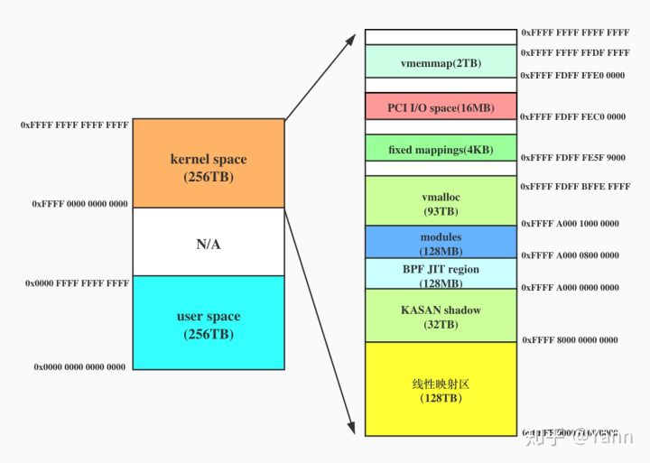
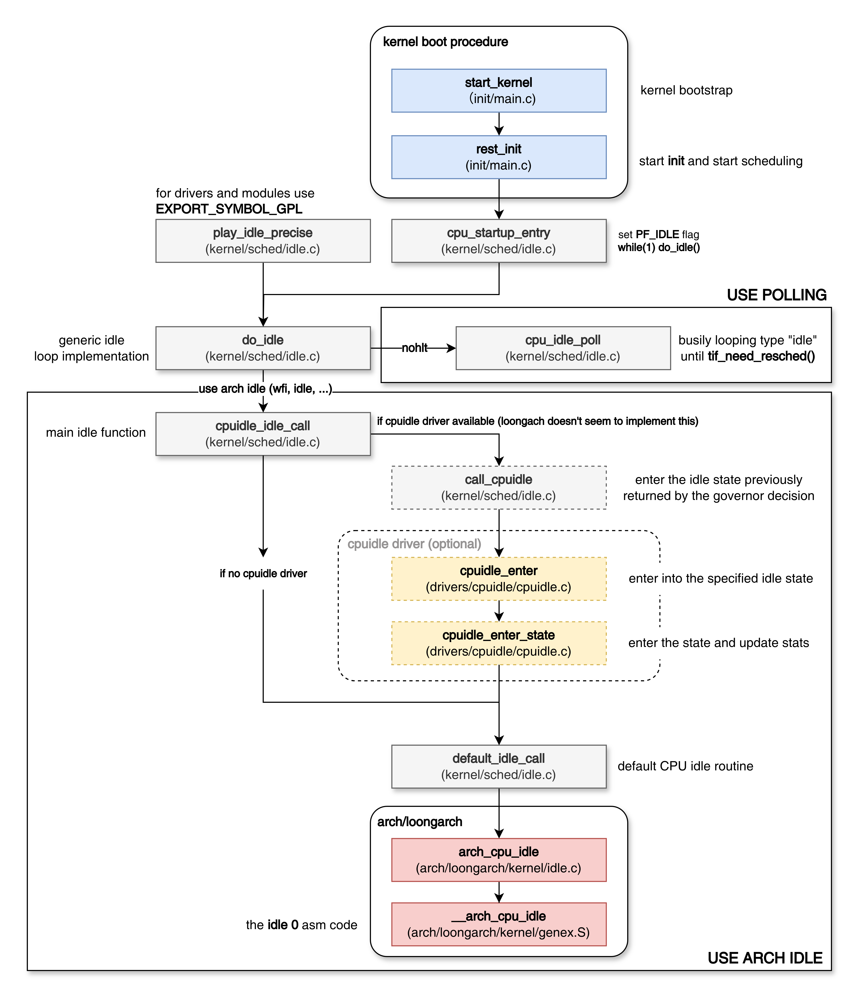
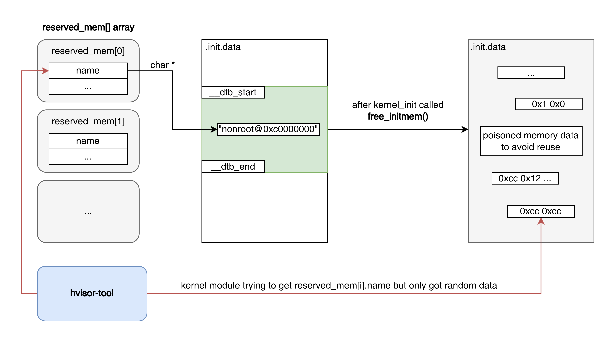
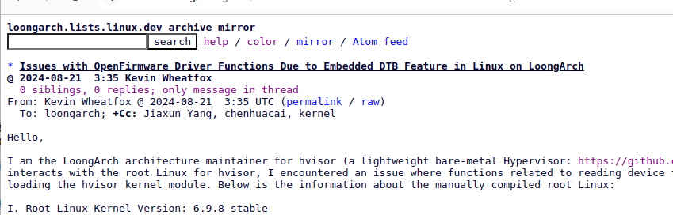
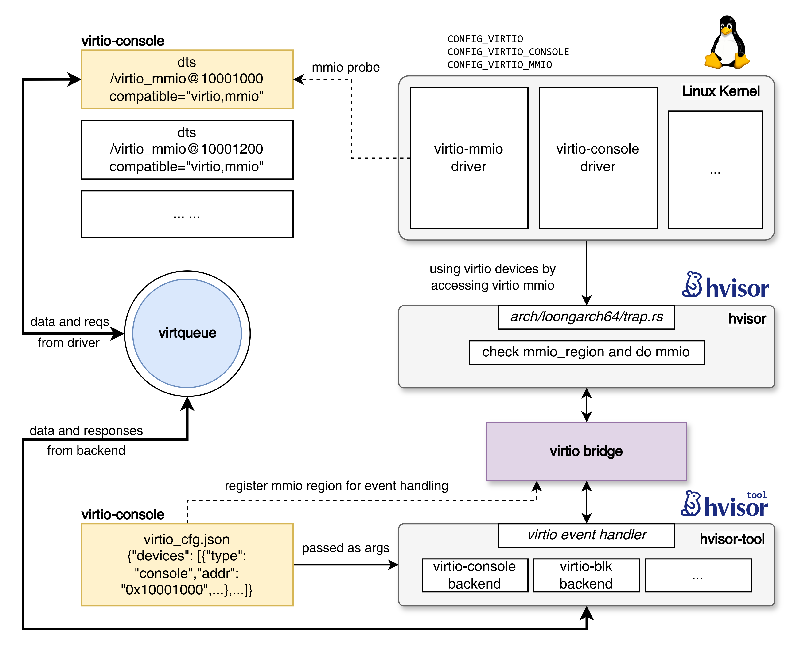

# 移植hvisor到LoongArch64架构

wheatfox

## 2024.7.15记录

https://www.kernelconfig.io/config_builtin_dtb

今天在研究如何给hvisor启动的zone0 linux传递dtb时，发现目前**6.9.8的linux**不仅可以内嵌initramfs作为rootfs，还可以通过配置CONFIG_BUILTIN_DTB编译配置选择内嵌的dtb（之前的内核版本里loongarch部分没有这个功能，看changelog应该是最近几个版本新加的，同时在linux仓库中arch/loongarch/boot内多了几个2K1000/2K500的dts文件，正好可以用于内嵌DTB），我将我自己写的3A5000的dts也放了进去。

arch/loongarch/kernel/setup.c：

```clike
static void __init fdt_setup(void)
{
#ifdef CONFIG_OF_EARLY_FLATTREE
	void *fdt_pointer;

	/* ACPI-based systems do not require parsing fdt */
	if (acpi_os_get_root_pointer())
		return;

	/* Prefer to use built-in dtb, checking its legality first. */
	if (IS_ENABLED(CONFIG_BUILTIN_DTB) && !fdt_check_header(__dtb_start))
		fdt_pointer = __dtb_start;
	else
		fdt_pointer = efi_fdt_pointer(); /* Fallback to firmware dtb */

	if (!fdt_pointer || fdt_check_header(fdt_pointer))
		return;

	early_init_dt_scan(fdt_pointer);
	early_init_fdt_reserve_self();

	max_low_pfn = PFN_PHYS(memblock_end_of_DRAM());
#endif
}
```

可以看到，如果配置了CONFIG_BUILTIN_DTB则fdt_pointer则直接指向编译时内嵌在vmlinux里的dtb文件（在内存中的地址），这样就可以不需要外部BIOS或UEFI传递FDT信息（*loongarch新世界的规范是无路如何绕不开UEFI的，即使使用FDT，也依然需要通过UEFI变量表获取FDT地址，非常麻烦*）。

具体的内嵌dtb流程为：

1. 在arch/loongarch/boot/dts中放好需要的dts文件（可以放dtsi并include），如x.dts
2. 修养这个目录下的Makefile，添加x.**dtb**的目标
3. 在menuconfig里打开CONFIG_BUILTIN_DTB（Kernel type and options），填入dts的名字（不带任何后缀！）
4. 之后编译内核时就可以自动编译dtb并内嵌入内核了

**SMP BOOT**

第一个问题是percpu初始化时，唯独只有zone成员初始化为None会导致程序的atomic_sub出现错误参数。原因？

目前能够启动cpu1-3了，但是PRINT_LOCK莫名其妙失效了，而且cpu0在读取BOOT CPU COUNT的时候也永远没有等到，这两个涉及到spin的原子操作均失效了。原因？

推测是CPU1和CPU0看到的内存视图不一致，同一个lock在CPU0修改之后，CPU1仍然拿不到新值，原因？

## 2024.7.16记录

SMP的锁问题已解决，问题在entry.rs中，每个CPU进入时都把bss清理了一遍，自然会让之前别的CPU上的锁失效，注释掉后没有任何问题，输出锁等均正常了（**bss的清理调整为UEFI Packer负责，提前将相关内存memset**）

## 2024.7.17记录

尝试启动zone0 root linux，能够启动，cpucfg模拟啥的没有问题，目前还是存在idle问题，在启动real console后虚拟机运行idle指令等待中断。

看一下KVM怎么实现的：

```clike
case 0x6: /* Cache, Idle and IOCSR GSPR */
		switch (((inst.word >> 22) & 0x3ff)) {
		case 0x18: /* Cache GSPR */
			er = EMULATE_DONE;
			trace_kvm_exit_cache(vcpu, KVM_TRACE_EXIT_CACHE);
			break;
		case 0x19: /* Idle/IOCSR GSPR */
			switch (((inst.word >> 15) & 0x1ffff)) {
			case 0xc90: /* IOCSR GSPR */
				er = kvm_emu_iocsr(inst, run, vcpu);
				break;
			case 0xc91: /* Idle GSPR */
				er = kvm_emu_idle(vcpu);
				break;
			default:
				er = EMULATE_FAIL;
				break;
			}
			break;
		default:
			er = EMULATE_FAIL;
			break;
		}
		break;
```

看一下kvm_emu_idle

```clike
kvm_vcpu_check_block/*
 * Emulate a vCPU halt condition, e.g. HLT on x86, WFI on arm, etc...  If halt
 * polling is enabled, busy wait for a short time before blocking to avoid the
 * expensive block+unblock sequence if a wake event arrives soon after the vCPU
 * is halted.
 */
void kvm_vcpu_halt(struct kvm_vcpu *vcpu)
{
	unsigned int max_halt_poll_ns = kvm_vcpu_max_halt_poll_ns(vcpu);
	bool halt_poll_allowed = !kvm_arch_no_poll(vcpu);
	ktime_t start, cur, poll_end;
	bool waited = false;
	bool do_halt_poll;
	u64 halt_ns;

	if (vcpu->halt_poll_ns > max_halt_poll_ns)
		vcpu->halt_poll_ns = max_halt_poll_ns;

	do_halt_poll = halt_poll_allowed && vcpu->halt_poll_ns;

	start = cur = poll_end = ktime_get();
	if (do_halt_poll) {
		ktime_t stop = ktime_add_ns(start, vcpu->halt_poll_ns);

		do {
			if (kvm_vcpu_check_block(vcpu) < 0)
				goto out;
			cpu_relax();
			poll_end = cur = ktime_get();
		} while (kvm_vcpu_can_poll(cur, stop));
	}

	waited = kvm_vcpu_block(vcpu);

	cur = ktime_get();
	if (waited) {
		vcpu->stat.generic.halt_wait_ns +=
			ktime_to_ns(cur) - ktime_to_ns(poll_end);
		KVM_STATS_LOG_HIST_UPDATE(vcpu->stat.generic.halt_wait_hist,
				ktime_to_ns(cur) - ktime_to_ns(poll_end));
	}
out:
	/* The total time the vCPU was "halted", including polling time. */
	halt_ns = ktime_to_ns(cur) - ktime_to_ns(start);

	/*
	 * Note, halt-polling is considered successful so long as the vCPU was
	 * never actually scheduled out, i.e. even if the wake event arrived
	 * after of the halt-polling loop itself, but before the full wait.
	 */
	if (do_halt_poll)
		update_halt_poll_stats(vcpu, start, poll_end, !waited);

	if (halt_poll_allowed) {
		/* Recompute the max halt poll time in case it changed. */
		max_halt_poll_ns = kvm_vcpu_max_halt_poll_ns(vcpu);

		if (!vcpu_valid_wakeup(vcpu)) {
			shrink_halt_poll_ns(vcpu);
		} else if (max_halt_poll_ns) {
			if (halt_ns <= vcpu->halt_poll_ns)
				;
			/* we had a long block, shrink polling */
			else if (vcpu->halt_poll_ns &&
				 halt_ns > max_halt_poll_ns)
				shrink_halt_poll_ns(vcpu);
			/* we had a short halt and our poll time is too small */
			else if (vcpu->halt_poll_ns < max_halt_poll_ns &&
				 halt_ns < max_halt_poll_ns)
				grow_halt_poll_ns(vcpu);
		} else {
			vcpu->halt_poll_ns = 0;
		}
	}

	trace_kvm_vcpu_wakeup(halt_ns, waited, vcpu_valid_wakeup(vcpu));
}
EXPORT_SYMBOL_GPL(kvm_vcpu_halt);int kvm_emu_idle(struct kvm_vcpu *vcpu)
{
	++vcpu->stat.idle_exits;
	trace_kvm_exit_idle(vcpu, KVM_TRACE_EXIT_IDLE);

	if (!kvm_arch_vcpu_runnable(vcpu))
		kvm_vcpu_halt(vcpu);

	return EMULATE_DONE;
}

// kvm_arch_vcpu_runnable
// 为真条件：irq_pending=1且mp_state为RUNNABLE（multiprocessing-state）
virt/kvm/kvm_main.c

kvm_vcpu_block
/*
 * Block the vCPU until the vCPU is runnable, an event arrives, or a signal is
 * pending.  This is mostly used when halting a vCPU, but may also be used
 * directly for other vCPU non-runnable states, e.g. x86's Wait-For-SIPI.
 */
bool kvm_vcpu_block(struct kvm_vcpu *vcpu)
{
	struct rcuwait *wait = kvm_arch_vcpu_get_wait(vcpu);
	bool waited = false;

	vcpu->stat.generic.blocking = 1;

	preempt_disable();
	kvm_arch_vcpu_blocking(vcpu);
	prepare_to_rcuwait(wait);
	preempt_enable();

	for (;;) {
		set_current_state(TASK_INTERRUPTIBLE);

		if (kvm_vcpu_check_block(vcpu) < 0)
			break;

		waited = true;
		schedule();
	}

	preempt_disable();
	finish_rcuwait(wait);
	kvm_arch_vcpu_unblocking(vcpu);
	preempt_enable();

	vcpu->stat.generic.blocking = 0;

	return waited;
}

kvm_vcpu_check_block
static int kvm_vcpu_check_block(struct kvm_vcpu *vcpu)
{
	int ret = -EINTR;
	int idx = srcu_read_lock(&vcpu->kvm->srcu);

	if (kvm_arch_vcpu_runnable(vcpu))
		goto out;
	if (kvm_cpu_has_pending_timer(vcpu))
		goto out;
	if (signal_pending(current))
		goto out;
	if (kvm_check_request(KVM_REQ_UNBLOCK, vcpu))
		goto out;

	ret = 0;
out:
	srcu_read_unlock(&vcpu->kvm->srcu, idx);
	return ret;
}
```

```clike
/*
 * Emulate a vCPU halt condition, e.g. HLT on x86, WFI on arm, etc...  If halt
 * polling is enabled, busy wait for a short time before blocking to avoid the
 * expensive block+unblock sequence if a wake event arrives soon after the vCPU
 * is halted.
 */
 // 如果开启halt polling则等一段时间而不是直接休眠
void kvm_vcpu_halt(struct kvm_vcpu *vcpu)
```

看一下linux源码里是哪里调用的idle，只有两个地方：arch_cpu_idle_dead和__arch_cpu_idle

根据JTAG查看vm exit的指令地址可以确定第一次idle出现在这个地方：

```clike
90000000002212c0 <>:
90000000002212c0:	28c0204c 	ld.d        	$t0, $tp, 8(0x8)
90000000002212c4:	03400000 	andi        	$zero, $zero, 0x0
90000000002212c8:	0340118c 	andi        	$t0, $t0, 0x4
90000000002212cc:	44001580 	bnez        	$t0, 20(0x14)	# 90000000002212e0 <__arch_cpu_idle+0x20>
90000000002212d0:	03400000 	andi        	$zero, $zero, 0x0
90000000002212d4:	03400000 	andi        	$zero, $zero, 0x0
90000000002212d8:	03400000 	andi        	$zero, $zero, 0x0
90000000002212dc:	06488000 	idle        	0x0
90000000002212e0:	4c000020 	jirl        	$zero, $ra, 0
```

```clike
SYM_FUNC_START(__arch_cpu_idle)
	/* start of rollback region */
	LONG_L	t0, tp, TI_FLAGS
	nop
	andi	t0, t0, _TIF_NEED_RESCHED
	bnez	t0, 1f
	nop
	nop
	nop
	idle	0
	/* end of rollback region */
1:	jr	ra
SYM_FUNC_END(__arch_cpu_idle)
```

想了一下既然已经配置了外部中断直通到虚拟机，那idle模拟也可以直接返回原指令运行，然后让虚拟机等外部中断即可，暂时能够解决问题。

**vmalloc问题**

之前遇到过，当时debug后发现linux给vmalloc的区域是个**空集（low>high）**，原因未知，但是vmlinux.efi启动时没有问题，用我自己的设备树+vmlinux就会有问题

这样看起来是设备树写的有bug？

[https://github.com/enkerewpo/linux-loongarch64/commit/cd6e6814ae7635f3ea2ac99882c09ed38f1c93b3](https://github.com/enkerewpo/linux-loongarch64/commit/cd6e6814ae7635f3ea2ac99882c09ed38f1c93b3)

```clike
[    1.441054] i8042: Probing ports directly.
[    1.445143] CPU 0 Unable to handle kernel paging request at virtual address ffff800000008064, era == 9000000002de2274, ra == 9000000002de225c
[    1.457767] Oops[#1]:
[    1.460021] CPU: 0 PID: 1 Comm: swapper/0 Not tainted 6.9.8 #6
[    1.465817] pc 9000000002de2274 ra 9000000002de225c tp 900000000044c000 sp 900000000044fd20
[    1.474115] a0 00000000000000b4 a1 0000000000000000 a2 900000000044c000 a3 90000000031b11e0
[    1.482414] a4 90000000004b7df0 a5 900000000044fba0 a6 0000000000000001 a7 9000000000490080
[    1.490712] t0 ffff800000008000 t1 0000000000000064 t2 0000000000008000 t3 000000005623054a
[    1.499009] t4 0000000000000000 t5 0000000000000000 t6 0000000000000001 t7 0000000000000001
[    1.507307] t8 9000000000490090 u0 000000000000001e s9 0000000000000008 s0 9000000003e29b78
[    1.515606] s1 9000000003e29b78 s2 00000000000000b4 s3 9000000003ccb278 s4 900000000392e8fc
[    1.523904] s5 9000000003d24000 s6 9000000003220560 s7 90000000032408a0 s8 90000000031c00b0
[    1.532202]    ra: 9000000002de225c i8042_flush+0x3c/0x13c
[    1.537660]   ERA: 9000000002de2274 i8042_flush+0x54/0x13c
[    1.543108]  CRMD: 000000b0 (PLV0 -IE -DA +PG DACF=CC DACM=CC -WE)
[    1.549257]  PRMD: 00000000 (PPLV0 -PIE -PWE)
[    1.553584]  EUEN: 00000000 (-FPE -SXE -ASXE -BTE)
[    1.558345]  ECFG: 00071c1c (LIE=2-4,10-12 VS=7)
[    1.562932] ESTAT: 00010000 [PIL] (IS= ECode=1 EsubCode=0)
[    1.568381]  BADV: ffff800000008064
[INFO  0] (hvisor::arch::loongarch64::trap:858) cpucfg emulation, target cpucfg index is 0x0
[    1.583286]  PRID: 0014c011 (Loongson-64bit, Loongson-3A5000-H)
```

arch/loongarch/include/asm/sparsemem.h

```clike
#ifdef CONFIG_SPARSEMEM_VMEMMAP
#define VMEMMAP_SIZE	(sizeof(struct page) * (1UL << (cpu_pabits + 1 - PAGE_SHIFT)))
#endif
```

arch/loongarch/include/asm/pgtable.h

```clikepp
#define VMALLOC_START	MODULES_END

#ifndef CONFIG_KASAN
#define VMALLOC_END	\
	(vm_map_base +	\
	 min(PTRS_PER_PGD * PTRS_PER_PUD * PTRS_PER_PMD * PTRS_PER_PTE * PAGE_SIZE, (1UL << cpu_vabits)) - PMD_SIZE - VMEMMAP_SIZE - KFENCE_AREA_SIZE)
#else
#define VMALLOC_END	\
	(vm_map_base +	\
	 min(PTRS_PER_PGD * PTRS_PER_PUD * PTRS_PER_PMD * PTRS_PER_PTE * PAGE_SIZE, (1UL << cpu_vabits) / 2) - PMD_SIZE - VMEMMAP_SIZE - KFENCE_AREA_SIZE)
#endif

#define vmemmap		((struct page *)((VMALLOC_END + PMD_SIZE) & PMD_MASK))
#define VMEMMAP_END	((unsigned long)vmemmap + VMEMMAP_SIZE - 1)

#define KFENCE_AREA_START	(VMEMMAP_END + 1)
#define KFENCE_AREA_END		(KFENCE_AREA_START + KFENCE_AREA_SIZE - 1)
```

但是在6.9.8版本里这样修改仍然不能解决问题，而且linux内核代码也不应该修改（除了添加debug输出之外不能修改代码逻辑）

看一下报错的地方

arch/loongarch/mm/fault.c

```clike
static void __kprobes no_context(struct pt_regs *regs,
			unsigned long write, unsigned long address)
{
	const int field = sizeof(unsigned long) * 2;

	/* Are we prepared to handle this kernel fault?	 */
	if (fixup_exception(regs))
		return;

	if (kfence_handle_page_fault(address, write, regs))
		return;

	/*
	 * Oops. The kernel tried to access some bad page. We'll have to
	 * terminate things with extreme prejudice.
	 */
	bust_spinlocks(1);

	pr_alert("CPU %d Unable to handle kernel paging request at "
	       "virtual address %0*lx, era == %0*lx, ra == %0*lx\n",
	       raw_smp_processor_id(), field, address, field, regs->csr_era,
	       field,  regs->regs[1]);
	die("Oops", regs);
}
```

pr_alert打印一下vmalloc_start和vmalloc_end

```clike
[    1.839832] vmalloc start: ffff800012002000, vmalloc end: fffffbffffe00000

[    1.840562] CPU 0 Unable to handle kernel paging request at virtual address ffff800000002064, era == 9000000002cd2a28, ra == 9000000002cd2a10

[    1.859834] Call Trace:
[    1.860073] [<9000000002cd2a28>] _flush+0x54/0x13c
[    1.861479] [<9000000002e85dac>] i8042_init+0x2c4/0x36c
[    1.861822] [<90000000022a0154>] do_one_initcall+0x78/0x1cc
[    1.862138] [<9000000002e50f2c>] kernel_init_freeable+0x234/0x2a4
[    1.862476] [<9000000002e36250>] kernel_init+0x1c/0x10c
[    1.862805] [<90000000022a1228>] ret_from_kernel_thread+0xc/0xa4
```

i8042是键盘驱动，下图是ARM下vmalloc区域的结构，vmalloc_start在内核模块后，vmalloc_end则在固定映射之前。

所以键盘驱动为什么要申请一个不在vmalloc区域的页？这其实就是内核报错的原因，这个地址确实是不对的。



去掉键盘驱动后没问题了，vmlinux在qemu里也可以直接运行，进入shell并且能运行指令

但是上板后的root linux还是有老问题，启动init后就没输出了


也不能说没输出，可以看到这次启动时rcS脚本里的echo就打印出来了（一部分），然后就死掉了……每次启动时似乎卡死的位置还不一样

**依然怀疑是IDLE，这个需要深入研究一下KVM的逻辑**


时钟问题？

注释调用__arch_cpu_idle的函数逻辑

## 2024.7.23记录

调查一下linux在loongarch架构下调用idle指令的流程：

```clike
/// arch/loongarch/kernel/genex.S
/// 有一些异常处理和复位相关的汇编函数
SYM_FUNC_START()

	/* start of rollback region */
	LONG_L	t0, tp, TI_FLAGS // 加载 mem[$tp+TI_FLAGS] 到 $t0 
	// OFFSET(TI_FLAGS, thread_info, flags);

	nop

	andi	t0, t0, _TIF_NEED_RESCHED // 检查线程是否需要重新调度
	// #define _TIF_NEED_RESCHED	(1<<TIF_NEED_RESCHED) thread_information_flags, arch/loongarch/include/asm/thread_info.h
	bnez	t0, 1f // !=0，即需要调度，直接return

	nop
	nop
	nop

	idle	0 // 不调度则直接idle CPU

	/* end of rollback region */
1:	jr	ra

SYM_FUNC_END(__arch_cpu_idle)

/// arch/loongarch/kernel/idle.c
void __cpuidle arch_cpu_idle(void)
{
	raw_local_irq_enable();
	__arch_cpu_idle(); /* idle instruction needs irq enabled */
	raw_local_irq_disable();
}

/// kernel/sched/idle.c

/**
 * default_idle_call - Default CPU idle routine.
 *
 * To use when the cpuidle framework cannot be used.
 */
void __cpuidle default_idle_call(void)
{
	instrumentation_begin();
	if (!current_clr_polling_and_test()) {
		cond_tick_broadcast_enter();
		trace_cpu_idle(1, smp_processor_id());
		stop_critical_timings();

		ct_cpuidle_enter();
		arch_cpu_idle();
		ct_cpuidle_exit();

		start_critical_timings();
		trace_cpu_idle(PWR_EVENT_EXIT, smp_processor_id());
		cond_tick_broadcast_exit();
	}
	local_irq_enable();
	instrumentation_end();
}

```

main idle function

```clike
/**
 * cpuidle_idle_call - the main idle function
 *
 * NOTE: no locks or semaphores should be used here
 *
 * On architectures that support TIF_POLLING_NRFLAG, is called with polling
 * set, and it returns with polling set.  If it ever stops polling, it
 * must clear the polling bit.
 */
static void cpuidle_idle_call(void)
{
	struct cpuidle_device *dev = cpuidle_get_device();
	struct cpuidle_driver *drv = cpuidle_get_cpu_driver(dev);
	int next_state, entered_state;

	/*
	 * Check if the idle task must be rescheduled. If it is the
	 * case, exit the function after re-enabling the local irq.
	 */
	if (need_resched()) {
		local_irq_enable();
		return;
	}

	/*
	 * The RCU framework needs to be told that we are entering an idle
	 * section, so no more rcu read side critical sections and one more
	 * step to the grace period
	 */

	if (cpuidle_not_available(drv, dev)) {
		tick_nohz_idle_stop_tick();

		default_idle_call();
		goto exit_idle;
	}

	/*
	 * Suspend-to-idle ("s2idle") is a system state in which all user space
	 * has been frozen, all I/O devices have been suspended and the only
	 * activity happens here and in interrupts (if any). In that case bypass
	 * the cpuidle governor and go straight for the deepest idle state
	 * available.  Possibly also suspend the local tick and the entire
	 * timekeeping to prevent timer interrupts from kicking us out of idle
	 * until a proper wakeup interrupt happens.
	 */

	if (idle_should_enter_s2idle() || dev->forced_idle_latency_limit_ns) {
		u64 max_latency_ns;

		if (idle_should_enter_s2idle()) {

			entered_state = call_cpuidle_s2idle(drv, dev);
			if (entered_state > 0)
				goto exit_idle;

			max_latency_ns = U64_MAX;
		} else {
			max_latency_ns = dev->forced_idle_latency_limit_ns;
		}

		tick_nohz_idle_stop_tick();

		next_state = cpuidle_find_deepest_state(drv, dev, max_latency_ns);
		call_cpuidle(drv, dev, next_state);
	} else {
		bool stop_tick = true;

		/*
		 * Ask the cpuidle framework to choose a convenient idle state.
		 */
		next_state = cpuidle_select(drv, dev, &stop_tick);

		if (stop_tick || tick_nohz_tick_stopped())
			tick_nohz_idle_stop_tick();
		else
			tick_nohz_idle_retain_tick();

		entered_state = call_cpuidle(drv, dev, next_state);
		/*
		 * Give the governor an opportunity to reflect on the outcome
		 */
		cpuidle_reflect(dev, entered_state);
	}

exit_idle:
	__current_set_polling();

	/*
	 * It is up to the idle functions to reenable local interrupts
	 */
	if (WARN_ON_ONCE(irqs_disabled()))
		local_irq_enable();
}
```

先试着注释掉idle指令，在qemu中运行没有问题，上板也突然没有问题了，可以用shell了。

**首先发现了几个问题：**

1. idle指令和硬件中断没有太大关系，所以LVZ里的硬件中断虚拟化（GINTC）不一定能解决问题。
2. idle指令的触发器包括外部中断和内部中断（时钟中断、软中断等）。
3. 当CPU处于idle时，PC暂停，那么能够触发中断的只有IPI、Timer、HWI，虚拟机目前只考虑Timer和HWI
4. **怀疑问题可能出在虚拟机自己的【timer中断】的触发上了，这也和之前出现的输出随机卡死有关（时间因素）**
5. 关于host和guest模式下Timer的具体行为目前仅为猜测，没有任何细节资料


试着移植一下loongarch systemd

[https://github.com/systemd/systemd](https://github.com/systemd/systemd)

https://gitlab.summer-ospp.ac.cn/summer2021/210080299/-/blob/2cf8abe1972f61e1394c167a348282928bb7c4fc/CLFS_For_LoongArch64-20210618.md

大概调查了一下，目前能找到的cross-compile编译器缺很多依赖（如libcap-dev就往往不会提供），目前想编译一个loongarch systemd还是比较困难，缺乏资料（也许可以从一些loongarch发行版比如安同AOSC的文档里找找），目前暂时用busybox。

接下来可以研究一下hvisor-tool在loongarch下的移植

以及hvisor本身在loongarch架构下异常处理和hvisor本身的hypercall系统对接。

**问题：KVM到底如何模拟的idle指令？必须完整搞清楚，不然解决不了这个idle的问题**

## 2024.7.30记录

两个核心问题：Linux在什么情况下调用cpu halt？KVM是怎么模拟idle的？

### cpuidle组件（drivers/cpuidle）

`cpuidle device`和`cpuidle driver`是Linux内核中用于管理CPU空闲状态的两个关键组件。它们是`cpuidle`框架的一部分，负责在处理器空闲时有效地管理电源，以减少能耗并提高电池寿命。以下是它们的详细说明：

cpuidle device

- **定义**：`cpuidle device`表示一个特定的CPU或一组CPU，它们的空闲状态需要被管理。
- **作用**：`cpuidle device`为每个CPU或CPU集群维护一个可用的空闲状态列表。不同的空闲状态表示CPU可以进入的不同级别的低功耗状态，每个状态都有不同的功耗和退出延迟。
- **功能**：在运行时，内核会根据系统的负载、每个空闲状态的特性以及历史行为来选择最合适的空闲状态，以平衡功耗和性能。

cpuidle driver

- **定义**：`cpuidle driver`是一个负责实现特定CPU架构的空闲状态管理的驱动程序。
- **作用**：`cpuidle driver`为特定平台提供了具体的空闲状态实现和管理接口。它定义了每个空闲状态的特征（如功耗、退出延迟）以及如何进入和退出这些状态。
- **功能**：`cpuidle driver`需要注册到`cpuidle`框架，并为`cpuidle device`提供所需的空闲状态信息。不同的CPU架构或平台可能有不同的空闲状态集，因此需要不同的`cpuidle driver`来处理。

当CPU空闲时，`cpuidle`框架会调用相应的`cpuidle driver`，通过对空闲状态进行评估和选择，将CPU置于最合适的低功耗状态。当有任务需要处理时，CPU会从空闲状态中唤醒，以继续处理工作负载。这种机制帮助系统在不需要全部CPU性能时节省电力，从而延长电池寿命并减少能源消耗。

```clikepp
/*
 * Per process flags
 */
#define PF_VCPU			0x00000001	/* I'm a virtual CPU */
#define PF_IDLE			0x00000002	/* I am an IDLE thread */
#define PF_EXITING		0x00000004	/* Getting shut down */
#define PF_POSTCOREDUMP		0x00000008	/* Coredumps should ignore this task */
#define PF_IO_WORKER		0x00000010	/* Task is an IO worker */
#define PF_WQ_WORKER		0x00000020	/* I'm a workqueue worker */
#define PF_FORKNOEXEC		0x00000040	/* Forked but didn't exec */
#define PF_MCE_PROCESS		0x00000080      /* Process policy on mce errors */
#define PF_SUPERPRIV		0x00000100	/* Used super-user privileges */
#define PF_DUMPCORE		0x00000200	/* Dumped core */
#define PF_SIGNALED		0x00000400	/* Killed by a signal */
#define PF_MEMALLOC		0x00000800	/* Allocating memory to free memory. See memalloc_noreclaim_save() */
#define PF_NPROC_EXCEEDED	0x00001000	/* set_user() noticed that RLIMIT_NPROC was exceeded */
#define PF_USED_MATH		0x00002000	/* If unset the fpu must be initialized before use */
#define PF_USER_WORKER		0x00004000	/* Kernel thread cloned from userspace thread */
#define PF_NOFREEZE		0x00008000	/* This thread should not be frozen */
#define PF__HOLE__00010000	0x00010000
#define PF_KSWAPD		0x00020000	/* I am kswapd */
#define PF_MEMALLOC_NOFS	0x00040000	/* All allocations inherit GFP_NOFS. See memalloc_nfs_save() */
#define PF_MEMALLOC_NOIO	0x00080000	/* All allocations inherit GFP_NOIO. See memalloc_noio_save() */
#define PF_LOCAL_THROTTLE	0x00100000	/* Throttle writes only against the bdi I write to,
						 * I am cleaning dirty pages from some other bdi. */
#define PF_KTHREAD		0x00200000	/* I am a kernel thread */
#define PF_RANDOMIZE		0x00400000	/* Randomize virtual address space */
#define PF_MEMALLOC_NORECLAIM	0x00800000	/* All allocation requests will clear __GFP_DIRECT_RECLAIM */
#define PF_MEMALLOC_NOWARN	0x01000000	/* All allocation requests will inherit __GFP_NOWARN */
#define PF__HOLE__02000000	0x02000000
#define PF_NO_SETAFFINITY	0x04000000	/* Userland is not allowed to meddle with cpus_mask */
#define PF_MCE_EARLY		0x08000000      /* Early kill for mce process policy */
#define PF_MEMALLOC_PIN		0x10000000	/* Allocations constrained to zones which allow long term pinning.
						 * See memalloc_pin_save() */
#define PF_BLOCK_TS		0x20000000	/* plug has ts that needs updating */
#define PF__HOLE__40000000	0x40000000
#define PF_SUSPEND_TASK		0x80000000      /* This thread called freeze_processes() and should not be frozen */
```

之前去掉idle指令后能够正常运行的原因：实际上每次kernel调用do_idle时都是一个while循环，里面由do_idle决定是调用idle指令还是polling，所以注释idle指令后不影响调度器的while循环。

### 一种不用修改内核源码的解决方案（不模拟idle）

我也找到了一种不修改linux源码就能够让linux运行在polling模式的halt而不是idle指令halt的方法，利用bootargs和define可以进行配置：

CONFIG_GENERIC_IDLE_POLL_SETUP

```clike
#ifdef CONFIG_GENERIC_IDLE_POLL_SETUP
static int __init cpu_idle_poll_setup(char *__unused)
{
	cpu_idle_force_poll = 1;

	return 1;
}
__setup("nohlt", cpu_idle_poll_setup);

static int __init cpu_idle_nopoll_setup(char *__unused)
{
	cpu_idle_force_poll = 0;

	return 1;
}
__setup("hlt", cpu_idle_nopoll_setup);
#endif
```

bootargs中添加nohlt参数

```clike
**nohlt**		[ARM,ARM64,MICROBLAZE,MIPS,PPC,SH] Forces the kernel to
			busy wait in do_idle() and not use the arch_cpu_idle()
			implementation; requires CONFIG_GENERIC_IDLE_POLL_SETUP
			to be effective. This is useful on platforms where the
			sleep(SH) or wfi(ARM,ARM64) instructions do not work
			correctly or when doing power measurements to evaluate
			the impact of the sleep instructions. This is also
			useful when using JTAG debugger.
			
nohlt   强制内核在do_idle()中进行忙等待，而不使用arch_cpu_idle()的实现；需要CONFIG_GENERIC_IDLE_POLL_SETUP配置项生效。
				这在以下情况下非常有用：平台上的sleep（SH）或wfi（ARM, ARM64）指令无法正常工作，或者在进行功耗测量时评估睡眠指令的影响。
				此外，在使用JTAG调试器时也很有用。
```

目前的bootargs（cmdline）为

```clike
  bootargs = "earlycon console=ttyS0,115200n8 initramfs_async=false rootwait nohlt";
```

这样可以修改内核调度器do_halt时的行为，进行polling而不是idle。我画了一个linux源码中和线程idle相关的调用关系图：



### 不修改内核源码+hvisor模拟idle指令方案

之前尝试过在idle陷入hvisor后直接不处理，然后跳到guest的下一条指令继续执行，然而会出现init输出随机卡死的情况。

梳理一下kvm模拟idle的调用逻辑图：


```clike
/*
 * 阻塞vCPU直到vCPU可以运行、接收到事件或者有信号待处理。
 * 主要用于暂停vCPU，但也可用于其他vCPU非可运行状态，比如x86的Wait-For-SIPI。
 */
bool (struct kvm_vcpu *vcpu)
{
    // 获取与vCPU关联的等待结构
    struct rcuwait *wait = kvm_arch_vcpu_get_wait(vcpu);
    bool waited = false; // 用于标记vCPU是否进入过等待状态

    // 标记vCPU进入阻塞状态
    vcpu->stat.generic.blocking = 1;

    // 禁用抢占，确保后续代码不会被中断
    preempt_disable();
    // 执行架构特定的vCPU阻塞准备
    kvm_arch_vcpu_blocking(vcpu);
    // 准备进入等待状态
    prepare_to_rcuwait(wait);
    // 重新启用抢占
    preempt_enable();

    for (;;) {
        // 设置当前任务状态为可中断的睡眠状态
        set_current_state(TASK_INTERRUPTIBLE);

        // 检查vCPU是否可以结束阻塞状态
        if (kvm_vcpu_check_block(vcpu) < 0)
            break; // 退出循环，结束等待

        waited = true; // 标记vCPU已经进入等待状态
        schedule(); // 调度其他任务，vCPU进入睡眠状态
    }

    // 禁用抢占，进行解除阻塞的清理工作
    preempt_disable();
    // 完成等待状态，进行相关清理
    finish_rcuwait(wait);
    // 执行架构特定的vCPU解除阻塞操作
    kvm_arch_vcpu_unblocking(vcpu);
    // 重新启用抢占
    preempt_enable();

    // 重置阻塞标志，表明vCPU已不再处于阻塞状态
    vcpu->stat.generic.blocking = 0;

    return waited; // 返回vCPU是否进入过等待状态
}

```

考虑到进入idle后，linux会大量使用时钟中断进行调度，而此时如果hypervisor没有在陷入时正确处理guest timer，就有可能导致问题（不仅是idle指令，hvcl指令可能也会导致guest timer异常从而卡死），所以目前看起来hvisor(loongarch）在陷入时的时钟+中断处理还有问题，**不一定是idle指令本身的模拟问题（毕竟直接跳过这条指令理论上是完全可以解决问题的，但是现在并不能，那就说明问题反而可能出在”陷入hypervisor“这个行为本身上）**。

### Hypervisor如何处理guest timer上下文（loongarch）

arch/loongarch/kvm/timer.c

```clike
kvm_arch_vcpu_put
_kvm_vcpu_put // save hw GCSRs to memory + save timer
kvm_save_timer
```

```clike
/*
 * Save guest timer state and switch to soft guest timer if hard timer was in
 * use.
 */
void kvm_save_timer(struct kvm_vcpu *vcpu)
{
	struct loongarch_csrs *csr = vcpu->arch.csr;

	preempt_disable();

	/* Save hard timer state */
	kvm_save_hw_gcsr(csr, LOONGARCH_CSR_TCFG);
	kvm_save_hw_gcsr(csr, LOONGARCH_CSR_TVAL);
	if (kvm_read_sw_gcsr(csr, LOONGARCH_CSR_TCFG) & CSR_TCFG_EN)
		_kvm_save_timer(vcpu);

	/* Save timer-related state to vCPU context */
	kvm_save_hw_gcsr(csr, LOONGARCH_CSR_ESTAT);
	preempt_enable();
}
```

```clike
/*
 * Save guest timer state and switch to software emulation of guest
 * timer. The hard timer must already be in use, so preemption should be
 * disabled.
 */
static void _kvm_save_timer(struct kvm_vcpu *vcpu)
{
	unsigned long ticks, delta, cfg;
	ktime_t expire;
	struct loongarch_csrs *csr = vcpu->arch.csr;

	cfg = kvm_read_sw_gcsr(csr, LOONGARCH_CSR_TCFG);
	ticks = kvm_read_sw_gcsr(csr, LOONGARCH_CSR_TVAL);

	/*
	 * From LoongArch Reference Manual Volume 1 Chapter 7.6.2
	 * If period timer is fired, CSR TVAL will be reloaded from CSR TCFG
	 * If oneshot timer is fired, CSR TVAL will be -1
	 * Here judge one-shot timer fired by checking whether TVAL is larger
	 * than TCFG
	 */
	if (ticks < cfg)
		delta = tick_to_ns(vcpu, ticks);
	else
		delta = 0;

	expire = ktime_add_ns(ktime_get(), delta);
	vcpu->arch.expire = expire;
	if (kvm_vcpu_is_blocking(vcpu)) {

		/*
		 * HRTIMER_MODE_PINNED is suggested since vcpu may run in
		 * the same physical cpu in next time
		 */
		hrtimer_start(&vcpu->arch.swtimer, expire, HRTIMER_MODE_ABS_PINNED);
	}
}
```

比较重要的是guest timer恢复流程：

```clike
/*
 * Restore soft timer state from saved context.
 */
void kvm_restore_timer(struct kvm_vcpu *vcpu)
{
	unsigned long cfg, estat;
	unsigned long ticks, delta, period;
	ktime_t expire, now;
	struct loongarch_csrs *csr = vcpu->arch.csr;

	/*
	 * Set guest stable timer cfg csr
	 * Disable timer before restore estat CSR register, avoid to
	 * get invalid timer interrupt for old timer cfg
	 */
	cfg = kvm_read_sw_gcsr(csr, LOONGARCH_CSR_TCFG);

	write_gcsr_timercfg(0);
	kvm_restore_hw_gcsr(csr, LOONGARCH_CSR_ESTAT);
	kvm_restore_hw_gcsr(csr, LOONGARCH_CSR_TCFG);
	if (!(cfg & CSR_TCFG_EN)) {
		/* Guest timer is disabled, just restore timer registers */
		kvm_restore_hw_gcsr(csr, LOONGARCH_CSR_TVAL);
		return;
	}

	/*
	 * Freeze the soft-timer and sync the guest stable timer with it.
	 */
	if (kvm_vcpu_is_blocking(vcpu))
		hrtimer_cancel(&vcpu->arch.swtimer);

	/*
	 * From LoongArch Reference Manual Volume 1 Chapter 7.6.2
	 * If oneshot timer is fired, CSR TVAL will be -1, there are two
	 * conditions:
	 *  1) timer is fired during exiting to host
	 *  2) timer is fired and vm is doing timer irq, and then exiting to
	 *     host. Host should not inject timer irq to avoid spurious
	 *     timer interrupt again
	 */
	 
	 /*
	 * 来自 LoongArch 参考手册第 1 卷第 7.6.2 章节
	 * 如果一次性定时器触发，CSR TVAL 将为 -1，有两种情况：
	 *  1) 在退出到宿主机期间定时器被触发
	 *  2) 定时器在虚拟机执行定时器中断期间被触发，然后退出到宿主机。
	 *    宿主机不应该注入定时器中断，以避免再次出现虚假的定时器中断。
	 */
	 
	ticks = kvm_read_sw_gcsr(csr, LOONGARCH_CSR_TVAL);
	estat = kvm_read_sw_gcsr(csr, LOONGARCH_CSR_ESTAT);
	if (!(cfg & CSR_TCFG_PERIOD) && (ticks > cfg)) {
		/*
		 * Writing 0 to LOONGARCH_CSR_TVAL will inject timer irq
		 * and set CSR TVAL with -1
		 */
		write_gcsr_timertick(0);

		/*
		 * Writing CSR_TINTCLR_TI to LOONGARCH_CSR_TINTCLR will clear
		 * timer interrupt, and CSR TVAL keeps unchanged with -1, it
		 * avoids spurious timer interrupt
		 */
		if (!(estat & 0x8))
			gcsr_write(CSR_TINTCLR_TI, LOONGARCH_CSR_TINTCLR);
		return;
	}

	/*
	 * Set remainder tick value if not expired
	 */
	delta = 0;
	now = ktime_get();
	expire = vcpu->arch.expire;
	if (ktime_before(now, expire))
		delta = ktime_to_tick(vcpu, ktime_sub(expire, now));
	else if (cfg & CSR_TCFG_PERIOD) {
		period = cfg & CSR_TCFG_VAL;
		delta = ktime_to_tick(vcpu, ktime_sub(now, expire));
		delta = period - (delta % period);

		/*
		 * Inject timer here though sw timer should inject timer
		 * interrupt async already, since sw timer may be cancelled
		 * during injecting intr async
		 */
		kvm_queue_irq(vcpu, INT_TI);
	}

	write_gcsr_timertick(delta);
}

```

在hvisor中添加对应的timer处理和中断注入逻辑，然后就解决了……

目前可以在不修改任何linux源码并且运行idle指令的情况下正确处理时钟和中断，shell也可以正常用了：


## 2024.8.13 记录

最近在移植hvisor-tool，在适配了zone config新功能后，目前`hvisor zone list`功能正常

接下来尝试`hvisor zone start guest1.json`

遇到了第一个问题是hvisor cmdtool调用`mmap`时，陷入内核syscall然后最终由hvisor.ko的代码接管`/dev/hvisor`的mmap操作，然后把镜像复制到指定位置。

但是遇到了of_reserved_mem_lookup()返回0导致的PIL（Linux内部的页加载异常，通常内核虚拟地址是0xffff，但是hvisor驱动访问的是0x20，导致页表翻译报错，反汇编gdb后发现是of_reserved_mem_lookup()函数返回NULL导致的）。

看了一下linux 6.9.8的代码：

```c
#ifdef CONFIG_OF_RESERVED_MEM

#define RESERVEDMEM_OF_DECLARE(name, compat, init)			\
	_OF_DECLARE(reservedmem, name, compat, init, reservedmem_of_init_fn)

int of_reserved_mem_device_init_by_idx(struct device *dev,
				       struct device_node *np, int idx);
int of_reserved_mem_device_init_by_name(struct device *dev,
					struct device_node *np,
					const char *name);
void of_reserved_mem_device_release(struct device *dev);

struct reserved_mem *of_reserved_mem_lookup(struct device_node *np);
#else

#define RESERVEDMEM_OF_DECLARE(name, compat, init)			\
	_OF_DECLARE_STUB(reservedmem, name, compat, init, reservedmem_of_init_fn)

static inline int of_reserved_mem_device_init_by_idx(struct device *dev,
					struct device_node *np, int idx)
{
	return -ENOSYS;
}

static inline int of_reserved_mem_device_init_by_name(struct device *dev,
						      struct device_node *np,
						      const char *name)
{
	return -ENOSYS;
}

static inline void of_reserved_mem_device_release(struct device *pdev) { }

static inline struct reserved_mem *of_reserved_mem_lookup(struct device_node *np)
{
	return NULL;
}
#endif

// 实现

struct reserved_mem *of_reserved_mem_lookup(struct device_node *np)
{
	const char *name;
	int i;

	if (!np->full_name)
		return NULL;

	name = kbasename(np->full_name);
	for (i = 0; i < reserved_mem_count; i++)
		if (!strcmp(reserved_mem[i].name, name))
			return &reserved_mem[i];

	return NULL;
}
EXPORT_SYMBOL_GPL(of_reserved_mem_lookup);
```

log:

```
Welcome to hvisor(loongarch) root linux! Buildroot/wheatfox 2024
[root@dedsec /]# ./in
sh: ./in: No such file or directory
[root@dedsec /]# ./install.sh 
[   12.220738] hvisor: loading out-of-tree module taints kernel.
[   12.225346] hvisor init done!!!
successfully installed hvisor, goodbye
[root@dedsec /]# ./run_guest1.sh 
[   14.420596] hvisor_map: filp = 0000000038b1abaa
[   14.421055] hvisor_map: vma->vm_pgoff = 90001
[   14.421173] hvisor_map: size = 2000
zone_start: json[   14.422205] reserved memory count: 1
[   14.422388] child node name: nonroot
[   14.422512] child node full_name: nonroot@c0000000
[   14.422670] OF: reserved mem: of_reserved_mem_lookup: name nonroot@c0000000
_config_path /to[   14.422856] OF: reserved mem: : reserved_mem[0].name ����������������������������������������������������������������������������������������������������������������������������������������������������������������������������������������������������������������������������������������������������������������������������������������������������������������������������������������������������������������������������������������������������������������������������������������������������������������������������������������������������������������������������������������������������������������������������������������������������������������������������������������������������������������������������������������������������������������������������������������������������������������������������������������������������������������������������������������������������������������������������������������������������������������������������������������������������������������������������������������������
[   14.453588] failed to get reserved memory struct, rmem = 0000000000000000
[   14.455850] The physical address to be mapped is not within the reserved memory
ol/guest1.json
zone_id(from json) = 5
memory_region 0: type 0, physical_start c0000000, virtual_start 90000000, size 800000
memory_region 1: type 1, physical_start 1fe00000, virtual_start 1fe00000, size 1000
load_image_to_memory: page_size 1000, map_size 2000
load_image_to_memory: virt_addr 0xffffffffffffffff
Error mapping memory: Bad address
[root@dedsec /]# QEMU: Terminated
```

出现了许多乱码，然后函数最终返回的是`NULL`，即`rmem = 0000000000000000`，这个问题还需要继续调查一下。

## 2024.8.19 记录

调查一下of驱动和reserved_mem数组相关的逻辑，如果在后面读reserved_mem[0].name出现问题的话，先试着找一下reserved_mem[0]是什么时候被创建的，然后debug看一下有没有异常的地方。

drivers/of/of_reserved_mem.c

```c
#define MAX_RESERVED_REGIONS	64
static struct reserved_mem reserved_mem[MAX_RESERVED_REGIONS];
static int reserved_mem_count;
```

include/linux/of_reserved_mem.h

```c
struct reserved_mem {
	const char			*name;
	unsigned long			fdt_node;
	unsigned long			phandle;
	const struct reserved_mem_ops	*ops;
	phys_addr_t			base;
	phys_addr_t			size;
	void				*priv;
};
```

找到添加新reserved mem node的函数：

```c
/*
 * fdt_reserved_mem_save_node() - save fdt node for second pass initialization
 */
static void __init fdt_reserved_mem_save_node(unsigned long node, const char *uname,
					      phys_addr_t base, phys_addr_t size)
{
	struct reserved_mem *rmem = &reserved_mem[reserved_mem_count];

	if (reserved_mem_count == ARRAY_SIZE(reserved_mem)) {
		pr_err("not enough space for all defined regions.\n");
		return;
	}

	rmem->fdt_node = node;
	rmem->name = uname;
	rmem->base = base;
	rmem->size = size;

	reserved_mem_count++; // append一个新node到reserved_mem数组末尾
	return;
}
```

在这个函数里加一个pr_info，然后查看log：

```
[    0.000000] Linux version 6.9.8 (wheatfox@dedsec) (loongarch64-unknown-linux-gnu-gcc (GCC) 13.0.1 20230316 (experimental), GNU ld (GNU Binutils) 2.40.50.20230316) #99 SMP PREEMPT_DYNAMIC Mon Aug 19 11:56:31 CST 2024
[    0.000000] 64-bit Loongson Processor probed (LA464 Core)
[    0.000000] CPU0 revision is: 0014c010 (Loongson-64bit)
[    0.000000] FPU0 revision is: 00000001
[    0.000000] ACPI: Early table checksum verification disabled
[    0.000000] earlycon: ns16550a0 at MMIO 0x000000001fe001e0 (options '115200n8')
[    0.000000] printk: legacy bootconsole [ns16550a0] enabled
[    0.000000] OF: reserved mem: Reserved memory: failed to reserve memory for node 'nonroot@c0000000': base 0x00000000c0000000, size 8 MiB
[    0.000000] OF: reserved mem: reserved memory: saving node nonroot@c0000000, base 0x00000000c0000000, size 8 MiB
[    0.000000] OF: reserved mem: 0x00000000c0000000..0x00000000c07fffff (8192 KiB) nomap non-reusable nonroot@c0000000
[    0.000000] Faking a node at [mem 0x0000000000200000-0x00000000c07fffff]
[    0.000000] Node0's addrspace_offset is 0x0
```

发现有一个failed to reserve memory for node，报错函数是__reserved_mem_reserve_reg

```c
/*
 * __reserved_mem_reserve_reg() - reserve all memory described in 'reg' property
 */
static int __init __reserved_mem_reserve_reg(unsigned long node,
					     const char *uname)
{
	int t_len = (dt_root_addr_cells + dt_root_size_cells) * sizeof(__be32);
	phys_addr_t base, size;
	int len;
	const __be32 *prop;
	int first = 1;
	bool nomap;

	prop = of_get_flat_dt_prop(node, "reg", &len);
	if (!prop)
		return -ENOENT;

	if (len && len % t_len != 0) {
		pr_err("Reserved memory: invalid reg property in '%s', skipping node.\n",
		       uname);
		return -EINVAL;
	}

	nomap = of_get_flat_dt_prop(node, "no-map", NULL) != NULL;

	while (len >= t_len) {
		base = dt_mem_next_cell(dt_root_addr_cells, &prop);
		size = dt_mem_next_cell(dt_root_size_cells, &prop);

		if (size &&
		    early_init_dt_reserve_memory(base, size, nomap) == 0)
			pr_debug("Reserved memory: reserved region for node '%s': base %pa, size %lu MiB\n",
				uname, &base, (unsigned long)(size / SZ_1M));
		else
			pr_err("Reserved memory: failed to reserve memory for node '%s': base %pa, size %lu MiB\n",
			       uname, &base, (unsigned long)(size / SZ_1M));

		len -= t_len;
		if (first) {
			fdt_reserved_mem_save_node(node, uname, base, size);
			first = 0;
		}
	}
	return 0;
}
```

可以看到 `if (size && early_init_dt_reserve_memory(base, size, nomap) == 0)`的判断失败了，所以进入了failed to reserved memory。

```c
static int __init 	(phys_addr_t base,
					       phys_addr_t size, bool nomap)
{
	if (nomap) {
		/*
		 * If the memory is already reserved (by another region), we
		 * should not allow it to be marked nomap, but don't worry
		 * if the region isn't memory as it won't be mapped.
		 */
		if (memblock_overlaps_region(&memblock.memory, base, size) &&
		    memblock_is_region_reserved(base, size))
			return -EBUSY;

		return memblock_mark_nomap(base, size);
	}
	return memblock_reserve(base, size);
}

/**
 * memblock_mark_nomap - Mark a memory region with flag MEMBLOCK_NOMAP.
 * @base: the base phys addr of the region
 * @size: the size of the region
 *
 * The memory regions marked with %MEMBLOCK_NOMAP will not be added to the
 * direct mapping of the physical memory. These regions will still be
 * covered by the memory map. The struct page representing NOMAP memory
 * frames in the memory map will be PageReserved()
 *
 * Note: if the memory being marked %MEMBLOCK_NOMAP was allocated from
 * memblock, the caller must inform kmemleak to ignore that memory
 *
 * Return: 0 on success, -errno on failure.
 */
int __init_memblock memblock_mark_nomap(phys_addr_t base, phys_addr_t size)
{
	return memblock_setclr_flag(&memblock.memory, base, size, 1, MEMBLOCK_NOMAP);
}

/**
 * memblock_setclr_flag - set or clear flag for a memory region
 * @type: memblock type to set/clear flag for
 * @base: base address of the region
 * @size: size of the region
 * @set: set or clear the flag
 * @flag: the flag to update
 *
 * This function isolates region [@base, @base + @size), and sets/clears flag
 *
 * Return: 0 on success, -errno on failure.
 */
static int __init_memblock memblock_setclr_flag(struct memblock_type *type,
				phys_addr_t base, phys_addr_t size, int set, int flag)
{
	int i, ret, start_rgn, end_rgn;

	ret = memblock_isolate_range(type, base, size, &start_rgn, &end_rgn);
	if (ret)
		return ret;

	for (i = start_rgn; i < end_rgn; i++) {
		struct memblock_region *r = &type->regions[i];

		if (set)
			r->flags |= flag;
		else
			r->flags &= ~flag;
	}

	memblock_merge_regions(type, start_rgn, end_rgn);
	return 0;
}
```

通过尝试修改设备树+cat /proc/iomem，我发现linux会自动在内核能看到的内存空间末尾部分划分几块reserved memory，我在dts中non root区域外额外加一个地址更高的区域，就解决了failed map的问题，但是这样依然不能解决nonroot名称匹配时乱码的问题。

```
[    0.000000] Linux version 6.9.8 (wheatfox@dedsec) (loongarch64-unknown-linux-gnu-gcc (GCC) 13.0.1 20230316 (experimental), GNU ld (GNU Binutils) 2.40.50.20230316) #128 SMP PREEMPT_DYNAMIC Mon Aug 19 14:13:07 CST 2024
[    0.000000] 64-bit Loongson Processor probed (LA464 Core)
[    0.000000] CPU0 revision is: 0014c010 (Loongson-64bit)
[    0.000000] FPU0 revision is: 00000001
[    0.000000] ACPI: Early table checksum verification disabled
[    0.000000] earlycon: ns16550a0 at MMIO 0x000000001fe001e0 (options '115200n8')
[    0.000000] printk: legacy bootconsole [ns16550a0] enabled
[    0.000000] OF: reserved mem: early_init_dt_reserve_memory: base 0xc0000000, size 0x9000000, nomap 1
[    0.000000] checking for overlap of 0xc0000000 size 0x9000000 type memory
[    0.000000] overlap found with region base 0xc0000000 size 0x9000000
[    0.000000] checking for overlap of 0xc0000000 size 0x9000000 type reserved
[    0.000000] OF: reserved mem: early_init_dt_reserve_memory: calling memblock_mark_nomap
[    0.000000] memblock_setclr_flag: set flag 4 for [0x00000000c0000000-0xffffffffffffffff]
[    0.000000] memblock_setclr_flag: ret = 0
[    0.000000] OF: reserved mem: fdt_reserved_mem: rmem at 0x9000000004a081b8
[    0.000000] OF: reserved mem: fdt_reserved_mem: rmem->name = nonroot0xc0000000, at 0x90000000037ba4d0
[    0.000000] OF: reserved mem: 0x00000000c0000000..0x00000000c8ffffff (147456 KiB) nomap non-reusable nonroot0xc0000000
[    0.000000] Faking a node at [mem 0x0000000000200000-0x00000000efffffff]
[    0.000000] Node0's addrspace_offset is 0x0


[root@dedsec /]# cat /proc/iomem 
00200000-0effffff : System RAM
  00200000-002c0fff : Reserved
  002c3000-002c3fff : Reserved
  002c4000-003c3fff : Reserved
  00400000-00492fff : Reserved
  02c80000-0374ffff : Kernel code
  03750000-0494a1ff : Kernel data
  0494a200-04a09657 : Kernel bss
  04a09658-08a0ffff : Reserved
1fe001e0-1fe001ef : serial
90000000-9fffffff : System RAM
c0000000-c8ffffff : Reserved -> nonroot 那块区域
e0000000-efffffff : System RAM
  ed800000-ef7fffff : Reserved
  effeb000-effecfff : Reserved -> 内核在整个内存末尾自动添加的几个reserved区域，这也是之前nonroot由于区域重叠而失败的原因，不过即使失败了也不影响
  effed000-efff6fff : Reserved
  efff7000-efffcfff : Reserved
  efffd000-efffffff : Reserved
```

## 2024.8.20 记录

在临时跳过name检查后，hypercall+ipi唤醒对应cpu启动nonroot都没有问题了，可以正常启动我用C写的一个简单的guest os 1。

目前剩下的问题就是of的reserved_mem[0].name对应的地址（char*）：

1. 什么时候被修改了
2. 被谁修改了

经过debug，一开始初始化reserved_mem[0]的name时，其指针在后面也没有变化（也就是其实reserved_mem整个结构体都是没有变的，这个可以从其他size属性正常看出来，但是name指向的地址变成了随机数据）

学习一下GDB调试qemu linux，**一定要注意编译内核时关掉CONFIG_RANDOMIZE_BASE（或启动时添加nokaslr参数），否则gdb的hbreak不能成功在断点停住！**

linux编译的时候要加上DEBUG信息：CONFIG_DEBUG_INFO=y

hbreak 硬件辅助断点

x/32xu 打印32个字节（下面的32均为可选数量，可不写默认为1）

x/32xw 以4字节（word）单位显示，每个单位以十六进制表示

x/32i 解释内存为指令并反汇编（32条）

x/s 0x9000000000d3a770 字符串

watch *(char *)0x9000000000d3a770

print reserved_mem 结构体打印

print reserved_mem[0].name 可以自动打印这个char* ，即字符串

watch *reserved_mem[0].name

由于gdb添加这个watch时会稳定卡死，所以只能通过检查函数调用流程，通过类似二分的方法找到内核在哪里修改了这个地址。

```
arch/loongarch/kernel/setup.c : platform_init -> early_init_fdt_scan_reserved_mem
-> fdt_scan_reserved_mem
-> __reserved_mem_reserve_reg
-> fdt_reserved_mem_save_node // 添加新reserved mem node的函数，也是之前那个添加debug信息的函数
```

经过hbreak，整个start_kernel函数内部运行时，reserved_mem[0].name都是对的：

```
(gdb) hbreak rest_init
Hardware assisted breakpoint 8 at 0x9000000000cbe12c: file init/main.c, line 698.
(gdb) continue 
Continuing.

Breakpoint 8, rest_init () at init/main.c:698
698		rcu_scheduler_starting();
(gdb) print reserved_mem[0].name
$13 = 0x9000000000d3a770 "nonroot0xc0000000"
(gdb) 
```

最终发现，name字符串在kernel_init线程的两个函数直接出现了问题：

```c
free_initmem(); // -> reserved_mem[0].name 仍然是对的
mark_readonly(); // -> 乱码了，如下：

Breakpoint 3, free_initmem () at arch/loongarch/mm/init.c:89
89		free_initmem_default(POISON_FREE_INITMEM);
(gdb) print reserved_mem[0].name
$4 = 0x9000000000d3a770 "nonroot0xc0000000"

Breakpoint 4, mark_readonly () at init/main.c:1426
1426			pr_warn("This architecture does not have kernel memory protection.\n");
(gdb) print reserved_mem[0].name
$5 = 0x9000000000d3a770 '\314' <repeats 199 times>, <incomplete sequence \314>...
(gdb) 
```

由于断点都是在函数入口打的，所以说明是free_initmem把这块内存修改了。有意思的是，这个函数是体系结构实现的：

```c
// arch/loongarch/mm/init.c
void __ref free_initmem(void)
{
	free_initmem_default(POISON_FREE_INITMEM);
}

// include/linux/mm.h
/*
 * Default method to free all the __init memory into the buddy system.
 * The freed pages will be poisoned with pattern "poison" if it's within
 * range [0, UCHAR_MAX].
 * Return pages freed into the buddy system.
 */
static inline unsigned long free_initmem_default(int poison)
{
	extern char __init_begin[], __init_end[];

	return free_reserved_area(&__init_begin, &__init_end,
				  poison, "unused kernel image (initmem)");
}
```

这样就解释地通了，loongarch架构下实现的free_initmem将name所在区域清理了……（__init），即内存中毒（memory poisoning）机制。

查一下of这些函数传入的uname char*的来源

__reserved_mem_reserve_reg: uname = fdt_get_name

```c
// scripts/dtc/libfdt/fdt_ro.c
const char *fdt_get_name(const void *fdt, int nodeoffset, int *len)
{
	const struct fdt_node_header *nh = fdt_offset_ptr_(fdt, nodeoffset);
	const char *nameptr;
	int err;

	if (((err = fdt_ro_probe_(fdt)) < 0)
	    || ((err = fdt_check_node_offset_(fdt, nodeoffset)) < 0))
			goto fail;

	nameptr = nh->name;

	if (!can_assume(LATEST) && fdt_version(fdt) < 0x10) {
		/*
		 * For old FDT versions, match the naming conventions of V16:
		 * give only the leaf name (after all /). The actual tree
		 * contents are loosely checked.
		 */
		const char *leaf;
		leaf = strrchr(nameptr, '/');
		if (leaf == NULL) {
			err = -FDT_ERR_BADSTRUCTURE;
			goto fail;
		}
		nameptr = leaf+1;
	}

	if (len)
		*len = strlen(nameptr);

	return nameptr;

 fail:
	if (len)
		*len = err;
	return NULL;
}

// scripts/dtc/libfdt/libfdt_internel.h
static inline const void *fdt_offset_ptr_(const void *fdt, int offset)
{
	return (const char *)fdt + fdt_off_dt_struct(fdt) + offset;
}
```

这样就明白了，uname实际上是一路从fdt在内存里的原始数据传过来的，指针也是指向fdt里实际的那个字符串，当内存中毒清理后，fdt就被清理掉了，自然uname也拿不到正确的数据了，也就是说：

**理论上linux内核不希望在运行free_initmem后，继续使用of驱动（设备树驱动），因为此时fdt已经被清理了？**

```
/* init and exit section handling */
#define INIT_DATA							\
	KEEP(*(SORT(___kentry+*)))					\
	*(.init.data .init.data.*)					\
	MEM_DISCARD(init.data*)						\
	KERNEL_CTORS()							\
	MCOUNT_REC()							\
	*(.init.rodata .init.rodata.*)					\
	FTRACE_EVENTS()							\
	TRACE_SYSCALLS()						\
	KPROBE_BLACKLIST()						\
	ERROR_INJECT_WHITELIST()					\
	MEM_DISCARD(init.rodata)					\
	CLK_OF_TABLES()							\
	RESERVEDMEM_OF_TABLES()						\
	TIMER_OF_TABLES()						\
	CPU_METHOD_OF_TABLES()						\
	CPUIDLE_METHOD_OF_TABLES()					\
	KERNEL_DTB()							\ <- 内核内嵌的dtb位于init data
	IRQCHIP_OF_MATCH_TABLE()					\
	ACPI_PROBE_TABLE(irqchip)					\
	ACPI_PROBE_TABLE(timer)						\
	THERMAL_TABLE(governor)						\
	EARLYCON_TABLE()						\
	LSM_TABLE()							\
	EARLY_LSM_TABLE()						\
	KUNIT_INIT_TABLE()
```

至于为什么aarch64/riscv没问题——如果用uboot的话，fdt是固件管理的，linux并不会清理这块区域，然而如果编译时配置了内嵌DTB（loongarch等），则位于init区域的fdt会被linux内涵在free_initmem中清理掉从而导致of驱动的各种问题。

把问题整理一下发给linux loongarch maintainer

https://www.kernel.org/doc/linux/MAINTAINERS

https://github.com/torvalds/linux/commit/b56f67a6c748bb009f313f91651c8020d2338d63

```
LoongArch: Fix built-in DTB detection
fdt_check_header(__dtb_start) will always success because kernel
provides a dummy dtb, and by coincidence __dtb_start clashed with
entry of this dummy dtb. The consequence is fdt passed from firmware
will never be taken.

Fix by trying to utilise __dtb_start only when CONFIG_BUILTIN_DTB is
enabled.

Cc: stable@vger.kernel.org
Fixes: 7b937cc ("of: Create of_root if no dtb provided by firmware")
Signed-off-by: Jiaxun Yang <jiaxun.yang@flygoat.com>
Signed-off-by: Huacai Chen <chenhuacai@loongson.cn>
```

chenhuacai@loongson.cn邮箱无效，于是发给jiaxun.yang@flygoat.com：


目前guest os 1可以成功启动，接下来试一下启动nonroot linux。

Jiaxun Yang很快给了回信：


他认为问题可能不是因为内存中设备树被损坏导致的问题，并且提到unflatten_and_copy_device_tree()函数实际上进行过设备树复制。我调查了一下，loongarch的platform_init先扫描了reserved_memory然后才进行的FDT复制，所以对init.data里的原始FDT的清理确实会影响后续内核模块的读取。



## 2024.8.21记录

https://lore.kernel.org/loongarch/ loongarch linux mail list

在内核maillist开了一个topic：Issues with OpenFirmware Driver Functions Due to Embedded DTB Feature in Linux on LoongArch

https://lore.kernel.org/loongarch/ME4P282MB1397447C3C094554C7AF2E37B58E2@ME4P282MB1397.AUSP282.PROD.OUTLOOK.COM/T/#u



## 2024.9.1 记录

研究一下virtio，以及目前hvisor和virtio相关的设计，并且调查一下LoongArch下的virtio目前做到了哪种程度。

### 李国玮同学写的笔记

《Virtio基础知识》https://kouweilee.github.io/virtio/2023/12/01/Virtio-%E5%9F%BA%E7%A1%80%E7%9F%A5%E8%AF%86.html

《Linux virtio driver与device间的通信》https://kouweilee.github.io/linux/2024/01/08/LInux-virtio-driver%E4%B8%8Edevice%E9%97%B4%E7%9A%84%E9%80%9A%E4%BF%A1.html

《virtiofs》
https://kouweilee.github.io/%E8%99%9A%E6%8B%9F%E5%8C%96/2024/01/19/%E8%99%9A%E6%8B%9F%E5%8C%96-virtiofs.html

《qemu virtio blk设备分析》
https://kouweilee.github.io/%E8%99%9A%E6%8B%9F%E5%8C%96/2024/01/24/Virtio-qemu-virtio-blk%E8%AE%BE%E5%A4%87%E5%88%86%E6%9E%90.html

《在hvisor上使用Virtio-blk和net设备》
https://blog.syswonder.org/#/2024/20240415_Virtio_devices_tutorial

《Virtio》https://hvisor.syswonder.org/chap04/subchap03/VirtIO/VirtIO-Define.html

### 其他资料

《Virtio 原理与实现》https://zhuanlan.zhihu.com/p/639301753?utm_psn=1704906158266068992

官方规范手册 https://docs.oasis-open.org/virtio/virtio/v1.1/csprd01/virtio-v1.1-csprd01.pdf

Virtio-Console https://projectacrn.github.io/latest/developer-guides/hld/virtio-console.html

## virtio

> virtio 驱与 virtio 设备交互通信的完整流程，大体上分为如下几个步骤：
> （1）初始化 virtqueue，驱动与设备基于 virtqueue 进行通信；
> （2）Virtio 驱动将 I/O 请求组织为描述符链并记录到 virtqueue；
> （3）驱动通知设备处理请求；
> （4）设备从 virtqueue 获取请求并处理，完成之后向 guest 注入中断通知驱动；
> （5）驱动回收 I/O 请求，更新 virtqueue，获取 I/O 请求的状态；

Descriptor Table：包含一系列Descriptor描述符，每个描述符包括指向的数据地址（GPA）、数据长度、描述符flags属性、next指向当前描述符链的下一个描述符。描述符链包括：header（IO命令等）、data（可能有多个，用来指向对应的数据）、以及IO执行的当前状态。

Available Ring：可用环中 $[\text{last\_avail\_idx},\text{idx}-1]$ 表示virtio驱动发出的但仍未被处理的IO请求

Used Ring：已用环中 $[\text{last\_avail\_idx},\text{idx}-1]$ 表示virtio设备已经处理过的IO请求，等待virtio驱动回收

### LoongArch virtio

目前loongarch官方和民间没有任何关于virtio相关的文档，只能看源码进行研究。

> 龙芯之前给QEMU提供的代码里涉及到对各种virtio设备的支持，可以去研究一下最新版QEMU的源码看一下龙芯是怎么做支持的

首先发现在defconfig中可以选择打开CONFIG_BLK_MQ_VIRTIO、CONFIG_VIRTIO_BLK、CONFIG_VIRTIO_CONSOLE、CONFIG_VIRTIO等配置

#### CONFIG_VIRTIO

此选项由实现了 virtio 总线的任何驱动程序选择，例如 VIRTIO_PCI、VIRTIO_MMIO、RPMSG 或 S390_GUEST。

#### CONFIG_VIRTIO_CONSOLE

用于hypervisor的 Virtio Console。同时也可以作为在Guest和Host之间进行数据传输的通用串行设备。当找到相应的端口时，在 `/dev/vportNpn` 处将创建字符设备，其中 $N$ 是设备编号，$n$ 是该设备内的端口编号。如果由主机指定，一个名为 name 的 sysfs 属性将被填充为这个端口的名称，udev 脚本可以使用该名称为设备创建符号链接。

### virtio in hvisor

src/device/virtio_trampoline.rs

中断注入表VIRTIO_IRQS

> 中断注入表是一个基于B树的键值对集合，键为CPU编号，值为一个数组，数组的第0个元素表示该数组的有效长度，后续的各个元素表示要注入到本CPU的中断。为了防止多个CPU同时操作中断注入表，CPU需要首先获取全局互斥锁才能访问中断注入表。通过中断注入表，CPU可以根据自身CPU编号得知需要为自己注入哪些中断。之后Hypervisor会向这些需要注入中断的CPU发送IPI核间中断，收到核间中断的CPU就会遍历中断注入表，向自身注入中断。

```rust
/// Save the irqs the virtio-device wants to inject. The format is <cpu_id, List<irq_id>>, and the first elem of List<irq_id> is the valid len of it.
pub static VIRTIO_IRQS: Mutex<BTreeMap<usize, [u64; MAX_DEVS + 1]>> = Mutex::new(BTreeMap::new());
```

### virtio_bridge in hvisor-tool

driver/hvisor.c hvisor_init_virtio

tools/virtio.c

tools/virtio_blk.c

tools/virtio_console.c

```
init_console_dev
virtio_console_init
virtio_console_event_handler
virtio_console_rxq_notify_handler
virtio_console_txq_notify_handler
virtio_console_close
virtq_tx_handle_one_request
```

tools/virtio_net.c

```c
// 通信跳板结构体:
struct virtio_bridge {
    __u32 req_front;
    __u32 req_rear;
    __u32 res_front;
    __u32 res_rear;
    // 请求提交队列
    struct device_req req_list[MAX_REQ]; 
    // res_list、cfg_flags、cfg_values共同组成请求结果队列
    struct device_res res_list[MAX_REQ];
    __u64 cfg_flags[MAX_CPUS]; 
    __u64 cfg_values[MAX_CPUS];
    __u64 mmio_addrs[MAX_DEVS];
    __u8 mmio_avail;
    __u8 need_wakeup;
};
// 驱动发往设备的交互请求
struct device_req {
    __u64 src_cpu;
    __u64 address; // zone's ipa
    __u64 size;
    __u64 value;
    __u32 src_zone;
    __u8 is_write;
    __u8 need_interrupt;
    __u16 padding;
};
// 设备要注入的中断信息
struct device_res {
    __u32 target_zone;
    __u32 irq_id;
};
```

> 请求提交队列，用于驱动向设备传递控制面的交互请求。当驱动读写Virtio设备的MMIO内存区域时，由于预先Hypervisor不为这段内存区域进行第二阶段地址映射，因此执行驱动程序的CPU会收到缺页异常，陷入Hypervisor。Hypervisor会将当前CPU编号、缺页异常的地址、地址宽度、要写入的值（如果是读则忽略）、虚拟机ID、是否为写操作等信息组合成名为device_req的结构体，并将其加入到请求提交队列req_list，这时监视请求提交队列的Virtio守护进程就会取出该请求进行处理。

> 当Virtio守护进程完成请求的处理后，会将与结果相关的信息放入请求结果队列，并通知驱动程序。

hvisor-tool和hvisor交互的请求结果队列组成：
$$
\text{hvisor require result queue}=\text{res\_list}+\text{cfg\_flags}+\text{cfg\_values}
$$

#### 数据面结果子队列

> 数据面结果队列，由res_list结构体表示，用于存放注入中断的信息。当驱动程序写设备内存区域的Queue Notify寄存器时，表示可用环有新的数据，需要设备进行IO操作。由于IO操作耗时过长，Linux为了避免不必要的阻塞，提高CPU利用率，要求Hypervisor将IO请求提交给设备后，CPU需要立刻从Hypervisor返回到虚拟机，执行其他任务。这要求设备在完成IO操作后通过中断通知虚拟机。因此Virtio进程完成IO操作并更新已用环后，会将设备的中断号irq_id和设备所属的虚拟机ID组合成device_res结构体，加入到数据面结果子队列res_list中，并通过ioctl和hvc陷入到Hypervisor。数据面结果队列res_list类似于请求提交队列，是一个环形队列，通过队头索引res_front和队尾索引res_rear可确定队列长度。Hypervisor会从res_list中取出所有元素，并将其加入到中断注入表VIRTIO_IRQS。

#### 控制面结果子队列

> 控制面结果队列，由cfg_values和cfg_flags两个数组共同表示，数组索引为CPU编号，即每个CPU都唯一对应两个数组的同一个位置。cfg_values用于存放控制面接口交互的结果，cfg_flags用于指示设备是否完成控制面交互请求。

#### hvisor-tool virtio daemon唤醒机制

> 当驱动访问设备的MMIO区域时，会陷入EL2，进入mmio_virtio_handler函数。该函数会根据通信跳板中的need_wakeup标志位判断是否需要唤醒Virtio守护进程。如果标志位为1, 则向Root Linux的第0号CPU发送event id为IPI_EVENT_WAKEUP _VIRTIO_DEVICE的SGI中断，0号CPU收到SGI中断后，会陷入EL2，并向自身注入Root Linux设备树中hvisor_device节点的中断号。当0号CPU返回虚拟机时，会收到注入到自身的中断，进入内核服务模块提前注册的中断处理函数。该函数会通过send_sig_info函数向Virtio守护进程发送SIGHVI信号。Virtio守护进程事先阻塞在sig_wait函数，收到SIGHVI信号后，便会轮询请求提交队列，并设置need_wakeup标志位为0。

## 2024.9.18记录

在nonroot设备树中分配一块virtio mmio区域用于virtio-console使用

```c
drivers/virtio/virtio-mmio.c:
/*
* 2. Device Tree node, eg.:
*
*		virtio_block@1e000 {
*			compatible = "virtio,mmio";
*			reg = <0x1e000 0x100>;
*			interrupts = <42>;
*		}
*
* 3. Kernel module (or command line) parameter. Can be used more than once -
*    one device will be created for each one. Syntax:
*
*		[virtio_mmio.]device=<size>@<baseaddr>:<irq>[:<id>]
*    where:
*		<size>     := size (can use standard suffixes like K, M or G)
*		<baseaddr> := physical base address
*		<irq>      := interrupt number (as passed to request_irq())
*		<id>       := (optional) platform device id
*    eg.:
*		virtio_mmio.device=0x100@0x100b0000:48 \
*				virtio_mmio.device=1K@0x1001e000:74
*/
```

drivers/char/virtio_console.c

在编译内核的时候打开了相关的virtio选项，在启动时实际上自动加载了virtio-console等驱动：

```
[    1.899940] printk: legacy console [ttyS0] enabled
[    1.899940] printk: legacy console [ttyS0] enabled
[    1.900555] printk: legacy bootconsole [ns16550a0] disabled
[    1.900555] printk: legacy bootconsole [ns16550a0] disabled
[    1.923675] [WHEATFOX] virtio_console_init
[    1.923969] [WHEATFOX] __register_virtio_driver, driver->driver.name: virtio_console
[    1.924316] [WHEATFOX] __register_virtio_driver, driver->driver.name: virtio_rproc_serial
[    1.945653] brd: module loaded
[    1.955736] loop: module loaded
[    1.955989] [WHEATFOX] __register_virtio_driver, driver->driver.name: virtio_blk
[    1.957599] megaraid cmm: 2.20.2.7 (Release Date: Sun Jul 16 00:01:03 EST 2006)
[    1.958100] megaraid: 2.20.5.1 (Release Date: Thu Nov 16 15:32:35 EST 2006)
[    1.958465] megasas: 07.727.03.00-rc1
[    1.958851] mpt3sas version 48.100.00.00 loaded
[    1.962413] i2c_dev: i2c /dev entries driver
```

这里需要和dts里的virtio-mmio区域区分，实际上hvisor-tool需要拿到这块区域的信息，然后和这部分共享内存进行交互（virtqueue等）。问题：virtio-console如何知道自己应该用哪个virtio mmio？dts里是可以添加许多virtio mmio的，各种设备如何知道用哪个？

在QEMU内测试nonroot，发现virtio console的driver注册了，但是并没有创建vport设备，调查一下。

```c
/*
 * Once we're further in boot, we get probed like any other virtio
 * device.
 *
 * If the host also supports multiple console ports, we check the
 * config space to see how many ports the host has spawned.  We
 * initialize each port found.
 */
static int virtcons_probe(struct virtio_device *vdev)
```

这样大概明白了，virtio_mmio空间实际上在vm启动时，hypervisor就应当写好相应的config信息，使得linux在boot时通过virtio console driver对这些区域进行probe（如果是console类型则probe到/dev/vportNpn注册真正的device）。

### 在hvisor上启动virtio nonroot

看了一下hvisor-tool的virtio逻辑,目前的还是有一些问题:

1. virtio部分可能需要在loongarch下进行移植,目前只支持ARM/RISCV,之前zone start部分我是自己移植好的,适配了loongarch下的linux 6.9.8内核接口以及地址格式
2. root linux需要添加一个hvisor设备树,用于hvisor注入中断触发hvisor-tool virtio守护进程,这部分hvisor和hvisor-tool都需要针对loongarch进行中断功能的移植,loongarch和ARM的中断以及虚拟化存在差异virt

https://rootw.github.io/2019/09/firecracker-virtio/


hvisor-tool update

中断注入zone0 virtio daemon



## 2024.9.24 记录

周末和李国玮同学讨论了一下hvisor-tool里virtio部分的细节，包括最近对hvisor和hvisor-tool的修改适配（结构体调整等），并将loongarch下的virtio-daemon修改为非signal触发型。目前存在的几个问题：

1. 目前还不知道loongarch虚拟化下如何进行**中断注入**，手册中资料较少，关于中断控制器的虚拟化则完全没有资料
2. IPI之间存在奇怪的延迟，zone0发出boot nonroot的IPI后，zone3（举例）等了几秒钟之后才开始进行启动，原因？

一些思路：

1. 虽然没有关于中断虚拟化的资料，但是至少龙芯在KVM中是实现了相关的中断功能的，研究一下KVM源码关于中断的部分
2. 测试+debug一下整个IPI流程，看是否有异常

目前进度是已经能够拦截对virtio-mmio区域的请求并译码，发送给zone0的virtio-daemon，但是李国玮同学说virtio请求完成后，只能以中断注入的形式通知zone3（举例），所以无论如何都需要实现loongarch虚拟化下中断相关机制。

### IPI问题调查

已解决，原因是ecfg.lie中少enable了ipi，导致虽然南桥芯片ipi相关mmio虽然配置好了，但是CPU并不会响应ipi中断，之前能运行的原因是我在每个CPU开了10秒一次的timer irq，所以实际上是每次timer陷入时才读到芯片ipi mmio相关的信息，在ecfg中添加ipi位后正常，顺便把timer irq关了。

### virtio-mmio驱动debug

从设备树virtio-mmio节点解析idx=0的irq编号失败了，返回错误-517，debug之后在include/linux/errno.h中找到了错误码：
```c
/*
 * These should never be seen by user programs.  To return one of ERESTART*
 * codes, signal_pending() MUST be set.  Note that ptrace can observe these
 * at syscall exit tracing, but they will never be left for the debugged user
 * process to see.
 */
#define ERESTARTSYS	512
#define ERESTARTNOINTR	513
#define ERESTARTNOHAND	514	/* restart if no handler.. */
#define ENOIOCTLCMD	515	/* No ioctl command */
#define ERESTART_RESTARTBLOCK 516 /* restart by calling sys_restart_syscall */
#define EPROBE_DEFER	517	/* Driver requests probe retry */
#define EOPENSTALE	518	/* open found a stale dentry */
#define ENOPARAM	519	/* Parameter not supported */
```

即EPROBE_DEFER错误，调查一下原因

```c
/**
 * irq_find_matching_fwspec() - Locates a domain for a given fwspec
 * @fwspec: FW specifier for an interrupt
 * @bus_token: domain-specific data
 */
struct irq_domain *irq_find_matching_fwspec(struct irq_fwspec *fwspec,
					    enum irq_domain_bus_token bus_token)
{
	struct irq_domain *h, *found = NULL;
	struct fwnode_handle *fwnode = fwspec->fwnode;
	int rc;

	pr_info("[WHEATFOX] irq_find_matching_fwspec, fwnode@%p, bus_token=%d\n", fwnode, bus_token);	

	/* We might want to match the legacy controller last since
	 * it might potentially be set to match all interrupts in
	 * the absence of a device node. This isn't a problem so far
	 * yet though...
	 *
	 * bus_token == DOMAIN_BUS_ANY matches any domain, any other
	 * values must generate an exact match for the domain to be
	 * selected.
	 */
	mutex_lock(&irq_domain_mutex);
	list_for_each_entry(h, &irq_domain_list, link) {
		if (h->ops->select && bus_token != DOMAIN_BUS_ANY)
			rc = h->ops->select(h, fwspec, bus_token);
		else if (h->ops->match)
			rc = h->ops->match(h, to_of_node(fwnode), bus_token);
		else
			rc = ((fwnode != NULL) && (h->fwnode == fwnode) &&
			      ((bus_token == DOMAIN_BUS_ANY) ||
			       (h->bus_token == bus_token)));

		if (rc) {
			found = h;
			break;
		}
	}
	mutex_unlock(&irq_domain_mutex);
	return found;
}
```

调查到最后是这个函数返回的NULL，研究一下这个在做什么并且为啥失败了。

```c
static LIST_HEAD(irq_domain_list);
static DEFINE_MUTEX(irq_domain_mutex);
static struct irq_domain *irq_default_domain;

/**
 * struct irq_domain - Hardware interrupt number translation object
 * @link:	Element in global irq_domain list.
 * @name:	Name of interrupt domain
 * @ops:	Pointer to irq_domain methods
 * @host_data:	Private data pointer for use by owner.  Not touched by irq_domain
 *		core code.
 * @flags:	Per irq_domain flags
 * @mapcount:	The number of mapped interrupts
 * @mutex:	Domain lock, hierarchical domains use root domain's lock
 * @root:	Pointer to root domain, or containing structure if non-hierarchical
 *
 * Optional elements:
 * @fwnode:	Pointer to firmware node associated with the irq_domain. Pretty easy
 *		to swap it for the of_node via the irq_domain_get_of_node accessor
 * @gc:		Pointer to a list of generic chips. There is a helper function for
 *		setting up one or more generic chips for interrupt controllers
 *		drivers using the generic chip library which uses this pointer.
 * @dev:	Pointer to the device which instantiated the irqdomain
 *		With per device irq domains this is not necessarily the same
 *		as @pm_dev.
 * @pm_dev:	Pointer to a device that can be utilized for power management
 *		purposes related to the irq domain.
 * @parent:	Pointer to parent irq_domain to support hierarchy irq_domains
 * @msi_parent_ops: Pointer to MSI parent domain methods for per device domain init
 *
 * Revmap data, used internally by the irq domain code:
 * @revmap_size:	Size of the linear map table @revmap[]
 * @revmap_tree:	Radix map tree for hwirqs that don't fit in the linear map
 * @revmap:		Linear table of irq_data pointers
 */
struct irq_domain {
	struct list_head		link;
	const char			*name;
	const struct irq_domain_ops	*ops;
	void				*host_data;
	unsigned int			flags;
	unsigned int			mapcount;
	struct mutex			mutex;
	struct irq_domain		*root;

	/* Optional data */
	struct fwnode_handle		*fwnode;
	enum irq_domain_bus_token	bus_token;
	struct irq_domain_chip_generic	*gc;
	struct device			*dev;
	struct device			*pm_dev;
#ifdef	CONFIG_IRQ_DOMAIN_HIERARCHY
	struct irq_domain		*parent;
#endif
#ifdef CONFIG_GENERIC_MSI_IRQ
	const struct msi_parent_ops	*msi_parent_ops;
#endif

	/* reverse map data. The linear map gets appended to the irq_domain */
	irq_hw_number_t			hwirq_max;
	unsigned int			revmap_size;
	struct radix_tree_root		revmap_tree;
	struct irq_data __rcu		*revmap[] __counted_by(revmap_size);
};

/**
 * struct irq_domain_ops - Methods for irq_domain objects
 * @match: Match an interrupt controller device node to a host, returns
 *         1 on a match
 * @map: Create or update a mapping between a virtual irq number and a hw
 *       irq number. This is called only once for a given mapping.
 * @unmap: Dispose of such a mapping
 * @xlate: Given a device tree node and interrupt specifier, decode
 *         the hardware irq number and linux irq type value.
 *
 * Functions below are provided by the driver and called whenever a new mapping
 * is created or an old mapping is disposed. The driver can then proceed to
 * whatever internal data structures management is required. It also needs
 * to setup the irq_desc when returning from map().
 */
struct irq_domain_ops {
	int (*match)(struct irq_domain *d, struct device_node *node,
		     enum irq_domain_bus_token bus_token);
	int (*select)(struct irq_domain *d, struct irq_fwspec *fwspec,
		      enum irq_domain_bus_token bus_token);
	int (*map)(struct irq_domain *d, unsigned int virq, irq_hw_number_t hw);
	void (*unmap)(struct irq_domain *d, unsigned int virq);
	int (*xlate)(struct irq_domain *d, struct device_node *node,
		     const u32 *intspec, unsigned int intsize,
		     unsigned long *out_hwirq, unsigned int *out_type);
#ifdef	CONFIG_IRQ_DOMAIN_HIERARCHY
	/* extended V2 interfaces to support hierarchy irq_domains */
	int (*alloc)(struct irq_domain *d, unsigned int virq,
		     unsigned int nr_irqs, void *arg);
	void (*free)(struct irq_domain *d, unsigned int virq,
		     unsigned int nr_irqs);
	int (*activate)(struct irq_domain *d, struct irq_data *irqd, bool reserve);
	void (*deactivate)(struct irq_domain *d, struct irq_data *irq_data);
	int (*translate)(struct irq_domain *d, struct irq_fwspec *fwspec,
			 unsigned long *out_hwirq, unsigned int *out_type);
#endif
#ifdef CONFIG_GENERIC_IRQ_DEBUGFS
	void (*debug_show)(struct seq_file *m, struct irq_domain *d,
			   struct irq_data *irqd, int ind);
#endif
};

/*
 * Should several domains have the same device node, but serve
 * different purposes (for example one domain is for PCI/MSI, and the
 * other for wired IRQs), they can be distinguished using a
 * bus-specific token. Most domains are expected to only carry
 * DOMAIN_BUS_ANY.
 */
enum irq_domain_bus_token {
	DOMAIN_BUS_ANY		= 0,
	DOMAIN_BUS_WIRED,
	DOMAIN_BUS_GENERIC_MSI,
	DOMAIN_BUS_PCI_MSI,
	DOMAIN_BUS_PLATFORM_MSI,
	DOMAIN_BUS_NEXUS,
	DOMAIN_BUS_IPI,
	DOMAIN_BUS_FSL_MC_MSI,
	DOMAIN_BUS_TI_SCI_INTA_MSI,
	DOMAIN_BUS_WAKEUP,
	DOMAIN_BUS_VMD_MSI,
	DOMAIN_BUS_PCI_DEVICE_MSI,
	DOMAIN_BUS_PCI_DEVICE_MSIX,
	DOMAIN_BUS_DMAR,
	DOMAIN_BUS_AMDVI,
	DOMAIN_BUS_PCI_DEVICE_IMS,
	DOMAIN_BUS_DEVICE_MSI,
	DOMAIN_BUS_WIRED_TO_MSI,
};
```

linux irq中断子系统

http://www.wowotech.net/irq_subsystem/interrupt_subsystem_architecture.html 

linux pr_info 打印指针：

```
Plain Pointers
%p      abcdef12 or 00000000abcdef12
Pointers printed without a specifier extension (i.e unadorned %p) are hashed to prevent leaking information about the kernel memory layout. This has the added benefit of providing a unique identifier. On 64-bit machines the first 32 bits are zeroed. The kernel will print (ptrval) until it gathers enough entropy. If you really want the address see %px below.

Symbols/Function Pointers
%pS     versatile_init+0x0/0x110
%ps     versatile_init
%pF     versatile_init+0x0/0x110
%pf     versatile_init
%pSR    versatile_init+0x9/0x110
        (with __builtin_extract_return_addr() translation)
%pB     prev_fn_of_versatile_init+0x88/0x88
The S and s specifiers are used for printing a pointer in symbolic format. They result in the symbol name with (S) or without (s) offsets. If KALLSYMS are disabled then the symbol address is printed instead.

Note, that the F and f specifiers are identical to S (s) and thus deprecated. We have F and f because on ia64, ppc64 and parisc64 function pointers are indirect and, in fact, are function descriptors, which require additional dereferencing before we can lookup the symbol. As of now, S and s perform dereferencing on those platforms (when needed), so F and f exist for compatibility reasons only.

The B specifier results in the symbol name with offsets and should be used when printing stack backtraces. The specifier takes into consideration the effect of compiler optimisations which may occur when tail-calls are used and marked with the noreturn GCC attribute.

Kernel Pointers
%pK     01234567 or 0123456789abcdef
For printing kernel pointers which should be hidden from unprivileged users. The behaviour of %pK depends on the kptr_restrict sysctl - see Documentation/sysctl/kernel.txt for more details.

Unmodified Addresses
%px     01234567 or 0123456789abcdef
For printing pointers when you really want to print the address. Please consider whether or not you are leaking sensitive information about the kernel memory layout before printing pointers with %px. %px is functionally equivalent to %lx (or %lu). %px is preferred because it is more uniquely grep’able. If in the future we need to modify the way the kernel handles printing pointers we will be better equipped to find the call sites.
```

把设备树里virtio-mmio的interrupt-parent去掉后（不挂载在cpuic控制器上），此时错误变成了

```
[    2.487297] virtio-mmio 10001000.virtio_mmio: error -ENXIO: IRQ index 0 not found
```

估计还是设备树的编写有问题，继续研究。

### loongarch KVM 中断逻辑

arch/loongarch/kvm/interrupt.c

```c
static int kvm_irq_deliver(struct kvm_vcpu *vcpu, unsigned int priority)
{
	unsigned int irq = 0;

	clear_bit(priority, &vcpu->arch.irq_pending); // 由于我们要注入priority irq，所以直接在irq_pending里去掉这一位
	if (priority < EXCCODE_INT_NUM)
		irq = priority_to_irq[priority]; // 将编号翻译为32位，例如irq 11-> (1 << 11)

	switch (priority) {
	case INT_TI:
	case INT_IPI:
	case INT_SWI0:
	case INT_SWI1:
		set_gcsr_estat(irq); // Timer IPI Softirq通过直接用gcsr指令修改guest estate实现
		break;

	case INT_HWI0 ... INT_HWI7:
		set_csr_gintc(irq); // 硬件irq则是通过host csr中GINTC寄存器（LVZ拓展）注入irq
		break;

	default:
		break;
	}

	return 1;
}
```

kvm_irq_deliver负责向vCPU注入irq，可以看到不同的irq有两套注入机制。kvm_irq_clear同理。

```c
void kvm_deliver_intr(struct kvm_vcpu *vcpu)
{
	unsigned int priority;
	unsigned long *pending = &vcpu->arch.irq_pending;
	unsigned long *pending_clr = &vcpu->arch.irq_clear;

	if (!(*pending) && !(*pending_clr))
		return;

	if (*pending_clr) {
		priority = __ffs(*pending_clr);
		while (priority <= INT_IPI) {
			kvm_irq_clear(vcpu, priority);
			priority = find_next_bit(pending_clr,
					BITS_PER_BYTE * sizeof(*pending_clr),
					priority + 1);
		}
	}

	if (*pending) {
		priority = __ffs(*pending);
		while (priority <= INT_IPI) {
			kvm_irq_deliver(vcpu, priority); // 逐位处理
			priority = find_next_bit(pending,
					BITS_PER_BYTE * sizeof(*pending),
					priority + 1);
		}
	}
}
```

kvm_deliver_intr通过检查vcpu->arch里面的irq_pending和irq_clear的bits依次处理每个irq。

## 2024.10.9记录

在修改了nonroot设备树的interrupt tree后，virtio-mmio和virtio-console驱动在nonroot目前都挂上了，但是当driver发好数据进行queue notify的时候似乎后端直接段错误退出了，并且导致req list直接用完报错（因为后端以及没了自然没有办法处理req请求），查一下问题：

```
[   28.903211] hvisor_irq in dtb is 18
[   28.906696] hvisor init done!!!
[   28.921552] virtio bridge mmap succeed!
[   28.926395] non root region mmap succeed!
[   36.164682] non root region mmap succeed!
[   36.193662] non root region mmap succeed!
[   36.227087] hvisor_zone_start
[   40.656788] do_page_fault(): sending SIGSEGV to hvisor-virtio for invalid read access from 00007fff09b5d000
[   40.679622] do_page_fault(): sending SIGSEGV to hvisor-virtio for invalid read access from 00007fff09b5c402
[   40.702769] era = 0000000120003a34 in hvisor[120000000+b9000]
[   40.722182] era = 0000000120003bd0 in hvisor[120000000+b9000]
[   40.743560] ra  = 000000012000663c in hvisor[120000000+b9000]
[   40.763086] ra  = 0000000120006b10 in hvisor[120000000+b9000]
```

hvisor-virtio就是hvisor创建的virtio daemon：

```c
int virtio_init()
{
    // The higher log level is , faster virtio-blk will be.
    int err;

	sigset_t block_mask;
	sigfillset(&block_mask);
	pthread_sigmask(SIG_BLOCK, &block_mask, NULL);

    prctl(PR_SET_NAME, "hvisor-virtio", 0, 0, 0); // 设置进程名称
	multithread_log_init();
    initialize_log();

    log_info("hvisor init");
    ...
}
```

考虑到之前在virtio mmio配置空间交互是没有问题的，我猜测这里可能是因为访问virtqueue空间但是这部分root linux无法访问？

```
[DEBUG 3] (hvisor::device::virtio_trampoline:34) notify !!!, cpu id is 3
[DEBUG 3] (hvisor::device::virtio_trampoline:142) hvisor req queue full
[ERROR 3] (hvisor::panic:6) panic occurred: PanicInfo {
    payload: Any { .. },
    message: Some(
        hvisor req queue full,
    ),
    location: Location {
        file: "src/device/virtio_trampoline.rs",
        line: 143,
        col: 13,
    },
    can_unwind: true,
    force_no_backtrace: false,
}

[root@dedsec /]# cat nohup.out | tail -n 10
00:00:21 INFO  virtio.c:448: virtio mmio read at offset=0x70, size=4, vdev=0x14cf43fe0
00:00:21 INFO  virtio.c:528: virtio mmio write at offset=0x70, value=0xf, size=4, vdev=0x14cf43fe0
00:00:21 INFO  virtio.c:528: virtio mmio write at offset=0x50, value=0, size=4, vdev=0x14cf43fe0
00:00:21 INFO  virtio.c:587: [WHEATFOX] (virtio_mmio_write) queue notify, value is 0, vdev->vqs_len is 2
00:00:21 INFO  virtio.c:590: [WHEATFOX] (virtio_mmio_write) queue notify ready, handler addr is 0x20006ff4
00:00:21 INFO  virtio_console.c:125: [WHEATFOX] (virtio_console_rxq_notify_handler) start, vq@0x4cf44090
00:00:21 INFO  virtio_console.c:129: [WHEATFOX] (virtio_console_rxq_notify_handler) dev@0x4cf44060, dev->rx_ready is -1
00:00:21 INFO  virtio_console.c:133: [WHEATFOX] (virtio_console_rxq_notify_handler) calling virtqueue_disable_notify
00:00:21 INFO  virtio.c:266: [WHEATFOX] (virtqueue_disable_notify) start, vq@0x4cf44090, vq_idx=0, desc_table@0x9f5c000, avail_ring@0x9f5c400, used_ring@0x9f5d000
00:00:21 INFO  virtio.c:268: [WHEATFOX] (virtqueue_disable_notify) vq->event_idx_enabled is 0

[root@dedsec /]# dmesg | tail -n 10
[   13.226414] non root region mmap succeed!
[   18.423786] non root region mmap succeed!
[   18.453652] non root region mmap succeed!
[   18.487079] hvisor_zone_start
[   22.916950] do_page_fault(): sending SIGSEGV to hvisor-virtio for invalid read access from 00007fff09d5d000
[   22.938929] do_page_fault(): sending SIGSEGV to hvisor-virtio for invalid read access from 00007fff09d5c402
[   22.962072] era = 0000000120003a34 in hvisor[120000000+ba000]
[   22.981832] era = 0000000120003bd0 in hvisor[120000000+ba000]
[   23.001479] ra  = 0000000120006acc in hvisor[120000000+ba000]
[   23.021956] ra  = 000000012000702c in hvisor[120000000+ba000]
[root@dedsec /]# 
```

hvisor.ko的地址：
```
[root@dedsec /]# cat /proc/modules 
hvisor 12288 0 - Live 0xffff800002002000 (O)
```

调查发现page fault位于：

```c
vq->used_ring->flags |= (uint16_t)VRING_USED_F_NO_NOTIFY;
```

说明在访问vq->used_ring->flags时被root linux拒绝进行访问，调查一下这个flags地址

```c
// include/linux/virtio_ring.h
typedef struct vring_used_elem __attribute__((aligned(VRING_USED_ALIGN_SIZE)))
	vring_used_elem_t;

struct vring_used {
	__virtio16 flags;
	__virtio16 idx;
	vring_used_elem_t ring[];
};


// include/linux/virtio_types.h
/*
 * __virtio{16,32,64} have the following meaning:
 * - __u{16,32,64} for virtio devices in legacy mode, accessed in native endian
 * - __le{16,32,64} for standard-compliant virtio devices
 */

typedef __u16 __bitwise __virtio16;
typedef __u32 __bitwise __virtio32;
typedef __u64 __bitwise __virtio64;
```

flags是一个16位unsigned short，用来保存virtio used ring flags信息，那就说明是vring_used本身的地址不能访问

问了一下李国玮他说正在修复这个问题，之前arm下hvisor-tool的映射是默认1对1映射的，loongarch下不一样所以有问题：

```c
virt_addr = mmap(NULL, mem_size, PROT_READ | PROT_WRITE, MAP_SHARED, ko_fd, (off_t) phys_addr);
```
