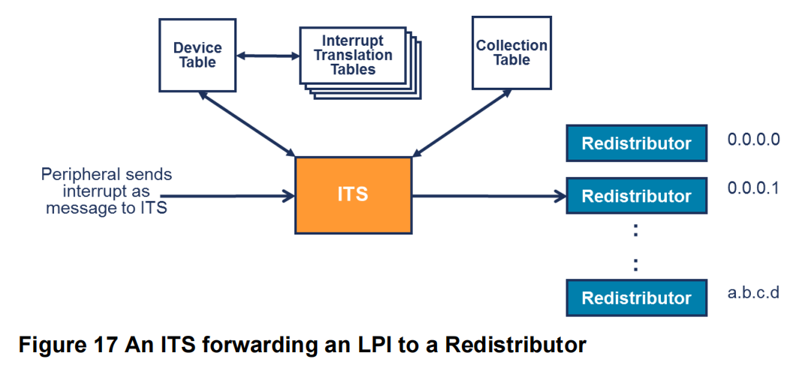

# ITS原理及虚拟化实现

时间：2024/10/8

作者：徐仲锴

摘要：介绍ITS是如何处理LPI中断的，以及如何实现对于ITS的虚拟化。

## 原理

### ITS是如何处理LPI中断的

MSI中断是一种基于消息的中断机制，通常由PCIe设备触发，在ARM中称为LPI中断。LPI中断是由GIC的子系统ITS来处理的，以下是处理流程：

1. 系统软件为PCIe设备配置MSI/MSI-X Capabilities，包含以下信息：
   1. 如何发出中断：触发中断的寄存器 `GITS_TRANSLATER` 的地址是多少？
   2. 想要发出不同的中断信息，需要写入的值 `event_id` 是多少？
2. 设备需要发出中断的时候，往 `GITS_TRANSLATER` 写入 `event_id` 。
3. 启动ITS流程，首先根据设备的id（对于PCIe设备即为BDF），查Device Table ，找到对应表项，表项的内容是该设备对应的Interrupt Translation Table的基地址，以下简称ITT。
4. 在ITT中查找，根据本次的 `event_id` 找到对应的中断号 `INTID` 和 `collection_id` 。
5. 根据 `collection_id` ，查Collection Table ，明确这个 `collection_id` 对应的redistributor，将中断发送过去。

### 五张表和CMDQ

除了以上提过的三张表：

- Device Table
- ITT
- Collection Table

与LPI相关的还有两张表：

- LPI Property Table：所有的redistributor**共享**一张创建于内存的表，用于使能中断和设置中断的优先级。
- LPI Pending Table：每个redistributor对应一张创建于内存的表，用于管理中断的pending状态。

以及一个创建于内存的Command Queue，用于写入命令，命令的主要用途是填充ITS流程中会使用到的三张表，**注意是使用命令填充，而不是系统软件直接写入内存修改表项。**

## 虚拟化方案

### 表

以上所提到的资源，都是由软件在内存中创建的，再将基地址写入寄存器告诉硬件的。所以这里就涉及到，硬件认定的资源，即真正写入、真正用到的表，是谁来管理？hvisor，或是某个虚拟机？

1. 对于每个redistributor独自拥有的资源，如LPI Pending Table，由于hvisor的静态资源隔离机制，不同虚拟机分配到的redistributor不同，可直接交由虚拟机各自管理。将 `GICR_PENDBASER` 直通虚拟机。
2. 对于全局共享的唯一一张表：
   1. 如Device Table，Collection Table，是由命令填充的，虚拟机配置好基地址后，就使用命令填充表格。这种情况下，就将 `GITS_BASER<0>` 和 `GITS_BASER<1>` 直通给一个虚拟机，其他虚拟机的基地址配置由hvisor记录，而填充的命令正常执行，这样最后形成的表格仍是完整、可用、不冲突的。
   2. 但LPI Property Table是直接写内存填充的，难以将多个虚拟机的配置进行统一，且不同虚拟机，分配到的不同设备，可能使用相同的中断号，这造成了更大的困难。所以该表可直接由hvisor统一管理，以hvisor创建的表为准，优先级与使能都由hvisor来管理。

### CMDQ

CMDQ也是属于硬件只会认准一份的资源，它是在内存创建的，软件配置好基地址 `GITS_CBASER` 后，将命令写入内存，通过写 `GITS_CWRITER` 通知硬件命令写入进度，读 `GITS_READR` 确认硬件执行命令的进度。

CMDQ主要作用是填充ITS的三张表，还有其他的一些清除缓存的命令，所以不能像LPI Property Table一样可以忽视虚拟机的配置内容，仍然需要执行虚拟机的命令。

且两个虚拟机内部所认为的命令处理进度是不同的，写入的 `GITS_CWRITER` 和期望读取到的 `GITS_READR` 的值也是不同的。

那么就要求hvisor充当一个虚拟的硬件，来接收每个虚拟机的基地址配置、以及写入命令的通知，再读取他们写入的命令交由硬件真正处理（写入hvisor自己维护的CMDQ），再为每个虚拟机定制命令执行结果 `GITS_READR` 。

## 实现

在 `src/device/irqchip/gicv3` 目录下可找到ITS相关的代码。

`LpiPropertyTable` 对于任一虚拟机的写 `BASER` 请求进行拦截，只使用hvisor自己的配置。

`DeviceTable`，`CollectionTable` 的实现中，对于zone1的写 `BASER` 寄存器请求进行拦截并记录。

`CMDQ` 的方法中，`insert cmd` 方法用于获取虚拟机的当前命令，即到虚拟机在内存中创建的cmdq中根据该虚拟机的 `GITS_CWRITER` 取出命令，并把该命令写入hvisor的cmdq中，通知硬件执行命令，最后hvisor来检查 `GITS_CREADR`，确认已经完成命令，并通过虚拟的 `READR` 返回给虚拟机。

