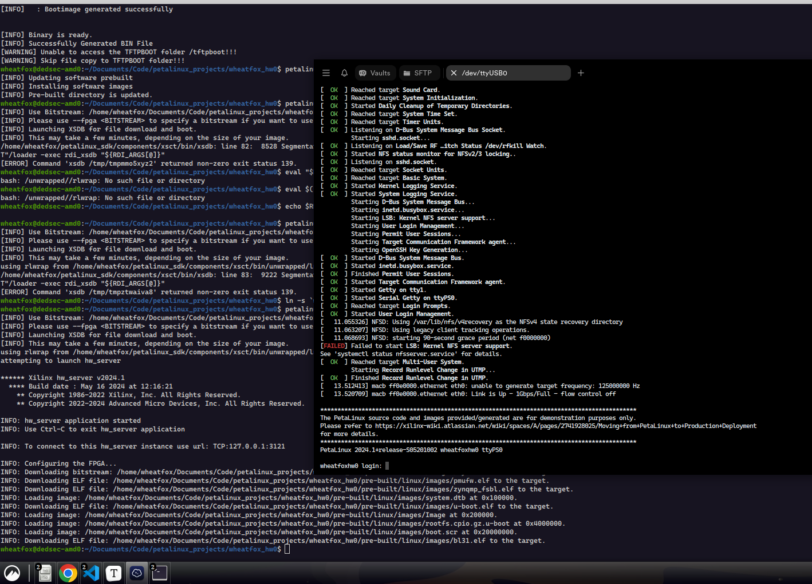

# Xilinx Ultrascale ZCU201 研究记录

wheatfox

## 10月30日记录

在vivado里试着创建一个ZCU102的example project，架构如下：


其中ZYNQ即SoC上的ARM硬核，其通过AXI互联和GPIO/FPGA BRAM相连，默认的模板引出了GPIO[7:0]的8个LED位。ZYNQ架构的block design如下：

PL -> DTS overlay on hot-reload


**RPU** - Real-Time Processing Unit：负责实时处理任务，通常运行更简单的操作系统或实时操作系统（RTOS）。

**APU** - Application Processing Unit：负责执行更复杂的操作，通常运行通用操作系统（如Linux）。

**OCM** - On-Chip Memory：片上内存，用于存储一些关键的操作数据或代码。

**IOU** - Input/Output Unit：用于处理输入输出外设的单元。

**MIO** - Multiplexed I/O：多路复用I/O，用于连接外部设备。

**CCI** - Cache Coherent Interconnect：缓存一致性互联，支持多核之间的数据一致性。

**Core SW** - Core Switch：用于内部连接和数据交换的核心开关。

**FPD** - Full Power Domain：全功率域，通常用于高性能操作。

**LPD** - Low Power Domain：低功率域，用于节能操作。

**CSU** - Configuration and Security Unit：配置和安全单元，负责系统配置和安全性。

**PMU** - Power Management Unit：电源管理单元，负责系统的电源控制和管理。

**PL** - Programmable Logic：可编程逻辑区，用于用户自定义逻辑设计，位于图中右下角部分。

**AMS** - Analog Mixed Signal：模拟混合信号区，用于处理模拟信号的转换和处理。

**GPU Mali-400** - 图形处理单元：用于图形加速，Mali-400是ARM公司的一款GPU。

**SD/eMMC** - Secure Digital/Embedded MultiMediaCard：存储设备接口，用于连接SD卡或嵌入式存储。

**ACP** - Accelerator Coherency Port：这是一个加速器一致性端口，允许外设和加速器直接访问处理器缓存，从而实现更高效的数据传输和更好的系统性能。

**ECC** - Error Correction Code：错误校正码，用于检测和纠正存储器中的单比特错误，确保数据的完整性。通常在关键的数据路径（如缓存和主存储器）中使用。

**SCU** - Snoop Control Unit：用于管理多核系统中处理器缓存之间的一致性，确保多个处理器对共享数据的一致访问。

**MicroBlaze** - 这是Xilinx提供的一种32位RISC软处理器，专门为FPGA设计。它可以被用户在可编程逻辑（PL）中实例化，实现自定义逻辑控制或应用。

记录一下重要的数据：

1. PSS_REF_CLK 33.33MHz
2. PCIe 100MHz Link Speed 5Gb/s
3. SATA 126MHz
4. DP 27MHZ
5. USB0 26MHz
6. DDR4 1067MHz
7. UART0和1的baud 115200

UART0  PS_UART0 (MIO 18-19)

UART1  PS_UART1 (MIO 20-21)

UART2  PL-UART (HD Bank 49)

UART3  U41 System Controller UART

### Hello World in Vivado and Vitis 2024

在完成block design之后，首先需要导出这个硬件描述，才能让vitis拿到自己的PS系统所面向的硬件结构

File - Export - Export Hardware

之后会得到一个xsa文件，对于vitis来说就是输入一个xsa，然后编译得到对应结构上的elf程序

打开vitis IDE，打开一个workspace，之后创建一个新的platform component，创建时选择刚刚的xsa文件：


之后vitis会自动开始生成我们xsa的设备树，然后进入OS和CPU选择，OS可以选择standalone、freerots、linux，CPU这里选A53的application cpu。


第一次创建出现报错：

```bash
cmake: error while loading shared libraries: libssl.so.10: cannot open shared object file: No such file or directory
cmake: error while loading shared libraries: libcrypto.so.10: cannot open shared object file: No such file or directory
```

检查一下lib：

```bash
➜  ~ whereis libssl.so
libssl.so: /usr/lib/x86_64-linux-gnu/libssl.so
➜  x86_64-linux-gnu ls | grep ssl
libssl3.so
libssl.a
libssl.so
libssl.so.1.1
libssl.so.3
libxmlsec1-openssl.so.1
libxmlsec1-openssl.so.1.2.37

➜  x86_64-linux-gnu ls | grep crypto
libbd_crypto.so.2
libbd_crypto.so.2.0.0
libcrypto.a
libcrypto.so
libcrypto.so.1.1
libcrypto.so.3
libk5crypto.so.3
libk5crypto.so.3.1
libmbedcrypto.so.2.28.3
libmbedcrypto.so.7
```

vitis的cmake要的libssl的版本为1.0.0，只能从源码编译一个手动安装一下

https://openssl-library.org/source/old/1.0.0/index.html

```bash
./config shared zlib-dynamic && make -j12
➜  openssl-1.0.0 sudo cp libcrypto.so.1.0.0 /usr/lib/x86_64-linux-gnu/
➜  openssl-1.0.0 sudo cp libssl.so.1.0.0 /usr/lib/x86_64-linux-gnu 
➜  x86_64-linux-gnu sudo ln -s libssl.so.1.0.0 libssl.so.10
➜  x86_64-linux-gnu sudo ln -s libcrypto.so.1.0.0 libcrypto.so.10
sudo ldconfig
```

然后就可以正常创建platform了

添加一个hello world工程，左下角build后就可以在build目录得到elf文件：


https://xilinx.github.io/Embedded-Design-Tutorials/docs/2023.1/build/html/docs/Introduction/ZynqMPSoC-EDT/4-build-sw-for-ps-subsystems.html

在vitis魔改的vscode IDE中启动调试，通过termius开一个ttyUSB0的115200串口，然后可以看到PS系统的APU成功发送了hello world：


但是每次debug启动时都会有xsdb脚本报错segmentation fault然后卡很久，从apt安装一个rlwrap然后把xilinx自带的那个没法运行的换掉：

https://adaptivesupport.amd.com/s/question/0D54U00006lApRISA0/immediate-segfault-when-running-xsdb?language=en_US

```bash
sudo apt install rlwrap
➜  ~ mv /tools/Xilinx/Vitis/2024.1/bin/unwrapped/lnx64.o/rlwrap /tools/Xilinx/Vitis/2024.1/bin/unwrapped/lnx64.o/rlwrap.bak
➜  ~ ln -s `which rlwrap` /tools/Xilinx/Vitis/2024.1/bin/unwrapped/lnx64.o/rlwrap
```

然后就没问题了。

> rlwrap是gnu readline工具中的一个（https://linux.die.net/man/1/rlwrap），其能够提供对任何command或程序的用户输入历史记录保存（上下箭头切换）、自定义补全等。xilinx使用rlwrap运行自己的xsdb debug程序

### 什么是petalinux

petalinux是amd提供的一个嵌入式linux的**SDK**，包括：

1. yocto extensible SDK
2. XSCT工具链（Xilinx Software Commandline Tools）
3. petalinux CLI tools

https://xilinx-wiki.atlassian.net/wiki/spaces/A/pages/18841937/Zynq+UltraScale+MPSoC+Ubuntu+part+2+-+Building+and+Running+the+Ubuntu+Desktop+From+Sources 这里有一份为zcu102编译好的ubuntu desktop镜像，不过之后可能要自己修改linux，所以还是需要学一下petalinux工具链

### 安装petalinux SDK并创建BSP工程

文档 https://docs.amd.com/r/en-US/ug1144-petalinux-tools-reference-guide/Overview

下载地址 https://www.xilinx.com/support/download/index.html/content/xilinx/en/downloadNav/embedded-design-tools.html

从linux源码开始构建boot image

https://xilinx-wiki.atlassian.net/wiki/spaces/A/pages/18842481/Build+kernel#Buildkernel-Genericinstructionsforbuildingthekernel

选择linux版本：linux-xlnx（xilinx自己维护的linux kernel）

```bash
make ARCH=arm64 xilinx_zynqmp_defconfig # for zynq MPSoc Ultrascale+
make ARCH=arm64 menuconfig
make ARCH=arm64
```

从2024.1开始有两种方法编译petalinux images：

1. XSCT：将xsa文件输入petalinux-config
2. system-device-tree：将sdt输入petalinux-config

```bash
sudo apt install autoconf libtool libtool-bin
./petalinux-v2024.1-05202009-installer.run

Do you accept Xilinx End User License Agreement? [y/N] > y
Do you accept Third Party End User License Agreement? [y/N] > y
Enter target directory for SDK (default: /home/wheatfox/Downloads): /home/wheatfox/petalinux_sdk
[INFO] Installing PetaLinux SDK...done
[INFO] Setting it up...done
[INFO] Extracting xsct tarball...done
[INFO] PetaLinux SDK has been successfully set up and is ready to be used.

# 在shell中添加环境

source /home/wheatfox/petalinux_sdk/settings.sh
```

下载ZCU102的板级支持包并创建新工程：

```
wheatfox@dedsec-amd0:~/Documents/Code/petalinux_projects$ petalinux-create project -s ~/Downloads/xilinx-zcu102-v2024.1-05230256.bsp 
[INFO] Create project: 
[INFO] Project(s):
	* xilinx-zcu102-2024.1
[INFO] Has been successfully installed to /home/wheatfox/Documents/Code/petalinux_projects/
[INFO] New project successfully created in /home/wheatfox/Documents/Code/petalinux_projects/
```

研究一下petalinux工程结构：

https://docs.amd.com/r/en-US/ug1144-petalinux-tools-reference-guide/PetaLinux-Project-Structure

```
project-spec
   hw-description // xsa,bitsream文件在这里
   configs // rootfs的配置
   meta-user
pre-built
   linux
      implementation
      images 
      xen    
hardware
  <project-name> // vivado+vitis project文件
components
   plnx_workspace
      device-tree
config.project
README
```

### 自定义petalinux工程

如果我们要自己改硬件设计，那就不能用上面的BSP导入了，试着从空项目开始

```bash
petalinux-create project --template zynqMP --name wheatfox_hw0
cd wheatfox_hw0
petalinux-config --get-hw-description ~/vivado/wheatfox_zcu102/mpsoc_preset_wrapper.xsa

```

之后会进入System Configuration Menu配置界面。

https://docs.amd.com/r/en-US/ug1144-petalinux-tools-reference-guide/Importing-a-Hardware-Configuration

machine name需要修改为：zcu102-rev1.0

```text
cd wheatfox_hw0
petalinux-build # build the world :D

[INFO] Building project
[INFO] Getting Platform info from HW file
[INFO] Silentconfig project
[INFO] Silentconfig rootfs
[INFO] Generating configuration files
[INFO] Generating workspace directory
NOTE: Starting bitbake server...
NOTE: Started PRServer with DBfile: /home/wheatfox/Documents/Code/petalinux_projects/wheatfox_hw0/build/cache/prserv.sqlite3, Address: 127.0.0.1:42915, PID: 64461
INFO: Specified workspace already set up, leaving as-is
[INFO] bitbake petalinux-image-minimal
NOTE: Started PRServer with DBfile: /home/wheatfox/Documents/Code/petalinux_projects/wheatfox_hw0/build/cache/prserv.sqlite3, Address: 127.0.0.1:36197, PID: 64524
WARNING: Host distribution "debian-12" has not been validated with this version of the build system; you may possibly experience unexpected failures. It is recommended that you use a tested distribution.
Loading cache: 100% |############################################################################################################################################################################################################################################| Time: 0:00:00
Loaded 6415 entries from dependency cache.
Parsing recipes: 100% |##########################################################################################################################################################################################################################################| Time: 0:00:01
Parsing of 4468 .bb files complete (4466 cached, 2 parsed). 6417 targets, 374 skipped, 2 masked, 0 errors.
NOTE: Resolving any missing task queue dependencies
WARNING: XSCT has been deprecated. It will still be available for several releases. In the future, it's recommended to start new projects with SDT workflow.                                                                                                     | ETA:  0:00:00
Initialising tasks: 100% |#######################################################################################################################################################################################################################################| Time: 0:00:05
Checking sstate mirror object availability: 100% |###############################################################################################################################################################################################################| Time: 0:00:08
Sstate summary: Wanted 480 Local 22 Mirrors 458 Missed 0 Current 1197 (100% match, 100% complete)
NOTE: Executing Tasks
NOTE: Tasks Summary: Attempted 4552 tasks of which 4548 didn't need to be rerun and all succeeded.

Summary: There were 2 WARNING messages.
[INFO] Failed to copy built images to tftp dir: /tftpboot
[INFO] Successfully built project
```

从手册里可以看到petalinux对tftp是支持的，之后可以研究一下通过网线一键部署（？）

### 部署image到ZCU102

https://docs.amd.com/r/en-US/ug1144-petalinux-tools-reference-guide/Generate-Boot-Image-for-Zynq-UltraScale-MPSoC

启动需要的相关文件：

```bash
wheatfox@dedsec-amd0:~/Documents/Code/petalinux_projects/wheatfox_hw0$ petalinux-package boot --u-boot
[INFO] File in BOOT BIN: "/home/wheatfox/Documents/Code/petalinux_projects/wheatfox_hw0/images/linux/zynqmp_fsbl.elf"
[INFO] File in BOOT BIN: "/home/wheatfox/Documents/Code/petalinux_projects/wheatfox_hw0/images/linux/pmufw.elf"
[INFO] File in BOOT BIN: "/home/wheatfox/Documents/Code/petalinux_projects/wheatfox_hw0/images/linux/bl31.elf"
[INFO] File in BOOT BIN: "/home/wheatfox/Documents/Code/petalinux_projects/wheatfox_hw0/images/linux/system.dtb"
[INFO] File in BOOT BIN: "/home/wheatfox/Documents/Code/petalinux_projects/wheatfox_hw0/images/linux/u-boot.elf"
[INFO] Generating zynqmp binary package BOOT.BIN...
[INFO] 

****** Bootgen v2024.1
  **** Build date : Apr 29 2024-12:18:25
    ** Copyright 1986-2022 Xilinx, Inc. All Rights Reserved.
    ** Copyright 2022-2024 Advanced Micro Devices, Inc. All Rights Reserved.


[INFO]   : Bootimage generated successfully


[INFO] Binary is ready.
[INFO] Successfully Generated BIN File
[WARNING] Unable to access the TFTPBOOT folder /tftpboot!!!
[WARNING] Skip file copy to TFTPBOOT folder!!!
```

其中BOOT.BIN是最终生成的boot image

然后是打包镜像

```bash
wheatfox@dedsec-amd0:~/Documents/Code/petalinux_projects/wheatfox_hw0$ petalinux-package prebuilt --fpga ~/vivado/wheatfox_zcu102/wheatfox_zcu102.runs/impl_1/mpsoc_preset_wrapper.bit
[INFO] Updating software prebuilt
[INFO] Installing software images
[INFO] Pre-built directory is updated.
```

启动：

```text
ln -s `which rlwrap` /home/wheatfox/petalinux_sdk/components/xsct/bin/unwrapped/lnx64.o/rlwrap #老问题，自带的rlwrap二进制程序报错，换一个apt安装的即可
petalinux-boot jtag --prebuilt 3

wheatfox@dedsec-amd0:~/Documents/Code/petalinux_projects/wheatfox_hw0$ petalinux-boot jtag --prebuilt 3
[INFO] Use Bitstream: /home/wheatfox/Documents/Code/petalinux_projects/wheatfox_hw0/pre-built/linux/images/system.bit
[INFO] Please use --fpga <BITSTREAM> to specify a bitstream if you want to use other bitstream.
[INFO] Launching XSDB for file download and boot.
[INFO] This may take a few minutes, depending on the size of your image.
using rlwrap from /home/wheatfox/petalinux_sdk/components/xsct/bin/unwrapped/lnx64.o/rlwrap
attempting to launch hw_server

****** Xilinx hw_server v2024.1
  **** Build date : May 16 2024 at 12:16:21
    ** Copyright 1986-2022 Xilinx, Inc. All Rights Reserved.
    ** Copyright 2022-2024 Advanced Micro Devices, Inc. All Rights Reserved.

INFO: hw_server application started
INFO: Use Ctrl-C to exit hw_server application

INFO: To connect to this hw_server instance use url: TCP:127.0.0.1:3121

INFO: Configuring the FPGA...
INFO: Downloading bitstream: /home/wheatfox/Documents/Code/petalinux_projects/wheatfox_hw0/pre-built/linux/images/system.bit to the target.
INFO: Downloading ELF file: /home/wheatfox/Documents/Code/petalinux_projects/wheatfox_hw0/pre-built/linux/images/pmufw.elf to the target.
INFO: Downloading ELF file: /home/wheatfox/Documents/Code/petalinux_projects/wheatfox_hw0/pre-built/linux/images/zynqmp_fsbl.elf to the target.
INFO: Loading image: /home/wheatfox/Documents/Code/petalinux_projects/wheatfox_hw0/pre-built/linux/images/system.dtb at 0x100000.
INFO: Downloading ELF file: /home/wheatfox/Documents/Code/petalinux_projects/wheatfox_hw0/pre-built/linux/images/u-boot.elf to the target.
INFO: Loading image: /home/wheatfox/Documents/Code/petalinux_projects/wheatfox_hw0/pre-built/linux/images/Image at 0x200000.
INFO: Loading image: /home/wheatfox/Documents/Code/petalinux_projects/wheatfox_hw0/pre-built/linux/images/rootfs.cpio.gz.u-boot at 0x4000000.
INFO: Loading image: /home/wheatfox/Documents/Code/petalinux_projects/wheatfox_hw0/pre-built/linux/images/boot.scr at 0x20000000.
INFO: Downloading ELF file: /home/wheatfox/Documents/Code/petalinux_projects/wheatfox_hw0/pre-built/linux/images/bl31.elf to the target.
wheatfox@dedsec-amd0:~/Documents/Code/petalinux_projects/wheatfox_hw0$ 

```

成功启动linux：



```
********************************************************************************************
The PetaLinux source code and images provided/generated are for demonstration purposes only.
Please refer to https://xilinx-wiki.atlassian.net/wiki/spaces/A/pages/2741928025/Moving+from+PetaLinux+to+Production+Deployment
for more details.
********************************************************************************************
PetaLinux 2024.1+release-S05201002 wheatfoxhw0 ttyPS0

wheatfoxhw0 login: petalinux
You are required to change your password immediately (administrator enforced).
New password: 
Retype new password: 
[  318.321898] audit: type=1006 audit(1667916329.935:2): pid=590 uid=0 old-auid=4294967295 auid=1000 tty=(none) old-ses=4294967295 ses=1 res=1
[  318.334496] audit: type=1300 audit(1667916329.935:2): arch=c00000b7 syscall=64 success=yes exit=4 a0=8 a1=ffffc5f0cbe0 a2=4 a3=0 items=0 ppid=1 pid=590 auid=1000 uid=0 gid=0 euid=0 suid=0 fsuid=0 egid=0 sgid=0 fsgid=0 tty=(none) ses=1 comm="(systemd)" exe="/lib/systemd/systemd" key=(null)
[  318.349329] systemd[590]: memfd_create() called without MFD_EXEC or MFD_NOEXEC_SEAL set
[  318.360086] audit: type=1327 audit(1667916329.935:2): proctitle="(systemd)"
wheatfoxhw0:~$ uname -a
Linux wheatfoxhw0 6.6.10-xilinx-v2024.1-g3af4295e00ef #1 SMP Sat Apr 27 05:22:24 UTC 2024 aarch64 GNU/Linux
wheatfoxhw0:~$ df -h
Filesystem                Size      Used Available Use% Mounted on
devtmpfs                  4.0M      4.0K      4.0M   0% /dev
tmpfs                     1.9G         0      1.9G   0% /dev/shm
tmpfs                   786.1M      9.8M    776.4M   1% /run
tmpfs                     4.0M         0      4.0M   0% /sys/fs/cgroup
tmpfs                     1.9G         0      1.9G   0% /tmp
tmpfs                     1.9G     12.0K      1.9G   0% /var/volatile
tmpfs                   393.1M         0    393.1M   0% /run/user/1000
wheatfoxhw0:~$ free -h
              total        used        free      shared  buff/cache   available
Mem:           3.8G       79.6M        3.7G        9.8M      112.1M        3.6G
Swap:             0           0           0
wheatfoxhw0:~$ 
```

