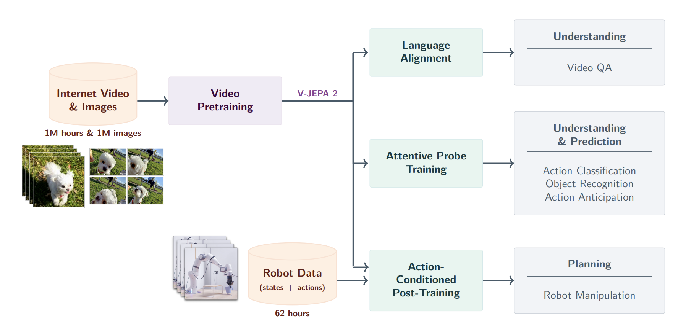
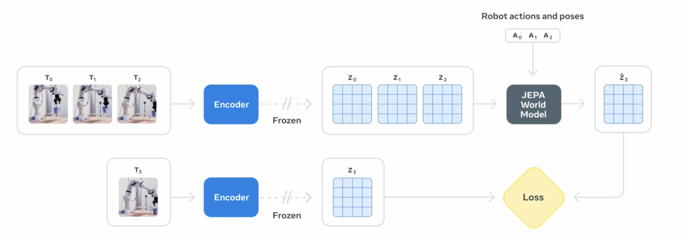

# Meta世界模型：Vjepa2模型介绍与部署测试

时间: 2025/01/02

作者: 刘凯乐

联系方式：kaileliu0852@gmail.com

## 一.模型介绍

  Meta 的 **V-JEPA 2**（Video Joint-Embedding Predictive Architecture 2）是一类面向真实世界的**自监督视频世界模型**：它试图像人类一样，主要通过“观察”来学习环境的动态规律，从而获得对视频内容的**理解**、对未来的**预测**，并进一步支持**规划与控制**。其核心思想来自 JEPA（Joint-Embedding Predictive Architecture），即不在像素空间逐帧生成视频，而是在一个学习到的**表示空间（latent / representation space）**里做预测，强调建模场景中“可预测的结构”（例如物体运动轨迹、交互因果关系），而弱化像素级不可控细节带来的负担与噪声。

  在训练路径上，V-JEPA 2 采用**分阶段（stage-wise）**流程：第一阶段先做“无动作（action-free）”的互联网规模预训练——利用超过 **100 万小时**的公开视频与大量图像数据，通过“**掩码—去噪式的表示预测**”目标，让模型从被遮挡/丢弃的时空 patch 中恢复并预测对应的潜在特征，从而学到强泛化的视频表征与时序动力学先验。这种大规模自监督预训练带来很强的通用视频理解与预测能力，例如在 Something-Something v2 的运动理解与 Epic-Kitchens-100 的动作预期等基准上取得显著提升。

  第二阶段，研究者将预训练好的视频编码器“冻结”，在其表示之上用少量机器人交互数据训练一个**动作条件（action-conditioned）的潜在世界模型 V-JEPA 2-AC**：该模型学习在给定当前观测表示的情况下，结合**动作**与**本体/末端执行器状态（proprioception / end-effector states）去自回归地预测未来观测的表示，从而显式捕捉“动作如何改变世界”的因果效应。训练数据来自 Droid 数据集的遥操作机械臂轨迹，使用的是真实机器人视频与末端状态信号，但不依赖奖励标注、任务类别标注或成功与否标注**；整体数据量在论文设置下约 **62 小时**量级。

  在机器人应用上，V-JEPA 2-AC 并不是直接输出一个端到端策略，而是进入一个**模型预测控制（MPC）式的规划环**：给定当前相机画面与“目标图像/子目标图像”，系统在有限规划时域内搜索一段动作序列，使模型“想象”的未来状态表示逐步逼近目标表示（论文中以表示空间的 L1 距离作为能量/代价），并用 Cross-Entropy Method（CEM）做采样优化；每次只执行第一步动作后再观测并滚动重规划。该方式使得模型能够在**新环境零样本部署**到真实 Franka 机械臂上，在不同实验室、无需额外环境数据采集、无需任务特定训练或奖励设计的前提下，实现如**到达、抓取、抓取后放置（pick-and-place）**等基础操作，并以视觉目标驱动完成面向物体的规划与控制。

## 二.vjepa2预训练

vjepa2世界模型核心训练分成**两大阶段**，结合海量自我监督与学习针对机器人控制的微调



1. **在第一阶段**使用一百万小时视频数据和一百万张图片进行**自****监督训练**，vjepa2学习从视觉数据中提取深层特征，理解与预测动态变化。
2. **在第二阶段**主要是三个后训练
   1. Language alignment **将视频信息与语言任务**对接，vjepa2在预训练后可以与自然语言进行交互，理解问题并且给予视频内容回答问题
   2. Attentive probe training 通过**不同任务对模型进行微调**，使得vjepa2能够更好执行视频理解任务（视频问答、动作分类、目标识别）。
   3. Action conditioned post-training 使用**机器人数据（状态和动作集合）dorid数据对模型进行再训练**，持续62hour，提高模型机器人操作能力，使得模型能够**基于之前的状态预测未来的动作**。
3. Planning 最终vjepa2能够执行机器人操作规划，不仅能够理解视频中的动作和对象，还可以计划并执行实际的操作任务，比如控制机械臂进行抓取等操作。

## 三.vjepa2结构



V‑JEPA 结构通过将视频帧（T₀, T₁, T₂）输入编码器，提取潜在表示（Z₀, Z₁, Z₂），并结合机器人动作（A₀, A₁, A₂）送入世界模型。该模型预测未来的帧（Z₃），同时通过 T₃（实际的下一帧）与预测的Z₃ 进行对比，计算损失并优化模型。整个过程帮助模型理解机器人动作与环境状态之间的关系，并能够进行未来状态预测。

## 四.Meta实验部分

在meta的测试中，vjepa2部署在franka机械臂上，展现出极强的泛化性，没有针对场景做任何训练，也没有收集额外的数据，在“抓取与放置”任务能够达到65%-80%的成功率。


[视频地址](https://video-nrt1-1.xx.fbcdn.net/o1/v/t2/f2/m69/AQOU5sKJ4jWm4-lKzPpiuP-oCK_xhnNQwICxfUaQeFm8wn6igiuWswMnVfszIcGoaRkMyjBjA23GSLHHWtGvKy46.mp4?strext=1&_nc_cat=108&_nc_sid=5e9851&_nc_ht=video-nrt1-1.xx.fbcdn.net&_nc_ohc=Sb3khn13zs4Q7kNvwH46--8&efg=eyJ2ZW5jb2RlX3RhZyI6Inhwdl9wcm9ncmVzc2l2ZS5GQUNFQk9PSy4uQzMuMTkyMC5kYXNoX2gyNjQtYmFzaWMtZ2VuMl8xMDgwcCIsInhwdl9hc3NldF9pZCI6MjExMjQxOTE1MjU5NjAwNywiYXNzZXRfYWdlX2RheXMiOjE1MywidmlfdXNlY2FzZV9pZCI6MTA4MjUsImR1cmF0aW9uX3MiOjM0LCJ1cmxnZW5fc291cmNlIjoid3d3In0%3D&ccb=17-1&vs=cc7d0a47b9edbfda&_nc_vs=HBksFQIYOnBhc3N0aHJvdWdoX2V2ZXJzdG9yZS9HTXBnQ2g2dU9yLW9zTklEQUh5U093Yk5acVZOYnY0R0FBQUYVAALIARIAFQIYOnBhc3N0aHJvdWdoX2V2ZXJzdG9yZS9HRm91RFI0TVExTmUxWk1DQUMxYXdORmVONVZxYnY0R0FBQUYVAgLIARIAKAAYABsCiAd1c2Vfb2lsATEScHJvZ3Jlc3NpdmVfcmVjaXBlATEVAAAmzrCok_3OwAcVAigCQzMsF0BBTvnbItDlGBpkYXNoX2gyNjQtYmFzaWMtZ2VuMl8xMDgwcBEAdQJlkqkBAA&_nc_gid=4_0A6munsOGZ-0H_SssuqA&_nc_zt=28&oh=00_Afi8oOKlpbaKnfIZsVwVAGab8TnuHqgWIgDfLg35yDCspw&oe=69124C42&bitrate=504632&tag=dash_h264-basic-gen2_1080p)

使用 V-JEPA 2 编码器来获取当前状态和目标状态的嵌入向量。机器人从观察到的当前状态出发，利用预测器来设想一系列候选动作的后果，并根据候选动作与期望目标的接近程度对其进行评分，从而进行规划。在每个时间步，机器人通过模型预测控制重新规划并执行评分最高的下一个动作，以实现该目标。


## 五.实验部署简单测试

初步测试，希望能够在单张5090上测试vjepa2模型，跑通一个demo，设计简单测试实验。首先选取vjepa2模型，官方主要提供两个版本的pt格式模型，

| Model       | SSv2                                                         | Diving48                                                     | EK100                                                        |        |                                                              |                                                              |                                                              |        |                                                              |                                                              |                                                              |          |
| ----------- | ------------------------------------------------------------ | ------------------------------------------------------------ | ------------------------------------------------------------ | ------ | ------------------------------------------------------------ | ------------------------------------------------------------ | ------------------------------------------------------------ | ------ | ------------------------------------------------------------ | ------------------------------------------------------------ | ------------------------------------------------------------ | -------- |
|             | Checkpoint                                                   | Training Config                                              | Inference Config                                             | Result | Checkpoint                                                   | Training Config                                              | Inference Config                                             | Result | Checkpoint                                                   | Training Config                                              | Inference Config                                             | Result   |
| ViT-L/16    | [checkpoint](https://dl.fbaipublicfiles.com/vjepa2/evals/ssv2-vitl-16x2x3.pt) | [config](https://github.com/facebookresearch/vjepa2/blob/main/configs/eval/vitl/ssv2.yaml) | [config](https://github.com/facebookresearch/vjepa2/blob/main/configs/inference/vitl/ssv2.yaml) | 73.70% | [checkpoint](https://dl.fbaipublicfiles.com/vjepa2/evals/diving48-vitl-256.pt) | [config](https://github.com/facebookresearch/vjepa2/blob/main/configs/eval/vitl/diving48.yaml) | [config](https://github.com/facebookresearch/vjepa2/blob/main/configs/inference/vitl/diving48.yaml) | 89.00% | [checkpoint](https://dl.fbaipublicfiles.com/vjepa2/evals/ek100-vitl-256.pt) | [config](https://github.com/facebookresearch/vjepa2/blob/main/configs/eval/vitl/ek100.yaml) | [config](https://github.com/facebookresearch/vjepa2/blob/main/configs/inference/vitl/ek100.yaml) | 32.7 R@5 |
| ViT-g/16384 | [checkpoint](https://dl.fbaipublicfiles.com/vjepa2/evals/ssv2-vitg-384-64x2x3.pt) | [config](https://github.com/facebookresearch/vjepa2/blob/main/configs/eval/vitg-384/ssv2.yaml) | [config](https://github.com/facebookresearch/vjepa2/blob/main/configs/inference/vitg-384/ssv2.yaml) | 77.30% | [checkpoint](https://dl.fbaipublicfiles.com/vjepa2/evals/diving48-vitg-384-32x4x3.pt) | [config](https://github.com/facebookresearch/vjepa2/blob/main/configs/eval/vitg-384/diving48.yaml) | [config](https://github.com/facebookresearch/vjepa2/blob/main/configs/inference/vitg-384/diving48.yaml) | 90.20% | [checkpoint](https://dl.fbaipublicfiles.com/vjepa2/evals/ek100-vitg-384.pt) | [config](https://github.com/facebookresearch/vjepa2/blob/main/configs/eval/vitg-384/ek100.yaml) | [config](https://github.com/facebookresearch/vjepa2/blob/main/configs/inference/vitg-384/ek100.yaml) | 39.7 R@5 |

在各个数据集上，vit-g这个参数稍大的模型效果都比vit-l版本的模型要好，所以基础选定测试vit-g模型。

**1.首先，配置需要的环节：**

```SQL
conda create -n vjepa2-312 python=3.12
conda activate vjepa2-312
pip install .  # or `pip install -e .` for development mode
```

2.下载pt格式模型，分别下载编码器和分类器模型

```Bash
wget https://dl.fbaipublicfiles.com/vjepa2/vitg-384.pt -P YOUR_DIR
wget https://dl.fbaipublicfiles.com/vjepa2/evals/ssv2-vitg-384-64x2x3.pt -P YOUR_DIR
```

**3.定义测试脚本**

（1）加载 **V-JEPA2** 模型及其预训练权重。

（2）读取视频文件并对视频帧进行预处理。

（3）使用模型提取视频特征，并**进行分类推理。**

（4）输出推理结果，包括分类概率和预测标签。

```Python
# Copyright (c) Meta Platforms, Inc. and affiliates.
#
# This source code is licensed under the MIT license found in the
# LICENSE file in the root directory of this source tree.

import json
import os
import subprocess

import numpy as np
import torch
import torch.nn.functional as F
from decord import VideoReader
from transformers import AutoModel, AutoVideoProcessor

import src.datasets.utils.video.transforms as video_transforms
import src.datasets.utils.video.volume_transforms as volume_transforms
from src.models.attentive_pooler import AttentiveClassifier
from src.models.vision_transformer import vit_giant_xformers_rope

IMAGENET_DEFAULT_MEAN = (0.485, 0.456, 0.406)
IMAGENET_DEFAULT_STD = (0.229, 0.224, 0.225)

def load_pretrained_vjepa_pt_weights(model, pretrained_weights):
    # Load weights of the VJEPA2 encoder
    # The PyTorch state_dict is already preprocessed to have the right key names
    pretrained_dict = torch.load(pretrained_weights, weights_only=True, map_location="cpu")["encoder"]
    pretrained_dict = {k.replace("module.", ""): v for k, v in pretrained_dict.items()}
    pretrained_dict = {k.replace("backbone.", ""): v for k, v in pretrained_dict.items()}
    msg = model.load_state_dict(pretrained_dict, strict=False)
    print("Pretrained weights found at {} and loaded with msg: {}".format(pretrained_weights, msg))

def load_pretrained_vjepa_classifier_weights(model, pretrained_weights):
    # Load weights of the VJEPA2 classifier
    # The PyTorch state_dict is already preprocessed to have the right key names
    pretrained_dict = torch.load(pretrained_weights, weights_only=True, map_location="cpu")["classifiers"][0]
    pretrained_dict = {k.replace("module.", ""): v for k, v in pretrained_dict.items()}
    msg = model.load_state_dict(pretrained_dict, strict=False)
    print("Pretrained weights found at {} and loaded with msg: {}".format(pretrained_weights, msg))

def build_pt_video_transform(img_size):
    short_side_size = int(256.0 / 224 * img_size)
    # Eval transform has no random cropping nor flip
    eval_transform = video_transforms.Compose(
        [
            video_transforms.Resize(short_side_size, interpolation="bilinear"),
            video_transforms.CenterCrop(size=(img_size, img_size)),
            volume_transforms.ClipToTensor(),
            video_transforms.Normalize(mean=IMAGENET_DEFAULT_MEAN, std=IMAGENET_DEFAULT_STD),
        ]
    )
    return eval_transform

def get_video():
    vr = VideoReader("sample_video.mp4")
    # choosing some frames here, you can define more complex sampling strategy
    frame_idx = np.arange(0, 128, 2)
    video = vr.get_batch(frame_idx).asnumpy()
    return video

def forward_vjepa_video(model_hf, model_pt, hf_transform, pt_transform):
    # Run a sample inference with VJEPA
    with torch.inference_mode():
        # Read and pre-process the image
        video = get_video()  # T x H x W x C
        video = torch.from_numpy(video).permute(0, 3, 1, 2)  # T x C x H x W
        x_pt = pt_transform(video).cuda().unsqueeze(0)
        x_hf = hf_transform(video, return_tensors="pt")["pixel_values_videos"].to("cuda")
        # Extract the patch-wise features from the last layer
        out_patch_features_pt = model_pt(x_pt)
        out_patch_features_hf = model_hf.get_vision_features(x_hf)

    return out_patch_features_hf, out_patch_features_pt

def get_vjepa_video_classification_results(classifier, out_patch_features_pt):
    SOMETHING_SOMETHING_V2_CLASSES = json.load(open("ssv2_classes.json", "r"))

    with torch.inference_mode():
        out_classifier = classifier(out_patch_features_pt)

    print(f"Classifier output shape: {out_classifier.shape}")

    print("Top 5 predicted class names:")
    top5_indices = out_classifier.topk(5).indices[0]
    top5_probs = F.softmax(out_classifier.topk(5).values[0]) * 100.0  # convert to percentage
    for idx, prob in zip(top5_indices, top5_probs):
        str_idx = str(idx.item())
        print(f"{SOMETHING_SOMETHING_V2_CLASSES[str_idx]} ({prob}%)")

    return

def run_sample_inference():
    # HuggingFace model repo name
    hf_model_name = (
        "facebook/vjepa2-vitg-fpc64-384"  # Replace with your favored model, e.g. facebook/vjepa2-vitg-fpc64-384
    )
    # Path to local PyTorch weights
    pt_model_path = "/home/liukaile/yes/vjepa2/vitg-384.pt"

    sample_video_path = "/home/liukaile/yes/vjepa2/sample_video.mp4"
    # # Download the video if not yet downloaded to local path
    # if not os.path.exists(sample_video_path):
    #     video_url = "https://huggingface.co/datasets/nateraw/kinetics-mini/resolve/main/val/bowling/-WH-lxmGJVY_000005_000015.mp4"
    #     command = ["wget", video_url, "-O", sample_video_path]
    #     subprocess.run(command)
    #     print("Downloading video")

    # Initialize the HuggingFace model, load pretrained weights
    model_hf = AutoModel.from_pretrained(hf_model_name)
    model_hf.cuda().eval()

    # Build HuggingFace preprocessing transform
    hf_transform = AutoVideoProcessor.from_pretrained(hf_model_name)
    img_size = hf_transform.crop_size["height"]  # E.g. 384, 256, etc.

    # Initialize the PyTorch model, load pretrained weights
    model_pt = vit_giant_xformers_rope(img_size=(img_size, img_size), num_frames=64)
    model_pt.cuda().eval()
    load_pretrained_vjepa_pt_weights(model_pt, pt_model_path)

    # Build PyTorch preprocessing transform
    pt_video_transform = build_pt_video_transform(img_size=img_size)

    # Inference on video
    out_patch_features_hf, out_patch_features_pt = forward_vjepa_video(
        model_hf, model_pt, hf_transform, pt_video_transform
    )

    print(
        f"""
        Inference results on video:
        HuggingFace output shape: {out_patch_features_hf.shape}
        PyTorch output shape:     {out_patch_features_pt.shape}
        Absolute difference sum:  {torch.abs(out_patch_features_pt - out_patch_features_hf).sum():.6f}
        Close: {torch.allclose(out_patch_features_pt, out_patch_features_hf, atol=1e-3, rtol=1e-3)}
        """
    )

    # Initialize the classifier
    classifier_model_path = "/home/liukaile/yes/vjepa2/ssv2-vitg-384-64x2x3.pt"
    classifier = (
        AttentiveClassifier(embed_dim=model_pt.embed_dim, num_heads=16, depth=4, num_classes=174).cuda().eval()
    )
    load_pretrained_vjepa_classifier_weights(classifier, classifier_model_path)

    # Download SSV2 classes if not already present
    ssv2_classes_path = "/home/liukaile/yes/vjepa2/ssv2_classes.json"
    # if not os.path.exists(ssv2_classes_path):
    #     command = [
    #         "wget",
    #         "https://huggingface.co/datasets/huggingface/label-files/resolve/d79675f2d50a7b1ecf98923d42c30526a51818e2/"
    #         "something-something-v2-id2label.json",
    #         "-O",
    #         "ssv2_classes.json",
    #     ]
    #     subprocess.run(command)
    #     print("Downloading SSV2 classes")

    get_vjepa_video_classification_results(classifier, out_patch_features_pt)

if __name__ == "__main__":
    # Run with: `python -m notebooks.vjepa2_demo`
    run_sample_inference()
    print(f"Using device: {torch.cuda.get_device_name(torch.cuda.current_device())}")
```

在单卡5090上进行推理测试，结果如下所示：


回答讨论中的几个问题

1. **关于VJEPA2输出的动作标签**： 是的，VJEPA2（Video Joint Embedding Predictive Architecture 2）模型的输出，指的是视频中每个动作的预测概率。这个“在干什么”的标签，通常是由人工标注的，用于训练模型。标签可能包括例如“抓取物体”、“推送按钮”等动作类型。训练数据集中的视频帧与这些预定的标签一起作为输入，以便模型学习从视觉输入推断出动作。这意味着模型在训练过程中会学习到视频帧中不同动作的特征，然后在测试阶段根据输入的视频帧预测相应的动作标签。
2. **VJEPA2如何知道下一步要做什么**： VJEPA2在根据前几帧视频输入（即视觉输入）预测下一帧机械臂的动作时，采用了一个视觉和动作的联合嵌入空间。在这个嵌入空间中，模型会通过学习视频帧与机械臂动作之间的关系来进行预测。具体来说，VJEPA2结合了视频中前几帧的视觉信息，利用先前帧中的状态、物体位置、机械臂姿态等特征来推测下一步的动作。模型通过训练来学习视频序列和动作之间的时间关系和动态变化。它并不直接从“已知的下一步动作”中获得答案，而是通过在训练过程中对大量视频序列和动作的观察，推测出动作的时间顺序和依赖关系。在某些情况下，模型也可能会借助一些已知的机械臂运动学规则或先验知识（如物体抓取动作的连贯性）来增强其预测的准确性。总结来说，VJEPA2通过视觉输入（视频帧）加上其对动作时间顺序和物理约束的理解，预测下一帧中机械臂的动作，而这种能力来源于对大量训练数据的学习。