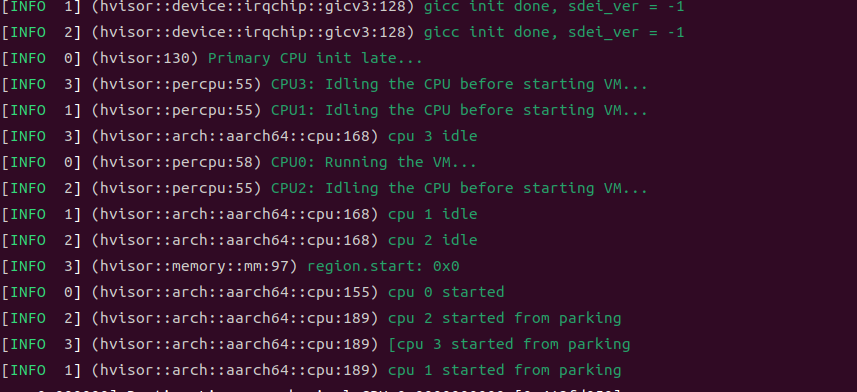
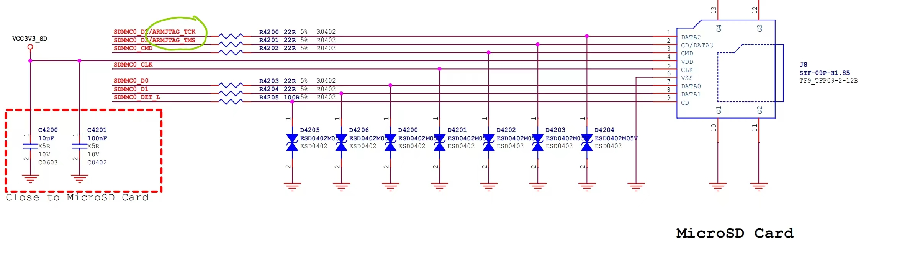
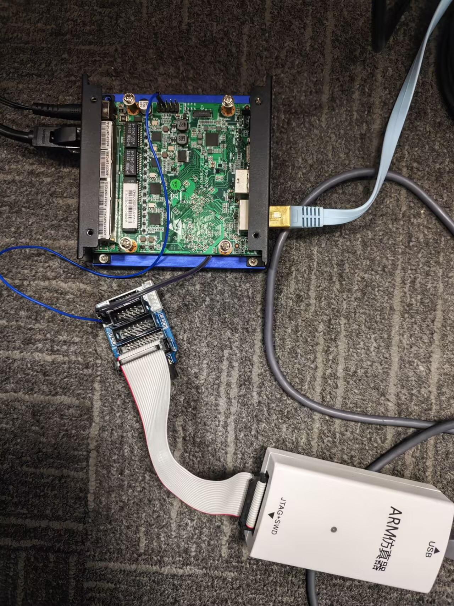

# hvisor如何适配新板子——以aarch64 rk3568为例

时间：2025/4/3

作者：陈星宇

# 一、编译SDK、烧写并获取相关信息

SDK相关内容需要向各板卡厂商获取，这里不对SDK编译烧写过程做解释，直接对我们需要的一些内容做简单罗列

| image | 用于启动root |  |
| --- | --- | --- |
| dts | 我们会对设备树进行一些裁剪以方便hvisor启动 | dts可以直接从SDK获取，也可以在启动linux后使用命令获取
dtc -I fs -O dts -o ./extracted.dts /proc/device-tree
直接从SDK获取的dts可读性更高 |
| 串口地址与型号 | 用于调试hvisor串口 | 对于arm64常见的串口，hvisor已经基本实现了全覆盖，包括imx_uart，pl011，uart_16550(8250)等 |

# 二、编写HVISOR配置文件

hvisor配置文件在/path/to/hvisor/platform中，文件目录如下

```bash
platform
├── aarch64
│   ├── imx8mp
│   ├── qemu-gicv2
│   ├── qemu-gicv3
│   ├── rk3568
│   │   ├── board.rs
│   │   ├── cargo
│   │   │   ├── config.template.toml
│   │   │   └── features
│   │   ├── configs
│   │   │   └── linux2.json
│   │   ├── image
│   │   │   └── dts
│   │   │       ├── Makefile
│   │   │       ├── rk3568-evb1-ddr4-v10-linux.dts
│   │   │       ├── zone0_rk3568.dts
│   │   │       └── zone1_rk3568.dts
│   │   ├── linker.ld
│   │   └── platform.mk
│   └── zcu102
├── loongarch64
│   ├── ls3a5000
│   └── ls3a6000
├── riscv64
│   ├── qemu-aia
│   └── qemu-plic
└── x86_64
    └── qemu
```

在aarch64下新增一个对应板卡名称的文件夹，这里就是新增rk3568文件夹

board.rs为启动zone0的配置文件，这部分内容在后面详细叙述，这里可以先从qemu里复制一个不改

config.template.toml根据相同架构的文件，只需要修改其中a55/a53字段即可

features中指定了hvisor需要启用的配置，必须添加的项目有uart driver、irqchip driver、cpu、pt_layout_XX四个字段，可选的配置项可以参考cargo.toml中的features。比如rk3568初始的features文件如下

```bash
gicv3
uart_16550
rk3568_uart_base
pt_layout_rk3568
a55
```

linux2.json是启动zone1的配置文件，可以先不填，此文件不影响编译

image中的内容其中dts就是我们在第一步获取的dts，此文件不影响编译

linker.ld直接复制qemu/rk3568的即可，唯一可能需要修改的值是BASE_ADDRESS，这个值是hvisor.bin的load地址，需要和uboot中对应上，第一次启动不改就行

platform.mk直接复制qemu/rk3568的即可，如果前面改里BASE_ADDRESS这里的地址要做同步修改

**注意每次修改platform内容后需要make clean再重新编译，否则相关内容不会更新**

# 三、Hvisor编译

## mmu设置

现在hvisor肯定是编译不通过的，对于aarch64来说，hvisor有自己的页表，该页表在src/arch/aarch64/mmu.rs中实现，我们在features中填的pt_layout_rk3568需要在这个文件中有对应的实现，具体对mmu.rs的实现[参考文件](待补充)

实际上我们只需要关心哪部分是内存包含里串口，并把那部分内存设置为device类型即可，以此为基准参考qemu和rk3568的实现添加一个pt_layout_xx即可。

## 串口地址修改

现阶段串口地址还不能通过配置文件直接修改，请在src/device/uart/对应的串口文件中，找到串口初始化的地址，新增一个uart_addr_rk3568 features，新增一个const BASE_ADDR

```
#[cfg(all(feature = "rk3568_uart_base"))]
pub const UART_BASE: PhysAddr = 0xfe660000;
```

## 编译

接下来编译hvisor，编译命令

```rust
make ARCH=your_architecture BOARD=your_board
```

比如rk3568的编译命令如下，注意这里的board实际上是在platform中创建文件夹的名称

**注意每次修改platform内容后需要make clean再重新编译，否则相关内容不会更新**

```rust
make ARCH=aarch64 BOARD=rk3568
```

# 四、tftp配置与Hvisor启动

该部分内容主要来自文件

tftp服务主要用于通过网络快速传输hvisor.bin、image和dtb到板卡，方便开发板与主机间的数据传输。如果网络无法使用，那么可以通过sd卡进行传输，这里只介绍通过tftp传输的办法。

1. 主机安装 TFTP 服务器软件包
    
    ```bash
    sudo apt-get update
    sudo apt-get install tftpd-hpa tftp-hpa
    ```
    
2. 配置 TFTP 服务器
    
    创建 TFTP 根目录并设置权限：
    
    ```bash
    mkdir -p ~/tftp
    sudo chown -R $USER:$USER ~/tftp
    sudo chmod -R 755 ~/tftp
    ```
    
    编辑 tftpd-hpa 配置文件：
    
    ```bash
    sudo vim /etc/default/tftpd-hpa
    ```
    
    修改如下：
    
    ```bash
    # /etc/default/tftpd-hpa
    ​
    TFTP_USERNAME="tftp"
    TFTP_DIRECTORY="/home/<your-username>/tftp"
    TFTP_ADDRESS=":69"
    TFTP_OPTIONS="-l -c -s"
    ```
    
    将 `<your-username>` 替换为实际用户名，这个tftp目录是hvisor默认的tftp路径，使用make cp可以直接将hvisor.bin拷贝到该目录。
    
3. 启动/重启 TFTP 服务
    
    ```bash
    sudo systemctl restart tftpd-hpa
    ```
    
4. 验证 TFTP 服务器
    
    ```bash
    echo "TFTP Server Test" > ~/tftp/testfile.txt
    ```
    
    ```bash
    tftp localhost
    tftp> get testfile.txt
    tftp> quit
    cat testfile.txt
    ```
    
    若显示 "TFTP Server Test"，则 TFTP 服务器工作正常。
    

可以使用自己喜欢的方式连接串口，作者使用的命令如下，其中1500000是波特率，请根据板卡实际情况调整（一般可以从设备树查看），L参数是常见一个screenlog.0文件便于查看log，不加也可：

```bash
sudo screen -L /dev/ttyUSB0 1500000
```

板卡上电后需要进入uboot，hvisor的启动依赖于uboot，进入uboot的方法各板均不相同，rk3568进入方法为上电后在串口按住ctrl+C。

输入以下命令通过tftp传输文件并启动

```
setenv serverip 192.168.137.2; setenv ipaddr 192.168.137.3; setenv loadaddr 0x00480000; setenv fdt_addr 0x40000000; setenv zone0_kernel_addr 0x60080000; setenv zone0_fdt_addr 0xa0000000; tftp ${loadaddr} ${serverip}:hvisor.bin; tftp ${fdt_addr} ${serverip}:rk3568_3.dtb; tftp ${zone0_kernel_addr} ${serverip}:Image; tftp ${zone0_fdt_addr} ${serverip}:rk3568_3.dtb; bootm ${loadaddr} - ${zone0_fdt_addr};
```

解释:（以下所有地址不能和板卡设备地址冲突，绝大多数情况这些地址设置不会影响启动）

- `setenv serverip 192.169.137.2`：设置tftp服务器的IP地址。
- `setenv ipaddr 192.169.137.3`：设置开发板的IP地址。
- `setenv loadaddr 0x40400000`：设置hvisor镜像的加载地址，**该地址请和ld文件设置匹配**。
- `setenv fdt_addr 0x40000000`：设置设备树文件的加载地址，这里设备树只是做启动用。
- `setenv zone0_kernel_addr 0x50000000`：设置zone0 Linux镜像的加载地址，这个地址建议和linux正常启动的地址相同，以防止奇怪的问题，**该地址请和board.rs中设置匹配**。
- `setenv zone0_fdt_addr 0x70000000`：设置zone0 Linux的设备树文件的加载地址，**该地址请和board.rs中设置匹配**。
- `tftp ${loadaddr} ${serverip}:hvisor.bin`：从tftp服务器下载hvisor镜像到hvisor的加载地址。
- `tftp ${fdt_addr} ${serverip}:OK8MP-C.dtb`：从tftp服务器下载设备树文件到设备树文件的加载地址。
- `tftp ${zone0_kernel_addr} ${serverip}:Image`：从tftp服务器下载guest Linux镜像到guest Linux镜像的加载地址。
- `tftp ${zone0_fdt_addr} ${serverip}:linux1.dtb`：从tftp服务器下载root Linux的设备树文件到root Linux的设备树文件的加载地址。
- `bootm ${loadaddr} - ${fdt_addr}`：启动hvisor，加载hvisor镜像和设备树文件。

实际上，此时root linux肯定无法正常启动，因为我们连配置文件也没有写，设备树也没有精简，此时的启动只是为了验证hvisor能够正确的运行，所以我们可以对uboot命令进行精简，这样传输速度会快一些。

```
setenv serverip 192.169.137.2; setenv ipaddr 192.169.137.3; setenv loadaddr 0x40400000; setenv fdt_addr 0x40000000; tftp ${loadaddr} ${serverip}:hvisor.bin; tftp ${fdt_addr} ${serverip}:OK8MP-C.dtb; bootm ${loadaddr} - ${fdt_addr};
```

如果能够看到以下信息证明hvisor成功启动，但是因为zone0信息不完整无法启动zone0



## 常见问题

### 1. starting kernel以后没有输出

a.请先检查串口驱动是否有问题，可以先启动一个裸机的串口输出程序，可以参考[这里](我还没写)，确认串口驱动没有问题（有没有可能是串口地址写错了呢？）。

b.如果串口驱动没有问题，对于aarch64，可以尝试将entry.rs中的bl {mmu_enable}注释，再进行尝试，如果此时产生了输出，那么证明问题出在mmu.rs，大概率是因为串口所在的内存区域没有设置为device类型，请检查mmu.rs是否设置正确。

c.还有一种情况是，println打印的内容有输出，但是一旦切到使用info进行输出就没有了，这可能是因为ld文件中的base_address设置的有问题，请尝试修改，但是注意需要同步修改platform.mk。

### 2.多核无法启动

请检查features中的架构是否设置正确，a55和其他架构获取cpuid的方式不同会导致多核启动的时候获取错误的cpuid，而cpuid是用于初始化sp指针的。

## Jtag调试

如果实在是没有输出，且无法调试，可以尝试使用jtag进行调试，hvisor支持openocd和jlinkserver多种调试方法，这里以rk3568为例。

rk3568只支持swd调试，且swd调试只支持单核调试，是无法看到其他cpu的内容的，且rk3568不支持jtag server，只能用openocd调试，所以不支持最新的jlink-v12，这里选择v11进行调试。

1. 因为rk3568没有默认预留jtag，所以需要飞线引出引脚



需要飞的线为JTAG_TCK和JTAG_TMS，从SD卡卡座飞出



1. 安装openocd
openocd仓库 [https://github.com/fatalfeel/openocd_integrated](https://github.com/fatalfeel/openocd_integrated)
安装命令参考readme
1. 连接串口与网口，网线一端接eth1一端接电脑，串口线usb接电脑网口端接console
串口连接命令 波特率1500000
    
    ```rust
    sudo screen /dev/ttyUSB0 1500000
    ```
    
    设置本地ip地址，linux在设置，网络ipv4设置中设置ip为192.168.137.2
    
1. 重启板子，在启动前打开串口界面按住ctrl c，直到进入uboot
2. uboot启动jtag引脚功能，在串口uboot界面输入
    
    ```rust
    mw.l 0xFDC6001c 0x70002110;mw.l 0xFDC60020 0x70112;
    ```
    
3. 启动openpcd与gdb
在主机linux中打开一个新的终端，启动openocd，这里openocd位置改为自己安装位置，配置文件选择jlink.cfg和rk3566.cfg
    
    ```rust
    openocd -f /usr/local/share/openocd/scripts/interface/jlink.cfg -f /usr/local/share/openocd/scripts/target/rk3566.cfg
    ```
    
    在hvisor目录下打开gdb（可能需要根据openocd的提示修改make monitor中的端口）
    
    ```rust
    make monitor
    ```
    
1. gdb打断点
    
    ```rust
    b stext.  //stext为ld文件定义的第一行代码的位置
    c         //允许继续执行，否则串口终端无响应
    ```
    
2. 通过网络传输hvisor文件并启动
    
    ```rust
    setenv serverip 192.168.137.2; setenv ipaddr 192.168.137.3;  setenv loadaddr 0x40400000; setenv fdt_addr 0x08300000;tftp ${loadaddr} ${serverip}:hvisor.bin; tftp ${fdt_addr} ${serverip}:rk3568.dtb; bootm ${loadaddr} - ${fdt_addr};
    ```
    
3. 等待传输完成并启动hvisor 看到start_kernel代表启动成功，观察gdb窗口停留在entry.rs的第一行，其余gdb调试命令不做具体阐述

唯一需要注意的是，ld文件中的地址不一定是真实加载的地址。有时直接对arch_entry打断点实际上并不会停下来。因为未知原因，uboot可能会将该值进行一个偏移，可以运行一小段时间然后ctrl+c暂停观察地址的方法观察命令地址，然后通过比对make disa获取的hvisor.s中的地址判断真实的地址偏移了多少，此时就可以直接在arch_entry的地址上打断点就可以正常单步调试了。

## 其他调试方法

如果没有jtag可以使用，且没有办法无输出，但是uboot可以正常工作，可以直接在代码中人工创造不存在的汇编代码，来产生异常，看看能不能正常触发该异常，触发证明可以跑到这里。

# 五、精简设备树

因为正常linux中的设备非常多，如果我们要直接使用默认的设备树启动linux也可以启动，但是这样我们就需要在配置文件中为zone0配置大量的memory region，非常麻烦，所以一般建议先对设备树进行精简再进行配置文件的编写。实际上，无论如何在启动zone1的时候都是需要对设备树进行精简的，否则肯定无法正常启动。

有关于设备树的介绍可以参考[这里](待补充如果无法确定，建议在设备树中搜索“fixed-clock”，“timer”关键字，查一查他们的含义，将对应的内容全部添加到zone0设备树中，除非确定某些fixed-clock是用于支持未添加的设备的。)

设备树精简一般首先保留cpu、interrupt-controller、mmc（一般可以只保留mmc0）、timer、串口、pinctrl等基础内容，然后根据设备树的依赖关系补充内容，最后尝试以该设备树裸机启动linux来验证。

可以参考platform文件夹中已经精简过的设备树进行裁剪，这里并没有特别好的办法，需要具体问题具体分析。

一般来说，需要保留的节点有

```
memory
cpus
reserved-memory 可以删掉部分内容，并将hvisor所占用的地址添加进去
psci
pmu
timer 如果无法确定，建议在设备树中搜索“fixed-clock”，“timer”关键字，查一查他们的含义，
将对应的内容全部添加到zone0设备树中，除非确定某些fixed-clock是用于支持未添加的设备的。
clock-controller
interrupt-controller 注释掉其中ITS的部分
pinctrl 可以完全不改复制
mmc 一般保留mmc0即可
firmware
serail 串口相关
chosen linux启动参数
hvisor_virtio_device 这是hvisor-tool额外添加的，见后文
```

**如果发现一些设备树条目会引出一大堆内容，但是其并非时钟中断等关键内容，则可尝试将条目注释**

为了确定设备树是正常的，建议直接采用该设备树裸机启动linux进行尝试，方法参考上面启动命令，需要注意的是，Image需要做一些调整，这是因为bootm无法识别Image文件格式（这里的地址其实无关紧要，照抄就好）

```
mkimage -n tpl_img -A arm64 -O linux -C none -T kernel -a 0x00280000 -e 0x00280000 -d Image Image.bin
```

启动命令参考

```
setenv serverip 192.168.137.2; setenv ipaddr 192.168.137.3; setenv loadaddr 0x00480000; setenv fdt_addr 0x40000000; setenv zone0_kernel_addr 0x60080000; setenv zone0_fdt_addr 0xa0000000; tftp ${loadaddr} ${serverip}:Image.bin; tftp ${zone0_fdt_addr} ${serverip}:rk3568_3.dtb; bootm ${loadaddr} - ${zone0_fdt_addr};
```

可以在screenlog.0中搜索“fail”并比对正常启动log来调试

# 六、zone0配置文件编写

在能够使用精简设备树正常启动linux以后，以基础配置文件（这里是不是要做一个配置）为蓝本，主要关注memory region、ROOT_ZONE_IRQS和ROOT_ARCH_ZONE_CONFIG三个内容。

## memory region

主要内容为设备树中所有reg所包括的内容，其中memory项类型为RAM，其他项类型为IO，size最小为0x1000。

## ROOT_ZONE_IRQS

内容主要为中断，其中的中断为设备树中interrputs项目的内容，具体该项的构成需要参照interrupt-controller中interrupt-cells的长度，比如rk3568该项是3，则每3个值代表一个中断，其中第二个值是中断号。填到ROOT_ZONE_IRQS的值是该中断号值+0x20。

在调试时建议将vgicv3_handle_irq_ops中的trace log改成info，这样当系统试图访问没有配置的中断号时会有提示信息，将该中断号补充即可。或者也可以修改irq_in_zone函数，直接返回true，这样是不对中断做检查，通过所有中断。

## ROOT_ARCH_ZONE_CONFIG

该项包含了GICV3和GICV2的配置项，如果features中为GICV2，那么可以参考zcu102配置文件填写，如果为GICV3，参考RK3568填写，注意此时有部分项是0，这是正确的，因为这些寄存器只在GICV2中使用。

对于GITS，如果没有配置features its，那么填0即可，如果使用PCIE，则此项需要配置，并在设备树中将前文注释的内容释放。

## 其他配置项

IVC PCI这些内容是一些features的配置项，如果启用了这些配置参考qemu-gicv3的配置文件填写即可，否则可以写一个空数组。

ROOT_ZONE_CPUS是cpu的bitmap，比如(1<<2)的含义就是cpu2，如果需要分配cpu请同时修改配置文件和设备树，不修改设备树会让linux尝试去启动不允许使用的cpu，但是不影响启动。

ROOT_ZONE_DTB_ADDR、ROOT_ZONE_KERNEL_ADDR、ROOT_ZONE_ENTRY则与前面uboot命令相同即可，需要根据各板卡不同的内容布局进行调整。

## 常见错误

### 1.unhandled mmio的错误

检查总设备树，和精简设备树，判断是哪个设备被访问了，把对应内容添加到设备树与配置文件即可

### 2.跑到某一行没有输出直接卡住了

1. 首先检查是否将所有设备树中的reg都添加到配置文件中，注意pinctrl中可能会有部分串口的地址，曾经因为没有添加对应串口的地址导致卡在某一行没有输出，也不报错。

### 3.unhandled kernel virtual address错误

这一类错误总是会给一个高位的virtual address，但是这个地址并没有任何意义，我们只需要关心下面backtrace中是哪个函数在报错，然后去linux源码中对这个函数中的变量全部打印一遍，看看打印到谁会产生同款错误，那么就是那个值在报错，一般来说因为各种原因这个值是一个空值才会导致这个问题。追溯该值的来源，判断变量为什么会是空值，解决问题即可。

# 七、编译hvisor-tool

[hvisor-tool](https://github.com/syswonder/hvisor-tool)包含附属于[hvisor](https://github.com/syswonder/hvisor)的命令行工具及内核模块，命令行工具中还包含了Virtio守护进程，用于提供Virtio设备。命令行工具以及内核模块需要单独编译后，在管理虚拟机root linux-zone0上使用。

编译hvisor-tool需要指定KDIR和ROOT，其中KDIR是SDK提供的kernel代码，ROOT是SDK提供的rootfs，主要为了链接里面的部分lib。

编译可以参考README，编译完成后将driver/hvisor.ko和tools/hvisor拷贝到板卡中。

## 常见问题

### 1.insmod时内核版本检查未通过

请确保KDIR指定的内核和使用的内核为同一个

### 2.LIBC版本不匹配

因为部分SDK的内核版本非常老，交叉编译时可能会遇到libc版本不匹配的问题，所以需要指定ROOT=/path/to/rootfs来给出正确的搜索路径。

# 八、zone1设备树与配置文件

## 精简zone1设备树

一般的做法是，在zone0精简设备树的基础上，首先把clock-controller干掉，然后把调用了clock-conttoller都干掉，因为使用virtio blk和virtio console，serial和mmc都不需要了，实际上基本上不存在需要时钟的设备了，这样可以减少大量的问题

以rk3568为例，剩余的设备如下

```
memory //重新分配一块与zone0不同的地址，一般至少分配0x20000000
reserved-memory
cpus
psci
arm-pmu
timer
interrupt-controller
firmware
chosen
// 这里chosen有几种不同的设置方式，这里ec_imx6q3和ttymxc3是物理串口，具体板子从zone0参考chosen改动
// real blk and real console:
// bconsole=ttymxc3,115200 earlycon=ec_imx6q3,0x30a60000,115200 root=/dev/mmcblk3p2 rootwait rw";

// virtio blk and real console:
// bootargs = "clk_ignore_unused console=ttymxc3,115200 earlycon=ec_imx6q3,0x30a60000,115200 root=/dev/vda rootwait rw";

// virtio blk and virtio console:
// bootargs = "clk_ignore_unused earlycon=virtio,mmio,0xa003800 console=hvc0 root=/dev/vda rootwait rw";
```

## 添加virtio节点

接下来添加virtio_mmio，这里按需添加blk net和serial，建议首先添加blk和serial，这里的地址根据具体板子调整，唯一要求是不能与其他设备冲突

```c
	// virtio blk
	virtio_mmio@a003c00 {
		dma-coherent;
		interrupt-parent = <0x01>;
		interrupts = <0x0 0x2e 0x1>;
		reg = <0x0 0xa003c00 0x0 0x200>;
		compatible = "virtio,mmio";
	};
	// virtio net
	virtio_mmio@a003600 {
		dma-coherent;
		interrupt-parent = <0x01>;
		interrupts = <0x0 0x2b 0x1>;
		reg = <0x0 0xa003600 0x0 0x200>;
		compatible = "virtio,mmio";
	};

	// virtio serial
	virtio_mmio@a003800 {
	 	dma-coherent;
  	interrupt-parent = <0x01>;
	 	interrupts = <0x0 0x2c 0x1>;
	 	reg = <0x0 0xa003800 0x0 0x200>;
	 	compatible = "virtio,mmio";
	};
```

## zone1配置文件

virtio.json

```json
{
    "zones": [
        {
            "id": 1,
            "memory_region": [
                {
                    "zone0_ipa": "0x50000000", //这里和设备树对应
                    "zonex_ipa": "0x50000000",
                    "size": "0x30000000"
                }
            ],
            "devices": [
                    {
                        "type": "blk",
                        "addr": "0xa003c00", //addr与设备树对应
                        "len": "0x200",
                        "irq": 78,
                        "img": "rootfs2.ext4",
                        "status": "enable"
                    },
                    {
                        "type": "console",
                        "addr": "0xa003800",
                        "len": "0x200",
                        "irq": 76,
                        "status": "enable"
                    },
                    {
                        "type": "net",
                        "addr": "0xa003600",
                        "len": "0x200",
                        "irq": 75,
                        "tap": "tap0",
                        "mac": ["0x00", "0x16", "0x3e", "0x10", "0x10", "0x10"],
                        "status": "disable" //默认不开启virtio net
                    }
                ]
        }
    ]
}
```

linux2.json 其实具体内容和board.rs类似，只是文件格式采用json

```json
{
    "arch": "arm64",
    "name": "linux2",
    "zone_id": 1,
    "cpus": [2, 3],
    "memory_regions": [ //多了一种virtio类型，和dts对应
        {
            "type": "ram",
            "physical_start": "0x40000000",
            "virtual_start":  "0x40000000",
            "size": "0x20000000"
        },
        {
            "type": "io",
            "physical_start": "0xfdc20000",
            "virtual_start":  "0xfdc20000",
            "size": "0x10000"
        },
        {
            "type": "virtio",
            "physical_start": "0xa003c00",
            "virtual_start":  "0xa003c00",
            "size": "0x200"
        },
        {
            "type": "virtio",
            "physical_start": "0xa003800",
            "virtual_start":  "0xa003800",
            "size": "0x200"
        }
    ],
    "interrupts": [76, 78],
    "ivc_configs": [],
    "kernel_filepath": "./Image",
    "dtb_filepath": "./rk3568_limit_zone1.dtb",
    "kernel_load_paddr": "0x40080000",  
    "dtb_load_paddr":   "0x40000000",   //一般选择memory前段保存dtb，这个地址和dts对应
    "entry_point":      "0x40080000",   //空出一段启动linux
    "arch_config": {
        "gic_version": "v3",
        "gicd_base": "0xfd400000",
        "gicd_size": "0x10000",
        "gicr_base": "0xfd460000",
        "gicr_size": "0xc0000",
        "gits_base": "0x0",
        "gits_size": "0x0"
    }
}
```

把image zone1_dtb zone1_virtio.json zone1_linux.json tools/hvisor drivers/hvisor.ko rootfs2.ext4(可以和rootfs1一样，或者搞个ubuntu的文件系统即可)全部拷到板子中

```bash
insmod hvisor.ko
rm nohup.out
nohup ./hvisor virtio start virtio_cfg.json &
//在nohup.out中会告诉你/dev/pts/x
screen -L /dev/pts/x
//如果前面改了快捷键就按自己改的来
ctrl+j c //手动输入，此后可以通过ctrl+j n来回切换两个终端，且日志会被记录到screenlog.x中
./hvisor zone start <vm_config.json>
//可以切到另一个终端或者查看screenlog.0看看有无输出或报错，如果一切正常
ctrl+j n //切换到zone1正常使用
```

## 常见问题

### 1.screen在zone0中使用时退出screen直接把主机的screen退出了

需要把zone0中screen的快捷键从ctral a绑定到其他，这里选择ctrl j

在’/etc/sreenrc’最后一行添加‘escape ^Jj’即可

### 2.virtio console什么输出都没有

有一些办法知道zone1是否已经启动了，比如在设备树中添加一个zone0正在使用的串口设备，然后把chosen中的console和early console改成和zone0一样的，此时启动zone1能够在zone0串口中看到一些输出，但是因为一个串口无法给两边同时使用，理论上来讲能够看到zone1到串口启动前到early console，此时就可以判断zone1正常启动

排查virtio blk是否工作正常，参见3

排查virtio 配置文件是否写对