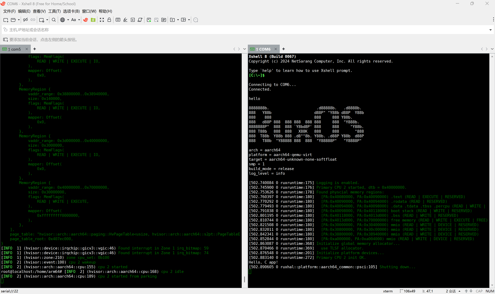

# 在NXP上使用Hvisor运行ruxos

时间：2025/5/6

作者：刘昊文

## 在NXP上运行hvisor的准备

首先找到NXP官方提供的资料，请以最新版本为准，可以参考下面的链接

https://pan.baidu.com/e/verify?surl=y6Z3heQpXgHLtguJtB0XJg 提取码：xhpt

之后参考[NXP i.MX 8 快速上手 - hvisor 手册](https://hvisor.syswonder.org/chap02/NXPIMX8.html)在nxp上启动root linux，具体

### 1. 下载厂商提供的linux源码

进入`Linux/源码/`目录下，下载`OK8MP-linux-sdk.tar.bz2.0*`3个压缩包，下载完成后，执行：

```
cd Linux/sources

# 合并分卷压缩包
cat OK8MP-linux-sdk.tar.bz2.0* > OK8MP-linux-sdk.tar.bz2

# 解压合并的压缩包
tar -xvjf OK8MP-linux-sdk.tar.bz2
```

解压后，`OK8MP-linux-kernel`目录就是linux源码目录。

### 2. linux源码编译

#### 安装交叉编译工具

1. 下载交叉编译工具链：

   ```bash
   wget https://armkeil.blob.core.windows.net/developer/Files/downloads/gnu-a/10.3-2021.07/binrel/gcc-arm-10.3-2021.07-x86_64-aarch64-none-linux-gnu.tar.xz
   ```

2. 解压工具链：

   ```bash
   tar xvf gcc-arm-10.3-2021.07-x86_64-aarch64-none-linux-gnu.tar.xz
   ```

3. 添加路径，使 `aarch64-none-linux-gnu-*` 可以直接使用，修改 `~/.bashrc` 文件：

   ```bash
   echo 'export PATH=$PWD/gcc-arm-10.3-2021.07-x86_64-aarch64-none-linux-gnu/bin:$PATH' >> ~/.bashrc
   source ~/.bashrc
   ```

#### 编译linux

1. 切换到 Linux 内核源码目录：

   ```bash
   cd OK8MP-linux-sdk/OK8MP-linux-kernel
   ```

2. 执行编译命令：

   ```makefile
   # 设置 Linux 内核配置
   make OK8MP-C_defconfig ARCH=arm64 CROSS_COMPILE=aarch64-none-linux-gnu-
   
   # 编译 Linux 内核
   make ARCH=arm64 CROSS_COMPILE=aarch64-none-linux-gnu- Image -j$(nproc)
   
   # 复制编译后的镜像到 tftp 目录
   cp arch/arm64/boot/Image ~/tftp/
   ```

这里建立一个tftp目录，方便之后对镜像整理，也方便附录中使用tftp传输镜像。

### 3. 制作sd卡

1. 将SD卡插入读卡器，并连接至主机。 wsl链接sd卡可以参考[连接 USB 设备 | Microsoft Learn](https://learn.microsoft.com/zh-cn/windows/wsl/connect-usb)

2. 切换至Linux/Images目录。

3. 执行以下命令，进行分区：

   其中，<$DRIVE>可以通过命令ls /dev/sd* 查看sd卡设备名

   ```bash
   fdisk <$DRIVE>
   d  # 删除所有分区
   n  # 创建新分区
   p  # 选择主分区
   1  # 分区编号为1
   16384  # 起始扇区
   t  # 更改分区类型
   83  # 选择Linux文件系统（ext4）
   w  # 保存并退出
   ```

4. 将启动文件写入SD卡启动盘：

   ```bash
   dd if=imx-boot_4G.bin of=<$DRIVE> bs=1K seek=32 conv=fsync
   ```

5. 格式化SD卡启动盘的第一个分区为ext4格式：

   ```bash
   mkfs.ext4 <$DRIVE>1
   ```

### 4.制作文件系统

将SD卡读卡器拔出，重新连接。制作文件系统

我们使用 ubuntu 22.04来构建根文件系统。

> **ubuntu 20.04**也可以，但是运行时会报glibc版本低的错误，可参考[ARM64-qemu-jailhouse](https://blog.syswonder.org/#/2023/20230421_ARM64-QEMU-jailhouse)评论区中的解决办法。

```bash
wget http://cdimage.ubuntu.com/ubuntu-base/releases/22.04/release/ubuntu-base-22.04.5-base-arm64.tar.gz

mkdir rootfs

# 将ubuntu.tar.gz放入已经挂载到rootfs上的ubuntu.img中
sudo mount -t ext4 <$DRIVE> rootfs/
sudo tar -xzf ubuntu-base-22.04.5-base-arm64.tar.gz -C rootfs/

# 让rootfs绑定和获取物理机的一些信息和硬件
# qemu-path为你的qemu路径
sudo cp qemu-path/build/qemu-system-aarch64 rootfs/usr/bin/
sudo cp /etc/resolv.conf rootfs/etc/resolv.conf
sudo mount -t proc /proc rootfs/proc
sudo mount -t sysfs /sys rootfs/sys
sudo mount -o bind /dev rootfs/dev
sudo mount -o bind /dev/pts rootfs/dev/pts

# 执行该指令可能会报错，请参考下面的解决办法
sudo chroot rootfs
apt-get update
apt-get install git sudo vim bash-completion \
        kmod net-tools iputils-ping resolvconf ntpdate screen
apt-get install network-manager,wget,curl
apt-get install iproute2 bridge-utils net-tools isc-dhcp-client uml-utilities
# 运行rux需要使用systemd启用串口
apt-get install systemd systemd-sysv

# 在/lib/systemd/system/getty@.service中设置
ConditionPathExists=/dev/ttymxc1
ExecStart=-/sbin/agetty -o '-p -- \\u' --keep-baud 115200,38400,9600 %I $TERM
DefaultInstance=ttymxc1

# 启动相关服务，此时应该会在/etc/systemd/system/getty.target.want下生成一个软链接，如果没有也可以手动生成
systemctl enable getty@ttymxc1.service

# 手动生成
ln -s /lib/systemd/system/getty@.service /etc/systemd/system/getty.target.want/getty@ttymxc1.service

#创建用户
adduser root
passwd root

# 以下由#圈住的内容可做可不做
###################
adduser arm64
adduser arm64 sudo
echo "kernel-5_4" >/etc/hostname
echo "127.0.0.1 localhost" >/etc/hosts
echo "127.0.0.1 kernel-5_4">>/etc/hosts
dpkg-reconfigure resolvconf
dpkg-reconfigure tzdata
###################
exit

sudo umount rootfs/proc
sudo umount rootfs/sys
sudo umount rootfs/dev/pts
sudo umount rootfs/dev
sudo umount rootfs
```

最后卸载挂载，完成根文件系统的制作。

> 执行`sudo chroot .`时，如果报错`chroot: failed to run command ‘/bin/bash’: Exec format error`，可以执行指令：
>
> ```
> sudo apt-get install qemu-user-static
> sudo update-binfmts --enable qemu-aarch64
> ```

### 4. 编译hvisor与hvsior-tool

#### 编译hvsior

下载hvisor源码

```
git clone https://github.com/syswonder/hvisor.git
```

编译hvisor

进入hvisor目录，切换到main分支或dev分支，执行编译命令：

```makefile
make ARCH=aarch64 BID=aarch64/imx8mp LOG=info all

# 将编译后的hvisor镜像放入tftp
make cp
```

1之后可以将编译后的程序放到sd卡文件系统的/home/arm64目录下

#### 编译hvisor-tool

下载hvisor-tool源码

```
git clone https://github.com/syswonder/hvisor-tool.git
```

编译hvisor-tool

进入hvisor-tool目录

```
#注意其中KDIR换成Linux SDK源码的路径
make all ARCH=arm64 LOG=LOG_WARN KDIR=/home/nxp/OK8MP-linux-sdk/OK8MP-linux-kernel
```

编译后结果会存储到hvisor-tool/output文件夹中，将其复制到sd卡文件系统的/home/arm64目录下

#### 整理配置文件

将配置文件放到该放的地方，配置文件样例可以参考[这里](https://github.com/syswonder/hvisor-tool/tree/main/examples/nxp-aarch64/gpu_on_root)。

### 5. 启动hvisor和root linux

启动NXP板子之前，需要将tftp目录下的文件放到sd卡，比如放到sd卡的/home/arm64目录下，tftp目录下的文件包括：

- Image：root linux镜像，也可以用作non root linux镜像
- linux1.dtb, zone1-ruxos.dtb：root linux和non root ruxos的设备树
- hvisor.bin：hvisor镜像
- hvisor,hvisor.ko: hvisor-tool 程序
- con_virtio_rux.json: virtio设置文件
- OK8MP-C.dtb：这个本质上不需要了，但因为历史原因仍需要。可以用linux1.dtb改个名放在这里
- zone1-ruxos.json: non root ruxos的启动信息
- <app_name>_aarch64-qemu-virt.bin: ruxos的系统镜像(在示例中是helloworld_aarch64-qemu-virt.bin，如果需要修改，则需要同时修改zone1-ruxos.json中的对应内容)

启动NXP板子：

1. 调整拨码开关以启用SD卡启动模式：(1,2,3,4) = (ON,ON,OFF,OFF)。
2. 将SD卡插入SD插槽。
3. 使用串口线将开发板与主机相连。
4. 通过终端软件打开串口

启动NXP板子后，串口应该有输出，重启开发板，立刻按下空格保持不懂，使uboot进入命令行终端，执行如下命令：

```
setenv loadaddr 0x40400000; setenv fdt_addr 0x40000000; setenv zone0_kernel_addr 0xa0400000; setenv zone0_fdt_addr 0xa0000000; ext4load mmc 1:1 ${loadaddr} /home/arm64/hvisor.bin; ext4load mmc 1:1 ${fdt_addr} /home/arm64/OK8MP-C.dtb; ext4load mmc 1:1 ${zone0_kernel_addr} /home/arm64/Image; ext4load mmc 1:1 ${zone0_fdt_addr} /home/arm64/linux1.dtb; bootm ${loadaddr} - ${fdt_addr};
```

执行后，hvisor应该就启动并自动进入root linux了。

## 在hvisor上启动ruxos

### 编译ruxos

```shell
git clone https://github.com/syswonder/ruxos.git

cd ruxos

#编译应用，这里以helloworld为例
make A=apps/c/helloworld ARCH=aarch64 LOG=info GICV3=y CONSOLE=y PLATFORM=aarch64-nxp run FEATURES=irq,virtio_console
```

在对应的目录下找到编译出来的.bin文件（在上面的例子中，为ruxos/apps/c/helloworld/helloworld_aarch64-qemu-virt.bin）将其复制到文件镜像的/home/arm64文件夹下

### 启动ruxos

进入root linux后,按照下面的命令启动ruxos

```
cd /home/arm64
insmod hvisor.ko
rm nohup.out
mkdir -p /dev/pts
mount -t devpts devpts /dev/pts
nohup ./hvisor virtio start con_virtio.json &
./hvisor zone start zone1-ruxos.json && \
cat nohup.out | grep "char device" && \
script /dev/null && \
screen /dev/pts/0
```

在执行完`screen /dev/pts/0`后，可以看到ruxos的输出


## 使用nxp的另一个串口调试ruxos

### 编译ruxos

同上，将分支切换到virtio_console,或者按照[其中的内容]([ruxos/crates/arm_pl011/src/pl011.rs at virtio_console · syswonder/ruxos](https://github.com/syswonder/ruxos/blob/virtio_console/crates/arm_pl011/src/pl011.rs))修改`crates/arm_pl011/src/pl011.rs`

```
git clone https://github.com/syswonder/ruxos.git

cd ruxos

git checkout virtio_console

#编译应用，这里以helloworld为例
make A=apps/c/helloworld ARCH=aarch64 LOG=info GICV3=y CONSOLE=y PLATFORM=aarch64-nxp run FEATURES=irq,virtio_console
```

### 启动串口

进入root linux后,启动相关串口

```
stty -F /dev/ttymxc3 115200 ixoff
```

使用主机终端连接NXP的另一个串口，步骤参考链接NXP的linux串口

在root linux下执行`echo hello > /dev/ttymxc3`，期望可以在另一个串口的终端下看到hello

### 启动ruxos

串口调试无误后，执行下面的命令，保持串口开启

```
cat /dev/ttymxc3
```

之后使用ctrl + z 挂起

启动non root rux

```
cd /home/arm64

insmod hvisor.ko

./hvisor zone start zone1-ruxos.json
```

之后就可以在另一个串口终端看到ruxos的输出

