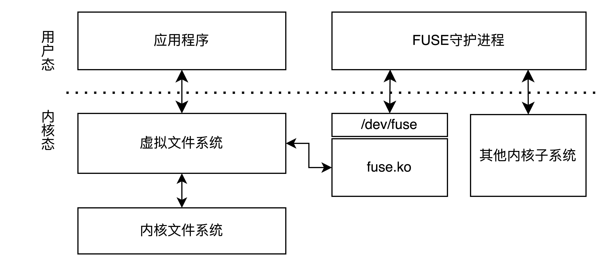
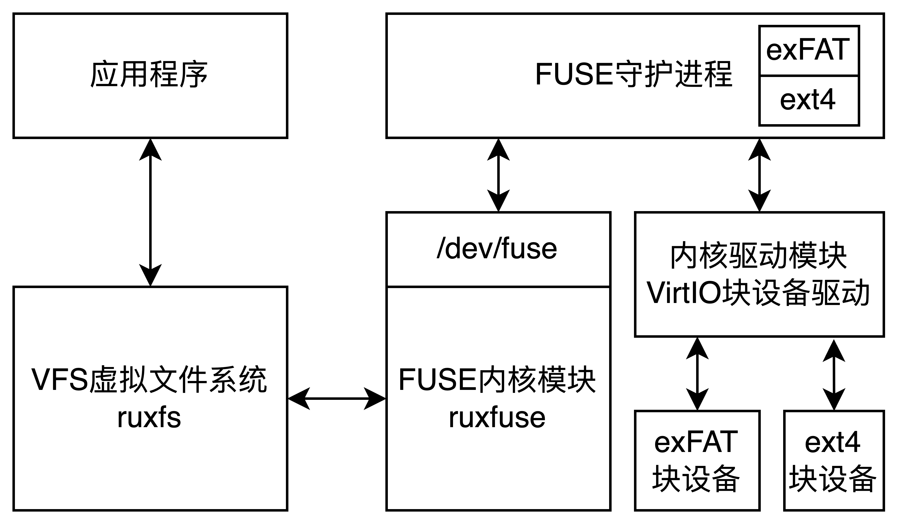

# 在RuxOS中支持FUSE用户空间文件系统

时间：2025/6/18

作者：郑元昊

联系方式：zhengyuanhao@pku.edu.cn

## 1. FUSE 简介

用户空间文件系统 FUSE（Filesystem in Userspace）是一种实现文件系统的技术框架，它允许非特权用户在用户空间中实现自定义文件系统。FUSE 包含一个内核模块和一个用户态守护进程。FUSE 内核模块在加载时被注册为虚拟文件系统（VFS）中的用户空间文件系统驱动程序，通过 /dev/fuse 块设备进行操作系统内核与用户态守护进程的通信。用户态守护进程通过/dev/fuse 设备读取 FUSE 请求，在用户空间文件系统完成操作后，再将 FUSE 响应写回该设备。

如图，在 Linux 操作系统中，FUSE 机制的实现依赖内核模块 fuse.ko 与用户空间文件系统之间的协同工作。fuse.ko 模块负责捕获 VFS 的文件操作请求，并将其封装为 FUSE 请求，发送到用户态守护进程进行处理，之后解析用户态守护进程返回的 FUSE 响应，将文件操作的处理结果返回给虚拟文件系统 VFS。



## 2.  RuxOS 中 FUSE 的整体设计

在RuxOS中，VFS 根据文件操作的路径解析结果将需要用户空间文件系统处理的请求转发到 FUSE 内核模块 ruxfuse，以 FUSE 请求的形式通过 /dev/fuse 设备发送给 FUSE 守护进程。守护进程调用内核驱动模块中的 VirtIO 块设备驱动，对 exFAT或 ext4 真实文件系统进行操作。文件操作处理完成后，FUSE 守护进程将 exFAT 或 ext4 文件系统的处理结果以FUSE 响应的形式通过/dev/fuse 设备返回给 FUSE 内核模块 ruxfuse，整体设计图如下。



要在 RuxOS 中支持 FUSE，需要支持在运行时动态挂载和卸载文件系统。目前的 VFS 中仅支持在启动时添加需要挂载的文件系统，需要补充 mount 和 umount2 系统调用，在运行时修改 VFS 中的挂载信息表。ruxfuse 模块的实现需要根据 [FUSE通信协议](https://github.com/libfuse/libfuse/blob/fuse-2.9.9/include/fuse_kernel.h)对 FUSE 各操作的输入输出格式进行规定。

在 RuxOS 中支持 FUSE 后，可以实现对 exFAT、ext4 等用户空间文件系统的支持。


## 3. 如何在 RuxOS 中运行 FUSE

运行 FUSE 需要支持动态加载与多进程机制，在 RuxOS 支持的 Busybox Shell 中运行。以 exFAT 文件系统为例，在启动时需要增加 `BLK=y`，C 应用的 features.txt 文件中需要增加 `fusefs` 特征。RuxOS 启动命令为：

```shell
make A=apps/c/busybox ARCH=aarch64 V9P=y NET=y BLK=y MUSL=y LOG=off SMP=1 run
```

其中，ruxos 目录下的 disk.img 为使用 mkfs.exfat 工具创建的 exFAT 文件系统格式块设备，或使用 mkfs.ext4 工具创建的 ext4 文件系统格式块设备。

启动 Busybox Shell 后，通过以下命令调用 mount 系统调用在 RuxOS 中挂载 exFAT 文件系统，通过 FUSE 支持常用的文件系统操作。

```shell
/bin/mount.exfat-fuse /vda1 /mnt/exfat
```

其中的 mount.exfat-fuse 二进制文件从 [exFAT 仓库](https://github.com/relan/exfat) 中下载源码并编译后得到，/vda1 为通过 VirtIO-blk 读写块设备的接口。

卸载 FUSE 文件系统时，通过下面的命令调用 umount2 系统调用

```shell
busybox umount /mnt/exfat
```

## 4. RuxOS 中 FUSE 的实现细节

在 RuxOS 中支持 FUSE 需要补充 musl libc 中缺少的系统调用，对 ruxmusl 模块与 POSIX 兼容层进行修改。需要修改 ruxfs 模块中的文件系统挂载信息表和 devfs 文件系统，添加 FUSE 内核 ruxfuse 模块和虚拟设备 ruxvda 模块。


### 4.1 FUSE 请求

FUSE 请求分为 FUSE 请求头和 FUSE 请求体两部分组成。

FuseInHeader 中，len 字段为整个 FUSE 请求的长度，操作码 opcode 为该 FUSE 操作在通信协议中规定的序号，唯一标识码 unique 采用偶数编号空间，初始值为 2，后续每次新增标识码的偏移量也为 2。
目标节点的 inode 编号 nodeid 由 FUSE 内核根据路径解析后使用 FuseLookup 操作在用户空间文件系统中进行查询得到（初始时默认为 0），用户编号 uid、用户组编号 gid、进程编号 pid 分别通过系统调用 sys_getuid、sys_getgid、sys_getpid 获取。

```rust
pub struct FuseInHeader { // 40 bytes
    len: u32,     // length of the request
    opcode: u32,  // FUSE opcode, eg. FUSE_GETATTR = 3
    unique: u64,  // unique request ID
    nodeid: u64,  // inode number
    uid: u32,     // user ID
    gid: u32,     // group ID
    pid: u32,     // process ID
    padding: u32, // padding
}
```


常用的 FUSE 请求体包括：FuseInHeader, FuseInitIn, FuseGetattrIn, FuseOpenIn, FuseReadIn, FuseWriteIn, FuseSetattrIn, FuseCreateIn, FuseReleaseIn, FuseFlushIn, FuseForgetIn, FuseForgetOne, FuseBatchForgetIn, FuseMknodIn, FuseMkdirIn, FuseRenameIn, FuseRename2In, FuseLinkIn, FuseSetxattrIn, FuseGetxattrIn, FuseAccessIn, FuseFsyncIn, FuseLseekIn

### 4.2 FUSE 响应

FUSE 响应分为 FUSE 响应头和 FUSE 响应体两部分组成。

FuseOutHeader 中，len 字段为 FUSE 响应总长度，若 FUSE 请求对应的文件系统操作合法且正常完成，则 FUSE 响应中的错误码 error 字段的值为 0，否则，错误码取值为POSIX 标准错误码的相反数，例如出现 EIO 错误时，错误码字段为-5。FUSE 响应的标识码 unique 与对应 FUSE 请求的标识码 unique 的值相同。

```rust
pub struct FuseOutHeader { // 16 bytes
    len: u32,     // length of the response
    error: i32,   // error code
    unique: u64,  // unique request ID
}
```

常用的 FUSE 响应体包括：FuseOutHeader, FuseInitOut, FuseAttr, FuseAttrOut, FuseEntryOut, FuseOpenOut, FuseWriteOut, FuseKstatfs, FuseStatfsOut, FuseGetxattrOut, FuseLseekOut, FuseDirent

### 4.3 FUSE 操作的操作码、请求长度、响应长度

根据 FUSE 通信协议，FUSE 操作名称与操作码，以及 FUSE 请求和响应包含的结构体及其长度规定如下（单位为字节）


| 操作名称（操作码）   | 操作含义         | FUSE 请求长度             | FUSE 响应长度                  |
| ------------------- | ------------------------ | ----------------------------- | ----------------------------- |
| FuseInit (26)       | 文件系统初始化             | 104                    | 80 (16+64initout)         |
| FuseLookup (1)      |  查找文件或目录   | 40+len+1                 | 144 (16+128entryout)          |
| FuseGetattr (3)    | 获取属性信息  | 56 (40+16getattrin)  | 120 (16+104attrout)       |
| FuseOpendir (27)    |  打开目录  | 48 (40+8openin)      | 32 (16+16)                |
| FuseReaddir (28)    |  读取目录  | 80 (40+40readin)     | 16+n*dirent                   |
| FuseReleasedir (29) |  关闭目录 | 64 (40+24releasein)  | 16                            |
| FuseOpen (14)       |  打开文件  | 48 (40+8openin)      | 32 (16+16)                |
| FuseRead (15)       |  读取文件  | 80 (40+40readin)    | 16+outlen                     |
| FuseRelease (18)    |  关闭文件  | 64 (40+24releasein)      | 16                            |
| FuseDestroy (38)    |  断开文件系统连接   | 40                       | 16                            |
| FuseMkdir (9)       |  创建目录  | 48+len+1                 | 144 (16+128entryout)          |
| FuseRmdir (11)      |  删除目录  | 40+len+1                 | 16                            |
| FuseCreate (35)     |  创建文件  | 56+filename_len+1        | 160 (16+128entryout+16openout) |
| FuseWrite (16)      |  写入文件  | 40+40writein+write_len+1 | 24(16+8writeout)              |
| FuseUnlink (10)     |  删除文件  | 40+len+1                 | 16                            |
| FuseRename (12) |  重命名  | 40+8·+len1+len2+2        | 16                            |
| FuseRename2 (45) |  重命名   | 40+16+len1+len2+2        | 16                            |
| FuseMknod (8) |    创建特殊文件   | 40+16+len+1              | 144 (16+128entryout)          |
| FuseSymlink(6) |   创建软链接   | 40+len1+len2+2           | 144 (16+128entryout)          |
| FuseLink (13) |    创建硬链接     | 40+8+len                 | 144 (16+128entryout)          |
| FuseReadlink (5) |   读取链接    | 40                       | 16+name_len                   |
| FuseSetattr (4)     |   设置属性   | 128 (40+88setattrin)     | 120 (16+104attrout)           |
| FuseStatfs (17) |  获取文件系统信息   | 40                       | 96 (16+80statfsout)    |
| FuseFlush (25) | 刷新缓存区 | 64 (40+24flushin) |                               |
| FuseAccess (34) |   检查访问权限   | 48 (40+8accessin)        | 16                            |
| FuseForget (2) |   释放inode资源  | 48 (40+8forgetin)        | 无回复 |
| FuseReaddirplus (44) | 读取目录条目 | 80 (40+40readin) | 16+n*entryout+64 |

若 FUSE 操作失败，则 FUSE 响应的长度为 16 字节。


### 4.4 FUSE 操作的流程——以 FuseInit 为例


FuseInit 操作是 RuxOS 操作系统 FUSE 内核模块与 FUSE 文件系统之间建立通信的第一个 FUSE 操作，双方通过该操作协商 FUSE 通信协议的版本。

FUSE 内核模块与 FUSE 文件系统会分别在 FuseInit 请求和 FuseInit响应中发送各自支持的 FUSE 通信协议版本号。协商规则如下：若两者的主版本号匹配，则双方使用两者次版本号中较小的版本进行通信。若内核支持的主版本号更高，用户空间文件系统会在 FUSE 响应中回复自身支持的主版本号，并忽略当前 FuseInit 请求的其余部分，等待内核重新发送匹配该主版本号的新 FuseInit 请求。若用户空间文件系统支持的主版本号更高，则用户空间文件系统会回退到内核发送的主版本号版本，并在回复内核的 FuseInit 响应中包含该主版本号和任意一个支持的次版本号，双方按最后协商一致的 FUSE 通信协议版本进行通信。

FuseInit 请求包括请求头 FuseInHeader 和请求体 FuseInitIn，FuseInit 响应包括响应头 FuseOutHeader 和响应体 FuseInitOut

```rust
pub struct FuseInitIn { // 64 bytes
		major: u32, 	// major version
		minor: u32,		// minor version
    max_readahead: u32,
    flags: u32,
    flags2: u32,
    unused: [u32; 11],
}
```


```rust
pub struct FuseInitOut { // 64 bytes
	major: u32,			// major version
	minor: u32,			// minor version
	max_readahead: u32,
	flags: u32,
	max_background: u16,
	congestion_threshold: u16,
	max_write: u32,
	time_gran: u32,
	max_pages: u16,
	map_alignment: u16,
	flags2: u32,
	unused: [u32; 7],
}
```

以 FuseInit 为例，FUSE 操作流程如下：

```rust
FuseInit():
    fill_fuse_in_header(len, opcode, unique, nodeid, uid, gid, pid) // 填充 FuseInit 请求头
    fill_fuse_init_in(major, minor, ... ) // 填充 FuseInit 请求体
    strcpy(FUSE_VEC, FUSE_REQ) // 将 FUSE 请求写入共享内存
    V(FUSE_FLAG) // 通知 FUSE 守护进程
    P(FUSE_FLAG) // 等待 FUSE 响应写回
    strcpy(FUSE_RES, FUSE_VEC) // 从共享内存中获取FUSE 响应
    parse_fuse_out_header(FUSE_RES) // 解析 FuseInit 响应头
    parse_fuse_init_out(FUSE_RES) // 解析 FuseInit 响应体
    if (fuse_out_header.error != 0):
    return fuse_out_header.error // 返回 FUSE 错误码
    modify_version(fuse_init_out) // 协商 FUSE 通信协议版本
    restore(fuse_init_out) // 维护 FuseInitOut 参数
    return
```

