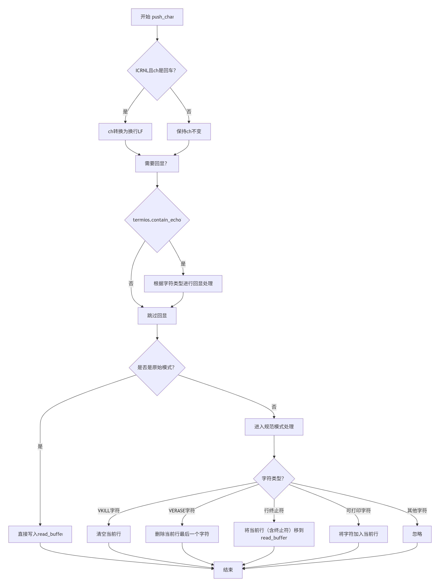
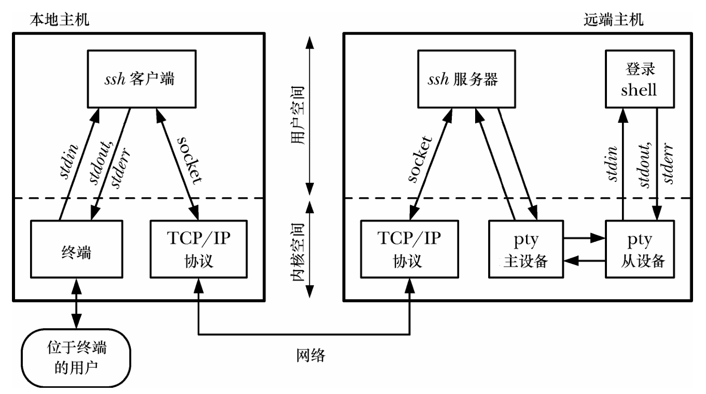
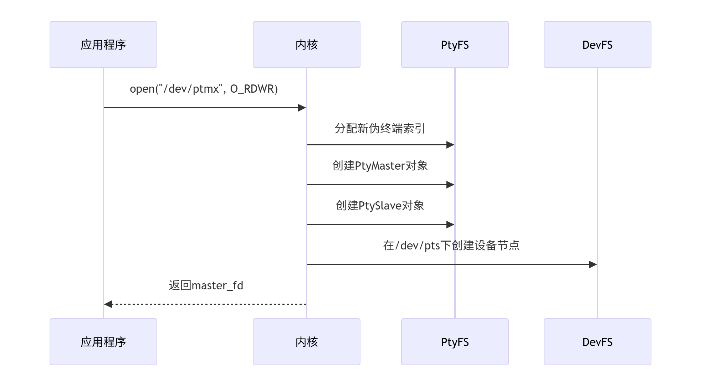

# RuxOS伪终端的实现与其在sshd上的应用

时间：2025/6/20

作者：石全

## 伪终端原理

终端设备的基本原理：


伪终端与终端的区别，即为什么叫“伪”终端？

伪终端的“伪”体现在：

- 没有物理显示设备（通过虚拟屏幕缓冲区）
- 没有物理键盘（输入来自其他程序）
- 通过纯软件模拟真实终端的全部行为

### 行规程

行规程是终端系统中的一个核心组件，相当于键盘输入和应用程序之间的"翻译官"。其主要功能为：

1. **输入预处理**：处理特殊控制字符（如退格键、删除键、Ctrl+C中断等）
2. **行缓冲**：在标准模式下实现命令行编辑（允许用户编辑整行后再提交）
3. **字符转换**：如将回车(CR)转换为换行(LF)
4. **回显控制**：决定是否将用户输入的字符显示到终端
5. **模式切换**：支持原始模式（直接传递字节）和规范模式（行编辑模式）

#### 规范模式

规范模式（Canonical Mode）的本质为行缓冲编辑模式（类似文本编辑器的输入方式）

1. **行缓冲**
   - 用户输入不会立即送给程序，而是暂存在行缓冲区
   - 只有按下**回车键**（或其他行终止符）才会提交整行
   - 典型场景：Bash shell 命令行输入
2. **行编辑**
   - 支持退格删除（Backspace）
   - 支持整行删除（Ctrl+U）
   - 支持单词删除（Ctrl+W，需开启IEXTEN）
3. **特殊字符处理**
   - 回车自动转成换行（ICRNL）
   - Ctrl+D 在行首表示EOF，行中作为普通字符
   - 信号字符生效（如Ctrl+C发送SIGINT）

**工作流程**：
键盘输入 → 行缓冲区积累 → 编辑修改 → 回车提交 → 程序读取

#### 非规范模式

非规范模式 （Non-Canonical Mode）本质为原始字节流模式（类似十六进制编辑器）

1. **即时传输**
   - 每个按键立即送达程序，无需等待回车
   - 典型场景：vim/less 等需要实时响应的程序
2. **无编辑功能**
   - 退格键不再删除字符，而是直接发送`0x08`字节
   - 所有控制字符失去特殊含义（如Ctrl+C变成普通字节）
3. **精细控制**
   - 通过**VMIN**（最小读取字节数）和**VTIME**（超时时间）控制读取行为


在RuxOS中，行规程为如下结构体：

```rust
pub struct Ldisc {
    current_line: SpinNoIrq<RingBuffer>,   // 实时编辑中的行
    read_buffer: SpinNoIrq<RingBuffer>,    // 已完成的输入行
    termios: SpinNoIrq<Termios>,           // 终端行为配置
    winsize: SpinNoIrq<WinSize>,           // 终端尺寸
}
```

采用双缓冲区的设计，`current_line`表示正在编辑的中间结果，`read_buffer`为完成的行（按回车后转到这里）



### 伪终端

伪终端(PTY)的核心是**两个互联的双向数据通道**，构成主从设备间的完整通信路径

```
+------------+      (通道A)      +------------+
|            | <---------------- |            |
|  PTY Master|                   |  PTY Slave |
|            | ----------------> |            |
+------------+      (通道B)      +------------+
```

**从设备→主设备通道**(通道A)：

- 传输应用程序输出
- 支持原始数据传递

**主设备→从设备通道**(通道B)：

- 处理用户输入（键盘操作）
- 应用终端行规程处理（回显、行编辑）
- 终端特性控制（如Ctrl+C信号）

RuxOS使用环形缓冲区实现通信通道：

```rust
pub struct PtyMaster {
    // ...
    input: SpinNoIrq<RingBuffer>, // 从设备→主设备
    output: Arc<Ldisc>,           // 主设备→从设备(包含复杂处理)
}
```

#### 从ssh应用程序的角度看伪终端



SSH会话是伪终端的经典应用案例，下面是精简版的SSH服务器工作流程

1. **会话初始化**：

   ```c
   int master_fd = open("/dev/ptmx", O_RDWR);
   grantpt(master_fd);    // 设置权限
   unlockpt(master_fd);   // 解锁从设备
   ```

2. **获取从设备**：

   ```c
   char *slave_name = ptsname(master_fd); // 如"/dev/pts/2"
   int slave_fd = open(slave_name, O_RDWR);
   ```

3. **创建Shell进程**：

   ```c
   pid_t pid = fork();
   if (pid == 0) {
       close(master_fd); // 子进程关闭主设备
       
       setsid(); // 新建会话
       ioctl(slave_fd, TIOCSCTTY, 0); // 设置控制终端
       
       // 重定向标准流
       dup2(slave_fd, STDIN_FILENO);
       dup2(slave_fd, STDOUT_FILENO);
       dup2(slave_fd, STDERR_FILENO);
       
       execlp("bash", "bash", NULL); // 启动Shell
   }
   ```

4. **数据转发循环**：

   ```c
   while (true) {
       // 从客户端接收数据 → 写入主设备
       bytes = recv(ssh_socket, buf, sizeof(buf), 0);
       write(master_fd, buf, bytes);
       
       // 从主设备读取数据 → 发送到客户端
       bytes = read(master_fd, buf, sizeof(buf));
       send(ssh_socket, buf, bytes, 0);
   }
   ```

SSH会话中的数据流：

1. 用户输入的数据流：客户端键盘 → SSH客户端加密 → 网络 → SSH服务器解密 → 主设备写入 → 行规程处理 → 从设备读取 → Shell进程
2. 命令输出数据流：Shell输出 → 从设备写入 → 主设备读取 → SSH服务器加密 → 网络 → SSH客户端解密 → 终端显示

### 伪终端文件系统



#### /dev/ptmx：伪终端主设备入口

`/dev/ptmx`是一个特殊的字符设备文件，当调用`open("/dev/ptmx", O_RDWR)`时，会创建新的伪终端对，返回主设备文件描述符，自动分配从设备编号。

内部实现：

```rust
impl VfsNodeOps for Ptmx {
    fn open(&self) -> VfsResult<Option<VfsNodeRef>> {
        let ptsfs: Arc<PtsFileSystem> = self.ptsfs.upgrade().unwrap();
        Ok(Some(ptsfs.allocate_pty())) // 创建新PTY
    }
}
```

#### /dev/pts/[N]：伪终端从设备

每个`/dev/pts/[N]`对应一个具体的伪终端从设备：

- **动态创建**：随PTY对的创建而生成
- **唯一标识**：每个会话拥有唯一的N
- **权限控制**：通常为读写权限(0620)

#### 伪终端特殊控制

可以通过ioctl控制伪终端主从设备

|     命令     |       功能描述       |
| :----------: | :------------------: |
|  `TIOCGPTN`  |   获取从设备索引号   |
| `TIOCSPTLCK` | 设置主从设备锁定状态 |
| `TIOCSCTTY`  |     设置控制终端     |
| `TIOCGPGRP`  |   获取前台进程组ID   |
| `TIOCSPGRP`  |   设置前台进程组ID   |


目前RuxOS上选择的ssh登录终端为Busybox。BusyBox 自身并不直接“是”一个 Shell。它更像是一个功能强大的容器或工具箱。BusyBox 这个单一的二进制程序内部，编译打包了上百个工具的简化实现（称为 `applets`）——这其中就包含了一个或多个 Shell 的实现。 最常见的是 `ash`（一个兼容良好、广泛使用的 Shell，常被符号链接为 `sh`），以及更轻量的 `hush`。

要让 BusyBox 启动内置的 Shell，需要明确告诉它想运行哪个 Shell `applet`。输入 `busybox sh` 或 `busybox ash`，BusyBox 检测到 `sh` 或 `ash` 参数后，就会启动对应的 Shell 功能。

在安装了 BusyBox 的系统中，通常会看到 `/bin/sh`、`/bin/ls` 等命令，它们实际上是指向 `/bin/busybox` 的符号链接。当运行 `/bin/sh` 时，系统找到符号链接 `/bin/sh`，它指向 `/bin/busybox`。内核执行 `/bin/busybox`，但会把调用的名字 `sh` 作为第一个参数传递给它。BusyBox 看到自己是被作为 `sh` 调用的（即使通过链接），就会启动其内置的 `ash` Shell，这就和使用一个独立的 `sh` 程序体验完全相同。