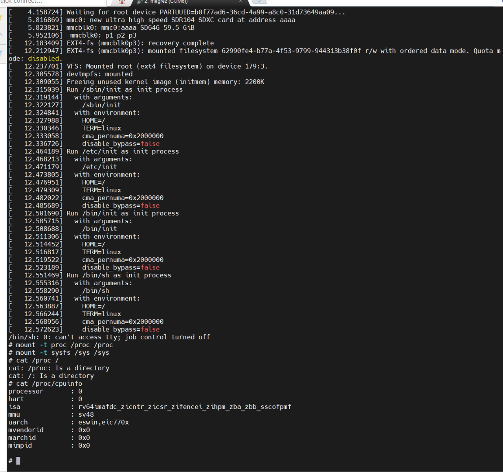
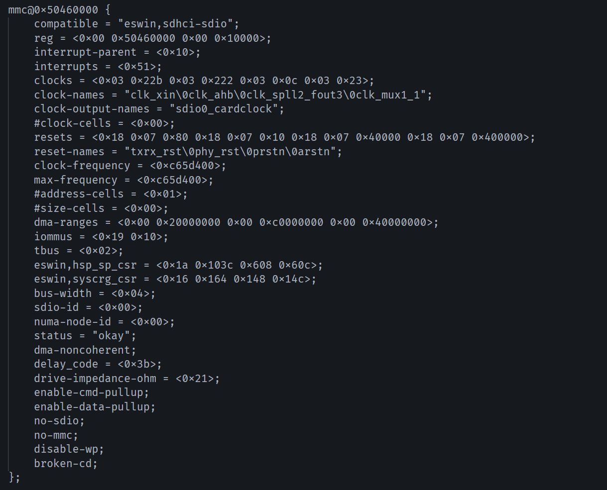
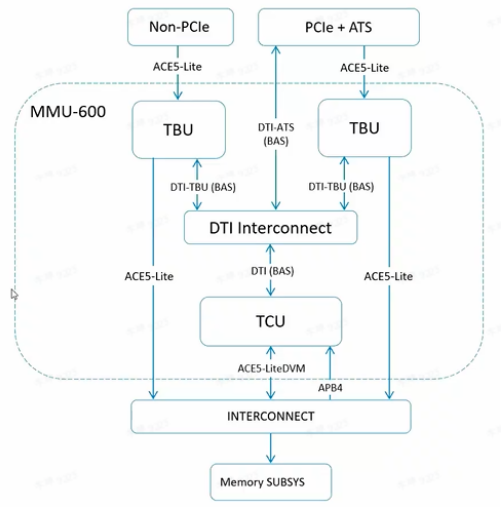
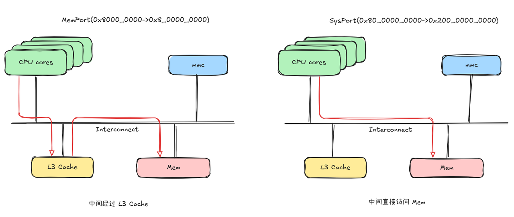
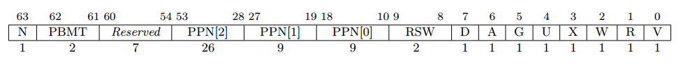

# Hvisor 在 Megrez 上的适配(zone0 启动)

时间：2025/7/10

作者：刘景宇

联系方式：liujingyu24s@ict.ac.cn

## 一、Megrez 介绍
Milk-V Megrez 是一款由 ESWIN EIC7700X 驱动的 Mini-ITX 设备, 内置四核 SiFive P550 CPU, 专为 RISC-V 原生开发精心打造, 支持 RISC-V RV64GBCH.
> Megrez 上的 H 扩展为 0.6 版本。

## 二、最小设备树的构建
Megrez 包含的设备众多, 使得设备树十分复杂.
为了便于在 Hvisor 上移植, 需要构建 Megrez 的最小设备树 (外设至少包含串口+块设备).
### 1、准备工作
Windows 上准备tftpd64工具, 作为tftp的server端, 向Megrez传输镜像文件等.
用网线连接Windows主机网口及Megrez主板的网口, 手动配置Win主机网口的局域网IP为192.168.137.10, 掩码255.255.255.0, 并在tftpd64中配置server端的目录.

使用调试烧录线(两端分别为 type-C、type-A), 或者准备USB转TTL串口线连接主板上的Uart0针脚, 并在MobaXterm等工具中建立 Serial Session, 配置波特率为 115200.
### 2、准备镜像文件
在上述的tftpd64使用的server端文件夹中放置后续需要传输到开发板上的文件, 包括编译好的 dtb, uImage, 之后的 hvisor.bin 同理.
```
mkimage -A riscv -O linux -T kernel -C none -a 0x90000000 -e 0x90000000 -n "Linux Kernel" -d arch/riscv/boot/Image uImage 
```
由于 U-boot 使用 bootm 启动时需要镜像为 u-boot 的格式, 这里将 Image 转成 uImage. 当启动 hvisor 时, 则将 hvisor.bin 转成 u-boot 相关格式, 而 Linux Image 使用二进制 Image 即可.

Megrez 启动后进入 OpenSBI, 随后进入 S-mode U-Boot, 这时手动按键, 取消其自动启动, 依次键入如下的u-boot命令:
```
setenv serverip 192.168.137.10;
setenv ipaddr 192.168.137.11;
setenv netmask 255.255.255.0;
setenv fdt_addr 0x8f000000;
setenv ker_addr 0x90000000;
tftpboot ${fdt_addr} ${serverip}:minimal.dtb;
tftpboot ${ker_addr} ${serverip}:uImage;
bootm ${ker_addr} - ${fdt_addr};
```
### 3、自动化手段
> 由于寻找最小设备树等需要多次尝试, 可以将以上命令打包成 boot.scr, 由u-boot 自动执行, u-boot 会寻找 mmc 的第一个 FAT 的分区, 从中找到 boot.scr 后自动执行.
将 boot.txt (包含上述 uboot 命令), 转换成 boot.scr
```
mkimage -A riscv -T script -C none -n "Boot Script" -d boot.txt boot.scr
```
参考 https://hvisor.syswonder.org/chap02/NXPIMX8.html, 对SD-card 进行分区. 可以使用 fdisk 命令, 但对于 Megrez, 建议使用 gdisk 进行 GPT 分区表的分区. 

mmc 分两个区, 将第一个分区类型改为 FAT32 格式分区, 随后格式化, 并将 boot.scr 放置到 FAT32 对应的分区. 将第二个分区改成 ext4 格式分区, 其中放置准备好的 Linux/zone0 使用的 rootfs.

### 4、得到最小设备树
为了得到最简设备树, 需要删除当前用不到的外设等, 包括eth、NPU、pinctrl、sata、dsp、spi、i2c、dsp、fan_control 等等.

最终可知, 最小设备树应该包含 cpu、memory、cache-controller、interrupt-controller、serial、sys-crg、hsp_sp_top_csr、mmc.

其中 mmc 包含 smmu 相关属性, 需要删除.

完整的最小设备树参考 https://github.com/liulog/hvisor/tree/megrez/platform/riscv64/megrez/image/dts.

自此, 可以依据此设备树去启动 zone0.

## 三、启动 hvisor 及 zone0
准备配置文件, board.rs 中为 root zone 配置 MMIO 映射, 包含 memory、serial、mmc、cache-controller, 并配置中断号, 包含 serial、mmc、cache-controller 用到的中断.

具体的 board.rs 可以参考 https://github.com/liulog/hvisor/blob/megrez/platform/riscv64/megrez/board.rs.


由于 Megrez 使用的 EIC770X SoC, 其 H 扩展为 0.6, 参照 KVM 代码, 可知其不存在 henvcfg 寄存器, 所以编译时请打开 hvior 的 eic770x_soc 扩展. 

将 hvisor.bin 使用 mkimage 得到 u-boot 可识别的二进制文件(这一过程已在 hvisor 中自动化, 无需手动操作), 将其拷贝到前文提到的 tftp 用的 server 端文件夹中.

将使用的 uboot 命令替换成如下:
```
setenv serverip 192.168.137.10;
setenv ipaddr 192.168.137.11;
setenv netmask 255.255.255.0;
setenv hvisor_addr 0x80200000;
setenv zone0_fdt_addr 0x8f000000;
setenv zone0_kernel_addr 0x90000000;
tftpboot ${hvisor_addr} ${serverip}:hvisor.bin;
tftpboot ${zone0_fdt_addr} ${serverip}:zone0.dtb;
tftpboot ${zone0_kernel_addr} ${serverip}:Image;
bootm ${hvisor_addr} - ${fdt_addr};
```
可以在终端中得到:


## 四、其他问题说明
Megrez不同于qemu, 出现了一些比较典型的错误, 在此说明:

### 1、iommu 相关
eic770x-soc中集成了arm的smmu-v3, 在hvisor中并不希望zone看到smmu相关信息, 所以需要将 iommu 相关内容去掉, 需要将其中的 iommu 以及 tbus 属性删除.



tbu为smmu的硬件组成部分, smmu的硬件结构大致如下:



### 2、memport 以及 sysport
在 hvisor 启动 zone0 过程中, 发现 zone0 访问了一个超大的地址, 例如 0xc003bb4000, 这个地址并不在设备树中出现, 即这个地址是和源码相关的, 遂在rockos-kernel的源码中查证.

以下是个人得到的结论:


块设备会使用DMA等, 需要在内存中分配DMA缓冲区, Megrez上的mmc是dma-noncoherent, 在建立DMA缓冲区时, 配置页表的属性为 NOCACHE(页表中自定义位), 这位的作用是, 映射是将地址增加一个偏移, 由 mem-port 转移到 sys-port, 因此访问了一个超大的地址, 需要在 zone 的映射区域中为其添加映射.

RISC-V中的页表项结构如下：


其中 N 位需要实现 Svnapot 扩展.
PBMT 需要实现 Svpbmt 扩展.

rockos_kernel 中定义了 _PAGE_UNCACHE, 这不在 RISCV Spec 中定义, 遂针对源码得到以上结论.


以下为个人在linux源码中找到的相关证据：

```c
// arch/riscv/include/asm/patable-bits.h
#define _PAGE_ACCESSED_OFFSET 6

#define _PAGE_PRESENT   (1 << 0)
#define _PAGE_READ      (1 << 1)    /* Readable */
#define _PAGE_WRITE     (1 << 2)    /* Writable */
#define _PAGE_EXEC      (1 << 3)    /* Executable */
#define _PAGE_USER      (1 << 4)    /* User */
#define _PAGE_GLOBAL    (1 << 5)    /* Global */
#define _PAGE_ACCESSED  (1 << 6)    /* Set by hardware on any access */
#define _PAGE_DIRTY     (1 << 7)    /* Set by hardware on any write */
#define _PAGE_SOFT      (1 << 8)    /* Reserved for software */

// EIC770X 自定义的部分 
#if IS_ENABLED(CONFIG_ARCH_ESWIN_EIC770X_SOC_FAMILY)
#define _PAGE_UNCACHE   (1 << 9)    /* Map to system port .i.e, uncached*/
/* Map to system port llc .i.e, through sys port llc space */
#define _PAGE_LLC       (1 << 12)
#endif
```

```c
// arch/riscv/include/asm/patable.h

// 构建页表项 Page Table Entry
============================================================================
/* Constructs a page table entry */
static inline pte_t pfn_pte(unsigned long pfn, pgprot_t prot)
{
        unsigned long prot_val = pgprot_val(prot);
        ALT_THEAD_PMA(prot_val);
        return __pte((pfn << _PAGE_PFN_SHIFT) | prot_val);
}

============================================================================
/* Constructs a page table entry */
static inline pte_t pfn_pte(unsigned long pfn, pgprot_t prot)
{
    unsigned long pfn_new;
    // 处理 uncache 区域, 把原来的 pfn 从 "内存端口" 转换成 "系统端口" 的 pfn                  【添加测试看一下】
    if (unlikely(_PAGE_UNCACHE == (pgprot_val(prot) & _PAGE_UNCACHE))) {
        pfn_new = convert_pfn_from_mem_to_sys_port(pfn);
        pr_debug("pfn_pte:pfn_mport 0x%lx to pfn_sysport 0x%lx\n", pfn, pfn_new);
        return __pte((pfn_new << _PAGE_PFN_SHIFT) | pgprot_val(prot));
    }
    // 处理带 LLC 的内存页
    else if (unlikely(_PAGE_LLC == (pgprot_val(prot) & _PAGE_LLC))) {
        pfn_new = convert_pfn_from_mem_to_sys_port_llc(pfn);
        pr_debug("pfn_pte:pfn_mport 0x%lx to pfn_llc 0x%lx\n", pfn, pfn_new);
        return __pte((pfn_new << _PAGE_PFN_SHIFT) | (pgprot_val(prot) & ~_PAGE_LLC));
    }
    // 默认情况下正常页表
    return __pte((pfn << _PAGE_PFN_SHIFT) | pgprot_val(prot));
}
```

```c
// arch/riscv/include/asm/pgtable.h

CONFIG_RISCV_DIE0_UNCACHED_OFFSET=0xc0_0000_0000
CONFIG_RISCV_DIE0_CACHED_OFFSET=0x8000_0000
CONFIG_RISCV_DIE0_MEM_MAX_SIZE=0x8_0000_0000        # 32G

/* DIE0 */
#define DIE0_MEM_PORT_PFN_START             (0x8000_0000 >> 12)
#define DIE0_MEM_PORT_PFN_END               ((0x8000_0000 + 0x8_0000_0000) >> 12)
#define DIE0_SYS_PORT_PFN_START             (0xc0_0000_0000 >> 12)

#define _MEM_PORT_D0_ADDR_RANGE_BITMASK     0xFFFFFFFF80000

// 将 MEM 转换为 SYS PORT                    (0xc0_0000_0000 >> 12) + a - (0x8000_0000 >> 12)
#define DIE0_MEM_TO_SYS_PFN_ADDRESS(a)      (DIE0_SYS_PORT_PFN_START + ((u64)(a) - DIE0_MEM_PORT_PFN_START))

/* pha conversion between mem port and sys port or sysllc_port */
// 将内存端口的 PPN 转换为系统端口的 PPN
static inline unsigned long convert_pfn_from_mem_to_sys_port(unsigned long pfn)    // _PAGE_UNCACHE 时才会调用到这里
{
    // 传入的 pfn 经过掩码处理后，是否处于 DIE0 内存端口的页帧号起始和结束范围之间
    // (0x8000_0000 >> 12) =< pfn&0xFFFFFFFF80000 <= ((0x8000_0000 + 0x8_0000_0000) >> 12)
    if (((pfn & _MEM_PORT_D0_ADDR_RANGE_BITMASK) >= DIE0_MEM_PORT_PFN_START) && ((pfn & _MEM_PORT_D0_ADDR_RANGE_BITMASK) <= DIE0_MEM_PORT_PFN_END)) {
        // 如果是，则调用宏或函数 DIE0_MEM_TO_SYS_PFN_ADDRESS，将该 pfn 转换为系统端口对应的 pfn
        return DIE0_MEM_TO_SYS_PFN_ADDRESS(pfn);
    }
    ...
    // 以上条件都不满足，则默认返回 pfn
    else
        return pfn;
}
```