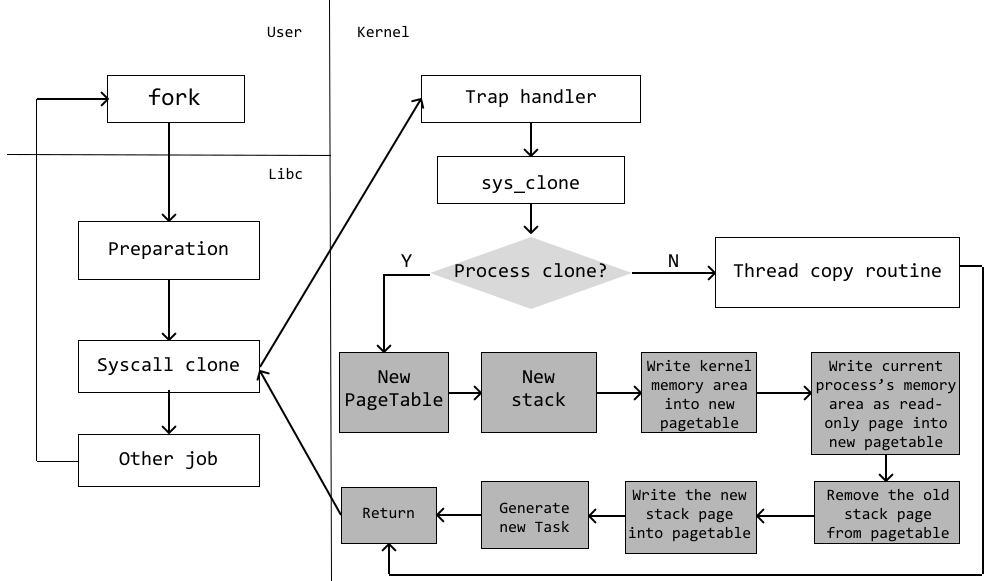

# 在Riscv-Ruxos中完善缺页中断与进程级fork功能

时间：2025/7/17

作者：曾俊

## 缺页中断实现

在AArch64架构下，缺页中断的架构无关逻辑已经基本实现。所以如果需要实现Riscv64架构下的缺页中断处理，只需要处理两件事情：

- 接入现有的缺页中断处理程序
- 变更mmap逻辑，以便触发缺页中断

### 接入现有缺页中断处理程序

现有的缺页中断处理程序其函数接口如下所示：

```Rust
fn handle_page_fault(vaddr: usize, cause: PageFaultCause) -> bool  
```

其中vaddr为触发pagefault的地址，cause是触发pagefault的原因。

经阅读Riscv优先级手册可知：

> When a ... page-fault exception occurs, ... **stval** is written with the faulting address
> When a trap is taken into S-mode, **scause** is written with a code indicating the event that caused the trap
> —— The RISC-V Instruction Set Manual Volume II(Section 4.1.10 and Section 4.1.11)

故通过在Riscv架构下处理缺页中断的入口处读取riscv的stval和scause寄存器，便可以解析出中断处理函数的vaddr和cause参数

### 修改mmap逻辑

在Riscv代码使用的legacy版本的mmap中，来自用户的mmap请求会直接将所请求的内存映射入线性映射区。由于线性映射区在页表中已经进行映射，故对这些区域访问不会触发pagefault。

为了实现Pagefault的功能，需要将Riscv的mmap更换成AArch64架构下所使用的mmap代码。这只需修改相关的cfg代码即可，无需添加额外的逻辑。

### 其他问题

在完成上述工作后，运行程序会出现pagefault刷屏导致系统卡住的bug。经调试发现，是由于系统采用的Sv39翻译策略仅支持39位的虚拟地址，其要求Bits[63,39]和Bits[38]完全相等，而当前Riscv的配置文件对于mmap的分配起始地址设置为：

```
mmap-start-vaddr = "0xffff_8000_0000_0000"
mmap-end-vaddr = "0xffff_f000_0000_0000"
```

这会违背Sv39翻译策略而导致pagefault。经修改成合理的地址后就可以正常工作了。

## fork功能

在AArch64架构下，fork process的功能已经实现，要使得Riscv架构支持fork process功能，需要处理的事项如下：

- 完善进程所需的功能支持，特别是进程结构复制与页表切换功能
- 在sys_clone系统调用中增加支持process fork的代码

### 完善进程所需功能支持

#### 进程结构复制

为了生成一个新的进程，fork需要复制父进程的栈信息以及提供一个新页表。其工作流程如下图所示：

 

其中将内核内存映射写入页表等逻辑已经由现有的fork逻辑完成，这里唯一需要完成的任务有两件

- 将当前的栈信息写入新的栈中
- 将当前的寄存器信息保存至新进程的TaskContext中

这两个逻辑需要使用Riscv汇编代码进行实现，详细的代码路径为：`modules/ruxhal/src/arch/riscv/context.rs`

#### 页表切换

在Riscv架构下，与页表紧密相关的寄存器是satp寄存器，其结构如下图所示：

 

其中MODE字段用于选择地址翻译策略，常见的有Bare，Sv39等；ASID表示地址空间ID,用于优化性能，Ruxos暂时没有使用该功能；PPN页表物理页号，该字段直接决定系统从何处读取页表，将页表物理页号填入该字段就可以实现页表的装载。

在上下文切换时，通过将MODE字段设置为Sv39,ASID字段设置为0,PPN字段设置为即将运行进程的页表物理页号，就可以实现对新进程的页表装载。

## 在sys_clone中增加process fork的代码

sys_clone系统调用会依照参数要求复制一个任务（task），在Linux的设计中，task完成了对进程和线程抽象的实现，故sys_clone系统调用可以生成一个线程，也可以生成一个进程。

由于之前Riscv架构下不支持进程，故其sys_clone系统调用不能处理生成进程的请求。这里只需要添加相应的逻辑，即可完成process fork功能的加入。详细逻辑见 `api/ruxos_posix_api/src/imp/pthread/mod/rs:sys_clone`

## 动态加载程序实现

为对fork process以及缺页中断等功能进行测试，可采用musl动态加载程序的方法对其进行测试；下面是实现动态加载功能出现的一些问题：

- current变量无效：因musl-libc初始化导致gp指针被覆盖问题
- 文件无法访问：因riscv使用x86的stat结构体导致成员错位问题
- 多进程睡眠无法wakeup：因陷入中断后未开中断导致锁死问题
- smp闪退：因gp指针覆盖导致多smp环境下闪退问题

### gp指针

gp指针（Global Pointer）是Riscv的一个通用寄存器，在RiscvABI中，其被定义为不可被编译器分配的寄存器。

Riscv引入gp指针，是为了其能进行相应的优化（Relaxation）。由于Riscv的每一条指令长度都限制为32位，所以其最大立即数只能支持到20位，这小于访问内存时所需的地址长度。故为了能够加快对一些小数据（sdata）的访问速度，Riscv可以开启gp的优化。通过将gp指针设置为某个预先设置好的小数据段，并通过20位的立即数偏移来寻址段内的数据，以实现寻址的优化。

**但是**，需要注意，经大模型回答与个人观察发现，在Linux环境下，gp指针在用户环境中的使用率几乎为0。在Ruxos运行的过程中，如果在用户程序运行时将musl设置好的gp指针覆盖掉，也没有观察到程序出现报错或者崩溃的现象。故可以认为Linux的用户环境下gp指针几乎没有被使用。

在Ruxos中，gp指针被设计用户访问per-cpu数据，即每个CPU的专有数据。在riscv64-musl-libc中，使用execv启动一个程序会调用musl的动态加载器。动态加载器的入口处，musl会为用户进程准备一个gp指针（即使直到程序结束也不会被使用），由于这段代码无法被内核感知，故当用户程序产生中断由内核接管时，内核无法恢复属于自己的per-cpu数据，也就无法获取类似于current，cpuid等数据。

#### 解决方案一：使用全局变量存储gp指针

为了恢复gp指针，我们可以在全局设置一个变量，用于暂时存储内核/用户的gp指针，这样可以在中断前后恢复内核/用户的gp指针。

初步测试该方案可以正常运行，但是一旦遇到多smp的情况就会出现闪退。因为该静态变量只能存储一个gp指针，在多smp的情况下会导致相互覆盖。而且使用列表或哈希表存储也是不成立的，因为gp指针指向per-cpu数据，如果某个CPU核心的gp无法得到恢复，则它无从得知自己的CPUID,也就无法进行在列表或者哈希表中查找自己的gp指针。

#### 解决方案二：使用sscratch寄存器存储gp指针

由第一个方案可知，将gp指针放置于内存之中是不可行的，故需要使用寄存器对gp信息进行存储。经查阅Riscv手册发现，Riscv对此类情况保留的寄存器为sscratch寄存器：

> Typically, **sscratch** is used to hold a pointer to the hart-local supervisor context while the hart is executing user code.
> —— The RISC-V Instruction Set Manual Volume II(Section 4.1.8)

使用sscratch寄存器保留gp指针可以成功解决上述问题

#### 解决方案三：使用stvec寄存器区分CPU

stvec指针用户指定中断基地址，当trap发生时，硬件会将PC指针修改为stvec的内容，以实现中断跳转。

为了解决每个CPU的gp指针恢复问题，我们可以在CPU初始化stvec寄存器时做出区分，让每一个CPU在中断时跳转至不同的地址，在这些不同的中断入口处对gp指针进行恢复，也可解决上述问题。

### 文件无法访问问题

在使用busybox执行程序时，曾出现 `cd`和 `ls`指令报 `permission denied`的错误。经检查发现，内核读取文件时，文件的状态出现错位情况，如文件的权限描述本是744,但是却被nlink覆盖。

出现该问题的原因在于，Ruxos中riscv所使用的文件状态结构体 `stat`是x86架构下的定义。其数据成员的定义顺序与riscv的 `stat`数据成员定义顺序略有不同，参见 `musl-1.2.3/include/sys/stat.h`

通过修改Ruxos中Riscv所使用的 `stat`，使其与riscv64-musl中的定义一直，可解决此问题

### 多进程休眠无法wakeup

在多进程测试过程中，出现了父进程等待子进程，但是子进程退出后，父进程无法wakeup的问题。

父进程使用wait4系统调用等待子进程时，自己会进入挂起状态，如果子进程完成工作并退出，则会发出一个中断，使得父进程wakeup。但是由于Riscv在陷入中断时会自动关中断，这就意味着如果父进程使用wait4系统调用时没有开启中断，则它将一直处于关中断状态，父进程接受不到子进程的中断，就无法wakeup。

通过在中断处理程序中，对需要开中断的处理程序添加开中断逻辑，可解决此问题。

## 在Riscv架构下使用Busybox

需要准备一个app目录（目录名不作要求，请使用英文名称），其列表如下：

```
.
├── axbuild.mk
├── features.txt
├── main.c
└── riscv64_rootfs
```

其中axbuild.mk的内容如下：

```
app-objs=main.o
ARGS = /bin/busybox,sh
V9P_PATH=${APP}/${ARCH}_rootfs
```

运行所需的features有：paging，alloc，irq，musl，multitask，fs，pipe，poll，rtc，signal，virtio-9p，net，epoll，select

main.c的代码如下：

```
#include <stdio.h>
int main(int argc, char** argv, char**envp) {
	execv(argv[0], argv);
	return 0;
}
```

仍需要准备一个rootfs,其列表如下：

```
.
├── bin
└── lib 
```

我们需要将使用riscv64-linux-musl工具链编译的busybox放入bin中，同时将musl libc中的 `libc.so` 文件更名为 `ld-musl-riscv64.so.1`放入lib文件夹中

将整个准备好的文件夹放入项目目录下的 `apps/c/`中即可。

在项目目录下运行指令：`make run APP=apps/c/<the_directory_name>/ SMP=2 ARCH=riscv64 MUSL=y V9P=y LOG=off`。即可运行Riscv架构下的Busybox
