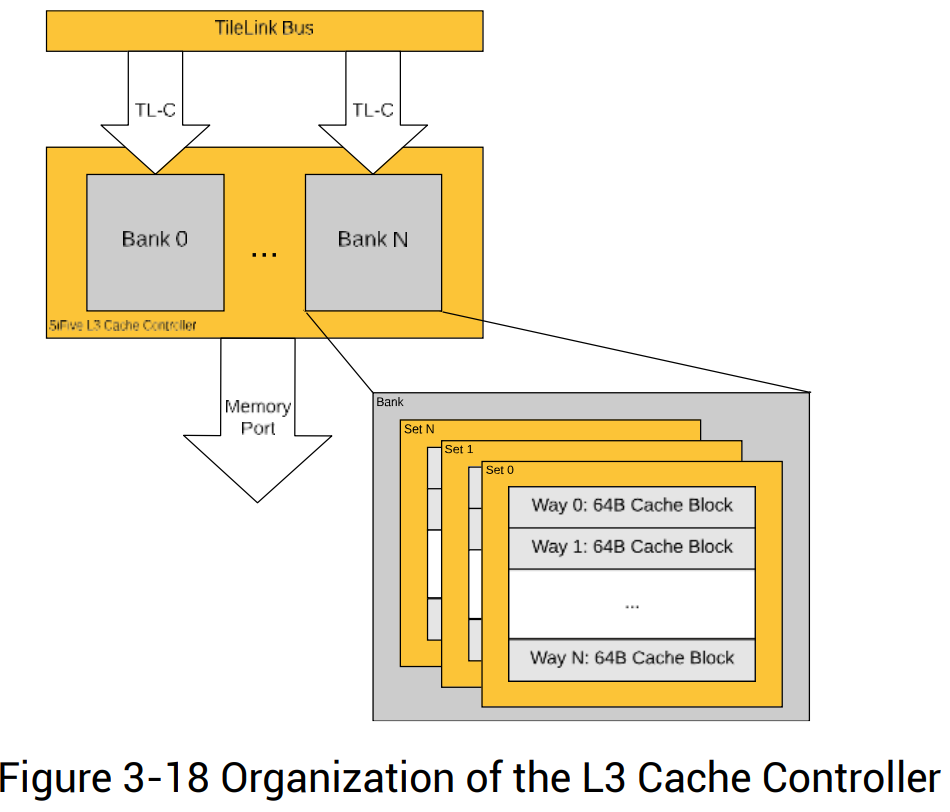
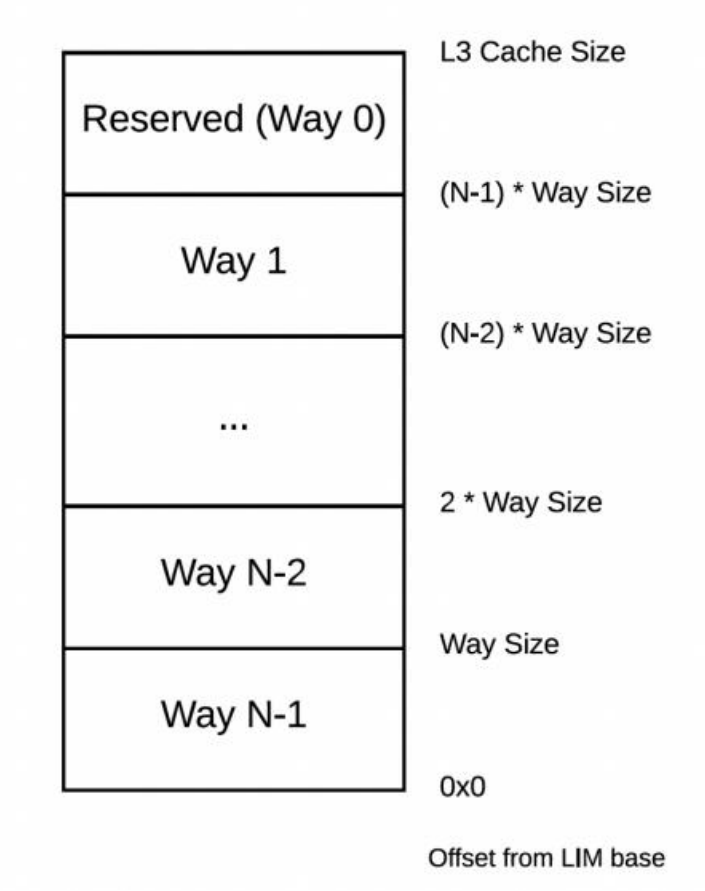
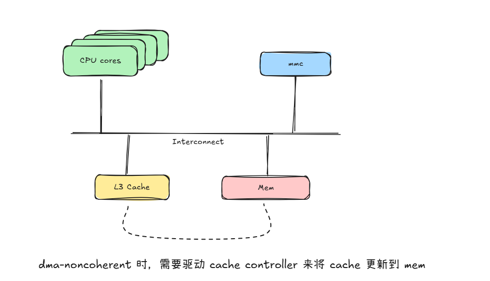
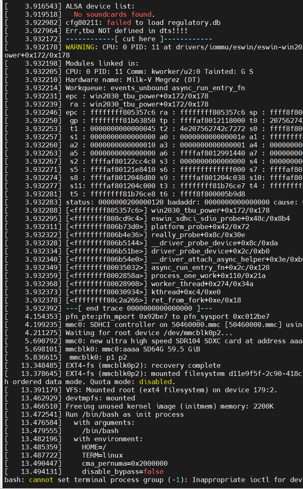
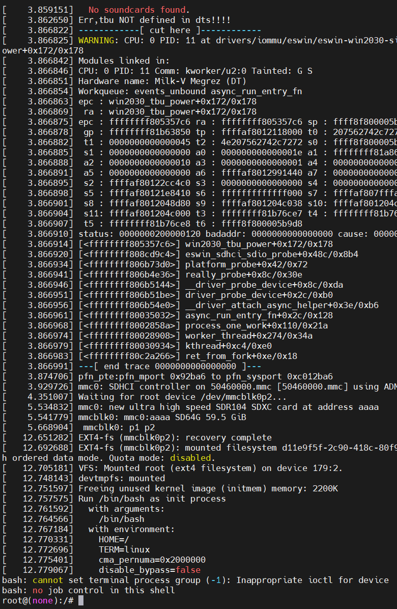

# EIC7700x SoC上的L3 Cache Controller介绍

时间：2025/7/22

作者：刘景宇

联系方式：liujingyu24s@ict.ac.cn

## 一、EIC7700x 介绍
参考：[EIC7700X 产品简介](https://www.eswincomputing.com/en/bocupload/2024/06/19/17187920991529ene8q.pdf)

EIC7700X是ESWIN推出的用于边缘计算的SoC, 包含高性能RISC-V 64位CPU以及自研的NPU. 其中RISC-V Core支持RV64GC以及Hypervisor Extension v0.6. 

该SoC已被Sifive Hifive Premier P550、Milk-V Megrez、Pine64 StarPro64使用.

## 二、L3 Cache Controller 介绍
参考：[EIC700X SoC计数参考手册 Part1](https://github.com/eswincomputing/EIC7700X-SoC-Technical-Reference-Manual/releases)

### 1、L3 Cache Controller 概述
L3 Cache Controller 用于为 Core Complex 的 masters 提供对高速内存副本的访问，它同时还充当基于目录的缓存一致性管理器。

L3 Cache Controller 功能丰富，除了 L3 Cahce Controller 的基本功能之外，还支持以下功能：
- 对禁用的缓存路（cache ways）对应的 L3 缓存 RAM 进行内存映射访问
- 作为片上快速存储（scratchpad）使用
- 缓存路的掩码（way masking）和锁定（locking）功能
- ECC（错误纠正码）支持及错误跟踪统计
- 错误注入功能
- 中断信号功能

### 2、功能描述
EIC7700X MCPU 的 L3 缓存容量为4 MiB，采用 16 路组相联（16-way set-associative）结构。缓存行大小为 64 字节，支持读写分配（read/write-allocate），采用随机替换策略。该缓存仅支持写回（write-back）模式。

L3 Cache 由 4 个 bank 组成，这种 bank 划分有助于提升 CPU master 与 L3 Cache 之间的带宽，因为每个 bank 拥有独立的 256位 TL-C inner port，因此对不同 bank 的多个请求可以并行处理。

L3 Cache Controller 的外部端口是一个 256 位的 TL-C 端口，多个 bank 共享，通常连接到 DDR 控制器。L3 Cache Controller 的外部 Memory Port 同样共享于所有 bank，通常连接到支持缓存的主存（cacheable memory）。

整体 L3 Cache Controller 的组织结构见下图：



### 3、Way Enable and the L3 Loosely-Integrated Memory (L3 LIM) 
L3 Cache Controller 允许其 SRAM 在 Core Complex 地址空间中充当直接寻址内存，或作为由 L3 Cache Controller 控制的缓存，该缓存可以包含任何可缓存地址的副本。
> 也就是说, L3 Cache 可以配 L3 Cache Controller 进行功能配置：
> 1. 一般意义上的缓存
> 2. 可以直接寻址的内存

当 cache ways 被禁用时，它们可以在 L3 Loosely-Integrated Memory（L3 LIM）地址空间中被访问。L3 LIM 是一个不可缓存端口，用于访问未使用的 L3 SRAM，并提供确定性的访问时间。它不会被 L1 数据缓存缓存，也不依赖于主存支持，因为它仅仅是一块专用的、可由软件寻址的、低延迟、不可缓存的内存。从 L3 LIM 获取指令或数据提供了等同于 L3 缓存命中的确定性行为，不存在缓存未命中的可能。

上电复位后，除第 0 路（way 0）外的所有 cache way 均为禁用状态，可以通过写 WayEnable 寄存器启用 cache way。一旦某个 cache way 被启用，除非对 EIC7700X MCPU 进行复位，否则不能再被禁用。编号最高的 L3 cache way 映射到 L3 LIM 地址空间的最低地址区域，编号为 1 的 cache way 占用 L3 LIM 地址空间的最高地址区域。随着 L3 cache way 的启用，L3 LIM 地址空间的大小会减少。L3 cache way 与 L3 LIM 地址空间的映射关系如下图所示，其中 N 为 L3 cache way 数量，每一路大小为 256 KiB。



设备树中的 L3 Cache Controller：

```
                cache-controller@2010000 {
                        cache-block-size = <0x40>;
                        cache-level = <0x03>;
                        cache-sets = <0x1000>;
                        cache-size = <0x400000>;
                        cache-unified;
                        compatible = "sifive,ccache1\0cache\0sifive,fu740-c000-ccache";
                        interrupt-parent = <0x10>;
                        interrupts = <0x01 0x03 0x04 0x02>;
                        next-level-cache = <0x11 0x12 0x13 0x14>;
                        reg = <0x00 0x2010000 0x00 0x4000 0x00 0x8000000 0x00 0x400000>;
                        reg-names = "control\0sideband";
                        sifive,a-mshr-count = <0x3c>;
                        sifive,bank-count = <0x04>;
                        sifive,ecc-granularity = <0x08>;
                        sifive,max-master-id = <0x0d>;
                        sifive,perfmon-counters = <0x06>;
                        numa-node-id = <0x00>;
                        phandle = <0x15>;
                };
```
其中
- 0x201_0000 开始的是 L3 Cache Controller 的空间 
- 0x800_0000 开始的是 L3 LIM 的空间

### 4、Cache Controller 重要功能描述
> 下一小节会结合源码分析, 本小节从宏观上介绍



简要描述：

当设备是 dma-noncoherent 时, 需要软件进行相关的同步操作, 在驱动设备进行DMA操作前, 需要将缓存的内容同步到内存中, 以确保设备读取的或者写入的是最新的数据
eg: 当Cache中的最新数据没有同步到内存中时, 设备读取到的是内存中的旧数据,而CPU看到的是缓存中的最新数据，这就会产生一些错误/不确定性

> 在 Hvisor 移植到 Milk-V Megrez 过程中, 发现没有 L3 Cache Controller 的话, 无法正常挂载 dma-noncoherent 的 mmc 设备, 并且启动过程中会损坏 mmc 中的文件系统.

### 5、结合源码分析
> 源码参考：https://github.com/rockos-riscv/rockos-kernel
> RockOS: A customized Debian distribution for the EIC770X including hifive-premier-p550/milkv-megrez/pine64-starpro64.
> 路径：drivers/soc/sifive/sifive_ccache.c

rockos-kernel 配置 L3 Cache 的所有 cache ways 为缓存, eic7700x 的 L3 Cache 为 16-way Cache, 将 16-way 全部 enable.

```c
#if IS_ENABLED(CONFIG_ARCH_ESWIN_EIC770X_SOC_FAMILY)
static void ccache_way_enable(int node_id)
{
    u32 cfg, val;
    cfg = readl(ccache_base[node_id] + SIFIVE_CCACHE_CONFIG);
    val = FIELD_GET(SIFIVE_CCACHE_CONFIG_WAYS_MASK, cfg);
    writel(val -1 , ccache_base[node_id] + SIFIVE_CCACHE_WAYENABLE);    // 写入 15, 表示所有 L3 均当做 Cache
}
```

当linux的config配置了CONFIG_RISCV_NONSTANDARD_CACHE_OPS（非标准的缓存操作），对于 dma-noncoherent的设备，会使用到cache-controller的相关内容.

```c
static int __init sifive_ccache_init(void)
{
    struct device_node *np;
    struct resource res;
    int i, rc, intr_num;
    for_each_matching_node(np, sifive_ccache_ids) {
        ......
        #if IS_ENABLED(CONFIG_ARCH_ESWIN_EIC770X_SOC_FAMILY)
        ccache_way_enable(node_index);
        riscv_noncoherent_register_cache_ops(&ccache_cmo_ops);
        #endif
        ccache_config_read(node_index);
        ccache_cache_ops.get_priv_group = ccache_get_priv_group;
        riscv_set_cacheinfo_ops(&ccache_cache_ops);
    #ifdef CONFIG_DEBUG_FS
        setup_sifive_debug();
    #endif
    }
    return 0;
err_free_irq:
    while (--i >= 0)
        free_irq(g_irq[node_index][i], NULL);
err_unmap:
    iounmap(ccache_base[node_index]);
err_node_put:
    of_node_put(np);
    return rc;
}
```
下面代码绑定了 wback、inc、wback_inv 操作：

Wback 将指定范围内的缓存内容写回到主存，确保缓存中的脏数据被同步
Inv 使指定范围内的缓存行失效，让后续访问必须从主存重新读取数据
wback_inv 先写回缓存数据，再使缓存行失效，保证数据正确写入并且缓存不再保留旧数据


```c
// wback、inv、wback_inv 均调用的这个函数
static void ccache_flush64_range(phys_addr_t paddr, size_t size)    // 地址 + 大小
{
    unsigned long line;
    size = size + (paddr % SIFIVE_CCACHE_FLUSH64_LINE_LEN);        // linelen = 64
    paddr = ALIGN_DOWN(paddr, SIFIVE_CCACHE_FLUSH64_LINE_LEN);
    mb();   /* sync */
    for (line = paddr; line < paddr + size; line += SIFIVE_CCACHE_FLUSH64_LINE_LEN) {
        writeq(line, ccache_base[CACHE_NODE_0] + SIFIVE_CCACHE_FLUSH64);    // 8 字节，物理地址
        mb();    /* sync */
    }
}

static const struct riscv_nonstd_cache_ops ccache_cmo_ops __initdata = {
    .wback = &ccache_flush64_range,
    .inv = &ccache_flush64_range,
    .wback_inv = &ccache_flush64_range,
};

void riscv_noncoherent_register_cache_ops(const struct riscv_nonstd_cache_ops *ops)
{
    if (!ops)
        return;
    noncoherent_cache_ops = *ops;
}

void arch_sync_dma_for_cpu(phys_addr_t paddr, size_t size,
               enum dma_data_direction dir)
{
    switch (dir) {
    case DMA_TO_DEVICE:
        break;

    case DMA_FROM_DEVICE:
    case DMA_BIDIRECTIONAL:
        /* FROM_DEVICE invalidate needed if speculative CPU prefetch only */
        if (arch_sync_dma_cpu_needs_post_dma_flush())
            arch_dma_cache_inv(paddr, size);
        break;

    default:
        break;
    }
}
```

### 6、模拟 L3 Cache Controller
> 目前实现的是最简的模拟, 对于ECC等中断未进行处理，主要进行 wayenable 与 flush64 两个寄存器的模拟

Hvisor 将所有 way 配置为 enable，并拦截 flush64 的写入:

```rust

/// Handle Zone's sifive composable cache controller mmio access.
pub fn virtual_sifive_ccache_handler(mmio: &mut MMIOAccess, _arg: usize) -> HvResult {
    match mmio.address {
        SIFIVE_CCACHE_CONFIG => {
            if mmio.size != 4 || mmio.is_write {
                error!("virtual_sifive_ccache_handler: Invalid access to SIFIVE_CCACHE_CONFIG");
                return hv_result_err!(EINVAL);
            }
            // Return config to guest
            mmio.value = host_sifive_ccache().get_config() as _;
        }
        SIFIVE_CCACHE_WAYENABLE => {
            if mmio.is_write {
                info!("Hvisor doesn't support guest to configure ccache wayenable");
                info!("Hvisor defaultly configs L3 cache ways enable.");
            } else {
                info!("virtual_sifive_ccache_handler: Reading SIFIVE_CCACHE_WAYENABLE");
                mmio.value = host_sifive_ccache().get_wayenable() as _;
            }
        }
        SIFIVE_CCACHE_FLUSH64 => {
            if mmio.is_write {
                host_sifive_ccache().flush_range(mmio.value as _);
            } else {
                return hv_result_err!(EPERM, "Guest wants to read SIFIVE_CCACHE_FLUSH64.");
            }
        }
        _ => {
            error!("virtual_sifive_ccache_handler: Unknown address 0x{:x}", mmio.address);
            return hv_result_err!(EFAULT);
        }
    };
    Ok(())
}
```

经测试，以上对于 Cache-controller 的拦截模拟引入一定开销，以下测试结果仅供参考：

使用 virtual cache controller：


未使用 virtual cache controller：
