# 龙芯 3A6000 PCIe 虚拟化调试笔记

wheatfox (wheatfox17@icloud.com)

## 龙芯 7A2000 桥片 PCI 介绍

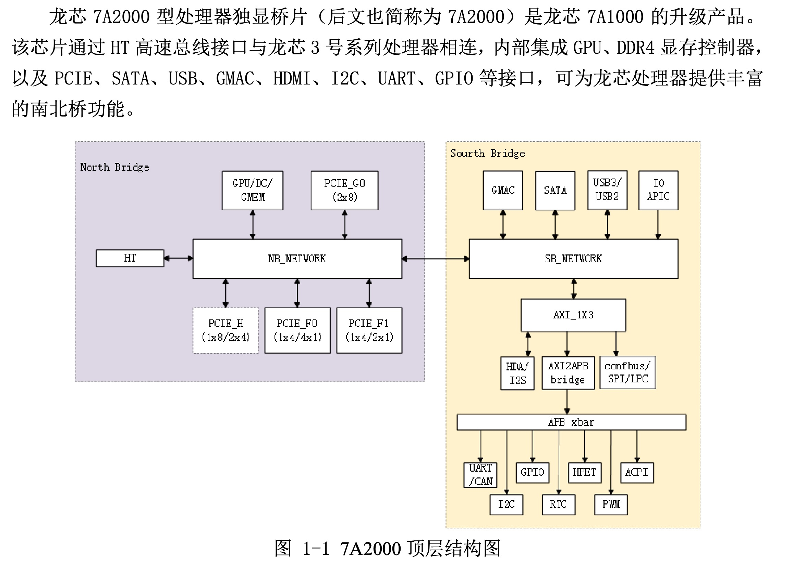

总共32个lane

**PCIE_G0**: 2x8: PORT 0: LANE 0-7, PORT 1: LANE 8-15 **PCIE_H**: 1x8 2x4 **PCIE_F0**: 1x4 4x1 **PCIE_F1**: 1x4 2x1

[https://lore.kernel.org/lkml/20241127091825.421126-1-chenhuacai@loongson.cn/](https://lore.kernel.org/lkml/20241127091825.421126-1-chenhuacai@loongson.cn/)

## HT 总线

HT总线全称为HyperTransport，由AMD在1999年提出，最新的版本为3.1（2008年）发布，允许的总线频率为200MHz-3.2GHz，HT通信以Packet为单位进行传输。现在的

AMD Ryzen和AMD EPYC使用Infinity Fabric（IF）取代了HyperTransport总线。

[https://en.wikichip.org/wiki/amd/infinity_fabric](https://en.wikichip.org/wiki/amd/infinity_fabric)

## 7A2000 地址空间

7A2000 内部地址位宽为 48，从CPU的视角来看，7A2000的空间可以分为：

1. 配置空间：配置桥片内部设备+PCIe控制器拓展的设备，地址格式符合PCI规范
2. IO空间：用于通过IO请求访问PCIe控制器拓展的下游设备
3. MEM空间：除了1和2的其他空间

> 桥片的配置空间对应于 HT总线的**HT总线配置空间**，大小为 32MB。桥片的 PCI IO 空间对应于**HT总线IO 空间**，大小为 32MB。**桥片的PCI MEM 空间用来访问桥片内部 PCIE设备的MEM空间和除PCIE外的其他设备的地址空间**，包括控制寄存器、显存、confbus等。桥片内部设备按照 PCI设备树进行组织，每个设备都包含了一个标准的PCI设备头。这些设备包括：GPU、DC（显示控制器）、PCIE、USB、SATA、GMAC（千兆介质访问控制器）、HDA（高清音频接口）/I2S（音频总线）、MISC 低速设备块、confbus（配置总线）、LPC（Low Pin Count总线接口）和SPI（串行外设接口）。
> 

Bus 0:Device 9:Function 0 PCIE_F0 Port0
Bus 0:Device 10:Function 0 PCIE_F0 Port1
Bus 0:Device 11:Function 0 PCIE_F0 Port2
Bus 0:Device 12:Function 0 PCIE_F0 Port3
Bus 0:Device 13:Function 0 PCIE_F1 Port0

Bus 0:Device 14:Function 0 PCIE_F1 Port1
Bus 0:Device 15:Function 0 PCIE_G0 port0
Bus 0:Device 16:Function 0 PCIE_G0 port1
Bus 0:Device 19:Function 0 PCIE_H port0
Bus 0:Device 20:Function 0 PCIE_H port1


## 7A2000 内部 PCIe 控制器

[https://michael2012z.medium.com/understanding-pci-node-in-fdt-769a894a13cc](https://michael2012z.medium.com/understanding-pci-node-in-fdt-769a894a13cc)

[https://elinux.org/Device_Tree_Usage](https://elinux.org/Device_Tree_Usage)

传统的PCIe内部互联如下：


龙芯由于使用HT总线，其实际上是通过HT总线连接7A2000的内部PCI设备，外加4个PCIe控制器用于连接外部PCIe设备（通过插槽连接）。

桥片的 PCIE 分为 4 个模块:PCIE_F0,PCIE_F1,PCIE_H,PCIE_G0,共 32 个 lane。

根据前面提到的寻址方法可以访问这几个控制器的配置空间，具体格式见手册（基本和PCI配置头一致）

注意：每个端口对应一个PCIe控制器，相互独立（共10个端口）

桥片的 PCIE 控制器中, **F0 和 H 的 port0 可以作为 RC 使用也可以作为 EP 使用,其它的控制器端口仅可以作为 RC 使用,不能作为 EP。**

每个端口有自己的PCI地址空间（区别前面的HT总线桥片的地址空间）

## Loongson 3系处理器设备树——PCIe

`lspci`

root linux PCIe 

思路：

1. 给 uefi packer 的 UEFI stub 添加 dump acpi table 的功能，这样启动 hvisor 之前可以检查一下当前设备的设备树（ACPI格式）
2. 首先通过 qemu-system-loongarch64 添加一些 pci 设备测试新的 uefi packer 功能
3. 同时通过 qemu-system-loongarch64 直接启动 UEFI vmlinux.efi，然后通过一些 cmdline 工具 dump UEFI/ACPI 信息，可能需要自己 CROSS COMPILE

[https://github.com/qemu/qemu/blob/master/docs/pcie.txt](https://github.com/qemu/qemu/blob/master/docs/pcie.txt)

## 2025.3.1 记录

接好了 3A6000 yy0121 板子的 debug uart，也能看到一部分 UEFI 的输出了，但是我发现所有的 Console Print 全都消失不见了，在 setup 中检查了一下发现 Console 指向的是一个 PCI 设备（难道是定向到了面板上的 COM 口）？

得买一个 COM 测试一下了（之后直通 PCIe 也许也需要支持这个 COM？），检查了一下 3A5000 3A6000 的 UART 基地址是一样的，但是在 3A6000 板子上 U 盘启动 hvisor 后就直接死掉了（有时候会回退到 uefi shell/setup、有时候机器就直接卡死了）

因为 Console 的输出现在什么都看不见，不清楚原因，接下来就是改一下 uefi packer 程序看能不能先在 efi main 函数里把 UART0 跑起来，至少要能看到一些输出……

### rt-tests loongarch64 移植

[https://web.git.kernel.org/pub/scm/utils/rt-tests/rt-tests.git](https://web.git.kernel.org/pub/scm/utils/rt-tests/rt-tests.git) 

[https://patches.linaro.org/project/linux-rt-users/patch/20201218161843.1764-2-dwagner@suse.de/](https://patches.linaro.org/project/linux-rt-users/patch/20201218161843.1764-2-dwagner@suse.de/)

需要自行准备一个 loongarch64 架构的 libnuma-dev(numactl)

```bash

First, build numactl as static libary:
  ./configure --enable-static && make
and then rt-tests with
  CFLAGS="-static -L../numactl/.libs/" make
```

[https://mails.dpdk.org/archives/dev/2021-December/231101.html](https://mails.dpdk.org/archives/dev/2021-December/231101.html) 

```
Numactl cross compilation doesn't work with clang, remove it and fix the
gcc cross compiler executable name.

Signed-off-by: Juraj Linkeš <juraj.linkes at pantheon.tech>
---
 doc/guides/linux_gsg/cross_build_dpdk_for_arm64.rst | 7 ++++---
 1 file changed, 4 insertions(+), 3 deletions(-)

diff --git a/doc/guides/linux_gsg/cross_build_dpdk_for_arm64.rst b/doc/guides/linux_gsg/cross_build_dpdk_for_arm64.rst
index af159bbf93..6153bc5b77 100644
--- a/doc/guides/linux_gsg/cross_build_dpdk_for_arm64.rst
+++ b/doc/guides/linux_gsg/cross_build_dpdk_for_arm64.rst
@@ -35,13 +35,14 @@ NUMA is required by most modern machines, not needed for non-NUMA architectures.
    git checkout v2.0.13 -b v2.0.13
    ./autogen.sh
    autoconf -i
-   ./configure --host=aarch64-linux-gnu CC=<compiler> --prefix=<numa install dir>
+   ./configure --host=aarch64-linux-gnu CC=aarch64-none-linux-gnu-gcc --prefix=<numa install dir>
    make install
 
 .. note::
 
-   The compiler above can be either aarch64-linux-gnu-gcc or clang.
-   See below for information on how to get specific compilers.
+   The compiler is aarch64-none-linux-gnu-gcc if you download gcc using the
+   below guide. If you're using a different compiler, make sure you're using
+   the proper executable name.
 
 The numa header files and lib file is generated in the include and lib folder
 respectively under ``<numa install dir>``.
-- 
2.20.1
```

然后就可以完成 loongarch64 的 CROSS COMPILE 了：

```bash
# numactl as submodule, update all submodules at first
git submodule update --init --recursive
cd numactl
./autogen.sh
./configure --host=loongarch64-unknown-linux-gnu CC=loongarch64-unknown-linux-gnu-gcc --prefix=$(pwd)/install
make -j$(nproc)
make install
cd ..
# now we are ready to build rt-tests
CFLAGS="-static -L$(pwd)/numactl/install/lib -I$(pwd)/numactl/install/include" make ARCH=loongarch64 CROSS_COMPILE=loongarch64-unknown-linux-gnu- all
# run the test
qemu-loongarch64 -L . ./cyclictest
```

[https://github.com/enkerewpo/rt-tests-loongarch64](https://github.com/enkerewpo/rt-tests-loongarch64)

## 2025.3.3 记录

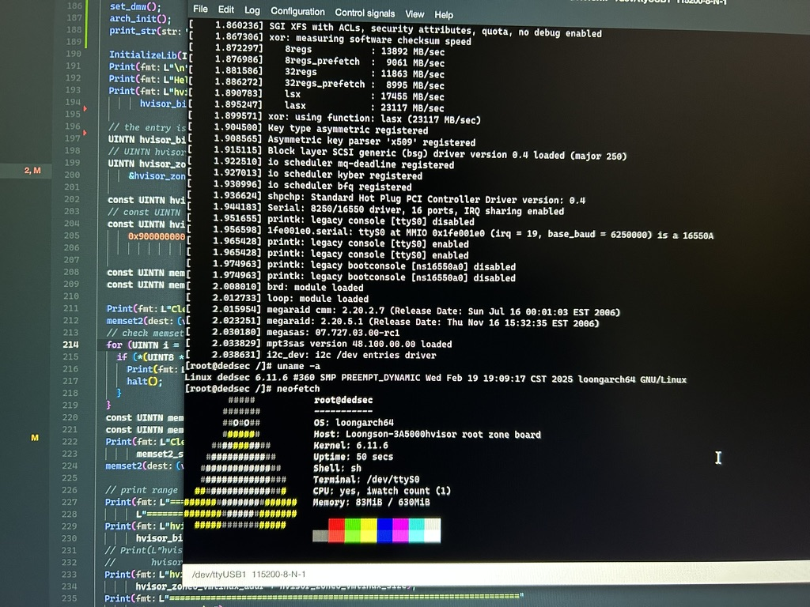

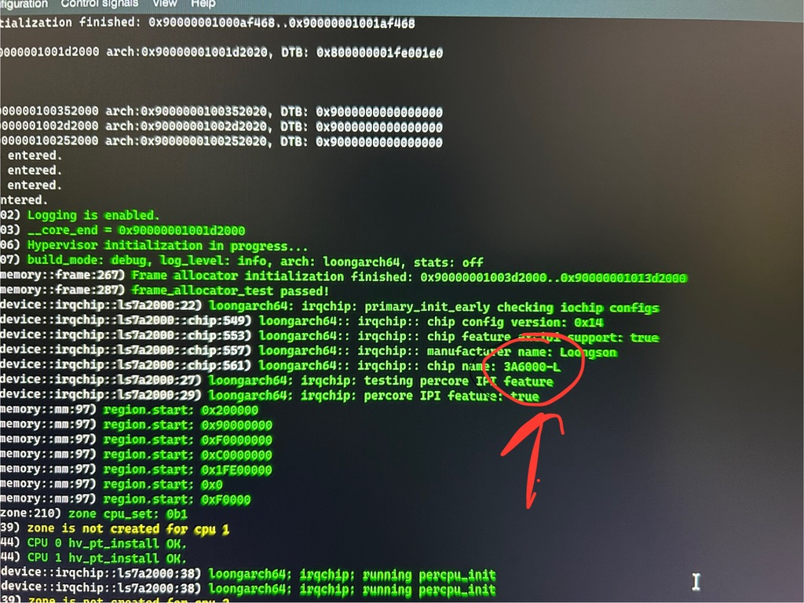

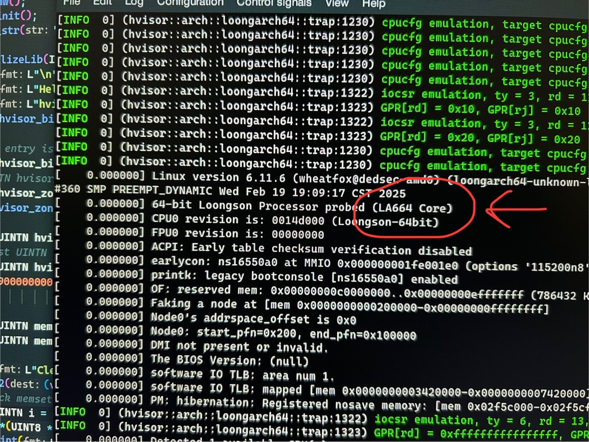

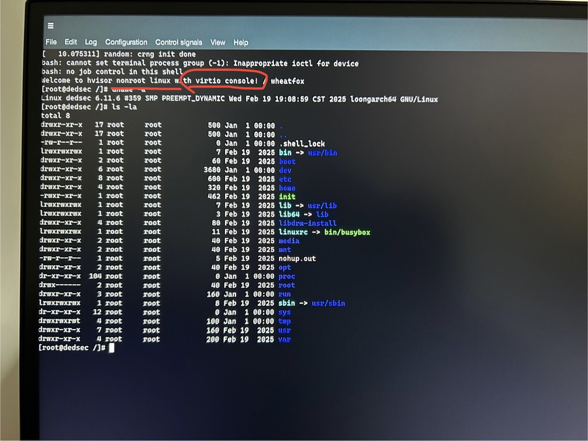

3A6000 yy0121 UART 和 UEFI 都跑通了，启动 root + nonroot linux + virtio console 均没问题，和 3A5000 感觉一样（？）

之后可以试一下 3A6000 的 8 核 SMT

给hvisor uefi bootloader 添加 dump ACPI 设备列表的功能

ASL - ACPI Source Language

ACPI namespace 在 UEFI 规范中重新定义为 device path

[https://learn.microsoft.com/en-us/windows-hardware/drivers/bringup/acpi-system-description-tables](https://learn.microsoft.com/en-us/windows-hardware/drivers/bringup/acpi-system-description-tables)

Differentiated System Description Table (DSDT)

> In ACPI, peripheral devices and system hardware features on the platform are described in the Differentiated System Description Table (DSDT), which is loaded at boot, or in Secondary System Description Tables (SSDTs), which are loaded at boot or loaded dynamically at run time. For SoCs, the platform configuration is typically static, so the DSDT might be sufficient, although SSDTs can also be used to improve the modularity of the platform description.
> 

FADT [https://wiki.osdev.org/FADT](https://wiki.osdev.org/FADT)

RSDT [https://wiki.osdev.org/RSDT](https://wiki.osdev.org/RSDT#:~:text=RSDT%20)

ACPI_GENERIC_ADDRESS [https://docs.huihoo.com/doxygen/linux/kernel/3.7/structacpi__generic__address.html](https://docs.huihoo.com/doxygen/linux/kernel/3.7/structacpi__generic__address.html)

ACPI AML [https://f.osdev.org/viewtopic.php?t=28279](https://f.osdev.org/viewtopic.php?t=28279)

IASL [https://dortania.github.io/Getting-Started-With-ACPI/Manual/compile.html](https://dortania.github.io/Getting-Started-With-ACPI/Manual/compile.html)

IASL [https://www.intel.com/content/www/us/en/developer/topic-technology/open/acpica/overview.html](https://www.intel.com/content/www/us/en/developer/topic-technology/open/acpica/overview.html)

AML [https://uefi.org/htmlspecs/ACPI_Spec_6_4_html/20_AML_Specification/AML_Specification.html](https://uefi.org/htmlspecs/ACPI_Spec_6_4_html/20_AML_Specification/AML_Specification.html)

loongson pcie dts documentation:

[https://elixir.bootlin.com/linux/v6.14-rc4/source/arch/loongarch/boot/dts/loongson-2k0500.dtsi](https://elixir.bootlin.com/linux/v6.14-rc4/source/arch/loongarch/boot/dts/loongson-2k0500.dtsi)

[https://elixir.bootlin.com/linux/v6.14-rc4/source/Documentation/devicetree/bindings/pci/loongson.yaml#L22](https://elixir.bootlin.com/linux/v6.14-rc4/source/Documentation/devicetree/bindings/pci/loongson.yaml#L22)

pci compatible: `loongson,ls7a-pci`

[https://elixir.bootlin.com/linux/v6.14-rc4/source/drivers/pci/controller/pci-loongson.c#L310](https://elixir.bootlin.com/linux/v6.14-rc4/source/drivers/pci/controller/pci-loongson.c#L310)

example ls7a pci dts on mips, 应该和 loongarch 用的类似的 7A 桥片设计？

[https://elixir.bootlin.com/linux/v6.14-rc4/source/arch/mips/boot/dts/loongson/ls7a-pch.dtsi#L69](https://elixir.bootlin.com/linux/v6.14-rc4/source/arch/mips/boot/dts/loongson/ls7a-pch.dtsi#L69)

loongson_pci_probe: [https://elixir.bootlin.com/linux/v6.14-rc4/C/ident/loongson_pci_probe](https://elixir.bootlin.com/linux/v6.14-rc4/C/ident/loongson_pci_probe)


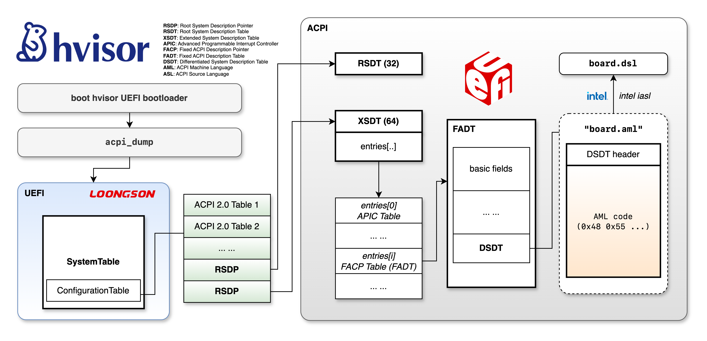

## 2025.3.4 记录

_SB: system bus

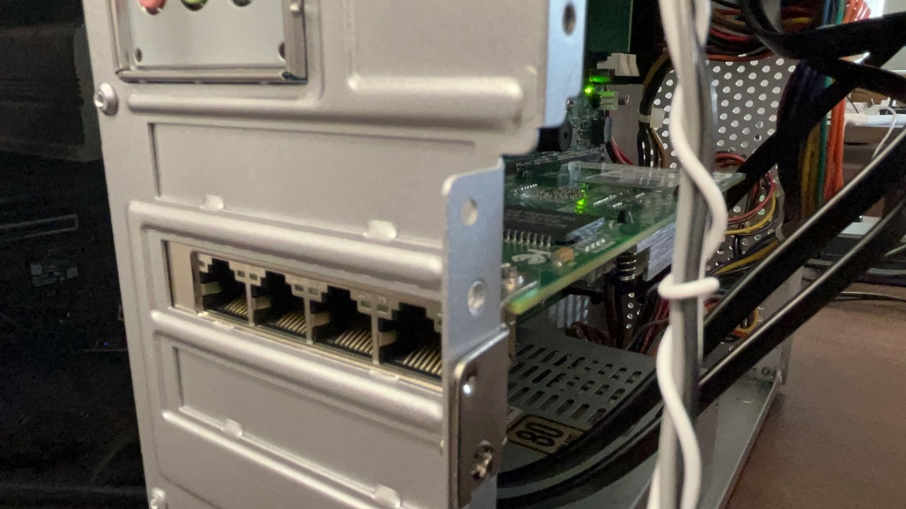

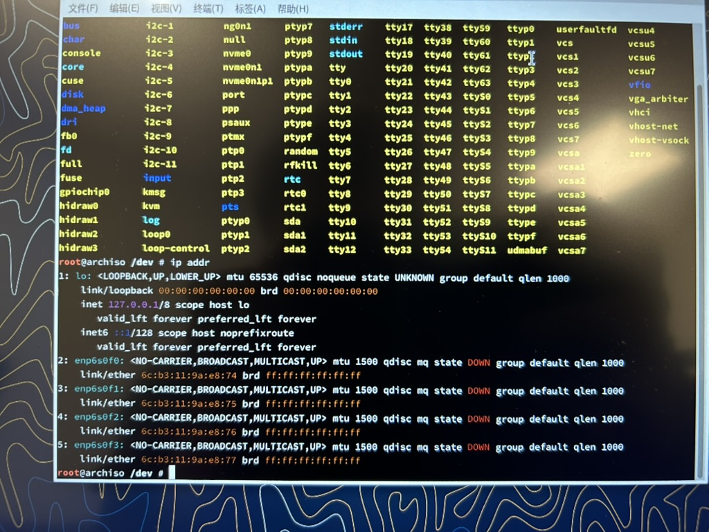


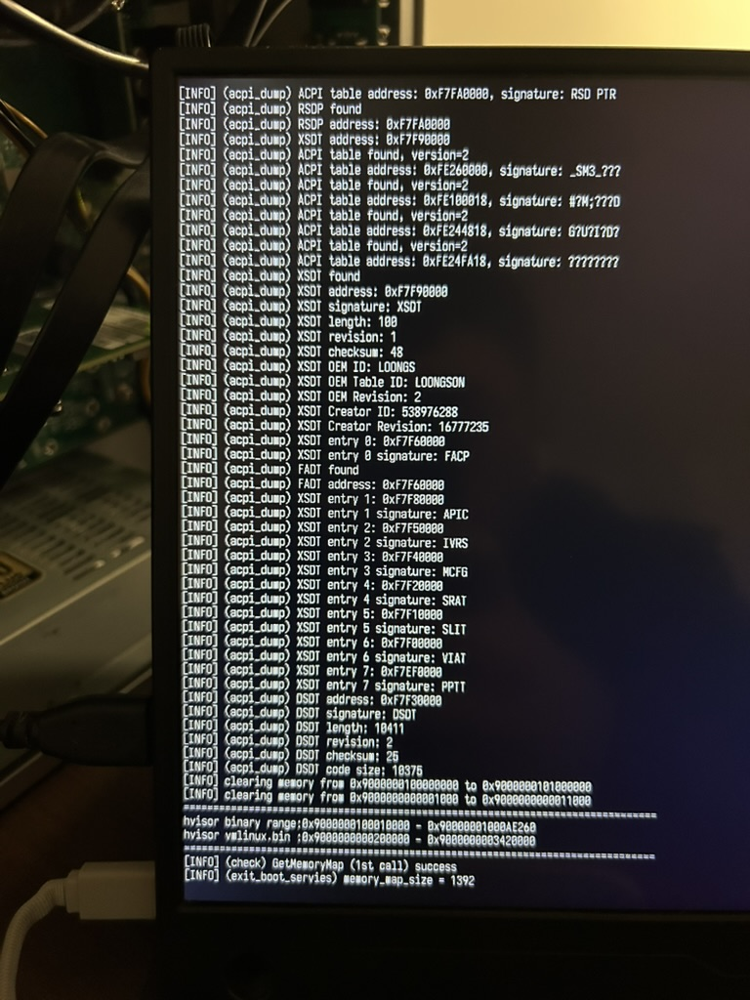

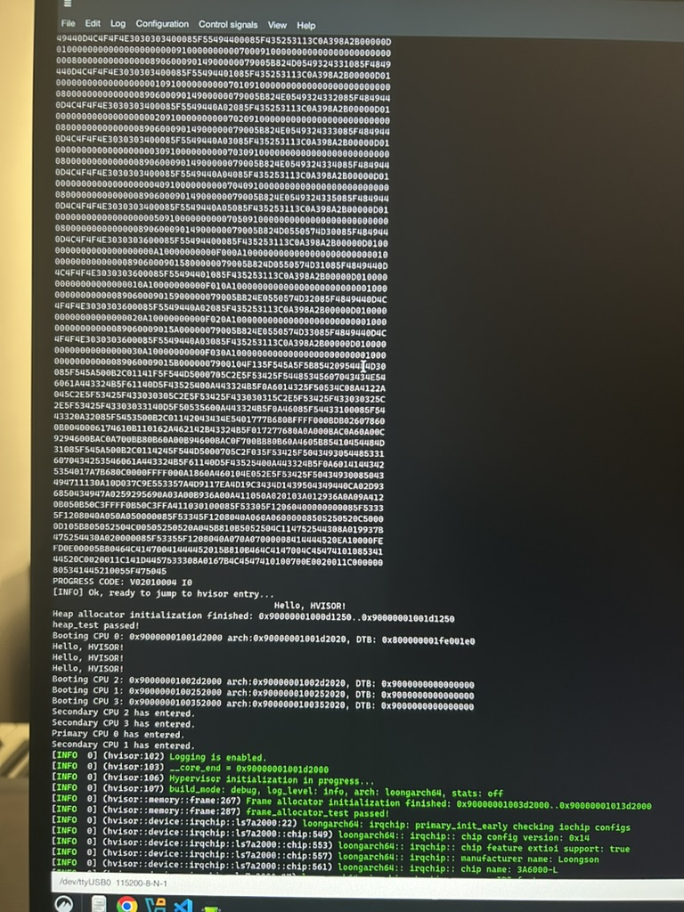

最终拿到了板子插上 SSD + PCIe 网卡的 ACPI 设备描述表源码（ASL），但是研究之后发现，里吗只有对 7A2000 桥片内置 PCI 设备的描述，没有任何关于 SSD 和 PCIe 的描述，我的理解是无论是 UEFI 固件还是 OS，都依然需要从 ROOT controller 进行现场嗅探，而不是通过 ACPI 给的表来拿信息（ACPI表里甚至有一个函数，专门负责给新的 PCIe 设备编号）。

这样在写 root/nonroot 的 PCIe 设备树时，应该只需要制定 ROOT controller 的基本信息和内存地址，把BAR空间/MMIO空间留出来让 root/nonroot zone 里的 linux kernel 自行嗅探即可。

**接下来的问题：这个 PCIe controller 的设备树怎么写？（我从 ACPI 导出的设备描述中是有关于 PCIe controller 的一些信息的，这个需要先研究清楚，然后参考龙芯在 linux kernel 里给 2K1000/2K2000 写的 PCIe 节点，把 liointc、eiointc、msi、pic、pcie 这些节点和 interrupt-tree 的结构搞清楚。**

root/nonroot linux内用户态的计时误差

## 2025.3.19 记录

7A1000/7A2000 - GMAC 千兆以太网控制器，直接在桥片里实现，和PCIe拓展槽的设备要进行区别

三步走：

1. 把主板的网口接给root
2. 把主板的SSD经PCIe控制器给root
    1. 测一下virtio-blk/net能不能跑
3. 把PCIe槽的网卡给root/nonroot

### nvme

### intel igb

[https://www.qemu.org/docs/master/system/devices/igb.html](https://www.qemu.org/docs/master/system/devices/igb.html)

[https://www.intel.com/content/dam/www/public/us/en/documents/datasheets/82576eb-gigabit-ethernet-controller-datasheet.pdf](https://www.intel.com/content/dam/www/public/us/en/documents/datasheets/82576eb-gigabit-ethernet-controller-datasheet.pdf)

[https://github.com/torvalds/linux/blob/master/kernel/Kconfig.preempt](https://github.com/torvalds/linux/blob/master/kernel/Kconfig.preempt)

[https://cateee.net/lkddb/web-lkddb/PREEMPT_RT.html](https://cateee.net/lkddb/web-lkddb/PREEMPT_RT.html)

```bash
cat /proc/version
chrt -m
sysctl kernel.sched_rt_runtime_us
dmesg | grep -i "PREEMPT"
```

看一下 drivers/pci/controller/pci-loongson.c

PCH: Platform Controller Hub

看一下 Hypervisor ARCEOS: pcie function

搜一下KVM iommu

aarch64 iommu 3588 测试

## 2025.3.24 记录

今天成功在3A6000的root linux中加载了 msi、pic、liointc、eiointc、pci 控制器，但是 lspci 没有任何输出，即系统内没有挂上任何 pci 设备，接下来就是要读一下 ls7a-pci 的源码。


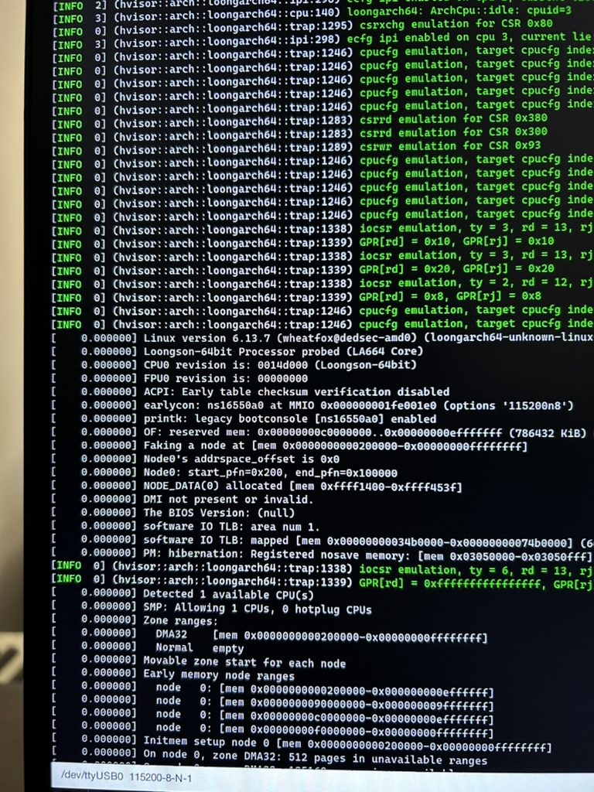

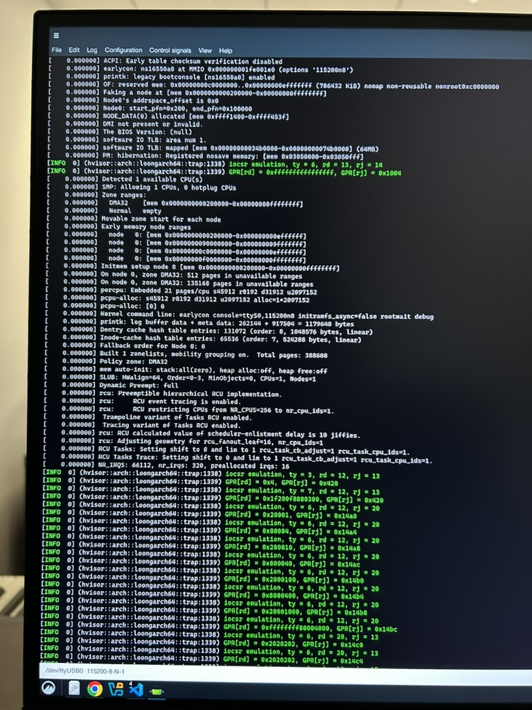

drivers/pci/controller/pci-loongson.c

奇怪的现象，在qemu里启动内嵌dtb的root linux vmlinux，sleep 1 后时间是没问题的（约1秒），为什么上板后有 sleep 指令两倍误差？？？需要测试一下。

CONFIG_PCI_DYNAMIC_OF_NODES

[https://lore.kernel.org/lkml/1690323318-6103-1-git-send-email-lizhi.hou@amd.com/T/](https://lore.kernel.org/lkml/1690323318-6103-1-git-send-email-lizhi.hou@amd.com/T/)

[https://stackoverflow.com/questions/44127563/pci-nodes-in-device-tree](https://stackoverflow.com/questions/44127563/pci-nodes-in-device-tree)

> No, peripherals connected to the PCI-bus doesn't need to be in the DTS file, as they can be enumerated during runtime.
> 
> 
> Peripherals sitting on non-enumerable buses, OTOH, needs to be added to the DTS file. This could be peripherals on the memory bus, I2C, SPI, etc.
> 


```rust
drivers/pci/of.c

devm_of_pci_get_host_bridge_resources

dev_info(dev, "  %6s %#012llx..%#012llx -> %#012llx\n",
	 range_type, range.cpu_addr,
	 range.cpu_addr + range.size - 1, range.pci_addr);
	 
// procedure

loongson_pci_probe
-> devm_pci_alloc_host_bridge
```

## 2025.3.26 记录

```bash
9000000000245c68 <loongson_send_ipi_single>:
9000000000245c68:	1a09938c 	pcalau12i   	$t0, 19612(0x4c9c)
9000000000245c6c:	02ffa18c 	addi.d      	$t0, $t0, -24(0xfe8)
9000000000245c70:	002cb084 	alsl.d      	$a0, $a0, $t0, 0x2
9000000000245c74:	2400208c 	ldptr.w     	$t0, $a0, 32(0x20)
9000000000245c78:	1500000d 	lu12i.w     	$t1, -524288(0x80000)
9000000000245c7c:	0040c18c 	slli.w      	$t0, $t0, 0x10
9000000000245c80:	0015158c 	or          	$t0, $t0, $a1
9000000000245c84:	0015358c 	or          	$t0, $t0, $t1
9000000000245c88:	1400002d 	lu12i.w     	$t1, 1(0x1)
9000000000245c8c:	038101ad 	ori         	$t1, $t1, 0x40
9000000000245c90:	064819ac 	iocsrwr.w   	$t0, $t1
9000000000245c94:	4c000020 	jirl        	$zero, $ra, 0 <- ???
```

```bash
[DEBUG 0] (hvisor::arch::loongarch64::trap:200) loongarch64: trap_handler: GSPR(Guest Sensitive Privileged Resource) ecode=0x16 esubcode=0x0 is=0x0 badv=0x0 badi=0x64819ac era=0x9000000000245c90
[INFO  0] (hvisor::arch::loongarch64::trap:1340) iocsr emulation, ty = 6, rd = 12, rj = 13
[INFO  0] (hvisor::arch::loongarch64::trap:1341) GPR[rd] = 0xffffffff80000003, GPR[rj] = 0x1040
[DEBUG 0] (hvisor::arch::loongarch64::trap:254) loongarch64: trap_handler: return
[DEBUG 0] (hvisor::arch::loongarch64::trap:200) loongarch64: trap_handler: INT(Interrupt) ecode=0x0 esubcode=0x0 is=0x1000 badv=0x0 badi=0x64819ac era=0x9000000000245c94
[DEBUG 0] (hvisor::arch::loongarch64::trap:282) This is an interrupt exception, is=0x1000, ecfg.lie=TIMER | IPI
[DEBUG 0] (hvisor::arch::loongarch64::trap:1178) ipi interrupt, status = 0x8
[DEBUG 0] (hvisor::arch::loongarch64::trap:1187) not handled IPI status 0x8 for now, we inject this IPI to guest
[DEBUG 0] (hvisor::arch::loongarch64::trap:254) loongarch64: trap_handler: return
[DEBUG 0] (hvisor::arch::loongarch64::trap:200) loongarch64: trap_handler: INT(Interrupt) ecode=0x0 esubcode=0x0 is=0x1000 badv=0x0 badi=0x64819ac era=0x9000000000245c94
[DEBUG 0] (hvisor::arch::loongarch64::trap:282) This is an interrupt exception, is=0x1000, ecfg.lie=TIMER | IPI
[DEBUG 0] (hvisor::arch::loongarch64::trap:1178) ipi interrupt, status = 0x8
[DEBUG 0] (hvisor::arch::loongarch64::trap:1187) not handled IPI status 0x8 for now, we inject this IPI to guest
[DEBUG 0] (hvisor::arch::loongarch64::trap:254) loongarch64: trap_handler: return
[DEBUG 0] (hvisor::arch::loongarch64::trap:200) loongarch64: trap_handler: INT(Interrupt) ecode=0x0 esubcode=0x0 is=0x1000 badv=0x0 badi=0x64819ac era=0x9000000000245c94
[DEBUG 0] (hvisor::arch::loongarch64::trap:282) This is an interrupt exception, is=0x1000, ecfg.lie=TIMER | IPI
[DEBUG 0] (hvisor::arch::loongarch64::trap:1178) ipi interrupt, status = 0x8
[DEBUG 0] (hvisor::arch::loongarch64::trap:1187) not handled IPI status 0x8 for now, we inject this IPI to guest
[DEBUG 0] (hvisor::arch::loongarch64::trap:254) loongarch64: trap_handler: return
[DEBUG 0] (hvisor::arch::loongarch64::trap:200) loongarch64: trap_handler: INT(Interrupt) ecode=0x0 esubcode=0x0 is=0x1000 badv=0x0 badi=0x64819ac era=0x9000000000245c94
[DEBUG 0] (hvisor::arch::loongarch64::trap:282) This is an interrupt exception, is=0x1000, ecfg.lie=TIMER | IPI
[DEBUG 0] (hvisor::arch::loongarch64::trap:1178) ipi interrupt, status = 0x8
[DEBUG 0] (hvisor::arch::loongarch64::trap:1187) not handled IPI status 0x8 for now, we inject this IPI to guest
[DEBUG 0] (hvisor::arch::loongarch64::trap:254) loongarch64: trap_handler: return
[DEBUG 0] (hvisor::arch::loongarch64::trap:200) loongarch64: trap_handler: INT(Interrupt) ecode=0x0 esubcode=0x0 is=0x1000 badv=0x0 badi=0x64819ac era=0x9000000000245c94
[DEBUG 0] (hvisor::arch::loongarch64::trap:282) This is an interrupt exception, is=0x1000, ecfg.lie=TIMER | IPI
[DEBUG 0] (hvisor::arch::loongarch64::trap:1178) ipi interrupt, status = 0x8

```

[https://github.com/torvalds/linux/commit/08f417db702c5b05150b3851af7186fee96ddd46](https://github.com/torvalds/linux/commit/08f417db702c5b05150b3851af7186fee96ddd46)

[https://www.kernel.org/doc/Documentation/timers/NO_HZ.txt](https://www.kernel.org/doc/Documentation/timers/NO_HZ.txt)

[https://wiki.linuxfoundation.org/realtime/documentation/howto/tools/cyclictest/start](https://wiki.linuxfoundation.org/realtime/documentation/howto/tools/cyclictest/start)

2K1000 的 FE 空间设备列表：


7A2000桥片的设备列表：


算一下 7A2000 的 pci 设备地址：

**gmac: 0:3:0**

15:0 - 00011 000 00000000 - 0001 1000 0000 0000

0x00fe_0000_1800

**pcie_f0_p0 0:9:0**

01001 000 00000000 - 0100 1000 0000 0000

0x00fe_0000_4800

**pcie_f0_p0 0:10:0**

01010 000 00000000 - 0101 0000 0000 0000 - 5000

以此类推：

01011 000 00000000 - 0101 1000 0000 0000 - 5800

01100 000 00000000 - 0110 0000 0000 0000 - 6000

…


```bash
[    2.649386] io scheduler mq-deadline registered
[    2.649388] io scheduler kyber registered
[    2.649397] io scheduler bfq registered
[    2.651218] shpchp: Standard Hot Plug PCI Controller Driver version: 0.4
[    2.651251] loongson-pci 1a000000.pcie: host bridge /platform/pcie@1a000000 ranges:
[    2.651274] loongson-pci 1a000000.pcie:       IO 0x0018408000..0x001840ffff -> 0x0000008000
[    2.651281] loongson-pci 1a000000.pcie:      MEM 0x0060000000..0x007fffffff -> 0x0060000000
[    2.651289] [wheatfox] loongson_pci_probe: found bridge pcie
[    2.651679] [wheatfox] loongson_pci_probe: bridge pcie initialized, calling pci_host_probe
[    2.651746] loongson-pci 1a000000.pcie: PCI host bridge to bus 0000:00
[    2.651751] pci_bus 0000:00: root bus resource [bus 00-ff]
[    2.651755] pci_bus 0000:00: root bus resource [io  0x0000-0x7fff] (bus address [0x8000-0xffff])
[    2.651758] pci_bus 0000:00: root bus resource [mem 0x60000000-0x7fffffff]
[    2.651778] pci 0000:00:00.0: [0200:0000] type 00 class 0x000000 conventional PCI endpoint
[    2.651792] pci 0000:00:00.0: ROM [mem 0x00000000-0x000007ff pref]
[    2.651876] pci 0000:00:01.0: [0200:0000] type 00 class 0x000000 conventional PCI endpoint
[    2.651883] pci 0000:00:01.0: ROM [mem 0x00000000-0x000007ff pref]
[    2.651940] pci 0000:00:02.0: [0200:0000] type 00 class 0x000000 conventional PCI endpoint
[    2.651948] pci 0000:00:02.0: ROM [mem 0x00000000-0x000007ff pref]
[    2.652003] pci 0000:00:03.0: [0200:0000] type 00 class 0x000000 conventional PCI endpoint
[    2.652011] pci 0000:00:03.0: ROM [mem 0x00000000-0x000007ff pref]
[    2.652074] pci 0000:00:04.0: [0200:0000] type 00 class 0x000000 conventional PCI endpoint
[    2.652082] pci 0000:00:04.0: ROM [mem 0x00000000-0x000007ff pref]
[    2.652133] pci 0000:00:05.0: [0200:0000] type 00 class 0x000000 conventional PCI endpoint
[    2.652140] pci 0000:00:05.0: ROM [mem 0x00000000-0x000007ff pref]
[    2.652190] pci 0000:00:06.0: [0200:0000] type 00 class 0x000000 conventional PCI endpoint
[    2.652198] pci 0000:00:06.0: ROM [mem 0x00000000-0x000007ff pref]
[    2.652248] pci 0000:00:07.0: [0200:0000] type 00 class 0x000000 conventional PCI endpoint
[    2.652256] pci 0000:00:07.0: ROM [mem 0x00000000-0x000007ff pref]
[    2.652306] pci 0000:00:08.0: [0200:0000] type 00 class 0x000000 conventional PCI endpoint
[    2.652314] pci 0000:00:08.0: ROM [mem 0x00000000-0x000007ff pref]
[    2.652364] pci 0000:00:09.0: [0200:0000] type 00 class 0x000000 conventional PCI endpoint
[    2.652372] pci 0000:00:09.0: ROM [mem 0x00000000-0x000007ff pref]
[    2.652428] pci 0000:00:0a.0: [0200:0000] type 00 class 0x000000 conventional PCI endpoint
[    2.652436] pci 0000:00:0a.0: ROM [mem 0x00000000-0x000007ff pref]
[    2.652491] pci 0000:00:0b.0: [0200:0000] type 00 class 0x000000 conventional PCI endpoint
[    2.652498] pci 0000:00:0b.0: ROM [mem 0x00000000-0x000007ff pref]
[    2.652555] pci 0000:00:0c.0: [0200:0000] type 00 class 0x000000 conventional PCI endpoint
[    2.652562] pci 0000:00:0c.0: ROM [mem 0x00000000-0x000007ff pref]
[    2.652621] pci 0000:00:0d.0: [0200:0000] type 00 class 0x000000 conventional PCI endpoint
[    2.652629] pci 0000:00:0d.0: ROM [mem 0x00000000-0x000007ff pref]
[    2.652685] pci 0000:00:0e.0: [0200:0000] type 00 class 0x000000 conventional PCI endpoint
[    2.652692] pci 0000:00:0e.0: ROM [mem 0x00000000-0x000007ff pref]
[    2.652746] pci 0000:00:0f.0: [0200:0000] type 00 class 0x000000 conventional PCI endpoint
[    2.652754] pci 0000:00:0f.0: ROM [mem 0x00000000-0x000007ff pref]
[    2.652805] pci 0000:00:10.0: [0200:0000] type 00 class 0x000000 conventional PCI endpoint
[    2.652812] pci 0000:00:10.0: ROM [mem 0x00000000-0x000007ff pref]
[    2.652863] pci 0000:00:11.0: [0200:0000] type 00 class 0x000000 conventional PCI endpoint
[    2.652871] pci 0000:00:11.0: ROM [mem 0x00000000-0x000007ff pref]
[    2.652923] pci 0000:00:12.0: [0200:0000] type 00 class 0x000000 conventional PCI endpoint
[    2.652931] pci 0000:00:12.0: ROM [mem 0x00000000-0x000007ff pref]
[    2.652980] pci 0000:00:13.0: [0200:0000] type 00 class 0x000000 conventional PCI endpoint
[    2.652988] pci 0000:00:13.0: ROM [mem 0x00000000-0x000007ff pref]
[    2.653038] pci 0000:00:14.0: [0200:0000] type 00 class 0x000000 conventional PCI endpoint
[    2.653045] pci 0000:00:14.0: ROM [mem 0x00000000-0x000007ff pref]
[    2.653095] pci 0000:00:15.0: [0200:0000] type 00 class 0x000000 conventional PCI endpoint
[    2.653102] pci 0000:00:15.0: ROM [mem 0x00000000-0x000007ff pref]
[    2.653152] pci 0000:00:16.0: [0200:0000] type 00 class 0x000000 conventional PCI endpoint
[    2.653160] pci 0000:00:16.0: ROM [mem 0x00000000-0x000007ff pref]
[    2.653212] pci 0000:00:17.0: [0200:0000] type 00 class 0x000000 conventional PCI endpoint
[    2.653220] pci 0000:00:17.0: ROM [mem 0x00000000-0x000007ff pref]
[    2.653269] pci 0000:00:18.0: [0200:0000] type 00 class 0x000000 conventional PCI endpoint
[    2.653277] pci 0000:00:18.0: ROM [mem 0x00000000-0x000007ff pref]
[    2.653326] pci 0000:00:19.0: [0200:0000] type 00 class 0x000000 conventional PCI endpoint
[    2.653334] pci 0000:00:19.0: ROM [mem 0x00000000-0x000007ff pref]
[    2.653387] pci 0000:00:1a.0: [0200:0000] type 00 class 0x000000 conventional PCI endpoint
[    2.653395] pci 0000:00:1a.0: ROM [mem 0x00000000-0x000007ff pref]
[    2.653445] pci 0000:00:1b.0: [0200:0000] type 00 class 0x000000 conventional PCI endpoint
[    2.653453] pci 0000:00:1b.0: ROM [mem 0x00000000-0x000007ff pref]
[    2.653503] pci 0000:00:1c.0: [0200:0000] type 00 class 0x000000 conventional PCI endpoint
[    2.653511] pci 0000:00:1c.0: ROM [mem 0x00000000-0x000007ff pref]
[    2.653565] pci 0000:00:1d.0: [0200:0000] type 00 class 0x000000 conventional PCI endpoint
[    2.653573] pci 0000:00:1d.0: ROM [mem 0x00000000-0x000007ff pref]
[    2.653623] pci 0000:00:1e.0: [0200:0000] type 00 class 0x000000 conventional PCI endpoint
[    2.653630] pci 0000:00:1e.0: ROM [mem 0x00000000-0x000007ff pref]
[    2.653682] pci 0000:00:1f.0: [0200:0000] type 00 class 0x000000 conventional PCI endpoint
[    2.653690] pci 0000:00:1f.0: ROM [mem 0x00000000-0x000007ff pref]
[    2.653741] pci_bus 0000:00: resource 4 [io  0x0000-0x7fff]
[    2.653744] pci_bus 0000:00: resource 5 [mem 0x60000000-0x7fffffff]
[    2.654977] Serial: 8250/16550 driver, 16 ports, IRQ sharing enabled
[    2.656514] printk: legacy console [ttyS0] disabled
[    2.656618] 1fe001e0.serial: ttyS0 at MMIO 0x1fe001e0 (irq = 19, base_baud = 6250000) is a 16550A
[    3.239111] printk: legacy console [ttyS0] enabled
[    3.239111] printk: legacy console [ttyS0] enabled
[    3.248624] printk: legacy bootconsole [ns16550a0] disabled
[    3.248624] printk: legacy bootconsole [ns16550a0] disabled
[    3.272093] brd: module loaded
[    3.273808] loop: module loaded
[    3.273941] megaraid cmm: 2.20.2.7 (Release Date: Sun Jul 16 00:01:03 EST 2006)
[    3.273972] megaraid: 2.20.5.1 (Release Date: Thu Nov 16 15:32:35 EST 2006)
[    3.273989] megasas: 07.727.03.00-rc1
[    3.274019] mpt3sas version 51.100.00.00 loaded
[    3.274453] i2c_dev: i2c /dev entries driver
[    3.274572] device-mapper: ioctl: 4.48.0-ioctl (2023-03-01) initialised: dm-devel@lists.linux.dev
[    3.274596] hid: raw HID events driver (C) Jiri Kosina
[    3.274708] NET: Registered PF_INET6 protocol family
[    3.274950] Segment Routing with IPv6
[    3.274963] In-situ OAM (IOAM) with IPv6
[    3.274985] sit: IPv6, IPv4 and MPLS over IPv4 tunneling driver
[    3.288954] Loading compiled-in X.509 certificates
[    3.353079] Btrfs loaded, zoned=yes, fsverity=no
[    3.378223] OF: fdt: not creating '/sys/firmware/fdt': CRC check failed
[    3.378240] clk: Disabling unused clocks
[    3.398060] Freeing unused kernel image (initmem) memory: 57472K
[    3.398070] This architecture does not have kernel memory protection.
[    3.398084] Run /init as init process
[    3.398086]   with arguments:
[    3.398086]     /init
[    3.398087]   with environment:
[    3.398088]     HOME=/
[    3.398089]     TERM=linux
Starting syslogd: OK
Starting klogd: OK
Running sysctl: OK
Starting system message bus: done
Starting telnetd: OK
Welcome to hvisor(loongarch) root linux! Buildroot/whea[    8.988190] random: crng init done
tfox 2024
[root@dedsec /]# lspci 
00:17.0 Class 0000: 0200:0000
00:1c.0 Class 0000: 0200:0000
00:08.0 Class 0000: 0200:0000
00:0d.0 Class 0000: 0200:0000
00:1f.0 Class 0000: 0200:0000
00:10.0 Class 0000: 0200:0000
00:01.0 Class 0000: 0200:0000
00:13.0 Class 0000: 0200:0000
00:04.0 Class 0000: 0200:0000
00:16.0 Class 0000: 0200:0000
00:1b.0 Class 0000: 0200:0000
00:07.0 Class 0000: 0200:0000
00:0c.0 Class 0000: 0200:0000
00:19.0 Class 0000: 0200:0000
00:1e.0 Class 0000: 0200:0000
00:0f.0 Class 0000: 0200:0000
00:00.0 Class 0000: 0200:0000
00:12.0 Class 0000: 0200:0000
00:03.0 Class 0000: 0200:0000
00:15.0 Class 0000: 0200:0000
00:1a.0 Class 0000: 0200:0000
00:06.0 Class 0000: 0200:0000
00:0b.0 Class 0000: 0200:0000
00:18.0 Class 0000: 0200:0000
00:1d.0 Class 0000: 0200:0000
00:09.0 Class 0000: 0200:0000
00:0e.0 Class 0000: 0200:0000
00:11.0 Class 0000: 0200:0000
00:02.0 Class 0000: 0200:0000
00:14.0 Class 0000: 0200:0000
00:05.0 Class 0000: 0200:0000
00:0a.0 Class 0000: 0200:0000
[root@dedsec /]
```

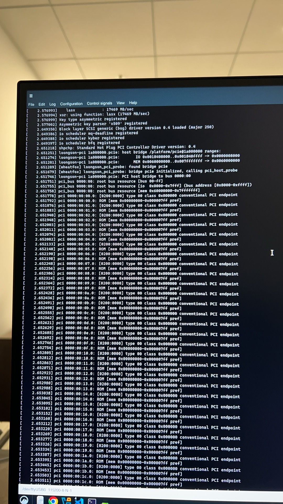

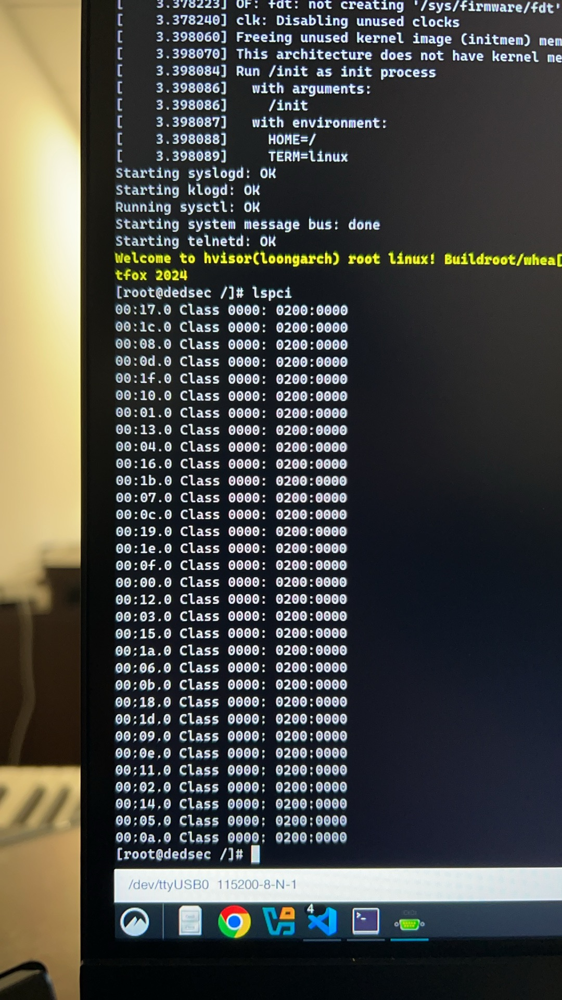

[https://blog.csdn.net/u011037593/article/details/142031554](https://blog.csdn.net/u011037593/article/details/142031554)

http://r12f.com/posts/pcie-1-basics/

```rust
loongson_pci_probe (drivers/pci/controller/pci-loongson.c)
-> pci_host_probe (drivers/pci/probe.c)
   -> pci_scan_root_bus_bridge (.../probe.c)
      -> pci_register_host_bridge (.../probe.c)
      -> pci_scan_child_bus (.../probe.c) // 扫描 bus 下面的所有 device
         -> pci_scan_child_bus_extend (.../probe.c)
            -> pci_scan_slot (.../probe.c)
               -> pci_scan_single_device (.../probe.c)
                  -> pci_scan_device (.../probe.c)
                     -> pci_setup_device (.../probe.c)
                        -> pci_read_bases (.../probe.c)
                           -> __pci_read_base (.../probe.c) // 打印 "pci 0000:00:16.0: ROM [mem 0x00000000-0x000007ff pref]"
                           // 目前看起来已经在 probe device 了，之后需要重点看一下这个函数
   -> pcie_bus_configure_settings (.../probe.c)
      -> pci_walk_bus (drivers/pci/bus.c) // 递归遍历 devices，进行 callback（可以把需要 callback 的函数传到 pci walk bus 参数里）
      // pci_walk_bridge(bridge, report_mmio_enabled, &status);
```

root linux 接上了 pcie，但是 linux probe 得到了很多 devices，看起来不太对，需要继续调查一下，可能需要参考 ACPI 那边的一些参数的设置。

ACPI MCFG

[https://projectacrn.github.io/0.2/developer-guides/ACPI-virt-hld.html](https://projectacrn.github.io/0.2/developer-guides/ACPI-virt-hld.html)

[https://review.haiku-os.org/q/079db73](https://review.haiku-os.org/q/079db73)

## 2025.3.31 记录

给 hvisor uefi packer 添加了加载 vmlinux.efi 的功能（parse PE32+文件），然后尝试直接 root linux 启动 vmlinux.efi 并通过寄存器传递 Systemtable 地址，启动在 UEFI 初始化部分卡死。

[https://www.kernel.org/doc/Documentation/devicetree/bindings/pci/host-generic-pci.txt](https://www.kernel.org/doc/Documentation/devicetree/bindings/pci/host-generic-pci.txt)

[https://admin.pci-ids.ucw.cz/read/PC/0014](https://admin.pci-ids.ucw.cz/read/PC/0014)

搞清楚了那三个地址空间的结构了，在hvisor里加了pci probe的代码：


## 2025.4.1 记录

通过 stage-2 页表映射的 trick （把 GPA 0x00fe_0000_0000 映射到了 HPA 0x0efe_0000_0000，后者是这几天摸索出来的 3系CPU+7A2000主板 上 CPU 空间内访问 HT保留地址空间的地址区域）让 root linux 能枚举 pci 设备了，但是看起来没有按设备树里写的 node 进行初始化，而是把全部设备都初始化了。


[20250402_pci_3a6000_01.log](img/20250820_3A6000_PCIe_Debug_Notes/20250402_pci_3a6000_01.log)

测试 root linux nvme，没有问题：


[https://forums.linuxmint.com/viewtopic.php?t=438301](https://forums.linuxmint.com/viewtopic.php?t=438301)

root linux 加上 intel igb 和 yt6081 的驱动

[https://lore.kernel.org/lkml/9506d808-85b9-4f37-baee-76f3dee56182@lunn.ch/T/#Z2e.:..:20240913124113.9174-1-Frank.Sae::40motor-comm.com:1drivers:net:ethernet:motorcomm:Kconfig](https://lore.kernel.org/lkml/9506d808-85b9-4f37-baee-76f3dee56182@lunn.ch/)

[https://blog.reds.ch/?p=1814#:~:text=First%2C identify the patch or,patches%2C cover letter and messages](https://blog.reds.ch/?p=1814#:~:text=First%2C%20identify%20the%20patch%20or,patches%2C%20cover%20letter%20and%20messages).

[https://lore.kernel.org/all/1482683f626c0743e3ec53161dd291de3a6726f6.camel@mailbox.org/](https://lore.kernel.org/all/1482683f626c0743e3ec53161dd291de3a6726f6.camel@mailbox.org/)

然而 6.13.7 的 driver/net 里面并没有 yt6081 驱动代码。

查了一下 yt6081 是第三方驱动，而且 linux kernel lore mailist 里的 patch 显示最近几周这个网卡公司的人正在向 linux 主线合并这个驱动，尝试用 `b4` 工具给 linux kernel 打 patch：


patch 搞不定。

不过 root linux 里 pcie x4 拓展网卡的驱动能打上，ip addr 能正常显示四个网口：


drm 报错超时，不过 root linux 还是在 vga 屏幕上画了一个 tux（因为没有开SMP所以只有一个核）

之后需要测试 6.13.7 的 nonroot 的 pcie 挂载情况以及 virtio-console、virtio-blk 能不能正常跑

## 2025.4.2 记录

LoongArch KVM 以及 LoongArch IOMMU 调研

有人在自己的网站上神秘地发布了一个龙芯 LoongArch IO 虚拟化的 Table 手册（rev 1，2024-10，草稿）

[https://www.fengxiangsihai.com/uploads/images/2024110517404135188.LoongArch-IO-Virtualization-Table-Specification.pdf](https://www.fengxiangsihai.com/uploads/images/2024110517404135188.LoongArch-IO-Virtualization-Table-Specification.pdf)

[2024110517404135188.LoongArch-IO-Virtualization-Table-Specification.pdf](img/20250820_3A6000_PCIe_Debug_Notes/2024110517404135188.LoongArch-IO-Virtualization-Table-Specification.pdf)

以及找到了 anolis os 对 LoongArch IOMMU 的功能支持 commit （[https://gitee.com/anolis/cloud-kernel/commit/2563439dce9178ba563beac9502e343b999c6e19](https://gitee.com/anolis/cloud-kernel/commit/2563439dce9178ba563beac9502e343b999c6e19)），可参考。

### IOVT (LoongArch I/O Virtualization Table)

结构：

Byte 0-32 为 ACPI header 部分


### IOMMU Table

手册里说 IOMMU 可以通过 pci 设备或者 platform 设备实现（我这边的 3A6000 板子上 IOMMU 是作为 PCI 设备挂载的）。

IOMMU Table 的地址在上一个表中指定 offset（类似 PE32+）

### Device Entry

IOMMU Table 的最后一部分是 device entry[] 数组，每个 entry 表示 IOMMU 能管理的 PCI 设备：


### linux 部分

```makefile
CONFIG_IOMMU_API=y
CONFIG_IOMMU_SUPPORT=y

#
# Generic IOMMU Pagetable Support
#
# end of Generic IOMMU Pagetable Support

# CONFIG_IOMMU_DEBUGFS is not set
CONFIG_IOMMU_DEFAULT_DMA_STRICT=y
# CONFIG_IOMMU_DEFAULT_DMA_LAZY is not set
# CONFIG_IOMMU_DEFAULT_PASSTHROUGH is not set
CONFIG_OF_IOMMU=y
# CONFIG_IOMMUFD is not set
```

root linux 启动 console 里是有 log 的：

```
[    1.641664] iommu: Default domain type: Translated
[    1.641665] iommu: DMA domain TLB invalidation policy: strict mode
```

裸起一个 archlinux，lspci 里能看到 IOMMU pci 设备 (device id `0x7a1f` ，这个 id 在 root linux 里也能看到，请参考前文中 root linux lspci）：

```
00:1a.0 IOMMU: Loongson Technology LLC Device 7a1f
	Control: I/O+ Mem+ BusMaster+ SpecCycle- MemWINV- VGASnoop+ ParErr- Stepping- SERR- FastB2B- DisINTx-
	Status: Cap- 66MHz- UDF- FastB2B- ParErr- DEVSEL=fast >TAbort- <TAbort- <MAbort- >SERR- <PERR- INTx-
	Latency: 0
	Interrupt: pin A routed to IRQ 64
	NUMA node: 0
	Region 0: Memory at e0045969c00 (64-bit, non-prefetchable) [size=1K]
	Region 2: Memory at e0040000000 (64-bit, non-prefetchable) [size=64M]
	Expansion ROM at e0045969000 [disabled] [size=2K]
```


[https://patchew.org/linux/cover.1713523152.git.robin.murphy@arm.com/](https://patchew.org/linux/cover.1713523152.git.robin.murphy@arm.com/)

找了一篇介绍 linux iommu 子系统的文章：

[https://lenovopress.lenovo.com/lp1467.pdf](https://lenovopress.lenovo.com/lp1467.pdf)

看一下 drivers/iommu：

https://www.kernelconfig.io/config_iommu_api


没有看到龙芯自己写的 iommu 代码（不过在 anolis linux 里能看到龙芯员工写的 iommu driver，见下图），前面挂在 PCI 上的 IOMMU 设备用于检查一些关键信息（最大页表级数、地址宽度等、支持的设备列表），**以及给出 IOMMU 的 base addr 和 register size。**

问题：这里的 IOMMU 寄存器空间用的什么规范？（估计文档还没公开，但是我从前面 anolis 的 commit 里发现了一些寄存器字段）：


这个代码来自龙芯（xianglai li [lixianglai@loongson.cn](mailto:lixianglai@loongson.cn)），所以 **IOMMU 寄存器空间结构**可以参考 anolis 这里的代码。

### 问题

板载网卡驱动得有，找龙芯要 4.9 的内核源码和板载网卡驱动？

或者用 linux net-next 测试一下打 patch，用一个 non stable 的 linux kernel 版本（next）

## 2025.4.3 记录

fork 一份最新的 linux git 仓库，然后重新打 patch，成功了，在 config 里可以选上这个新驱动了：


[https://lore.kernel.org/netdev/20220315131215.273450-1-vladimir.oltean@nxp.com/T/](https://lore.kernel.org/netdev/20220315131215.273450-1-vladimir.oltean@nxp.com/T/)

[https://cateee.net/lkddb/web-lkddb/DCB.html](https://cateee.net/lkddb/web-lkddb/DCB.html)


[https://stackoverflow.com/questions/19327523/explain-linux-kernel-state-terminology-e-g-net-next-linux-next-net-git](https://stackoverflow.com/questions/19327523/explain-linux-kernel-state-terminology-e-g-net-next-linux-next-net-git)

menuconfig 添加 net/dcb 和 drivers/net/phy 之后就可以编译过了：


上板启动 linux6.14，root linux没有输出，原因未知。

## 2025.4.9 记录

测试了一下新设备树下 3A6000 新板子的 nonroot virtio-console + virtio-blk：（linux 6.11.6）

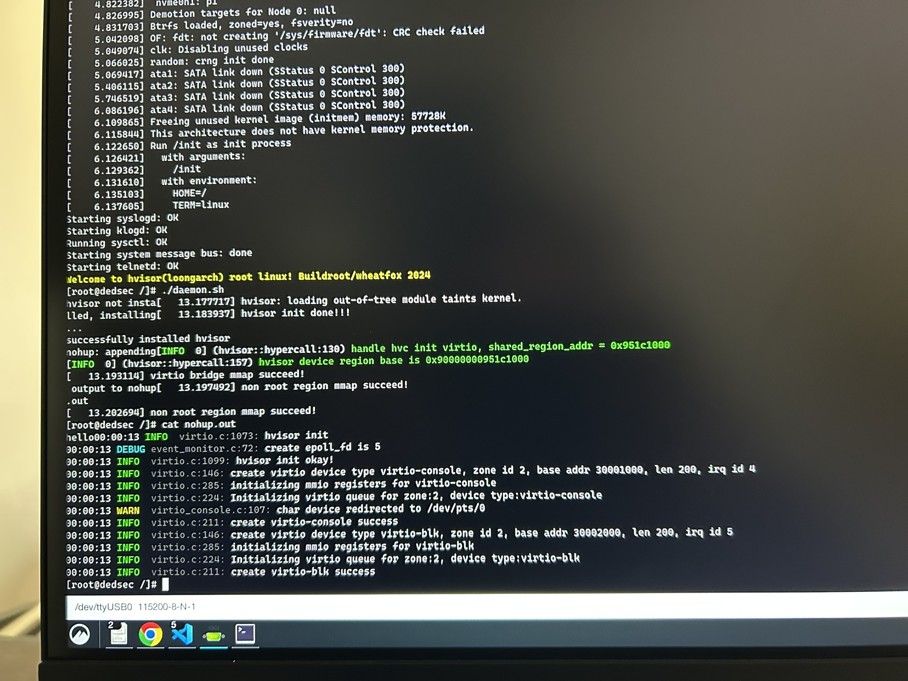

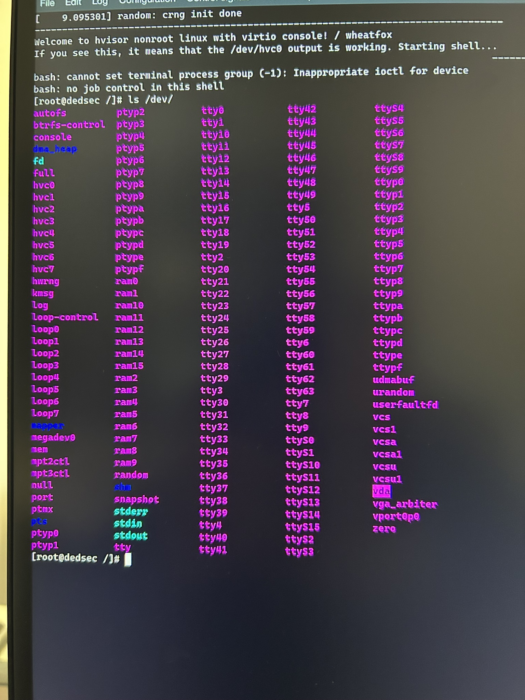

nonroot （设备树添加 pic、eiointc、msi 节点 + 两个 virtio mmio 区域）：

可以看到 nonroot 能够正常启用 virtio-console（hvc0），并且成功加载了 virtio-blk（vda）：

```bash
mount /dev/vda /mnt
ls /mnt
cat /mnt/hello.txt
# hello from virtio blk
```

可以看到 mount 这个虚拟磁盘后可以正常读取里面的文件：

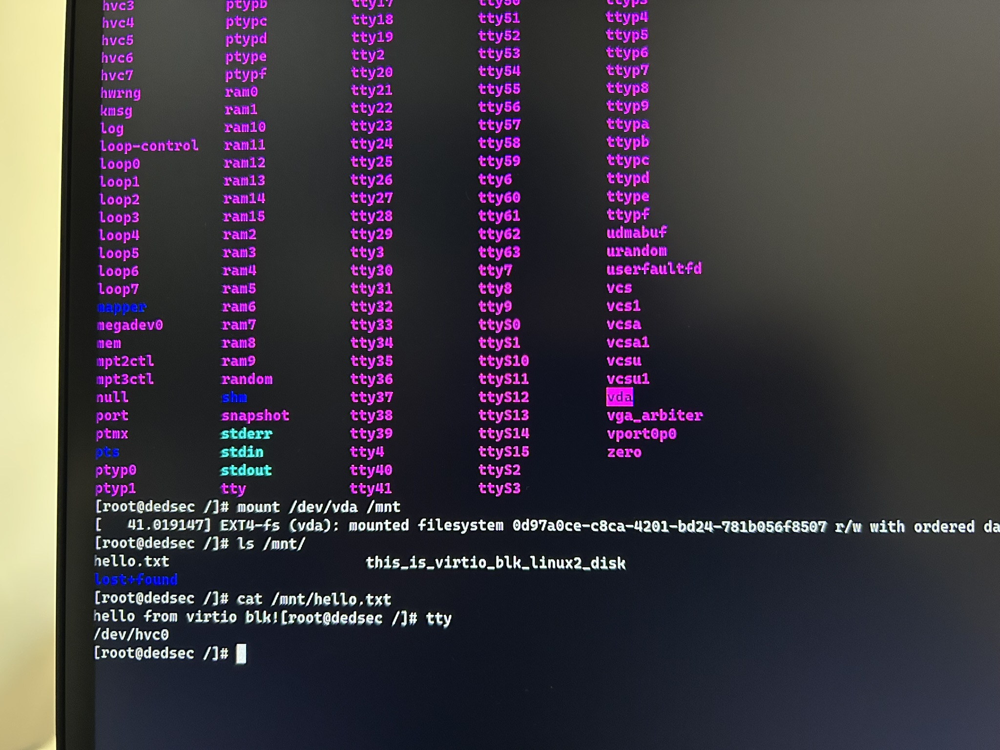

（这里的两个文件是我存放在 root zone 的文件系统中的 `linux2-disk.ext4` 文件里的内容。）

然而当相同的配置+设备树启动 linux 6.13.7 时，出现了很多问题：

1. hvisor-tool 创建 virtio-blk 时内核报错 invalid access
2. nonroot 启动后仅能向 virtio-console 输出一行信息（screen里只能看到一行输出），之后 virtio-console driver 没了任何响应（例如 queue notify），此时 hvisor-tool 和 hvisor 都在正常运行，且能相应 epoll 事件

以上两个问题的原因未知，考虑到上面两个实验的唯一差别是 linux kernel 版本，说明新版本的代码破坏了目前 hvisor virtio 在 loongarch 上运行的流程（包括中断注入等）

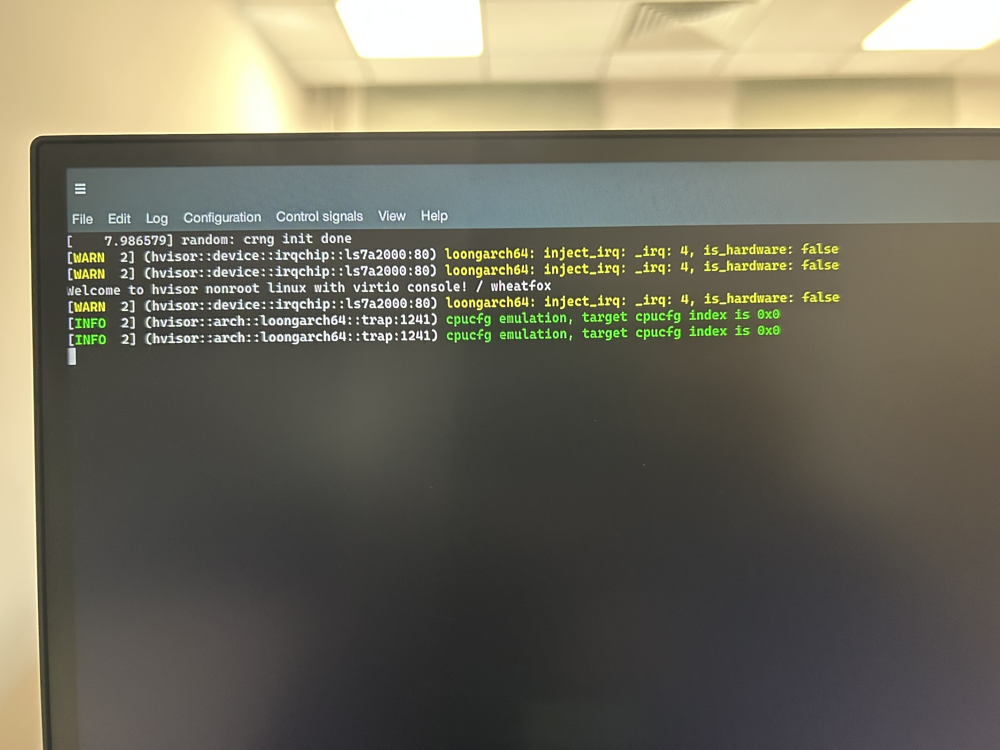

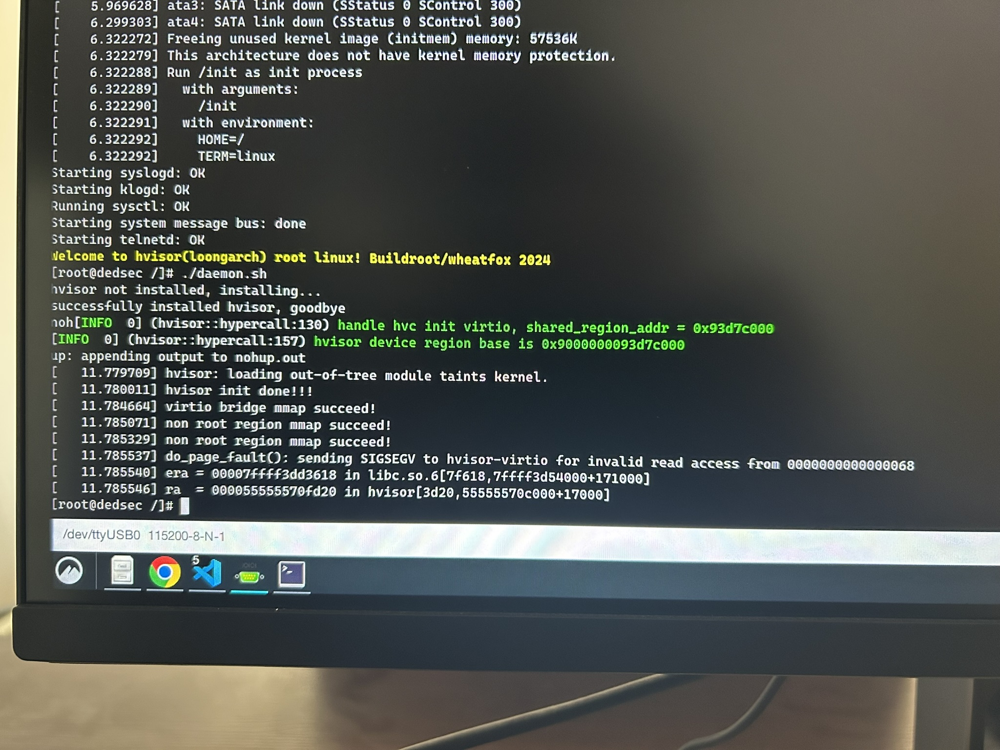

因为调试 virtio 往往需要打印信息，之后考虑把主板上的自带 COM 口（主板后置面板，RS232 公口）分给 nonroot，这样 root 和nonroot 可以同时使用和输入输出，便于之后在其他内核源码上调试 virtio-console。

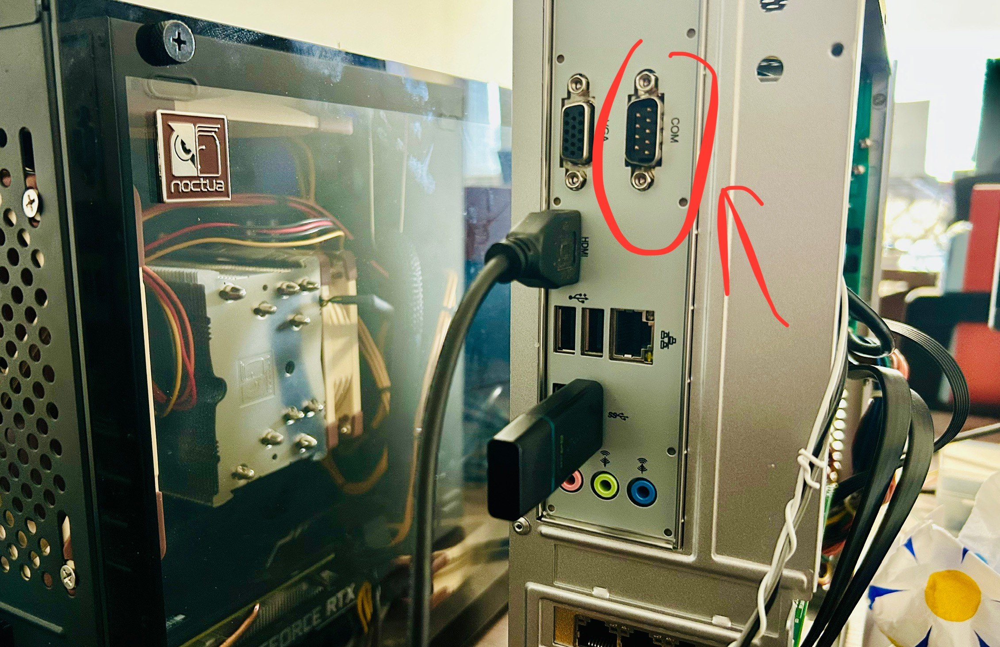

rtc

loongarch64 [https://lore.kernel.org/lkml/20241108091545.4182229-1-chenhuacai@loongson.cn/T/](https://lore.kernel.org/lkml/20241108091545.4182229-1-chenhuacai@loongson.cn/T/)

## 2025.4.14 记录


图中的 VGA+DB9 CON 即为主板后置面板后面最顶上的两个接口（VGA、COM），可以看到 UART1（应为手册里的 UART0？）接到了 1C103，作为主板 PIN 引出，UART0（可能是 UART1？）从 DB9 接口引出。所以第一步是在 hvisor 中尝试初始化这两个串口（默认的 UART0 之前一直在用了，需要试一下 UART1）。

## 2025.4.15 记录

用手册里的 UART1 基地址输出，没有任何反应，再回去看看 ACPI 设备树，发现除了 CPU DEBUG UART 外还有一堆其他的串口地址，0x10080000开始，每 0x100 一个。

尝试把 hvisor 的 UART1 按 ACPI 的参数初始化（频率 50M、基地址按 ACPI 给的来），hvisor 可以向两个串口输出了。

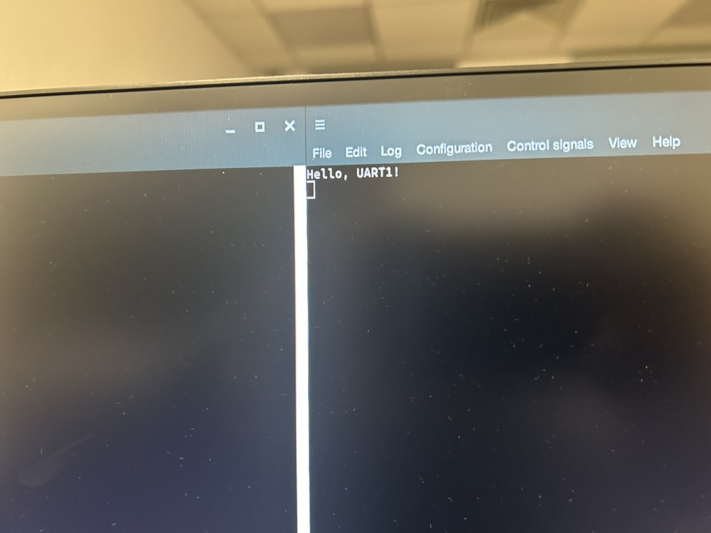


给 nonroot 挂上这个新串口，就可以让其通过新的 COM 口输出了：

```jsx
[    1.436581] 10080000.serial: ttyS0 at MMIO 0x10080000 (irq = 20, base_baud = 3125000) is a 16550A
```


左边是 CPU DEBUG UART0,右边是 nonroot 从主板 COM 口输出的启动日志

然而，noroot 启动后，root linux 就没有反应了，推测是中断控制器的问题，之后调试一下，目标是两个串口可以独立输入+输出。

## 2025.4.16 记录

把两个 uart 从中断树里暂时去掉（即不通过中断而是polling使用两个串口），就没问题了，可以分别在两个物理串口使用root和nonroot：

[https://vimeo.com/1075896922](https://vimeo.com/1075896922)

尝试换成 6.13.7 并关闭 RT 选项，virtio-console 正常：


说明只有在打开实时补丁的时候，virtio 无法正常工作。

目前的问题：

1. linux 6.13 打开 PREEMPT_RT 选项后 virto-console 不能工作
2. linux 6.13 启动 virtio-blk 时 libc 报错，不使用 virtio-blk 时 root linux 这边没有内核报错
3. root 使用 UART0、nonroot UART1，且两个 UART 都挂载 interrupt-parent，会导致 nonroot 启动后，两个串口输入均无反应
4. nonroot 无法加载 PCI 设备（xzk）

下周：看一下龙芯给 liointc、eiointc、msi、pic 中断控制器写的驱动，，捋一下 linux 启动时对设备树相关节点的处理和初始化流程。

## 2025.4.22 记录

1. 在 KVM 的最新代码里找到了 KVM 模拟 eiointc、ipi、pic 三个中断外设的代码，需要重点看一下
2. 参考 QEMU dumpdtb 得到的 dts，将 uart0（或1）绑在 eiointc 上，这样如果之后需要则只需要做 eiointc 模拟，不用管 liointc
3. [https://docs.loongnix.cn/kvm/kvm/loongarch-kvm/description/系统概述.html](https://docs.loongnix.cn/kvm/kvm/loongarch-kvm/description/%E7%B3%BB%E7%BB%9F%E6%A6%82%E8%BF%B0.html)

现在调整了一下配置，root 6.11 非实时，nonroot 6.13 实时

目前出现的现象是有时候 root 里的 hvisor-irtio 崩溃，同时 nonroot 也启动失败

另一个现象是 root hvisor-virtio 存活，但是 nonroot 启动的 log 打印到中级就没后文了：

```jsx
nonroot 6.13.7

...
[    1.201909] NET: Registered PF_XDP protocol family
[    1.201917] PCI: CLS 0 bytes, default 64
[    1.436242] Initialise system trusted keyrings
[    1.436314] workingset: timestamp_bits=46 max_order=17 bucket_order=0
[    1.436345] zbud: loaded
[    1.436611] squashfs: version 4.0 (2009/01/31) Phillip Lougher
[    1.436777] SGI XFS with ACLs, security attributes, quota, no debug enabled
[    1.437001] xor: measuring software checksum speed
[    1.437239]    8regs           : 13918 MB/sec
[    1.437597]    8regs_prefetch  :  9230 MB/sec
[    1.437834]    32regs          : 13959 MB/sec
[    1.438191]    32regs_prefetch :  9216 MB/sec
[    1.438424]    lsx             : 14129 MB/sec
[    1.438613]    lasx            : 17512 MB/sec
[    1.438614] xor: using function: lasx (17512 MB/sec)
[    1.438620] Key type asymmetric registered
[    1.438622] Asymmetric key parser 'x509' registered
[    1.440869] Block layer SCSI generic (bsg) driver version 0.4 loaded (major 250)
[    1.440935] io scheduler mq-deadline registered
[    1.440939] io sc

// 一行打了一半就没后文了t
```

nonroot启用virtio后，init之后就没法输入输出了，然后每过十几秒会运行一个cpucfg指令：

```jsx
[root@dedsec /]# [DEBUG 2] (hvisor::arch::loongarch64::trap:201) loongarch64: trap_handler: GSPR(Guest Sensitive Privileged Resource) ecode=0x16 esubcode=0x0 is=0x0 badv=0x30001050 badi=0x6ca5 era=0x900000000023bc34
[INFO  2] (hvisor::arch::loongarch64::trap:1247) cpucfg emulation, target cpucfg index is 0x0
[DEBUG 2] (hvisor::arch::loongarch64::trap:255) loongarch64: trap_handler: return

900000000023b78c <__show_regs>:

// arch/loongarch/kernel/traps.c

static void __show_regs(const struct pt_regs *regs)
{
	const int field = 2 * sizeof(unsigned long);
	unsigned int exccode = FIELD_GET(CSR_ESTAT_EXC, regs->csr_estat);

	show_regs_print_info(KERN_DEFAULT);

	/* Print saved GPRs except $zero (substituting with PC/ERA) */
#define GPR_FIELD(x) field, regs->regs[x]
	printk("pc %0*lx ra %0*lx tp %0*lx sp %0*lx\n",
	       field, regs->csr_era, GPR_FIELD(1), GPR_FIELD(2), GPR_FIELD(3));
	printk("a0 %0*lx a1 %0*lx a2 %0*lx a3 %0*lx\n",
	       GPR_FIELD(4), GPR_FIELD(5), GPR_FIELD(6), GPR_FIELD(7));
	printk("a4 %0*lx a5 %0*lx a6 %0*lx a7 %0*lx\n",
	       GPR_FIELD(8), GPR_FIELD(9), GPR_FIELD(10), GPR_FIELD(11));
	printk("t0 %0*lx t1 %0*lx t2 %0*lx t3 %0*lx\n",
	       GPR_FIELD(12), GPR_FIELD(13), GPR_FIELD(14), GPR_FIELD(15));
	printk("t4 %0*lx t5 %0*lx t6 %0*lx t7 %0*lx\n",
	       GPR_FIELD(16), GPR_FIELD(17), GPR_FIELD(18), GPR_FIELD(19));
	printk("t8 %0*lx u0 %0*lx s9 %0*lx s0 %0*lx\n",
	       GPR_FIELD(20), GPR_FIELD(21), GPR_FIELD(22), GPR_FIELD(23));
	printk("s1 %0*lx s2 %0*lx s3 %0*lx s4 %0*lx\n",
	       GPR_FIELD(24), GPR_FIELD(25), GPR_FIELD(26), GPR_FIELD(27));
	printk("s5 %0*lx s6 %0*lx s7 %0*lx s8 %0*lx\n",
	       GPR_FIELD(28), GPR_FIELD(29), GPR_FIELD(30), GPR_FIELD(31));

	/* The slot for $zero is reused as the syscall restart flag */
	if (regs->regs[0])
		printk("syscall restart flag: %0*lx\n", GPR_FIELD(0));

	if (user_mode(regs)) {
		printk("   ra: %0*lx\n", GPR_FIELD(1));
		printk("  ERA: %0*lx\n", field, regs->csr_era);
	} else {
		printk("   ra: %0*lx %pS\n", GPR_FIELD(1), (void *) regs->regs[1]);
		printk("  ERA: %0*lx %pS\n", field, regs->csr_era, (void *) regs->csr_era);
	}
#undef GPR_FIELD

	/* Print saved important CSRs */
	print_crmd(regs->csr_crmd);
	print_prmd(regs->csr_prmd);
	print_euen(regs->csr_euen);
	print_ecfg(regs->csr_ecfg);
	print_estat(regs->csr_estat);

	if (exccode >= EXCCODE_TLBL && exccode <= EXCCODE_ALE)
		printk(" BADV: %0*lx\n", field, regs->csr_badvaddr);

	printk(" PRID: %08x (%s, %s)\n", read_cpucfg(LOONGARCH_CPUCFG0),
	       cpu_family_string(), cpu_full_name_string());
}

void show_regs(struct pt_regs *regs)
{
	__show_regs((struct pt_regs *)regs);
	dump_stack();
}

void show_registers(struct pt_regs *regs)
{
	__show_regs(regs);
	print_modules();
	printk("Process %s (pid: %d, threadinfo=%p, task=%p)\n",
	       current->comm, current->pid, current_thread_info(), current);

	show_stacktrace(current, regs, KERN_DEFAULT, user_mode(regs));
	show_code((void *)regs->csr_era, user_mode(regs));
	printk("\n");
}
```

说明 nonroot 的内核并没有 panic（每隔一段时间 dumpregs 应该是某个 warning 而不是 panic），但是只要初始化了 virtio 相关的设备并启用了 RT 选项，COM1 就会在启动后期崩掉（可能还是eiointc的问题？）目前已知 com1 的功能是通过桥片+eiointc实现的（如果nonroot不挂eiointc，则com1就没有输出了）。

## 2025.4.24记录

尝试交换串口，让nonroot用简单一点的uart0，root用eiointc+com1，测试：

root **6.11.6 *PREEMPT_DYNAMIC*** COM1

nonroot **6.13.7 *PREEMPT_RT*** UART0

| case | 6.13.7 启用 **PREEPMT_RT** | 6.13.7 关闭 PREEPMT_RT |
| --- | --- | --- |
| no virtio | ✅，两个zone均可进bash并使用 | ✅，两个zone均可进bash并使用 |
| console only | ❌，driver初始化正常，两个串口都还没寄，root正常，nonroot进不去bash，root screen也没反应 | ⚠️✅， nonroot 进不到 bash，virtio-console 可以用 |
| blk only | ❌，driver初始化正常（？），nonroot 内核在virtio-blk log之后，串口就寄了，输入没反应，root 正常 | ✅，nonroot 可以进到串口 bash，并 mount vda，没有任何问题 |
| console + blk | ❌ 初始化 blk 后串口无反应 | ⚠️✅，但是 nonroot 看不到bash，console 和 blk 可以在 screen 正常使用 |

也就是说问题出现在：

1. **启用** FULL PREEMPT RT 功能
2. 初始化任何一个 virtio device **之后**

继续测试，尝试把 nonroot dts 里的 virtio mmio 的 interrupt-parent 去掉，nonroot 初始化 virtio blk 时中断报错，但是能继续启动到 shel

[https://wiki.linuxfoundation.org/realtime/documentation/technical_basics/preemption_models](https://wiki.linuxfoundation.org/realtime/documentation/technical_basics/preemption_models)

- **Preemptible Kernel (Low-Latency Desktop)** – *reduces the latency of the kernel by making all kernel code (that is not executing in a critical section) preemptible*. An implicit preemption point is located after each preemption disable section.
- **Preemptible Kernel (Basic RT)** – resembles the “Preemptible Kernel (Low-Latency Desktop)” model. Besides the properties mentioned above, threaded interrupt handlers are forced (as when using the kernel command line parameter `threadirqs`). This model is mainly used for testing and debugging of substitution mechanisms implemented by the PREEMPT_RT patch.
- [**Fully Preemptible Kernel (RT)**](https://wiki.linuxfoundation.org/realtime/documentation/technical_details/start) – all kernel code is preemptible except for a few selected critical sections. Threaded interrupt handlers are forced. Furthermore several substitution mechanisms like sleeping spinlocks and rt_mutex are implemented to reduce preemption disabled sections. Additionally, large preemption disabled sections are substituted by separate locking constructs. This preemption model has to be selected in order to obtain real-time behavior.

[https://wiki.linuxfoundation.org/realtime/documentation/howto/tools/ticklesskernel](https://wiki.linuxfoundation.org/realtime/documentation/howto/tools/ticklesskernel)

For a long time Linux kernel have a periodic interrupt that makes the kernel scheduler to balance and schedule threads running among the CPU's. This interrupt is known as the **timer tick** and it is generated at a fixed rate 100-1000 HZ on each CPU or core. The kernel serviced this interrupt regardless of the power state of the CPU. This mode is enabled by option `CONFIG_HZ_PERIODIC`.

`CONFIG_NO_HZ_IDLE` mode allows the CPU not to be disturbed when idle and can save power because it just wakes up the CPU when needed to service the timer.

Full dynticks system (tickless) mode is enabled by `CONFIG_NO_HZ_FULL` and activated by [nohz_full boot parameter](https://docs.kernel.org/admin-guide/kernel-parameters.html#cpu-lists). The kernel adaptively tries to shutdown the tick whenever possible, even when the CPU is running tasks with function `tick_nohz_full_cpu`.

尝试先挂到 liointc 中，初始化正常了，但是还是在启动的最后卡住了：

```
[DEBUG 2] (hvisor::arch::loongarch64::trap:308) exception: PIL(Page Illegal Load): ecode=0x1, esubcode=0x0, era=0x90000000009f4380, is=0x0, badi=0x2400fd84, badv=0x300020fc
[DEBUG 2] (hvisor::arch::loongarch64::trap:459) !!!! <- read mmio_access@0x300020fc s=0x4 v=0x0
[DEBUG 2] (hvisor::arch::loongarch64::trap:469) handle mmio success, v=0x0
[DEBUG 2] (hvisor::arch::loongarch64::trap:488) read from mmio, raw=0x0, trimmed=0x0, extended=0x0
[DEBUG 2] (hvisor::arch::loongarch64::trap:255) loongarch64: trap_handler: return
[DEBUG 2] (hvisor::arch::loongarch64::trap:201) loongarch64: trap_handler: PIL(Page Illegal Load) ecode=0x1 esubcode=0x0 is=0x0 badv=0x30002070 badi=0x24007184 era=0x90000000009f386c
[DEBUG 2] (hvisor::arch::loongarch64::trap:308) exception: PIL(Page Illegal Load): ecode=0x1, esubcode=0x0, era=0x90000000009f386c, is=0x0, badi=0x24007184, badv=0x30002070
[DEBUG 2] (hvisor::arch::loongarch64::trap:459) !!!! <- read mmio_access@0x30002070 s=0x4 v=0x0
[DEBUG 2] (hvisor::arch::loongarch64::trap:469) handle mmio success, v=0xb
[DEBUG 2] (hvisor::arch::loongarch64::trap:488) read from mmio, raw=0xb, trimmed=0xb, extended=0xb
[DEBUG 2] (hvisor::arch::loongarch64::trap:255) loongarch64: trap_handler: return
[    2.712064] virtio_blk virtio0: [vda] 16384 512-byte logical blocks (8.39 MB/8.00 MiB)
[DEBUG 2] (hvisor::arch::loongarch64::trap:201) loongarch64: trap_handler: PIS(Page Illegal Store) ecode=0x2 esubcode=0x0 is=0x0 badv=0x30002070 badi=0x2981c185 era=0x90000000009f43a8
[DEBUG 2] (hvisor::arch::loongarch64::trap:308) exception: PIS(Page Illegal Store): ecode=0x2, esubcode=0x0, era=0x90000000009f43a8, is=0x0, badi=0x2981c185, badv=0x30002070
[DEBUG 2] (hvisor::arch::loongarch64::trap:459) !!!! ->write mmio_access@0x30002070 s=0x4 v=0xf
[DEBUG 2] (hvisor::arch::loongarch64::trap:469) handle mmio success, v=0xf
[DEBUG 2] (hvisor::arch::loongarch64::trap:255) loongarch64: trap_handler: return
[DEBUG 2] (hvisor::arch::loongarch64::trap:201) loongarch64: trap_handler: PIS(Page Illegal Store) ecode=0x2 esubcode=0x0 is=0x0 badv=0x30002050 badi=0x2981418d era=0x90000000009f3768
[DEBUG 2] (hvisor::arch::loongarch64::trap:308) exception: PIS(Page Illegal Store): ecode=0x2, esubcode=0x0, era=0x90000000009f3768, is=0x0, badi=0x2981418d, badv=0x30002050
[DEBUG 2] (hvisor::arch::loongarch64::trap:459) !!!! ->write mmio_access@0x30002050 s=0x4 v=0x0
[DEBUG 2] (hvisor::device::virtio_trampoline:50) notify !!!, cpu id is 2
[DEBUG 2] (hvisor::arch::loongarch64::trap:469) handle mmio success, v=0x0
[DEBUG 0] (hvisor::arch::loongarch64::trap:201) loongarch64: trap_handler: HVC(Hypervisor Call) ecode=0x17 esubcode=0x0 is=0x0 badv=0x0 badi=0x2b8000 era=0xffff800002002378
[DEBUG 2] (hvisor::arch::loongarch64::trap:255) loongarch64: trap_handler: return
[DEBUG 0] (hvisor::arch::loongarch64::trap:1217) HVC exception, HVC call code: 0x1, arg0: 0x0, arg1: 0x0
[DEBUG 0] (hvisor::hypercall:71) hypercall: code=HvVirtioInjectIrq, arg0=0x0, arg1=0x0
[DEBUG 0] (hvisor::hypercall:163) hv_virtio_inject_irq: hypercall for trigger target cpu to inject irq
[DEBUG 0] (hvisor::hypercall:187) hv_virtio_inject_irq: cpu 2 status: Idle
[DEBUG 0] (hvisor::event:141) loongarch64:: send_event: cpu_id: 2, ipi_int_id: 7, event_id: 2
[DEBUG 0] (hvisor::arch::loongarch64::ipi:32) loongarch64: arch_send_event: sending event to cpu: 2, sgi_num: 7
[DEBUG 0] (hvisor::arch::loongarch64::ipi:186) ipi_write_action_legacy: sending action: 0x7 to cpu: 2
[DEBUG 0] (hvisor::arch::loongarch64::ipi:201) ipi_write_action_legacy: finished sending action: 0x7 to cpu: 2
[DEBUG 2] (hvisor::arch::loongarch64::trap:201) loongarch64: trap_handler: INT(Interrupt) ecode=0x0 esubcode=0x0 is=0x1000 badv=0x30002050 badi=0x6488000 era=0x900000000023a08c
[DEBUG 0] (hvisor::arch::loongarch64::trap:1230) HVC result: 0x0
[DEBUG 0] (hvisor::arch::loongarch64::trap:255) loongarch64: trap_handler: return
[DEBUG 2] (hvisor::arch::loongarch64::trap:283) This is an interrupt exception, is=0x1000, ecfg.lie=IPI
[DEBUG 2] (hvisor::arch::loongarch64::trap:1184) ipi interrupt, status = 0x7
[DEBUG 2] (hvisor::arch::loongarch64::trap:1189) this cpu's events: [2]
[WARN  2] (hvisor::device::irqchip::ls7a2000:88) loongarch64: inject_irq: _irq: 5, is_hardware: false
[DEBUG 2] (hvisor::arch::loongarch64::ipi:267) clear_all_ipi: IPI status for cpu 2: 0x0
[DEBUG 2] (hvisor::arch::loongarch64::ipi:252) enable_ipi: IPI enabled for cpu 2
[DEBUG 2] (hvisor::arch::loongarch64::trap:255) loongarch64: trap_handler: return
[    2.825177] random: crng init done

```

对比一下正常的 virtio-blk 启动：

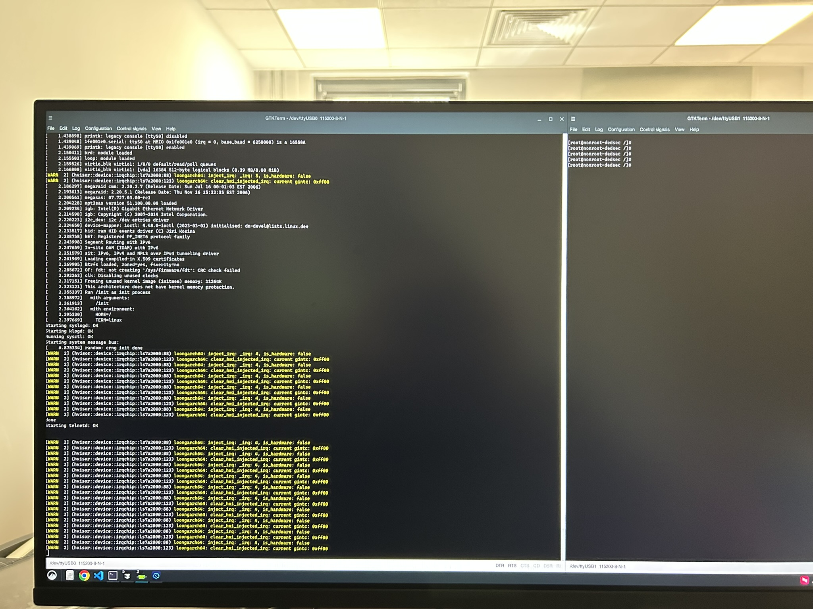

推理：

1. 问题都发生在 virtio blk 和 console 初始化之后，基本的初始化没问题，但是从正常的流程来看，初始化成功后，virtio blk 是会发一些请求，然后可以看到 hvisor 注入了一个中断
2. 但是这个 inject 并没有对应的 clear（这会导致中断注入 bit 始终为 1，此时 Guest 被持续注入中断（LVZ中的机制是只有把这个bit清掉才能停止中断，KVM因为是基于 timer 调度的，所以很快就可以把这个 injection 清理掉，但是 hvisor 没有 timer 调度，inject 必须和对应的 clear 配对，否则 Guest 被持续不断的注入中断）。
3. 这也可以解释为什么串口也寄了（Host 在给 Guest 一刻不停地发中断），内核可能在不停地处理这个注入
4. 理论上中断注入后，virtio-blk 的 handler 会处理中断，通知 backend ack irq，然后 backend 才把这个 injection 清理掉，**目前不知道为什么 virio-blk 在启动 RT 选项后收不到中断，关闭后就收到了——RT 里的 threaded irq handling 的问题？**

目前的一个可能的解释是，RT的 threaded irq handling 模型导致 virtio driver 收不到 hvisor 注入的中断，然后由于没有配对的 clear irq inject 导致 hvisor 不停注入中断，导致一些奇奇怪怪的问题

调查一下 linux preempt_rt 的修改，首先发现 arch 和 drivers 目录下，基本没有出现 CONFIG_PREEMPT_RT，主要的修改位于内核本身：

```clike
// include/linux/interrupt.h:

ifdef CONFIG_IRQ_FORCED_THREADING
# ifdef CONFIG_PREEMPT_RT
#  define force_irqthreads()	(true)
# else
DECLARE_STATIC_KEY_FALSE(force_irqthreads_key);
#  define force_irqthreads()	(static_branch_unlikely(&force_irqthreads_key))
# endif
#else
#define force_irqthreads()	(false)
#endif

/*
 * These correspond to the IORESOURCE_IRQ_* defines in
 * linux/ioport.h to select the interrupt line behaviour.  When
 * requesting an interrupt without specifying a IRQF_TRIGGER, the
 * setting should be assumed to be "as already configured", which
 * may be as per machine or firmware initialisation.
 */
#define IRQF_TRIGGER_NONE	0x00000000
#define IRQF_TRIGGER_RISING	0x00000001
#define IRQF_TRIGGER_FALLING	0x00000002
#define IRQF_TRIGGER_HIGH	0x00000004
#define IRQF_TRIGGER_LOW	0x00000008
#define IRQF_TRIGGER_MASK	(IRQF_TRIGGER_HIGH | IRQF_TRIGGER_LOW | \
				 IRQF_TRIGGER_RISING | IRQF_TRIGGER_FALLING)
#define IRQF_TRIGGER_PROBE	0x00000010

/*
 * These flags used only by the kernel as part of the
 * irq handling routines.
 *
 * IRQF_SHARED - allow sharing the irq among several devices
 * IRQF_PROBE_SHARED - set by callers when they expect sharing mismatches to occur
 * IRQF_TIMER - Flag to mark this interrupt as timer interrupt
 * IRQF_PERCPU - Interrupt is per cpu
 * IRQF_NOBALANCING - Flag to exclude this interrupt from irq balancing
 * IRQF_IRQPOLL - Interrupt is used for polling (only the interrupt that is
 *                registered first in a shared interrupt is considered for
 *                performance reasons)
 * IRQF_ONESHOT - Interrupt is not reenabled after the hardirq handler finished.
 *                Used by threaded interrupts which need to keep the
 *                irq line disabled until the threaded handler has been run.
 * IRQF_NO_SUSPEND - Do not disable this IRQ during suspend.  Does not guarantee
 *                   that this interrupt will wake the system from a suspended
 *                   state.  See Documentation/power/suspend-and-interrupts.rst
 * IRQF_FORCE_RESUME - Force enable it on resume even if IRQF_NO_SUSPEND is set
 * IRQF_NO_THREAD - Interrupt cannot be threaded
 * IRQF_EARLY_RESUME - Resume IRQ early during syscore instead of at device
 *                resume time.
 * IRQF_COND_SUSPEND - If the IRQ is shared with a NO_SUSPEND user, execute this
 *                interrupt handler after suspending interrupts. For system
 *                wakeup devices users need to implement wakeup detection in
 *                their interrupt handlers.
 * IRQF_NO_AUTOEN - Don't enable IRQ or NMI automatically when users request it.
 *                Users will enable it explicitly by enable_irq() or enable_nmi()
 *                later.
 * IRQF_NO_DEBUG - Exclude from runnaway detection for IPI and similar handlers,
 *		   depends on IRQF_PERCPU.
 * IRQF_COND_ONESHOT - Agree to do IRQF_ONESHOT if already set for a shared
 *                 interrupt.
 */
#define IRQF_SHARED		0x00000080
#define IRQF_PROBE_SHARED	0x00000100
#define __IRQF_TIMER		0x00000200
#define IRQF_PERCPU		0x00000400
#define IRQF_NOBALANCING	0x00000800
#define IRQF_IRQPOLL		0x00001000
#define IRQF_ONESHOT		0x00002000
#define IRQF_NO_SUSPEND		0x00004000
#define IRQF_FORCE_RESUME	0x00008000
#define IRQF_NO_THREAD		0x00010000
#define IRQF_EARLY_RESUME	0x00020000
#define IRQF_COND_SUSPEND	0x00040000
#define IRQF_NO_AUTOEN		0x00080000
#define IRQF_NO_DEBUG		0x00100000
#define IRQF_COND_ONESHOT	0x00200000

#define IRQF_TIMER		(__IRQF_TIMER | IRQF_NO_SUSPEND | IRQF_NO_THREAD)
```


## 2025.4.25 记录

修改 virtio mmio 驱动代码，在申请 irq 时额外加一个 no threaded 的 flag，然后 virtio 的中断注入也能收到了。

[OSPERT09-Henriques.pdf](img/20250820_3A6000_PCIe_Debug_Notes/OSPERT09-Henriques.pdf)


## 2025.4.28 记录

```clike
/**
 * struct irq_chip - hardware interrupt chip descriptor
 *
 * @name:		name for /proc/interrupts
 * @irq_startup:	start up the interrupt (defaults to ->enable if NULL)
 * @irq_shutdown:	shut down the interrupt (defaults to ->disable if NULL)
 * @irq_enable:		enable the interrupt (defaults to chip->unmask if NULL)
 * @irq_disable:	disable the interrupt
 * @irq_ack:		start of a new interrupt
 * @irq_mask:		mask an interrupt source
 * @irq_mask_ack:	ack and mask an interrupt source
 * @irq_unmask:		unmask an interrupt source
 * @irq_eoi:		end of interrupt
 * @irq_set_affinity:	Set the CPU affinity on SMP machines. If the force
 *			argument is true, it tells the driver to
 *			unconditionally apply the affinity setting. Sanity
 *			checks against the supplied affinity mask are not
 *			required. This is used for CPU hotplug where the
 *			target CPU is not yet set in the cpu_online_mask.
 * @irq_retrigger:	resend an IRQ to the CPU
 * @irq_set_type:	set the flow type (IRQ_TYPE_LEVEL/etc.) of an IRQ
 * @irq_set_wake:	enable/disable power-management wake-on of an IRQ
 * @irq_bus_lock:	function to lock access to slow bus (i2c) chips
 * @irq_bus_sync_unlock:function to sync and unlock slow bus (i2c) chips
 * @irq_cpu_online:	configure an interrupt source for a secondary CPU
 * @irq_cpu_offline:	un-configure an interrupt source for a secondary CPU
 * @irq_suspend:	function called from core code on suspend once per
 *			chip, when one or more interrupts are installed
 * @irq_resume:		function called from core code on resume once per chip,
 *			when one ore more interrupts are installed
 * @irq_pm_shutdown:	function called from core code on shutdown once per chip
 * @irq_calc_mask:	Optional function to set irq_data.mask for special cases
 * @irq_print_chip:	optional to print special chip info in show_interrupts
 * @irq_request_resources:	optional to request resources before calling
 *				any other callback related to this irq
 * @irq_release_resources:	optional to release resources acquired with
 *				irq_request_resources
 * @irq_compose_msi_msg:	optional to compose message content for MSI
 * @irq_write_msi_msg:	optional to write message content for MSI
 * @irq_get_irqchip_state:	return the internal state of an interrupt
 * @irq_set_irqchip_state:	set the internal state of a interrupt
 * @irq_set_vcpu_affinity:	optional to target a vCPU in a virtual machine
 * @ipi_send_single:	send a single IPI to destination cpus
 * @ipi_send_mask:	send an IPI to destination cpus in cpumask
 * @irq_nmi_setup:	function called from core code before enabling an NMI
 * @irq_nmi_teardown:	function called from core code after disabling an NMI
 * @flags:		chip specific flags
 */
struct irq_chip {
	const char	*name;
	unsigned int	(*irq_startup)(struct irq_data *data);
	void		(*irq_shutdown)(struct irq_data *data);
	void		(*irq_enable)(struct irq_data *data);
	void		(*irq_disable)(struct irq_data *data);

	void		(*irq_ack)(struct irq_data *data);
	void		(*irq_mask)(struct irq_data *data);
	void		(*irq_mask_ack)(struct irq_data *data);
	void		(*irq_unmask)(struct irq_data *data);
	void		(*irq_eoi)(struct irq_data *data);

	int		(*irq_set_affinity)(struct irq_data *data, const struct cpumask *dest, bool force);
	int		(*irq_retrigger)(struct irq_data *data);
	int		(*irq_set_type)(struct irq_data *data, unsigned int flow_type);
	int		(*irq_set_wake)(struct irq_data *data, unsigned int on);

	void		(*irq_bus_lock)(struct irq_data *data);
	void		(*irq_bus_sync_unlock)(struct irq_data *data);

#ifdef CONFIG_DEPRECATED_IRQ_CPU_ONOFFLINE
	void		(*irq_cpu_online)(struct irq_data *data);
	void		(*irq_cpu_offline)(struct irq_data *data);
#endif
	void		(*irq_suspend)(struct irq_data *data);
	void		(*irq_resume)(struct irq_data *data);
	void		(*irq_pm_shutdown)(struct irq_data *data);

	void		(*irq_calc_mask)(struct irq_data *data);

	void		(*irq_print_chip)(struct irq_data *data, struct seq_file *p);
	int		(*irq_request_resources)(struct irq_data *data);
	void		(*irq_release_resources)(struct irq_data *data);

	void		(*irq_compose_msi_msg)(struct irq_data *data, struct msi_msg *msg);
	void		(*irq_write_msi_msg)(struct irq_data *data, struct msi_msg *msg);

	int		(*irq_get_irqchip_state)(struct irq_data *data, enum irqchip_irq_state which, bool *state);
	int		(*irq_set_irqchip_state)(struct irq_data *data, enum irqchip_irq_state which, bool state);

	int		(*irq_set_vcpu_affinity)(struct irq_data *data, void *vcpu_info);

	void		(*ipi_send_single)(struct irq_data *data, unsigned int cpu);
	void		(*ipi_send_mask)(struct irq_data *data, const struct cpumask *dest);

	int		(*irq_nmi_setup)(struct irq_data *data);
	void		(*irq_nmi_teardown)(struct irq_data *data);

	unsigned long	flags;
};
```

drivers/irqchip/irq-loongarch-cpu.c

```clike
static struct irq_chip cpu_irq_controller = {
	.name		= "CPUINTC",
	.irq_mask	= mask_loongarch_irq,
	.irq_unmask	= unmask_loongarch_irq,
};

static int loongarch_cpu_intc_map(struct irq_domain *d, unsigned int irq,
			     irq_hw_number_t hwirq)
{
	irq_set_noprobe(irq);
	irq_set_chip_and_handler(irq, &cpu_irq_controller, handle_percpu_irq);

	return 0;
}

static void handle_cpu_irq(struct pt_regs *regs)
{
	int hwirq;
	unsigned int estat = read_csr_estat() & CSR_ESTAT_IS;

	while ((hwirq = ffs(estat))) {
		estat &= ~BIT(hwirq - 1);
		generic_handle_domain_irq(irq_domain, hwirq - 1);
	}
}

#ifdef CONFIG_OF
static int __init cpuintc_of_init(struct device_node *of_node,
				struct device_node *parent)
{
	cpuintc_handle = of_node_to_fwnode(of_node);

	irq_domain = irq_domain_create_linear(cpuintc_handle, EXCCODE_INT_NUM,
				&loongarch_cpu_intc_irq_domain_ops, NULL);
	if (!irq_domain)
		panic("Failed to add irqdomain for loongarch CPU");

	set_handle_irq(&handle_cpu_irq);

	return 0;
}
IRQCHIP_DECLARE(cpu_intc, "loongson,cpu-interrupt-controller", cpuintc_of_init);
#endif
```

liointc

```clike
struct liointc_handler_data {
	struct liointc_priv	*priv;
	u32			parent_int_map;
};

struct liointc_priv {
	struct irq_chip_generic		*gc;
	struct liointc_handler_data	handler[LIOINTC_NUM_PARENT];
	void __iomem			*core_isr[LIOINTC_NUM_CORES];
	u8				map_cache[LIOINTC_CHIP_IRQ];
	u32				int_pol;
	u32				int_edge;
	bool				has_lpc_irq_errata;
};

liointc_priv
 ├── gc (管理中断chip组)
 ├── handler[] (父中断分组数据)
 ├── core_isr[] (CPU核中断状态寄存器)
 ├── map_cache (子IRQ到Parent映射缓存)
 ├── int_pol / int_edge (中断极性和触发方式)
 └── has_lpc_irq_errata (补丁兼容)
```

```cpp
static inline void *irq_desc_get_handler_data(struct irq_desc *desc)
{
	return desc->irq_common_data.handler_data;
}
```

## 2025.5.5 记录

继续看 driver 和 kvm 代码，然后捋一下linux启动时的mmio log（下面的 log 按照出现的先后次序）：

```clike
// CHIP config regs
0x8, size: 4, R <-  0x27ff
0x10, size: 8, R <-  0x6e6f73676e6f6f4c
0x20, size: 8, R <-  0x4c2d303030364133
// core0 ipi enable
0x1004, size: 4, W ->  0xffffffffffffffff
// liointc control regs
0x142c, size: 4, W ->  0xffffffffffffffff // int_en_clr
0x1434, size: 4, W ->  0x0 // int_edge，全部为电平触发

// liointc route regs 1400-141f，共32组
// [7:4] target cpu INT number
// [3:0] target cpu core number
0x1400, size: 1, W ->  0x11 // 8b'0001_0001 -> CPU0-INT0，和设备树里的mapping一致，问题：nonroot是不是就会路由到 cpu core number = 2？
0x1401, size: 1, W ->  0x11
0x1402, size: 1, W ->  0x11
0x1403, size: 1, W ->  0x11
0x1404, size: 1, W ->  0x11
0x1405, size: 1, W ->  0x11
0x1406, size: 1, W ->  0x11
0x1407, size: 1, W ->  0x11
0x1408, size: 1, W ->  0x11
0x1409, size: 1, W ->  0x11
0x140a, size: 1, W ->  0x11
0x140b, size: 1, W ->  0x11
0x140c, size: 1, W ->  0x11
0x140d, size: 1, W ->  0x11
0x140e, size: 1, W ->  0x11
0x140f, size: 1, W ->  0x11
0x1410, size: 1, W ->  0x11
0x1411, size: 1, W ->  0x11
0x1412, size: 1, W ->  0x11
0x1413, size: 1, W ->  0x11
0x1414, size: 1, W ->  0x11
0x1415, size: 1, W ->  0x11
0x1416, size: 1, W ->  0x11
0x1417, size: 1, W ->  0x11
0x1418, size: 1, W ->  0x11
0x1419, size: 1, W ->  0x11
0x141a, size: 1, W ->  0x11
0x141b, size: 1, W ->  0x11
0x141c, size: 1, W ->  0x11
0x141d, size: 1, W ->  0x11
0x141e, size: 1, W ->  0x11
0x141f, size: 1, W ->  0x11
// chip other function regs
0x420, size: 8, R <-  0xf200f8880300
0x420, size: 8, W ->  0x1f200f8880300 // 0x[1]_f200_f888_0300，即bit 48置1，表示打开 extioi
// extioi node type regs，但是我们目前只需要考虑 node0（CPU0-3）
0x14a0, size: 4, W ->  0x20001 // EXT_IOI_node_type0
0x14a4, size: 4, W ->  0x80004
0x14a8, size: 4, W ->  0x200010
0x14ac, size: 4, W ->  0x800040
0x14b0, size: 4, W ->  0x2000100
0x14b4, size: 4, W ->  0x8000400
0x14b8, size: 4, W ->  0x20001000
0x14bc, size: 4, W ->  0xffffffff80004000
0x14c0, size: 4, W ->  0x2020202
0x14c4, size: 4, W ->  0x2020202

// extioi route core regs，core0-core255
// [7:4] select the type in EXT_IOI_node_typeX
// [3:0] target cpu core number
0x1c00, size: 4, W ->  0x1010101 // EXT_IOI[0,1,2,3]的处理器核路由方式，EXT_IOImap_Core0, 0x0101_0101 -> 32b'0000_0001_0000_0001_0000_0001_0000_0001
0x1c04, size: 4, W ->  0x1010101 // 这里相当于用一个int直接写了4个mmio区域，每个是 8b'0000_0001，表示用 node type0 且路由到 CPU0，合理！
0x1c08, size: 4, W ->  0x1010101
0x1c0c, size: 4, W ->  0x1010101
0x1c10, size: 4, W ->  0x1010101
0x1c14, size: 4, W ->  0x1010101
0x1c18, size: 4, W ->  0x1010101
0x1c1c, size: 4, W ->  0x1010101
0x1c20, size: 4, W ->  0x1010101
0x1c24, size: 4, W ->  0x1010101
0x1c28, size: 4, W ->  0x1010101
0x1c2c, size: 4, W ->  0x1010101
0x1c30, size: 4, W ->  0x1010101
0x1c34, size: 4, W ->  0x1010101
0x1c38, size: 4, W ->  0x1010101
0x1c3c, size: 4, W ->  0x1010101
0x1c40, size: 4, W ->  0x1010101
0x1c44, size: 4, W ->  0x1010101
0x1c48, size: 4, W ->  0x1010101
0x1c4c, size: 4, W ->  0x1010101
0x1c50, size: 4, W ->  0x1010101
0x1c54, size: 4, W ->  0x1010101
0x1c58, size: 4, W ->  0x1010101
0x1c5c, size: 4, W ->  0x1010101
0x1c60, size: 4, W ->  0x1010101
0x1c64, size: 4, W ->  0x1010101
0x1c68, size: 4, W ->  0x1010101
0x1c6c, size: 4, W ->  0x1010101
0x1c70, size: 4, W ->  0x1010101
0x1c74, size: 4, W ->  0x1010101
0x1c78, size: 4, W ->  0x1010101
0x1c7c, size: 4, W ->  0x1010101
0x1c80, size: 4, W ->  0x1010101
0x1c84, size: 4, W ->  0x1010101
0x1c88, size: 4, W ->  0x1010101
0x1c8c, size: 4, W ->  0x1010101
0x1c90, size: 4, W ->  0x1010101
0x1c94, size: 4, W ->  0x1010101
0x1c98, size: 4, W ->  0x1010101
0x1c9c, size: 4, W ->  0x1010101
0x1ca0, size: 4, W ->  0x1010101
0x1ca4, size: 4, W ->  0x1010101
0x1ca8, size: 4, W ->  0x1010101
0x1cac, size: 4, W ->  0x1010101
0x1cb0, size: 4, W ->  0x1010101
0x1cb4, size: 4, W ->  0x1010101
0x1cb8, size: 4, W ->  0x1010101
0x1cbc, size: 4, W ->  0x1010101
0x1cc0, size: 4, W ->  0x1010101
0x1cc4, size: 4, W ->  0x1010101
0x1cc8, size: 4, W ->  0x1010101
0x1ccc, size: 4, W ->  0x1010101
0x1cd0, size: 4, W ->  0x1010101
0x1cd4, size: 4, W ->  0x1010101
0x1cd8, size: 4, W ->  0x1010101
0x1cdc, size: 4, W ->  0x1010101
0x1ce0, size: 4, W ->  0x1010101
0x1ce4, size: 4, W ->  0x1010101
0x1ce8, size: 4, W ->  0x1010101
0x1cec, size: 4, W ->  0x1010101
0x1cf0, size: 4, W ->  0x1010101
0x1cf4, size: 4, W ->  0x1010101
0x1cf8, size: 4, W ->  0x1010101
0x1cfc, size: 4, W ->  0x1010101

// extioi enable regs + extioi bounce regs，交替进行
0x1600, size: 4, W ->  0xffffffffffffffff // 把 256 个的中断使能和自动轮转使能都打开
0x1680, size: 4, W ->  0xffffffffffffffff
0x1604, size: 4, W ->  0xffffffffffffffff
0x1684, size: 4, W ->  0xffffffffffffffff
0x1608, size: 4, W ->  0xffffffffffffffff
0x1688, size: 4, W ->  0xffffffffffffffff
0x160c, size: 4, W ->  0xffffffffffffffff
0x168c, size: 4, W ->  0xffffffffffffffff
0x1610, size: 4, W ->  0xffffffffffffffff
0x1690, size: 4, W ->  0xffffffffffffffff
0x1614, size: 4, W ->  0xffffffffffffffff
0x1694, size: 4, W ->  0xffffffffffffffff
0x1618, size: 4, W ->  0xffffffffffffffff
0x1698, size: 4, W ->  0xffffffffffffffff
0x161c, size: 4, W ->  0xffffffffffffffff
0x169c, size: 4, W ->  0xffffffffffffffff

// mail send
// WO
// [63:32] data
// [31] wait for complete flag
// [30:27] data mask
// [25:16] target cpu core number
// [4:2] target mailbox number
0x1048, size: 8, W ->  0x80000004 // 0x8000_0004 -> 1000_0000_0000_0000_0000_0000_0000_0100 -> WAIT_FOR_COMPLETE
0x1048, size: 8, W ->  0x80000000 // 清理了两个 mailbox

// any_send
// WO
// [63:32] data
// [31] wait for complete flag
// [30:27] data mask
// [25:16] target cpu core number
// [15:0] target register offset
0x1158, size: 8, W ->  0xfffffffe80001608  // 0xffff_fffe_8000_1608, 0x1608 -> EXT_IOIen[127:64] 啊？原来是在这里用 any send 修改的 enable 啊？？？？？
0x1158, size: 8, W ->  0x1f0001c40         // 0x0000_0001_f000_1c40, 0x1c40 -> EXT_IOImap_Core[0x40] 这里修改了 extioi[0x40/64] 的路由，
0x1158, size: 8, W ->  0xffffffff80001608  // 0xffff_ffff_8000_1608，需要注意的是，由于EXT_IOIen是64位宽的，而anysend每次只能发送32位，所以这里发了两次（低32+高32位）
0x1158, size: 8, W ->  0xfffffffd80001608  // 0xffff_fffd_8000_1608
0x1158, size: 8, W ->  0x100e8001c40       // 0x0000_0100_e800_1c40，需要注意，1c40这里的寄存器都是 8 位的
// 0x0000_0100_e800_1c40 = 64b'0000_0000_0000_0000_0000_0001_0000_0000_1110_1000_0000_0000_{0x1c40}
// data = 0x0000_0100
// data mask = 4'b1101，即不mask的地方是data[15:8]=8'b0000_0001 -> node_type0 + cpu0
0x1158, size: 8, W ->  0xffffffff80001608
0x1158, size: 8, W ->  0xfffffffb80001608
0x1158, size: 8, W ->  0x10000d8001c40
0x1158, size: 8, W ->  0xffffffff80001608
0x1158, size: 8, W ->  0xfffffff780001608
0x1158, size: 8, W ->  0x1000000b8001c40
0x1158, size: 8, W ->  0xffffffff80001608
0x1158, size: 8, W ->  0xffffffef80001608
0x1158, size: 8, W ->  0x1f0001c44 // 这里是 extioi[0x44/68] 了
0x1158, size: 8, W ->  0xffffffff80001608
0x1158, size: 8, W ->  0xffffffdf80001608
0x1158, size: 8, W ->  0x100e8001c44
0x1158, size: 8, W ->  0xffffffff80001608
0x1158, size: 8, W ->  0xffffffbf80001608
0x1158, size: 8, W ->  0x10000d8001c44
0x1158, size: 8, W ->  0xffffffff80001608
0x1158, size: 8, W ->  0xffffff7f80001608
0x1158, size: 8, W ->  0x1000000b8001c44
0x1158, size: 8, W ->  0xffffffff80001608
0x1158, size: 8, W ->  0xfffffeff80001600 // 0xffff_feff_8000_1600, 0x1600 -> low 32 bit of EXT_IOIen[63:0] = 0xffff_feff, 1111_1111_1111_1111_1111_1110_1111_1111
0x1158, size: 8, W ->  0x1f0001c08 // extioi[0x8/8]
0x1158, size: 8, W ->  0xffffffff80001600 // 0xffff_ffff_8000_1600, 0x1600 -> high 32 bit of EXT_IOIen[63:0] = 0xffff_ffff

// core0 extioi status，开始 polling 中断了
0x1800, size: 8, R <-  0x100 // extioi [63:0] status = 0x0100 = 16b'0000_0001_0000_0000 -> extioi[8] = 1
0x1800, size: 8, W ->  0x100
0x1808, size: 8, R <-  0x0 // extioi [127:64] status
0x1810, size: 8, R <-  0x0
0x1818, size: 8, R <-  0x0
0x1800, size: 8, R <-  0x100
0x1800, size: 8, W ->  0x100
0x1808, size: 8, R <-  0x0
0x1810, size: 8, R <-  0x0
0x1818, size: 8, R <-  0x0
0x1800, size: 8, R <-  0x100
0x1800, size: 8, W ->  0x100
0x1808, size: 8, R <-  0x0
0x1810, size: 8, R <-  0x0
0x1818, size: 8, R <-  0x0
0x1800, size: 8, R <-  0x100
0x1800, size: 8, W ->  0x100
0x1808, size: 8, R <-  0x0
0x1810, size: 8, R <-  0x0
0x1818, size: 8, R <-  0x0
0x1800, size: 8, R <-  0x100
0x1800, size: 8, W ->  0x100
0x1808, size: 8, R <-  0x0
...
```

## 2025.5.6 记录

读 KVM 的软件模拟 irqchip 部分（ipi、eiointc、pic 三个）。

```clike
ret = kvm_io_bus_read(vcpu, KVM_IOCSR_BUS, addr, sizeof(val), &val);
```

在KVM内，所有的mmio都会挂在某一个io bus上，io bus上可能挂载了若干KVM io device，然后转化为对KVM内模拟设备的读写。

例如：

```clike
static int kvm_eiointc_create(struct kvm_device *dev, u32 type)
{
	int ret;
	struct loongarch_eiointc *s;
	struct kvm_io_device *device, *device1;
	struct kvm *kvm = dev->kvm;

	/* eiointc has been created */
	if (kvm->arch.eiointc)
		return -EINVAL;

	s = kzalloc(sizeof(struct loongarch_eiointc), GFP_KERNEL);
	if (!s)
		return -ENOMEM;

	spin_lock_init(&s->lock);
	s->kvm = kvm;

	/*
	 * Initialize IOCSR device
	 */
	device = &s->device;
	kvm_iodevice_init(device, &kvm_eiointc_ops);
	mutex_lock(&kvm->slots_lock);
	ret = kvm_io_bus_register_dev(kvm, KVM_IOCSR_BUS,
			EIOINTC_BASE, EIOINTC_SIZE, device);
	mutex_unlock(&kvm->slots_lock);
	if (ret < 0) {
		kfree(s);
		return ret;
	}

	device1 = &s->device_vext;
	kvm_iodevice_init(device1, &kvm_eiointc_virt_ops);
	ret = kvm_io_bus_register_dev(kvm, KVM_IOCSR_BUS,
			EIOINTC_VIRT_BASE, EIOINTC_VIRT_SIZE, device1); // 这里把 eiointc 挂到了 kvm_iocsr_bus 上
	if (ret < 0) {
		kvm_io_bus_unregister_dev(kvm, KVM_IOCSR_BUS, &s->device);
		kfree(s);
		return ret;
	}
	kvm->arch.eiointc = s;

	return 0;
}
```

KVM 这边所有的 io 操作全部都是“软件模拟的”，没有和真实硬件的交互（虚拟机读写的所有io都来自软件模拟的struct）。

对于qemu来说，其实现了一个模拟的设备（如pci设备）并希望中断虚拟机，则qemu直接调用对 `/dev/kvm` 的 ioctl 就可以对某个 vcpu 注入一个假的“extioi”中断，然后 KVM 进行处理。

接下来就是要测试一下nonroot+pci的mmio行为，看看有没有什么异常的地方。

```
[WARN  0] (hvisor::arch::loongarch64::zone:534) loongarch64: generic mmio handler, zone_era=0x9000000000850324, offset=0x1158, size=8, W ->  0xfffffffe80001608
[WARN  0] (hvisor::arch::loongarch64::zone:534) loongarch64: generic mmio handler, zone_era=0x9000000000850440, offset=0x1158, size=8, W ->  0x1f0001c40
[WARN  0] (hvisor::arch::loongarch64::zone:534) loongarch64: generic mmio handler, zone_era=0x9000000000850478, offset=0x1158, size=8, W ->  0xffffffff80001608

0x9000000000850240: <eiointc_set_irq_affinity>
- 0x9000000000850324
- 0x9000000000850440
- 0x9000000000850478
三个mmio都是eiointc_set_irq_affinity发出来的
```

看了一下源码，找到了nonroot没有用anysend的原因：因为没有打开 CONFIG_SMP，驱动直接不编译这个函数了。

```clike
#ifdef CONFIG_SMP
static void eiointc_set_irq_route(int pos, unsigned int cpu, unsigned int mnode, nodemask_t *node_map)
{
	int i, node, cpu_node, route_node;
	unsigned char coremap;
	uint32_t pos_off, data, data_byte, data_mask;

	pos_off = pos & ~3;
	data_byte = pos & 3;
	data_mask = ~BIT_MASK(data_byte) & 0xf;

	/* Calculate node and coremap of target irq */
	cpu_node = cpu_logical_map(cpu) / CORES_PER_EIO_NODE;
	coremap = BIT(cpu_logical_map(cpu) % CORES_PER_EIO_NODE);

	for_each_online_cpu(i) {
		node = cpu_to_eio_node(i);
		if (!node_isset(node, *node_map))
			continue;

		/* EIO node 0 is in charge of inter-node interrupt dispatch */
		route_node = (node == mnode) ? cpu_node : node;
		data = ((coremap | (route_node << 4)) << (data_byte * 8));
		csr_any_send(EIOINTC_REG_ROUTE + pos_off, data, data_mask, node * CORES_PER_EIO_NODE);
	}
}

static void veiointc_set_irq_route(unsigned int vector, unsigned int cpu)
{
	unsigned long reg = EIOINTC_REG_ROUTE_VEC(vector);
	unsigned int data;

	data = iocsr_read32(reg);
	data &= ~EIOINTC_REG_ROUTE_VEC_MASK(vector);
	data |= cpu_logical_map(cpu) << EIOINTC_REG_ROUTE_VEC_SHIFT(vector);
	iocsr_write32(data, reg);
}

static DEFINE_RAW_SPINLOCK(affinity_lock);

static int eiointc_set_irq_affinity(struct irq_data *d, const struct cpumask *affinity, bool force)
{
	unsigned int cpu;
	unsigned long flags;
	uint32_t vector, regaddr;
	struct eiointc_priv *priv = d->domain->host_data;

	raw_spin_lock_irqsave(&affinity_lock, flags);

	cpu = cpumask_first_and_and(&priv->cpuspan_map, affinity, cpu_online_mask);
	if (cpu >= nr_cpu_ids) {
		raw_spin_unlock_irqrestore(&affinity_lock, flags);
		return -EINVAL;
	}

	vector = d->hwirq;
	regaddr = EIOINTC_REG_ENABLE_VEC(vector);

	if (priv->flags & EIOINTC_USE_CPU_ENCODE) {
		iocsr_write32(EIOINTC_ALL_ENABLE_VEC_MASK(vector), regaddr);
		veiointc_set_irq_route(vector, cpu);
		iocsr_write32(EIOINTC_ALL_ENABLE, regaddr);
	} else {
		/* Mask target vector */
		csr_any_send(regaddr, EIOINTC_ALL_ENABLE_VEC_MASK(vector),
			     0x0, priv->node * CORES_PER_EIO_NODE);

		/* Set route for target vector */
		eiointc_set_irq_route(vector, cpu, priv->node, &priv->node_map);

		/* Unmask target vector */
		csr_any_send(regaddr, EIOINTC_ALL_ENABLE,
			     0x0, priv->node * CORES_PER_EIO_NODE);
	}

	irq_data_update_effective_affinity(d, cpumask_of(cpu));

	raw_spin_unlock_irqrestore(&affinity_lock, flags);

	return IRQ_SET_MASK_OK;
}
#endif
```

 

```clike
static inline void csr_any_send(unsigned int addr, unsigned int data,
				unsigned int data_mask, unsigned int cpu)
{
	uint64_t val = 0;

	val = IOCSR_ANY_SEND_BLOCKING | addr;
	val |= (cpu << IOCSR_ANY_SEND_CPU_SHIFT);
	val |= (data_mask << IOCSR_ANY_SEND_MASK_SHIFT);
	val |= ((uint64_t)data << IOCSR_ANY_SEND_BUF_SHIFT);
	iocsr_write64(val, LOONGARCH_IOCSR_ANY_SEND);
}
```

## 2025.5.8 记录

只给nonroot通pci，现在的行为和root能对上了，检查一下路由情况：

```clike
[INFO  2] (hvisor::arch::loongarch64::trap:1346) csrxchg emulation for CSR 0x80
[INFO  2] (hvisor::arch::loongarch64::trap:1297) cpucfg emulation, target cpucfg index is 0x0
[INFO  2] (hvisor::arch::loongarch64::trap:1297) cpucfg emulation, target cpucfg index is 0x2
[INFO  2] (hvisor::arch::loongarch64::trap:1297) cpucfg emulation, target cpucfg index is 0x1
[INFO  2] (hvisor::arch::loongarch64::trap:1297) cpucfg emulation, target cpucfg index is 0x2
[INFO  2] (hvisor::arch::loongarch64::trap:1297) cpucfg emulation, target cpucfg index is 0x6
[INFO  2] (hvisor::arch::loongarch64::trap:1334) csrrd emulation for CSR 0x380
[INFO  2] (hvisor::arch::loongarch64::trap:1334) csrrd emulation for CSR 0x300
[INFO  2] (hvisor::arch::loongarch64::trap:1340) csrwr emulation for CSR 0x93
[INFO  2] (hvisor::arch::loongarch64::trap:1297) cpucfg emulation, target cpucfg index is 0x10
[INFO  2] (hvisor::arch::loongarch64::trap:1297) cpucfg emulation, target cpucfg index is 0x11
[INFO  2] (hvisor::arch::loongarch64::trap:1297) cpucfg emulation, target cpucfg index is 0x12
[INFO  2] (hvisor::arch::loongarch64::trap:1297) cpucfg emulation, target cpucfg index is 0x13
[INFO  2] (hvisor::arch::loongarch64::trap:1297) cpucfg emulation, target cpucfg index is 0x14
[INFO  2] (hvisor::arch::loongarch64::trap:1297) cpucfg emulation, target cpucfg index is 0x1
[INFO  2] (hvisor::arch::loongarch64::trap:1297) cpucfg emulation, target cpucfg index is 0x1
0m hvisor.c:398: memory_region 0: type 0, physical_start c0000000, virtual_start 0, size 10000000

00:00:13 DEBUG hvisor.c:398: memory_region 1: type 0, physical_s[WARN  2] (hvisor::arch::loongarch64::zone:534) loongarch64: generic mmio handler, zone_era=0x900000000022dd2c, offset=0x142c, size=4, W ->  0xffffffffffffffff
[WARN  2] (hvisor::arch::loongarch64::zone:534) loongarch64: generic mmio handler, zone_era=0x900000000022dd38, offset=0x1434, size=4, W ->  0x0
[WARN  2] (hvisor::arch::loongarch64::zone:534) loongarch64: generic mmio handler, zone_era=0x900000000022ddc4, offset=0x1400, size=1, W ->  0x11
[WARN  2] (hvisor::arch::loongarch64::zone:534) loongarch64: generic mmio handler, zone_era=0x900000000022ddc4, offset=0x1401, size=1, W ->  0x11
[WARN  2] (hvisor::arch::loongarch64::zone:534) loongarch64: generic mmio handler, zone_era=0x900000000022ddc4, offset=0x1402, size=1, W ->  0x11
[WARN  2] (hvisor::arch::loongarch64::zone:534) loongarch64: generic mmio handler, zone_era=0x900000000022ddc4, offset=0x1403, size=1, W ->  0x11
[WARN  2] (hvisor::arch::loongarch64::zone:534) loongarch64: generic mmio handler, zone_era=0x900000000022ddc4, offset=0x1404, size=1, W ->  0x11
[WARN  2] (hvisor::arch::loongarch64::zone:534) loongarch64: generic mmio handler, zone_era=0x900000000022ddc4, offset=0x1405, size=1, W ->  0x11
[WARN  2] (hvisor::arch::loongarch64::zone:534) loongarch64: generic mmio handler, zone_era=0x900000000022ddc4, offset=0x1406, size=1, W ->  0x11
[WARN  2] (hvisor::arch::loongarch64::zone:534) loongarch64: generic mmio handler, zone_era=0x900000000022ddc4, offset=0x1407, size=1, W ->  0x11
[WARN  2] (hvisor::arch::loongarch64::zone:534) loongarch64: generic mmio handler, zone_era=0x900000000022ddc4, offset=0x1408, size=1, W ->  0x11
[WARN  2] (hvisor::arch::loongarch64::zone:534) loongarch64: generic mmio handler, zone_era=0x900000000022ddc4, offset=0x1409, size=1, W ->  0x11
[WARN  2] (hvisor::arch::loongarch64::zone:534) loongarch64: generic mmio handler, zone_era=0x900000000022ddc4, offset=0x140a, size=1, W ->  0x11
[WARN  2] (hvisor::arch::loongarch64::zone:534) loongarch64: generic mmio handler, zone_era=0x900000000022ddc4, offset=0x140b, size=1, W ->  0x11
[WARN  2] (hvisor::arch::loongarch64::zone:534) loongarch64: generic mmio handler, zone_era=0x900000000022ddc4, offset=0x140c, size=1, W ->  0x11
[WARN  2] (hvisor::arch::loongarch64::zone:534) loongarch64: generic mmio handler, zone_era=0x900000000022ddc4, offset=0x140d, size=1, W ->  0x11
[WARN  2] (hvisor::arch::loongarch64::zone:534) loongarch64: generic mmio handler, zone_era=0x900000000022ddc4, offset=0x140e, size=1, W ->  0x11
[WARN  2] (hvisor::arch::loongarch64::zone:534) loongarch64: generic mmio handler, zone_era=0x900000000022ddc4, offset=0x140f, size=1, W ->  0x11
[WARN  2] (hvisor::arch::loongarch64::zone:534) loongarch64: generic mmio handler, zone_era=0x900000000022ddc4, offset=0x1410, size=1, W ->  0x11
[WARN  2] (hvisor::arch::loongarch64::zone:534) loongarch64: generic mmio handler, zone_era=0x900000000022ddc4, offset=0x1411, size=1, W ->  0x11
[WARN  2] (hvisor::arch::loongarch64::zone:534) loongarch64: generic mmio handler, zone_era=0x900000000022ddc4, offset=0x1412, size=1, W ->  0x11
[WARN  2] (hvisor::arch::loongarch64::zone:534) loongarch64: generic mmio handler, zone_era=0x900000000022ddc4, offset=0x1413, size=1, W ->  0x11
[WARN  2] (hvisor::arch::loongarch64::zone:534) loongarch64: generic mmio handler, zone_era=0x900000000022ddc4, offset=0x1414, size=1, W ->  0x11
[WARN  2] (hvisor::arch::loongarch64::zone:534) loongarch64: generic mmio handler, zone_era=0x900000000022ddc4, offset=0x1415, size=1, W ->  0x11
[WARN  2] (hvisor::arch::loongarch64::zone:534) loongarch64: generic mmio handler, zone_era=0x900000000022ddc4, offset=0x1416, size=1, W ->  0x11
[WARN  2] (hvisor::arch::loongarch64::zone:534) loongarch64: generic mmio handler, zone_era=0x900000000022ddc4, offset=0x1417, size=1, W ->  0x11
[WARN  2] (hvisor::arch::loongarch64::zone:534) loongarch64: generic mmio handler, zone_era=0x900000000022ddc4, offset=0x1418, size=1, W ->  0x11
[WARN  2] (hvisor::arch::loongarch64::zone:534) loongarch64: generic mmio handler, zone_era=0x900000000022ddc4, offset=0x1419, size=1, W ->  0x11
[WARN  2] (hvisor::arch::loongarch64::zone:534) loongarch64: generic mmio handler, zone_era=0x900000000022ddc4, offset=0x141a, size=1, W ->  0x11
[WARN  2] (hvisor::arch::loongarch64::zone:534) loongarch64: generic mmio handler, zone_era=0x900000000022ddc4, offset=0x141b, size=1, W ->  0x11
[WARN  2] (hvisor::arch::loongarch64::zone:534) loongarch64: generic mmio handler, zone_era=0x900000000022ddc4, offset=0x141c, size=1, W ->  0x11
[WARN  2] (hvisor::arch::loongarch64::zone:534) loongarch64: generic mmio handler, zone_era=0x900000000022ddc4, offset=0x141d, size=1, W ->  0x11
[WARN  2] (hvisor::arch::loongarch64::zone:534) loongarch64: generic mmio handler, zone_era=0x900000000022ddc4, offset=0x141e, size=1, W ->  0x11
[WARN  2] (hvisor::arch::loongarch64::zone:534) loongarch64: generic mmio handler, zone_era=0x900000000022ddc4, offset=0x141f, size=1, W ->  0x11
[WARN  2] (hvisor::arch::loongarch64::zone:534) loongarch64: generic mmio handler, zone_era=0x900000000093bf34, offset=0x420, size=8, R <-  0xf200f8880100
[WARN  2] (hvisor::arch::loongarch64::zone:534) loongarch64: generic mmio handler, zone_era=0x900000000093bf44, offset=0x420, size=8, W ->  0x1f200f8880100
[WARN  2] (hvisor::arch::loongarch64::zone:534) loongarch64: generic mmio handler, zone_era=0x900000000093bf80, offset=0x14a0, size=4, W ->  0x20001
[WARN  2] (hvisor::arch::loongarch64::zone:534) loongarch64: generic mmio handler, zone_era=0x900000000093bf80, offset=0x14a4, size=4, W ->  0x80004
[WARN  2] (hvisor::arch::loongarch64::zone:534) loongarch64: generic mmio handler, zone_era=0x900000000093bf80, offset=0x14a8, size=4, W ->  0x200010
[WARN  2] (hvisor::arch::loongarch64::zone:534) loongarch64: generic mmio handler, zone_era=0x900000000093bf80, offset=0x14ac, size=4, W ->  0x800040
[WARN  2] (hvisor::arch::loongarch64::zone:534) loongarch64: generic mmio handler, zone_era=0x900000000093bf80, offset=0x14b0, size=4, W ->  0x2000100
[WARN  2] (hvisor::arch::loongarch64::zone:534) loongarch64: generic mmio handler, zone_era=0x900000000093bf80, offset=0x14b4, size=4, W ->  0x8000400
[WARN  2] (hvisor::arch::loongarch64::zone:534) loongarch64: generic mmio handler, zone_era=0x900000000093bf80, offset=0x14b8, size=4, W ->  0x20001000
[WARN  2] (hvisor::arch::loongarch64::zone:534) loongarch64: generic mmio handler, zone_era=0x900000000093bf80, offset=0x14bc, size=4, W ->  0xffffffff80004000
[WARN  2] (hvisor::arch::loongarch64::zone:534) loongarch64: generic mmio handler, zone_era=0x900000000093bfcc, offset=0x14c0, size=4, W ->  0x2020202
[WARN  2] (hvisor::arch::loongarch64::zone:534) loongarch64: generic mmio handler, zone_era=0x900000000093bfcc, offset=0x14c4, size=4, W ->  0x2020202
[WARN  2] (hvisor::arch::loongarch64::zone:534) loongarch64: generic mmio handler, zone_era=0x900000000093c024, offset=0x1c00, size=4, W ->  0x1010101
[WARN  2] (hvisor::arch::loongarch64::zone:534) loongarch64: generic mmio handler, zone_era=0x900000000093c024, offset=0x1c04, size=4, W ->  0x1010101
[WARN  2] (hvisor::arch::loongarch64::zone:534) loongarch64: generic mmio handler, zone_era=0x900000000093c024, offset=0x1c08, size=4, W ->  0x1010101
[WARN  2] (hvisor::arch::loongarch64::zone:534) loongarch64: generic mmio handler, zone_era=0x900000000093c024, offset=0x1c0c, size=4, W ->  0x1010101
[WARN  2] (hvisor::arch::loongarch64::zone:534) loongarch64: generic mmio handler, zone_era=0x900000000093c024, offset=0x1c10, size=4, W ->  0x1010101
[WARN  2] (hvisor::arch::loongarch64::zone:534) loongarch64: generic mmio handler, zone_era=0x900000000093c024, offset=0x1c14, size=4, W ->  0x1010101
[WARN  2] (hvisor::arch::loongarch64::zone:534) loongarch64: generic mmio handler, zone_era=0x900000000093c024, offset=0x1c18, size=4, W ->  0x1010101
[WARN  2] (hvisor::arch::loongarch64::zone:534) loongarch64: generic mmio handler, zone_era=0x900000000093c024, offset=0x1c1c, size=4, W ->  0x1010101
[WARN  2] (hvisor::arch::loongarch64::zone:534) loongarch64: generic mmio handler, zone_era=0x900000000093c024, offset=0x1c20, size=4, W ->  0x1010101
[WARN  2] (hvisor::arch::loongarch64::zone:534) loongarch64: generic mmio handler, zone_era=0x900000000093c024, offset=0x1c24, size=4, W ->  0x1010101
[WARN  2] (hvisor::arch::loongarch64::zone:534) loongarch64: generic mmio handler, zone_era=0x900000000093c024, offset=0x1c28, size=4, W ->  0x1010101
[WARN  2] (hvisor::arch::loongarch64::zone:534) loongarch64: generic mmio handler, zone_era=0x900000000093c024, offset=0x1c2c, size=4, W ->  0x1010101
[WARN  2] (hvisor::arch::loongarch64::zone:534) loongarch64: generic mmio handler, zone_era=0x900000000093c024, offset=0x1c30, size=4, W ->  0x1010101
[WARN  2] (hvisor::arch::loongarch64::zone:534) loongarch64: generic mmio handler, zone_era=0x900000000093c024, offset=0x1c34, size=4, W ->  0x1010101
[WARN  2] (hvisor::arch::loongarch64::zone:534) loongarch64: generic mmio handler, zone_era=0x900000000093c024, offset=0x1c38, size=4, W ->  0x1010101
[WARN  2] (hvisor::arch::loongarch64::zone:534) loongarch64: generic mmio handler, zone_era=0x900000000093c024, offset=0x1c3c, size=4, W ->  0x1010101
[WARN  2] (hvisor::arch::loongarch64::zone:534) loongarch64: generic mmio handler, zone_era=0x900000000093c024, offset=0x1c40, size=4, W ->  0x1010101
[WARN  2] (hvisor::arch::loongarch64::zone:534) loongarch64: generic mmio handler, zone_era=0x900000000093c024, offset=0x1c44, size=4, W ->  0x1010101
[WARN  2] (hvisor::arch::loongarch64::zone:534) loongarch64: generic mmio handler, zone_era=0x900000000093c024, offset=0x1c48, size=4, W ->  0x1010101
[WARN  2] (hvisor::arch::loongarch64::zone:534) loongarch64: generic mmio handler, zone_era=0x900000000093c024, offset=0x1c4c, size=4, W ->  0x1010101
[WARN  2] (hvisor::arch::loongarch64::zone:534) loongarch64: generic mmio handler, zone_era=0x900000000093c024, offset=0x1c50, size=4, W ->  0x1010101
[WARN  2] (hvisor::arch::loongarch64::zone:534) loongarch64: generic mmio handler, zone_era=0x900000000093c024, offset=0x1c54, size=4, W ->  0x1010101
[WARN  2] (hvisor::arch::loongarch64::zone:534) loongarch64: generic mmio handler, zone_era=0x900000000093c024, offset=0x1c58, size=4, W ->  0x1010101
[WARN  2] (hvisor::arch::loongarch64::zone:534) loongarch64: generic mmio handler, zone_era=0x900000000093c024, offset=0x1c5c, size=4, W ->  0x1010101
[WARN  2] (hvisor::arch::loongarch64::zone:534) loongarch64: generic mmio handler, zone_era=0x900000000093c024, offset=0x1c60, size=4, W ->  0x1010101
[WARN  2] (hvisor::arch::loongarch64::zone:534) loongarch64: generic mmio handler, zone_era=0x900000000093c024, offset=0x1c64, size=4, W ->  0x1010101
[WARN  2] (hvisor::arch::loongarch64::zone:534) loongarch64: generic mmio handler, zone_era=0x900000000093c024, offset=0x1c68, size=4, W ->  0x1010101
[WARN  2] (hvisor::arch::loongarch64::zone:534) loongarch64: generic mmio handler, zone_era=0x900000000093c024, offset=0x1c6c, size=4, W ->  0x1010101
[WARN  2] (hvisor::arch::loongarch64::zone:534) loongarch64: generic mmio handler, zone_era=0x900000000093c024, offset=0x1c70, size=4, W ->  0x1010101
[WARN  2] (hvisor::arch::loongarch64::zone:534) loongarch64: generic mmio handler, zone_era=0x900000000093c024, offset=0x1c74, size=4, W ->  0x1010101
[WARN  2] (hvisor::arch::loongarch64::zone:534) loongarch64: generic mmio handler, zone_era=0x900000000093c024, offset=0x1c78, size=4, W ->  0x1010101
[WARN  2] (hvisor::arch::loongarch64::zone:534) loongarch64: generic mmio handler, zone_era=0x900000000093c024, offset=0x1c7c, size=4, W ->  0x1010101
[WARN  2] (hvisor::arch::loongarch64::zone:534) loongarch64: generic mmio handler, zone_era=0x900000000093c024, offset=0x1c80, size=4, W ->  0x1010101
[WARN  2] (hvisor::arch::loongarch64::zone:534) loongarch64: generic mmio handler, zone_era=0x900000000093c024, offset=0x1c84, size=4, W ->  0x1010101
[WARN  2] (hvisor::arch::loongarch64::zone:534) loongarch64: generic mmio handler, zone_era=0x900000000093c024, offset=0x1c88, size=4, W ->  0x1010101
[WARN  2] (hvisor::arch::loongarch64::zone:534) loongarch64: generic mmio handler, zone_era=0x900000000093c024, offset=0x1c8c, size=4, W ->  0x1010101
[WARN  2] (hvisor::arch::loongarch64::zone:534) loongarch64: generic mmio handler, zone_era=0x900000000093c024, offset=0x1c90, size=4, W ->  0x1010101
[WARN  2] (hvisor::arch::loongarch64::zone:534) loongarch64: generic mmio handler, zone_era=0x900000000093c024, offset=0x1c94, size=4, W ->  0x1010101
[WARN  2] (hvisor::arch::loongarch64::zone:534) loongarch64: generic mmio handler, zone_era=0x900000000093c024, offset=0x1c98, size=4, W ->  0x1010101
[WARN  2] (hvisor::arch::loongarch64::zone:534) loongarch64: generic mmio handler, zone_era=0x900000000093c024, offset=0x1c9c, size=4, W ->  0x1010101
[WARN  2] (hvisor::arch::loongarch64::zone:534) loongarch64: generic mmio handler, zone_era=0x900000000093c024, offset=0x1ca0, size=4, W ->  0x1010101
[WARN  2] (hvisor::arch::loongarch64::zone:534) loongarch64: generic mmio handler, zone_era=0x900000000093c024, offset=0x1ca4, size=4, W ->  0x1010101
[WARN  2] (hvisor::arch::loongarch64::zone:534) loongarch64: generic mmio handler, zone_era=0x900000000093c024, offset=0x1ca8, size=4, W ->  0x1010101
[WARN  2] (hvisor::arch::loongarch64::zone:534) loongarch64: generic mmio handler, zone_era=0x900000000093c024, offset=0x1cac, size=4, W ->  0x1010101
[WARN  2] (hvisor::arch::loongarch64::zone:534) loongarch64: generic mmio handler, zone_era=0x900000000093c024, offset=0x1cb0, size=4, W ->  0x1010101
[WARN  2] (hvisor::arch::loongarch64::zone:534) loongarch64: generic mmio handler, zone_era=0x900000000093c024, offset=0x1cb4, size=4, W ->  0x1010101
[WARN  2] (hvisor::arch::loongarch64::zone:534) loongarch64: generic mmio handler, zone_era=0x900000000093c024, offset=0x1cb8, size=4, W ->  0x1010101
[WARN  2] (hvisor::arch::loongarch64::zone:534) loongarch64: generic mmio handler, zone_era=0x900000000093c024, offset=0x1cbc, size=4, W ->  0x1010101
[WARN  2] (hvisor::arch::loongarch64::zone:534) loongarch64: generic mmio handler, zone_era=0x900000000093c024, offset=0x1cc0, size=4, W ->  0x1010101
[WARN  2] (hvisor::arch::loongarch64::zone:534) loongarch64: generic mmio handler, zone_era=0x900000000093c024, offset=0x1cc4, size=4, W ->  0x1010101
[WARN  2] (hvisor::arch::loongarch64::zone:534) loongarch64: generic mmio handler, zone_era=0x900000000093c024, offset=0x1cc8, size=4, W ->  0x1010101
[WARN  2] (hvisor::arch::loongarch64::zone:534) loongarch64: generic mmio handler, zone_era=0x900000000093c024, offset=0x1ccc, size=4, W ->  0x1010101
[WARN  2] (hvisor::arch::loongarch64::zone:534) loongarch64: generic mmio handler, zone_era=0x900000000093c024, offset=0x1cd0, size=4, W ->  0x1010101
[WARN  2] (hvisor::arch::loongarch64::zone:534) loongarch64: generic mmio handler, zone_era=0x900000000093c024, offset=0x1cd4, size=4, W ->  0x1010101
[WARN  2] (hvisor::arch::loongarch64::zone:534) loongarch64: generic mmio handler, zone_era=0x900000000093c024, offset=0x1cd8, size=4, W ->  0x1010101
[WARN  2] (hvisor::arch::loongarch64::zone:534) loongarch64: generic mmio handler, zone_era=0x900000000093c024, offset=0x1cdc, size=4, W ->  0x1010101
[WARN  2] (hvisor::arch::loongarch64::zone:534) loongarch64: generic mmio handler, zone_era=0x900000000093c024, offset=0x1ce0, size=4, W ->  0x1010101
[WARN  2] (hvisor::arch::loongarch64::zone:534) loongarch64: generic mmio handler, zone_era=0x900000000093c024, offset=0x1ce4, size=4, W ->  0x1010101
[WARN  2] (hvisor::arch::loongarch64::zone:534) loongarch64: generic mmio handler, zone_era=0x900000000093c024, offset=0x1ce8, size=4, W ->  0x1010101
[WARN  2] (hvisor::arch::loongarch64::zone:534) loongarch64: generic mmio handler, zone_era=0x900000000093c024, offset=0x1cec, size=4, W ->  0x1010101
[WARN  2] (hvisor::arch::loongarch64::zone:534) loongarch64: generic mmio handler, zone_era=0x900000000093c024, offset=0x1cf0, size=4, W ->  0x1010101
[WARN  2] (hvisor::arch::loongarch64::zone:534) loongarch64: generic mmio handler, zone_era=0x900000000093c024, offset=0x1cf4, size=4, W ->  0x1010101
[WARN  2] (hvisor::arch::loongarch64::zone:534) loongarch64: generic mmio handler, zone_era=0x900000000093c024, offset=0x1cf8, size=4, W ->  0x1010101
[WARN  2] (hvisor::arch::loongarch64::zone:534) loongarch64: generic mmio handler, zone_era=0x900000000093c024, offset=0x1cfc, size=4, W ->  0x1010101
[WARN  2] (hvisor::arch::loongarch64::zone:534) loongarch64: generic mmio handler, zone_era=0x900000000093c078, offset=0x1600, size=4, W ->  0xffffffffffffffff
[WARN  2] (hvisor::arch::loongarch64::zone:534) loongarch64: generic mmio handler, zone_era=0x900000000093c080, offset=0x1680, size=4, W ->  0xffffffffffffffff
[WARN  2] (hvisor::arch::loongarch64::zone:534) loongarch64: generic mmio handler, zone_era=0x900000000093c078, offset=0x1604, size=4, W ->  0xffffffffffffffff
[WARN  2] (hvisor::arch::loongarch64::zone:534) loongarch64: generic mmio handler, zone_era=0x900000000093c080, offset=0x1684, size=4, W ->  0xffffffffffffffff
[WARN  2] (hvisor::arch::loongarch64::zone:534) loongarch64: generic mmio handler, zone_era=0x900000000093c078, offset=0x1608, size=4, W ->  0xffffffffffffffff
[WARN  2] (hvisor::arch::loongarch64::zone:534) loongarch64: generic mmio handler, zone_era=0x900000000093c080, offset=0x1688, size=4, W ->  0xffffffffffffffff
[WARN  2] (hvisor::arch::loongarch64::zone:534) loongarch64: generic mmio handler, zone_era=0x900000000093c078, offset=0x160c, size=4, W ->  0xffffffffffffffff
[WARN  2] (hvisor::arch::loongarch64::zone:534) loongarch64: generic mmio handler, zone_era=0x900000000093c080, offset=0x168c, size=4, W ->  0xffffffffffffffff
[WARN  2] (hvisor::arch::loongarch64::zone:534) loongarch64: generic mmio handler, zone_era=0x900000000093c078, offset=0x1610, size=4, W ->  0xffffffffffffffff
[WARN  2] (hvisor::arch::loongarch64::zone:534) loongarch64: generic mmio handler, zone_era=0x900000000093c080, offset=0x1690, size=4, W ->  0xffffffffffffffff
[WARN  2] (hvisor::arch::loongarch64::zone:534) loongarch64: generic mmio handler, zone_era=0x900000000093c078, offset=0x1614, size=4, W ->  0xffffffffffffffff
[WARN  2] (hvisor::arch::loongarch64::zone:534) loongarch64: generic mmio handler, zone_era=0x900000000093c080, offset=0x1694, size=4, W ->  0xffffffffffffffff
[WARN  2] (hvisor::arch::loongarch64::zone:534) loongarch64: generic mmio handler, zone_era=0x900000000093c078, offset=0x1618, size=4, W ->  0xffffffffffffffff
[WARN  2] (hvisor::arch::loongarch64::zone:534) loongarch64: generic mmio handler, zone_era=0x900000000093c080, offset=0x1698, size=4, W ->  0xffffffffffffffff
[WARN  2] (hvisor::arch::loongarch64::zone:534) loongarch64: generic mmio handler, zone_era=0x900000000093c078, offset=0x161c, size=4, W ->  0xffffffffffffffff
[WARN  2] (hvisor::arch::loongarch64::zone:534) loongarch64: generic mmio handler, zone_era=0x900000000093c080, offset=0x169c, size=4, W ->  0xffffffffffffffff
[INFO  2] (hvisor::arch::loongarch64::trap:1297) cpucfg emulation, target cpucfg index is 0x2
[INFO  2] (hvisor::arch::loongarch64::trap:1297) cpucfg emulation, target cpucfg index is 0x4
[INFO  2] (hvisor::arch::loongarch64::trap:1297) cpucfg emulation, target cpucfg index is 0x5
[INFO  2] (hvisor::arch::loongarch64::trap:1334) csrrd emulation for CSR 0x380
[INFO  2] (hvisor::arch::loongarch64::trap:1334) csrrd emulation for CSR 0x300
[WARN  2] (hvisor::arch::loongarch64::zone:534) loongarch64: generic mmio handler, zone_era=0x9000000000ea6088, offset=0x1048, size=8, W ->  0x80000004
[WARN  2] (hvisor::arch::loongarch64::zone:534) loongarch64: generic mmio handler, zone_era=0x9000000000ea6090, offset=0x1048, size=8, W ->  0x80000000
[INFO  2] (hvisor::arch::loongarch64::trap:1297) cpucfg emulation, target cpucfg index is 0x6
[INFO  2] (hvisor::arch::loongarch64::trap:1340) csrwr emulation for CSR 0x200
[INFO  2] (hvisor::arch::loongarch64::trap:1340) csrwr emulation for CSR 0x201
[INFO  2] (hvisor::arch::loongarch64::trap:1340) csrwr emulation for CSR 0x202
[INFO  2] (hvisor::arch::loongarch64::trap:1340) csrwr emulation for CSR 0x203
[INFO  2] (hvisor::arch::loongarch64::trap:1340) csrwr emulation for CSR 0x204
[INFO  2] (hvisor::arch::loongarch64::trap:1340) csrwr emulation for CSR 0x205
[INFO  2] (hvisor::arch::loongarch64::trap:1340) csrwr emulation for CSR 0x206
[INFO  2] (hvisor::arch::loongarch64::trap:1340) csrwr emulation for CSR 0x207
[INFO  2] (hvisor::arch::loongarch64::trap:1334) csrrd emulation for CSR 0x380
[INFO  2] (hvisor::arch::loongarch64::trap:1334) csrrd emulation for CSR 0x300
tart d0000000, virtual_start 90000000, size 10000000

00:00:13 DEBUG hvisor.c:398: memory_region 2: type 1, physical_start 1fe00000, virtual_start 1fe00000, size 1000

00:00:13 DEBUG hvisor.c:398: memory_region 3: type 1, physical_start 10080000, virtual_start 10080000, size 1000

00:00:13 DEBUG hvisor.c:398: memory_region 4: type 2, physical_start 30001000, virtual_start 30001000, size 200

00:00:13 DEBUG hvisor.c:398: memory_region 5: type 2, physical_start 30002000, virtual_start 30002000, size 200

00:00:13 DEBUG hvisor.c:398: memory_region 6: type 1, physical_start ffffffff0000, virtual_start ffffffff0000, size 1000

00:00:13 DEBUG hvisor.c:398: memory_region 7: type 1, physical_start 10000000, virtual_start 10000000, size 1000

00:00:13 DEBUG hvisor.c:398: memory_region 8: type 1, physical_start 100d0000, virtual_start 100d0000, size 1000

00:00:13 DEBUG hvisor.c:398: memory_region 9: type 1, physical_start efe00000000, virtual_start fe00000000, size 20000000

00:00:13 DEBUG hvisor.c:398: memory_region 10: type 1, 

[WARN  2] (hvisor::arch::loongarch64::zone:534) loongarch64: generic mmio handler, zone_era=0x900000000093bd10, offset=0x1158, size=8, W ->  0xfffffffe80001608
[WARN  2] (hvisor::arch::loongarch64::zone:534) loongarch64: generic mmio handler, zone_era=0x900000000093be28, offset=0x1158, size=8, W ->  0x1f0001c40
[WARN  2] (hvisor::arch::loongarch64::zone:534) loongarch64: generic mmio handler, zone_era=0x900000000093bdec, offset=0x1158, size=8, W ->  0xffffffff80001608
[WARN  2] (hvisor::arch::loongarch64::zone:534) loongarch64: generic mmio handler, zone_era=0x900000000093bd10, offset=0x1158, size=8, W ->  0xfffffffd80001608
[WARN  2] (hvisor::arch::loongarch64::zone:534) loongarch64: generic mmio handler, zone_era=0x900000000093be28, offset=0x1158, size=8, W ->  0x100e8001c40
[WARN  2] (hvisor::arch::loongarch64::zone:534) loongarch64: generic mmio handler, zone_era=0x900000000093bdec, offset=0x1158, size=8, W ->  0xffffffff80001608
[WARN  2] (hvisor::arch::loongarch64::zone:534) loongarch64: generic mmio handler, zone_era=0x900000000093bd10, offset=0x1158, size=8, W ->  0xfffffffb80001608
[WARN  2] (hvisor::arch::loongarch64::zone:534) loongarch64: generic mmio handler, zone_era=0x900000000093be28, offset=0x1158, size=8, W ->  0x10000d8001c40
[WARN  2] (hvisor::arch::loongarch64::zone:534) loongarch64: generic mmio handler, zone_era=0x900000000093bdec, offset=0x1158, size=8, W ->  0xffffffff80001608
[WARN  2] (hvisor::arch::loongarch64::zone:534) loongarch64: generic mmio handler, zone_era=0x900000000093bd10, offset=0x1158, size=8, W ->  0xfffffff780001608
[WARN  2] (hvisor::arch::loongarch64::zone:534) loongarch64: generic mmio handler, zone_era=0x900000000093be28, offset=0x1158, size=8, W ->  0x1000000b8001c40
[WARN  2] (hvisor::arch::loongarch64::zone:534) loongarch64: generic mmio handler, zone_era=0x900000000093bdec, offset=0x1158, size=8, W ->  0xffffffff80001608
[WARN  2] (hvisor::arch::loongarch64::zone:534) loongarch64: generic mmio handler, zone_era=0x900000000093bd10, offset=0x1158, size=8, W ->  0xffffffef80001608
[WARN  2] (hvisor::arch::loongarch64::zone:534) loongarch64: generic mmio handler, zone_era=0x900000000093be28, offset=0x1158, size=8, W ->  0x1f0001c44
[WARN  2] (hvisor::arch::loongarch64::zone:534) loongarch64: generic mmio handler, zone_era=0x900000000093bdec, offset=0x1158, size=8, W ->  0xffffffff80001608
[WARN  2] (hvisor::arch::loongarch64::zone:534) loongarch64: generic mmio handler, zone_era=0x900000000093bd10, offset=0x1158, size=8, W ->  0xffffffdf80001608
[WARN  2] (hvisor::arch::loongarch64::zone:534) loongarch64: generic mmio handler, zone_era=0x900000000093be28, offset=0x1158, size=8, W ->  0x100e8001c44
[WARN  2] (hvisor::arch::loongarch64::zone:534) loongarch64: generic mmio handler, zone_era=0x900000000093bdec, offset=0x1158, size=8, W ->  0xffffffff80001608
[WARN  2] (hvisor::arch::loongarch64::zone:534) loongarch64: generic mmio handler, zone_era=0x900000000093bd10, offset=0x1158, size=8, W ->  0xffffffbf80001608
[WARN  2] (hvisor::arch::loongarch64::zone:534) loongarch64: generic mmio handler, zone_era=0x900000000093be28, offset=0x1158, size=8, W ->  0x10000d8001c44
[WARN  2] (hvisor::arch::loongarch64::zone:534) loongarch64: generic mmio handler, zone_era=0x900000000093bdec, offset=0x1158, size=8, W ->  0xffffffff80001608
[WARN  2] (hvisor::arch::loongarch64::zone:534) loongarch64: generic mmio handler, zone_era=0x900000000093bd10, offset=0x1158, size=8, W ->  0xffffff7f80001608
[WARN  2] (hvisor::arch::loongarch64::zone:534) loongarch64: generic mmio handler, zone_era=0x900000000093be28, offset=0x1158, size=8, W ->  0x1000000b8001c44
[WARN  2] (hvisor::arch::loongarch64::zone:534) loongarch64: generic mmio handler, zone_era=0x900000000093bdec, offset=0x1158, size=8, W ->  0xffffffff80001608

physical_start 18408000, virtual_start 18408000, size 8000

00:00:13 DEBUG hvisor.c:398: memory_region 11: type 1, physical_start 60000000, virtual_start 60000000, size 20000000

00:00:13 DEBUG hvisor.c:398: memory_region 12: type 1, physical_start 10010000, virtual_start 10010000, size 10000

Kernel size: 33619968, DTB size: 20480
Zone name: linux2
Calling ioctl to start zone: [linux2]
[root@dedsec /]# [WARN  2] (hvisor::arch::loongarch64::zone:534) loongarch64: generic mmio handler, zone_era=0x900000000093bd10, offset=0x1158, size=8, W ->  0xfffffeff80001600
[WARN  2] (hvisor::arch::loongarch64::zone:534) loongarch64: generic mmio handler, zone_era=0x900000000093be28, offset=0x1158, size=8, W ->  0x1f0001c08
[WARN  2] (hvisor::arch::loongarch64::zone:534) loongarch64: generic mmio handler, zone_era=0x900000000093bdec, offset=0x1158, size=8, W ->  0xffffffff80001600
[WARN  2] (hvisor::arch::loongarch64::zone:534) loongarch64: generic mmio handler, zone_era=0x9000000004dc8720, offset=0x1040, size=4, W ->  0xffffffff80000003
[INFO  2] (hvisor::arch::loongarch64::trap:1297) cpucfg emulation, target cpucfg index is 0x0
[INFO  2] (hvisor::arch::loongarch64::trap:1297) cpucfg emulation, target cpucfg index is 0x0
[INFO  2] (hvisor::arch::loongarch64::trap:1297) cpucfg emulation, target cpucfg index is 0x0

```

## 2025.5.11记录

nonroot现在在eiointc_router_init和eiointc_set_irq_affinity上写的target都是cpu0（实际上eiointc_set_irq_affinity只涉及到几个device，所以路由的大头可能还是eiointc_router_init）。

```clike
static int eiointc_router_init(unsigned int cpu)
{
	int i, bit, cores, index, node;
	unsigned int data;

	node = cpu_to_eio_node(cpu);
	index = eiointc_index(node);

	if (index < 0) {
		pr_err("Error: invalid nodemap!\n");
		return -EINVAL;
	}

	if (!(eiointc_priv[index]->flags & EIOINTC_USE_CPU_ENCODE))
		cores = CORES_PER_EIO_NODE;
	else
		cores = CORES_PER_VEIO_NODE;

	if ((cpu_logical_map(cpu) % cores) == 0) {
		eiointc_enable();

		for (i = 0; i < eiointc_priv[0]->vec_count / 32; i++) {
			data = (((1 << (i * 2 + 1)) << 16) | (1 << (i * 2)));
			iocsr_write32(data, EIOINTC_REG_NODEMAP + i * 4);
		}

		for (i = 0; i < eiointc_priv[0]->vec_count / 32 / 4; i++) {
			bit = BIT(1 + index); /* Route to IP[1 + index] */
			data = bit | (bit << 8) | (bit << 16) | (bit << 24);
			iocsr_write32(data, EIOINTC_REG_IPMAP + i * 4);
		}

		for (i = 0; i < eiointc_priv[0]->vec_count / 4; i++) {
			/* Route to Node-0 Core-0 */
			if (eiointc_priv[index]->flags & EIOINTC_USE_CPU_ENCODE)
				bit = cpu_logical_map(0);
			else if (index == 0)
				bit = BIT(cpu_logical_map(0));
			else
				bit = (eiointc_priv[index]->node << 4) | 1;

			data = bit | (bit << 8) | (bit << 16) | (bit << 24);
			iocsr_write32(data, EIOINTC_REG_ROUTE + i * 4);
		}

		for (i = 0; i < eiointc_priv[0]->vec_count / 32; i++) {
			data = 0xffffffff;
			iocsr_write32(data, EIOINTC_REG_ENABLE + i * 4);
			iocsr_write32(data, EIOINTC_REG_BOUNCE + i * 4);
		}
	}

	return 0;
}
```

## 2025.5.15 记录


总结：

1. 观察结果1: 经过交叉实验，发现**anysend相关操作和irq set affinity实际上不会影响正常pci的初始化和中断配置和接收流程**
    1. root linux关闭 CONFIG SMP，此时irq set affinity 没有编译
    2. 此时的 root linux 仍然能够正常使用所有 pci 设备，中断接受也正常，说明可以关闭 SMP，不影响 pci 行为
    3. 龙芯实现的 irq set affinity 驱动的实际逻辑是修改 node 的 affinity
    4. 目前在 nonroot 中也关闭了 SMP，这样就不需要模拟复杂的 anysend mmio
2. hvisor现在**已经实现了一部分对nonroot的eiointc初始化的重新路由的逻辑**，对于其配往 cpu0 的mapping改为 cpu2
3. 然后也在 hvisor 内添加外部中断的 log 系统，之后可以 debug 一下外部中断的路由对不对

## 2025.5.19 记录

目前已经完成了 hvisor 的路由转换和 nonroot 读 sr 寄存器的转换，从 log 来看，可以看到（nvme 0x100 72号）的中断发到了 nonroot 并且 eiointc 也执行了 generic domain handle。

但是 nvme driver 还是 timeout 了，也就是说这里的 generic domain handle 没有成功把中断发给这个 hwirq 对应的 nvme handler？得加 log 看一下。

```clike
// eiointc_init
eiointc_router_init(0);
irq_set_chained_handler_and_data(parent_irq, eiointc_irq_dispatch, priv);

static void eiointc_irq_dispatch(struct irq_desc *desc)
{
	int i;
	u64 pending;
	bool handled = false;
	struct irq_chip *chip = irq_desc_get_chip(desc);
	struct eiointc_priv *priv = irq_desc_get_handler_data(desc);

	chained_irq_enter(chip, desc);

	for (i = 0; i < eiointc_priv[0]->vec_count / VEC_COUNT_PER_REG; i++) {
		pending = iocsr_read64(EIOINTC_REG_ISR + (i << 3));

		/* Skip handling if pending bitmap is zero */
		if (!pending)
			continue;

		/* Clear the IRQs */
		iocsr_write64(pending, EIOINTC_REG_ISR + (i << 3));
		while (pending) {
			int bit = __ffs(pending);
			int irq = bit + VEC_COUNT_PER_REG * i;

			generic_handle_domain_irq(priv->eiointc_domain, irq);
			pending &= ~BIT(bit);
			handled = true;
		}
	}

	if (!handled)
		spurious_interrupt();

	chained_irq_exit(chip, desc);
}
```

## 2025.5.20 记录

注意：msi 是边沿触发的。

梳理从 eiointc 拿到 status，到发给实际的 driver 之间的内核路径：

```clike
eiointc_irq_dispatch
-> generic_handle_domain_irq
   -> handle_irq_desc
      -> generic_handle_irq_desc
         -> handle_edge_irq (for msix domain)
            -> // desc->irq_data.chip->irq_ack(&desc->irq_data); irq_ack @ irq_chip_ack_parent, for msix domain irqchip->ack
               -> irq_chip_ack_parent
                  // data->chip->irq_ack(data);
                  -> eiointc_ack_irq
         (handle_edge_irq)
         -> handle_irq_event      
            -> handle_irq_event_percpu
               -> __handle_irq_event_percpu
	               // 遍历所有的 irq action，调用 action->handler, res = action->handler(irq, action->dev_id);
	               // 例如 serial8250_interrupt、timer interrupt、以及 nvme_irq，就是之前 request 各种 irq 时的那些驱动
					       -> nvme_irq // 就是 action->handler
					       -> igb ack
                  

// nvme host 初始化时
pci_request_irq
-> request_threaded_irq
   -> __setup_irq
   // 绑定一个 irq action
```

然而 eiointc_ack_irq 是空的：

```clike
static void eiointc_ack_irq(struct irq_data *d)
{
}
```

所以对于一个 edge irq，其会首先让 parent ack，只不过 eiointc 的 ack 什么都不做。

但是根据 log， qemu 挂上的 nvme 的 handler nvme_irq()，确实被调用了：

```clike
[    1.702317] wheatfox: queue_request_irq, call pci_request_irq with pdev->irq=20, nvmeq->cq_vector = 0
[    1.703998] eiointc: wheatfox: eiointc_irq_dispatch, pending=0x1, priv->eiointc_domain->name=EIOPIC-0
[    1.704263] eiointc: wheatfox: eiointc_irq_dispatch, hwirq=64
[    1.704413] wheatfox: handle_irq_desc, domain name=PCH-PCI-MSIX-0000:00:05.0-12, data->hwirq=0, data->irq=22, handler=0x90000000002adea8
[    1.704743] wheatfox: handle_edge_irq, desc->irq_data.irq = 22, desc->irq_data.hwirq = 0, irq_ack = 0x9000000000222d5c
[    1.705005] wheatfox: irq_chip_ack_parent, data->irq = 22, data->chip->irq_ack = 0x9000000000222d5c
[    1.705214] wheatfox: irq_chip_ack_parent, data->irq = 22, data->chip->irq_ack = 0x9000000000910fbc
[    1.705431] wheatfox: nvme_irq, irq = 22, nvmeq->cq_vector = 0
[    1.706356] eiointc: wheatfox: eiointc_irq_dispatch, pending=0x1, priv->eiointc_domain->name=EIOPIC-0
[    1.706580] eiointc: wheatfox: eiointc_irq_dispatch, hwirq=64
[    1.706721] wheatfox: handle_irq_desc, domain name=PCH-PCI-MSIX-0000:00:05.0-12, data->hwirq=0, data->irq=22, handler=0x90000000002adea8
[    1.707017] wheatfox: handle_edge_irq, desc->irq_data.irq = 22, desc->irq_data.hwirq = 0, irq_ack = 0x9000000000222d5c
[    1.707280] wheatfox: irq_chip_ack_parent, data->irq = 22, data->chip->irq_ack = 0x9000000000222d5c
[    1.707502] wheatfox: irq_chip_ack_parent, data->irq = 22, data->chip->irq_ack = 0x9000000000910fbc
[    1.707731] wheatfox: nvme_irq, irq = 22, nvmeq->cq_vector = 0
```

重点关注 handle edge irq：

```clike
/**
 *	handle_edge_irq - edge type IRQ handler
 *	@desc:	the interrupt description structure for this irq
 *
 *	Interrupt occurs on the falling and/or rising edge of a hardware
 *	signal. The occurrence is latched into the irq controller hardware
 *	and must be acked in order to be reenabled. After the ack another
 *	interrupt can happen on the same source even before the first one
 *	is handled by the associated event handler. If this happens it
 *	might be necessary to disable (mask) the interrupt depending on the
 *	controller hardware. This requires to reenable the interrupt inside
 *	of the loop which handles the interrupts which have arrived while
 *	the handler was running. If all pending interrupts are handled, the
 *	loop is left.
 */
void handle_edge_irq(struct irq_desc *desc)
{
	raw_spin_lock(&desc->lock);

	desc->istate &= ~(IRQS_REPLAY | IRQS_WAITING);

	if (!irq_may_run(desc)) {
		desc->istate |= IRQS_PENDING;
		mask_ack_irq(desc);
		goto out_unlock;
	}

	/*
	 * If its disabled or no action available then mask it and get
	 * out of here.
	 */
	if (irqd_irq_disabled(&desc->irq_data) || !desc->action) {
		desc->istate |= IRQS_PENDING;
		mask_ack_irq(desc);
		goto out_unlock;
	}

	kstat_incr_irqs_this_cpu(desc);

	pr_info("wheatfox: handle_edge_irq, desc->irq_data.irq = %d, desc->irq_data.hwirq = %d, irq_ack = 0x%px\n",
		desc->irq_data.irq, (int)desc->irq_data.hwirq, desc->irq_data.chip->irq_ack);

	/* Start handling the irq */
	desc->irq_data.chip->irq_ack(&desc->irq_data); // call eiointc ack，空函数

	do {
		if (unlikely(!desc->action)) {
			mask_irq(desc);
			goto out_unlock;
		}

		/*
		 * When another irq arrived while we were handling
		 * one, we could have masked the irq.
		 * Reenable it, if it was not disabled in meantime.
		 */
		if (unlikely(desc->istate & IRQS_PENDING)) {
			if (!irqd_irq_disabled(&desc->irq_data) &&
			    irqd_irq_masked(&desc->irq_data))
				unmask_irq(desc);
		}

		handle_irq_event(desc); // ！

	} while ((desc->istate & IRQS_PENDING) &&
		 !irqd_irq_disabled(&desc->irq_data));

out_unlock:
	raw_spin_unlock(&desc->lock);
}
EXPORT_SYMBOL(handle_edge_irq);
```

后半部分是一个 do while 循环，里面一直重复调用 handle_irq_event：

```clike
// kernel/irq/handle.c
irqreturn_t handle_irq_event(struct irq_desc *desc)
{
	irqreturn_t ret;

	desc->istate &= ~IRQS_PENDING;
	irqd_set(&desc->irq_data, IRQD_IRQ_INPROGRESS);
	raw_spin_unlock(&desc->lock);

	ret = handle_irq_event_percpu(desc); // percpu .... 心里一凉

	raw_spin_lock(&desc->lock);
	irqd_clear(&desc->irq_data, IRQD_IRQ_INPROGRESS);
	return ret;
}

...

irqreturn_t handle_irq_event_percpu(struct irq_desc *desc)
{
	irqreturn_t retval;

	retval = __handle_irq_event_percpu(desc);

	add_interrupt_randomness(desc->irq_data.irq);

	if (!irq_settings_no_debug(desc))
		note_interrupt(desc, retval);
	return retval;
}

...

irqreturn_t __handle_irq_event_percpu(struct irq_desc *desc)
{
	irqreturn_t retval = IRQ_NONE;
	unsigned int irq = desc->irq_data.irq;
	struct irqaction *action;

	record_irq_time(desc);

	for_each_action_of_desc(desc, action) {
		irqreturn_t res;

		/*
		 * If this IRQ would be threaded under force_irqthreads, mark it so.
		 */
		if (irq_settings_can_thread(desc) &&
		    !(action->flags & (IRQF_NO_THREAD | IRQF_PERCPU | IRQF_ONESHOT)))
			lockdep_hardirq_threaded();

		trace_irq_handler_entry(irq, action);
		res = action->handler(irq, action->dev_id);
		trace_irq_handler_exit(irq, action, res);

		if (WARN_ONCE(!irqs_disabled(),"irq %u handler %pS enabled interrupts\n",
			      irq, action->handler))
			local_irq_disable();

		switch (res) {
		case IRQ_WAKE_THREAD:
			/*
			 * Catch drivers which return WAKE_THREAD but
			 * did not set up a thread function
			 */
			if (unlikely(!action->thread_fn)) {
				warn_no_thread(irq, action);
				break;
			}

			__irq_wake_thread(desc, action);
			break;

		default:
			break;
		}

		retval |= res;
	}

	return retval;
}
```

找到路径了：

```clike
[    1.690906] eiointc: wheatfox: eiointc_irq_dispatch, pending=0x8, priv->eiointc_domain->name=EIOPIC-0
[    1.691141] eiointc: wheatfox: eiointc_irq_dispatch, hwirq=67
[    1.691273] wheatfox: handle_irq_desc, domain name=PCH-PCI-MSIX-0000:00:05.0-12, data->hwirq=0, data->irq=25, handler=0x90000000002adedc
[    1.691549] wheatfox: handle_edge_irq, desc->irq_data.irq = 25, desc->irq_data.hwirq = 0, irq_ack = 0x9000000000222d5c
[    1.691793] wheatfox: irq_chip_ack_parent, data->irq = 25, data->chip->irq_ack = 0x9000000000222d5c
[    1.692005] wheatfox: irq_chip_ack_parent, data->irq = 25, data->chip->irq_ack = 0x9000000000910ff0
[    1.692206] wheatfox: __handle_irq_event_percpu, irq = 25, action->handler = 0x900000000023703c //  反汇编0x900000000023703c就是nvme_irq
[    1.692412] wheatfox: nvme_irq, irq = 25, nvmeq->cq_vector = 0
```

然后还有 linux 是怎么得到 smp processor id 的？（smp_processor_id）

```clike
/*
 * Allow the architecture to differentiate between a stable and unstable read.
 * For example, x86 uses an IRQ-safe asm-volatile read for the unstable but a
 * regular asm read for the stable.
 */
#ifndef __smp_processor_id
#define __smp_processor_id() raw_smp_processor_id()
#endif

#ifdef CONFIG_DEBUG_PREEMPT
  extern unsigned int debug_smp_processor_id(void);
# define smp_processor_id() debug_smp_processor_id()
#else
# define smp_processor_id() __smp_processor_id()
#endif

#define get_cpu()		({ preempt_disable(); __smp_processor_id(); })
#define put_cpu()		preempt_enable()

...

#define raw_smp_processor_id()			0
```

关闭SMP的话，smp_processor_id就是0（也很合理），好像也没有动态调用 cpuid 啥的（？）。

igb 那边的 irqaction handler:

```clike
9000000000bd2bbc <igb_msix_ring>:

// drivers/net/ethernet/intel/igb/igb_main.c

static void igb_write_itr(struct igb_q_vector *q_vector)
{
	struct igb_adapter *adapter = q_vector->adapter;
	u32 itr_val = q_vector->itr_val & 0x7FFC;

	if (!q_vector->set_itr)
		return;

	if (!itr_val)
		itr_val = 0x4;

	if (adapter->hw.mac.type == e1000_82575)
		itr_val |= itr_val << 16;
	else
		itr_val |= E1000_EITR_CNT_IGNR;

	writel(itr_val, q_vector->itr_register);
	q_vector->set_itr = 0;
}

static irqreturn_t igb_msix_ring(int irq, void *data)
{
	struct igb_q_vector *q_vector = data;

	pr_info("wheatfox: igb_msix_ring, irq = %d, q_vector:cpu=%d,name=%s,itr_val=%d\n", irq, q_vector->cpu, q_vector->name, q_vector->itr_val);

	/* Write the ITR value calculated from the previous interrupt. */
	igb_write_itr(q_vector);

	napi_schedule(&q_vector->napi);

	return IRQ_HANDLED;
}
```

nvme completion queue

```
[   36.997190] bad: scheduling from the idle thread!
[   36.997192] CPU: 0 UID: 0 PID: 0 Comm: swapper Tainted: G        W          6.13.7 #336
[   36.997195] Tainted: [W]=WARN
[   36.997196] Stack : 90000000c1ca0030 0000000000000000 90000000c023b0c4 90000000c1dd8000
[   36.997200]         90000000c6827b30 90000000c6827b38 0000000000000000 90000000c6827c78
[   36.997204]         90000000c6827c70 90000000c6827c70 90000000c68279e0 0000000000000001
[   36.997207]         0000000000000001 90000000c6827b38 a6343cc13c5889d5 0000000000000001
[   36.997211]         80000000ffffecf6 00000000ffffecf6 0000000000000cf8 0000000000000020
[   36.997214]         0000000000000063 0000000000000001 0000000000000000 90000000c6827d70
[   36.997218]         0000000000000000 0000000000000000 90000000c1c4de20 90000000c1de6000
[   36.997221]         90000000c0e011e0 90000000c1de6000 90000000c20ea5d0 90000000c1dec000
[   36.997225]         90000000c20ea000 0000000000000000 90000000c023b0dc 00005555631af358
[   36.997228]         00000000000000b0 0000000000000004 0000000000000000 0000000000071c3d
[   36.997232]         ...
[   36.997233] Call Trace:
[   36.997234] [<90000000c023b0dc>] show_stack+0x5c/0x180
[   36.997238] [<90000000c0237988>] dump_stack_lvl+0x50/0x78
[   36.997241] [<90000000c0288e5c>] dequeue_task_idle+0x34/0x60
[   36.997245] [<90000000c0e00ca4>] __schedule+0x6cc/0x824
[   36.997249] [<90000000c0e011e0>] schedule_rtlock+0x1c/0x40
[   36.997253] [<90000000c0e06880>] rtlock_slowlock_locked+0x4c4/0xc80
[   36.997255] [<90000000c0e070dc>] rt_spin_lock+0xa0/0x110
[   36.997257] [<90000000c09f1598>] vm_interrupt+0x60/0xcc
[   36.997261] [<90000000c02a8bac>] __handle_irq_event_percpu+0x5c/0x168
[   36.997265] [<90000000c02a8cd0>] handle_irq_event_percpu+0x18/0x6c
[   36.997269] [<90000000c02ae2b4>] handle_percpu_irq+0x50/0x84
[   36.997272] [<90000000c02a83a8>] handle_irq_desc+0x44/0x5c
[   36.997275] [<90000000c0901abc>] handle_cpu_irq+0x70/0xa8
[   36.997279] [<90000000c0dfca88>] handle_loongarch_irq+0x30/0x48
[   36.997282] [<90000000c0dfcb00>] do_vint+0x60/0x94
[   36.997285] [<90000000c023908c>] __arch_cpu_idle+0xc/0x10
[   36.997288] [<90000000c0dfe5d8>] arch_cpu_idle+0xc/0x24
[   36.997292] [<90000000c0dfe67c>] default_idle_call+0x1c/0x48
[   36.997295] [<90000000c028bfdc>] do_idle+0x78/0xbc
[   36.997299] [<90000000c028c21c>] cpu_startup_entry+0x24/0x28
[   36.997303] [<90000000c0dff188>] kernel_init+0x0/0x108
[   36.997307] [<90000000c0e10d5c>] console_on_rootfs+0x0/0x6c

[   11.607070] wheatfox: handle_irq_desc, domain name=:interrupt-controller, data->hwirq=3, data->irq=16, handler=0x90000000009113fc
[   11.618826] eiointc: wheatfox: eiointc_irq_dispatch, pending=0x100, priv->eiointc_domain->name=:platform:interrupt-controller@1fe01600
[   11.630927] eiointc: wheatfox: eiointc_irq_dispatch, hwirq=72
[   11.636635] wheatfox: handle_irq_desc, domain name=PCH-PCI-MSIX-0000:05:00.0-12, data->hwirq=0, data->irq=36, handler=0x90000000002adf38
[   11.648825] wheatfox: handle_edge_irq, desc->irq_data.irq = 36, desc->irq_data.hwirq = 0, irq_ack = 0x9000000000222d5c
[   11.659458] wheatfox: irq_chip_ack_parent, data->irq = 36, data->chip->irq_ack = 0x9000000000222d5c
[   11.668448] wheatfox: irq_chip_ack_parent, data->irq = 36, data->chip->irq_ack = 0x900000000091104c
[   11.677439] wheatfox: __handle_irq_event_percpu, irq = 36, action->handler = 0x90000000002374d4
[   11.686085] wheatfox: nvme_irq, irq = 36, nvmeq:cq_vector=0,qid=0,q_depth=32,q_phase=1
[   11.693953] wheatfox: nvme_poll_cq, nvmeq:cq_vector=0, iob@0x9000000006827e18
[   11.701042] wheatfox: nvme_cqe_pending, nvmeq->cq_head=0, nvmeq->cq_phase=1
[   11.707960] wheatfox: CQE ring buffer: virt_addr=9000000006c66000, dma_addr=6c66000, size=512 bytes
[   11.716950] wheatfox: CQE[0]: status=0x0, command_id=0, sq_head=0, sq_id=0
[   11.723781] wheatfox: CQE[1]: status=0x0, command_id=0, sq_head=0, sq_id=0
[   11.730611] wheatfox: CQE[2]: status=0x0, command_id=0, sq_head=0, sq_id=0
[   11.737442] wheatfox: CQE[3]: status=0x0, command_id=0, sq_head=0, sq_id=0
[   11.744272] wheatfox: CQE[4]: status=0x0, command_id=0, sq_head=0, sq_id=0
[   11.751103] wheatfox: CQE[5]: status=0x0, command_id=0, sq_head=0, sq_id=0
[   11.757933] wheatfox: CQE[6]: status=0x0, command_id=0, sq_head=0, sq_id=0
[   11.764764] wheatfox: CQE[7]: status=0x0, command_id=0, sq_head=0, sq_id=0
[   11.771594] wheatfox: CQE[8]: status=0x0, command_id=0, sq_head=0, sq_id=0
[   11.778424] wheatfox: CQE[9]: status=0x0, command_id=0, sq_head=0, sq_id=0
[   11.785254] wheatfox: CQE[10]: status=0x0, command_id=0, sq_head=0, sq_id=0
[   11.792171] wheatfox: CQE[11]: status=0x0, command_id=0, sq_head=0, sq_id=0
[   11.799088] wheatfox: CQE[12]: status=0x0, command_id=0, sq_head=0, sq_id=0
[   11.806005] wheatfox: CQE[13]: status=0x0, command_id=0, sq_head=0, sq_id=0
[   11.812921] wheatfox: CQE[14]: status=0x0, command_id=0, sq_head=0, sq_id=0
[   11.819838] wheatfox: CQE[15]: status=0x0, command_id=0, sq_head=0, sq_id=0
[   11.826754] wheatfox: CQE[16]: status=0x0, command_id=0, sq_head=0, sq_id=0
[   11.833671] wheatfox: CQE[17]: status=0x0, command_id=0, sq_head=0, sq_id=0
[   11.840588] wheatfox: CQE[18]: status=0x0, command_id=0, sq_head=0, sq_id=0
[   11.847506] wheatfox: CQE[19]: status=0x0, command_id=0, sq_head=0, sq_id=0
[   11.854422] wheatfox: CQE[20]: status=0x0, command_id=0, sq_head=0, sq_id=0
[   11.861340] wheatfox: CQE[21]: status=0x0, command_id=0, sq_head=0, sq_id=0
[   11.868256] wheatfox: CQE[22]: status=0x0, command_id=0, sq_head=0, sq_id=0
[   11.875173] wheatfox: CQE[23]: status=0x0, command_id=0, sq_head=0, sq_id=0
[   11.882090] wheatfox: CQE[24]: status=0x0, command_id=0, sq_head=0, sq_id=0
[   11.889006] wheatfox: CQE[25]: status=0x0, command_id=0, sq_head=0, sq_id=0
[   11.895922] wheatfox: CQE[26]: status=0x0, command_id=0, sq_head=0, sq_id=0
[   11.902838] wheatfox: CQE[27]: status=0x0, command_id=0, sq_head=0, sq_id=0
[   11.909754] wheatfox: CQE[28]: status=0x0, command_id=0, sq_head=0, sq_id=0
[   11.916671] wheatfox: CQE[29]: status=0x0, command_id=0, sq_head=0, sq_id=0
[   11.923587] wheatfox: CQE[30]: status=0x0, command_id=0, sq_head=0, sq_id=0
[   11.930503] wheatfox: CQE[31]: status=0x0, command_id=0, sq_head=0, sq_id=0
[   11.937419] wheatfox: nvme_poll_cq, not found !!!
[   11.942089] wheatfox: nvme_irq, not handled !!!

```

## 2025.5.21 记录

解决了，nonroot 触发的设备 dma 写到了 hpa，root 里 gpa=hpa 能读到，nonroot 里 gpa≠hpa所以驱动收到中断后去读dma区域但是发现全是0。

解决办法：

1. 给每个vmlinux不同的load addr，然后所有stage-2的ram保证gpa=hpa，目前已跑通，可以在 nonroot 使用 pci 设备了
2. hvisor添加pci设备解析+iommu驱动（loongarch），由于没有手册和能直接跑的代码，这个办法短时间内无法实现，可能要找龙芯申请手册或者逆向AOSC代码和硬件硬整上

现在全调通了,cpu0-3均可以启动zone(三个nonroot),每个nonroot的virtio-console均正常.

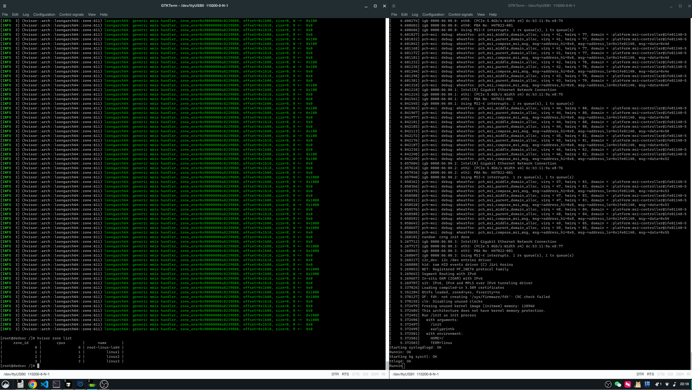

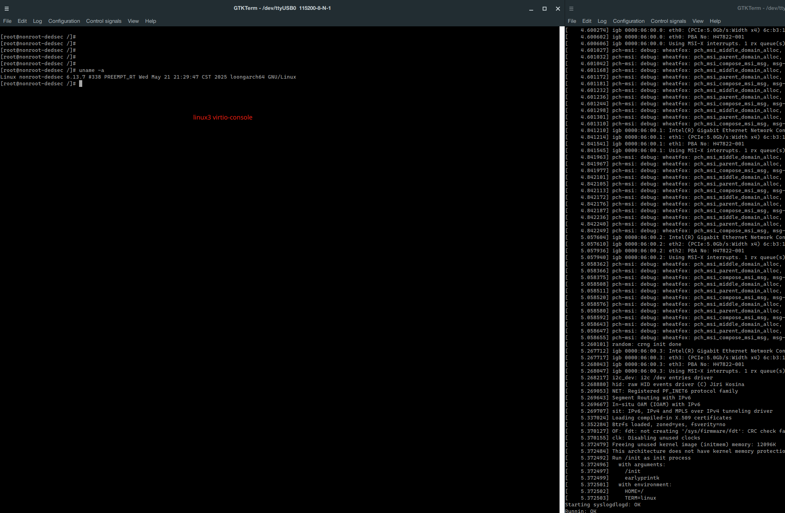

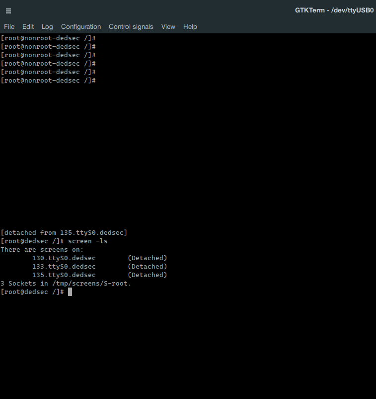

## 2025.5.22 记录

和徐一起调了一下，现在 nonroot 可以正常用网卡并连接互联网了。之后要测一下设备分配和msi分配的逻辑。

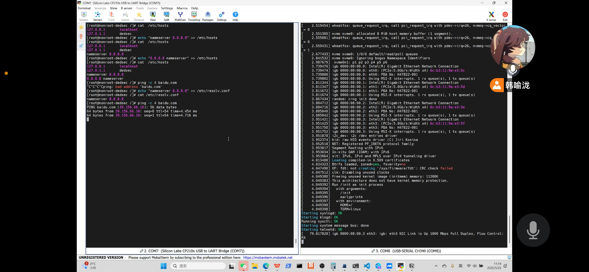

然后就是要求整个系统采用基于 ssd 的部署，之后会通过硬盘拷贝的方式分发 hvisor 的部署，所以现在需要做一些部署环境和持久化环境的设计。

首先在 3A6000 主机上安装一个 archlinux 作为维护用的系统（nvme p1+p2，p1=fat32,archlinux,/efi/boot，p2=ext4,archlinux,/）

然后另外分两个区 p3，p4，p3=fat32,hvisor_boot, p4=ext4,hvisor_root

p3用于存放我们的 hvisor uefi 镜像，部署之后可以通过 uefi shel 选择这个镜像启动（由于 ssd 的第一个分区是给 archlinux boot 用的，所以直接从 ssd 启动是默认进入 archlinux）

p4用于存放我们的持久化 rootfs，hvisor相关的命令行工具、ko、json、nonroot vmlinux、nonroot virtio-blk .ext4 image 都可以放在这里，并且可以通过启动 archlinux 然后挂载 p4 的方式进行维护，或者直接在 rootlinux 的 initramfs 里挂载并维护。

之后可能需要写一些使用说明，方便分发出去的部署环境能够让用户自己修改对应的配、文件或 virtio 镜像。


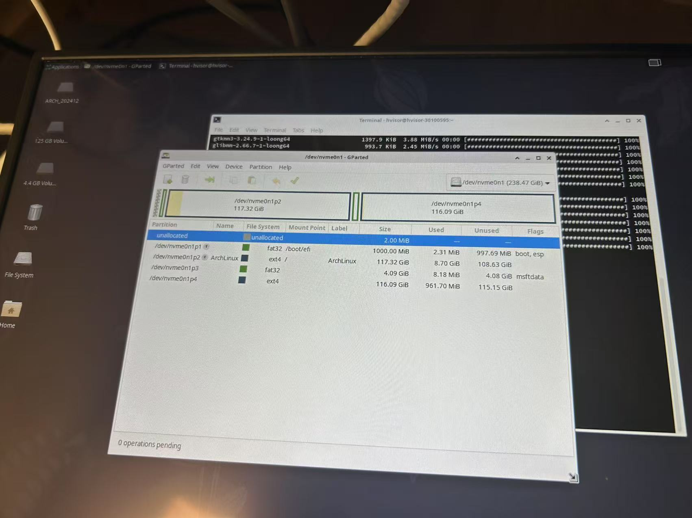

```
standard NVMe SSD partition layout for hvisor(loongarch) deploy system (/dev/nvme0n1)

#version 20250522
#note1 wheatfox
#note2 archlinux is for maintainence purpose

+------+----------------+------------------------+------------------------+-------------------------------------+
| Part | Filesystem     | Mount Point            | Purpose                | Contents                            |
+------+----------------+------------------------+------------------------+-------------------------------------+
| p1   | FAT32          | /efi/boot              | archlinux UEFI Boot    | archlinux's boot stuff              |
| p2   | EXT4           | /                      | archlinux RootFS       | archlinux rootfs system             |
| p3   | FAT32          | (none)                 | hvisor UEFI Boot       | EFI/BOOT/BOOTLOONGARCH64.EFI.       |
| p4   | EXT4           | /mnt or pivot root     | hvisor Persistent Root | vmlinux-*.bin, nonroot*.ext4, tools |
+------+----------------+------------------------+------------------------+-------------------------------------+
```

开会讨论

## 2025.5.29 记录


看一下之前 dump 出来的 acpi 设备树中低速设备的信息：

```bash
COMA irq 0x1a 26 UART[3:0]=8

COMB irq 0x48 72 UART[3:0]=8 72-8=64
COMC irq 0x48 72 UART[3:0]=8 72-8=64
...
RTC irq 0x74 116 RTC[0]=52 116-52=64
I2C0 irq 0x49 73 I2C[5:0]=9 73-9=64
I2C1 irq 0x49 73 I2C[5:0]=9 73-9=64
...
PWM0 irq 0x59 89 PWM[0]=24 89-24=65? or PWM[1]=25 89-25=64
PWM1 irq 0x59 90 PWM[2]=26 90-26=64
PWM2 irq 0x5a 91 PWM[3]=27 91-27=64
PWM3 irq 0x5b 92 PWM[4]=28 92-28=64
```

调整了设备树，hvisor 和 nonroot 走 UART0（debug）、root 走主板背板 COM1 口输入输出。

UART0 的中断挂不上了（启用 eionitc 的情况下），COM1（默认走 eiointc）挂 pic interrupt=8 能正常在 root linux 中接收中断，但是一启动 nonroot 后 root linux 的 COM1 就卡死了，目前原因未知。

所以目前两个串口都没挂中断（polling 模式），这样是不会有卡死的问题，由于 nonroot 本身是看不到 COM1 的，所以推测还是桥片控制器有一个地方有冲突。

找曹老师买一个 3A6000 的板子

## 2025.6.4 记录

```clike
[WARN  0] (hvisor::arch::loongarch64::zone:615) loongarch64: generic mmio handler, zone_era=0x90000000008500c4, offset=0x1800, size=8, R <-  0x100
[WARN  0] (hvisor::arch::loongarch64::zone:615) loongarch64: generic mmio handler, zone_era=0x90000000008500cc, offset=0x1800, size=8, W ->  0x100
[WARN  0] (hvisor::arch::loongarch64::zone:615) loongarch64: generic mmio handler, zone_era=0x90000000008500c4, offset=0x1808, size=8, R <-  0x0
[WARN  0] (hvisor::arch::loongarch64::zone:615) loongarch64: generic mmio handler, zone_era=0x90000000008500c4, offset=0x1810, size=8, R <-  0x0
[WARN  0] (hvisor::arch::loongarch64::zone:615) loongarch64: generic mmio handler, zone_era=0x90000000008500c4, offset=0x1818, size=8, R <-  0x0
[WARN  0] (hvisor::arch::loongarch64::zone:615) loongarch64: generic mmio handler, zone_era=0x90000000008500c4, offset=0x1800, size=8, R <-  0x100
[WARN  0] (hvisor::arch::loongarch64::zone:615) loongarch64: generic mmio handler, zone_era=0x90000000008500cc, offset=0x1800, size=8, W ->  0x100
[WARN  0] (hvisor::arch::loongarch64::zone:615) loongarch64: generic mmio handler, zone_era=0x90000000008500c4, offset=0x1808, size=8, R <-  0x0
[WARN  0] (hvisor::arch::loongarch64::zone:615) loongarch64: generic mmio handler, zone_era=0x90000000008500c4, offset=0x1810, size=8, R <-  0x0
[WARN  0] (hvisor::arch::loongarch64::zone:615) loongarch64: generic mmio handler, zone_era=0x90000000008500c4, offset=0x1818, size=8, R <-  0x0
[WARN  0] (hvisor::arch::loongarch64::zone:615) loongarch64: generic mmio handler, zone_era=0x90000000008500c4, offset=0x1800, size=8, R <-  0x100
[WARN  0] (hvisor::arch::loongarch64::zone:615) loongarch64: generic mmio handler, zone_era=0x90000000008500cc, offset=0x1800, size=8, W ->  0x100
[WARN  0] (hvisor::arch::loongarch64::zone:615) loongarch64: generic mmio handler, zone_era=0x90000000008500c4, offset=0x1808, size=8, R <-  0x0
[WARN  0] (hvisor::arch::loongarch64::zone:615) loongarch64: generic mmio handler, zone_era=0x90000000008500c4, offset=0x1810, size=8, R <-  0x0
[WARN  0] (hvisor::arch::loongarch64::zone:615) loongarch64: generic mmio handler, zone_era=0x90000000008500c4, offset=0x1818, size=8, R <-  0x0
[WARN  0] (hvisor::arch::loongarch64::zone:615) loongarch64: generic mmio handler, zone_era=0x90000000008500c4, offset=0x1800, size=8, R <-  0x100
[WARN  0] (hvisor::arch::loongarch64::zone:615) loongarch64: generic mmio handler, zone_era=0x90000000008500cc, offset=0x1800, size=8, W ->  0x100
[WARN  0] (hvisor::arch::loongarch64::zone:615) loongarch64: generic mmio handler, zone_era=0x90000000008500c4, offset=0x1808, size=8, R <-  0x0
[WARN  0] (hvisor::arch::loongarch64::zone:615) loongarch64: generic mmio handler, zone_era=0x90000000008500c4, offset=0x1810, size=8, R <-  0x0
[WARN  0] (hvisor::arch::loongarch64::zone:615) loongarch64: generic mmio handler, zone_era=0x90000000008500c4, offset=0x1818, size=8, R <-  0x0

```

上面是启动 com1 pic 中断后，在 root 中按一次回车时经过的所有 mmio。

```clike
[WARN  1] (hvisor::arch::loongarch64::zone:615) loongarch64: generic mmio handler, zone_era=0x90000000c0902868, offset=0x1cf8, size=4, W ->  0x1010101
[WARN  1] (hvisor::arch::loongarch64::zone:615) loongarch64: generic mmio handler, zone_era=0x90000000c0902868, offset=0x1cfc, size=4, W ->  0x1010101
[WARN  1] (hvisor::arch::loongarch64::zone:615) loongarch64: generic mmio handler, zone_era=0x90000000c0902894, offset=0x1600, size=4, W ->  0xffffffffffffffff
[WARN  1] (hvisor::arch::loongarch64::zone:615) loongarch64: generic mmio handler, zone_era=0x90000000c090289c, offset=0x1680, size=4, W ->  0xffffffffffffffff
[WARN  1] (hvisor::arch::loongarch64::zone:615) loongarch64: generic mmio handler, zone_era=0x90000000c0902894, offset=0x1604, size=4, W ->  0xffffffffffffffff
[WARN  1] (hvisor::arch::loongarch64::zone:615) loongarch64: generic mmio handler, zone_era=0x90000000c090289c, offset=0x1684, size=4, W ->  0xffffffffffffffff
[WARN  1] (hvisor::arch::loongarch64::zone:615) loongarch64: generic mmio handler, zone_era=0x90000000c0902894, offset=0x1608, size=4, W ->  0xffffffffffffffff
[WARN  1] (hvisor::arch::loongarch64::zone:615) loongarch64: generic mmio handler, zone_era=0x90000000c090289c, offset=0x1688, size=4, W ->  0xffffffffffffffff
[WARN  1] (hvisor::arch::loongarch64::zone:615) loongarch64: generic mmio handler, zone_era=0x90000000c0902894, offset=0x160c, size=4, W ->  0xffffffffffffffff
[WARN  1] (hvisor::arch::loongarch64::zone:615) loongarch64: generic mmio handler, zone_era=0x90000000c090289c, offset=0x168c, size=4, W ->  0xffffffffffffffff
[WARN  1] (hvisor::arch::loongarch64::zone:615) loongarch64: generic mmio handler, zone_era=0x90000000c0902894, offset=0x1610, size=4, W ->  0xffffffffffffffff
[WARN  1] (hvisor::arch::loongarch64::zone:615) loongarch64: generic mmio handler, zone_era=0x90000000c090289c, offset=0x1690, size=4, W ->  0xffffffffffffffff
[WARN  1] (hvisor::arch::loongarch64::zone:615) loongarch64: generic mmio handler, zone_era=0x90000000c0902894, offset=0x1614, size=4, W ->  0xffffffffffffffff
[WARN  1] (hvisor::arch::loongarch64::zone:615) loongarch64: generic mmio handler, zone_era=0x90000000c090289c, offset=0x1694, size=4, W ->  0xffffffffffffffff
[WARN  1] (hvisor::arch::loongarch64::zone:615) loongarch64: generic mmio handler, zone_era=0x90000000c0902894, offset=0x1618, size=4, W ->  0xffffffffffffffff
[WARN  1] (hvisor::arch::loongarch64::zone:615) loongarch64: generic mmio handler, zone_era=0x90000000c090289c, offset=0x1698, size=4, W ->  0xffffffffffffffff
[WARN  1] (hvisor::arch::loongarch64::zone:615) loongarch64: generic mmio handler, zone_era=0x90000000c0902894, offset=0x161c, size=4, W ->  0xffffffffffffffff
[WARN  1] (hvisor::arch::loongarch64::zone:615) loongarch64: generic mmio handler, zone_era=0x90000000c090289c, offset=0x169c, size=4, W ->  0xffffffffffffffff
[INFO  1] (hvisor::arch::loongarch64::trap:1329) cpucfg emulation, target cpucfg index is 0x2
[INFO  1] (hvisor::arch::loongarch64::trap:1329) cpucfg emulation, target cpucfg index is 0x4
[INFO  1] (hvisor::arch::loongarch64::trap:1329) cpucfg emulation, target cpucfg index is 0x5
[INFO  1] (hvisor::arch::loongarch64::trap:1366) csrrd emulation for CSR 0x380
[INFO  1] (hvisor::arch::loongarch64::trap:1366) csrrd emulation for CSR 0x300
[INFO  1] (hvisor::arch::loongarch64::trap:1329) cpucfg emulation, target cpucfg index is 0x6
[INFO  1] (hvisor::arch::loongarch64::trap:1372) csrwr emulation for CSR 0x200
[INFO  1] (hvisor::arch::loongarch64::trap:1372) csrwr emulation for CSR 0x201
[INFO  1] (hvisor::arch::loongarch64::trap:1372) csrwr emulation for CSR 0x202
[INFO  1] (hvisor::arch::loongarch64::trap:1372) csrwr emulation for CSR 0x203
[INFO  1] (hvisor::arch::loongarch64::trap:1372) csrwr emulation for CSR 0x204
[INFO  1] (hvisor::arch::loongarch64::trap:1372) csrwr emulation for CSR 0x205
[INFO  1] (hvisor::arch::loongarch64::trap:1372) csrwr emulation for CSR 0x206
[INFO  1] (hvisor::arch::loongarch64::trap:1372) csrwr emulation for CSR 0x207
[INFO  1] (hvisor::arch::loongarch64::trap:1366) csrrd emulation for CSR 0x380
[INFO  1] (hvisor::arch::loongarch64::trap:1366) csrrd emulation for CSR 0x300
[ERROR 1] (hvisor::panic:24) panic occurred: PanicInfo {
    payload: Any { .. },
    message: Some(
        hvisor device region is not enabled!,
    ),
    location: Location {
        file: "src/device/virtio_trampoline.rs",
        line: 139,
        col: 13,
    },
    can_unwind: true,
    force_no_backtrace: false,
}
[WARN  0] (hvisor::arch::loongarch64::zone:615) loongarch64: generic mmio handler, zone_era=0x90000000008500c4, offset=0x1800, size=8, R <-  0x0
[WARN  0] (hvisor::arch::loongarch64::zone:615) loongarch64: generic mmio handler, zone_era=0x90000000008500c4, offset=0x1808, size=8, R <-  0x200
[WARN  0] (hvisor::arch::loongarch64::zone:615) loongarch64: generic mmio handler, zone_era=0x90000000008500cc, offset=0x1808, size=8, W ->  0x200
[WARN  0] (hvisor::arch::loongarch64::zone:615) loongarch64: generic mmio handler, zone_era=0x90000000008500c4, offset=0x1810, size=8, R <-  0x0
[WARN  0] (hvisor::arch::loongarch64::zone:615) loongarch64: generic mmio handler, zone_era=0x90000000008500c4, offset=0x1818, size=8, R <-  0x0
[WARN  0] (hvisor::arch::loongarch64::zone:615) loongarch64: generic mmio handler, zone_era=0x90000000008500c4, offset=0x1800, size=8, R <-  0x0
[WARN  0] (hvisor::arch::loongarch64::zone:615) loongarch64: generic mmio handler, zone_era=0x90000000008500c4, offset=0x1808, size=8, R <-  0x200
[WARN  0] (hvisor::arch::loongarch64::zone:615) loongarch64: generic mmio handler, zone_era=0x90000000008500cc, offset=0x1808, size=8, W ->  0x200
[WARN  0] (hvisor::arch::loongarch64::zone:615) loongarch64: generic mmio handler, zone_era=0x90000000008500c4, offset=0x1810, size=8, R <-  0x0
[WARN  0] (hvisor::arch::loongarch64::zone:615) loongarch64: generic mmio handler, zone_era=0x90000000008500c4, offset=0x1818, size=8, R <-  0x0
[WARN  0] (hvisor::arch::loongarch64::zone:615) loongarch64: generic mmio handler, zone_era=0x90000000008500c4, offset=0x1800, size=8, R <-  0x0
[WARN  0] (hvisor::arch::loongarch64::zone:615) loongarch64: generic mmio handler, zone_era=0x90000000008500c4, offset=0x1808, size=8, R <-  0x200
[WARN  0] (hvisor::arch::loongarch64::zone:615) loongarch64: generic mmio handler, zone_era=0x90000000008500cc, offset=0x1808, size=8, W ->  0x200
[WARN  0] (hvisor::arch::loongarch64::zone:615) loongarch64: generic mmio handler, zone_era=0x90000000008500c4, offset=0x1810, size=8, R <-  0x0
[WARN  0] (hvisor::arch::loongarch64::zone:615) loongarch64: generic mmio handler, zone_era=0x90000000008500c4, offset=0x1818, size=8, R <-  0x0

```

这里是不启动 virtio 后端，让 nonroot 在解析 virtio mmio 时就退出，此时 root 的串口就已经开始收不到中断了：

1. 说明不是桥片的问题，因为 nonroot 根本没开始初始化桥片
2. cpu 1 hvisor panic 后，可以看到 cpu0 上的 linux 还是在运行的，能看到 status，但是会发现 com1 对应的 pic hwirq 8 已经不见了（1800 0x100）
3. 这个时候看起来 root 也已经卡住了，看不到任何后续的 mmio status polling 了

从 nonroot 中删除了 eiointc、msi 等，就不会出现 root 串口崩溃的问题了，难道还是因为 eiointc？

测试1：nonroot 不挂任何 irqchip，root 没问题，com1 正常

测试2：nonroot 只挂载 eiointc，别的都不加，com1 崩溃了，说明 nonroot eiointc 确实影响了 root com1

## 2025.6.4 记录

COM1 修好了，在 mmio handler 里，不让 nonroot 对 eiointc 进行任何写操作，就不会导致 COM1 失效了。

之后可以调查一下 eiointc 下 linux timer 的问题，不挂 eiointc 和 pci 时

```bash
sleep 1 # no eioinc, pci
sleep 1 # eiointc -> 1.9-2 m
```

## 2025.6.23 记录

需要注意的是，编译得到的 vmlinux 在 qemu 通过 dts 启动时不会有 sleep 时间不对的问题。

首先从 busybox sleep 开始调查，检查调用了哪些系统调用。

```clike
#include "libbb.h"

int sleep_main(int argc, char **argv) MAIN_EXTERNALLY_VISIBLE;
int sleep_main(int argc UNUSED_PARAM, char **argv)
{
	duration_t duration;

	/* Note: sleep_main may be directly called from ash as a builtin.
	 * This brings some complications:
	 * + we can't use xfunc here
	 * + we can't use bb_show_usage
	 * + applet_name can be the name of the shell
	 */
	argv = skip_dash_dash(argv);
	if (!argv[0]) {
		/* Without this, bare "sleep" in ash shows _ash_ --help */
		/* (ash can be the "sh" applet as well, so check 2nd char) */
		if (ENABLE_ASH_SLEEP && applet_name[1] != 'l') {
			bb_simple_error_msg("sleep: missing operand");
			return EXIT_FAILURE;
		}
		bb_show_usage();
	}

	/* GNU sleep accepts "inf", "INF", "infinity" and "INFINITY" */
	if (strncasecmp(argv[0], "inf", 3) == 0)
		for (;;)
			sleep(INT_MAX);

//FIXME: in ash, "sleep 123qwerty" as a builtin aborts the shell
#if ENABLE_FEATURE_FANCY_SLEEP
	duration = 0;
	do {
		duration += parse_duration_str(*argv);
	} while (*++argv);
	sleep_for_duration(duration); // <-------------
#else /* simple */
	duration = xatou(*argv);
	sleep(duration);
#endif
	return EXIT_SUCCESS;
}

// libbb/duration.c
void FAST_FUNC sleep_for_duration(duration_t duration)
{
	struct timespec ts;

	ts.tv_sec = MAXINT(typeof(ts.tv_sec));
	ts.tv_nsec = 0;
	if (duration >= 0 && duration < ts.tv_sec) {
		ts.tv_sec = duration;
		ts.tv_nsec = (duration - ts.tv_sec) * 1000000000;
	}
	/* NB: ENABLE_ASH_SLEEP requires that we do NOT loop on EINTR here:
	 * otherwise, traps won't execute until we finish looping.
	 */
	//do {
	//	errno = 0;
	//	nanosleep(&ts, &ts);
	//} while (errno == EINTR);
	nanosleep(&ts, &ts); // <---------------, https://man7.org/linux/man-pages/man2/nanosleep.2.html
}

// procps/uptime.c
#include "libbb.h"
#ifdef __linux__
# include <sys/sysinfo.h>
#endif

#ifndef FSHIFT
# define FSHIFT 16              /* nr of bits of precision */
#endif
#define FIXED_1      (1 << FSHIFT)     /* 1.0 as fixed-point */
#define LOAD_INT(x)  (unsigned)((x) >> FSHIFT)
#define LOAD_FRAC(x) LOAD_INT(((x) & (FIXED_1 - 1)) * 100)

int uptime_main(int argc, char **argv) MAIN_EXTERNALLY_VISIBLE;
int uptime_main(int argc UNUSED_PARAM, char **argv UNUSED_PARAM)
{
	unsigned updays, uphours, upminutes;
	unsigned opts;
	struct sysinfo info;
	struct tm *current_time;
	time_t current_secs;

	opts = getopt32(argv, "s");

	time(&current_secs); // 获取当前时间 (REALTIME) 并放在 current_secs timer 中
	sysinfo(&info); // 获取系统信息

	if (opts) // -s
		current_secs -= info.uptime;

	current_time = localtime(&current_secs); // 

	if (opts) { // -s
		printf("%04u-%02u-%02u %02u:%02u:%02u\n",
			current_time->tm_year + 1900, current_time->tm_mon + 1, current_time->tm_mday,
			current_time->tm_hour, current_time->tm_min, current_time->tm_sec
		);
		/* The above way of calculating boot time is wobbly,
		 * info.uptime has only 1 second precision, which makes
		 * "uptime -s" wander +- one second.
		 * /proc/uptime may be better, it has 0.01s precision.
		 */
		return EXIT_SUCCESS;
	}

	printf(" %02u:%02u:%02u up ",
			current_time->tm_hour, current_time->tm_min, current_time->tm_sec
	);
	updays = (unsigned) info.uptime / (unsigned)(60*60*24);
	if (updays != 0)
		printf("%u day%s, ", updays, (updays != 1) ? "s" : "");
	upminutes = (unsigned) info.uptime / (unsigned)60;
	uphours = (upminutes / (unsigned)60) % (unsigned)24;
	upminutes %= 60;
	if (uphours != 0)
		printf("%2u:%02u", uphours, upminutes);
	else
		printf("%u min", upminutes);

#if ENABLE_FEATURE_UPTIME_UTMP_SUPPORT
	{
		struct utmpx *ut;
		unsigned users = 0;
		while ((ut = getutxent()) != NULL) {
			if ((ut->ut_type == USER_PROCESS) && (ut->ut_user[0] != '\0'))
				users++;
		}
		printf(",  %u users", users);
	}
#endif

	printf(",  load average: %u.%02u, %u.%02u, %u.%02u\n",
			LOAD_INT(info.loads[0]), LOAD_FRAC(info.loads[0]),
			LOAD_INT(info.loads[1]), LOAD_FRAC(info.loads[1]),
			LOAD_INT(info.loads[2]), LOAD_FRAC(info.loads[2]));

	return EXIT_SUCCESS;
}
```

linux 的几个 clock：

```clike
CLOCK_MONOTONIC // nanosleep 用的这个

/*
 * Names of the interval timers, and structure
 * defining a timer setting:
 */
#define	ITIMER_REAL		0
#define	ITIMER_VIRTUAL		1
#define	ITIMER_PROF		2

/*
 * The IDs of the various system clocks (for POSIX.1b interval timers):
 */
#define CLOCK_REALTIME			0 // wall-time，现实时间
#define CLOCK_MONOTONIC			1 // 从系统启动开始的单调时间，但是可能被 NTP（network time protocol）调整
#define CLOCK_PROCESS_CPUTIME_ID	2 // 当前进程的 CPU 时间
#define CLOCK_THREAD_CPUTIME_ID		3 // 当前线程的 CPU 时间
#define CLOCK_MONOTONIC_RAW		4 // 类似 CLOCK_MONOTONIC，但不经过 NTP 平滑调整，是底层硬件时钟的原始值。用于高精度性能测量
#define CLOCK_REALTIME_COARSE		5 // CLOCK_REALTIME 的粗略版本
#define CLOCK_MONOTONIC_COARSE		6 // CLOCK_MONOTONIC 的粗略版本
#define CLOCK_BOOTTIME			7 // 与 CLOCK_MONOTONIC 类似，但包括系统 suspend（睡眠）时间
#define CLOCK_REALTIME_ALARM		8 // 允许设定唤醒系统的闹钟，基于 CLOCK_REALTIME
#define CLOCK_BOOTTIME_ALARM		9 // 与 CLOCK_BOOTTIME 类似的唤醒闹钟；支持系统 suspend 期间的唤醒

还有一个 CLOCK_TAI // International Atomic Time，国际原子时，TAI 是比 UTC（realtime）快 N 秒（目前 N=37），不涉及闰秒的现实时间
```

```
POSIX.1 specifies thatnanosleep() should measure time against the
CLOCK_REALTIME clock. However, Linux measures the time using the
CLOCK_MONOTONIC clock. This probably does not matter, since the
POSIX.1 specification for clock_settime(2) says that discontinuous
changes in CLOCK_REALTIME should not affect nanosleep():

              Setting the value of the CLOCK_REALTIME clock via
							clock_settime(2) shall have no effect on threads that are
              blocked waiting for a relative time service based upon this
              clock, including the nanosleep() function; ...
              Consequently, these time services shall expire when the
              requested duration elapses, independently of the new or old
              value of the clock.
```

看一下 nanosleep 的系统调用：

```clike
// kernel/time/hrtimer.c
SYSCALL_DEFINE2(nanosleep, struct __kernel_timespec __user *, rqtp,
		struct __kernel_timespec __user *, rmtp)
{
	struct timespec64 tu;

	if (get_timespec64(&tu, rqtp))
		return -EFAULT;

	if (!timespec64_valid(&tu))
		return -EINVAL;

	current->restart_block.fn = do_no_restart_syscall;
	current->restart_block.nanosleep.type = rmtp ? TT_NATIVE : TT_NONE;
	current->restart_block.nanosleep.rmtp = rmtp;
	return hrtimer_nanosleep(timespec64_to_ktime(tu), HRTIMER_MODE_REL,
	//gettimeofday
				 CLOCK_MONOTONIC);
}
```

查看系统timer信息：

```bash
QEMU:
[root@dedsec /]# cat /proc/timer_list
Timer List Version: v0.10
HRTIMER_MAX_CLOCK_BASES: 8
now at 103405326760 nsecs

cpu: 0
 clock 0:
  .base:       00000000a01816ca
  .index:      0
  .resolution: 1 nsecs
  .get_time:   ktime_get
  .offset:     0 nsecs
active timers:
 #0: <000000003091f2d5>, tick_nohz_handler, S:01
 # expires at 103410000000-103410000000 nsecs [in 4673240 to 4673240 nsecs]
 #1: <0000000080789f8c>, pm_suspend_timer_fn, S:01
 # expires at 103880377400-104005377400 nsecs [in 475050640 to 600050640 nsecs]
 #2: <00000000e9e07457>, sched_clock_poll, S:01
 # expires at 4398046511100-4398046511100 nsecs [in 4294641184340 to 4294641184340 nsecs]
 clock 1:
  .base:       00000000b282b9ad
  .index:      1
  .resolution: 1 nsecs
  .get_time:   ktime_get_real
  .offset:     0 nsecs
active timers:
 clock 2:
  .base:       0000000046f4ec58
  .index:      2
  .resolution: 1 nsecs
  .get_time:   ktime_get_boottime
  .offset:     0 nsecs
active timers:
 clock 3:
  .base:       00000000db1ce88e
  .index:      3
  .resolution: 1 nsecs
  .get_time:   ktime_get_clocktai
  .offset:     0 nsecs
active timers:
 clock 4:
  .base:       00000000b197f34a
  .index:      4
  .resolution: 1 nsecs
  .get_time:   ktime_get
  .offset:     0 nsecs
active timers:
 clock 5:
  .base:       000000007ecefa06
  .index:      5
  .resolution: 1 nsecs
  .get_time:   ktime_get_real
  .offset:     0 nsecs
active timers:
 clock 6:
  .base:       000000004e223e17
  .index:      6
  .resolution: 1 nsecs
  .get_time:   ktime_get_boottime
  .offset:     0 nsecs
active timers:
 clock 7:
  .base:       00000000dd23e3ff
  .index:      7
  .resolution: 1 nsecs
  .get_time:   ktime_get_clocktai
  .offset:     0 nsecs
active timers:
  .expires_next   : 103410000000 nsecs
  .hres_active    : 1
  .nr_events      : 8525
  .nr_retries     : 0
  .nr_hangs       : 0
  .max_hang_time  : 0
  .nohz           : 1
  .highres        : 1
  .last_tick      : 103390000000 nsecs
  .tick_stopped   : 0
  .idle_jiffies   : 4294947635
  .idle_calls     : 5681
  .idle_sleeps    : 2599
  .idle_entrytime : 103400128450 nsecs
  .idle_waketime  : 103400128450 nsecs
  .idle_exittime  : 103400282920 nsecs
  .idle_sleeptime : 74051288260 nsecs
  .iowait_sleeptime: 0 nsecs
  .last_jiffies   : 4294947634
  .next_timer     : 103400000000
  .idle_expires   : 103400000000 nsecs
jiffies: 4294947636

Tick Device: mode:     1
Per CPU device: 0
Clock Event Device: Constant
 max_delta_ns:   1374389514240
 min_delta_ns:   15360
 mult:           13421773
 shift:          27
 mode:           3
 next_event:     103410000000 nsecs
 set_next_event: constant_timer_next_event
 shutdown:       constant_set_state_shutdown
 periodic:       constant_set_state_periodic
 oneshot:        constant_set_state_oneshot
 oneshot stopped: constant_set_state_shutdown
 event_handler:  hrtimer_interrupt

 retries:        1
```

## 2025.6.26 记录

检查一下 linux 时钟系统的初始化，然后学一下 linux timer 系统

[https://classes.engineering.wustl.edu/cse422/code_pointers/06_a_brief_guide_to_time_in_linux.html](https://classes.engineering.wustl.edu/cse422/code_pointers/06_a_brief_guide_to_time_in_linux.html)

一些重要概念和源码：

jiffy：本意是“很短的一段时间”，在 linux kernel 中含义是一个基本计时单位，为一个系统 timer interrupt 的【**周期】**，依赖 tick rate（HZ），例如 HZ=1000，则 jiffy = 1ms，如果要 sleep 1s，会经过 1000 个 jiffies。

hrtimer：High-Resolution Timers，高精度定时器子系统，用于 nanosec 级别的定时。

ktime_t：nanosecond-resolution time format

```
/* Nanosecond scalar representation for kernel time values */
typedef s64	ktime_t;
```

include/linux/ktime.h

kernel/time/timer.c

kernel/time/tick-common.c

kernel/time/timekeeping.c

The [**`kernel/time/timer.c`**](https://elixir.bootlin.com/linux/v5.10.17/source/kernel/time/timer.c) file implements a legacy timer subsystem based on timer wheels, which is provided for backward compatibility with older versions of Linux.

QEMU:

```bash
[root@dedsec /]# dmesg | grep -iE 'time|clock|tick'
[    0.000000] Constant clock event device register
[    0.000000] clocksource: Constant: mask: 0xffffffffffffffff max_cycles: 0x171024e7e0, max_idle_ns: 440795205315 ns
[    0.000030] sched_clock: 64 bits at 100MHz, resolution 10ns, wraps every 4398046511100ns
[    0.000225] Constant clock source device register
[    0.003263] Calibrating delay loop (skipped), value calculated using timer frequency.. 200.00 BogoMIPS (lpj=1000000)
[    0.038218] clocksource: jiffies: mask: 0xffffffff max_cycles: 0xffffffff, max_idle_ns: 19112604462750000 ns
[    0.064204] clocksource: Switched to clocksource Constant
[    0.085626] workingset: timestamp_bits=40 max_order=19 bucket_order=0
[    1.479513] loongson-rtc 100d0100.rtc: hctosys: unable to read the hardware clock
[    1.737044] clk: Disabling unused clocks
[root@dedsec /]# 
```

drivers/clocksource 的驱动目录内有很多实现，不同的厂家和设备都实现了不同的 clocksource 驱动，不过看起来这里的 Constant 时钟名称是在 arch/loongarch/kernel/time.c 中实现的：

```bash
int constant_clockevent_init(void)
{
	unsigned int cpu = smp_processor_id();
	unsigned long min_delta = 0x600;
	unsigned long max_delta = (1UL << 48) - 1;
	struct clock_event_device *cd;
	static int irq = 0, timer_irq_installed = 0;

	if (!timer_irq_installed) {
		irq = get_percpu_irq(INT_TI);
		if (irq < 0)
			pr_err("Failed to map irq %d (timer)\n", irq);
	}

	cd = &per_cpu(constant_clockevent_device, cpu);

	cd->name = "Constant";
	cd->features = CLOCK_EVT_FEAT_ONESHOT | CLOCK_EVT_FEAT_PERIODIC | CLOCK_EVT_FEAT_PERCPU;

	cd->irq = irq;
	cd->rating = 320;
	cd->cpumask = cpumask_of(cpu);
	cd->set_state_oneshot = constant_set_state_oneshot;
	cd->set_state_oneshot_stopped = constant_set_state_shutdown;
	cd->set_state_periodic = constant_set_state_periodic;
	cd->set_state_shutdown = constant_set_state_shutdown;
	cd->set_next_event = constant_timer_next_event;
	cd->event_handler = constant_event_handler;

	clockevents_config_and_register(cd, const_clock_freq, min_delta, max_delta);

	if (timer_irq_installed)
		return 0;

	timer_irq_installed = 1;

	sync_counter();

	if (request_irq(irq, constant_timer_interrupt, IRQF_PERCPU | IRQF_TIMER, "timer", NULL))
		pr_err("Failed to request irq %d (timer)\n", irq);

	lpj_fine = get_loops_per_jiffy();
	pr_info("Constant clock event device register\n");

	return 0;
}

static struct clocksource clocksource_const = {
	.name = "Constant",
	.rating = 400,
	.read = read_const_counter,
	.mask = CLOCKSOURCE_MASK(64),
	.flags = CLOCK_SOURCE_IS_CONTINUOUS,
	.vdso_clock_mode = VDSO_CLOCKMODE_CPU,
};
```

实际的现象是不仅 hrtimer 变成了两倍时间，uptime 这种不需要高精度时钟的 gettimeofday 也变慢了一倍

```objectivec
// kernel/time/timekeeping.c

/**
 * update_wall_time - Uses the current clocksource to increment the wall time
 *
 */
void update_wall_time(void)
{
	if (timekeeping_advance(TK_ADV_TICK))
		clock_was_set_delayed();
}
```

linux自己的“walltime”也是从clocksource更新的，hrtimer也是用的前面那个clocksource，如果都出问题说明问题大概率出现在 clocksource 这部分（？），调查一下。

```objectivec
/*
 * timekeeping_advance - Updates the timekeeper to the current time and
 * current NTP tick length
 */
static bool timekeeping_advance(enum timekeeping_adv_mode mode)
{
	struct timekeeper *tk = &tk_core.shadow_timekeeper;
	struct timekeeper *real_tk = &tk_core.timekeeper;
	unsigned int clock_set = 0;
	int shift = 0, maxshift;
	u64 offset;

	guard(raw_spinlock_irqsave)(&tk_core.lock);

	/* Make sure we're fully resumed: */
	if (unlikely(timekeeping_suspended))
		return false;

	offset = clocksource_delta(tk_clock_read(&tk->tkr_mono),
				   tk->tkr_mono.cycle_last, tk->tkr_mono.mask,
				   tk->tkr_mono.clock->max_raw_delta);

	/* Check if there's really nothing to do */
	if (offset < real_tk->cycle_interval && mode == TK_ADV_TICK)
		return false;

	/*
	 * With NO_HZ we may have to accumulate many cycle_intervals
	 * (think "ticks") worth of time at once. To do this efficiently,
	 * we calculate the largest doubling multiple of cycle_intervals
	 * that is smaller than the offset.  We then accumulate that
	 * chunk in one go, and then try to consume the next smaller
	 * doubled multiple.
	 */
	shift = ilog2(offset) - ilog2(tk->cycle_interval);
	shift = max(0, shift);
	/* Bound shift to one less than what overflows tick_length */
	maxshift = (64 - (ilog2(ntp_tick_length())+1)) - 1;
	shift = min(shift, maxshift);
	while (offset >= tk->cycle_interval) {
		offset = logarithmic_accumulation(tk, offset, shift, &clock_set);
		if (offset < tk->cycle_interval<<shift)
			shift--;
	}

	/* Adjust the multiplier to correct NTP error */
	timekeeping_adjust(tk, offset);

	/*
	 * Finally, make sure that after the rounding
	 * xtime_nsec isn't larger than NSEC_PER_SEC
	 */
	clock_set |= accumulate_nsecs_to_secs(tk);

	timekeeping_update_from_shadow(&tk_core, clock_set);

	return !!clock_set;
}
```

看一下 timekeeper：

```objectivec
struct timekeeper {
	/* Cacheline 0 (together with prepended seqcount of timekeeper core): */
	struct tk_read_base	tkr_mono; // 用于读 CLOCK_MONOTONIC

	/* Cacheline 1: */
	u64			xtime_sec; // 当前 CLOCK_REALTIME（秒）
	unsigned long		ktime_sec; // 当前 CLOCK_MONOTONIC（秒）
	struct timespec64	wall_to_monotonic; // CLOCK_REALTIME to CLOCK_MONOTONIC 【offset】
	ktime_t			offs_real; // Offset clock monotonic -> clock realtime
	ktime_t			offs_boot; // Offset clock monotonic -> clock boottime
	ktime_t			offs_tai; // Offset clock monotonic -> clock tai
	s32			tai_offset; // The current UTC to TAI offset in seconds（见前文）

	/* Cacheline 2: */
	struct tk_read_base	tkr_raw; // The readout base structure for CLOCK_MONOTONIC_RAW
	u64			raw_sec; // 当前 CLOCK_MONOTONIC_RAW（秒）

	/* Cachline 3 and 4 (timekeeping internal variables): */
	unsigned int		clock_was_set_seq;
	u8			cs_was_changed_seq;

	struct timespec64	monotonic_to_boot; // CLOCK_MONOTONIC to CLOCK_BOOTTIME offset，BOOTIME 在 suspend 等情况下仍会记录时间，通过 RTC/always on timer 等硬件实现

	u64			cycle_interval; // Number of clock cycles in one NTP interval
	u64			xtime_interval; // Number of clock shifted nano seconds in one NTP interval
	s64			xtime_remainder; // Shifted nano seconds left over when rounding
	u64			raw_interval; // Shifted raw nano seconds accumulated per NTP interval.

	ktime_t			next_leap_ktime; // CLOCK_MONOTONIC time value of a pending leap-second
	u64			ntp_tick;
	s64			ntp_error;
	u32			ntp_error_shift;
	u32			ntp_err_mult;
	u32			skip_second_overflow;
};
```

## 2025.7.2 记录

qemu (vmlinux, dts):

```bash
[root@dedsec /]# ./timer_test 
=== Jiffies Frequency Measurement ===

1. System clock frequency (_SC_CLK_TCK): 100 Hz

2. Starting measurement...
   Start time: 9.497974870
   Start jiffies: 4294938245
   Sleeping 1 second...
   End time: 10.498698100
   End jiffies: 4294938345

3. Measurement results:
   Actual time interval: 1.000723 seconds
   Jiffies interval: 100
   Measured jiffies frequency: 99.93 Hz

4. Frequency comparison:
   System clock frequency (_SC_CLK_TCK): 100 Hz
   Measured jiffies frequency: 99.93 Hz
   Difference: -0.07 Hz (-0.07%)
[root@dedsec /]# 
```

3a6000:

```bash
[root@dedsec /]# ./timer_test 
=== Jiffies Frequency Measurement ===

1. System clock frequency (_SC_CLK_TCK): 100 Hz

2. Starting measurement...
   Start time: 11.300471600
   Start jiffies: 4294938426
   Sleeping 1 second...
   End time: 12.300490070
   End jiffies: 4294938526

3. Measurement results:
   Actual time interval: 1.000018 seconds
   Jiffies interval: 100
   Measured jiffies frequency: 100.00 Hz

4. Frequency comparison:
   System clock frequency (_SC_CLK_TCK): 100 Hz
   Measured jiffies frequency: 100.00 Hz
   Difference: -0.00 Hz (-0.00%)
[root@dedsec /]# 

```

果然没有区别，即使3A6000实际sleep两秒。

查一下那个 Calibrating delay loop 是做啥的

```clike
// init/calibrate.c
void calibrate_delay(void)
{
	unsigned long lpj;
	static bool printed;
	int this_cpu = smp_processor_id();

	if (per_cpu(cpu_loops_per_jiffy, this_cpu)) {
		lpj = per_cpu(cpu_loops_per_jiffy, this_cpu);
		if (!printed)
			pr_info("Calibrating delay loop (skipped) "
				"already calibrated this CPU");
	} else if (preset_lpj) {
		lpj = preset_lpj;
		if (!printed)
			pr_info("Calibrating delay loop (skipped) "
				"preset value.. ");
	} else if ((!printed) && lpj_fine) {
		lpj = lpj_fine;
		pr_info("Calibrating delay loop (skipped), "
			"value calculated using timer frequency.. ");
	} else if ((lpj = calibrate_delay_is_known())) {
		;
	} else if ((lpj = calibrate_delay_direct()) != 0) {
		if (!printed)
			pr_info("Calibrating delay using timer "
				"specific routine.. ");
	} else {
		if (!printed)
			pr_info("Calibrating delay loop... ");
		lpj = calibrate_delay_converge();
	}
	per_cpu(cpu_loops_per_jiffy, this_cpu) = lpj;
	if (!printed)
		pr_cont("%lu.%02lu BogoMIPS (lpj=%lu)\n",
			lpj/(500000/HZ),
			(lpj/(5000/HZ)) % 100, lpj);

	loops_per_jiffy = lpj;
	printed = true;

	calibration_delay_done();
}

```

qemu：

```bash
[    0.000000] Constant clock event device register
[    0.000000] clocksource: Constant: mask: 0xffffffffffffffff max_cycles: 0x171024e7e0, max_idle_ns: 440795205315 ns
[    0.000043] sched_clock: 64 bits at 100MHz, resolution 10ns, wraps every 4398046511100ns
[    0.000245] Constant clock source device register
[    0.001970] Console: colour dummy device 80x25
[    0.003231] Calibrating delay loop (skipped), value calculated using timer frequency.. 
[    0.003240] wheatfox: calibrate_delay, lpj of this cpu (0) is 1000000, set to cpu_loops_per_jiffy
[    0.003419] wheatfox: HZ is 100 
[    0.003729] 200.00 BogoMIPS (lpj=1000000)
[    0.035442] clocksource: jiffies: mask: 0xffffffff max_cycles: 0xffffffff, max_idle_ns: 19112604462750000 ns
```

公司使用的是mips处理器，每秒钟jiffs是250个，内核变量HZ值就是250，由此我引发一个疑问，一个jiffs时钟中断耗时4ms，没法做到毫秒微妙甚至纳秒的精度，那么内核延时函数mdelay udelay ndelya是如何实现的呢，于是研究了一下，就找到了linux内核中一个有趣的函数calibrate_delay（）。 calibrate_delay（）函数可以计算出cpu在一秒钟内执行了多少次一个极短的循环，最终计算出来的值赋给变量loop_per_jiffs，经过处理后得到BogoMIPS 值，Bogo是Bogus(伪)的意思，MIPS是millions of instructions per second(百万条指令每秒)的缩写。这样我们就知道了其实这个函数是linux内核中一个cpu性能测试函数。对于内核延时函数，关键点就是loop_per_jiffs,udelay函数就是利用这个变量计算出自己延时所需要的短循环。来实现微秒级延时。由于内核对这个数值的要求不高，所以内 核使用了一个十分简单而有效的算法用于得到这个值。

（loops per jiffy）是每个 jiffy（一个时钟节拍，默认 10ms）CPU 能执行的空转循环次数。jiffy一般是 10ms。

3A6000:

```bash
[    0.000000] Constant clock event device register
[    0.000000] clocksource: Constant: mask: 0xffffffffffffffff max_cycles: 0x171024e7e0, max_idle_ns: 440795205315 ns
[    0.000000] sched_clock: 64 bits at 100MHz, resolution 10ns, wraps every 4398046511100ns
[    0.008039] Constant clock source device register
[DEBUG 0] (hvisor::arch::loongarch64::trap:253) loongarch64: trap_handler: GSPR(Guest Sensitive Privileged Resource) ecode=0x16 esubcode=0x0 is=0x0 badv=0x0 badi=0x40e0004 era=0x900000000023104c
[INFO  0] (hvisor::arch::loongarch64::trap:1366) csrrd emulation for CSR 0x380
[DEBUG 0] (hvisor::arch::loongarch64::trap:307) loongarch64: trap_handler: return
[DEBUG 0] (hvisor::arch::loongarch64::trap:253) loongarch64: trap_handler: GSPR(Guest Sensitive Privileged Resource) ecode=0x16 esubcode=0x0 is=0x0 badv=0x0 badi=0x40c0004 era=0x9000000000231060
[INFO  0] (hvisor::arch::loongarch64::trap:1366) csrrd emulation for CSR 0x300
[DEBUG 0] (hvisor::arch::loongarch64::trap:307) loongarch64: trap_handler: return
[    0.034212] Console: colour dummy device 80x25
[    0.038762] Calibrating delay loop (skipped), value calculated using timer frequency.. 
[    0.038764] wheatfox: calibrate_delay, lpj of this cpu (0) is 1000000, set to cpu_loops_per_jiffy
[    0.046722] wheatfox: HZ is 100 
[    0.058738] 200.00 BogoMIPS (lpj=1000000)
[    0.062718] pid_max: default: 32768 minimum: 301
[    0.067318] LSM: initializing lsm=capability,yama
[    0.071991] Yama: becoming mindful.
[    0.075479] Mount-cache hash table entries: 4096 (order: 3, 32768 bytes, linear)
[    0.082829] Mountpoint-cache hash table entries: 4096 (order: 3, 32768 bytes, linear)
```

查手册，发现0x420是一个时钟配置区域，看一下root linux怎么配的：

```bash
[    0.000000] RCU Tasks Trace: Setting shift to 0 and lim to 1 rcu_task_cb_adjust=1 rcu_task_cpu_ids=1.
[    0.000000] NR_IRQS: 576, nr_irqs: 576, preallocated irqs: 16
[DEBUG 0] (hvisor::arch::loongarch64::trap:253) loongarch64: trap_handler: GSPR(Guest Sensitive Privileged Resource) ecode=0x16 esubcode=0x0 is=0x0 badv=0x0 badi=0x6480dac era=0x900000000084ffe0
[DEBUG 0] (hvisor::arch::loongarch64::trap:1432) iocsr emulation, ty = 3, rd = 12, rj = 13
[DEBUG 0] (hvisor::arch::loongarch64::trap:1433) GPR[rd] = 0x1, GPR[rj] = 0x420
[DEBUG 0] (hvisor::arch::loongarch64::trap:1515) iocsr issues a mmio access: iocsrrd.d, target address: 0x1fe00420, size: 8, R
[DEBUG 0] (hvisor::arch::loongarch64::zone:629) loongarch64: generic mmio handler, zone_era=0x900000000084ffe0, offset=0x420, size=8, R <-  0xf200f8880300
[DEBUG 0] (hvisor::arch::loongarch64::trap:1526) handle mmio success, v=0xf200f8880300
[DEBUG 0] (hvisor::arch::loongarch64::trap:307) loongarch64: trap_handler: return
[DEBUG 0] (hvisor::arch::loongarch64::trap:253) loongarch64: trap_handler: GSPR(Guest Sensitive Privileged Resource) ecode=0x16 esubcode=0x0 is=0x0 badv=0x0 badi=0x6481dac era=0x900000000084fff0
[DEBUG 0] (hvisor::arch::loongarch64::trap:1432) iocsr emulation, ty = 7, rd = 12, rj = 13
[DEBUG 0] (hvisor::arch::loongarch64::trap:1433) GPR[rd] = 0x1f200f8880300, GPR[rj] = 0x420
[DEBUG 0] (hvisor::arch::loongarch64::trap:1515) iocsr issues a mmio access: iocsrwr.d, target address: 0x1fe00420, size: 8, W
[DEBUG 0] (hvisor::arch::loongarch64::zone:629) loongarch64: generic mmio handler, zone_era=0x900000000084fff0, offset=0x420, size=8, W ->  0x1f200f8880300
[DEBUG 0] (hvisor::arch::loongarch64::trap:1526) handle mmio success, v=0x1f200f8880300
[DEBUG 0] (hvisor::arch::loongarch64::trap:307) loongarch64: trap_handler: return
... 

总的来说就是先读出来了 0xf200_f888_0300:
64'b 1111 0010 0000 0000 | 1111 1000 1000 1000 | 0000 0011 0000 0000

[21]: stable_reset 0
[19]: 1
[23]: 1
[27]: 1
[31:28]: 1111
[40]: freqscale_model_stable 0 
[41]: 1
[46:44] freqscale_stable 111 
[47] clken_stable 1

之后 [48] 写了 1 // extioi enable bit
```


```bash
[INFO  3] (hvisor::device::irqchip::ls7a2000:90) loongarch64: irqchip: percpu_init: running percpu_init
[INFO  2] (hvisor::device::irqchip::ls7a2000:90) loongarch64: irqchip: percpu_init: running percpu_init
[DEBUG 3] (hvisor::arch::loongarch64::ipi:268) clear_all_ipi: IPI status for cpu 3: 0x0
[DEBUG 2] (hvisor::arch::loongarch64::ipi:268) clear_all_ipi: IPI status for cpu 2: 0x0
[DEBUG 3] (hvisor::arch::loongarch64::ipi:253) enable_ipi: IPI enabled for cpu 3
[DEBUG 2] (hvisor::arch::loongarch64::ipi:253) enable_ipi: IPI enabled for cpu 2
[INFO  3] (hvisor::arch::loongarch64::ipi:299) ecfg ipi enabled on cpu 3, current lie: TIMER | IPI
[INFO  2] (hvisor::arch::loongarch64::ipi:299) ecfg ipi enabled on cpu 2, current lie: TIMER | IPI
[INFO  1] (hvisor:160) CPU 1 hv_pt_install OK.
[INFO  2] (hvisor::device::irqchip::ls7a2000:75) loongarch64: irqchip: clock_cpucfg_dump: cc_freq: 100000000
[INFO  3] (hvisor::device::irqchip::ls7a2000:75) loongarch64: irqchip: clock_cpucfg_dump: cc_freq: 100000000
[INFO  2] (hvisor::device::irqchip::ls7a2000:79) loongarch64: irqchip: clock_cpucfg_dump: cc_mul: 1
[INFO  3] (hvisor::device::irqchip::ls7a2000:79) loongarch64: irqchip: clock_cpucfg_dump: cc_mul: 1
[INFO  2] (hvisor::device::irqchip::ls7a2000:83) loongarch64: irqchip: clock_cpucfg_dump: cc_div: 1
[INFO  0] (hvisor::device::irqchip::ls7a2000:90) loongarch64: irqchip: percpu_init: running percpu_init
[INFO  3] (hvisor::device::irqchip::ls7a2000:83) loongarch64: irqchip: clock_cpucfg_dump: cc_div: 1
[DEBUG 0] (hvisor::arch::loongarch64::ipi:268) clear_all_ipi: IPI status for cpu 0: 0x0
[INFO  1] (hvisor::device::irqchip::ls7a2000:90) loongarch64: irqchip: percpu_init: running percpu_init
[DEBUG 0] (hvisor::arch::loongarch64::ipi:253) enable_ipi: IPI enabled for cpu 0
[DEBUG 1] (hvisor::arch::loongarch64::ipi:268) clear_all_ipi: IPI status for cpu 1: 0x0
[INFO  0] (hvisor::arch::loongarch64::ipi:299) ecfg ipi enabled on cpu 0, current lie: TIMER | IPI
[DEBUG 1] (hvisor::arch::loongarch64::ipi:253) enable_ipi: IPI enabled for cpu 1
[INFO  0] (hvisor::device::irqchip::ls7a2000:75) loongarch64: irqchip: clock_cpucfg_dump: cc_freq: 100000000
[INFO  1] (hvisor::arch::loongarch64::ipi:299) ecfg ipi enabled on cpu 1, current lie: TIMER | IPI
[INFO  0] (hvisor::device::irqchip::ls7a2000:79) loongarch64: irqchip: clock_cpucfg_dump: cc_mul: 1
[INFO  1] (hvisor::device::irqchip::ls7a2000:75) loongarch64: irqchip: clock_cpucfg_dump: cc_freq: 100000000
[INFO  0] (hvisor::device::irqchip::ls7a2000:83) loongarch64: irqchip: clock_cpucfg_dump: cc_div: 1
[INFO  1] (hvisor::device::irqchip::ls7a2000:79) loongarch64: irqchip: clock_cpucfg_dump: cc_mul: 1
[INFO  1] (hvisor::device::irqchip::ls7a2000:83) loongarch64: irqchip: clock_cpucfg_dump: cc_div: 1
[INFO  0] (hvisor:150) Primary CPU init late...
[INFO  0] (hvisor::device::irqchip::ls7a2000:53) loongarch64: irqchip: primary_init_late: running primary_init_late
[INFO  0] (hvisor::device::irqchip::ls7a2000:55) loongarch64: irqchip: primary_init_late: testing UART1
[INFO  0] (hvisor::device::uart::loongson_uart:232) loongarch: uart: __test_uart1
[INFO  0] (hvisor::device::uart::loongson_uart:235) loongarch: uart: __test_uart1 init done
[INFO  0] (hvisor::device::uart::loongson_uart:238) loongarch: uart: __test_uart1 send_str test done
[INFO  0] (hvisor::device::irqchip::ls7a2000:58) loongarch64: irqchip: primary_init_late: probing pci

```

启动后再打印一下试试：

```bash
 1. ./daemon.sh
 2. ./start.sh 1 # boot linux1, replace 1 with 2 or 3 to boot other zones
 3. screen /dev/pts/0 # open the console of linux1, replace 0 with 1 or 2 to open other consoles
[root@dedsec /]# ./install.sh 
[   10.313371] hvisor: loading out-of-tree module taints kernel.
[   10.319271] hvisor init done!!!
successfully installed hvisor, copied /bin/hvisor to /bin/hvisor and you can use it in your shell
[root@dedsec /]# hvisor zone list
[DEBUG 0] (hvisor::arch::loongarch64::trap:253) loongarch64: trap_handler: HVC(Hypervisor Call) ecode=0x17 esubcode=0x0 is=0x0 badv=0x0 badi=0x2b8000 era=0xffff800002002554
[DEBUG 0] (hvisor::arch::loongarch64::trap:1300) HVC exception, HVC call code: 0x4, arg0: 0xbdd7800, arg1: 0x20
[DEBUG 0] (hvisor::hypercall:73) hypercall: code=HvZoneList, arg0=0xbdd7800, arg1=0x20
[INFO  0] (hvisor::hypercall:390) loongarch64: hypercall: hv_zone_list: cc_freq: 100000000
[INFO  0] (hvisor::hypercall:394) loongarch64: hypercall: hv_zone_list: cc_mul: 1
[INFO  0] (hvisor::hypercall:398) loongarch64: hypercall: hv_zone_list: cc_div: 1
[DEBUG 0] (hvisor::arch::loongarch64::trap:1312) HVC result: 0x1
[DEBUG 0] (hvisor::arch::loongarch64::trap:307) loongarch64: trap_handler: return
|     zone_id     |       cpus        |      name       |     status |
|               0 |                 0 | root-linux-la64 |    running |
[root@dedsec /]# 

```

是一样的。从硬件配置来看没有任何问题……，可能是那个CONFIG HZ的问题吗？：

```python
#
# Timers subsystem
#
CONFIG_TICK_ONESHOT=y
CONFIG_NO_HZ_COMMON=y
# CONFIG_HZ_PERIODIC is not set
CONFIG_NO_HZ_IDLE=y
# CONFIG_NO_HZ_FULL is not set
CONFIG_NO_HZ=y
CONFIG_HIGH_RES_TIMERS=y
# end of Timers subsystem
```

同一份vmlinux在3A5000上试一下，发现也不行了，然后输出仍然看不出任何问题：

```bash
[DEBUG 0] (hvisor::arch::loongarch64::trap:253) loongarch64: trap_handler: GSPR(Guest Sensitive Privileged Resource) ecode=0x16 esubcode=0x0 is=0x0 badv=0x0 badi=0x6d8c era=0x9000000000da505c
[INFO  0] (hvisor::arch::loongarch64::trap:1329) cpucfg emulation, target cpucfg index is 0x4
[DEBUG 0] (hvisor::arch::loongarch64::trap:307) loongarch64: trap_handler: return
[DEBUG 0] (hvisor::arch::loongarch64::trap:253) loongarch64: trap_handler: GSPR(Guest Sensitive Privileged Resource) ecode=0x16 esubcode=0x0 is=0x0 badv=0x0 badi=0x6dad era=0x9000000000da5068
[INFO  0] (hvisor::arch::loongarch64::trap:1329) cpucfg emulation, target cpucfg index is 0x5
[DEBUG 0] (hvisor::arch::loongarch64::trap:307) loongarch64: trap_handler: return
[    0.000000] Constant clock event device register
[    0.000000] clocksource: Constant: mask: 0xffffffffffffffff max_cycles: 0x171024e7e0, max_idle_ns: 440795205315 ns
[    0.000000] sched_clock: 64 bits at 100MHz, resolution 10ns, wraps every 4398046511100ns
[    0.008039] Constant clock source device register
[DEBUG 0] (hvisor::arch::loongarch64::trap:253) loongarch64: trap_handler: GSPR(Guest Sensitive Privileged Resource) ecode=0x16 esubcode=0x0 is=0x0 badv=0x0 badi=0x40e0004 era=0x900000000023104c
[INFO  0] (hvisor::arch::loongarch64::trap:1366) csrrd emulation for CSR 0x380
[DEBUG 0] (hvisor::arch::loongarch64::trap:307) loongarch64: trap_handler: return
[DEBUG 0] (hvisor::arch::loongarch64::trap:253) loongarch64: trap_handler: GSPR(Guest Sensitive Privileged Resource) ecode=0x16 esubcode=0x0 is=0x0 badv=0x0 badi=0x40c0004 era=0x9000000000231060
[INFO  0] (hvisor::arch::loongarch64::trap:1366) csrrd emulation for CSR 0x300
[DEBUG 0] (hvisor::arch::loongarch64::trap:307) loongarch64: trap_handler: return
[    0.034232] Console: colour dummy device 80x25
[    0.038781] Calibrating delay loop (skipped), value calculated using timer frequency.. 
[    0.038783] wheatfox: calibrate_delay, lpj of this cpu (0) is 1000000, set to cpu_loops_per_jiffy
[    0.046743] wheatfox: HZ is 100 
[    0.058758] 200.00 BogoMIPS (lpj=1000000)
[    0.062740] pid_max: default: 32768 minimum: 301
```

在设备树继续把pic和msi控制器去掉，只留eiointc，上板试一下发现仍然不行。

看一下guest 读 cpucfg 0x4 的函数：

```nasm
[DEBUG 0] (hvisor::arch::loongarch64::trap:253) loongarch64: trap_handler: GSPR(Guest Sensitive Privileged Resource) ecode=0x16 esubcode=0x0 is=0x0 badv=0x0 badi=0x6d8c era=0x9000000000da505c
9000000000da5018 <time_init>:
9000000000da5018:	1a08bccc 	pcalau12i   	$t0, 17894(0x45e6)
9000000000da501c:	28e3418c 	ld.d        	$t0, $t0, -1840(0x8d0)
9000000000da5020:	02ffc063 	addi.d      	$sp, $sp, -16(0xff0)
9000000000da5024:	1a09416e 	pcalau12i   	$t2, 18955(0x4a0b)
9000000000da5028:	29c02061 	st.d        	$ra, $sp, 8(0x8)
9000000000da502c:	0340058c 	andi        	$t0, $t0, 0x1
9000000000da5030:	02c1e1ce 	addi.d      	$t2, $t2, 120(0x78)
9000000000da5034:	44000d80 	bnez        	$t0, 12(0xc)	# 9000000000da5040 <time_init+0x28>
9000000000da5038:	28c061cc 	ld.d        	$t0, $t2, 24(0x18)
9000000000da503c:	50005400 	b           	84(0x54)	# 9000000000da5090 <time_init+0x78>
9000000000da5040:	0280080c 	addi.w      	$t0, $zero, 2(0x2)
9000000000da5044:	00006d8c 	cpucfg      	$t0, $t0
9000000000da5048:	00ce398c 	bstrpick.d  	$t0, $t0, 0xe, 0xe
9000000000da504c:	44000d80 	bnez        	$t0, 12(0xc)	# 9000000000da5058 <time_init+0x40>
9000000000da5050:	0015000c 	move        	$t0, $zero
9000000000da5054:	50003800 	b           	56(0x38)	# 9000000000da508c <time_init+0x74>
9000000000da5058:	0280100c 	addi.w      	$t0, $zero, 4(0x4)
9000000000da505c:	00006d8c 	cpucfg      	$t0, $t0
9000000000da5060:	0280140d 	addi.w      	$t1, $zero, 5(0x5)
9000000000da5064:	0040818f 	slli.w      	$t3, $t0, 0x0
9000000000da5068:	00006dad 	cpucfg      	$t1, $t1
9000000000da506c:	43ffe5ff 	beqz        	$t3, -28(0x7fffe4)	# 9000000000da5050 <time_init+0x38>
9000000000da5070:	006f81af 	bstrpick.w  	$t3, $t1, 0xf, 0x0
9000000000da5074:	006f81b0 	bstrpick.w  	$t4, $t1, 0xf, 0x0
9000000000da5078:	43ffd9ff 	beqz        	$t3, -40(0x7fffd8)	# 9000000000da5050 <time_init+0x38>
9000000000da507c:	00df41ad 	bstrpick.d  	$t1, $t1, 0x1f, 0x10
9000000000da5080:	43ffd1bf 	beqz        	$t1, -48(0x7fffd0)	# 9000000000da5050 <time_init+0x38>
9000000000da5084:	001c418c 	mul.w       	$t0, $t0, $t4
9000000000da5088:	0021358c 	div.wu      	$t0, $t0, $t1
9000000000da508c:	00df018c 	bstrpick.d  	$t0, $t0, 0x1f, 0x0
9000000000da5090:	29c021cc 	st.d        	$t0, $t2, 8(0x8)
9000000000da5094:	04010c0c 	csrrd       	$t0, 0x43
9000000000da5098:	0000680d 	rdtime.d    	$t1, $zero
9000000000da509c:	0011b58c 	sub.d       	$t0, $t0, $t1
9000000000da50a0:	1a08bb6d 	pcalau12i   	$t1, 17883(0x45db)
9000000000da50a4:	29c001ac 	st.d        	$t0, $t1, 0
9000000000da50a8:	540ed7d2 	bl          	-12054828(0xf480ed4)	# 9000000000225f7c <constant_clockevent_init>
9000000000da50ac:	28c02061 	ld.d        	$ra, $sp, 8(0x8)
9000000000da50b0:	02c04063 	addi.d      	$sp, $sp, 16(0x10)
9000000000da50b4:	53feffff 	b           	-260(0xffffefc)	# 9000000000da4fb0 <constant_clocksource_init>
```

源码：

```clike
// arch/loongarch/kernel/time.c
void __init time_init(void)
{
	if (!cpu_has_cpucfg)
		const_clock_freq = cpu_clock_freq;
	else
		const_clock_freq = calc_const_freq();

	init_offset = -(drdtime() - csr_read64(LOONGARCH_CSR_CNTC));

	constant_clockevent_init();
	constant_clocksource_init();
	pv_time_init();
}

// arch/loongarch/include/asm/time.h
/* SPDX-License-Identifier: GPL-2.0 */
/*
 * Copyright (C) 2020-2022 Loongson Technology Corporation Limited
 */
#ifndef _ASM_TIME_H
#define _ASM_TIME_H

#include <linux/clockchips.h>
#include <linux/clocksource.h>
#include <asm/loongarch.h>

extern u64 cpu_clock_freq;
extern u64 const_clock_freq;

extern void save_counter(void);
extern void sync_counter(void);

static inline unsigned int calc_const_freq(void)
{
	unsigned int res;
	unsigned int base_freq;
	unsigned int cfm, cfd;

	res = read_cpucfg(LOONGARCH_CPUCFG2);
	if (!(res & CPUCFG2_LLFTP))
		return 0;

	base_freq = read_cpucfg(LOONGARCH_CPUCFG4);
	res = read_cpucfg(LOONGARCH_CPUCFG5);
	cfm = res & 0xffff;
	cfd = (res >> 16) & 0xffff;

	if (!base_freq || !cfm || !cfd)
		return 0;

	return (base_freq * cfm / cfd);
}

/*
 * Initialize the calling CPU's timer interrupt as clockevent device
 */
extern int constant_clockevent_init(void);
extern int constant_clocksource_init(void);

static inline void clockevent_set_clock(struct clock_event_device *cd,
					unsigned int clock)
{
	clockevents_calc_mult_shift(cd, clock, 4);
}

#endif /* _ASM_TIME_H */

```

```bash
[DEBUG 0] (hvisor::arch::loongarch64::trap:253) loongarch64: trap_handler: GSPR(Guest Sensitive Privileged Resource) ecode=0x16 esubcode=0x0 is=0x0 badv=0x0 badi=0x6ca5 era=0x9000000000da505c
[INFO  0] (hvisor::arch::loongarch64::trap:1329) cpucfg emulation, target cpucfg index is 0x4
[DEBUG 0] (hvisor::arch::loongarch64::trap:307) loongarch64: trap_handler: return
[DEBUG 0] (hvisor::arch::loongarch64::trap:253) loongarch64: trap_handler: GSPR(Guest Sensitive Privileged Resource) ecode=0x16 esubcode=0x0 is=0x0 badv=0x0 badi=0x6d8c era=0x9000000000da5068
[INFO  0] (hvisor::arch::loongarch64::trap:1329) cpucfg emulation, target cpucfg index is 0x5
[DEBUG 0] (hvisor::arch::loongarch64::trap:307) loongarch64: trap_handler: return
[    0.000000] wheatfox: time_init, const_clock_freq is 100000000
[    0.000000] wheatfox: time_init, init_offset is -4053668143
[    0.000000] wheatfox: constant_set_state_periodic, period is 1000000, const_clock_freq is 100000000, HZ is 100
[    0.000000] wheatfox: get_loops_per_jiffy, const_clock_freq is 100000000, lpj is 1000000
[    0.000000] Constant clock event device register
[    0.000000] clocksource: Constant: mask: 0xffffffffffffffff max_cycles: 0x171024e7e0, max_idle_ns: 440795205315 ns
[    0.000000] sched_clock: 64 bits at 100MHz, resolution 10ns, wraps every 4398046511100ns
[    0.008039] Constant clock source device register

```

神奇的事情出现了，继续disable eiointc，然后上板，发现仍然是两倍……也就是不一定是eiointc的影响，毕竟cpu的时钟配置和桥片基本没啥关系，各自走各自的。


在 hvisor 里简单写一个定时器，也是没问题的，上图中的 sleep 1 实际运行了 2 秒，而 hvisor 中手动通过 stable counter 进行按秒输出的时间间隔则是对的，1 秒输出一行。

**目前可以得到的情报：**

1. 主板给 stable counter 用的参考时钟应当为 100MHz 无误
2. stable counter 从 CPUCFG 读取的 freq 等数值均无误，为 100M，dts 和内核 config 中也均已配置为 100M 无误
3. 禁用 eiointc/pic/msi 后还是存在两倍的问题（之前为什么有时候去掉 eiointc 是能跑起来的？）
4. 禁用 CONFIG_NO_HZ 后无变化，仍有问题
5. 禁用 RTC 节点后无变化，仍有问题
6. 默认的 jiffy 为 10ms，HZ 变量为 100，即 1 秒有 100 个 jiffy，一个 jiffy 会触发一次 timer irq（参考前面的 clock source init），即目前采用默认情况，1 秒会产生 100 个时钟中断
然而这里感觉有一些问题，从 qemu 和板子的实验来看，qemu 中 100 个 clk tick 的“现实时间”为 1 秒，没有问题，但是板子上完成 100 个 clk tick 实际需要 2 秒（？？）

感觉仍然是clk tick（jiffy）系统的问题，继续读 tick 相关的内核代码。

```bash
kernel/time/tick-common.c
```

xtime? jiffy?

xtime 是高精度的 walltime

qemu:

```bash
[    0.000000] wheatfox: timekeeping_init, wall_time is 0.000000000, boot_offset is 0.000000000
[    0.000000] wheatfox: timekeeping_init, wall_to_mono is 0.000000000
[    0.000000] wheatfox: tk_setup_internals, clock is jiffies // 临时时钟源
[    0.000000] wheatfox: tk_setup_internals, tk->tkr_mono.cycle_last is 4294937296
[    0.000000] wheatfox: tk_setup_internals, tk->tkr_raw.cycle_last is 4294937296
[    0.000000] wheatfox: tk_setup_internals, tk->xtime_interval is 2560000000
[    0.000000] wheatfox: tk_setup_internals, tk->xtime_remainder is 0
[    0.000000] wheatfox: tk_setup_internals, tk->raw_interval is 2560000000
[    0.000000] wheatfox: tk_setup_internals, tk->tkr_mono.shift is 8
[    0.000000] wheatfox: tk_setup_internals, tk->tkr_raw.shift is 8
[    0.000000] wheatfox: tk_setup_internals, tk->ntp_tick is 42949672960000000
[    0.000000] wheatfox: tk_setup_internals, tk->tkr_mono.mult is 2560000000
[    0.000000] wheatfox: tk_setup_internals, tk->tkr_raw.mult is 2560000000
[    0.000000] wheatfox: tk_setup_internals finished
[    0.000000] wheatfox: timekeeping_init finished
[    0.000000] wheatfox: time_init, const_clock_freq is 100000000
[    0.000000] wheatfox: time_init, init_offset is -26728882
[    0.000000] wheatfox: constant_set_state_periodic, period is 1000000, const_clock_freq is 100000000, HZ is 100
[    0.000000] wheatfox: get_loops_per_jiffy, const_clock_freq is 100000000, lpj is 1000000
[    0.000000] Constant clock event device register
[    0.000000] wheatfox: constant_clocksource_init, freq is 100000000
[    0.000000] clocksource: Constant: mask: 0xffffffffffffffff max_cycles: 0x171024e7e0, max_idle_ns: 440795205315 ns
[    0.000000] wheatfox: constant_clocksource_init, res is 0
[    0.000038] sched_clock: 64 bits at 100MHz, resolution 10ns, wraps every 4398046511100ns
[    0.000228] Constant clock source device register
...
[    0.053351] pps_core: LinuxPPS API ver. 1 registered
[    0.053456] pps_core: Software ver. 5.3.6 - Copyright 2005-2007 Rodolfo Giometti <giometti@linux.it>
[    0.059695] vgaarb: loaded
[    0.060156] wheatfox: tk_setup_internals, clock is Constant
[    0.060273] wheatfox: tk_setup_internals, tk->tkr_mono.cycle_last is 32925706
[    0.060403] wheatfox: tk_setup_internals, tk->tkr_raw.cycle_last is 32925706
[    0.060531] wheatfox: tk_setup_internals, tk->xtime_interval is 167772160000000
[    0.060664] wheatfox: tk_setup_internals, tk->xtime_remainder is 0
[    0.060775] wheatfox: tk_setup_internals, tk->raw_interval is 167772160000000
[    0.060913] wheatfox: tk_setup_internals, tk->tkr_mono.shift is 24
[    0.061026] wheatfox: tk_setup_internals, tk->tkr_raw.shift is 24
[    0.061137] wheatfox: tk_setup_internals, tk->ntp_tick is 42949672960000000
[    0.061262] wheatfox: tk_setup_internals, tk->tkr_mono.mult is 167772160
[    0.061388] wheatfox: tk_setup_internals, tk->tkr_raw.mult is 167772160

```

3A5000:

```bash
[    0.000000] RCU Tasks Trace: Setting shift to 0 and lim to 1 rcu_task_cb_adjust=1 rcu_task_cpu_ids=1.
[    0.000000] NR_IRQS: 576, nr_irqs: 576, preallocated irqs: 16
[    0.000000] rcu: srcu_init: Setting srcu_struct sizes based on contention.
[    0.000000] wheatfox: timekeeping_init, wall_time is 0.000000000, boot_offset is 0.000000000
[    0.000000] wheatfox: timekeeping_init, wall_to_mono is 0.000000000
[    0.000000] wheatfox: tk_setup_internals, clock is jiffies
[    0.000000] wheatfox: tk_setup_internals, tk->tkr_mono.cycle_last is 4294937296
[    0.000000] wheatfox: tk_setup_internals, tk->tkr_raw.cycle_last is 4294937296
[    0.000000] wheatfox: tk_setup_internals, tk->xtime_interval is 2560000000
[    0.000000] wheatfox: tk_setup_internals, tk->xtime_remainder is 0
[    0.000000] wheatfox: tk_setup_internals, tk->raw_interval is 2560000000
[    0.000000] wheatfox: tk_setup_internals, tk->tkr_mono.shift is 8
[    0.000000] wheatfox: tk_setup_internals, tk->tkr_raw.shift is 8
[    0.000000] wheatfox: tk_setup_internals, tk->ntp_tick is 42949672960000000
[    0.000000] wheatfox: tk_setup_internals, tk->tkr_mono.mult is 2560000000
[    0.000000] wheatfox: tk_setup_internals, tk->tkr_raw.mult is 2560000000
[    0.000000] wheatfox: tk_setup_internals finished
[    0.000000] wheatfox: timekeeping_init finished
[DEBUG 0] (hvisor::arch::loongarch64::trap:253) loongarch64: trap_handler: GSPR(Guest Sensitive Privileged Resource) ecode=0x16 esubcode=0x0 is=0x0 badv=0x0 badi=0x6d8c era=0x9000000000da5064
[INFO  0] (hvisor::arch::loongarch64::trap:1329) cpucfg emulation, target cpucfg index is 0x2
[DEBUG 0] (hvisor::arch::loongarch64::trap:307) loongarch64: trap_handler: return
[DEBUG 0] (hvisor::arch::loongarch64::trap:253) loongarch64: trap_handler: GSPR(Guest Sensitive Privileged Resource) ecode=0x16 esubcode=0x0 is=0x0 badv=0x0 badi=0x6ca5 era=0x9000000000da507c
[INFO  0] (hvisor::arch::loongarch64::trap:1329) cpucfg emulation, target cpucfg index is 0x4
[DEBUG 0] (hvisor::arch::loongarch64::trap:307) loongarch64: trap_handler: return
[DEBUG 0] (hvisor::arch::loongarch64::trap:253) loongarch64: trap_handler: GSPR(Guest Sensitive Privileged Resource) ecode=0x16 esubcode=0x0 is=0x0 badv=0x0 badi=0x6d8c era=0x9000000000da5088
[INFO  0] (hvisor::arch::loongarch64::trap:1329) cpucfg emulation, target cpucfg index is 0x5
[DEBUG 0] (hvisor::arch::loongarch64::trap:307) loongarch64: trap_handler: return
[    0.000000] wheatfox: time_init, const_clock_freq is 100000000
[    0.000000] wheatfox: time_init, init_offset is -4849106186
[    0.000000] wheatfox: constant_set_state_periodic, period is 1000000, const_clock_freq is 100000000, HZ is 100
[    0.000000] wheatfox: get_loops_per_jiffy, const_clock_freq is 100000000, lpj is 1000000
[    0.000000] Constant clock event device register
[    0.000000] wheatfox: constant_clocksource_init, freq is 100000000
[    0.000000] clocksource: Constant: mask: 0xffffffffffffffff max_cycles: 0x171024e7e0, max_idle_ns: 440795205315 ns
[    0.000000] wheatfox: constant_clocksource_init, res is 0
[    0.000000] sched_clock: 64 bits at 100MHz, resolution 10ns, wraps every 4398046511100ns
[    0.008039] Constant clock source device register
...
[    0.370610] vgaarb: loaded
[    0.373323] wheatfox: tk_setup_internals, clock is Constant
[    0.378856] wheatfox: tk_setup_internals, tk->tkr_mono.cycle_last is 42874720
[    0.385943] wheatfox: tk_setup_internals, tk->tkr_raw.cycle_last is 42874720
[    0.392943] wheatfox: tk_setup_internals, tk->xtime_interval is 167772160000000
[    0.400203] wheatfox: tk_setup_internals, tk->xtime_remainder is 0
[    0.406340] wheatfox: tk_setup_internals, tk->raw_interval is 167772160000000
[    0.413427] wheatfox: tk_setup_internals, tk->tkr_mono.shift is 24
[    0.419563] wheatfox: tk_setup_internals, tk->tkr_raw.shift is 24
[    0.425613] wheatfox: tk_setup_internals, tk->ntp_tick is 42949672960000000
[    0.432528] wheatfox: tk_setup_internals, tk->tkr_mono.mult is 167772160
[    0.439182] wheatfox: tk_setup_internals, tk->tkr_raw.mult is 167772160
[    0.445751] wheatfox: tk_setup_internals finished
[    0.450426] clocksource: Switched to clocksource Constant
[    0.455850] VFS: Disk quotas dquot_6.6.0
```

## 2025.7.7 记录

继续学 linux 时钟子系统

看了一下qemu和板子的每100次raw timer irq，qemu是1秒打印一次，正常，板子则是刚进init后几秒钟正常，然后突然开始飞速打印，看了一下每次的init value发现非常小，相关的函数：

```clike
// arch/loongarch/kernel/time.c
static int constant_timer_next_event(unsigned long delta, struct clock_event_device *evt) { ... }

初始化时绑定到了 cd->set_next_event = constant_timer_next_event;

struct clock_event_device *cd;

clockevents_config_and_register(cd, const_clock_freq, min_delta, max_delta); // freq=100M/100

// include/linux/clockchips.h
/**
 * struct clock_event_device - clock event device descriptor
 * @event_handler:	Assigned by the framework to be called by the low
 *			level handler of the event source
 * @set_next_event:	set next event function using a clocksource delta
 * @set_next_ktime:	set next event function using a direct ktime value
 * @next_event:		local storage for the next event in oneshot mode
 * @max_delta_ns:	maximum delta value in ns
 * @min_delta_ns:	minimum delta value in ns
 * @mult:		nanosecond to cycles multiplier
 * @shift:		nanoseconds to cycles divisor (power of two)
 * @state_use_accessors:current state of the device, assigned by the core code
 * @features:		features
 * @retries:		number of forced programming retries
 * @set_state_periodic:	switch state to periodic
 * @set_state_oneshot:	switch state to oneshot
 * @set_state_oneshot_stopped: switch state to oneshot_stopped
 * @set_state_shutdown:	switch state to shutdown
 * @tick_resume:	resume clkevt device
 * @broadcast:		function to broadcast events
 * @min_delta_ticks:	minimum delta value in ticks stored for reconfiguration
 * @max_delta_ticks:	maximum delta value in ticks stored for reconfiguration
 * @name:		ptr to clock event name
 * @rating:		variable to rate clock event devices
 * @irq:		IRQ number (only for non CPU local devices)
 * @bound_on:		Bound on CPU
 * @cpumask:		cpumask to indicate for which CPUs this device works
 * @list:		list head for the management code
 * @owner:		module reference
 */
struct clock_event_device {
	void			(*event_handler)(struct clock_event_device *);
	int			(*set_next_event)(unsigned long evt, struct clock_event_device *);
	int			(*set_next_ktime)(ktime_t expires, struct clock_event_device *);
	ktime_t			next_event;
	u64			max_delta_ns;
	u64			min_delta_ns;
	u32			mult;
	u32			shift;
	enum clock_event_state	state_use_accessors;
	unsigned int		features;
	unsigned long		retries;

	int			(*set_state_periodic)(struct clock_event_device *);
	int			(*set_state_oneshot)(struct clock_event_device *);
	int			(*set_state_oneshot_stopped)(struct clock_event_device *);
	int			(*set_state_shutdown)(struct clock_event_device *);
	int			(*tick_resume)(struct clock_event_device *);

	void			(*broadcast)(const struct cpumask *mask);
	void			(*suspend)(struct clock_event_device *);
	void			(*resume)(struct clock_event_device *);
	unsigned long		min_delta_ticks;
	unsigned long		max_delta_ticks;

	const char		*name;
	int			rating;
	int			irq;
	int			bound_on;
	const struct cpumask	*cpumask;
	struct list_head	list;
	struct module		*owner;
} ____cacheline_aligned;

// kernel/time/clockevents.c
/**
 * clockevents_program_min_delta - Set clock event device to the minimum delay.
 * @dev:	device to program
 *
 * Returns 0 on success, -ETIME when the retry loop failed.
 */
static int clockevents_program_min_delta(struct clock_event_device *dev)
{
	unsigned long long clc;
	int64_t delta = 0;
	int i;

	for (i = 0; i < 10; i++) {
		delta += dev->min_delta_ns;
		dev->next_event = ktime_add_ns(ktime_get(), delta);

		if (clockevent_state_shutdown(dev))
			return 0;

		dev->retries++;
		clc = ((unsigned long long) delta * dev->mult) >> dev->shift;
		if (dev->set_next_event((unsigned long) clc, dev) == 0)
			return 0;
	}
	return -ETIME;
}

/**
 * clockevents_program_event - Reprogram the clock event device.
 * @dev:	device to program
 * @expires:	absolute expiry time (monotonic clock)
 * @force:	program minimum delay if expires can not be set
 *
 * Returns 0 on success, -ETIME when the event is in the past.
 */
int clockevents_program_event(struct clock_event_device *dev, ktime_t expires,
			      bool force)
{
	unsigned long long clc;
	int64_t delta;
	int rc;

	if (WARN_ON_ONCE(expires < 0))
		return -ETIME;

	dev->next_event = expires;

	if (clockevent_state_shutdown(dev))
		return 0;

	/* We must be in ONESHOT state here */
	WARN_ONCE(!clockevent_state_oneshot(dev), "Current state: %d\n",
		  clockevent_get_state(dev));

	/* Shortcut for clockevent devices that can deal with ktime. */
	if (dev->features & CLOCK_EVT_FEAT_KTIME)
		return dev->set_next_ktime(expires, dev);

	delta = ktime_to_ns(ktime_sub(expires, ktime_get()));
	if (delta <= 0)
		return force ? clockevents_program_min_delta(dev) : -ETIME;

	delta = min(delta, (int64_t) dev->max_delta_ns);
	delta = max(delta, (int64_t) dev->min_delta_ns);

	clc = ((unsigned long long) delta * dev->mult) >> dev->shift;
	rc = dev->set_next_event((unsigned long) clc, dev);

	return (rc && force) ? clockevents_program_min_delta(dev) : rc; // 注意！！！！！，然而上板和qemu里这里的rc一定为1，所以不会进program min delta
}
```

delta哪里来的？？

```clike
// kernel/time/clocksources.c
int __clockevents_update_freq(struct clock_event_device *dev, u32 freq)
{
	clockevents_config(dev, freq);

	if (clockevent_state_oneshot(dev))
		return clockevents_program_event(dev, dev->next_event, false); // <- 这个

	if (clockevent_state_periodic(dev))
		return __clockevents_switch_state(dev, CLOCK_EVT_STATE_PERIODIC);

	return 0;
}

clockevents_program_event
tick_program_event
hrtimer_interrupt

/* Reprogramming necessary ? */
pr_info("wheatfox: hrtimer_interrupt, expires_next=%llu, calling tick_program_event with force=0\n", expires_next);
if (!tick_program_event(expires_next, 0)) {
	cpu_base->hang_detected = 0;
	return;
}

expires_next = hrtimer_update_next_event(cpu_base);

// kernel/time/hrtimer.c
static ktime_t hrtimer_update_next_event(struct hrtimer_cpu_base *cpu_base)
{
	ktime_t expires_next, soft = KTIME_MAX;

	/*
	 * If the soft interrupt has already been activated, ignore the
	 * soft bases. They will be handled in the already raised soft
	 * interrupt.
	 */
	if (!cpu_base->softirq_activated) {
		soft = __hrtimer_get_next_event(cpu_base, HRTIMER_ACTIVE_SOFT);
		/*
		 * Update the soft expiry time. clock_settime() might have
		 * affected it.
		 */
		cpu_base->softirq_expires_next = soft;
	}

	expires_next = __hrtimer_get_next_event(cpu_base, HRTIMER_ACTIVE_HARD);
	/*
	 * If a softirq timer is expiring first, update cpu_base->next_timer
	 * and program the hardware with the soft expiry time.
	 */
	if (expires_next > soft) {
		cpu_base->next_timer = cpu_base->softirq_next_timer;
		expires_next = soft;
	}

	return expires_next;
}

/*
 * Recomputes cpu_base::*next_timer and returns the earliest expires_next
 * but does not set cpu_base::*expires_next, that is done by
 * hrtimer[_force]_reprogram and hrtimer_interrupt only. When updating
 * cpu_base::*expires_next right away, reprogramming logic would no longer
 * work.
 *
 * When a softirq is pending, we can ignore the HRTIMER_ACTIVE_SOFT bases,
 * those timers will get run whenever the softirq gets handled, at the end of
 * hrtimer_run_softirq(), hrtimer_update_softirq_timer() will re-add these bases.
 *
 * Therefore softirq values are those from the HRTIMER_ACTIVE_SOFT clock bases.
 * The !softirq values are the minima across HRTIMER_ACTIVE_ALL, unless an actual
 * softirq is pending, in which case they're the minima of HRTIMER_ACTIVE_HARD.
 *
 * @active_mask must be one of:
 *  - HRTIMER_ACTIVE_ALL,
 *  - HRTIMER_ACTIVE_SOFT, or
 *  - HRTIMER_ACTIVE_HARD.
 */
static ktime_t
__hrtimer_get_next_event(struct hrtimer_cpu_base *cpu_base, unsigned int active_mask)
{
	unsigned int active;
	struct hrtimer *next_timer = NULL;
	ktime_t expires_next = KTIME_MAX;

	if (!cpu_base->softirq_activated && (active_mask & HRTIMER_ACTIVE_SOFT)) {
		active = cpu_base->active_bases & HRTIMER_ACTIVE_SOFT;
		cpu_base->softirq_next_timer = NULL;
		expires_next = __hrtimer_next_event_base(cpu_base, NULL,
							 active, KTIME_MAX);

		next_timer = cpu_base->softirq_next_timer;
	}

	if (active_mask & HRTIMER_ACTIVE_HARD) {
		active = cpu_base->active_bases & HRTIMER_ACTIVE_HARD;
		cpu_base->next_timer = next_timer;
		expires_next = __hrtimer_next_event_base(cpu_base, NULL, active,
							 expires_next);
	}

	return expires_next;
}

__hrtimer_next_event_base

static inline ktime_t hrtimer_get_expires(const struct hrtimer *timer)
{
	return timer->node.expires;
}

```

## 2025.7.8 记录

```clike
// kernel/time/tick-sched.c
static void tick_do_update_jiffies64(ktime_t now)

random: crng init done ??
```

看起来是 random: crng init done 之后板子和 qemu 的行为就不一样了，而且为啥 qemu 里根本没有这个log？？？？

```clike
// drivers/char/random.c
static void add_timer_randomness(struct timer_rand_state *state, unsigned int num)
static void __cold _credit_init_bits(size_t bits)

credit_init_bits
```

random 模块中的 add_timer_randomness 和 timer delta 有关！

但是把 finish crng 的代码注释之后，用户态的时间还是不对（2倍），所以也不是 random 的问题，还是时钟系统的问题

1. 学一下 hrtimer
2. 学一下 jiffies，主要是调这个，目前 HZ=100，但是触发 100 个 jiffies 却需要大概两秒（而不是一秒）

## 2025.7.10

总结一下实验

### 实验 1: 在 root zone 启动一个裸机程序测试 virtual stable counter

[https://github.com/enkerewpo/baremetal-loongarch64-unwinding-test](https://github.com/enkerewpo/baremetal-loongarch64-unwinding-test)

测试结果：virtual stable counter 频率正常，100M 次增加对应 1 s

### 实验 2: 在 archlinux 中启动 qemu + KVM

把 root linux 的 vmlinux 直接放在 archlinux 中的 qemu 上启动，accel 用 KVM

测试结果：无任何问题，和x64 qemu下的qemu-system-loongarch64 无差异，计时正常

**结论：virtual stable counter 硬件（虚拟化）无问题，频率也是对的**

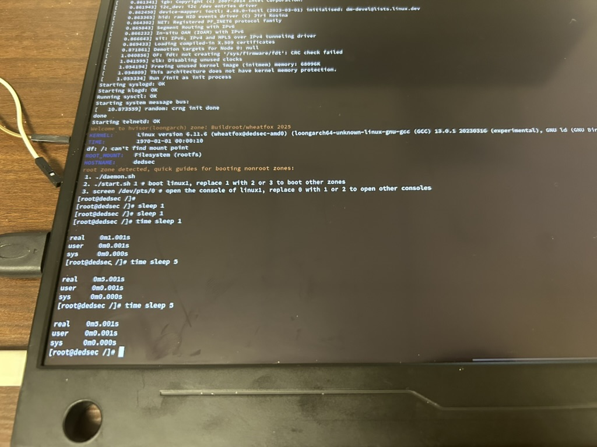

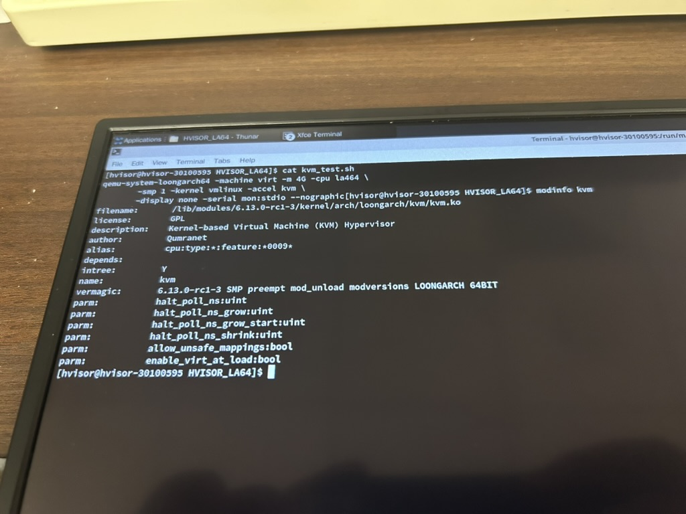

### 实验 3: 在内核源码里加 log，看一下每一次时钟中断的情况

关于 loongarch 这边 linux 的时钟中断相关函数见前文记录，简单用图梳理一下：

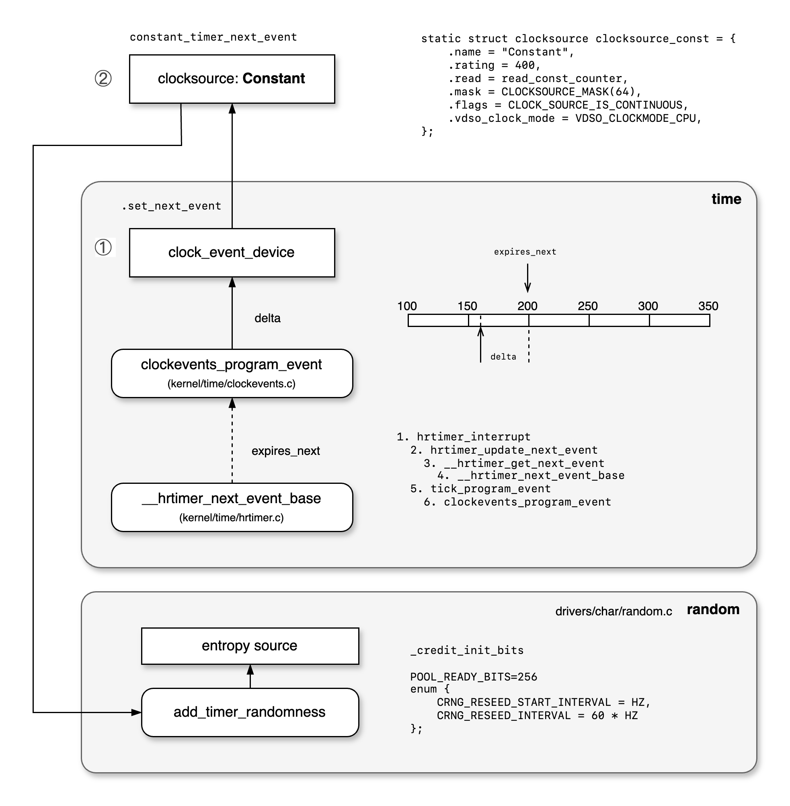

qemu 中：100次中断现实时间用时 1 s，无问题

板子：出现了不同的行为，每次中断的间隔不一样？

可以看到板子上进入 init 之后前几秒的计时是【没有问题】的（印证了virtual stable counter 确实没问题），100次中断用时 1s，但是在 random 的 crng 初始化好了以后，就完全随机了

看了一下 random 功能会让 timer irq 随机化，这就很不好调了，还得把 random 这部分的代码也看一下。

目前的线索：

1. virtual stable counter 以及外围硬件没找到任何问题，zone 启动裸机程序单独测试时钟也没问题
2. 为啥板子上 crng init done 之前的时钟没问题，一初始化结束就不对劲了？crng 只是从 clocksource 采样的到熵，不应该影响 clock

## 2025.7.16 记录

板子的 next base:

```clike
[    1.834854] OF: fdt: not creating '/sys/firmware/fdt': CRC check failed
[    1.841452] clk: Disabling unused clocks
[    1.858568] Freeing unused kernel image (initmem) memory: 70592K
[    1.864559] This architecture does not have kernel memory protection.
[    1.870995] Run /init_1 as init process
[    1.875639] wheatfox: __hrtimer_next_event_base, log: KTIME_MAX 1770000000 KTIME_MAX 1780000000 KTIME_MAX 1790000000 KTIME_MAX 1800000000 KTIME_MAX 1810000000 
init_1 started
[    1.889912] wheatfox:vtimer:c=300,v=198431673,l=162701449,d=35730224,tcfg=0009f6bd,p=0,init=652988,cntc=-3860047926
[    1.901586] wheatfox: __hrtimer_next_event_base, log: KTIME_MAX 1880000000 KTIME_MAX 1880000000 KTIME_MAX 1880000000 KTIME_MAX 1880000000 KTIME_MAX 1880000000 
init_1 running..[    1.915881] wheatfox: __hrtimer_next_event_base, log: KTIME_MAX 1900000000 KTIME_MAX 1900000000 KTIME_MAX 1900000000 KTIME_MAX 1900000000 KTIME_MAX 1900000000 
. sec: 1
[    1.931297] wheatfox:vtimer:c=400,v=202570232,l=198431673,d=4138559,tcfg=0007d979,p=0,init=514424,cntc=-3860047926
[    1.942363] wheatfox: __hrtimer_next_event_base, log: KTIME_MAX 1920000000 KTIME_MAX 1920000000 KTIME_MAX 1920000000 KTIME_MAX 1920000000 KTIME_MAX 1920000000 
[    1.956646] wheatfox: __hrtimer_next_event_base, log: KTIME_MAX 1950000000 KTIME_MAX 1950000000 KTIME_MAX 1950000000 KTIME_MAX 1950000000 KTIME_MAX 1950000000 
[    1.970895] wheatfox:vtimer:c=500,v=206530024,l=202570232,d=3959792,tcfg=0008768d,p=0,init=554636,cntc=-3860047926
[    1.981218] wheatfox: __hrtimer_next_event_base, log: KTIME_MAX 1960000000 KTIME_MAX 1960000000 KTIME_MAX 1960000000 KTIME_MAX 1960000000 KTIME_MAX 1960000000 
[    1.995501] wheatfox: __hrtimer_next_event_base, log: KTIME_MAX 1980000000 KTIME_MAX 1980000000 KTIME_MAX 1980000000 KTIME_MAX 1980000000 KTIME_MAX 1980000000 
[    2.009754] wheatfox:vtimer:c=600,v=210415896,l=206530024,d=3885872,tcfg=000a3459,p=0,init=668760,cntc=-3860047926
[    2.020073] wheatfox: __hrtimer_next_event_base, log: KTIME_MAX 2000000000 KTIME_MAX 2000000000 KTIME_MAX 2000000000 KTIME_MAX 2000000000 KTIME_MAX 2000000000 
[    2.034357] wheatfox: __hrtimer_next_event_base, log: KTIME_MAX 2020000000 KTIME_MAX 2020000000 KTIME_MAX 2020000000 KTIME_MAX 2020000000 KTIME_MAX 2020000000 
[    2.048615] wheatfox:vtimer:c=700,v=214302018,l=210415896,d=3886122,tcfg=000bf131,p=0,init=782640,cntc=-3860047926
[    2.058929] wheatfox: __hrtimer_next_event_base, log: KTIME_MAX 2040000000 KTIME_MAX 2040000000 KTIME_MAX 2040000000 KTIME_MAX 2040000000 KTIME_MAX 2040000000 
[    2.073214] wheatfox: __hrtimer_next_event_base, log: KTIME_MAX 2060000000 KTIME_MAX 2060000000 KTIME_MAX 2060000000 KTIME_MAX 2060000000 KTIME_MAX 2060000000 
[    2.087402] random: wheatfox: _credit_init_bits, new=12, orig=2, add=10
[    2.094050] wheatfox:vtimer:c=800,v=218845507,l=214302018,d=4543489,tcfg=0003a62d,p=0,init=239148,cntc=-3860047926
[    2.104541] wheatfox: __hrtimer_next_event_base, log: KTIME_MAX 2080000000 KTIME_MAX 2080000000 KTIME_MAX 2080000000 KTIME_MAX 2080000000 KTIME_MAX 2080000000 
[    2.118826] wheatfox: __hrtimer_next_event_base, log: KTIME_MAX 2110000000 KTIME_MAX 2110000000 KTIME_MAX 2110000000 KTIME_MAX 2110000000 KTIME_MAX 2110000000 
[    2.133092] wheatfox:vtimer:c=900,v=222749691,l=218845507,d=3904184,tcfg=00051c79,p=0,init=334968,cntc=-3860047926
[    2.143399] wheatfox: __hrtimer_next_event_base, log: KTIME_MAX 2120000000 KTIME_MAX 2120000000 KTIME_MAX 2120000000 KTIME_MAX 2120000000 KTIME_MAX 2120000000 
[    2.157685] wheatfox: __hrtimer_next_event_base, log: KTIME_MAX 2150000000 KTIME_MAX 2150000000 KTIME_MAX 2150000000 KTIME_MAX 2150000000 KTIME_MAX 2150000000 
[    2.171953] wheatfox:vtimer:c=1000,v=226635873,l=222749691,d=3886182,tcfg=0006d911,p=0,init=448784,cntc=-3860047926
[    2.182342] wheatfox: __hrtimer_next_event_base, log: KTIME_MAX 2160000000 KTIME_MAX 2160000000 KTIME_MAX 2160000000 KTIME_MAX 2160000000 KTIME_MAX 2160000000 
[    2.196625] wheatfox: __hrtimer_next_event_base, log: KTIME_MAX 2190000000 KTIME_MAX 2190000000 KTIME_MAX 2190000000 KTIME_MAX 2190000000 KTIME_MAX 2190000000 
[    2.210897] wheatfox:vtimer:c=1100,v=230530251,l=226635873,d=3894378,tcfg=000875a9,p=0,init=554408,cntc=-3860047926
[    2.221283] wheatfox: __hrtimer_next_event_base, log: KTIME_MAX 2200000000 KTIME_MAX 2200000000 KTIME_MAX 2200000000 KTIME_MAX 2200000000 KTIME_MAX 2200000000 
[    2.235566] wheatfox: __hrtimer_next_event_base, log: KTIME_MAX 2220000000 KTIME_MAX 2220000000 KTIME_MAX 2220000000 KTIME_MAX 2220000000 KTIME_MAX 2220000000 
[    2.249846] wheatfox:vtimer:c=1200,v=234425106,l=230530251,d=3894855,tcfg=000a1061,p=0,init=659552,cntc=-3860047926
[    2.260238] wheatfox: __hrtimer_next_event_base, log: KTIME_MAX 2240000000 KTIME_MAX 2240000000 KTIME_MAX 2240000000 KTIME_MAX 2240000000 KTIME_MAX 2240000000 
[    2.274522] wheatfox: __hrtimer_next_event_base, log: KTIME_MAX 2260000000 KTIME_MAX 2260000000 KTIME_MAX 2260000000 KTIME_MAX 2260000000 KTIME_MAX 2260000000 
[    2.288803] wheatfox:vtimer:c=1300,v=238320843,l=234425106,d=3895737,tcfg=000ba7a5,p=0,init=763812,cntc=-3860047926
[    2.299179] wheatfox: __hrtimer_next_event_base, log: KTIME_MAX 2280000000 KTIME_MAX 2280000000 KTIME_MAX 2280000000 KTIME_MAX 2280000000 KTIME_MAX 2280000000 
[    2.313461] wheatfox: __hrtimer_next_event_base, log: KTIME_MAX 2300000000 KTIME_MAX 2300000000 KTIME_MAX 2300000000 KTIME_MAX 2300000000 KTIME_MAX 2300000000 
[    2.327745] wheatfox: __hrtimer_next_event_base, log: KTIME_MAX 2320000000 KTIME_MAX 2320000000 KTIME_MAX 2320000000 KTIME_MAX 2320000000 KTIME_MAX 2320000000 
[    2.341931] wheatfox:vtimer:c=1400,v=243633649,l=238320843,d=5312806,tcfg=0006e1dd,p=0,init=451036,cntc=-3860047926
[    2.352401] wheatfox: __hrtimer_next_event_base, log: KTIME_MAX 2330000000 KTIME_MAX 2340000000 KTIME_MAX 2340000000 KTIME_MAX 2340000000 KTIME_MAX 2340000000 
[    2.366685] wheatfox: __hrtimer_next_event_base, log: KTIME_MAX 2360000000 KTIME_MAX 2360000000 KTIME_MAX 2360000000 KTIME_MAX 2360000000 KTIME_MAX 2360000000 
[    2.380875] wheatfox:vtimer:c=1500,v=247528067,l=243633649,d=3894418,tcfg=00087e31,p=0,init=556592,cntc=-3860047926
[    2.391343] wheatfox: __hrtimer_next_event_base, log: KTIME_MAX 2370000000 KTIME_MAX 2370000000 KTIME_MAX 2370000000 KTIME_MAX 2380000000 KTIME_MAX 2380000000 
[    2.405626] wheatfox: __hrtimer_next_event_base, log: KTIME_MAX 2390000000 KTIME_MAX 2390000000 KTIME_MAX 2390000000 KTIME_MAX 2390000000 KTIME_MAX 2390000000 
[    2.419821] wheatfox:vtimer:c=1600,v=251422659,l=247528067,d=3894592,tcfg=000a19f1,p=0,init=662000,cntc=-3860047926
[    2.430283] wheatfox: __hrtimer_next_event_base, log: KTIME_MAX 2410000000 KTIME_MAX 2410000000 KTIME_MAX 2410000000 KTIME_MAX 2410000000 KTIME_MAX 2410000000 
[    2.444566] wheatfox: __hrtimer_next_event_base, log: KTIME_MAX 2430000000 KTIME_MAX 2430000000 KTIME_MAX 2430000000 KTIME_MAX 2430000000 KTIME_MAX 2430000000 
[    2.458765] wheatfox:vtimer:c=1700,v=255317030,l=251422659,d=3894371,tcfg=000bb68d,p=0,init=767628,cntc=-3860047926
[    2.469223] wheatfox: __hrtimer_next_event_base, log: KTIME_MAX 2450000000 KTIME_MAX 2450000000 KTIME_MAX 2450000000 KTIME_MAX 2450000000 KTIME_MAX 2450000000 
[    2.483506] wheatfox: __hrtimer_next_event_base, log: KTIME_MAX 2470000000 KTIME_MAX 2470000000 KTIME_MAX 2470000000 KTIME_MAX 2470000000 KTIME_MAX 2470000000 
[    2.497694] random: wheatfox: _credit_init_bits, new=28, orig=12, add=16
[    2.504376] wheatfox:vtimer:c=1800,v=259878105,l=255317030,d=4561075,tcfg=000326f1,p=0,init=206576,cntc=-3860047926
[    2.514830] wheatfox: __hrtimer_next_event_base, log: KTIME_MAX 2490000000 KTIME_MAX 2490000000 KTIME_MAX 2490000000 KTIME_MAX 2490000000 KTIME_MAX 2490000000 
[    2.529114] wheatfox: __hrtimer_next_event_base, log: KTIME_MAX 2520000000 KTIME_MAX 2520000000 KTIME_MAX 2520000000 KTIME_MAX 2520000000 KTIME_MAX 2520000000 
[    2.543320] wheatfox:vtimer:c=1900,v=263772559,l=259878105,d=3894454,tcfg=0004c321,p=0,init=312096,cntc=-3860047926

```

qemu 的 next base：

```clike
[    2.022065] Run /init_1 as init process
init_1 started
[    2.052912] wheatfox: __hrtimer_next_event_base, log: KTIME_MAX 1570000000 KTIME_MAX 1580000000 KTIME_MAX 1590000000 KTIME_MAX 1600000000 KTIME_MAX 1610000000 
init_1 running..[    2.062936] random: wheatfox: _credit_init_bits, new=3, orig=2, add=1
. sec: 1
[    2.553004] wheatfox: __hrtimer_next_event_base, log: KTIME_MAX 2070000000 KTIME_MAX 2080000000 KTIME_MAX 2090000000 KTIME_MAX 2100000000 KTIME_MAX 2110000000 
[    2.982925] wheatfox:vtimer:c=300,v=326937040,l=226936166,d=100000874,tcfg=000f25b8,p=0,init=992696,cntc=-28312460
init_1 running..[    3.042926] wheatfox: __hrtimer_next_event_base, log: KTIME_MAX 2570000000 KTIME_MAX 2580000000 KTIME_MAX 2590000000 KTIME_MAX 2600000000 KTIME_MAX 2610000000 
. sec: 2
[    3.082936] random: wheatfox: _credit_init_bits, new=4, orig=3, add=1
[    3.542936] wheatfox: __hrtimer_next_event_base, log: KTIME_MAX 3060000000 KTIME_MAX 3070000000 KTIME_MAX 3080000000 KTIME_MAX 3090000000 KTIME_MAX 3100000000 
[    3.972911] wheatfox:vtimer:c=400,v=425936039,l=326937040,d=98998999,tcfg=000f2e40,p=0,init=994880,cntc=-28312460
[    4.032906] wheatfox: __hrtimer_next_event_base, log: KTIME_MAX 3560000000 KTIME_MAX 3570000000 KTIME_MAX 3580000000 KTIME_MAX 3590000000 KTIME_MAX 3600000000 
init_1 running... sec: 3
[    4.103044] random: wheatfox: _credit_init_bits, new=5, orig=4, add=1
[    4.532923] wheatfox: __hrtimer_next_event_base, log: KTIME_MAX 4050000000 KTIME_MAX 4060000000 KTIME_MAX 4070000000 KTIME_MAX 4080000000 KTIME_MAX 4090000000 
[    4.962921] wheatfox:vtimer:c=500,v=524937143,l=425936039,d=99001104,tcfg=000f2dc8,p=0,init=994760,cntc=-28312460
[    5.032136] wheatfox: __hrtimer_next_event_base, log: KTIME_MAX 4550000000 KTIME_MAX 4560000000 KTIME_MAX 4570000000 KTIME_MAX 4580000000 KTIME_MAX 4590000000 
init_1 running... sec: 4
[    5.122945] random: wheatfox: _credit_init_bits, new=6, orig=5, add=1
[    5.522936] wheatfox: __hrtimer_next_event_base, log: KTIME_MAX 5040000000 KTIME_MAX 5050000000 KTIME_MAX 5060000000 KTIME_MAX 5070000000 KTIME_MAX 5080000000 
[    5.952912] wheatfox:vtimer:c=600,v=623936261,l=524937143,d=98999118,tcfg=000f30e0,p=0,init=995552,cntc=-28312460
[    6.022902] wheatfox: __hrtimer_next_event_base, log: KTIME_MAX 5540000000 KTIME_MAX 5550000000 KTIME_MAX 5560000000 KTIME_MAX 5570000000 KTIME_MAX 5580000000 
init_1 running... sec: 5
[    6.142934] random: wheatfox: _credit_init_bits, new=7, orig=6, add=1
[    6.512906] wheatfox: __hrtimer_next_event_base, log: KTIME_MAX 6030000000 KTIME_MAX 6040000000 KTIME_MAX 6050000000 KTIME_MAX 6060000000 KTIME_MAX 6070000000 
[    6.942915] wheatfox:vtimer:c=700,v=722936545,l=623936261,d=99000284,tcfg=000eed30,p=0,init=978224,cntc=-28312460
[    7.013088] wheatfox: __hrtimer_next_event_base, log: KTIME_MAX 6530000000 KTIME_MAX 6540000000 KTIME_MAX 6550000000 KTIME_MAX 6560000000 KTIME_MAX 6570000000 
init_1 running... sec: 6
[    7.162928] random: wheatfox: _credit_init_bits, new=8, orig=7, add=1
[    7.512919] wheatfox: __hrtimer_next_event_base, log: KTIME_MAX 7030000000 KTIME_MAX 7040000000 KTIME_MAX 7050000000 KTIME_MAX 7060000000 KTIME_MAX 7070000000 
[    7.942919] wheatfox:vtimer:c=800,v=822936886,l=722936545,d=100000341,tcfg=000f2b30,p=0,init=994096,cntc=-28312460
[    8.012923] wheatfox: __hrtimer_next_event_base, log: KTIME_MAX 7530000000 KTIME_MAX 7540000000 KTIME_MAX 7550000000 KTIME_MAX 7560000000 KTIME_MAX 7570000000 
```

hrtimer_cpu_base

hrtimer_clock_base

timerqueue_node

hrtimer

board:

```clike
[    1.716365] Loading compiled-in X.509 certificates
[    1.724265] Demotion targets for Node 0: null
[    1.923522] OF: fdt: not creating '/sys/firmware/fdt': CRC check failed
[    1.930112] clk: Disabling unused clocks
[    1.947333] Freeing unused kernel image (initmem) memory: 70592K
[    1.953421] This architecture does not have kernel memory protection.
[    1.959834] Run /init_1 as init process
init_1 started
[    1.964544] wheatfox: handle_cpu_irq, estat is 0x800, count is 200, timer_irq_count is 200, other_irq_count is 0
[    1.975927] wheatfox:vtimer:c=200,v=206895664,l=126591756,diff=80303908,tcfg=000f4243,p=1,init=1000000,cntc=-3834339588
init_1 running..[    1.986654] wheatfox:vtimer:c=201,v=207968340,l=206895664,diff=1072676,tcfg=000f4243,p=1,init=1000000,cntc=-3834339588
[    1.998661] wheatfox:vtimer:c=202,v=209169014,l=207968340,diff=1200674,tcfg=000f4243,p=1,init=1000000,cntc=-3834339588
. sec: 1
[    2.009299] wheatfox:vtimer:c=203,v=210232865,l=209169014,diff=1063851,tcfg=000f4243,p=1,init=1000000,cntc=-3834339588
[    2.020788] wheatfox:vtimer:c=204,v=211381756,l=210232865,diff=1148891,tcfg=000f4243,p=1,init=1000000,cntc=-3834339588
[    2.031900] wheatfox: handle_cpu_irq, estat is 0x800, count is 300, timer_irq_count is 300, other_irq_count is 0
[    2.042015] wheatfox:vtimer:c=300,v=213504476,l=211381756,diff=2122720,tcfg=000f4243,p=1,init=1000000,cntc=-3834339588
[    2.052652] wheatfox:vtimer:c=301,v=214568136,l=213504476,diff=1063660,tcfg=000f4243,p=1,init=1000000,cntc=-3834339588
[    2.063288] wheatfox:vtimer:c=302,v=215631734,l=214568136,diff=1063598,tcfg=000f4243,p=1,init=1000000,cntc=-3834339588
[    2.073924] wheatfox:vtimer:c=303,v=216695309,l=215631734,diff=1063575,tcfg=000f4243,p=1,init=1000000,cntc=-3834339588
[    2.084559] wheatfox:vtimer:c=304,v=217758841,l=216695309,diff=1063532,tcfg=000f4243,p=1,init=1000000,cntc=-3834339588
[    2.095631] wheatfox: handle_cpu_irq, estat is 0x800, count is 400, timer_irq_count is 400, other_irq_count is 0
[    2.105746] wheatfox:vtimer:c=400,v=219877581,l=217758841,diff=2118740,tcfg=000f4243,p=1,init=1000000,cntc=-3834339588
[    2.116382] wheatfox:vtimer:c=401,v=220941165,l=219877581,diff=1063584,tcfg=000f4243,p=1,init=1000000,cntc=-3834339588
[    2.127018] wheatfox:vtimer:c=402,v=222004720,l=220941165,diff=1063555,tcfg=000f4243,p=1,init=1000000,cntc=-3834339588
[    2.137654] wheatfox:vtimer:c=403,v=223068315,l=222004720,diff=1063595,tcfg=000f4243,p=1,init=1000000,cntc=-3834339588
[    2.148289] wheatfox:vtimer:c=404,v=224131840,l=223068315,diff=1063525,tcfg=000f4243,p=1,init=1000000,cntc=-3834339588
[    2.159356] wheatfox: handle_cpu_irq, estat is 0x800, count is 500, timer_irq_count is 500, other_irq_count is 0
[    2.169470] wheatfox:vtimer:c=500,v=226249998,l=224131840,diff=2118158,tcfg=000f4243,p=1,init=1000000,cntc=-3834339588
[    2.180107] wheatfox:vtimer:c=501,v=227313637,l=226249998,diff=1063639,tcfg=000f4243,p=1,init=1000000,cntc=-3834339588
[    2.190742] wheatfox:vtimer:c=502,v=228377193,l=227313637,diff=1063556,tcfg=000f4243,p=1,init=1000000,cntc=-3834339588
[    2.201378] wheatfox:vtimer:c=503,v=229440787,l=228377193,diff=1063594,tcfg=000f4243,p=1,init=1000000,cntc=-3834339588
[    2.212014] wheatfox:vtimer:c=504,v=230504324,l=229440787,diff=1063537,tcfg=000f4243,p=1,init=1000000,cntc=-3834339588
[    2.223051] wheatfox: handle_cpu_irq, estat is 0x800, count is 600, timer_irq_count is 600, other_irq_count is 0
[    2.233166] wheatfox:vtimer:c=600,v=232619508,l=230504324,diff=2115184,tcfg=000f4243,p=1,init=1000000,cntc=-3834339588
[    2.243801] wheatfox:vtimer:c=601,v=233683068,l=232619508,diff=1063560,tcfg=000f4243,p=1,init=1000000,cntc=-3834339588
[    2.254437] wheatfox:vtimer:c=602,v=234746621,l=233683068,diff=1063553,tcfg=000f4243,p=1,init=1000000,cntc=-3834339588
[    2.265073] wheatfox:vtimer:c=603,v=235810198,l=234746621,diff=1063577,tcfg=000f4243,p=1,init=1000000,cntc=-3834339588
[    2.275708] wheatfox:vtimer:c=604,v=236873737,l=235810198,diff=1063539,tcfg=000f4243,p=1,init=1000000,cntc=-3834339588
[    2.286635] wheatfox: handle_cpu_irq, estat is 0x800, count is 700, timer_irq_count is 700, other_irq_count is 0
[    2.296749] wheatfox:vtimer:c=700,v=238977893,l=236873737,diff=2104156,tcfg=000f4243,p=1,init=1000000,cntc=-3834339588
[    2.307385] wheatfox:vtimer:c=701,v=240041458,l=238977893,diff=1063565,tcfg=000f4243,p=1,init=1000000,cntc=-3834339588
[    2.318020] wheatfox:vtimer:c=702,v=241104986,l=240041458,diff=1063528,tcfg=000f4243,p=1,init=1000000,cntc=-3834339588
[    2.328656] wheatfox:vtimer:c=703,v=242168543,l=241104986,diff=1063557,tcfg=000f4243,p=1,init=1000000,cntc=-3834339588
[    2.339292] wheatfox:vtimer:c=704,v=243232112,l=242168543,diff=1063569,tcfg=000f4243,p=1,init=1000000,cntc=-3834339588
[    2.350206] wheatfox: handle_cpu_irq, estat is 0x800, count is 800, timer_irq_count is 800, other_irq_count is 0
[    2.360321] wheatfox:vtimer:c=800,v=245335013,l=243232112,diff=2102901,tcfg=000f4243,p=1,init=1000000,cntc=-3834339588
[    2.370956] wheatfox:vtimer:c=801,v=246398581,l=245335013,diff=1063568,tcfg=000f4243,p=1,init=1000000,cntc=-3834339588
[    2.381592] wheatfox:vtimer:c=802,v=247462099,l=246398581,diff=1063518,tcfg=000f4243,p=1,init=1000000,cntc=-3834339588
[    2.392228] wheatfox:vtimer:c=803,v=248525712,l=247462099,diff=1063613,tcfg=000f4243,p=1,init=1000000,cntc=-3834339588
[    2.402863] wheatfox:vtimer:c=804,v=249589223,l=248525712,diff=1063511,tcfg=000f4243,p=1,init=1000000,cntc=-3834339588
[    2.413783] wheatfox: handle_cpu_irq, estat is 0x800, count is 900, timer_irq_count is 900, other_irq_count is 0
[    2.423897] wheatfox:vtimer:c=900,v=251692644,l=249589223,diff=2103421,tcfg=000f4243,p=1,init=1000000,cntc=-3834339588
[    2.434533] wheatfox:vtimer:c=901,v=252756211,l=251692644,diff=1063567,tcfg=000f4243,p=1,init=1000000,cntc=-3834339588
[    2.445168] wheatfox:vtimer:c=902,v=253819792,l=252756211,diff=1063581,tcfg=000f4243,p=1,init=1000000,cntc=-3834339588
[    2.455804] wheatfox:vtimer:c=903,v=254883343,l=253819792,diff=1063551,tcfg=000f4243,p=1,init=1000000,cntc=-3834339588
[    2.466451] wheatfox:vtimer:c=904,v=255948005,l=254883343,diff=1064662,tcfg=000f4243,p=1,init=1000000,cntc=-3834339588
[    2.477364] wheatfox: handle_cpu_irq, estat is 0x800, count is 1000, timer_irq_count is 1000, other_irq_count is 0
[    2.487651] wheatfox:vtimer:c=1000,v=258068014,l=255948005,diff=2120009,tcfg=000f4243,p=1,init=1000000,cntc=-3834339588
[    2.498373] wheatfox:vtimer:c=1001,v=259140224,l=258068014,diff=1072210,tcfg=000f4243,p=1,init=1000000,cntc=-3834339588
[    2.509094] wheatfox:vtimer:c=1002,v=260212386,l=259140224,diff=1072162,tcfg=000f4243,p=1,init=1000000,cntc=-3834339588
[    2.519816] wheatfox:vtimer:c=1003,v=261284595,l=260212386,diff=1072209,tcfg=000f4243,p=1,init=1000000,cntc=-3834339588
[    2.530538] wheatfox:vtimer:c=1004,v=262356741,l=261284595,diff=1072146,tcfg=000f4243,p=1,init=1000000,cntc=-3834339588
[    2.541549] wheatfox: handle_cpu_irq, estat is 0x800, count is 1100, timer_irq_count is 1100, other_irq_count is 0
[    2.551836] wheatfox:vtimer:c=1100,v=264486522,l=262356741,diff=2129781,tcfg=000f4243,p=1,init=1000000,cntc=-3834339588
[    2.562558] wheatfox:vtimer:c=1101,v=265558704,l=264486522,diff=1072182,tcfg=000f4243,p=1,init=1000000,cntc=-3834339588
[    2.573279] wheatfox:vtimer:c=1102,v=266630861,l=265558704,diff=1072157,tcfg=000f4243,p=1,init=1000000,cntc=-3834339588
[    2.584001] wheatfox:vtimer:c=1103,v=267703054,l=266630861,diff=1072193,tcfg=000f4243,p=1,init=1000000,cntc=-3834339588
...
[    2.840728] wheatfox:vtimer:c=1503,v=293375736,l=292303482,diff=1072254,tcfg=000f4243,p=1,init=1000000,cntc=-3834339588
[    2.851450] wheatfox:vtimer:c=1504,v=294447924,l=293375736,diff=1072188,tcfg=000f4243,p=1,init=1000000,cntc=-3834339588
[    2.862449] wheatfox: handle_cpu_irq, estat is 0x800, count is 1600, timer_irq_count is 1600, other_irq_count is 0
[    2.872735] wheatfox:vtimer:c=1600,v=296576476,l=294447924,diff=2128552,tcfg=000f4243,p=1,init=1000000,cntc=-3834339588
[    2.883457] wheatfox:vtimer:c=1601,v=297648659,l=296576476,diff=1072183,tcfg=000f4243,p=1,init=1000000,cntc=-3834339588
[    2.894179] wheatfox:vtimer:c=1602,v=298720803,l=297648659,diff=1072144,tcfg=000f4243,p=1,init=1000000,cntc=-3834339588
[    2.904901] wheatfox:vtimer:c=1603,v=299793007,l=298720803,diff=1072204,tcfg=000f4243,p=1,init=1000000,cntc=-3834339588
[    2.915627] wheatfox:vtimer:c=1604,v=300865609,l=299793007,diff=1072602,tcfg=000f4243,p=1,init=1000000,cntc=-3834339588
[    2.926630] wheatfox: handle_cpu_irq, estat is 0x800, count is 1700, timer_irq_count is 1700, other_irq_count is 0
[    2.936916] wheatfox:vtimer:c=1700,v=302994593,l=300865609,diff=2128984,tcfg=000f4243,p=1,init=1000000,cntc=-3834339588
[    2.947639] wheatfox:vtimer:c=1701,v=304066803,l=302994593,diff=1072210,tcfg=000f4243,p=1,init=1000000,cntc=-3834339588
[    2.958361] wheatfox:vtimer:c=1702,v=305139021,l=304066803,diff=1072218,tcfg=000f4243,p=1,init=1000000,cntc=-3834339588
[    2.969106] wheatfox:vtimer:c=1703,v=306213551,l=305139021,diff=1074530,tcfg=000f4243,p=1,init=1000000,cntc=-3834339588
[    2.979829] wheatfox:vtimer:c=1704,v=307285849,l=306213551,diff=1072298,tcfg=000f4243,p=1,init=1000000,cntc=-3834339588
init_1 running..[    2.990833] wheatfox: handle_cpu_irq, estat is 0x800, count is 1800, timer_irq_count is 1800, other_irq_count is 0
[    3.002022] wheatfox:vtimer:c=1800,v=309505147,l=307285849,diff=2219298,tcfg=000f4243,p=1,init=1000000,cntc=-3834339588
. sec: 2
[    3.012746] wheatfox:vtimer:c=1801,v=310577520,l=309505147,diff=1072373,tcfg=000f4243,p=1,init=1000000,cntc=-3834339588
[    3.024321] wheatfox:vtimer:c=1802,v=311735036,l=310577520,diff=1157516,tcfg=000f4243,p=1,init=1000000,cntc=-3834339588
[    3.035044] wheatfox:vtimer:c=1803,v=312807359,l=311735036,diff=1072323,tcfg=000f4243,p=1,init=1000000,cntc=-3834339588
[    3.045766] wheatfox:vtimer:c=1804,v=313879561,l=312807359,diff=1072202,tcfg=000f4243,p=1,init=1000000,cntc=-3834339588
[    3.056770] wheatfox: handle_cpu_irq, estat is 0x800, count is 1900, timer_irq_count is 1900, other_irq_count is 0
[    3.067057] wheatfox:vtimer:c=1900,v=316008686,l=313879561,diff=2129125,tcfg=000f4243,p=1,init=1000000,cntc=-3834339588
[    3.077779] wheatfox:vtimer:c=1901,v=317080889,l=316008686,diff=1072203,tcfg=000f4243,p=1,init=1000000,cntc=-3834339588
[    3.088501] wheatfox:vtimer:c=1902,v=318153068,l=317080889,diff=1072179,tcfg=000f4243,p=1,init=1000000,cntc=-3834339588
[    3.099223] wheatfox:vtimer:c=1903,v=319225268,l=318153068,diff=1072200,tcfg=000f4243,p=1,init=1000000,cntc=-3834339588
[    3.109945] wheatfox:vtimer:c=1904,v=320297420,l=319225268,diff=1072152,tcfg=000f4243,p=1,init=1000000,cntc=-3834339588
[    3.120943] wheatfox: handle_cpu_irq, estat is 0x800, count is 2000, timer_irq_count is 2000, other_irq_count is 0
[    3.131230] wheatfox:vtimer:c=2000,v=322425905,l=320297420,diff=2128485,tcfg=000f4243,p=1,init=1000000,cntc=-3834339588
[    3.141952] wheatfox:vtimer:c=2001,v=323498096,l=322425905,diff=1072191,tcfg=000f4243,p=1,init=1000000,cntc=-3834339588
[    3.152674] wheatfox:vtimer:c=2002,v=324570310,l=323498096,diff=1072214,tcfg=000f4243,p=1,init=1000000,cntc=-3834339588
[    3.163396] wheatfox:vtimer:c=2003,v=325642508,l=324570310,diff=1072198,tcfg=000f4243,p=1,init=1000000,cntc=-3834339588
[    3.174117] wheatfox:vtimer:c=2004,v=326714670,l=325642508,diff=1072162,tcfg=000f4243,p=1,init=1000000,cntc=-3834339588

```

qemu:

```
[    1.673510] OF: fdt: not creating '/sys/firmware/fdt': CRC check failed
[    1.674035] clk: Disabling unused clocks
[    1.702082] Freeing unused kernel image (initmem) memory: 70592K
[    1.702281] This architecture does not have kernel memory protection.
[    1.702501] Run /init_1 as init process
init_1 started
init_1 running... sec: 1
[    2.017416] wheatfox: handle_cpu_irq, estat is 0x800, count is 200, timer_irq_count is 200, other_irq_count is 0
[    2.017738] wheatfox:vtimer:c=200,v=224881638,l=128261634,diff=96620004,tcfg=000f4243,p=1,init=1000000,cntc=-22852125
[    2.027429] wheatfox:vtimer:c=201,v=225850600,l=224881638,diff=968962,tcfg=000f4243,p=1,init=1000000,cntc=-22852125
[    2.037456] wheatfox:vtimer:c=202,v=226853379,l=225850600,diff=1002779,tcfg=000f4243,p=1,init=1000000,cntc=-22852125
[    2.047482] wheatfox:vtimer:c=203,v=227855850,l=226853379,diff=1002471,tcfg=000f4243,p=1,init=1000000,cntc=-22852125
[    2.057498] wheatfox:vtimer:c=204,v=228857523,l=227855850,diff=1001673,tcfg=000f4243,p=1,init=1000000,cntc=-22852125
init_1 running... sec: 2
[    3.019531] wheatfox: handle_cpu_irq, estat is 0x800, count is 300, timer_irq_count is 300, other_irq_count is 0
[    3.019881] wheatfox:vtimer:c=300,v=325095958,l=228857523,diff=96238435,tcfg=000f4243,p=1,init=1000000,cntc=-22852125
[    3.029547] wheatfox:vtimer:c=301,v=326062251,l=325095958,diff=966293,tcfg=000f4243,p=1,init=1000000,cntc=-22852125
[    3.039557] wheatfox:vtimer:c=302,v=327063436,l=326062251,diff=1001185,tcfg=000f4243,p=1,init=1000000,cntc=-22852125
[    3.049576] wheatfox:vtimer:c=303,v=328065379,l=327063436,diff=1001943,tcfg=000f4243,p=1,init=1000000,cntc=-22852125
[    3.059594] wheatfox:vtimer:c=304,v=329067086,l=328065379,diff=1001707,tcfg=000f4243,p=1,init=1000000,cntc=-22852125
init_1 running... sec: 3
[    4.021492] wheatfox: handle_cpu_irq, estat is 0x800, count is 400, timer_irq_count is 400, other_irq_count is 0
[    4.021861] wheatfox:vtimer:c=400,v=425293868,l=329067086,diff=96226782,tcfg=000f4243,p=1,init=1000000,cntc=-22852125
[    4.031513] wheatfox:vtimer:c=401,v=426258793,l=425293868,diff=964925,tcfg=000f4243,p=1,init=1000000,cntc=-22852125
[    4.041526] wheatfox:vtimer:c=402,v=427260323,l=426258793,diff=1001530,tcfg=000f4243,p=1,init=1000000,cntc=-22852125
[    4.051548] wheatfox:vtimer:c=403,v=428262553,l=427260323,diff=1002230,tcfg=000f4243,p=1,init=1000000,cntc=-22852125
[    4.061566] wheatfox:vtimer:c=404,v=429264327,l=428262553,diff=1001774,tcfg=000f4243,p=1,init=1000000,cntc=-22852125
QEMU: Terminated
(base) ➜  hvisor-la64-linux git:(master) ✗ 
```

现在已经关掉 hrtimer 了,root linux看起来计时是没问题了,但是:

constant_timer_interrupt 在板子上被触发的次数远高于 qemu 中的 irq 次数,为啥?

IRQF_TIMER

generic_handle_irq

handle_irq_desc

```clike
// drivers/irqchip/irq-loongarch-cpu.c
#ifdef CONFIG_OF
static int __init cpuintc_of_init(struct device_node *of_node,
				struct device_node *parent)
{
	cpuintc_handle = of_node_to_fwnode(of_node);

	irq_domain = irq_domain_create_linear(cpuintc_handle, EXCCODE_INT_NUM,
				&loongarch_cpu_intc_irq_domain_ops, NULL);
	if (!irq_domain)
		panic("Failed to add irqdomain for loongarch CPU");

	set_handle_irq(&handle_cpu_irq); // 注册

	return 0;
}
IRQCHIP_DECLARE(cpu_intc, "loongson,cpu-interrupt-controller", cpuintc_of_init);
#endif

static void handle_cpu_irq(struct pt_regs *regs)
{
	int hwirq;
	unsigned int estat = read_csr_estat() & CSR_ESTAT_IS;

	while ((hwirq = ffs(estat))) {
		estat &= ~BIT(hwirq - 1);
		generic_handle_domain_irq(irq_domain, hwirq - 1);
	}
}
```

3A5000和3A6000的输出一样,说明是root linux的问题

整理一下:

1. 板子去掉hrtimer后,用户态计时正常,但是每过现实的 1s, 触发时钟中断约为 1500 次, qemu 中每个现实秒触发中断 100 次
2. 对于计时器 count, 板子每个现实秒增加约 100M,没问题, qemu 中也一样每个现实秒增加 100M
3. 奇怪的地方是,时钟中断配置两个都是 1M,也就是10ms一次中断,qemu里是没问题的,每个现实秒中断进入100次,板子上则大致为 1500/1600 次,明显变大了,这里的行为和配置的值对不上

用之前写的 baremetal 程序测试一下这个 guest 环境下的 timer irq 是不是对的

测了一下,100hz中断,inteval=1M, hvisor 运行 baremetal 程序没问题(见录屏),只有 root zone 的 linux 有问题

## 2025.7.17 记录

板子的 irq log：

```
[    1.632045] In-situ OAM (IOAM) with IPv6
[    1.635958] sit: IPv6, IPv4 and MPLS over IPv4 tunneling driver
[    1.645174] Loading compiled-in X.509 certificates
[    1.653072] Demotion targets for Node 0: null
[    1.852166] OF: fdt: not creating '/sys/firmware/fdt': CRC check failed
[    1.858757] clk: Disabling unused clocks
[    1.875962] Freeing unused kernel image (initmem) memory: 70592K
[    1.882050] This architecture does not have kernel memory protection.
[    1.888463] Run /init_1 as init process
init_1 started
init_1 running... sec: 1
[    1.970240] random: crng init done
[    1.973620] random: wheatfox: crng_set_ready, calling static_branch_enable
[    2.062286] IRQ Stats: count=52968, counter_diff=1.000002, avg_delta=0.000018
[    2.069381] ESTAT distribution: IRQ11:52968(100%) 
[    2.074140] First 10 counters: 1.188398 1.195313 1.205313 1.215313 1.225313 1.235313 1.245313 1.255313 1.265313 1.275313 
[    2.085043] Last 10 counters: 2.155284 2.155288 2.155294 2.155298 2.155301 2.155304 2.155306 2.155309 2.155312 2.155315 
init_1 running... sec: 2
[    3.062287] IRQ Stats: count=319348, counter_diff=1.000000, avg_delta=0.000003
[    3.069467] ESTAT distribution: IRQ11:319348(100%) 
[    3.074311] First 10 counters: 2.188889 2.188893 2.188896 2.188899 2.188902 2.188909 2.188913 2.188916 2.188918 2.188922 
[    3.085213] Last 10 counters: 3.155285 3.155288 3.155290 3.155298 3.155301 3.155304 3.155307 3.155310 3.155313 3.155316 
init_1 running... sec: 3
[    4.062287] IRQ Stats: count=319390, counter_diff=1.000000, avg_delta=0.000003
[    4.069466] ESTAT distribution: IRQ11:319390(100%) 
[    4.074310] First 10 counters: 3.189058 3.189062 3.189065 3.189068 3.189070 3.189073 3.189080 3.189084 3.189087 3.189090 
[    4.085212] Last 10 counters: 4.155291 4.155294 4.155297 4.155300 4.155302 4.155305 4.155308 4.155311 4.155313 4.155316 
init_1 running... sec: 4
[    5.062288] IRQ Stats: count=322948, counter_diff=1.000000, avg_delta=0.000002
[    5.069466] ESTAT distribution: IRQ11:322948(100%) 
[    5.074310] First 10 counters: 4.189057 4.189061 4.189064 4.189074 4.189078 4.189081 4.189083 4.189087 4.189089 4.189092 
[    5.085212] Last 10 counters: 5.155292 5.155295 5.155298 5.155301 5.155303 5.155306 5.155309 5.155311 5.155314 5.155317 
init_1 running... sec: 5
[    6.062289] IRQ Stats: count=322978, counter_diff=1.000000, avg_delta=0.000002
[    6.069467] ESTAT distribution: IRQ11:322978(100%) 
[    6.074311] First 10 counters: 5.189058 5.189062 5.189064 5.189068 5.189071 5.189074 5.189076 5.189079 5.189082 5.189084 
[    6.085213] Last 10 counters: 6.155293 6.155296 6.155298 6.155301 6.155304 6.155307 6.155309 6.155312 6.155315 6.155318 
init_1 running... sec: 6
[    7.062289] IRQ Stats: count=324223, counter_diff=1.000000, avg_delta=0.000002
[    7.069468] ESTAT distribution: IRQ11:324223(100%) 
[    7.074312] First 10 counters: 6.189059 6.189064 6.189066 6.189070 6.189072 6.189075 6.189078 6.189081 6.189084 6.189087 
[    7.085214] Last 10 counters: 7.155294 7.155296 7.155299 7.155302 7.155305 7.155307 7.155310 7.155313 7.155316 7.155318 
init_1 running... sec: 7
[    8.062292] IRQ Stats: count=323789, counter_diff=1.000002, avg_delta=0.000002
[    8.069470] ESTAT distribution: IRQ11:323789(100%) 
[    8.074314] First 10 counters: 7.189060 7.189072 7.189079 7.189082 7.189085 7.189088 7.189091 7.189094 7.189096 7.189099 
[    8.085216] Last 10 counters: 8.155295 8.155297 8.155300 8.155303 8.155306 8.155309 8.155313 8.155315 8.155318 8.155321 
init_1 running... sec: 8
[    9.062292] IRQ Stats: count=324758, counter_diff=1.000000, avg_delta=0.000002
[    9.069471] ESTAT distribution: IRQ11:324758(100%) 
[    9.074315] First 10 counters: 8.189061 8.189069 8.189072 8.189076 8.189078 8.189081 8.189084 8.189087 8.189090 8.189093 
[    9.085217] Last 10 counters: 9.155289 9.155292 9.155295 9.155298 9.155300 9.155309 9.155312 9.155315 9.155318 9.155321 
init_1 running... sec: 9
[   10.062294] IRQ Stats: count=324807, counter_diff=1.000002, avg_delta=0.000002
[   10.069473] ESTAT distribution: IRQ11:324807(100%) 
[   10.074317] First 10 counters: 9.189063 9.189067 9.189070 9.189073 9.189076 9.189079 9.189082 9.189085 9.189087 9.189091 
[   10.085219] Last 10 counters: 10.155298 10.155301 10.155304 10.155307 10.155310 10.155312 10.155315 10.155318 10.155321 10.155323 
init_1 running... sec: 10
[   11.062297] IRQ Stats: count=324269, counter_diff=1.000002, avg_delta=0.000002
[   11.069476] ESTAT distribution: IRQ11:324269(100%) 
[   11.074320] First 10 counters: 10.189929 10.189937 10.189941 10.189944 10.189952 10.189955 10.189958 10.189961 10.189964 10.189967 
[   11.086087] Last 10 counters: 11.155295 11.155298 11.155301 11.155303 11.155306 11.155309 11.155312 11.155314 11.155317 11.155325 
init_1 running... sec: 11
[   12.062297] IRQ Stats: count=324426, counter_diff=1.000000, avg_delta=0.000002
[   12.069475] ESTAT distribution: IRQ11:324426(100%) 
[   12.074319] First 10 counters: 11.190797 11.190805 11.190808 11.190812 11.190814 11.190817 11.190820 11.190823 11.190826 11.190829 
[   12.086086] Last 10 counters: 12.155299 12.155303 12.155306 12.155309 12.155311 12.155314 12.155317 12.155320 12.155322 12.155326 
init_1 running... sec: 12
[   13.062297] IRQ Stats: count=324890, counter_diff=1.000000, avg_delta=0.000002
[   13.069475] ESTAT distribution: IRQ11:324890(100%) 
[   13.074319] First 10 counters: 12.190795 12.190799 12.190802 12.190805 12.190808 12.190816 12.190819 12.190822 12.190829 12.190833 
[   13.086086] Last 10 counters: 13.155301 13.155304 13.155306 13.155309 13.155312 13.155315 13.155317 13.155320 13.155323 13.155326 
init_1 running... sec: 13
[   14.062297] IRQ Stats: count=324914, counter_diff=1.000000, avg_delta=0.000002
[   14.069476] ESTAT distribution: IRQ11:324914(100%) 
[   14.074319] First 10 counters: 13.190795 13.190799 13.190802 13.190805 13.190808 13.190811 13.190813 13.190816 13.190819 13.190822 
[   14.086086] Last 10 counters: 14.155294 14.155297 14.155300 14.155304 14.155307 14.155314 14.155317 14.155320 14.155323 14.155326 
init_1 running... sec: 14
[   15.062299] IRQ Stats: count=325050, counter_diff=1.000002, avg_delta=0.000002
[   15.069478] ESTAT distribution: IRQ11:325050(100%) 
[   15.074322] First 10 counters: 14.190795 14.190804 14.190807 14.190811 14.190813 14.190816 14.190819 14.190822 14.190824 14.190827 
[   15.086088] Last 10 counters: 15.155303 15.155306 15.155308 15.155311 15.155314 15.155317 15.155319 15.155322 15.155325 15.155328 
init_1 running... sec: 15
[   16.062299] IRQ Stats: count=325076, counter_diff=1.000000, avg_delta=0.000002
[   16.069478] ESTAT distribution: IRQ11:325076(100%) 
[   16.074322] First 10 counters: 15.190799 15.190802 15.190805 15.190808 15.190811 15.190814 15.190816 15.190819 15.190822 15.190825 
[   16.086089] Last 10 counters: 16.155303 16.155306 16.155308 16.155311 16.155314 16.155317 16.155320 16.155323 16.155325 16.155328 
init_1 running... sec: 16
[   17.062300] IRQ Stats: count=325164, counter_diff=1.000000, avg_delta=0.000002
[   17.069479] ESTAT distribution: IRQ11:325164(100%) 
[   17.074323] First 10 counters: 16.190799 16.190803 16.190806 16.190809 16.190812 16.190815 16.190817 16.190820 16.190823 16.190826 
[   17.086089] Last 10 counters: 17.155304 17.155307 17.155310 17.155313 17.155315 17.155318 17.155321 17.155324 17.155326 17.155329 
init_1 running... sec: 17
[   18.062301] IRQ Stats: count=325182, counter_diff=1.000000, avg_delta=0.000002
[   18.069479] ESTAT distribution: IRQ11:325182(100%) 
[   18.074324] First 10 counters: 17.190798 17.190802 17.190805 17.190808 17.190811 17.190814 17.190817 17.190820 17.190822 17.190825 
[   18.086090] Last 10 counters: 18.155305 18.155308 18.155310 18.155313 18.155316 18.155319 18.155321 18.155324 18.155327 18.155329 
init_1 running... sec: 18

```

QEMU:

```
[    1.610079] OF: fdt: not creating '/sys/firmware/fdt': CRC check failed
[    1.610578] clk: Disabling unused clocks
[    1.638914] Freeing unused kernel image (initmem) memory: 70592K
[    1.639129] This architecture does not have kernel memory protection.
[    1.639342] Run /init_1 as init process
init_1 started
init_1 running... sec: 1
[    2.013383] IRQ Stats: count=100, counter_diff=1.002987, avg_delta=0.010029
[    2.013586] First 10 counters: 1.252088 1.262106 1.272129 1.282149 1.292160 1.302184 1.312203 1.322226 1.332245 1.342261 
[    2.013835] Last 10 counters: 2.154884 2.164902 2.174915 2.184931 2.194937 2.204968 2.214982 2.225009 2.235025 2.245041 
init_1 running... sec: 2
[    3.015594] IRQ Stats: count=100, counter_diff=1.002212, avg_delta=0.010022
[    3.015905] First 10 counters: 2.255072 2.265101 2.275132 2.285139 2.295161 2.305185 2.315201 2.325217 2.335233 2.345251 
[    3.016296] Last 10 counters: 3.156772 3.166794 3.176821 3.186830 3.196866 3.206907 3.216950 3.226989 3.237215 3.247253 
init_1 running... sec: 3
[    4.017724] IRQ Stats: count=100, counter_diff=1.002129, avg_delta=0.010022
[    4.017947] First 10 counters: 3.257118 3.267126 3.277164 3.287182 3.297215 3.307229 3.317262 3.327276 3.337291 3.347306 
[    4.018282] Last 10 counters: 4.159200 4.169216 4.179232 4.189248 4.199264 4.209290 4.219298 4.229315 4.239352 4.249383 
init_1 running... sec: 4
[    5.021003] IRQ Stats: count=100, counter_diff=1.003279, avg_delta=0.010032
[    5.021285] First 10 counters: 4.259408 4.269440 4.279457 4.289507 4.299515 4.309539 4.319565 4.329586 4.339598 4.349622 
[    5.021668] Last 10 counters: 5.162349 5.172373 5.182453 5.192471 5.202493 5.212518 5.222600 5.232617 5.242639 5.252663 
init_1 running... sec: 5
[    6.024676] IRQ Stats: count=100, counter_diff=1.003673, avg_delta=0.010037
[    6.024991] First 10 counters: 5.262669 5.272685 5.282700 5.292717 5.302727 5.312745 5.322763 5.332780 5.342800 5.352813 
[    6.025392] Last 10 counters: 6.165526 6.175734 6.185753 6.195781 6.205810 6.215853 6.226052 6.236288 6.246310 6.256336 
init_1 running... sec: 6
[    7.027304] IRQ Stats: count=100, counter_diff=1.002628, avg_delta=0.010026
[    7.027591] First 10 counters: 6.266365 6.276388 6.286414 6.296440 6.306478 6.316490 6.326505 6.336526 6.346542 6.356561 
[    7.027985] Last 10 counters: 7.168767 7.178788 7.188808 7.198832 7.208854 7.218876 7.228896 7.238920 7.248943 7.258965 
init_1 running... sec: 7
[    8.030150] IRQ Stats: count=100, counter_diff=1.002845, avg_delta=0.010028
[    8.030444] First 10 counters: 7.268991 7.279013 7.289035 7.299056 7.309090 7.319122 7.329145 7.339165 7.349190 7.359212 
[    8.030831] Last 10 counters: 8.171627 8.181660 8.191667 8.201680 8.211708 8.221739 8.231754 8.241771 8.251788 8.261810 
init_1 running... sec: 8
```

好像找到原因了，因为 idle 指令会强制陷入 hypervisor，然后 hypervisor return 的时候会注入一个 timer irq（KVM），这样就导致了上面的情况，timer irq 被频繁注入了

idle 的时候跳过 guest timer 处理，估计 hrtimer 那边也是因为这个导致 timer irq 大量发生

中断过多的问题解决了，但是还剩下两倍的问题，怀疑还是 hvisor 的初始化有问题：

```
[    2.033201] clk: Disabling unused clocks
[    2.050407] Freeing unused kernel image (initmem) memory: 70592K
[    2.056480] This architecture does not have kernel memory protection.
[    2.062890] Run /init_1 as init process
init_1 started
init_1 running..[    2.085226] IRQ Stats: count=100, counter_diff=1.004054, avg_delta=0.009719, stable_counter_val=217825508, csr_tcfg=000f4243, periodic=1, init_val=1000000, csr_cntc=-3882250323
[    2.100882] ESTAT distribution: IRQ11:100(100%) 
[    2.105468] First 10 counters: 1.216014 1.224199 1.234199 1.244199 1.254199 1.264199 1.274199 1.284199 1.294199 1.304199 
[    2.116371] Last 10 counters: 2.107012 2.117012 2.130122 2.137015 2.149432 2.159725 2.163663 2.168534 2.173388 2.178253 
. sec: 1
init_1 running..[    3.087916] IRQ Stats: count=199, counter_diff=1.002690, avg_delta=0.004852, stable_counter_val=318094503, csr_tcfg=000f4243, periodic=1, init_val=1000000, csr_cntc=-3882250323
[    3.103567] ESTAT distribution: IRQ11:199(100%) 
[    3.108152] First 10 counters: 2.220216 2.224127 2.228983 2.233840 2.238707 2.243568 2.248415 2.253276 2.258134 2.262994 
[    3.119055] Last 10 counters: 3.137204 3.142064 3.146918 3.151774 3.156628 3.161497 3.166359 3.171219 3.176086 3.180943 
. sec: 2
init_1 running..[    4.090354] IRQ Stats: count=199, counter_diff=1.002438, avg_delta=0.004850, stable_counter_val=418338359, csr_tcfg=000f4243, periodic=1, init_val=1000000, csr_cntc=-3882250323
[    4.106005] ESTAT distribution: IRQ11:199(100%) 
[    4.110590] First 10 counters: 3.222900 3.226800 3.231656 3.236529 3.241391 3.246251 3.251115 3.255964 3.260824 3.265680 
[    4.121492] Last 10 counters: 4.139688 4.144526 4.149372 4.154221 4.159075 4.163933 4.168792 4.173639 4.178515 4.183382 
. sec: 3
init_1 running..[    5.092533] IRQ Stats: count=199, counter_diff=1.002179, avg_delta=0.004849, stable_counter_val=518556252, csr_tcfg=000f4243, periodic=1, init_val=1000000, csr_cntc=-3882250323
[    5.108181] ESTAT distribution: IRQ11:199(100%) 
[    5.112767] First 10 counters: 4.225337 4.229235 4.234088 4.238952 4.243801 4.248669 4.253526 4.258392 4.263259 4.268107 
[    5.123669] Last 10 counters: 5.141872 5.146722 5.151586 5.156431 5.161287 5.166149 5.171014 5.175868 5.180718 5.185561 
. sec: 4
init_1 running..[    6.094777] IRQ Stats: count=199, counter_diff=1.002244, avg_delta=0.004849, stable_counter_val=618780714, csr_tcfg=000f4243, periodic=1, init_val=1000000, csr_cntc=-3882250323
[    6.110426] ESTAT distribution: IRQ11:199(100%) 
[    6.115011] First 10 counters: 5.227514 5.231429 5.236281 5.241134 5.245984 5.250834 5.255696 5.260559 5.265415 5.270274 
[    6.125913] Last 10 counters: 6.144098 6.148967 6.153820 6.158674 6.163538 6.168379 6.173245 6.178108 6.182963 6.187805 
. sec: 5
init_1 running..[    7.096990] IRQ Stats: count=199, counter_diff=1.002213, avg_delta=0.004849, stable_counter_val=719001975, csr_tcfg=000f4243, periodic=1, init_val=1000000, csr_cntc=-3882250323
[    7.112638] ESTAT distribution: IRQ11:199(100%) 
[    7.117223] First 10 counters: 6.229758 6.233669 6.238527 6.243387 6.248238 6.253093 6.257940 6.262789 6.267639 6.272488 
[    7.128125] Last 10 counters: 7.146330 7.151181 7.156029 7.160879 7.165728 7.170583 7.175443 7.180308 7.185170 7.190018 
. sec: 6
init_1 running..[    8.099286] IRQ Stats: count=199, counter_diff=1.002295, avg_delta=0.004850, stable_counter_val=819231565, csr_tcfg=000f4243, periodic=1, init_val=1000000, csr_cntc=-3882250323
[    8.114935] ESTAT distribution: IRQ11:199(100%) 
[    8.119519] First 10 counters: 7.231970 7.235887 7.240748 7.245596 7.250455 7.255308 7.260158 7.265018 7.269867 7.274715 
[    8.130422] Last 10 counters: 8.148600 8.153468 8.158310 8.163167 8.168017 8.172865 8.177731 8.182578 8.187438 8.192314 
. sec: 7
init_1 running..[    9.101355] IRQ Stats: count=199, counter_diff=1.002068, avg_delta=0.004849, stable_counter_val=919438482, csr_tcfg=000f4243, periodic=1, init_val=1000000, csr_cntc=-3882250323
[    9.117004] ESTAT distribution: IRQ11:199(100%) 
[    9.121588] First 10 counters: 8.234266 8.238172 8.243026 8.247879 8.252731 8.257595 8.262446 8.267283 8.272111 8.276969 
[    9.132490] Last 10 counters: 9.150672 9.155535 9.160399 9.165258 9.170100 9.174967 9.179835 9.184683 9.189524 9.194383 
. sec: 8
init_1 running..[   10.103430] IRQ Stats: count=199, counter_diff=1.002075, avg_delta=0.004849, stable_counter_val=1019645984, csr_tcfg=000f4243, periodic=1, init_val=1000000, csr_cntc=-3882250323
[   10.119165] ESTAT distribution: IRQ11:199(100%) 
[   10.123750] First 10 counters: 9.236335 9.240233 9.245080 9.249935 9.254797 9.259654 9.264508 9.269358 9.274211 9.279067 
[   10.134653] Last 10 counters: 10.152767 10.157614 10.162492 10.167323 10.172185 10.177031 10.181891 10.186743 10.191602 10.196458 
. sec: 9
^Cinit_1 running..[   11.106044] IRQ Stats: count=199, counter_diff=1.002614, avg_delta=0.004847, stable_counter_val=1119907416, csr_tcfg=000f4243, periodic=1, init_val=1000000, csr_cntc=-3882250323
[   11.121779] ESTAT distribution: IRQ11:199(100%) 
[   11.126364] First 10 counters: 10.239363 10.242827 10.247680 10.252541 10.257409 10.262253 10.267107 10.271951 10.276795 10.281647 
[   11.138131] Last 10 counters: 11.155391 11.160244 11.165089 11.169940 11.174797 11.179657 11.184512 11.189370 11.194220 11.199073 
. sec: 10

```

尝试把那个 guest 补偿和 timer 注入去掉，然后就好了……

```
[    2.413647] hid: raw HID events driver (C) Jiri Kosina
[    2.418876] NET: Registered PF_INET6 protocol family
[    2.424110] Segment Routing with IPv6
[    2.427772] In-situ OAM (IOAM) with IPv6
[    2.431685] sit: IPv6, IPv4 and MPLS over IPv4 tunneling driver
[    2.440901] Loading compiled-in X.509 certificates
[    2.448779] Demotion targets for Node 0: null
[    2.647955] OF: fdt: not creating '/sys/firmware/fdt': CRC check failed
[    2.654544] clk: Disabling unused clocks
[    2.671784] Freeing unused kernel image (initmem) memory: 70592K
[    2.677872] This architecture does not have kernel memory protection.
[    2.684286] Run /init_1 as init process
init_1 started
init_1 running... sec: 1
[    3.155317] IRQ Stats: count=97, counter_diff=1.000002, avg_delta=0.009979, stable_counter_val=324834596, csr_tcfg=000f4243, periodic=1, init_val=1000000, csr_cntc=-3954075110
[    3.170887] ESTAT distribution: IRQ11:97(100%) 
[    3.175387] First 10 counters: 2.290328 2.298342 2.308342 2.318342 2.328342 2.338342 2.348342 2.361641 2.369507 2.378342 
[    3.186290] Last 10 counters: 3.158344 3.168346 3.178345 3.188343 3.198344 3.208345 3.218344 3.228345 3.238345 3.248344 
init_1 running... sec: 2
[    4.155318] IRQ Stats: count=97, counter_diff=1.000001, avg_delta=0.009981, stable_counter_val=424834728, csr_tcfg=000f4243, periodic=1, init_val=1000000, csr_cntc=-3954075110
[    4.170881] ESTAT distribution: IRQ11:97(100%) 
[    4.175379] First 10 counters: 3.290135 3.298344 3.308345 3.318344 3.328343 3.338345 3.348346 3.358343 3.368344 3.378346 
[    4.186281] Last 10 counters: 4.158345 4.168346 4.178347 4.188345 4.198344 4.208345 4.218345 4.228346 4.238346 4.248346 
init_1 running... sec: 3
[    5.155319] IRQ Stats: count=97, counter_diff=1.000000, avg_delta=0.009981, stable_counter_val=524834807, csr_tcfg=000f4243, periodic=1, init_val=1000000, csr_cntc=-3954075110
[    5.170881] ESTAT distribution: IRQ11:97(100%) 
[    5.175380] First 10 counters: 4.290126 4.298344 4.308344 4.318347 4.328344 4.338345 4.348344 4.358347 4.368345 4.378346 
[    5.186282] Last 10 counters: 5.158346 5.168346 5.178345 5.188345 5.198348 5.208346 5.218345 5.228348 5.238348 5.248346 
init_1 running... sec: 4
[    6.155319] IRQ Stats: count=97, counter_diff=1.000000, avg_delta=0.009981, stable_counter_val=624834812, csr_tcfg=000f4243, periodic=1, init_val=1000000, csr_cntc=-3954075110
[    6.170881] ESTAT distribution: IRQ11:97(100%) 
[    6.175380] First 10 counters: 5.290127 5.298347 5.308345 5.318348 5.328346 5.338346 5.348345 5.358348 5.368347 5.378346 
[    6.186282] Last 10 counters: 6.158347 6.168347 6.178348 6.188347 6.198347 6.208349 6.218348 6.228346 6.238346 6.248347 
init_1 running... sec: 5
[    7.155319] IRQ Stats: count=97, counter_diff=1.000000, avg_delta=0.009981, stable_counter_val=724834903, csr_tcfg=000f4243, periodic=1, init_val=1000000, csr_cntc=-3954075110
[    7.170881] ESTAT distribution: IRQ11:97(100%) 
[    7.175379] First 10 counters: 6.290126 6.298347 6.308346 6.318347 6.328346 6.338348 6.348347 6.358349 6.368346 6.378347 
[    7.186282] Last 10 counters: 7.158347 7.168348 7.178349 7.188348 7.198347 7.208349 7.218347 7.228348 7.238347 7.248347 
init_1 running... sec: 6
[    8.155320] IRQ Stats: count=97, counter_diff=1.000000, avg_delta=0.009981, stable_counter_val=824834992, csr_tcfg=000f4243, periodic=1, init_val=1000000, csr_cntc=-3954075110
[    8.170882] ESTAT distribution: IRQ11:97(100%) 
[    8.175381] First 10 counters: 7.290126 7.298348 7.308349 7.318347 7.328347 7.338349 7.348348 7.358349 7.368349 7.378350 
[    8.186282] Last 10 counters: 8.158351 8.168348 8.178348 8.188349 8.198349 8.208351 8.218348 8.228349 8.238351 8.248348 
init_1 running... sec: 7
[    9.155324] IRQ Stats: count=97, counter_diff=1.000003, avg_delta=0.009981, stable_counter_val=924835319, csr_tcfg=000f4243, periodic=1, init_val=1000000, csr_cntc=-3954075110
[    9.170885] ESTAT distribution: IRQ11:97(100%) 
[    9.175383] First 10 counters: 8.290127 8.298349 8.308348 8.318349 8.328350 8.338350 8.348351 8.358349 8.368348 8.378348 
[    9.186285] Last 10 counters: 9.158349 9.168349 9.178351 9.188350 9.198349 9.208350 9.218351 9.228349 9.238349 9.248352 

```

总结：

1. timer irq 过多：hvisor 在 idle 时跳过了指令模拟，但是仍然注入了 guest timer irq
2. guest counter 两倍：hvisor 的时钟补偿代码有 bug


## 2025.7.23 记录

再看一下 kvm 的 guest timer 怎么处理的

vcpu->kvm->arch.time_offset

vcpu->arch.expire

修复了时钟的问题，KVM根本就没有管 Guest Timer 补偿，而是就让其错着，但是每次会记录 Guest 下次需要被触发时钟中断的时间点，然后把陷入 hvisor 的时间减掉，这样保证 Guest 的中断时间点仍然是比较准的，所以 guest counter 的值不对其实也无所谓了，KVM 目前的实现是仅仅通过 KVM ioctl 让 QEMU 等使用者手动修改 Guest 补偿，除此之外就没有相关的操作逻辑了。