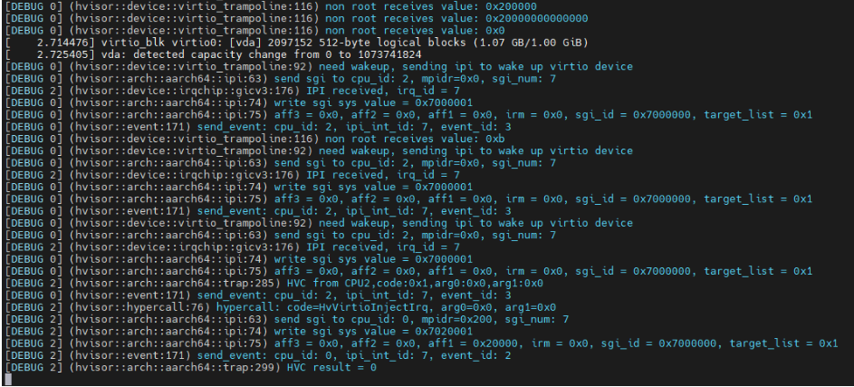

## hvisor适配飞腾派开发板

时间：2025年8月27日

作者：包子旭

### 0.飞腾派开发板相关知识

- 飞腾嵌入式软件开源社区：https://gitee.com/phytium_embedded
- 飞腾派开发板资料：https://www.iceasy.com/cloud/Phytium

### 1. hvisor适配新的开发板帮助文档

[hvisor 硬件适配开发手册 - hvisor 手册](https://hvisor.syswonder.org/chap01/PlatformDev.html)

[hvisor如何适配新板子——以aarch64 rk3568为例](https://kindly-tellurium-6bf.notion.site/hvisor-aarch64-rk3568-1c11786f530480928d00e93f9f7801c7)

[hvisor适配ok6254开发板](https://blog.syswonder.org/#/2025/20250604_Adapt_Hvisor_to_ok6254?id=hvisor适配ok6254开发板)

#### 1.1 platform文件结构

```bash
platform/aarch64/phytium-pi
├── board.rs 
├── cargo
│   ├── config.template.toml
│   └── features
├── configs
│   ├── zone1-linux-virtio.json
│   └── zone1-linux.json
├── image
│   └── dts
│       ├── Makefile
│       ├── linux1.dts
│       ├── linux2.dts
│       └── phytium-pi-board-v2.dts
├── linker.ld
└── platform.mk
```

board.rs：添加zone0设备树地址/内核加载地址/内核入口地址/RAM映射区域/IO映射区域/BOARD_MPIDR_MAPPINGS/BOARD_PHYSMEM_LIST/ROOT Liunx irq/gicd,gicr,gicc,gich,gicv,gits的基地址和大小，见后续**启动zone0**

features：对应的具体cargo features，包括gicv3、pl011

virtio_cfg.json：见后续**启动zone1**

zone1-linux.json：见后续**启动zone1**

linux1.dts：zone0设备树-基本上是原有设备树

linux2.dts：zone1设备树-精简后的设备树

phytium-pi-board-v2.dts：厂商提供的原始设备树

linker.ld：hvisor链接文件，修改相关启动地址

platform.mk：修改hvisor地址，zone0kernel，dtb地址

####    1.2  适配飞腾派加载启动hvisor地址

在尝试通过 U-Boot 阶段执行 TFTP 下载镜像并启动hvisor的过程中，遇到了一个问题：使用 `bootm 0x40400000 - 0x40000000` 命令启动失败，因为地址 `0x40400000 - 0x40000000` 被保护，无法从该地址加载 hvisor，查看uboot中默认的内核加载地址：`loadaddr=0x90100000`，以及设备树加载地址：`fdt_addr=0x90000000`。基于此信息，对hvisor的链接脚本以及相关 Makefile 进行了修改，以确保hvisor可以从正确的内存地址加载，首先修改hvisor的链接脚本 `platform/aarch64/phytium-pi/linker.ld`，将基地址设置为 `0x90100000`，以便与新的加载地址相匹配，接下来，在 `platform.mk` 中，调整 `mkimage` 工具生成 `hvisor.bin` 时的目标加载地址和入口点，使其也指向 `0x90100000`:

``` makefile
$(hvisor_bin): elf
	@if ! command -v mkimage > /dev/null; then \
		sudo apt update && sudo apt install u-boot-tools; \
	fi && \
	$(OBJCOPY) $(hvisor_elf) --strip-all -O binary $(hvisor_bin).tmp && \
	mkimage -n hvisor_img -A arm64 -O linux -C none -T kernel -a 0x90100000 \
	-e 0x90100000 -d $(hvisor_bin).tmp $(hvisor_bin) && \
	rm -rf $(hvisor_bin).tmp
```

修改后的uboot启动命令如下：

```shell
setenv serverip 192.168.137.1; setenv ipaddr 192.168.137.2; setenv loadaddr 0x90100000; setenv fdt_addr 0x90000000; setenv zone0_kernel_addr 0xa0400000; setenv zone0_fdt_addr 0xa0000000; tftp ${loadaddr} ${serverip}:hvisor.bin; tftp ${fdt_addr} ${serverip}:phytium-pi-board-v2.dtb; tftp ${zone0_kernel_addr} ${serverip}:Image; tftp ${zone0_fdt_addr} ${serverip}:linux1.dtb; bootm ${loadaddr} - ${fdt_addr};
```

####    1.3 适配飞腾派平台的 PL011 串口驱动

在完成hvisor的加载地址适配后，我们通过 U-Boot 成功将 hvisor、Linux 内核镜像以及设备树（DTB）加载到内存，并尝试启动内核。然而，在执行 `bootm` 命令后，系统卡在了输出 `Starting kernel ...` 阶段，没有任何后续日志输出，导致调试信息无法查看，难以进一步定位问题。经过对启动流程的分析与排查，最终确认问题是由于**没有正确配置串口地址**所致。这导致hvisor在启动过程中无法通过串口输出调试信息，进而表现为“卡死”现象，实则程序仍在运行，只是没有控制台输出可供观察。

``` shell
        uart@2800d000 {
            compatible = "arm,pl011\0arm,primecell";
            reg = <0x00 0x2800d000 0x00 0x1000>;
            interrupts = <0x00 0x54 0x04>;
            clocks = <0x0c 0x0c>;
            clock-names = "uartclk\0apb_pclk";
            status = "okay";
            phandle = <0x22>;
        };
```

从该定义可以看出：

- 飞腾派使用的是 **ARM PL011 UART 控制器**；
- 其寄存器起始物理地址为 `0x2800d000`；
- 支持中断和标准 PL011 功能；
- 串口处于启用状态（`status = "okay"`）。

因此，为了使hvisor能够正常输出调试信息，需要为其添加对 PL011 串口控制器的支持，由于hvsior已经实现了PL011的串口驱动（src/device/uart/pl011.rs），我们只需要在`platform/aarch64/phytium-pi/cargo/features`中加上`pl011`，并配置`board.rs`中的`BOARD_UART_BASE`即可。

``` rust
//board.rs只需配置为实际的串口地址即可
pub const BOARD_UART_BASE: u64 = 0x2800d000; //phytium_pi uart address
```

#### 1.4 配置CPU与MPIDR的映射关系

为了让系统正确识别和管理多核CPU，需要将每个CPU的ID与它的 **MPIDR**进行映射。MPIDR的值可以在设备树中对应的 **CPU 节点**下找到，它通常位于节点的 **`reg` 属性**中。

在下面的例子中，`cpu@0` 节点的 `reg = <0x00 0x200>` 表明其 **MPIDR** 是 `0x200`。需要将这个值和其他CPU的MPIDR依次填入 `board.rs` 文件中的 **`BOARD_MPIDR_MAPPINGS`** 数组，确保数组的顺序与逻辑CPU编号（CPU0-CPU3）一一对应。

```json
//设备树中CPU节点
cpu@0 {
			device_type = "cpu";
			compatible = "phytium,ftc310\0arm,armv8";
			reg = <0x00 0x200>;  //可看到CPU0对应的MPIDR为0x200
			enable-method = "psci";
			clocks = <0x09 0x02>;
			capacity-dmips-mhz = <0xb22>;
			phandle = <0x07>;
		};
//board.rs
#[rustfmt::skip]
pub static BOARD_MPIDR_MAPPINGS: [u64; BOARD_NCPUS] = [
    0x200,     // cpu0
    0x201,     // cpu1
    0x00,      // cpu2
    0x100,     // cpu3
];
```

#### 1.5 配置物理内存布局

正确的物理内存布局是操作系统能够正常启动和运行的基础。它定义了整个物理地址空间中，哪些地址范围是可用的RAM（`Normal` Memory），哪些是用于外设I/O的设备内存（`Device` Memory）。

需要查阅开发板的硬件手册或设备树（Device Tree）来获取准确的内存映射信息。这些信息需要被转换成 `(start, end, type)` 的格式，并填写到 `board.rs` 文件的 `BOARD_PHYSMEM_LIST` 数组中。

- `start`: 内存区域的起始物理地址。

- `end`: 内存区域的结束物理地址。

- `type`: 内存类型，通常是 `MemoryType::Normal`（普通DRAM）或 `MemoryType::Device`（设备MMIO）。

```rust
/// The physical memory layout of the board.
/// Each address should align to 2M (0x200000).
/// Addresses must be in ascending order.
#[rustfmt::skip]
pub const BOARD_PHYSMEM_LIST: &[(u64, u64, MemoryType)] = &[
 // (       start,           end,                type)
    (         0x0,    0x40000000,  MemoryType::Device),
    (  0x40000000,   0x100000000,  MemoryType::Normal),
];
```

####    1.6  解决hvisor启动时卡在 "Using 4 cpu(s) on this system." 及 CPU2/3 未正常初始化问题

在启动hvisor的过程中，系统卡在了输出 `Using 4 cpu(s) on this system.` 这一行，进一步调试发现程序卡死在 `cpu_start` 函数中。经过详细分析，确认问题出在 PSCI调用链中的 `psci::cpu_on` 函数，而根本原因在于未能正确获取到多核 CPU 的唯一标识符 `cpuid`。

通过查看设备树信息，我们确认飞腾派平台的 CPU 节点确实使用了 `psci` 作为启用方式，并且其底层依赖 SMC 指令与固件通信来唤醒 CPU。然而，飞腾派的 CPU ID 编码方式不同于常见的 ARM 平台，其四颗核心对应的 MPIDR 值分别为 `0x200`, `0x201`, `0x00`, `0x100`，而不是标准的 `0x01`, `0x02`, `0x03`, `0x04`。这导致默认的 CPU ID 映射逻辑无法正确识别这些值，从而引发唤醒失败或后续执行异常。

```text
cpu@0 {
            device_type = "cpu";
            compatible = "phytium,ftc310\0arm,armv8";
            reg = <0x00 0x200>;
            enable-method = "psci";
            clocks = <0x09 0x02>;
            capacity-dmips-mhz = <0xb22>;
            phandle = <0x07>;
        };

        cpu@1 {
            device_type = "cpu";
            compatible = "phytium,ftc310\0arm,armv8";
            reg = <0x00 0x201>;
            enable-method = "psci";
            clocks = <0x09 0x02>;
            capacity-dmips-mhz = <0xb22>;
            phandle = <0x08>;
        };

        cpu@100 {
            device_type = "cpu";
            compatible = "phytium,ftc664\0arm,armv8";
            reg = <0x00 0x00>;
            enable-method = "psci";
            clocks = <0x09 0x00>;
            capacity-dmips-mhz = <0x161c>;
            phandle = <0x05>;
        };

        cpu@101 {
            device_type = "cpu";
            compatible = "phytium,ftc664\0arm,armv8";
            reg = <0x00 0x100>;
            enable-method = "psci";
            clocks = <0x09 0x01>;
            capacity-dmips-mhz = <0x161c>;
            phandle = <0x06>;
        };

    psci {
        compatible = "arm,psci-1.0";
        method = "smc";
        cpu_suspend = <0xc4000001>;
        cpu_off = <0x84000002>;
        cpu_on = <0xc4000003>;
        sys_poweroff = <0x84000008>;
        sys_reset = <0x84000009>;
    };
```

在 `cpu_start` 函数中psci::cpu_on函数传入的CPU ID需要重新从BOARD_MPIDR_MAPPINGS中解析出来。根据 cpuid（0~3）将其转换为对应的MPIDR：CPU0 对应 `0x200`，CPU1 对应 `0x201`，CPU2 对应 `0x00`，CPU3 对应 `0x100`。这样确保了每个 CPU 都能被正确唤醒并跳转至指定的入口地址执行初始化代码。

``` rust
//hvsior dev分支cpu_start函数
pub fn cpu_start(cpuid: usize, start_addr: usize, opaque: usize) {
    psci::cpu_on(cpuid as u64 | 0x80000000, start_addr as _, opaque as _).unwrap_or_else(|err| {
        if let psci::error::Error::AlreadyOn = err {
        } else {
            panic!("can't wake up cpu {}", cpuid);
        }
    });
}
//兼容飞腾平台需要做的修改如下（同时兼容其他aarch64平台）
pub fn cpu_start(cpuid: usize, start_addr: usize, opaque: usize) {
    let new_cpuid = {
        if cpuid >= MAX_CPU_NUM {
            panic!("Invalid cpuid: {}", cpuid);
        }
        BOARD_MPIDR_MAPPINGS[cpuid]
    };
    psci::cpu_on(new_cpuid, start_addr as _, opaque as _).unwrap_or_else(|err| {
        if let psci::error::Error::AlreadyOn = err {
        } else {
            panic!("can't wake up cpu {}", cpuid);
        }
    });
}
```

### 2.通过hvisor启动zone0

####    2.1  earlycon未启导致Linux初始化日志缺失问题

在完成hvisor的串口驱动适配后，成功恢复了控制台输出功能，但此时仍然存在一个问题：**看不到Linux 内核启动过程中日志输出**，在早期内核初始化阶段，GIC、时钟等模块的调试信息未能及时打印出来。通过查看设备树，发现问题是由于启动选项中 缺少 earlycon 所致。在设备树中的 `chosen` 节点中添加并启用了如下参数：

``` shell
    chosen {
        stdout-path = "serial1:115200n8";
        bootargs = "clk_ignore_unused console=ttyAMA1,115200 earlycon=pl011,0x2800d000,115200 root=/dev/mmcblk0p1 rootwait rw";
    };

```

##### 启用了 `earlycon=pl011,0x2800d000`

- 该参数是 **earlycon 驱动的标准格式**，明确告诉内核使用 `pl011` 类型串口，并指定其 MMIO 地址。

- 内核在非常早的阶段（甚至还没初始化 `printk`）时，就可以输出日志 ，便于开发调试。

- 原本的 `earlyprintk` 方式依赖于编译时默认平台和串口配置。

####    2.2  unhandled MMIO 异常的原因与处理方法

在hvisor的运行过程中，系统频繁出现 `unhandled mmio` 错误提示。这类错误通常表明：**某个设备的 MMIO 地址空间被访问了，但 Hypervisor 并未对其进行映射或处理**。这会导致虚拟机中的设备访问失败，引发系统异常。这些错误来源于**飞腾派平台设备树中定义的一些外设地址未在hvisor中配置对应的内存映射区域**。也就是说，当 Linux 内核尝试访问某些硬件寄存器时，hvisor 因为没有为其建立 MMIO 映射而无法正确响应，从而触发 `unhandled mmio` 异常。

解决步骤：

- 通过日志中报错的地址反推是哪个设备被访问；
- 查看该设备在设备树中的 `reg` 地址范围；
- 在 hvisor 的配置文件 `board.rs` 中，将这些地址添加到 `ROOT_ZONE_MEMORY_REGIONS` 列表中，确保其被正确映射；

   **禁用不必要的外设**

- 对于一些当前并不使用的设备（如 USB、pmdk_dp、dc、pcie、hda、sata、vpu 等），可以直接将其设备节点的 `status` 属性设置为 `"disabled"`，以避免 Linux 内核尝试访问它们；

####    2.3  serial-getty 服务异常导致系统卡死

在解决多个 `unhandled mmio` 错误后，Linux 内核终于能够顺利完成初始化并进入用户空间阶段。然而，在后续的启动过程中，系统卡在了 `[ OK ] Listening on Load/Save RF state /dev/rfkill Watch.` 这一行日志，表现为“卡死”现象。经过深入分析，判断这并非系统真正的崩溃或死锁，而是由于串口 `getty` 没有正常工作所导致的“伪卡死”。

在 `multi-user.target` 模式下，系统会默认尝试启动 `serial-getty@ttyAMA1.service`，以便提供串口终端登录功能。然而，如果 `/dev/ttyAMA1` 设备未被正确识别，或者对应的串口驱动未能正常加载，该服务便会进入反复重试状态，造成 systemd 启动流程在此处停滞，用户无法看到登录提示符，从而产生系统“卡住”的错觉(**猜测是因为系统卡在了启动serial-getty@ttyAMA1.service之前的某个服务**)。考虑到当前环境对完整用户空间服务（如蓝牙、无线网络、音频等）的需求尚不迫切，选择在内核启动参数中添加 `init=/bin/sh` 的方式，**绕过整个 systemd 初始化流程**，直接进入由 BusyBox 提供的 Shell 环境。这一方式不会加载任何服务、不会管理 socket、也不会尝试启动 `getty`，从而避免因串口控制台问题引发的阻塞。

``` rust
chosen {
        stdout-path = "serial1:115200n8";
        bootargs = "clk_ignore_unused console=ttyAMA1,115200 earlycon=pl011,0x2800d000,115200 root=/dev/mmcblk0p1 rw rootwait init=/bin/sh";
    };

```

### 3.在zone0中使用hvisor-tool启动zone1

#### 3.1 编译hvisor-tool

[Hvisor 管理工具 - hvisor 手册](https://hvisor.syswonder.org/chap04/subchap04/ManageTools.html)

[hvisor-tool README-zh](https://github.com/syswonder/hvisor-tool/blob/main/README-zh.md)

#### 3.2 hvisor-tool启动配置文件

详见：[ZONE的配置与管理 - hvisor 手册](https://hvisor.syswonder.org/chap03/ZoneConfig.html#non-root-zones配置)

[zone1-linux-virtio.json](https://github.com/Baozixu99/hvisor/blob/phytium-pi/platform/aarch64/phytium-pi/configs/zone1-linux-virtio.json)

id：启动non root的id号

memory_region：non root所使用的内存地址范围等信息

devices：non root所使用的virtio设备

[zone1-linux.json](https://github.com/Baozixu99/hvisor/blob/phytium-pi/platform/aarch64/phytium-pi/configs/zone1-linux.json)

映射zone1需要的io设备、virtio设备内存地址和ram区域（类似于board.rs）

#### 3.3 zone1设备树修改

精简zone1设备树，保留必要的设备节点（删除时可以搜索有没有其他必要设备引用该phandle），并保证zone0所占用的设备/地址不冲突。同时需要添加virtio blk、virtio serial等virtio设备节点，并修改chosen参数。

裁剪后设备树见: [linux2.dts](https://github.com/Baozixu99/hvisor/blob/phytium-pi/platform/aarch64/phytium-pi/image/dts/linux2.dts)

#### 3.4 hvisor-tool启动zone1

```shell
# zone0挂载zone1的相关指令
#切换到home目录下
cd /home/
# 加载hvisor-tool内核驱动
insmod hvisor.ko
mount -t proc proc /proc
mount -t sysfs sysfs /sys
rm nohup.out
mkdir -p /dev/pts
mount -t devpts devpts /dev/pts

# 启动nohup守护进程，处理virtio相关请求
nohup ./hvisor virtio start zone1-linux-virtio.json &
# 启动zone1
./hvisor zone start zone1-linux.json
#切换到zone1终端命令
script /dev/null #创建一个伪终端
screen /dev/pts/0
# hvisortool管理相关指令
./hvisor zone list
./hvisor zone shutdown -id 1
```

#### 3.5 zone1启动过程中遇到的问题

##### **3.5.1 加载hvisor.ko内核失败**

在成功启动 Root Linux 后，我们尝试加载 `hvisor.ko` 内核模块以启动 Non-Root Linux，但遇到了如下错误：

```shell
root@(none):/home# insmod hvisor.ko
[   12.524631] hvisor: loading out-of-tree module taints kernel.
[   12.531169] irq: type mismatch, failed to map hwirq-64 for interrupt-controller@30800000!
[   12.539430] hvisor cannot register IRQ, err is -22
insmod: ERROR: could not insert module hvisor.ko: Invalid parameters
```

错误日志显示 `irq: type mismatch, failed to map hwirq-64` 和 `hvisor cannot register IRQ, err is -22`，明确指出 `hvisor.ko` 在注册中断时因中断类型不匹配而失败，导致模块无法加载（错误码 -22，即 `EINVAL`，参数无效）。

冲突的设备树节点定义如下：

```rust
usb2@31800000 {
            compatible = "phytium,e2000-usb2";
            reg = <0x00 0x31800000 0x00 0x80000 0x00 0x31990000 0x00 0x10000>;
            interrupts = <0x00 0x20 0x04>; // <-- 此处中断号为 0x20
            status = "ok";
            dr_mode = "host";
        };

hvisor_virtio_device {
        compatible = "hvisor";
        interrupt-parent = <0x01>;
        interrupts = <0x00 0x20 0x01>; // <-- 此处中断号也为 0x20
    };
```

从上述配置中可以看到，`usb2` 设备和 `hvisor_virtio_device` 都尝试使用中断号 `0x20`。在 GIC体系中，中断号是唯一的资源标识符。当两个不同的设备请求注册同一个中断号时，就会导致冲突并阻止模块的正常加载。由于当前阶段尚无需使用 USB2 设备，我们采取的临时解决方案是禁用设备树中的 `usb2@31800000` 节点，以解除中断号冲突。通过将 `usb2` 节点的 `status` 属性设置为 `"disabled"`，可以避免其在内核启动时注册该中断。完成此修改后，`hvisor.ko` 模块得以成功加载，未来若需启用 USB2 功能，则需重新为hvisor_virtio_device分配设备中断号。

#####    3.5.2 virtio backend is too slow && GICR地址分配错误问题分析

使用 `hvisor` 启动 Non-root Linux时（使用virtio block、virtio serial），日志持续打印如下警告和错误信息：

``` less
[WARN  2] (hvisor::device::virtio_trampoline:108) virtio backend is too slow, please check it!
[ERROR 2] (hvisor::device::virtio_trampoline:112) virtio backend may have some problem, please check it!
```

现象概述：

- **Root Linux** 运行正常，且 virtio 设备初始化成功；
- **Non-root Linux** 中 virtio 设备无法正常工作；
- 中断看似注入成功，但未生效；
- 当禁用 virtio 设备后，Non-root Linux 可以正常启动。

<pre>
<span style="color: blue">[DEBUG 2] (hvisor::device::virtio_trampoline:56) mmio virtio handler,mmio.address: 0x0, mmio.size: 4, mmio.is_write: false, mmio.value: 0xffff80001168dc00,base: 0xa003c00
<span style="color: blue">[DEBUG 2] (hvisor::device::virtio_trampoline:64) dev.base_address: 0x81bd9000, dev.is_enable: true
<span style="color: blue">[DEBUG 2] (hvisor::device::virtio_trampoline:81) src_cpu: 0x2, address: 0xa003c00, size: 4, value: 0xffff80001168dc00, src_zone: 1, is_write: 0, need_interrupt: 0
<span style="color: blue">[DEBUG 2] (hvisor::device::virtio_trampoline:91) old cfg flag: 0x0,cpu2
<span style="color: blue">[DEBUG 2] (hvisor::device::virtio_trampoline:210) push req to hvisor req list, req_rear: 1, req_front: 0, req_list[1]: HvisorDeviceReq { src_cpu: 0, address: 0, size: 0, value: 0, src_zone: 0, is_write: 0, need_interrupt: 0, _padding: 0 }
<span style="color: blue">[DEBUG 2] (hvisor::device::virtio_trampoline:96) need wakeup, sending ipi to wake up virtio device
<span style="color: blue">[DEBUG 2] (hvisor::arch::aarch64::ipi:63) send sgi to cpu_id: 0, mpidr=0x200, sgi_num: 7
<span style="color: blue">[DEBUG 2] (hvisor::arch::aarch64::ipi:74) write sgi sys value = 0x7020001
<span style="color: green">[INFO  3] (hvisor::arch::aarch64::trap:110) arch_handle_exit called 12901 times
<span style="color: blue">[DEBUG 2] (hvisor::arch::aarch64::ipi:75) aff3 = 0x0, aff2 = 0x0, aff1 = 0x20000, irm = 0x0, sgi_id = 0x7000000, target_list = 0x1
<span style="color: greem">[INFO  3] (hvisor::arch::aarch64::trap:111) Current exception reason: 3
<span style="color: blue">[DEBUG 2] (hvisor::event:171) send_event: cpu_id: 0, ipi_int_id: 7, event_id: 3
<span style="color: orange">[WARN  2] (hvisor::device::virtio_trampoline:109) virtio backend is too slow, please check it!
<span style="color: red">[ERROR 2] (hvisor::device::virtio_trampoline:113) virtio backend may have some problem, please check it!
</pre>
**Virtio 请求正常触发，backend 中断未响应**

通过日志追踪，virtio 前端设备触发了 MMIO 读请求，并设置了 `need_interrupt = true`，随后 hypervisor 内部发起了 IPI 中断：

``` css
[DEBUG 2] send sgi to cpu_id: 0, mpidr=0x200, sgi_num: 7
[DEBUG 2] (hvisor::arch::aarch64::ipi:74) write sgi sys value = 0x7020001
[DEBUG 2] aff3 = 0x0, aff2 = 0x0, aff1 = 0x20000, irm = 0x0, sgi_id = 0x7000000, target_list = 0x1
```

`0x7020001` 对应 ICC_SGI1R_EL1 的值，表示 SGI 7 发往 Aff0 = 0、Aff1 = 2（MPIDR = 0x200）目标为 Root Linux 的 CPU（CPU0），理论上这会唤醒 Root Linux 的 Virtio 后端处理线程。

**SGI 中断未在 Root Linux 被处理**.

查看 `gicv3_handle_irq_el1()` 函数发现只触发了虚拟定时器（irq_id==27），但从未触发 `irq_id == SGI_IPI_ID`。说明 SGI 虽然写入，但未能成功注入或处理：

``` rust
if irq_id == SGI_IPI_ID {
    debug!("IPI received, irq_id = {}", irq_id);
    ipi_handled = check_events();
}
```

该分支始终未进入。并且系统中每个 CPU 都正确执行了 `gicc_init()` 和 `enable_ipi()`，其中 `DAIF` 中断屏蔽位已正确打开，且 `icc_igrpen1_el1 = 1`，`icc_pmr_el1 = 0xf0`，允许 Group 1 中断进入。Redistributor 的 IGROUPR 和 ISENABLER 也已设置。在当前实现中，虽然 `write_sysreg!(icc_sgi1r_el1, val)` 成功发送 IPI，但实际 `vgic_inject_irq()` 并**未将 SGI 设置进目标CPU  GICR 的 `SGIR` 寄存器**，或未在 `vgic_pending_table` 中标记为 pending，导致 Root Linux 的 `pending_irq()` 无法枚举出 irq_id == 7，从而 `gicv3_handle_irq_el1()` 无法进入处理分支。

**GIC Redistributor 地址冲突分析**

通过对比发现，`hvisor` 在初始化 VGIC 时，为每个 CPU 分配的 Redistributor 地址如下：

``` less
[INFO  0] (hvisor::device::irqchip::gicv3::vgic:52) registering gicr cpu0 at 0x30880000
[INFO  0] (hvisor::device::irqchip::gicv3::vgic:52) registering gicr cpu1 at 0x308a0000
[INFO  0] (hvisor::device::irqchip::gicv3::vgic:52) registering gicr cpu2 at 0x308c0000
[INFO  0] (hvisor::device::irqchip::gicv3::vgic:52) registering gicr cpu3 at 0x308e0000
```

而 root Linux和non-root linux 启动日志显示，系统扫描 GICR_TYPER 并得到如下映射：：

``` less
 CPU0: found redistributor 200 region 0:0x00000000308c0000 
 CPU1: found redistributor 201 region 0:0x00000000308e0000 
 CPU2: found redistributor 0 region 0:0x0000000030880000
 CPU3: found redistributor 100 region 0:0x00000000308a0000
```

原因分析：Linux 是根据设备树中 `/cpus` 节点的 MPIDR 值（即 reg 字段）确定 affinity，并据此扫描 GICR。

```text
mpidr = (Aff3 << 32) | (Aff2 << 16) | (Aff1 << 8) | Aff0

0x0000000000000200 → Aff1 = 2, Aff0 = 0
0x0000000000000201 → Aff1 = 2, Aff0 = 1
0x0000000000000000 → Aff1 = 0, Aff0 = 0
0x0000000000000100 → Aff1 = 1, Aff0 = 0
```

| 节点名  | reg（MPIDR） | Affinity (Aff1, Aff0) | 说明                |
| ------- | ------------ | --------------------- | ------------------- |
| cpu@0   | 0x200        | (2, 0)                | Root Linux CPU0     |
| cpu@1   | 0x201        | (2, 1)                | Root Linux CPU1     |
| cpu@100 | 0x000        | (0, 0)                | Non-root Linux CPU2 |
| cpu@101 | 0x100        | (1, 0)                | Non-root Linux CPU3 |

由于 Redistributor 地址应按 **MPIDR affinity（Aff1, Aff0）**组合升序排列（而不是逻辑 CPU 编号），所以实际应为：.

```text
gicr_base = 0x30880000

GICR for Aff1=0, Aff0=0  → 0x30880000   (non-root CPU2)
GICR for Aff1=1, Aff0=0  → 0x308a0000   (non-root CPU3)
GICR for Aff1=2, Aff0=0  → 0x308c0000   (root CPU0)
GICR for Aff1=2, Aff0=1  → 0x308e0000   (root CPU1)
```

**hvisor现有的GICR地址分配仅按逻辑CPU编号依次排列，没有考虑MPIDR与affinity的映射关系**，导致 Linux 找到的 Redistributor 地址与 hvisor 注册不一致，**最终可能导致中断注入失败，从而影响 virtio 正常工作。**

CPU对应的Redistributor寄存器的物理基地址是根据Aff1和Aff0的编号升序分配的，**为适配飞腾派平台需修改为基于 MPIDR affinity 的 GICR 地址分配**：

``` rust
//hvsior dev分支host_gicr_base函数
pub fn host_gicr_base(id: usize) -> usize {
    assert!(id < consts::MAX_CPU_NUM);
    GIC.get().unwrap().gicr_base + id * PER_GICR_SIZE
}
//兼容飞腾平台需要做的修改如下（同时兼容其他aarch64平台）
pub fn host_gicr_base(id: usize) -> usize {
    assert!(id < consts::MAX_CPU_NUM);
    let mpidr = BOARD_MPIDR_MAPPINGS[id] as usize;
    let aff0 = (mpidr >> 0) & 0xff;
    let aff1 = (mpidr >> 8) & 0xff;
    let cpu_interface_number = aff1 | aff0;
    GIC.get().unwrap().gicr_base + cpu_interface_number * PER_GICR_SIZE
}
```

对应地，在 `vgicv3_mmio_init` 中替换gicr_base的计算方式：
**这里的问题和`host_gicr_base`一样，仅按逻辑CPU编号映射GICR的MMIO区域，由于在前面已经修改了host_gicr_base函数，所以这里直接调用就行**。

```rust
//hvsior dev分支vgicv3_mmio_init函数
pub fn vgicv3_mmio_init(&mut self, arch: &HvArchZoneConfig) {
        if arch.gicd_base == 0 || arch.gicr_base == 0 {
            panic!("vgicv3_mmio_init: gicd_base or gicr_base is null");
        }

        self.mmio_region_register(arch.gicd_base, arch.gicd_size, vgicv3_dist_handler, 0);
        self.mmio_region_register(arch.gits_base, arch.gits_size, vgicv3_its_handler, 0);

        for cpu in 0..MAX_CPU_NUM {
            let gicr_base = arch.gicr_base + cpu * PER_GICR_SIZE;
            debug!("registering gicr {} at {:#x?}", cpu, gicr_base);
            self.mmio_region_register(gicr_base, PER_GICR_SIZE, vgicv3_redist_handler, cpu);
        }
    }
//兼容飞腾平台需要做的修改如下（同时兼容其他aarch64平台）
pub fn vgicv3_mmio_init(&mut self, arch: &HvArchZoneConfig) {
        if arch.gicd_base == 0 || arch.gicr_base == 0 {
            panic!("vgicv3_mmio_init: gicd_base or gicr_base is null");
        }

        self.mmio_region_register(arch.gicd_base, arch.gicd_size, vgicv3_dist_handler, 0);
        self.mmio_region_register(arch.gits_base, arch.gits_size, vgicv3_its_handler, 0);

        for cpu in 0..MAX_CPU_NUM {
            let gicr_base = host_gicr_base(cpu);
            info!("registering gicr cpu{} at {:#x?}", cpu, gicr_base);
            self.mmio_region_register(gicr_base, PER_GICR_SIZE, vgicv3_redist_handler, cpu);
        }
    }
```

报错原因源于 virtio 后端未及时响应，实为中断注入失败引发；深层根因是 GICR 分配逻辑未与 CPU 的 MPIDR 对齐。这样修改后即可保证 VGIC 注册的 GICR 区域与 Linux 启动过程中识别的一致，**确保 virtio 中断能够正确注入并被处理**。

##### 3.5.3 GICR 映射重复 + LAST 标志设置错误

在解决了 GIC Redistributor 地址冲突问题后，虽然系统不再出现 `virtio backend is too slow` 的报错，但在 Linux 内核启动过程中仍然出现了卡死现象。具体表现为系统日志中输出如下内容后卡死：



**1.GICR 地址映射重复**

在 `board.rs` 中的 `ROOT_ZONE_MEMORY_REGIONS` 列表中，手动添加了 GICR 地址区域的映射：

```rust
pub const ROOT_ZONE_MEMORY_REGIONS: [HvConfigMemoryRegion; 11] = [
        HvConfigMemoryRegion {
        mem_type: MEM_TYPE_IO,
        physical_start: 0x30880000,  //gicr
        virtual_start: 0x30888000,
        size: 0x80000,          
    },
];
```

而在 `vgicv3_mmio_init()` 函数中，又再次为每个 CPU 注册了 GICR 的 MMIO 区域：

```rust
self.mmio_region_register(gicr_base, PER_GICR_SIZE, vgicv3_redist_handler, cpu);
```

**重复映射**导致了内存访问冲突，进而影响到 Linux 内核对 GICR 的正常识别和初始化，需要删除 `board.rs` 中对 GICR 区域的手动映射配置**，让所有的 GICR 区域由 `vgicv3_mmio_init()` 函数统一管理。

**2. GICR_TYPER.LAST 设置逻辑错误**

删除后启动Root linux出现`CPU0: mpidr 200 has no re-distributor!`报错，没有找到CPU0对应的 GICR 基地址；在裸机linux启动日志和hvisor启动日志中可看到各个CPU对应的gicr地址如下，两者是一致的，理论上不应该会出现找不到CPU0对应的 GICR 基地址问题：

``` c++
//裸机linux启动日志
CPU0: found redistributor 200 region 0:0x00000000308c0000 
 CPU1: found redistributor 201 region 0:0x00000000308e0000 
 CPU2: found redistributor 0 region 0:0x0000000030880000
 CPU3: found redistributor 100 region 0:0x00000000308a0000
//hvisor启动日志
[INFO  0] (hvisor::device::irqchip::gicv3::vgic:52) registering gicr cpu0 at 0x30880000
[INFO  0] (hvisor::device::irqchip::gicv3::vgic:52) registering gicr cpu1 at 0x308a0000
[INFO  0] (hvisor::device::irqchip::gicv3::vgic:52) registering gicr cpu2 at 0x308c0000
[INFO  0] (hvisor::device::irqchip::gicv3::vgic:52) registering gicr cpu3 at 0x308e0000
```

查看linux源码分析Linux启动时如何扫描 GIC Redistributor 区域（GICR），相关代码如下：

```c
static int gic_iterate_rdists(int (*fn)(struct redist_region *, void __iomem *))
{
    int ret = -ENODEV;
    int i;
    //  遍历所有 Redistributor 区域
    for (i = 0; i < gic_data.nr_redist_regions; i++) {
        void __iomem *ptr = gic_data.redist_regions[i].redist_base;
        u64 typer;
        u32 reg;

        reg = readl_relaxed(ptr + GICR_PIDR2) & GIC_PIDR2_ARCH_MASK;
        if (reg != GIC_PIDR2_ARCH_GICv3 &&
            reg != GIC_PIDR2_ARCH_GICv4) { /* We're in trouble... */
            pr_warn("No redistributor present @%p\n", ptr);
            break;
        }
     // 遍历当前 Redistributor 区域中的所有 Redistributor 实例
        do {
            typer = gic_read_typer(ptr + GICR_TYPER);
            ret = fn(gic_data.redist_regions + i, ptr);
            if (!ret)
                return 0;

            if (gic_data.redist_regions[i].single_redist)
                break;

            if (gic_data.redist_stride) {
                ptr += gic_data.redist_stride;
            } else {
                ptr += SZ_64K * 2; /* Skip RD_base + SGI_base */
                if (typer & GICR_TYPER_VLPIS)
                    ptr += SZ_64K * 2; /* Skip VLPI_base + reserved page */
            }
        } while (!(typer & GICR_TYPER_LAST));//GICR_TYPER.LAST == 1（表示这是最后一个 Redistributor）
    }

    return ret ? -ENODEV : 0;
}
```

Linux 内核在启动过程中会从 GICR 基地址开始依次扫描每个 CPU 的 Redistributor 区域，直到遇到设置了 `GICR_TYPER.LAST` 标志的寄存器页为止。结合hvisor启动日志，发现Linux目前只扫描到了CPU2（0x30880000）和CPU3（0x308a0000）的Redistributor区域，没有扫描到CPU0（0x308c0000）和CPU1（0x308e0000）的Redistributor区域：


```shell
[DEBUG 0] (hvisor::device::irqchip::gicv3::vgic:143) gicr(2) mmio = MMIOAccess {
    address: 0xffe8,
    size: 0x4,
    is_write: false,
    value: 0xffff80001170ffe8,
}
[DEBUG 0] (hvisor::device::irqchip::gicv3::vgic:143) gicr(2) mmio = MMIOAccess {
    address: 0x8,
    size: 0x8,
    is_write: false,
    value: 0xffff800011700008,
}
[DEBUG 0] (hvisor::device::irqchip::gicv3::vgic:143) gicr(2) mmio = MMIOAccess {
    address: 0x8,
    size: 0x8,
    is_write: false,
    value: 0xffff800011700008,
}
[DEBUG 0] (hvisor::device::irqchip::gicv3::vgic:143) gicr(3) mmio = MMIOAccess {
    address: 0x8,
    size: 0x8,
    is_write: false,
    value: 0xffff800011720008,
}
[DEBUG 0] (hvisor::device::irqchip::gicv3::vgic:143) gicr(3) mmio = MMIOAccess {
    address: 0x8,
    size: 0x8,
    is_write: false,
    value: 0xffff800011720008,
}
[    0.000000] ------------[ cut here ]------------
[    0.000000] CPU0: mpidr 200 has no re-distributor!
[    0.000000] WARNING: CPU: 0 PID: 0 at drivers/irqchip/irq-gic-v3.c:908 gic_init_bases+0x48c/0x590
[    0.000000] Modules linked in:
[    0.000000] CPU: 0 PID: 0 Comm: swapper/0 Not tainted 5.10.209-phytium-embedded-v2.2 #126
```

在当前的 `vgicv3_redist_handler` 实现中，处理 `GICR_TYPER` 寄存器访问的逻辑如下：

```rust
reg if reg == GICR_TYPER || reg == GICR_TYPER + 0x4 => {
            // For aarch32 guest, the access to GICR_TYPER will be split into two parts.
            // Many GIC supports 32-bit access to GICR_TYPER twice.
            mmio_perform_access(gicr_base, mmio);
            if cpu == MAX_CPU_NUM - 1 && reg == GICR_TYPER {
                mmio.value |= GICR_TYPER_LAST;
            }
        }
```

这段逻辑默认将最后一个 CPU（即 CPU3）设为最后一个 Redistributor，但实际上，在飞腾派平台上，**CPU0 的 GICR 区域才是最后一个 Redistributor**。因此，当 Linux 扫描到 CPU1（0x308a0000）时就提前遇到了 `LAST=1` 的标志，停止继续扫描，导致后续的 CPU0（0x308c0000）和 CPU1（0x308e0000）的 Redistributor 区域未被识别。

针对飞腾派平台的硬件特性，修改 `vgicv3_redist_handler` 中判断是否设置 `GICR_TYPER.LAST` 的逻辑，**当访问 GICR_TYPER 寄存器时，若当前 CPU 的 MPIDR 值是系统中所有 CPU 的最大值，则在返回值中设置 `GICR_TYPER_LAST` 标志位：**

```rust
//hvsior dev分支vgicv3_redist_handler函数
pub fn vgicv3_redist_handler(mmio: &mut MMIOAccess, cpu: usize) -> HvResult {
    trace!("gicr({}) mmio = {:#x?}", cpu, mmio);
    let gicr_base = host_gicr_base(cpu);
    match mmio.address {
        GICR_CTLR => {
            if get_cpu_data(cpu).zone.is_none() {
                if !mmio.is_write {
                    mmio_perform_access(gicr_base, mmio);
                }
            } else if Arc::ptr_eq(&this_zone(), get_cpu_data(cpu).zone.as_ref().unwrap()) {
                mmio_perform_access(gicr_base, mmio);
            } else {
                if !mmio.is_write {
                    mmio_perform_access(gicr_base, mmio);
                }
            }
        }
        reg if reg == GICR_TYPER || reg == GICR_TYPER + 0x4 => {
            // For aarch32 guest, the access to GICR_TYPER will be split into two parts.
            // Many GIC supports 32-bit access to GICR_TYPER twice.
            mmio_perform_access(gicr_base, mmio);
            if cpu == MAX_CPU_NUM - 1 && reg == GICR_TYPER {
                mmio.value |= GICR_TYPER_LAST;
            }
        }
//兼容飞腾平台需要做的修改如下（同时兼容其他aarch64平台）
pub fn vgicv3_redist_handler(mmio: &mut MMIOAccess, cpu: usize) -> HvResult {
    trace!("gicr({}) mmio = {:#x?}", cpu, mmio);
    let gicr_base = host_gicr_base(cpu);
    match mmio.address {
        GICR_CTLR => {
            if get_cpu_data(cpu).zone.is_none() {
                if !mmio.is_write {
                    mmio_perform_access(gicr_base, mmio);
                }
            } else if Arc::ptr_eq(&this_zone(), get_cpu_data(cpu).zone.as_ref().unwrap()) {
                mmio_perform_access(gicr_base, mmio);
            } else {
                if !mmio.is_write {
                    mmio_perform_access(gicr_base, mmio);
                }
            }
        }
        reg if reg == GICR_TYPER || reg == GICR_TYPER + 0x4 => {
            // For aarch32 guest, the access to GICR_TYPER will be split into two parts.
            // Many GIC supports 32-bit access to GICR_TYPER twice.
            mmio_perform_access(gicr_base, mmio);
            let max_mpidr = BOARD_MPIDR_MAPPINGS.iter().max().copied().unwrap_or(0);
            let current_mpidr = BOARD_MPIDR_MAPPINGS[cpu];
            if current_mpidr == max_mpidr && reg == GICR_TYPER {
                mmio.value |= GICR_TYPER_LAST;
            }
        }        
```

这样，Linux 内核在扫描时可以完整遍历所有 CPU 的 GICR 区域，正确识别每个 CPU 的 Redistributor，从而完成 GICv3 的初始化。修改完成后重新构建并运行 hvisor，Linux 内核成功完成了 GIC 初始化流程，能够识别所有 CPU 的 Redistributor 区域。串口输出完整，系统响应正常，Virtio 设备中断也能够正常注入。
