# Genesis使用教程

## 前言

出于配置问题，笔者是在macos系统上安装genesis的，可能遇到的问题与Linux、Windows系统的大相径庭，如果未能帮助到读者，请理解。

## 安装配置

根据官方的指引进行安装即可。官方的github仓库链接：

[GitHub - Genesis-Embodied-AI/Genesis: A generative world for general-purpose robotics &amp; embodied AI learning.](https://github.com/Genesis-Embodied-AI/Genesis)

官方的代码仓库：

[👋🏻 Hello, Genesis &#8212; Genesis 0.2.0 文档](https://genesis-world.readthedocs.io/zh-cn/latest/user_guide/getting_started/hello_genesis.html)

> 注意，macos似乎不能够支持CUDA，所以在效率上会有一定的损失。

为了进行隔离，我这里设置了一个专门的虚拟环境：

```python
# 设置虚拟环境
python3 -m venv .venv
source .venv/bin/activate
```

然后进行如下的安装：

```python
# 和torch的官方内容一样。注意匹配自身的版本。
pip3 install torch torchvision torchaudio
# 安装genesis# 可以直接使用如下的方式：
pip3 install genesis-world
# 也可以这样：
pip install git+https://github.com/Genesis-Embodied-AI/Genesis.git
```

由于官方文档中，涉及到很多**源代码**的文件，所以拉取源代码：

```bash
git clone https://github.com/Genesis-Embodied-AI/Genesis.git
```

为了防止混淆，我将目录名字从**Genesis改成了codes**，之后便可以开始使用genesis了。

> 注意，直接从源代码安装，在macos系统上可能出现问题，所以还是优先使用pip。

## hello, genesis!

这是官方给出的第一个genesis程序。为了更好的可维护性，我进行了一些调整。以下是调整后的代码，相关的操作都在注释中有详细的说明：

```python
import genesis as gs
import os

# 为了方便，我自己定义了一些较为常用的环境变量。
assets_path = os.environ.get("ASSETS_PATH")
# 如前文所述，这里只能用CPU
gs.init(backend=gs.cpu)

# 较为完整的初始化参数例子：
# 所有的对象、机器人和摄像机都在Scene这个类中
scene = gs.Scene(show_viewer=True)
plane = scene.add_entity(gs.morphs.Plane())
franka = scene.add_entity(
        gs.morphs.MJCF(file=assets_path + "xml/franka_emika_panda/panda.xml")
)

scene.build()

for i in range(1000):
        scene.step()
```

执行上述的代码，就可以画出一个**只受到自然重力的机器臂**，如下所示：

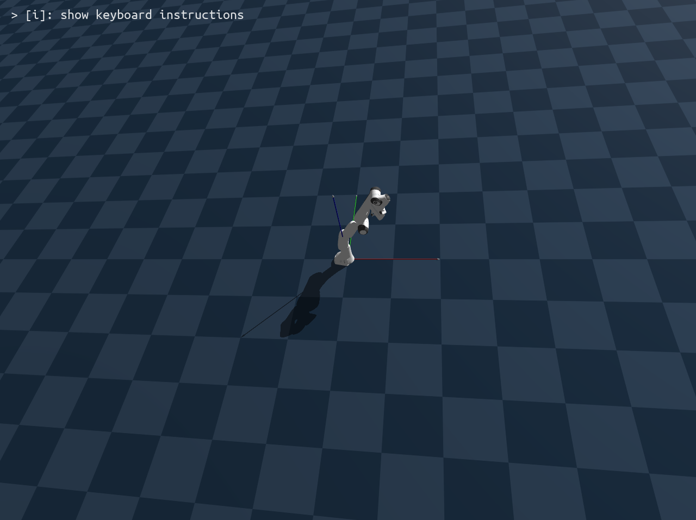

## 可视化与渲染

Genesis的可视化系统由场景的visualizer管理（即scene.visualizer）。可以通过两种方式来可视化场景：

1.  使用**独立线程**运行的交互式查看器

2.  手动添加相机并渲染图像

### 查看器

官方给出的代码是这样的：

```python
scene = gs.Scene(
    show_viewer    = True,
    viewer_options = gs.options.ViewerOptions(
        res           = (1280, 960),
        camera_pos    = (3.5, 0.0, 2.5),
        camera_lookat = (0.0, 0.0, 0.5),
        camera_fov    = 40,
        max_FPS       = 60,
    ),
    vis_options = gs.options.VisOptions(
        show_world_frame = True, # 显示原点坐标系
        world_frame_size = 1.0, # 坐标系长度(米)
        show_link_frame  = False, # 不显示实体链接坐标系 
        show_cameras     = False, # 不显示相机网格和视锥
        plane_reflection = True, # 开启平面反射
        ambient_light    = (0.1, 0.1, 0.1), # 环境光
    ),
    renderer = gs.renderers.Rasterizer(), # 使用光栅化渲染器
)
```

那么什么是viewer，什么又是vis呢？

简单而言，viewer就是**相机**，我们看到的可视化界面就是**以相机的视角呈现的**。解释一下，res在这里是resolution的意思，也即分辨率。其他的参数则不言自明。

而vis就是整个**场景本身的配置**，这一点也很好理解。

之后就是渲染器了，目前Genesis提供了两种渲染器，Rasterizer和RayTracer。使用RayTracer**有可能出现问题**，具体内容请看FAQ。

>  一般地，**查看器固定使用光栅化，而相机默认也适用光栅化。**

### 相机与离线渲染

可以通过如下的方式来手动地创建一个相机：

```python
cam = scene.add_camera(
    res    = (1280, 960),
    pos    = (3.5, 0.0, 2.5),
    lookat = (0, 0, 0.5),
    fov    = 30,
    GUI    = False
)
```

设置`GUI=True`会为每个相机创建opencv窗口显示渲染结果。默认只渲染RGB，但是一共有四种模式：

- **RGB图像**

- **深度图**

- **分割掩码**

- **表面法线**

可以通过参数开启：

```python
scene.build()

# 渲染所有类型
rgb, depth, segmentation, normal = cam.render(depth=True, segmentation=True, normal=True)
```

> 注意，开启上述内容后**会极大降低帧率。**

显示的内容如下：

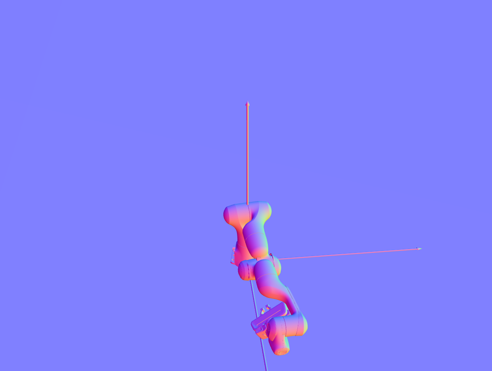

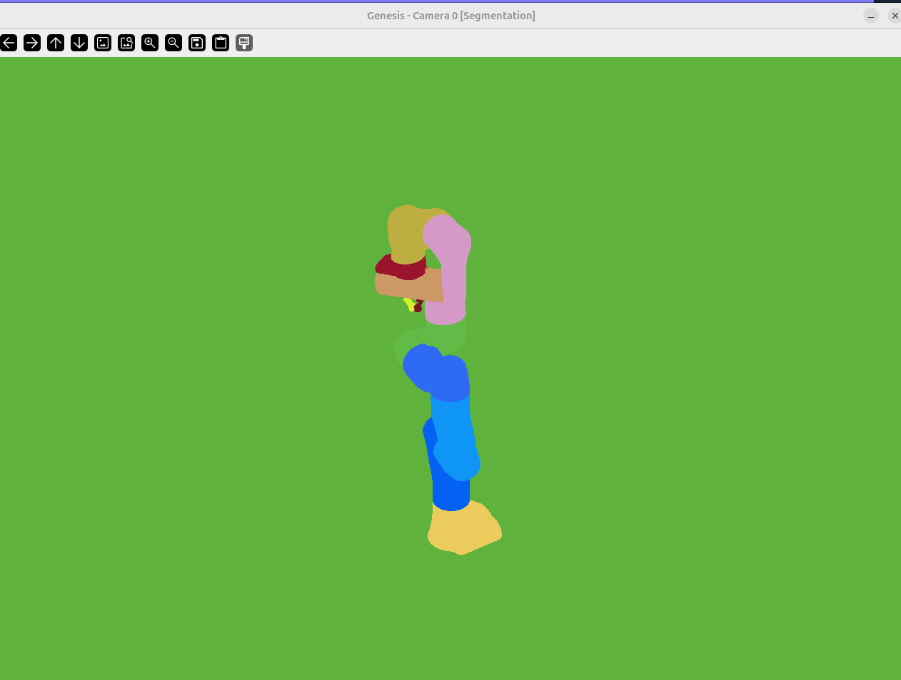

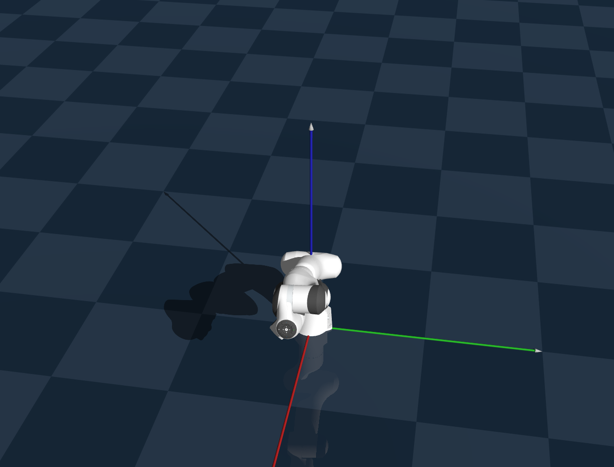

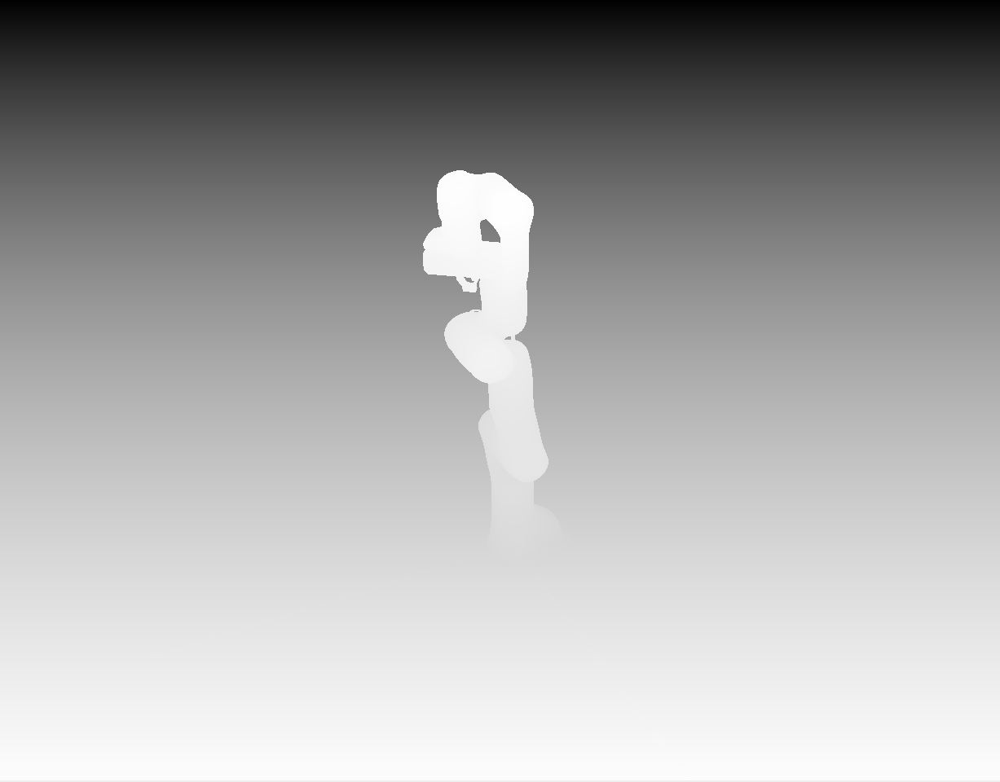

### 录制视频

这个非常简单，无非就是选择作为录制器的相机，然后开始录制便可。

```python
# 开始录制
cam.start_recording()

import numpy as np
for i in range(120):
    scene.step()

    # 移动相机
    cam.set_pose(
        pos    = (3.0 * np.sin(i / 60), 3.0 * np.cos(i / 60), 2.5),
        lookat = (0, 0, 0.5),
    )

    cam.render()

# 停止录制并保存视频
cam.stop_recording(save_to_filename='video.mp4', fps=60)
```

## 控制机器人

如果你已经完成了前文的教程，那么你应该能够发现，虽然可以成功地渲染创造一个场景，但是机器臂在这个场景中**始终是跟随重力下坠**的，这显然不能满足更高级的需求，所以我们需要学习如何控制机器人。

### 关节与DOF（自由度）

对于我们的机器臂而言，其总共有9个关节，每个关节都有1个自由度，所以是**9个自由度**，如果想要控制，就必须将MJCF定义的关节名映射到模拟器内部的自由索引：

```python
jnt_names = [
         "joint1",
         "joint2",
         "joint3",
         "joint4",
         "joint5",
         "joint6",
         "joint7",
         "finger_joint1",
         "finger_joint2",
    ]
        # 使用.dof_idx_local获得相对机器人实体本身的局部索引，当然可以使用joint.dof_idx获得场景中的全局索引
    dofs_idx = [franka.get_joint(name).dof_idx_local for name in jnt_names]
```

事实上，genesis对于机器人的控制，都是通过**对于各个“关节”的控制**来实现的，一个机器人就是若干个部件（刚体）连接而成，而在连接处就形成了关节（通过MJCF描述）。

### 刚性移动

官方文文档给出的第一种方法就是刚性地设置，其生硬地设置每一个关节的位置信息，然后进行渲染，其代码如下：

```python
for i in range(300):
        ti = i % 150
        if ti < 50:
            franka.set_dofs_position(np.array([1, 1, 0, 0, 0, 0, 0, 0.04, 0.04]), dofs_idx)
        elif ti < 100:
            franka.set_dofs_position(np.array([-1, 0.8, 1, -2, 1, 0.5, -0.5, 0.04, 0.04]), dofs_idx)
        else:
            franka.set_dofs_position(np.array([0, 0, 0, 0, 0, 0, 0, 0, 0]), dofs_idx)

        scene.step()
```

这样的方式很生硬，仿真结果和**PPT差不多**，更像是功能性测试。

> 更一般地,像自由关节(6自由度)或球形关节(3自由度)这样的关节有多个自由度。每个自由度可看作一个**可独立控制的电机**。

### “自然”移动

“自然”移动的含义是，使得机器臂的运动过程**更加流畅**，更加符合现实中的移动过程。在代码中的体现就是将`set_*`的函数调用变成`control_*`的函数调用，Genesis在获取了你设定的目标之后，就会**自行计算**出能够使得整个运动过程更加合理流畅的参数。

这是示例代码：

```python
for i in range(1250):
        if i == 0:
            franka.control_dofs_position(
                np.array([1, 1, 0, 0, 0, 0, 0, 0.04, 0.04]),
                dofs_idx,
            )
        elif i == 250:
            franka.control_dofs_position(
                np.array([-1, 0.8, 1, -2, 1, 0.5, -0.5, 0.04, 0.04]),
                dofs_idx,
            )
        elif i == 500:
            franka.control_dofs_position(
                np.array([0, 0, 0, 0, 0, 0, 0, 0, 0]),
                dofs_idx,
            )
        elif i == 750:
            # 用速度控制第一个自由度，其余的用位置控制
            franka.control_dofs_position(
                np.array([0, 0, 0, 0, 0, 0, 0, 0, 0])[1:],
                dofs_idx[1:],
            )
            franka.control_dofs_velocity(
                np.array([1.0, 0, 0, 0, 0, 0, 0, 0, 0])[:1],
                dofs_idx[:1],
            )
        elif i == 1000:
            franka.control_dofs_force(
                np.array([0, 0, 0, 0, 0, 0, 0, 0, 0]),
                dofs_idx,
            )
        # 这是根据给定控制命令计算的控制力
        # 如果使用力控制，它与给定的控制命令相同
        print('controll force:', franka.get_dofs_control_force(dofs_idx))

        # 这是自由度实际经历的力
        print('inner force:', franka.get_dofs_force(dofs_idx))
```

### 定性的实现描述

Genesis 的控制器会自动将目标转换为：

● 根据当前关节状态计算误差

● 使用 PD 控制器（即 kp 和 kv）生成**合适的力/扭矩**

● 在每一帧通过物理引擎应用这些力，实现动作

KP（位置增益）让它“**拉向目标**”，KV（速度增益）让它“**减少抖动**”。

#### 1. kp — 位置增益（Position Gain）

是关节弹性恢复力的系数，来源于 PD 控制器里的比例项。

它控制机器人对目标位置的“**跟随强度**”： 越高则越快趋向目标位置，但可能引发振荡。

就像一个弹簧，kp 越大，弹簧越硬，回弹越猛烈。

#### 2. kv — 速度增益（Velocity Gain）

是 PD 控制器中的**微分项**，用于抑制速度过快或振荡。

它控制关节运动的“阻尼”： 越高则运动更平滑，但可能降低响应速度。

就像给关节加一个“阻尼器”。

#### 3. force_range — 力控制范围（安全边界）

指定每个关节所能施加的**最小 / 最大力**（或扭矩）。

用于防止控制器输出过大的力导致机器人损坏或失控。

## 并行仿真

这个在技术上没有什么难题，唯一需要注意的是**性能优化的问题**。使用torch,tensor会比使用np.array获得更快的执行效率（在控制机器臂时）。在 CPU上开20个并行环境压力有点大，所以我将并行数量改成了10。核心代码如下：

```python
# 10个并行环境
    B = 10

    # env_spacing是 **可视化** 的间距，并不代表实际位置！
    scene.build(n_envs = B, env_spacing = (1, 1))

    franka.control_dofs_position(
         # 把一个张量复制b份，然后广播到机器人上
         torch.tile(
              torch.tensor([0, 0, 0, -1.0, 0, 0, 0, 0.02, 0.02], device=gs.device), (B, 1)
         )
    )
```

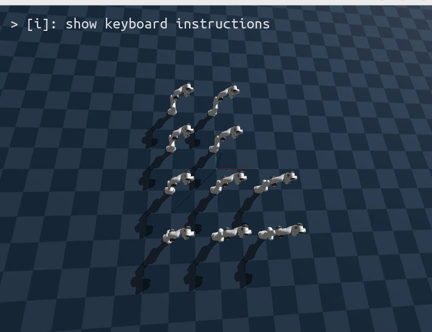

## 逆运动学与运动规划

本章的内容比较重要，以为我们第一次真正实现了机器臂与其他物体的**交互**——**夹起立方体。**

### 立方体的创建

第一步是场景的构建。Scene、Plane和机器臂的添加再次就不重复，主要是关注立方体的创建：

```python
# 添加目标立方体
cube = scene.add_entity(
    gs.morphs.Box(
        size = (0.04, 0.04, 0.04),
        pos  = (0.65, 0.0, 0.02),
    )
)
```

### 关节参数设置

在创建完场景后，比较重要的就是对关节索引以及各项参数的定义，如下所示：

```python
# 定义关节索引
motors_dof = np.arange(7)     # 机械臂关节
fingers_dof = np.arange(7, 9) # 夹爪关节

# 设置控制器参数
# 注意：以下值是为实现Franka最佳行为而调整的。
# 有时高质量的URDF或XML文件也会提供这些参数，并会被解析。
franka.set_dofs_kp(
    np.array([4500, 4500, 3500, 3500, 2000, 2000, 2000, 100, 100]),
)
franka.set_dofs_kv(
    np.array([450, 450, 350, 350, 200, 200, 200, 10, 10]), 
)
franka.set_dofs_force_range(
    np.array([-87, -87, -87, -87, -12, -12, -12, -100, -100]),
    np.array([ 87,  87,  87,  87,  12,  12,  12,  100,  100]),
)
```

### IK和运动规划器

然后就是使用IK和运动规划器，将机器臂移动到**预抓取的位置。** 这一部分的内容十分关键，我会补充上十分详细的注释。

```python
# 获取末端执行器链接
end_effector = franka.get_link('hand')

# 用IK求解预抓取位姿的关节角度
qpos = franka.inverse_kinematics(
    link = end_effector,
    pos  = np.array([0.65, 0.0, 0.25]), # 注意这个参数，其实就是立方体所在的位置！
    quat = np.array([0, 1, 0, 0]),
)
qpos[-2:] = 0.04  # 夹爪打开。我们的最后两个自由度就是夹爪的自由度，所以可以这样设置

# 规划运动路径
path = franka.plan_path(
    qpos_goal     = qpos, # 以设定的位置为目标，移动到那里。
    num_waypoints = 200, # 2秒时长
)

# 执行规划路径
for waypoint in path:
    franka.control_dofs_position(waypoint)
    scene.step()

# 等待到达最后一个路径点
for i in range(100):
    scene.step()
```

K求解和运动规划都是机器人实体的**两个集成方法**。

对于IK求解，你只需告诉机器人的IK求解器**哪个链接是末端执行器**，并**指定目标姿态**。

然后，你告诉运动规划器**目标关节位置**（qpos），它会返回一个**规划和平滑的路径点列表。**

> 注意，最后执行的100步`scene.step()`并不是必须的，这是因为我们使用的是PD控制器，目标位置和当前实际位置之间会**有差距**。因此，我们让控制器多运行一段时间，以便机器人能够到达规划轨迹的**最后一个路径点。**

### 抓取动作的实现

然后就是抓取动作的实现：

```python
# 向下移动到抓取位置
qpos = franka.inverse_kinematics(
    link = end_effector,
    pos  = np.array([0.65, 0.0, 0.135]), #立方体的高度是0.2，所以高度到达
                                         # 0.135进行加紧，就可以架起立方体
    quat = np.array([0, 1, 0, 0]),
)
# 前7个自由度
franka.control_dofs_position(qpos[:-2], motors_dof)
for i in range(100):
    scene.step()

# 夹紧物体
franka.control_dofs_position(qpos[:-2], motors_dof)
franka.control_dofs_force(np.array([-0.5, -0.5]), fingers_dof)
for i in range(100):
    scene.step()

# 抬起物体
qpos = franka.inverse_kinematics(
    link = end_effector,
    pos  = np.array([0.65, 0.0, 0.3]),
    quat = np.array([0, 1, 0, 0]),
)
franka.control_dofs_position(qpos[:-2], motors_dof)
for i in range(200):
    scene.step()
```

代码说明：

- IK和运动规划都是**机器人实体的内置方法**

- IK需要指定**目标链接和姿态**,返回**关节角度**

- 运动规划器基于OMPL,设置好**目标**关节角度后返回**平滑路径点**

- 执行路径点后需要**额外等待一段时间**,因为PD控制器需要时间到达目标位置

- 抓取时对夹爪使用力控制,施加0.5N的抓取力

### 运动学相关知识

把“**连续、平滑、无碰撞**”的路径当成一个工程化问题：先定义“**什么是好路径**”，再选择合适的**求解器**把它算出来。

#### 0 记号与约定

- 关节空间变量：$q \in \mathbb{R}^n$；轨迹：$q(t)$，$t \in [0, T]$  
- 时间导数：$\dot{q} = \dfrac{dq}{dt}$，$\ddot{q} = \dfrac{d^2 q}{dt^2}$，$\dddot{q} = \dfrac{d^3 q}{dt^3}$  
- 路径参数：$s \in [0,1]$，几何路径写作 $q(s)$  
- 范数与内积：$\|x\|$，$\langle x,y\rangle$

#### 1 建模

##### 空间与变量

在机械臂上，规划通常在**关节空间**中进行：$q \in \mathbb{R}^n$（每个关节一个维度），路径是一条连续曲线 $q(t)$。  

目标可以是**末端位姿**或**中间路标（waypoints）**。若目标是位姿，常先用 IK 解出**多组可行关节解**构成“目标集合” $\mathcal{Q}_{\mathrm{goal}}$，以避免落入不佳构型。

##### 约束

关节范围：
<div style="text-align: center;"></div>

速度 / 加速度 / 跃度限制：
<div style="text-align: center;"></div>

无碰撞（带安全余量）：
<div style="text-align: center;"></div>

其中 d(q) 表示机器人与障碍物的**最小距离**，由几何库或 SDF 计算。

##### “好路径”的指标

**平滑**（最小二阶导能量）：
<div style="text-align: center;"></div>

**短**（路径长度 / 弧长）：
<div style="text-align: center;"></div>

**安全余量**（障碍势场/距离惩罚）：
<div style="text-align: center;"></div>
其中 $\phi(\cdot)$ 在距离接近 $d_{\mathrm{safe}}$ 时快速增大。

**终端精度**（到目标集合/流形的距离）：
<div style="text-align: center;"></div>
或直接以**末端位姿误差**度量。

> 建议对各项做**归一化**或**自适应权重**，避免尺度不一致。

#### 2 两条主流路线

##### A. 采样—搜索类（PRM / RRT / RRT* / RRT-Connect）

1. 在 $q$ 空间**随机采样**可行点（碰撞检测过滤）；  
2. 建图连边（PRM）或树扩展（RRT），边段用**局部规划器**；
3. 找到从起点到目标集合的**无碰撞**路径；  
4. **后处理**：捷径（shortcutting）、样条拟合（cubic / B-spline）以进一步**缩短**并**平滑**；  
5. **时间参数化**（见第 4 节）。

**优点**：全局性强、适合复杂障碍；  

**缺点**：原始路径常较“锯齿”，需较多后处理。

##### B. 优化—轨迹类（CHOMP / TrajOpt / STOMP / 交替凸化）

2. 将“**平滑 + 短 + 安全**”合并为单一目标，碰撞通过**距离场**或**穿模惩罚**表示：
<div style="text-align: center;"></div>

3. 用梯度下降、SQP、交替凸化等**迭代优化**，推开障碍、拉直轨迹、抑制抖动；  
4. **时间参数化**（见第 4 节），确保动态可执行。

**优点**：轨迹天然平滑，可直接考虑动力学/差分约束；  

**缺点**：可能陷入局部极小，依赖初值与稳定的距离场。

#### 3 碰撞检测与距离场

- **广义—精细两阶段**：广义阶段用 AABB/OBB 或体素栅格快速排除，精细阶段用 FCL、GJK/EPA 或 **SDF** 计算最小距离与法向。  
- **签距场（SDF）**：对工作空间点 $x$ 定义签距 $\sigma(x)$。对构型 $q$，取机器人表面采样点 $\{x_i(q)\}$，配置距离  
<div style="text-align: center;"></div>
优化中可通过雅可比 $J(q)$ 将 $\nabla\sigma$ 映射到关节空间梯度。  
- **连续碰撞检测（CCD）**：对边段或时间化轨迹进行**稠密采样**或连续检测，避免“穿隧”假阴性。

#### 4 时间参数化（Path–Velocity Decomposition）

给定几何路径 $q(s)$，求 $s(t)$ 使其满足速度/加速度/jerk 上限。链式法则：
<div style="text-align: center;"></div>

将关节限速/加速度变为对 $\dot{s}, \ddot{s}$ 的约束（逐关节 $i$）：
<div style="text-align: center;"></div>

**工程做法**  
- **梯形速度**或**S 曲线**（jerk 限制更平滑，启动/停止更温和）；  
- **TOPP-RA**：在离散 $s$ 栅格上前向/后向传播最大可行 $\dot{s}$，得到满足全部不等式的（近）时间最优标定。

#### 5 实用技巧与常见坑

**多 IK 解选择很关键**：优先远离奇异、与障碍有较大间隙、预计力矩较小的解（可打分排序）。  

**安全距离不取 0**：$d_{\mathrm{safe}}$ 取 $2\text{–}5\ \mathrm{cm}$（依场景缩放）能显著提升**稳定性与鲁棒性**。  

**距离场分辨率**：过粗易误判，过细计算慢；以障碍物尺度的 $1\%\!\sim\!3\%$ 作为体素大小是常见起点。  

**数值稳定**：优化中加入小正则，步长自适应；采样—搜索注意随机种子与节点上限。  

**动力学可行性**：若需力矩/接触可行性，将  
<div style="text-align: center;"></div>
的边界写成约束或惩罚项。  

**动态障碍**：用“预测—短视重规划”（MPC 思路），在滚动窗口内频繁更新轨迹与距离场。

#### 6 小结

**IK** 给目标点；**规划**给整条路；  

**采样—搜索** 负责全局可达；**优化—轨迹** 打磨平滑可执行；  

**SDF/CCD** 保安全；**TOPP-RA/S-curve** 保可执行；  

**混合策略**：RRT-Connect → 轨迹优化 → 时间参数化。


## 高级和并行逆运动学(IK)

### 多末端执行器的IK求解

这个例子中，把机器人夹爪的左右手指设为**两个独立的目标**。只关注**手指的位置和Z轴方向**，而不限制完整的6自由度姿态。

#### 可视化的目标标记

在机器臂的夹爪上防治两个类似于**十字架**的的东西，以便于查看其运动情况：

```python
# 添加两个可视化的目标标记
target_left = scene.add_entity(
        gs.morphs.Mesh(
            file=asset_path + '/meshes/axis.obj',
            scale=0.1,
        ),
        surface=gs.surfaces.Default(color=(1, 0.5, 0.5, 1)),
    )
target_right = scene.add_entity(
        gs.morphs.Mesh(
            file=asset_path + '/meshes/axis.obj',
            scale=0.1,
        ),
        surface=gs.surfaces.Default(color=(0.5, 1.0, 0.5, 1)),
    )
```

其效果如下所示：

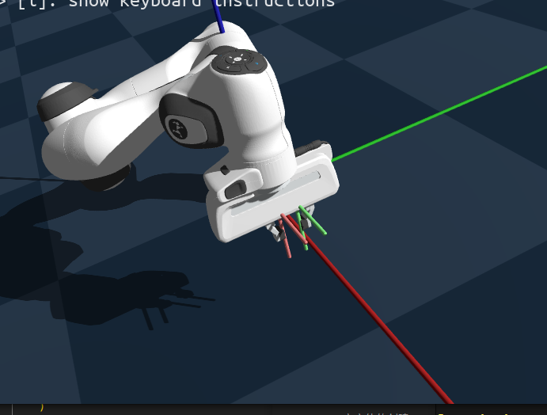

#### 关键控制代码

```python
target_quat = np.array([0, 1, 0, 0])
center = np.array([0.4, -0.2, 0.25])
r = 0.1

left_finger = robot.get_link('left_finger')
right_finger = robot.get_link('right_finger')

for i in range(0, 2000):
    # 其实两个十字架并不是和两个夹爪建立联系，只是把它们的位置都设置为一样的。
    target_pos_left = center + np.array([np.cos(i/360*np.pi), np.sin(i/360*np.pi), 0]) * r
    target_pos_right = target_pos_left + np.array([0.0, 0.03, 0])

    target_left.set_qpos(np.concatenate([target_pos_left, target_quat]))
    target_right.set_qpos(np.concatenate([target_pos_right, target_quat]))

    q = robot.inverse_kinematics_multilink(
        links    = [left_finger, right_finger], # 传入多个链接便可
        poss     = [target_pos_left, target_pos_right],
        quats    = [target_quat, target_quat],
        rot_mask = [False, False, True], # 仅限制z轴方向
    )

    robot.set_dofs_position(q)
    scene.visualizer.update()
```

代码要点:

- `inverse_kinematics_multilink()` 函数用来求解**多目标链接的IK问题**

- `rot_mask` 可以选择要限制的旋转轴。这里只限制Z轴方向，让手指朝下

- **不涉及物理仿真**，只需用 `visualizer.update()` 更新显示

- `qpos` 和 `dofs_position` 的区别:
  
  - 机械臂两者相同
  
  - 自由网格的`qpos`是7维向量(xyz位置 + wxyz四元数)
  
  - `dofs_position`是6维向量(xyz位置 + xyz旋转角)

### 批量处理的IK求解

Genesis可以批量求解IK问题。下面创建16个并行环境，让每个机器人末端执行器用不同速度旋转:

```python
n_envs = 16
scene.build(n_envs=n_envs, env_spacing=(1.0, 1.0))

# tile 把单个向量复制成 (n_envs, dim) 的批量输入，方便后续一次性喂给 IK。
target_quat = np.tile(np.array([0, 1, 0, 0]), [n_envs, 1]) # 末端朝下
center = np.tile(np.array([0.4, -0.2, 0.25]), [n_envs, 1])
angular_speed = np.random.uniform(-10, 10, n_envs)
r = 0.1

ee_link = robot.get_link('hand')

for i in range(0, 1000):
    target_pos = np.zeros([n_envs, 3])
    target_pos[:, 0] = center[:, 0] + np.cos(i/360*np.pi*angular_speed) * r
    target_pos[:, 1] = center[:, 1] + np.sin(i/360*np.pi*angular_speed) * r
    target_pos[:, 2] = center[:, 2]
    target_q = np.hstack([target_pos, target_quat])  # 组合成 [x,y,z,qw,qx,qy,qz]，当前代码里没用到

    q = robot.inverse_kinematics(
        link     = ee_link,
        pos      = target_pos,      # (n_envs, 3) 批量位置
        quat     = target_quat,     # (n_envs, 4) 批量四元数
        rot_mask = [False, False, True],  # 仅约束旋转的 z 分量（见下方提示）
    )

    robot.set_qpos(q)  # (n_envs, dof) 批量设置关节
    scene.step()
```

处理并行环境时，只需在目标姿态变量中**增加批量维度即可。**

## 超越刚体

Genesis 统一了多种物理求解器，支持超越刚体动力学的模拟。`求解器` 本质上是一组**物理模拟算法**，用于处理**特定**材料。而Genesis主要支持了三种求解器：**SPH，MPM，PBD**，它们分别擅长于**液体、可变形物体和布料**的模拟。

> 注意，本章的内容最好使用**GPU进行模拟**，也即`gs.init(backend = gs.gpu)`，否则帧率会受到严重的影响（不到10）。

### 使用SPH求解器模拟液体

首先我们来看看最基本的场景配置.

```python
scene = gs.Scene(
 sim_options=gs.options.SimOptions(
 dt = 4e-3,
 substeps = 10,
 ),
 sph_options=gs.options.SPHOptions(
 lower_bound = (-0.5, -0.5, 0.0),
 upper_bound = (0.5, 0.5, 1),
 particle_size = 0.01,
 ),
 vis_options=gs.options.VisOptions(
 visualize_sph_boundary = True,
 ),
 show_viewer = True,
)
```

这里有几点需要注意：

1. `dt`的含义是每个时间步的长度，而`substeps=10`则是在一个时间步中模拟10个`substep`，每个 `substep_dt = 4e-3 / 10`。之前的实验中，`substeps`都被默认设置为1.

2. 由于使用的是 `SPHSolver`，因此需要通过 `sph_options` 配置其属性。通过`lower_bound`和`upper_bound`来设置了**SPH模拟器的边界**，并将粒子大小**指定为 0.01 米**。SPHSolver 是一种**拉格朗日求解器**，使用**粒子来表示对象**。

3. 在 `vis_options` 中，我们指定希望在渲染视图中看到 SPH **求解器的边界**。这个主要是为了更加方便地查看模拟仿真的情况。

现在我们需要考虑如何添加一个水块。当我们添加块时，将其从刚性块变为水块的**唯一不同**之处在于**设置 `material`**。实际上，之前处理刚体时，这个参数默认设置为 `gs.materials.Rigid()`。由于我们现在使用 SPH 求解器进行液体模拟，因此选择 `SPH` 类别下的 `Liquid` 材料：

```python
liquid = scene.add_entity(
        material = gs.materials.SPH.Liquid(
            sampler = "pbs", # 基于物理的采样
            mu = 0.02, #粘度
            gamma = 0.02, # 表面张力
        ),
        morph=gs.morphs.Box(
        pos  = (0.0, 0.0, 0.65),
        size = (0.4, 0.4, 0.4),
        ),
        # surface用于设置视觉属性
        surface = gs.surfaces.Default(
            color = (0.4, 0.8, 1.0),
            vis_mode = "particle",
        )
    )
```

可以通过如下的方式获取实时粒子的位置：

```python
particles = liquid.get_particles()
```

以下是仿真的结果：

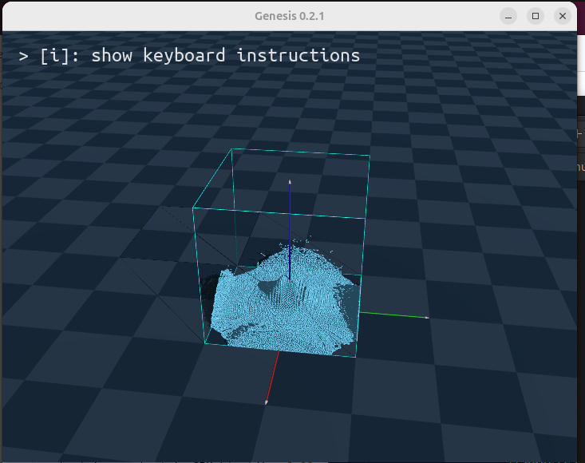

### 使用MPM 求解器模拟可变形物体

MPM 求解器是一种非常强大的物理求解器，支持更广泛的材料。MPM 代表材料点法，使用混合拉格朗日-欧拉表示，即同时使用**粒子和网格**来表示对象。

在此示例中，让我们创建三个对象：

- 一个**弹性立方体**，可视化为 `'particles'`

- 一个**液体立方体**，可视化为 `'particles'`

- 一个**弹塑性球体**，可视化为原始球体网格，但根据内部粒子**状态变形** (`vis_mode='visual'`)。这种将内部粒子状态映射到变形视觉网格的过程在计算机图形学中称为 *蒙皮*。

完整代码脚本：

```python
import genesis as gs

########################## 初始化 ##########################
gs.init()

########################## 创建场景 ##########################

scene = gs.Scene(
    sim_options=gs.options.SimOptions(
        dt       = 4e-3,
        substeps = 10,
    ),
    mpm_options=gs.options.MPMOptions(
        lower_bound   = (-0.5, -1.0, 0.0),
        upper_bound   = (0.5, 1.0, 1),
    ),
    vis_options=gs.options.VisOptions(
        visualize_mpm_boundary = True,
    ),
    viewer_options=gs.options.ViewerOptions(
        camera_fov=30,
    ),
    show_viewer = True,
)

########################## 实体 ##########################
plane = scene.add_entity(
    morph=gs.morphs.Plane(),
)

obj_elastic = scene.add_entity(
    material=gs.materials.MPM.Elastic(),
    morph=gs.morphs.Box(
        pos  = (0.0, -0.5, 0.25),
        size = (0.2, 0.2, 0.2),
    ),
    surface=gs.surfaces.Default(
        color    = (1.0, 0.4, 0.4),
        vis_mode = 'visual',
    ),
)

obj_sand = scene.add_entity(
    material=gs.materials.MPM.Liquid(),
    morph=gs.morphs.Box(
        pos  = (0.0, 0.0, 0.25),
        size = (0.3, 0.3, 0.3),
    ),
    surface=gs.surfaces.Default(
        color    = (0.3, 0.3, 1.0),
        vis_mode = 'particle',
    ),
)

obj_plastic = scene.add_entity(
    material=gs.materials.MPM.ElastoPlastic(),
    morph=gs.morphs.Sphere(
        pos  = (0.0, 0.5, 0.35),
        radius = 0.1,
    ),
    surface=gs.surfaces.Default(
        color    = (0.4, 1.0, 0.4),
        vis_mode = 'particle',
    ),
)


########################## 构建 ##########################
scene.build()

horizon = 1000
for i in range(horizon):
    scene.step()
```

> 注意，要改变底层物理材料，**只需更改 `material` 属性**。随意尝试其他材料类型（比如 `MPM.Sand()` 和 `MPM.Snow()`），以及每种材料类型中的属性值。

模拟的结果：

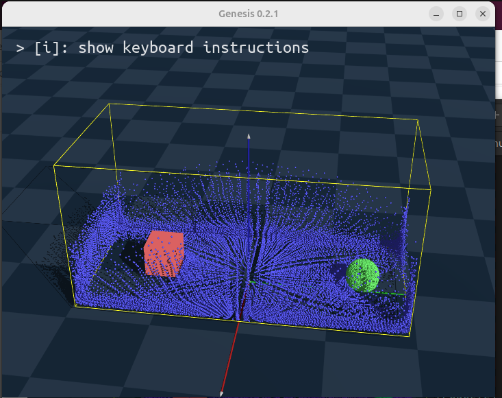

其中左侧的正方体是弹性立方体，而散开成若干粒子的蓝色粒子就是液体立方体，而右侧的绿色球就是弹塑性球体。

### 使用 PBD 求解器进行布料模拟

PBD（基于**位置的动力学**）是另一种**拉格朗日求解器**。它使用粒子和边来表示物体,通过求解一系列基于位置的约束来模拟物体状态。它适合模拟需要保持拓扑结构的**一维、二维或三维**物体。这里我们将用 PBD 求解器来模拟布料。

我们将创建两块方形布料:

- 第一块布料的**四个角都固定**

- 第二块布料**只固定一个角**,让它自然落在第一块布料上

- 用不同的 `vis_mode` 来渲染这两块布料

这里主要关注一下创造布料的方法：

```python
    cloth1 = scene.add_entity(
        material = gs.materials.PBD.Cloth(),
        morph = gs.morphs.Mesh(
            file = asset_path + "/meshes/cloth.obj",
            scale = 2.0,
            pos = (0, 0, 0.5),
            euler = (0.0, 0.0, 0.0)
        ),
        surface = gs.surfaces.Default(
            color = (0.2, 0.4, 0.8, 1.0),
            vis_mode = "visual",
        )
    )

    cloth2 = scene.add_entity(
        material=gs.materials.PBD.Cloth(),
        morph=gs.morphs.Mesh(
            file='meshes/cloth.obj',
            scale=2.0,
            pos=(0, 0, 1.0), 
            euler=(0.0, 0, 0.0),
        ),
        surface=gs.surfaces.Default(
            color=(0.8, 0.4, 0.2, 1.0),
            vis_mode='particle',
        )
    )
```

注意，以上的代码**并没有固定四个角**，而只是单纯地创建了一个实体，只不过设置了**不同的属性。**

固定四个角的方法如下：

```python
    cloth1.fix_particle(cloth1.find_closest_particle((-1, -1, 1.0)))
    cloth1.fix_particle(cloth1.find_closest_particle((1, 1, 1.0)))
    cloth1.fix_particle(cloth1.find_closest_particle((-1, 1, 1.0)))
    cloth1.fix_particle(cloth1.find_closest_particle((1, -1, 1.0)))

    cloth2.fix_particle(cloth2.find_closest_particle((-1, -1, 1.0)))
```

> 在本章中我们获得了两个如下的重要结论：
> 
> 1. 对于实体行为的模拟主要通过对于`material`的设置实现；
> 
> 2. 对于实体可视化的模拟主要通过设置`surface`实现。

## 交互式信息访问和调试

Genesis为所有类都实现了`__repr__()`方法,提供了一个信息丰富且美观的界面,让你能方便地访问Genesis中创建的**对象的内部信息和所有属性**。如果你使用`IPython`、`pdb`或`ipdb`进行调试,这个功能会很有帮助。下面主要使用`IPython`进行调试：

```python
import genesis as gs
import IPython
import os

def main():

    gs.init()

    assets_path = os.getenv("ASSETS_PATH")
    scene = gs.Scene(show_viewer=False)

    plane = scene.add_entity(gs.morphs.Plane())
    franka = scene.add_entity(
        gs.morphs.MJCF(file=assets_path+"/xml/franka_emika_panda/panda.xml"),
    )

    cam_0 = scene.add_camera()
    scene.build()

    # 进入IPython交互模式
    IPython.embed()

if __name__ == "__main__":
    main()
```

在上面的代码中，我们添加了一个平面，一个机器臂和一个相机，之后便启动了`ipython`（类似于`gdb`），其界面如下：

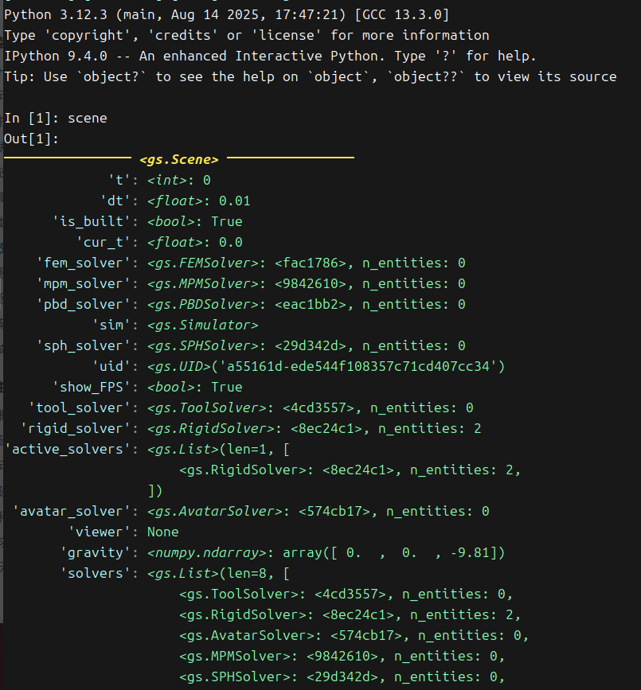

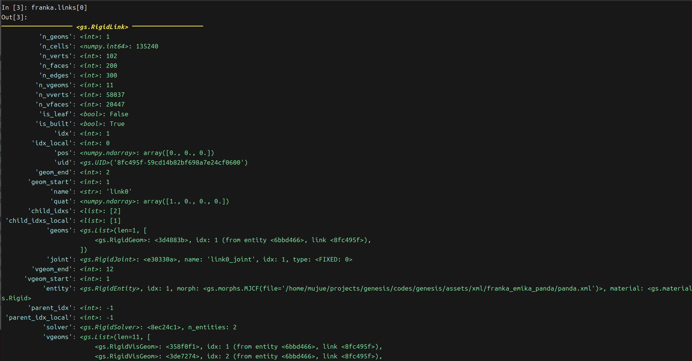

其使用方法和`gdb`十分类似，在此就不再赘述。

## 使用强化学习训练运动策略

### 前置条件

需要配置如下的内容：

```python
# 安装rsl_rl。
git clone https://github.com/leggedrobotics/rsl_rl
cd rsl_rl && git checkout v1.0.2 && pip install -e .

# 安装tensorboard。
pip install tensorboard
```

### 运行方式

直接在genesis代码仓库下执行：

```python
# 官方给出的
python examples/locomotion/go2_train.py
# 我的GPU算力不足，CPU也比较慢，所以将训练迭代轮次改成了5
python /examples/locomotion/go2_train.py --max_iterations 5
```

> 如果遇到了问题，请查看FAQ

### 训练指标

查看训练过程中的指标使用`tensorboard`便可，如下：

```python
tensorboad --logdir logs
```

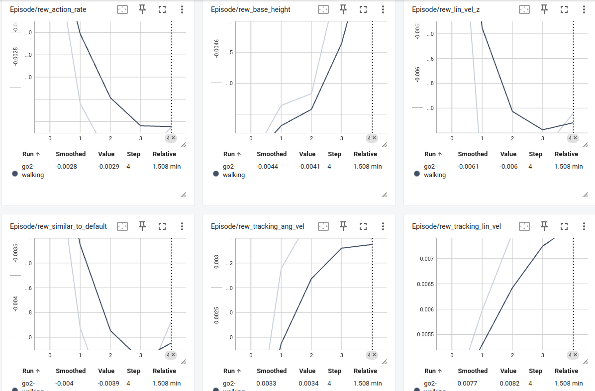

### 评估

执行以下的指令来进行评估。评估运动策略的最为直观的方式是**可视化**，所以执行下列指令的结果将会弹出一个可视化的框。

但是其可视化的方式其实是通过**训练中的各项数据集合**（至少从提示信息上来说是这样），而由于只训练了5轮，而原先默认是从第101轮的结果进行可视化，所以需要加上`--ckpt 4`

```python
python examples/locomotion/go2_eval.py --ckpt 4
```

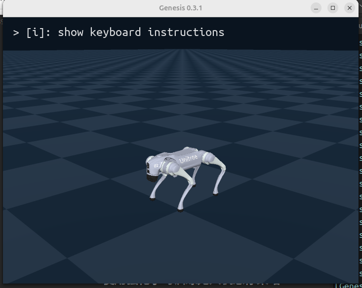

### 代码分析（TODO）

## 使用强化学习训练无人机悬停策略

### 前置条件

和上一章的内容相同，在此不必赘述。

### 运行方式

无人机的训练需要算力更低，所以可以这样修改：

```bash
python examples/drone/hover_train.py -e drone-hovering -B 512 --max_iterations 300
```

### 训练指标

```bash
tensorboard --logdir logs 
```

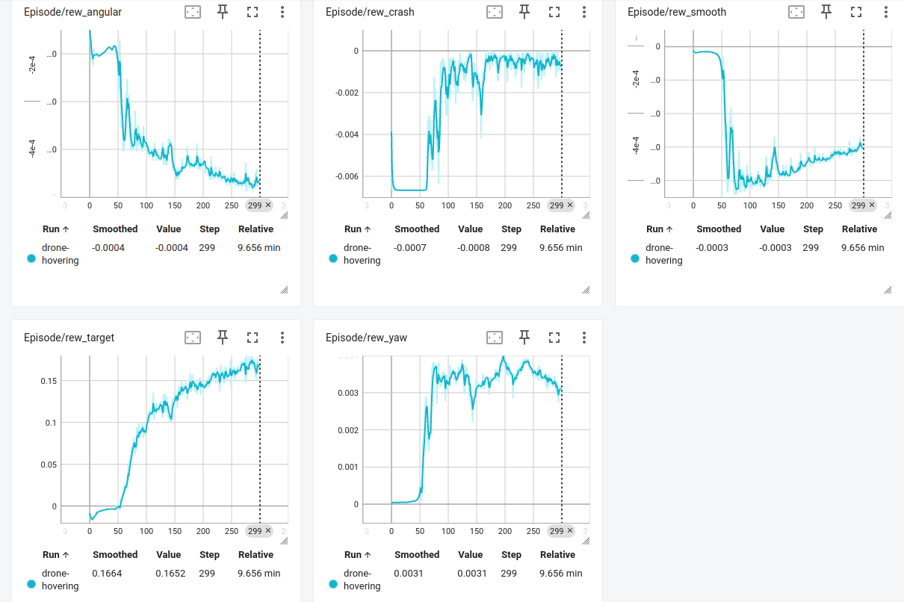

### 评估

```bash
python examples/drone/hover_eval.py -e drone-hovering --ckpt 200 --record
```

- `-e drone-hovering`：指定实验名称为 “drone-hovering”。

- `--ckpt 200`: 从 **检查点200(意味着训练的轮次不应该低于这个数字+1)** 加载训练好的策略。

- `--record`: 记录评估过程并**保存无人机表现的视频。**

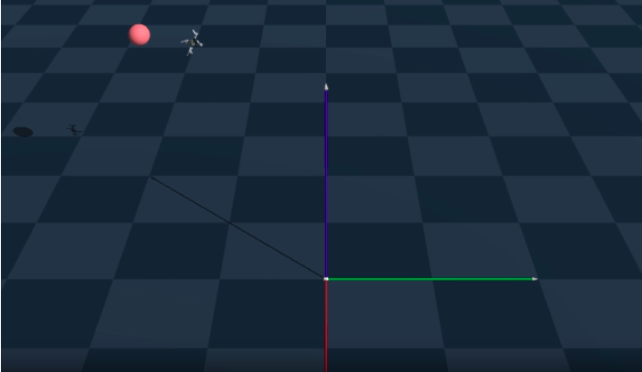

### 代码分析（TODO）

## 软体机器人

### 体积肌肉模拟

Genesis 用 **MPM 和 FEM** 两种方式模拟软体机器人的肌肉，以下给出了关键代码：

```python
import numpy as np
import genesis as gs

def main():

    gs.init(precision='32', logging_level='debug')
    # 场景创建
    dt = 5e-4
    scene = gs.Scene(
        sim_options=gs.options.SimOptions(
            substeps=10,
            gravity=(0, 0, 0),
        ),
        viewer_options= gs.options.ViewerOptions(
            camera_pos=(1.5, 0, 0.8),
            camera_lookat=(0.0, 0.0, 0.0),
            camera_fov=40,
        ),
        # 我们需要同时使用到MPM和FEM来展示对肌肉的模拟效果，所以这里进行一下设置
        mpm_options=gs.options.MPMOptions(
            dt=dt,
            lower_bound=(-1.0, -1.0, -0.2),
            upper_bound=( 1.0,  1.0,  1.0),
        ),
        fem_options=gs.options.FEMOptions(
            dt=dt,
            damping=45.,
        ),
        vis_options=gs.options.VisOptions(
            show_world_frame=True,
        ),
        show_viewer = True,
    )

    # 添加实体
    scene.add_entity(morph=gs.morphs.Plane())

    E, nu = 3.e4, 0.45
    rho = 1000.

    robot_mpm = scene.add_entity(
        morph=gs.morphs.Sphere(
            pos=(0.5, 0.2, 0.3),
            radius=0.1,
        ),
        # 肌肉模拟
        material=gs.materials.MPM.Muscle(
            E=E,
            nu=nu,
            rho=rho,
            model='neohooken',
        ),
    )

    robot_fem = scene.add_entity(
        morph=gs.morphs.Sphere(
            pos=(0.5, -0.2, 0.3),
            radius=0.1,
        ),
        # 肌肉模拟
        material=gs.materials.FEM.Muscle(
            E=E,
            nu=nu,
            rho=rho,
            model='stable_neohooken',
        ),
    )

    scene.build()

    scene.reset()
    for i in range(1000):
        actu = np.array([0.2 * (0.5 + np.sin(0.01 * np.pi * i))])

        robot_mpm.set_actuation(actu)
        robot_fem.set_actuation(actu)
        scene.step()


if __name__ == "__main__":
    main()
```

实现这个效果只需两个关键步骤:

- 创建软体机器人时用 `gs.materials.MPM.Muscle` 或 `gs.materials.FEM.Muscle` 作为材料

- 仿真时用 `robot_mpm.set_actuation` 或 `robot_fem.set_actuation` 设置肌肉驱动

默认情况下,肌肉覆盖整个机器人身体,方向垂直于地面 `[0, 0, 1]`。

实现的结果如下：

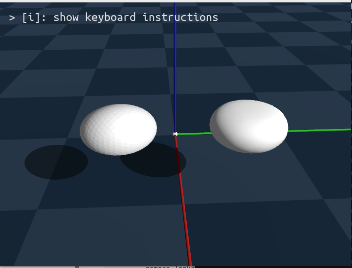

### 蠕虫的仿真

在执行官方代码的时候，出现了如下的报错信息：

```bash
Traceback (most recent call last):
  File "/home/mujue/projects/genesis/genesis-guide/worm_smi.py", line 94, in <module>
    main()
  File "/home/mujue/projects/genesis/genesis-guide/worm_smi.py", line 54, in main
    set_muscle_by_pos(worm)
  File "/home/mujue/projects/genesis/genesis-guide/worm_smi.py", line 81, in set_muscle_by_pos
    muscle_group[ mask_upper &  mask_fore] = 0 # 上前身体
    ~~~~~~~~~~~~^^^^^^^^^^^^^^^^^^^^^^^^^^
IndexError: too many indices for array: array is 1-dimensional, but 2 were indexed
```

目前尚未找到产生此BUG的真正原因，还在研究。

### 混合(刚体和软体)机器人

另一种软体机器人是用刚体内骨骼驱动软体外皮,也就是混合机器人。但是目前以下的代码虽然可以运行，但是却出现了“**群魔乱舞**”的现象（见后图）：

```python
import numpy as np
import genesis as gs
import os

def main():
    assets_path = os.getenv("ASSETS_PATH")

    ########################## 初始化 ##########################
    gs.init(seed=0, precision='32', logging_level='debug')

    ######################## 创建场景 ##########################
    dt = 3e-3
    scene = gs.Scene(
        sim_options=gs.options.SimOptions(
            substeps=10,
        ),
        viewer_options= gs.options.ViewerOptions(
            camera_pos=(1.5, 1.3, 0.5),
            camera_lookat=(0.0, 0.0, 0.0),
            camera_fov=40,
        ),
        rigid_options=gs.options.RigidOptions(
            dt=dt,
            gravity=(0, 0, -9.8),
            enable_collision=True,
            enable_self_collision=False,
        ),
        mpm_options=gs.options.MPMOptions(
            dt=dt,
            lower_bound=( 0.0,  0.0, -0.2),
            upper_bound=( 1.0,  1.0,  1.0),
            gravity=(0, 0, 0), # 模拟重力补偿
            enable_CPIC=True,
        ),
        vis_options=gs.options.VisOptions(
            show_world_frame=True,
            visualize_mpm_boundary=False,
        ),
        show_viewer = True,
    )

    ########################## 实体 ##########################
    scene.add_entity(morph=gs.morphs.Plane())

    robot = scene.add_entity(
        morph=gs.morphs.URDF(
            file=assets_path+"/urdf/simple/two_link_arm.urdf",
            pos=(0.5, 0.5, 0.3),
            euler=(0.0, 0.0, 0.0),
            scale=0.2,
            fixed=True,
        ),
        material=gs.materials.Hybrid(
            mat_rigid=gs.materials.Rigid(
                gravity_compensation=1.,
            ),
            mat_soft=gs.materials.MPM.Muscle( # 允许设置组
                E=1e4,
                nu=0.45,
                rho=1000.,
                model='neohooken',
            ),
            thickness=0.05,
            damping=1000.,
            func_instantiate_rigid_from_soft=None,
            func_instantiate_soft_from_rigid=None,
            func_instantiate_rigid_soft_association=None,
        ),
    )

    ball = scene.add_entity(
        morph=gs.morphs.Sphere(
            pos=(0.8, 0.6, 0.1),
            radius=0.1,
        ),
        material=gs.materials.Rigid(rho=1000, friction=0.5),
    )

    ########################## 构建 ##########################
    scene.build()

    ########################## 运行 ##########################
    scene.reset()
    for i in range(1000):
        dofs_ctrl = np.array([
            1. * np.sin(2 * np.pi * i * 0.001),
        ] * robot.n_dofs)

        robot.control_dofs_velocity(dofs_ctrl)

        scene.step()

if __name__ == "__main__":
    main()
```

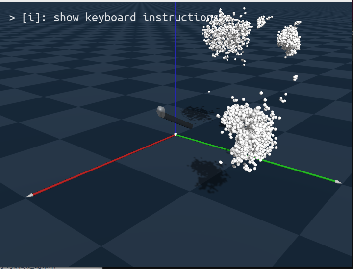

但还先过一下要点：

- 用 `gs.materials.Hybrid` 指定**混合机器人**,由 `gs.materials.Rigid` 和 `gs.materials.MPM.Muscle` 组成。**只支持 MPM**,且必须用 Muscle 类因为内部用了它的 `muscle_group`

- 控制时用类似刚体机器人的接口,如 `control_dofs_velocity`、`control_dofs_force`、`control_dofs_position`。控制维度跟内部骨骼自由度相同(例子中是2)

- 皮肤由内部骨骼形状决定,`thickness` 参数控制包裹厚度

- 默认用骨骼形状生长皮肤,由 `morph` 指定(例子用 `urdf/simple/two_link_arm.urdf`)。`func_instantiate_soft_from_rigid` 定义如何根据刚体 `morph` 生长皮肤,有默认实现也可以自定义

- 当 `morph` 是 `Mesh` 时网格指定软体外形,内部骨骼根据皮肤生长,由 `func_instantiate_rigid_from_soft` 定义,默认实现是3D网格骨架化

- `func_instantiate_rigid_soft_association` 定义骨骼和皮肤如何关联,默认找最近粒子

## 命令行工具

安装Genesis后，在我们的终端中就可以使用以下的工具了：

- `gs clean`：清理所有Genesis和Taichi的**缓存文件**。如果遇到程序异常的时候，也许可以进行一下缓存的清理，BUG可能就好了。

- `gs view *.*`：查看各种资产文件，支持mesh模型/URDF机器人文件/MJCF物理引擎配置等，用来快速检查**文件是否能正确加载和显示**

- `gs animate 'path/*.png'`：把指定路径下的图片序列合成视频。

## FAQ

### ligigl版本问题

这个问题在ubuntu和macos都会出现，是比较常见的**版本冲突问题**

```bash
File ".venv/lib/python3.12/site-packages/genesis/engine/entities/rigid_entity/rigid_geom.py", line 224, in _compute_sd
    sd, _, _ = igl.signed_distance(query_points, self._sdf_verts, self._sdf_faces)
    ^^^^^^^^
ValueError: too many values to unpack (expected 3)
```

从报错信息可以看出，这是ligigl新旧版本的**返回值数量不一样**（旧：3，新：4）而导致的问题，我这里直接修改了源代码，如下：

```python
# 源代码，在224行
sd, _, _ = igl.signed_distance(query_points, self._sdf_verts, self._sdf_faces)
#新代码
sd, _, _, _ = igl.signed_distance(query_points, self._sdf_verts, self._sdf_faces)

# 注意，同样的问题会出现在同一个文件的228行，如下：
_, closest_faces, _ = igl.signed_distance(query_points, self._init_verts, self._init_faces)

# 新代码
_, closest_faces, _, _ = igl.signed_distance(query_points, self._init_verts, self._init_faces)
```

然后这个问题就可以解决了。

### macos的图形化展示

在macos上直接执行官方文档中的内容，大概率会出现如下的错误：

```bash
[Genesis] [23:00:00] [WARNING] Non-linux system detected. In order to use the interactive viewer, you need to manually run simulation in a separate thread and then start viewer. See `examples/render_on_macos.py`.
```

这是因为 macOS 对 OpenGL 渲染线程有**特殊要求**：必须在**主线程中启动图形窗口**，而仿真逻辑应在**另一个线程**中运行。所以其实我们要做的就是在另一个线程中进行仿真渲染便可。

### RayTracer的问题

其问题如下所示：

```bash
[Genesis] [23:46:03] [ERROR] Failed to import LuisaRenderer. ModuleNotFoundError: No module named 'LuisaRenderPy'
```

这个问题目前我**并没有**找到合适的解决方案（我无法安装缺失的模块），但是由于我们有另外一种`Tracer`，所以对于使用而言没有影响。

### OpenCV的渲染问题

在设置相机渲染时，在macos上无法设置GUI为True，其主要原因在于，调用openCV进行图像渲染必须**要求在主程序**中完成，然而先前我们又需要将仿真过程**新开一个线程运行**，从而**造成矛盾**。其报错信息大概如下：

```bash
cv2.error: Unknown C++ exception from OpenCV code
Assertion failed: (NSViewIsCurrentlyBuildingLayerTreeForDisplay() != currentlyBuildingLayerTree), function NSViewSetCurrentlyBuildingLayerTreeForDisplay, file NSView.m, line 12783.
```

这个问题目前在macos上没有找到很好的解决方案（指在保证GUI=True的情况下，程序能够正常运行的方案）。不过，这并不影响正常的使用。

### 强化学习的rsl-rl问题

官方给出的环境配置代码是：

```bash
# 安装rsl_rl。
git clone https://github.com/leggedrobotics/rsl_rl
cd rsl_rl && git checkout v1.0.2 && pip install -e .

# 安装tensorboard。
pip install tensorboard
```

但实际上，上述代码安装的`rsl-rl`已经不符合要求，在执行

```python
python examples/locomotion/go2_train.py
```

的时候，会出现如下错误：

```bash
Traceback (most recent call last): 
File "/home/mujue/projects/genesis/codes/examples
/locomotion/go2_train.py", line 15, i
n <module> raise ImportError("Please uninstall 'rsl_rl' 
and install 'rsl-rl-lib==2.2.4'.") from e 
ImportError: Please uninstall 'rsl_rl' and install 'rsl-rl-lib==2.2.4'.
```

解决方案很简单，执行：

```python
pip uninstall rsl-rl
pip install "rsl-rl-lib==2.2.4"
```

便可。如果你没有按安装`rsl-rl`，那甚至都不需要执行第一条指令。

### 强化学习的`rendered_envs_idx`问题

在尝试运行强化学习的第一个示例时，可能出现以下问题：

```python
Traceback (most recent call last):
  File "/home/mahi/genesis_embodied/examples/locomotion/go2_train.py", line 184, in <module>
    main()
  File "/home/mahi/genesis_embodied/examples/locomotion/go2_train.py", line 174, in main
    env = Go2Env(
  File "/home/mahi/genesis_embodied/examples/locomotion/go2_env.py", line 40, in __init__
    vis_options=gs.options.VisOptions(rendered_envs_idx=list(range(1))),
  File "/home/mahi/.local/lib/python3.10/site-packages/genesis/options/vis.py", line 116, in __init__
    super().__init__(**data)
  File "/home/mahi/.local/lib/python3.10/site-packages/genesis/options/options.py", line 27, in __init__
    gs.raise_exception(f"Unrecognized attribute: {key}")

[Genesis] [13:13:28] [ERROR] Unrecognized attribute: rendered_envs_idx
```

这个问题已经在官方的`Github`的`issue`中指出，解决方法参考：

https://github.com/Genesis-Embodied-AI/Genesis/issues/1020

省流版：卸载原先安装的`genesis-world`，并使用从`Github`源代码安装的方式安装：

```python
# 卸载
pip uninstall genesis-world
# 安装
pip install git+https://github.com/Genesis-Embodied-AI/Genesis.git
```

### 强化学习的std问题

在进行无人机的训练的时候，可能会遇到：

```bash
Traceback (most recent call last):
  File "/home/romania/Genesis/examples/locomotion/go2_train.py", line 180, in <module>
    main()
  File "/home/romania/Genesis/examples/locomotion/go2_train.py", line 176, in main
    runner.learn(num_learning_iterations=args.max_iterations, init_at_random_ep_len=True)
  File "/home/romania/Genesis/.genesisvenv/lib/python3.10/site-packages/rsl_rl/runners/on_policy_runner.py", line 208, in learn
    mean_value_loss, mean_surrogate_loss, mean_entropy, mean_rnd_loss, mean_symmetry_loss = self.alg.update()
  File "/home/romania/Genesis/.genesisvenv/lib/python3.10/site-packages/rsl_rl/algorithms/ppo.py", line 251, in update
    self.actor_critic.act(obs_batch, masks=masks_batch, hidden_states=hid_states_batch[0])
  File "/home/romania/Genesis/.genesisvenv/lib/python3.10/site-packages/rsl_rl/modules/actor_critic.py", line 126, in act
    return self.distribution.sample()
  File "/home/romania/Genesis/.genesisvenv/lib/python3.10/site-packages/torch/distributions/normal.py", line 74, in sample
    return torch.normal(self.loc.expand(shape), self.scale.expand(shape))
  File "/home/romania/Genesis/.genesisvenv/lib/python3.10/site-packages/torch/utils/_device.py", line 104, in __torch_function__
    return func(*args, **kwargs)
RuntimeError: normal expects all elements of std >= 0.0

[Genesis] [15:41:54] [ERROR] RuntimeError: normal expects all elements of std >= 0.0
```

其也以及被提出并解决：

https://github.com/Genesis-Embodied-AI/Genesis/issues/1302

省流：

改变**精度和执行时的批次**设置（按照你的电脑配置进行修改），我的修改如下：

```python
# gs.init(logging_level="warning")
gs.init(logging_level="warning",precision="32", backend=gs.cpu)
```

### `gs clean`的问题

在执行`gs clean`的时候，有可能遇到如下的问题：

```bash
gs clean Traceback (most recent call last): 
File "/home/mujue/projects/genesis/genesis_env/bin/gs", 
line 5, in <module> from genesis._main import main File 
"/home/mujue/projects/genesis/genesis_env/lib/python3.12
/site-packages/genesis/_main.py", line 7, in <module> 
import tkinter as tk ModuleNotFoundError: No module named 'tkinter'
```

这个`tkinter`并不只是`python`相关的，是和系统相关的，所以需要使用`apt install`解决。我的`python`虚拟环境的`python`版本是`3.12`，所以执行下列的命令：

```python
sudo apt update
sudo apt install -y python3.12-tk
```
