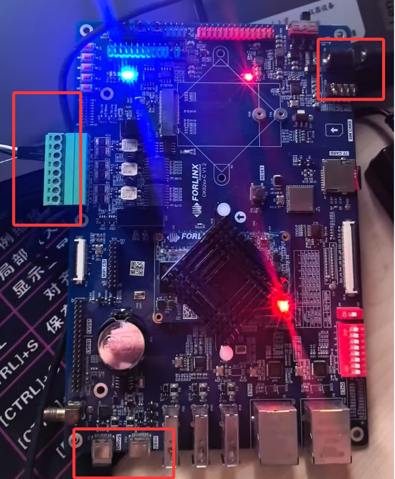

# OK6254-C 启动hvisor


## 1.获取hvsior源码并编译

安装**aarch64-none-linux-gnu**工具链，并保证gcc等工具可以被shell直接调用

克隆hvisor代码到本地

```bash
git clone -b dev https://github.com/syswonder/hvisor
make BID=aarch64/ok62xx-c
```

编译完成后根据其输出找到hvisor程序

于`/platform/aarch64/ok6254-c/image/dts`目录下编译修改后的zone0,zone1设备树文件，hvsior设备树文件使用原版设备树文件

```
dtc -I dts -O dtb -o zone0.dtb OK6254-C-0.dts
dtc -I dts -O dtb -o zone1-linux.dtb OK6254-C-1.dts
```

将编译好的`target/aarch64-unknown-none/debug/hvisor`程序和设备树文件拷贝到sd卡中

## 2.获取Image.bin等文件

根据厂家提供的`Image.bin`文件或[OK62xx-C_MCU编译手册](https://forlinx-book.yuque.com/wl9002/ligiet/hrv00t8rbgp4p6py)根据编译手册编译的Linux镜像文件；

<!--移植示例所使用镜像为OK6254-C_Linux5.10.87 2G版本-->

根据需求对设备树文件进行相应的修改，适配修改过程详见[hvisor适配ok6254开发板流程](https://blog.syswonder.org/#/2025/20250604_Adapt_Hvisor_to_ok6254);

将要启动的zone0的Linux镜像文件、原版设备树文件(hvisor启动使用)拷贝到sd卡中

## 3.编译hvisor-tool

克隆hvisor-tool代码到本地，并根据[hvisor-tool 编译流程](https://github.com/syswonder/hvisor-tool?tab=readme-ov-file#compilation-steps)该流程进行编译

由于厂家提供Linux中glibc版本过低原因，所以需要将[tools/Makefile](https://github.com/ohhhHwH/hvisor-tool/blob/ea2fe1dfe73ad0ca97dcd0bc9ddc946f3c3593a3/tools/Makefile#L9) 中include_dirs 中 -static删去（最新版本中hvisor-tool已经删去）

将编译后的hvisor.ko hvisor拷贝到sd卡中

## 4.通过uboot启动hvisor&zone0


检查连接电源，debug，rs232，SD卡的连接

并在电脑端使用xshell等软件连接debug rs232 波特率为115200

主板上电开机，按 **空格** 进入uboot界面，将sd卡中hvisor，通过uboot相关指令将相关镜像加载到内存

查看sd卡相关信息及其目录

```
mmc list
mmc dev 1
mmcinfo
fatls mmc 1:1
```

加载原版设备树文件和hvisor镜像文件

```
load mmc 1:1 0x80000000 OK6254-C.dtb
load mmc 1:1 0x80400000 hvisor.bin
```

加载zone0镜像文件及zone0启动所用设备树文件

```
load mmc 1:1 0x88000000 zone0.dtb
load mmc 1:1 0x82000000 Image
```

启动hvisor并由hvisor启动zone0

```
bootm 0x80400000 - 0x80000000
```

根据设备树文件配置zone0启动后通过rs232，向电脑发送消息
## 4.通过zone0启动zone1-linux

zone0密码为root

跳转到sd卡目录下，使用hvisor-tool工具启动zone1配置

```bash
# zone0挂载zone1的相关指令
# 切换到sd卡目录下
cd /run/media/mmcblk1p1 
# 加载hvisor-tool内核驱动
insmod hvisor.ko
mount -t proc proc /proc
mount -t sysfs sysfs /sys
rm nohup.out
mkdir -p /dev/pts
mount -t devpts devpts /dev/pts

# 启动nohup守护进程，处理virtio相关请求
nohup ./hvisor virtio start virtio_cfg.json &
# 启动zone1
./hvisor zone start zone1-linux.json && cat nohup.out | grep "char device" && script /dev/null

# hvisortool管理相关指令
./hvisor zone list
./hvisor zone shutdown -id 1
```

