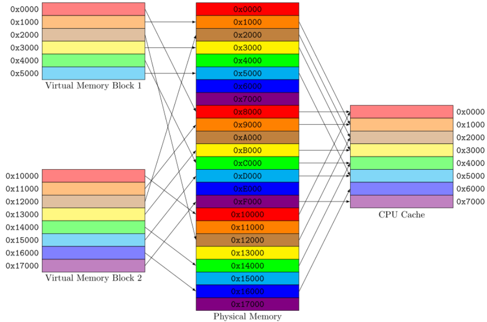
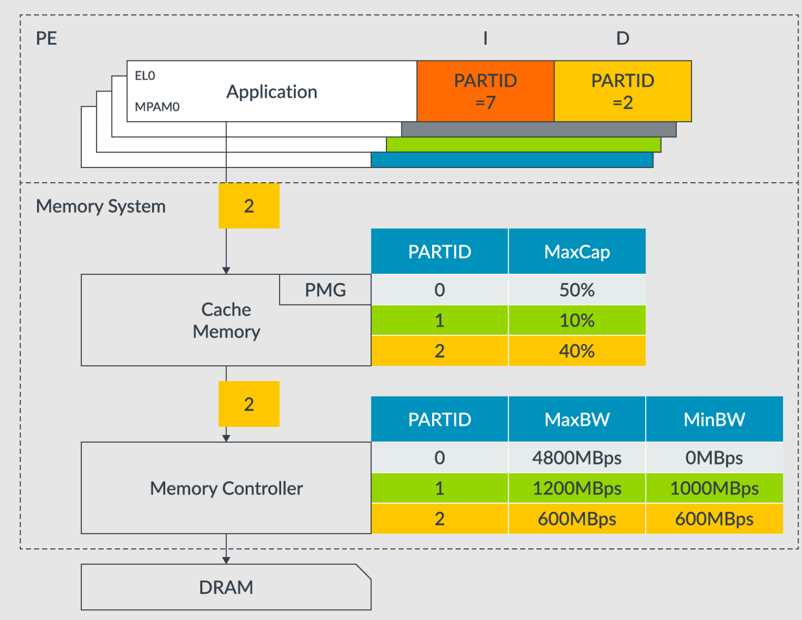

# 从缓存着色到ARM MPAM：虚拟化缓存隔离

时间: 2025/11/12

作者: 李昕昊

## 摘要

本文介绍了在hvisor虚拟机监控器中实现缓存着色（Cache Coloring）的完整技术路径。我们首先探讨了缓存着色的基本原理及其在虚拟化环境中的必要性，随后详细分析了Xen的软件实现方案，最终基于性能和架构考量选择了ARM MPAM硬件机制，并给出了完整的实现细节。本文面向内核和虚拟化开发者，旨在为类似场景下的技术选型提供参考。

---
## 1. 缓存着色：原理与必要性

### 1.1 什么是缓存着色

缓存着色（Cache Coloring）是一种通过控制物理页分配来管理缓存使用的技术。在现代处理器中，高速缓存通常采用组相联（Set-Associative）结构，物理地址的特定位（称为"颜色位"）决定了数据将映射到哪个缓存组（Set）。


#### 缓存结构回顾
典型的缓存组织如下：
物理地址结构：
```
+-------------+--------------+-------------+
|  Tag (t位)  | Set Index(s位)| Offset(b位) |
+-------------+--------------+-------------+
```

#### 颜色的定义

在分页系统中，页内偏移（p位）通常为12位（4KB页）。缓存的Set Index跨越了页边界，因此物理页帧号（PFN）的低位会影响缓存映射。我们将这些影响缓存Set选择的PFN位称为"颜色"。

**颜色数量计算公式**：

- 颜色数量公式(其中s是cache index位数, p是页内偏移位数, b是cache块内偏移位数), 直观理解就是物理页帧号PFN能决定的不同set index组合数
$$\text{num_colors} = 2 ^{(s - (p - b))} = \frac{\text{cache_size}}{(\text{page_size} * \text{cache_associativity})}$$

**示例**（L2 Cache）：
- 缓存大小：512KB
- 页大小：4KB
- 关联度：8-way
- 颜色数：512KB / (4KB × 8) = **16种颜色**

这意味着物理页帧号的低4位决定了该页将映射到16个缓存"分区"中的哪一个。

### 1.2 为什么需要缓存着色

#### 在操作系统中

传统操作系统的缓存着色以**进程**为粒度，目标是减少单个进程内部的缓存冲突失效（Conflict Miss）。然而，Linux内核开发者普遍反对这一技术，主要原因是：

1. **性能提升有限**：现代处理器的高关联度缓存已大幅降低冲突概率
2. **实现成本高**：页面分配路径的复杂度显著增加
3. **内存碎片化**：颜色约束导致可用内存利用率下降

> Linus Torvalds曾指出："缓存着色在实践中从未很好地工作过。自90年代初以来，这个讨论已经进行了至少四次尝试。"

#### 在虚拟化环境中

然而，在虚拟化场景下，缓存着色的价值重新凸显，原因包括：

1. **性能隔离需求**：多个VM共享物理缓存，一个VM的"缓存污染"会影响其他VM的性能，导致性能不可预测性。
2. **安全隔离需求**：缓存共享带来严重的侧信道攻击风险：
    - **Flush+Reload**：攻击者通过观察缓存行的加载时间推断受害者的访问模式
    - **Prime+Probe**：攻击者填充缓存组，观察哪些组被受害者驱逐
    - 这些攻击已被证明可以提取密钥、破解ASLR等
3. **VM粒度管理**：Hypervisor以VM为单位进行资源分配，相比进程粒度更加合理和可控。
4. **两级地址转换的优势**：虚拟化环境下的GPA→HPA转换由Hypervisor完全控制，实现缓存着色的侵入性比OS小。   

**核心目标**：
- **性能隔离**：确保每个VM获得可预测的缓存资源
- **安全隔离**：不同VM使用不同缓存着色，防止跨VM侧信道攻击

---

## 2. Xen的软件实现方案

为了理解软件实现的复杂性和局限性，我们首先研究了Xen的缓存着色实现（自Xen 4.20开始支持）。

### 2.1 架构概述

Xen的实现核心是用**Colored Allocator**替代传统的Buddy Allocator，通过控制物理页分配来实现缓存着色。
#### 关键设计决策

1. **静态颜色分配**：
    - 每个Domain的颜色在创建时一次性设置，运行期间不可修改
    - 函数`domain_set_llc_colors()`不支持重复调用，重复设置返回`-EEXIST`
2. **三层颜色划分**：
    - **Xen自身**：默认使用4种颜色（如[0,1,2,3]）
    - **Dom0**：在启动时分配特定颜色集合
    - **Guest Domains**：默认可使用所有剩余颜色，可通过xl工具配置
3. **单页分配限制**：
    - 只支持`order=0`的分配（单个4KB页）
    - 原因：连续的大块页会跨越多个颜色，无法保证"颜色纯度"

### 2.2 初始化流程

Xen的初始化顺序至关重要，因为需要在页表建立之前确定内存布局。

```c
start_xen()
├── llc_coloring_init()                    // 全局初始化
│   ├── get_llc_way_size()                 // 读取CLIDR_EL1获取LLC信息
│   ├── 计算颜色数量                          // 根据cache_size/page_size/ways
│   ├── 设置Xen使用的颜色集合                   // 默认xen_colors=[0,1,2,3]
│   └── arch_llc_coloring_init()           // ARM架构特定初始化
│       ├── xen_colored_map_size()         // 计算Xen需要的地址空间
│       │   └── return (_end-_start) * num_colors  // 每个颜色预留完整镜像大小
│       └── get_xen_paddr()                // 从设备树找合适的物理地址
│
├── setup_pagetables()                     // 建立页表映射
│   └── create_llc_coloring_mappings()     // 为Xen建立着色映射
│       └── relocate_xen()                 // 汇编代码完成物理搬运
│
└── create_dom0()                          // 创建Dom0
    ├── dom0_set_llc_colors()              // 设置Dom0的颜色
    └── construct_hwdom()
        └── allocate_memory()
            └── allocate_bank_memory()
                └── alloc_domheap_pages()
                    └── alloc_color_heap_page()  // 颜色感知的页分配
```

### 2.3 Xen自身的内存着色

Xen镜像本身也需要满足缓存着色约束，实现方式颇为巧妙。
#### 地址空间预留策略

Xen在物理内存中预留一段**连续的虚拟地址空间**，大小为：

```
预留空间 = Xen镜像大小 × 颜色数量
```

例如，若Xen镜像为2MB，颜色数为8，则需预留16MB的虚拟地址空间。
#### 选择性映射
在这段地址空间中，**只有符合指定颜色的物理页才真正建立映射**。
**示例**：
- 最大颜色数：8
- Xen使用颜色：[0, 2, 4, 6]
- Xen镜像：8页（32KB）
- 起始MFN：0x10000

映射表如下：

| Xen逻辑页号 | 需要的颜色 | 映射的物理页号 | 说明          |
| ----------- | ---------- | -------------- | ------------- |
| 0           | 0          | 0x10000        | color=0, 映射 |
| 1           | 2          | 0x10002        | color=2, 映射 |
| 2           | 4          | 0x10004        | color=4, 映射 |
| 3           | 6          | 0x10006        | color=6, 映射 |
| 4           | 0          | 0x10008        | color=0, 映射 |
| 5           | 2          | 0x1000A        | color=2, 映射 |
| 6           | 4          | 0x1000C        | color=4, 映射 |
| 7           | 6          | 0x1000E        | color=6, 映射 |

- 实际物理内存使用：`0x10000, 0x10002, 0x10004, 0x10006, 0x10008, 0x1000A, 0x1000C, 0x1000E`
- 可以看到，物理页并非连续，但虚拟地址连续，每个物理页都满足颜色约束。

### 2.4 Domain的页面分配

对于Guest Domain，页面分配遵循负载均衡策略。
#### 分配算法
`alloc_color_heap_page()` 实现：
```c
struct page_info *alloc_color_heap_page(struct domain *d)
{
    unsigned int i, color;
    unsigned long max = 0;
    struct page_info *pg = NULL;

    // 遍历Domain可用的所有颜色，选择剩余空闲页最多的颜色
    for (i = 0; i < domain_num_llc_colors(d); i++) {
        unsigned long free = free_colored_pages[domain_llc_color(d, i)];
        
        if (free > max) {
            color = domain_llc_color(d, i);
            pg = page_list_first(color_heap(color));
            max = free;
        }
    }
    
    if (pg == NULL)
        return NULL;  // 所有颜色都无空闲页
    
    // 从选中颜色的空闲链表中摘取页面
    page_list_del(pg, color_heap(color));
    free_colored_pages[color]--;
    
    return pg;
}
```

- **关键数据结构**：
	- `free_colored_pages[color]`：每个颜色的空闲页数量
	- `color_heap(color)`：每个颜色的空闲页链表
- 这种策略确保：
	1. 只从Domain允许的颜色中分配
	2. 平衡各颜色的使用，避免某个颜色耗尽
	3. 简单高效，无需复杂的决策算法

### 2.5 配置接口

Xen通过xl工具链配置Domain的颜色：
```bash
# 在Domain配置文件中指定LLC颜色
llc_colors = "0-3,8-11"  # 使用颜色0,1,2,3,8,9,10,11
```
底层调用链：
```
xl create
└── xc_domain_set_llc_colors()           // libxc
    └── do_domctl(XEN_DOMCTL_set_llc_colors)  // hypercall
        └── domain_set_llc_colors()       // Xen内核
```

### 2.6 软件方案的局限性

通过对Xen实现的研究，我们发现软件方案存在以下根本性问题：
#### 1. 无法使用大页映射

由于每个Zone的内存不连续（只包含特定颜色的页），无法建立2MB或1GB的大页映射。这导致：
- **TLB压力增大**：需要更多TLB条目覆盖相同的地址空间
- **页表遍历开销**：更频繁的Page Walk操作

#### 2. DMA恒等映射问题

在**无IOMMU**的系统中，DMA设备需要GPA→HPA的恒等映射（即GPA=HPA）。原因：

- DMA控制器直接使用物理地址访问内存
- Guest OS提供的DMA地址（GPA）必须等于实际物理地址（HPA）

但在缓存着色下：

- Guest OS期望连续的GPA空间
- Hypervisor只能分配特定颜色的HPA，这些HPA不连续
- **无法同时满足恒等映射和颜色约束**

这是一个根本性的架构冲突。

#### 3. 内存利用率下降

颜色约束导致：

- 某些颜色可能耗尽，而其他颜色还有大量空闲页
- 内存碎片化严重，可分配内存减少

#### 4. 实现复杂度高

- 页面分配路径需要完全重写
- 需要维护每种颜色的独立空闲链表
- order>0的分配需要特殊处理或直接禁用

---

## 3. ARM MPAM：硬件辅助的解决方案

面对软件方案的局限性，我们转向了ARM的MPAM（Memory System Resource Partitioning and Monitoring）硬件扩展。
### 3.1 MPAM概述

MPAM是ARM从ARMv8.4-A开始引入的硬件特性，提供**内存系统资源的分区和监控能力**。


#### 核心概念

1. **PARTID（Partition ID）**：
    - 宽度：最大16位（实际实现通常较少，如Cortex-A710为6位）
    - 功能：标识一个资源分区，每个内存访问都携带PARTID
    - 范围：由CPU的`MPAMIDR_EL1`和MSC的`MPAMF_IDR`共同决定
2. **PMG（Performance Monitoring Group）**：
    - 宽度：最大8位（Cortex-A710为1位）
    - 功能：对PARTID进行细粒度的性能监控分组
    - 用途：可以区分同一PARTID内不同类型的访问（如指令/数据）
3. **MSC（Memory System Component）**：
    - 定义：支持MPAM的硬件组件，如L2 Cache、L3 Cache、内存控制器
    - 配置：通过Memory-Mapped寄存器进行资源分区配置
4. **MPAM信息束（Information Bundle）**： 每次内存访问携带的标签，包含：
    - PARTID（分区号）
    - PARTID Space（安全状态：Secure/Non-secure/Root/Realm）
    - PMG（监控组）

### 3.2 MPAM的硬件架构

MPAM采用分层的寄存器架构：

```
+-------------------------------------------------+
|           CPU System Registers                  |
|  (运行时配置，决定每个特权级的PARTID/PMG)          |
+-------------------------------------------------+
|  MPAMIDR_EL1   - 查询MPAM特性支持                 |
|  MPAMHCR_EL2   - 虚拟化控制（虚拟PARTID映射）      |
|  MPAM0_EL1     - EL0的PARTID/PMG                |
|  MPAM1_EL1     - EL1的PARTID/PMG                |
|  MPAM2_EL2     - EL2的PARTID/PMG                |
|  MPAMVPMn_EL2  - 虚拟PARTID→物理PARTID映射表      |
+-------------------------------------------------+
                        ↓
+-------------------------------------------------+
|      MSC Memory-Mapped Registers                |
|  (资源分区配置，决定每个PARTID的资源限额)          |
+-------------------------------------------------+
|  MPAMF_IDR           - MSC特性和最大PARTID/PMG   |
|  MPAMCFG_PART_SEL    - 选择要配置的PARTID        |
|                                                 |
|  【Cache分区】                                   |
|  MPAMF_CPOR_IDR      - Cache位图宽度             |
|  MPAMCFG_CPBM<n>     - Cache分区位图             |
|  MPAMF_CCAP_IDR      - Cache容量分区特性         |
|  MPAMCFG_CMAX        - Cache最大容量比例         |
|                                                 |
|  【内存带宽分区】                                 |
|  MPAMF_MBW_IDR       - 带宽分区特性              |
|  MPAMCFG_MBW_MIN     - 最小带宽保障              |
|  MPAMCFG_MBW_MAX     - 最大带宽限制              |
|  MPAMCFG_MBW_PROP    - 带宽比例分配              |
|  MPAMCFG_MBW_PBM<n>  - 带宽分区位图              |
+-------------------------------------------------+
```

#### 工作流程

1. **初始化阶段**（Hypervisor启动）：
    - 读取`MPAMIDR_EL1`确认MPAM支持
    - 扫描ACPI提供的MPAM表获取MSC信息（基地址、资源类型）
    - 配置MSC寄存器，为每个PARTID设置资源限额
2. **运行时阶段**（VM执行）：
    - Hypervisor在VM切换时设置`MPAM2_EL2`
    - CPU自动在每次内存访问时附加PARTID/PMG信息
    - MSC硬件根据PARTID执行资源分区策略

### 3.3 虚拟化支持

#### 虚拟PARTID映射

通过`MPAMHCR_EL2`和`MPAMVPMn_EL2`寄存器，Hypervisor可以实现虚拟PARTID：

```
Guest OS (EL1) 使用虚拟PARTID
       ↓
MPAMHCR_EL2.EL1_VPMEN = 1 启用映射
       ↓
MPAMVPMn_EL2[vPARTID] → 物理PARTID
       ↓
MSC 根据物理PARTID 执行分区
```

**优势**：
- Guest OS无需感知物理PARTID分配
- Hypervisor可灵活调整映射关系
- 减少VM退出（trap），性能开销低

#### 寄存器陷入控制
`MPAM2_EL2`提供细粒度的陷入控制：

| 字段               | 功能                       |
| ------------------ | -------------------------- |
| `TRAP_MPAMIDR_EL1` | 陷入Guest对MPAM特性的查询  |
| `TRAPMPAM0EL1`     | 陷入Guest对MPAM0_EL1的访问 |
| `TRAPMPAM1EL1`     | 陷入Guest对MPAM1_EL1的访问 |

Hypervisor可以：
- 拦截并伪装Guest看到的MPAM特性
- 控制Guest是否能自主配置PARTID

### 3.4 资源分区能力

MPAM支持多种资源分区策略，每种都有对应的寄存器配置。
#### Cache分区

**方式1：容量比例分区（CMAX）**

通过`MPAMCFG_CMAX`设置每个PARTID可使用的最大Cache容量比例：

```
CMAX = 0.25 (25%)  → 该PARTID最多占用25%的Cache
CMAX = 1.0  (100%) → 该PARTID可使用全部Cache
```

- **字段结构**：CMAX是定点小数，二进制小数点在bit[15]和bit[16]之间
- **软/硬限制**：`SOFTLIM`位控制超限后的行为
    - SOFTLIM=0（硬限制）：超过CMAX后强制驱逐
    - SOFTLIM=1（软限制）：超过CMAX后降低优先级

**方式2：Cache位图分区（CPBM）**
将Cache划分为多个"portion"，通过位图控制每个PARTID可访问哪些portion：

```c
// 假设Cache有16个portion
MPAMCFG_CPBM[0] = 0x000F;  // PARTID 0 使用portion [0-3]
MPAMCFG_CPBM[1] = 0x00F0;  // PARTID 1 使用portion [4-7]
MPAMCFG_CPBM[2] = 0x0F00;  // PARTID 2 使用portion [8-11]
```

- **位图宽度**：由`MPAMF_CPOR_IDR.CPBM_WD`指定（1-32768位）
- **硬件隔离**：不同PARTID的portion完全不重叠时，实现强隔离
#### 内存带宽分区

**最小带宽保障（MBW_MIN）**：

```c
MPAMCFG_MBW_MIN = 0.2;  // 保证至少20%的总带宽
```

即使系统繁忙，该PARTID也能获得保底带宽。

**最大带宽限制（MBW_MAX）**：

```c
MPAMCFG_MBW_MAX = 0.5;        // 最多使用50%的总带宽
MPAMCFG_MBW_MAX.HARDLIM = 1;  // 硬限制
```

- HARDLIM=1：超过MAX后完全停止分配带宽
- HARDLIM=0：超过MAX后降低优先级，允许"借用"空闲带宽

#### 配置流程

所有MSC配置都遵循统一的流程, 调用`configure_mpam_for_system`则可以将静态配置作用于所有探测到的MSC设备：

```c
// 1. 选择目标PARTID和RIS
select_partid_ris(partid, ris, internal)
// 2. 配置资源控制寄存器, 以cache cmax为例
mpamcfg_cmax.set(value & mask)
```

### 3.5 硬件机制相对软件方案的优势

| 维度           | 软件方案                     | ARM MPAM硬件机制            |
| -------------- | ---------------------------- | --------------------------- |
| **页表映射**   | 必须禁用大页                 | 支持任意页大小              |
| **DMA支持**    | 无法恒等映射                 | 完全支持                    |
| **性能开销**   | 页分配路径复杂，TLB miss增加 | 仅寄存器操作，开销极低      |
| **灵活性**     | 静态分配，运行时不可调整     | 可动态调整资源配额          |
| **隔离粒度**   | 仅Cache                      | Cache + 内存带宽 + 其他资源 |
| **实现复杂度** | 需重写内存管理核心代码       | 仅需配置寄存器              |
| **内存利用率** | 颜色约束导致碎片化           | 不影响内存分配              |

MPAM的核心优势在于：**将资源分区从软件层提升到硬件层，解耦了内存分配与缓存管理。**

---

## 4. 在hvisor中的实现

基于上述分析，我们选择在hvisor中采用ARM MPAM硬件方案。
### 4.1 hvisor架构背景

hvisor是一款轻量级Type-1虚拟机监控器，具有以下特点：

- **Type-1架构**：直接运行在裸机上，无需宿主OS
- **Rust实现**：提供内存安全保障，减少系统级编程错误
- **轻量设计**：专注核心虚拟化功能，启动时间短（<100ms）
- **异构支持**：支持ARMv8、RISC-V、LoongArch、x86等多架构
- **嵌入式优化**：面向边缘计算、车载、工业控制等场景
- **架构灵感**：受Little.BIG二元内核启发，支持"轻量内核+完整内核"并行运行

#### 为什么hvisor适合MPAM?
1. **直接硬件访问**：作为Type-1 Hypervisor，可直接配置MPAM寄存器
2. **静态分区模型**：hvisor的CPU静态分配策略与MPAM的PARTID模型天然契合
3. **轻量化需求**：MPAM的硬件方案避免了复杂的软件着色逻辑
4. **DMA友好**：嵌入式场景常见无IOMMU的SoC，MPAM不影响DMA恒等映射

### 4.2 实现架构

我们的实现分为三个层次：

```
+----------------------------------------------+
|         配置层 (Configuration Layer)          |
|  - ACPI MPAM解析                              |
|  - PARTID分配器                               |
|  - 系统级配置接口                              |
+----------------------------------------------+
                    ↓
+----------------------------------------------+
|         抽象层 (Abstraction Layer)            |
|  - MpamRegisters结构体                        |
|  - 寄存器读写封装                              |
|  - 资源配置API (set_part_cmax_ratio等)        |
+----------------------------------------------+
                    ↓
+----------------------------------------------+
|         硬件层 (Hardware Layer)               |
|  - CPU系统寄存器操作                           |
|  - MSC Memory-Mapped寄存器访问                |
|  - 硬件特性探测                                |
+----------------------------------------------+
```


### 4.3 特性探测与初始化

#### 4.3.1 MPAM版本检测

首先检测CPU是否支持MPAM以及具体版本：

```rust
pub fn mpam_version() -> u8 {
    // 读取ID_AA64PFR0_EL1寄存器获取主版本号
    let id_aa64pfr0_el1 = read_sysreg!(id_aa64pfr0_el1);
    let major = (id_aa64pfr0_el1 >> 40) & 0xf;
    
    // 读取ID_AA64PFR1_EL1寄存器获取次版本号
    let id_aa64pfr1_el1 = read_sysreg!(id_aa64pfr1_el1);
    let minor = (id_aa64pfr1_el1 >> 16) & 0xf;
    
    // 组合成版本号：高4位主版本，低4位次版本
    ((major << 4) | minor) as u8
}
```

**版本差异**：

- v0.0：不支持MPAM
- v0.1/v1.1：支持完整MPAM特性，包括64位`MPAMF_IDR`和`HAS_ENDIS`特性

#### 4.3.2 MSC信息获取

从ACPI的MPAM表中解析MSC（Memory System Component）配置


在hvisor中使用MPAM_NODES保存信息, 以下示例包含一个缓存 MSC节点和具有四个资源实例的内存MSC节点

```rust
pub static MPAM_NODES: &[(MscNode, &[ResourceNode])] = &[
    (
        MscNode {
            length: 0,
            interface_type: 0,
            reserved: 0,
            identifier: 0,
            base_address: 0xB01A000,
            mmio_size: 16384,
            overflow_interrupt: 44,
            overflow_interrupt_flags: 1,
            reserved1: 0,
            overflow_interrupt_affinity: 0,
            error_interrupt: 45,
            error_interrupt_flags: 1,
            reserved2: 0,
            error_interrupt_affinity: 0,
            maxn_rdy_usec: 100,
            hardware_id_of_linked_device: 0,
            instance_id_of_linked_device: 0,
            number_of_resource_nodes: 1,
        },
        &[ResourceNode {
            identifier: 0,
            ris_index: 0,
            reserved1: 0,
            locator_type: 0,
            locator: [
                0x03, 0x00, 0x02, 0x02, 0x00, 0x00, 0x00, 0x00, 0x00, 0x00, 0x00, 0x00,
            ],
            number_of_functional_dependencies: 0,
        }],
    ),
        (
        MscNode {
            length: 0,
            interface_type: 0,
            reserved: 0,
            identifier: 4,
            base_address: 0xB00A000,
            mmio_size: 16384,
            overflow_interrupt: 44,
            overflow_interrupt_flags: 1,
            reserved1: 0,
            overflow_interrupt_affinity: 0,
            error_interrupt: 45,
            error_interrupt_flags: 1,
            reserved2: 0,
            error_interrupt_affinity: 0,
            maxn_rdy_usec: 100,
            hardware_id_of_linked_device: 0,
            instance_id_of_linked_device: 0,
            number_of_resource_nodes: 1,
        },
        &[ResourceNode {
            identifier: 4,
            ris_index: 0,
            reserved1: 0,
            locator_type: 0,
            locator: [
                0x00, 0x00, 0x03, 0x02, 0x00, 0x00, 0x00, 0x00, 0x00, 0x00, 0x00, 0x00,
            ],
            number_of_functional_dependencies: 0,
        }],
    ),
    (
        MscNode {
            length: 0,
            interface_type: 0,
            reserved: 0,
            identifier: 5,
            base_address: 0xB006000,
            mmio_size: 16384,
            overflow_interrupt: 44,
            overflow_interrupt_flags: 1,
            reserved1: 0,
            overflow_interrupt_affinity: 0,
            error_interrupt: 45,
            error_interrupt_flags: 1,
            reserved2: 0,
            error_interrupt_affinity: 0,
            maxn_rdy_usec: 100,
            hardware_id_of_linked_device: 0,
            instance_id_of_linked_device: 0,
            number_of_resource_nodes: 4,
        },
        &[
            ResourceNode {
                identifier: 5,
                ris_index: 0,
                reserved1: 0,
                locator_type: 1,
                locator: [0x00; 12],
                number_of_functional_dependencies: 0,
            },
            ResourceNode {
                identifier: 5,
                ris_index: 1,
                reserved1: 0,
                locator_type: 1,
                locator: [
                    0x01, 0x00, 0x00, 0x00, 0x00, 0x00, 0x00, 0x00, 0x00, 0x00, 0x00, 0x00,
                ],
                number_of_functional_dependencies: 0,
            },
            ResourceNode {
                identifier: 5,
                ris_index: 2,
                reserved1: 0,
                locator_type: 1,
                locator: [
                    0x02, 0x00, 0x00, 0x00, 0x00, 0x00, 0x00, 0x00, 0x00, 0x00, 0x00, 0x00,
                ],
                number_of_functional_dependencies: 0,
            },
            ResourceNode {
                identifier: 5,
                ris_index: 3,
                reserved1: 0,
                locator_type: 1,
                locator: [
                    0x03, 0x00, 0x00, 0x00, 0x00, 0x00, 0x00, 0x00, 0x00, 0x00, 0x00, 0x00,
                ],
                number_of_functional_dependencies: 0,
            },
        ],
    ),
];
```

### 4.4 系统级配置

#### 4.4.1 配置数据结构

定义每个PARTID的资源配额：

```rust
pub struct MpamPartConfig {
    pub partid: usize,
    pub cache_percentage: Option<u8>,    // Cache占用百分比 (0-100)
    pub mem_max_bw: Option<usize>,       // 最大内存带宽 (MB/s)
    pub mem_min_bw: Option<usize>,       // 最小内存带宽 (MB/s)
}

// 实际配置示例
pub static TOTAL_MEM_BW: usize = 9600;  // 系统总带宽 9.6GB/s

pub static MPAM_SYSTEM_CONFIG: &[MpamPartConfig] = &[
    // PARTID 0: hvisor自身
    MpamPartConfig {
        partid: 0,
        cache_percentage: Some(20),   // 20% Cache
        mem_max_bw: Some(2400),       // 最大2.4GB/s
        mem_min_bw: Some(0),          // 无保障
    },
    // PARTID 1: Root Zone (特权VM)
    MpamPartConfig {
        partid: 1,
        cache_percentage: Some(10),   // 10% Cache
        mem_max_bw: Some(1200),       // 最大1.2GB/s
        mem_min_bw: Some(1000),       // 保障1GB/s
    },
    // PARTID 2: 普通Guest VM
    MpamPartConfig {
        partid: 2,
        cache_percentage: Some(40),   // 40% Cache
        mem_max_bw: Some(600),        // 最大600MB/s
        mem_min_bw: Some(600),        // 保障600MB/s
    },
];
```

#### 4.4.2 统一配置接口

遍历所有MSC，应用配置：

```rust
pub fn configure_mpam_for_system(
    msc_nodes: &[(MscNode, &[ResourceNode])],
    configs: &[MpamPartConfig],
    total_mem_bw: usize,
) -> MpamResult<()> {
    let mut min_max_partid = u64::MAX;
    
    // 遍历所有MSC
    for (msc, resources) in msc_nodes {
        let mpam_registers = MpamRegisters::new(msc.base_address());
        
        // 确定系统最大PARTID
        let partid_max = mpam_registers.mpamf_idr.read(PARTID_MAX);
        if partid_max < min_max_partid {
            min_max_partid = partid_max;
        }
        
        // 为每种资源类型配置分区
        for res in *resources {
            match res.locator_type() {
                0x00 => {
                    // Cache资源配置
                    for config in configs {
                        if let Some(percentage) = config.cache_percentage {
                            info!(
                                "Configure cache partition: PARTID={}, percentage={}%",
                                config.partid, percentage
                            );
                            
                            mpam_registers.set_part_cmax_ratio(
                                config.partid as u16,
                                res.ris_index() as u8,
                                false,  // 不使用内部PARTID
                                (percentage as f64) / 100.0,  // 转换为比例
                            )?;
                        }
                    }
                }
                0x01 => {
                    // 内存带宽资源配置
                    for config in configs {
                        if let (Some(max_bw), Some(min_bw)) = 
                            (config.mem_max_bw, config.mem_min_bw) 
                        {
                            info!(
                                "Configure memory partition: PARTID={}, \
                                 max_bw={}MB/s, min_bw={}MB/s",
                                config.partid, max_bw, min_bw
                            );
                            
                            // 配置最大带宽
                            mpam_registers.set_part_mbw_max_ratio(
                                config.partid as u16,
                                res.ris_index() as u8,
                                false,
                                if max_bw == 0 { 0.0 } 
                                else { max_bw as f64 / total_mem_bw as f64 },
                                false,  // 软限制
                            )?;
                            
                            // 配置最小带宽
                            mpam_registers.set_part_mbw_min_ratio(
                                config.partid as u16,
                                res.ris_index() as u8,
                                false,
                                if min_bw == 0 { 0.0 } 
                                else { min_bw as f64 / total_mem_bw as f64 },
                            )?;
                        }
                    }
                }
                _ => {
                    warn!("Unsupported resource locator type: {}", 
                          res.locator_type());
                }
            }
        }
    }
    
    // 初始化PARTID分配器
    init_partid_allocator(min_max_partid as usize + 1);
    
    Ok(())
}
```

#### 4.4.3 寄存器抽象层

- 封装MSC寄存器及其操作(注: 目前并未包含MPAM所有MMIO寄存器, 仅实现了分配功能所需的相关寄存器)：

```rust
register_structs! {
    pub MpamRegisters {
        (0x0000 => pub mpamf_idr: ReadOnly<u64, MPAMF_IDR::Register>),
        (0x0008 => _reserved0),
        (0x0030 => pub mpamf_cpor_idr: ReadOnly<u32, MPAMF_CPOR_IDR::Register>),
        (0x0034 => _reserved_cpor),
        (0x0038 => pub mpamf_ccap_idr: ReadOnly<u32, MPAMF_CCAP_IDR::Register>),
        (0x003C => _reserved_ccap),
        (0x0040 => pub mpamf_mbw_idr: ReadOnly<u32, MPAMF_MBW_IDR::Register>),
        (0x0044 => _reserved_mbw),
        (0x0100 => pub mpamcfg_part_sel: ReadWrite<u32, MPAMCFG_PART_SEL::Register>),
        (0x0104 => _reserved1),
        (0x0108 => pub mpamcfg_cmax: ReadWrite<u32, MPAMCFG_CMAX::Register>),
        (0x010c => _reserved2),
        (0x0200 => pub mpamcfg_mbw_min: ReadWrite<u32, MPAMCFG_MBW_MIN::Register>),
        (0x0204 => _reserved_mbw_min),
        (0x0208 => pub mpamcfg_mbw_max: ReadWrite<u32, MPAMCFG_MBW_MAX::Register>),
        (0x020c => _reserved_mbw_prop),
        (0x1000 => pub cpbm_n: [ReadWrite<u32>; 1024]),
        (0x2000 => pub mbwpbm_n: [ReadWrite<u32>; 128]),
        (0x2200 => @END),
    }
}

```

### 4.5 Zone（VM）级别配置

#### 4.5.1 PARTID分配策略
- 系统支持的最大PARTID由CPU和所有MSC的最小值决定
	- **原因**：不同MSC可能支持不同的PARTID范围，必须使用最小值以确保所有MSC都能正确工作。
- 由`IdAllocator`管理, 0和1固定分配给`hvisor`和`root zone`, `non rootzone`的PARTID在创建和注销时调用公共接口`alloc_partid()`和`dealloc_partid()`
- **设计原则**：
	- PARTID 0：hvisor自身
	- PARTID 1：Root Zone（特权域，类似Dom0）
	- PARTID 2+：普通Guest Zone，动态分配

#### 4.5.2 vCPU上下文中的MPAM

由于hvisor采用**CPU静态分配**（每个vCPU绑定到特定物理CPU），不需要在vCPU切换时保存/恢复MPAM寄存器。

**关键点**：
- 每个vCPU进入Guest前，通过`MPAM2_EL2`设置hvisor PARTID
- `MPAM2_EL2.MPAMEN=1` el2级别MPAM使能
- `MPAM1_EL1.MPAMEN` el1级别MPAM使能
- `PARTID_I`和`PARTID_D`通常设置为相同值（指令和数据使用同一分区）

---

## 5. 验证与测试

### 5.1 测试环境限制

由于硬件和环境限制，我们的测试主要集中在功能验证而非性能测试：
#### 5.1.1 QEMU仿真环境
**问题**：
- QEMU TCG模式不模拟真实的Cache行为
- MPAM寄存器读写可以正常工作，但不产生实际的资源分区效果
- 无法测量真实的Cache隔离效果
**用途**：
- 验证寄存器读写逻辑
- 测试PARTID分配和回收
- 调试初始化流程
#### 5.1.2 真实硬件需求
完整的性能测试需要：
- **支持MPAM的ARM服务器**（如基于Neoverse N1/N2/V1的系统）
- **多个MSC**：至少包含L3 Cache和内存控制器的MSC
- **足够的PARTID范围**：至少支持4-8个PARTID

我们当前支持的ARM硬件不支持MPAM扩展。
### 5.2 未来的性能测试计划

当获得合适硬件后，计划进行以下测试：
#### 5.2.1 Cache隔离效果测试

**测试场景**：

- Zone A运行内存密集型负载（大量随机访问）
- Zone B运行计算密集型负载（小工作集）
- 对比启用/禁用MPAM时Zone B的性能差异

**预期结果**：

- 禁用MPAM：Zone B性能受Zone A干扰，Cache miss率上升
- 启用MPAM：Zone B性能稳定，Cache miss率保持较低水平

#### 5.2.2 内存带宽隔离测试

**测试场景**：
- Zone A配置MBW_MAX=30%
- Zone B配置MBW_MIN=50%
- 两个Zone同时运行内存带宽密集型负载
**预期结果**：
- Zone A的带宽被限制在30%以内
- Zone B始终能获得50%的带宽保障
- 总带宽利用率接近100%

#### 5.2.3 侧信道攻击防御测试

**测试方法**：
- 在Zone A中运行Flush+Reload攻击程序
- Zone B运行包含敏感操作的程序（如加密）
- 测量Zone A能否推断Zone B的行为
**预期结果**：
- 启用MPAM且使用不同PARTID：攻击失败
- 禁用MPAM或使用相同PARTID：攻击成功

---

## 6. 经验总结与最佳实践

### 6.1 技术选型的关键考量

通过从软件方案到ARM MPAM硬件方案的演进，我们总结出以下选型原则：
#### 6.1.1 何时选择软件方案

适用场景：
- 硬件不支持MPAM或类似机制
- 需要极细粒度的控制（单个页级别）
- 对性能开销不敏感的场景

代价：
- 无法使用大页，TLB压力增大
- DMA恒等映射受限
- 内存管理复杂度显著提升

#### 6.1.2 何时选择硬件方案

适用场景：

- 硬件支持MPAM（ARMv8.4+）或Intel RDT技术下CAT/MBA
- 需要高性能的虚拟化环境
- 存在DMA设备且无IOMMU
- 需要动态调整资源分配

优势：

- 零性能开销（仅寄存器操作）
- 不影响内存管理策略
- 支持运行时动态调整
- 实现简洁，维护成本低

---

## 7. 结论

### 7.1 方案对比总结

| 维度           | 软件方案                   | ARM MPAM硬件方案 |
| -------------- | -------------------------- | ---------------- |
| **适用范围**   | 任意架构硬件               | ARMv8.4-A+       |
| **实现复杂度** | 高（重写内存管理）         | 低（寄存器配置） |
| **性能开销**   | 显著（禁用大页，TLB miss） | 极低（仅初始化） |
| **资源类型**   | 仅Cache                    | Cache+带宽+其他  |
| **DMA支持**    | 受限（恒等映射冲突）       | 完全支持         |
| **动态调整**   | 支持                       | 支持             |
| **内存利用率** | 下降（碎片化）             | 无影响           |
| **安全隔离**   | 强（颜色完全隔离）         | 强（PARTID隔离） |

### 7.2 在hvisor中的后续工作

1. **真实硬件验证**：在支持MPAM的服务器平台上进行完整测试
2. **性能基准测试**：量化MPAM对不同工作负载的影响
3. **侧信道防御验证**：实际测试Flush+Reload等攻击的防御效果
4. **动态调整支持**：实现运行时修改PARTID配置的接口
5. **监控集成**：利用MPAM的监控功能实现QoS感知调度

### 7.3 最终建议

对于现代虚拟化系统：
1. **硬件支持MPAM时优先选择硬件方案**：性能和实现复杂度的优势显著
2. **软件方案作为后备**：在不支持MPAM的平台上，仅在安全隔离绝对必要时才实现软件缓存着色
3. **混合策略**：可以结合使用MPAM的Cache分区和软件的页面着色，实现更强的隔离保障
4. **关注上游支持**：跟踪Linux内核和主流Hypervisor对MPAM的支持进度，复用成熟的实现

### 7.4 参考资源
- **缓存着色**
	- [osdev](https://f.osdev.org/viewtopic.php?t=32717)
	- [wiki](https://en.wikipedia.org/wiki/Cache_coloring)
- **ARM文档**：
    - [MPAM线上文档](https://developer.arm.com/documentation/107768/0100/Arm-Memory-System-Resource-Partitioning-and-Monitoring--MPAM--Extension)
    - Arm® Memory System Resource Partitioning and Monitoring (MPAM) System Component Specification
    - ACPI for Memory System REsource Partitioning and Monitoring 3.0 beta
- **Xen实现**：
    - [Xen project](https://xenproject.org)
    - [Xen Cache Coloring Documentation](https://xenbits.xen.org/docs/4.20-testing/misc/cache-coloring.html)
    - [Xen Mailing List Patches](https://lists.xen.org/archives/html/xen-devel/2024-01/msg00009.html)
- **Linux**
	- [Linux代码提交记录](https://git.kernel.org/pub/scm/linux/kernel/git/morse/linux.git/log/?h=mpam/snapshot/v6.5-rc1)
- **博客**
	- [aarch64 MPAM内核代码详细分析](https://zhuanlan.zhihu.com/p/10585764212)
	- [mpam linux源码分析](https://www.cnblogs.com/banshanjushi/p/17696429.html)
- **hvisor mpam相关代码**：
    - [GitHub仓库](https://github.com/syswonder/hvisor/tree/mpam)
---

## 致谢

本文的实现基于对Xen社区工作的学习和对ARM架构文档的深入研究。感谢开源社区为虚拟化技术发展做出的贡献。

---

_本文为技术博客，内容基于实际开发经验整理。如有技术问题或建议，欢迎通过GitHub Issues交流。_