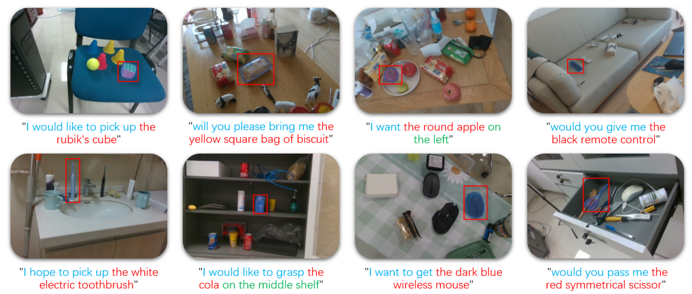
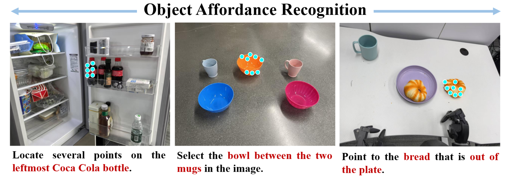
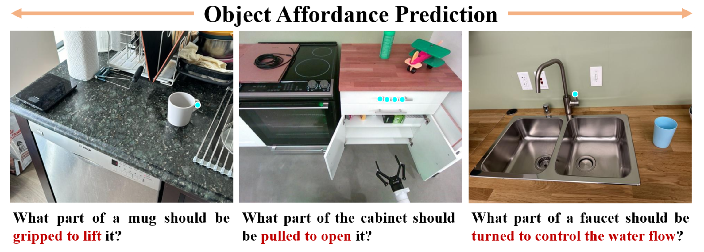
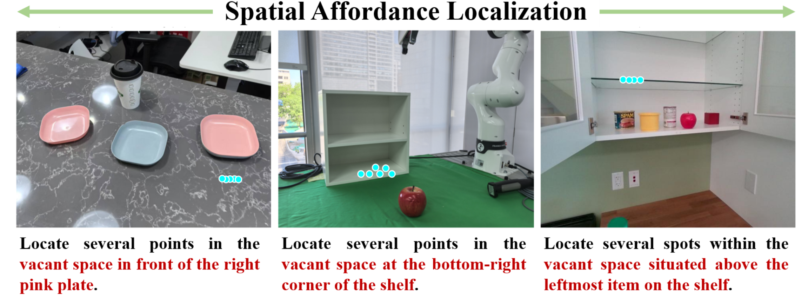
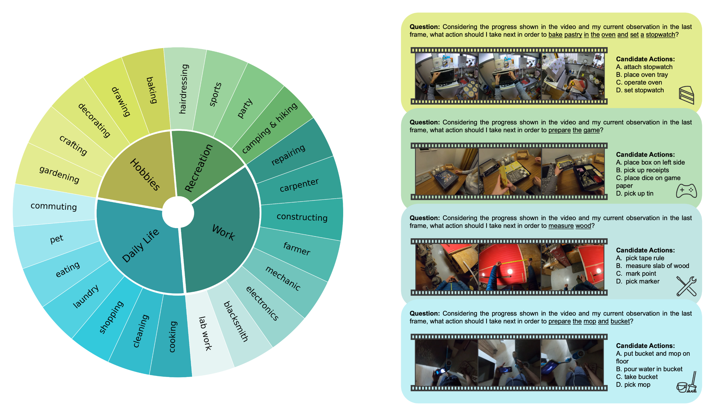
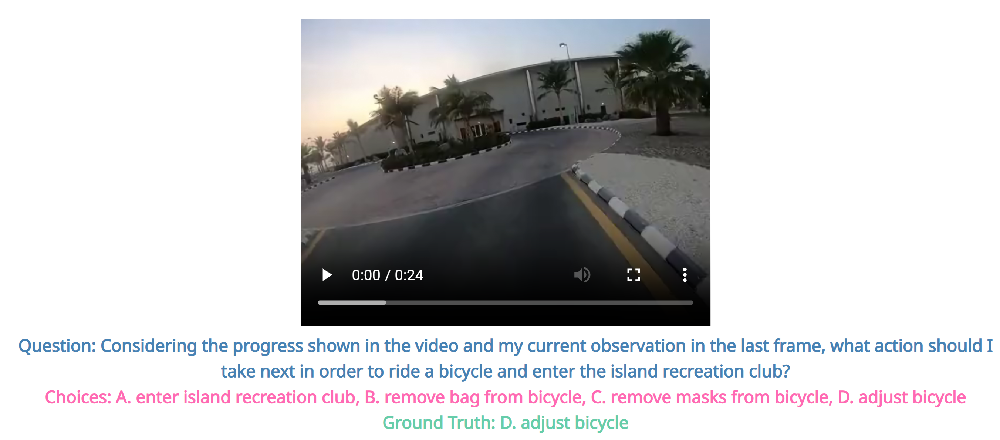
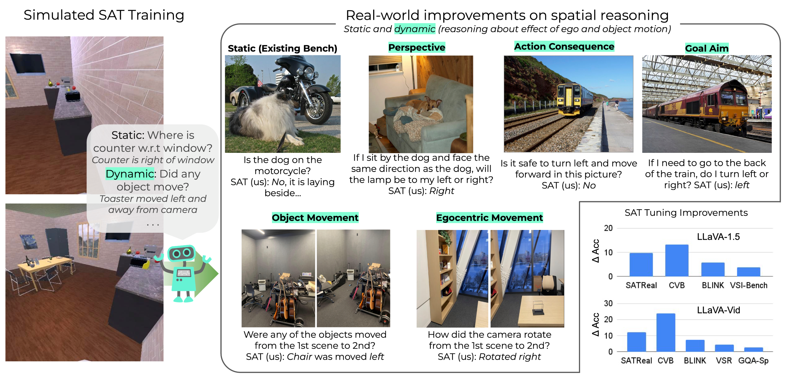
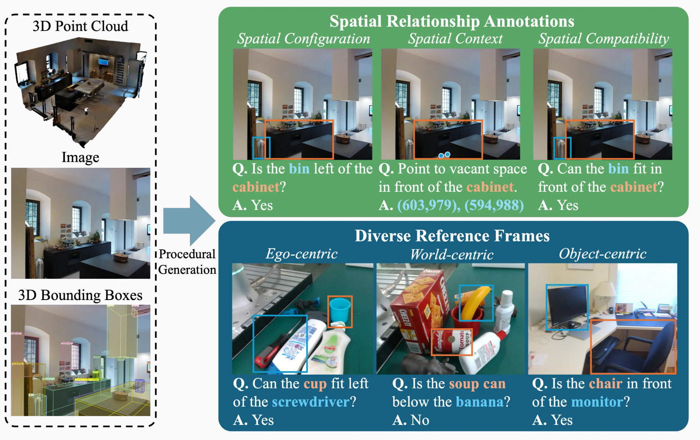
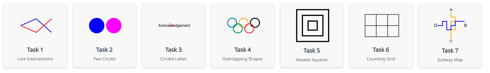

# 具身智能数据集介绍

时间：2025/12/17

作者：赵龙淳

本文主要参考小米的MiMo-Embodied模型，归纳分类了若干可能适用于VLM/VLA模型的**数据集**，以供后续工作参考。

## 基本分类

在下表中，整理出了MiMo训练过程中使用到的数据集，去除了部分未找到的数据集，并加上了我个人新添的数据集。接下来将进行一一介绍。

|          数据集类型          |                            数据集                            |
| :--------------------------: | :----------------------------------------------------------: |
|          Affordance          |           RoboRefit, Where2Place, RoboAfford-Eval            |
|           Planning           |                  EgoPlan2, RoBoVQA, Cosmos                   |
|           Spatial            | CV-Bench, ERQA, EmbSpatial, SAT, RoboSpatial, CRPE, MetaVQA, VSI-Bench |
| General Visual Understanding | MMMU-Pro, Mantis, AI2D, VLMs are Blind, PixmoCount, CountBench |

## Affordance

> [!TIP]
>
> 关于Affordance一词的理解，可以参考以下出处：[J.J. Gibson – Affordances](https://cs.brown.edu/courses/cs137/2017/readings/Gibson-AFF.pdf)，[Norman p38-42](https://www.lri.fr/~mbl/ENS/DEA-IHM/papers/Norman-Affordances.pdf)，这两人对于Affordance有着不同的理解。碍于篇幅，我们只给出Gibson原文中对于Affordance的理解：
>
> > The affordances of the environment are **what it offers the animal, what it provides  or furnishes, either for good or ill.** The verb to afford is found in the dictionary, but the  noun affordance is not. **I have made it up**...
> >
> > It implies  the **complementarity** of the animal and the environment...   
> >
> > Example: 
> >
> > If a terrestrial surface is nearly **horizontal**, nearly **flat**, and sufficiently **extended** and  if its substance is **rigid**, then the surface **affords support...** 
> >
> > It is  **stand-on-able, walk-on-able and run-over-able**. It is **not sink-into-able** like a surface of water or a  swamp.
>
> 简单而言：
>
> 1. 传统视觉更像在回答：**“这是什么？”**（分类/检测）
> 2. 而 affordance 更像在回答：**“我能拿它干什么？从哪里下手？会发生什么？”**
>
> Gibson和Norman对于Affordance的定义产生的分歧如下：
>
> - **Gibson**：更偏“**客观的行动可能性**”（但仍与行动者能力相关），强调**动物-环境互补关系**。
> - **Norman**：强调**perceived affordance（可感知的可供性）**——用户“看起来以为能怎么用”。在交互设计里，“真实可做”和“用户以为可做”可能不一致。 
>
> 具身智能里两者都会出现：
>
> 机器人系统既关心**物理上能不能做**，也关心**感知/模型以为能不能做**（影响决策和搜索）。
>
> 常见Affordance示意解释：
>
> **Affordance recognition（可供性识别）**
>
> - **输入**：物体/区域/场景的观测（RGB/RGB-D/点云/状态）
> - **输出**：有哪些 affordance（标签集合或多标签分类）
> - 更像“判定**存在性**”
>
> **Affordance detection（可供性检测）**
>
> - **输出不仅是标签，还要定位**：哪一个物体实例、哪一块区域、哪个像素/点是 “**graspable / supportable** …”
> - 很多工作会做 **instance-level + pixel-level**：先框出物体，再对框内像素赋 affordance 标签。
>
> **Affordance segmentation（可供性分割）**
>
> - detection 的一种常见形式，强调**像素级/点级**“可供性地图（affordance map）”。
>
> **Affordance prediction（可供性预测）**
>
> 1. **从观测预测 affordance（尤其是未见类别/新物体上的泛化）**：例如“没见过这种新工具，但看形状也能预测哪里能 grasp/pound”。
> 2. **预测 action 的后果（effect）**：把 affordance 当作 **Action → Effect** 的可预测关系（“做了这个动作会发生什么”）。

### RoboRefit

官网：[RoboRefIt](https://luyh20.github.io/RoboRefIt.github.io/)

该数据集主要用于**室内的Visual Grounding**。该数据集有10872张采自**凌乱的日常生活环境**的图片，并且以机器人语言指令的形式，生成了50758个**referring expressions**。更为重要的是，接近一半的图片都存在**模糊物体识别的挑战**，这也意味着使用该数据集训练可以获得拥有更加强大的Visual Grounding能力的机器人。

> [!NOTE]
>
> 什么是Visual Grounding以及Referring Expression？简单来说，Visual Grounding就是要根据一句描述（也即Referring Expression），在给定的图片中，**找到符合该描述的物体。**注意，这里的描述不只是对物体的外貌形态的描述，而是**对于某一个任务的描述**，而机器人需要找到**符合该任务需求的物体。**

RoboRefIt 包含 **RGB 图像、深度图像、表达式、掩码和边界框**。每个 RGB 图像对应一张深度图像，以及多个表达式、掩码和边界框。每个表达式描述图像中的一个对象，并对应一个掩码和一个边界框。



### Where2Place

官方网站：[wentao-yuan/where2place · Datasets at Hugging Face](https://huggingface.co/datasets/wentao-yuan/where2place)

该数据集包含100张真实世界的图像，用于通过**空间关系评估自由空间参考**。这些图像收集自各种杂乱环境。每张图像都附有一句描述所需自由空间的**句子**以及所需区域的**掩码**。

该数据集有**两类问题**：

1. 让机器人在特定的空间中，**标记出若干点**；
2. 让机器人**框出**特定的空间；

### RoboAfford/RoboAfford++

> [!NOTE]
>
> RoboAfford++相应的论文被评为**Best Paper Award & Best Poster Award, IROS 2025 RoDGE Workshop**，但是已经公开的数据集似乎并不包含（或者合并了）RoboAfford++的部分，**只有RoboAfford的内容。**

官方网站：[RoboAfford: A Dataset and Benchmark for Enhancing Object and Spatial Affordance Learning in Robot Manipulation](https://roboafford-dataset.github.io/)

RoboAfford 是一个新型的大规模数据集，旨在提升机器人**操作中的物体和空间可用性（Affordance）学习**。数据集包含 819,987 张图像，并配有 190 万条QA标注，涵盖三个关键任务：**物体可用性识别**，用于根据属性和空间关系识别物体；**物体可用性预测**，用于定位功能性抓取部位；**空间可用性定位**，用于识别可放置的空闲空间。

以下展示了三类任务的**具体呈现形式**：







## Planning

### EgoPlan2

官方网站：[EgoPlan-Bench2: A Benchmark for Multimodal Large Language Model Planning in Real-World Scenarios](https://qiulu66.github.io/egoplanbench2/)

egoPlan-Bench2 是一个严格且全面的基准测试，旨在评估多模态大模型在各种真实世界场景中的**规划能力**。EgoPlan-Bench2 涵盖了日常任务，包括 **4 个主要领域和 24 个详细场景**，紧密贴合人类的日常生活。

EgoPlan-Bench2 通过一种半自动化的流程构建，利用**自我中心视频**，并辅以人工验证。基于**第一人称视角**，它反映了人类在日常生活中解决问题的方式。

EgoPlan-Bench2的计划能力训练，是通过给出**若干动作选项**，并训练机器人选择**最合适的选项。**

下图中展示了数据集的内容组成：



以下是一个具体的例子：



### RoboVQA

> [!NOTE]
>
> 此数据集**并非常规数据集**。该数据集采自于人于机器人之间的**互动**，所以形式上随意，**训练机器人的综合能力。**
>
> 个人觉得可以将该数据集作为对模型**后期综合能力的训练**。

官方网站：[RoboVQA: Multimodal Long-Horizon Reasoning for Robotics](https://robovqa.github.io/)

RoboVQA 的核心定位是：**面向机器人真实场景的视频视觉问答（Video VQA）/高层推理（cognition）基准**。它是训练/评测一个“认知模型”去做计划、成功判定、Affordance、时间理解等高层判断与生成。

官方网页展示的典型任务类型包括至少这 6 类：**planning、success、discriminative affordance、generative affordance、past description、future prediction**。 论文里还说明：从标注好的片段序列会**自动生成 10 种类型的问答对**（用于覆盖不同的推理需求）。

数据集组成：在 3 栋办公楼范围内执行真实用户长程请求，得到 **238 小时视频、5,246 个 long-horizon episodes、92,948 个 medium-horizon episodes**，并最终形成 **829,502 个（video, text）对**。

以下给出了一个具体的数据，以供参考：

```xml
<task:affordance:discriminative:discrete:True>
put packet on the table Q: possible right now? <PRED>A: <PRED:ANSWER><PRED:DISCRETE><PRED:BINARY>yes</PRED:BINARY></PRED:DISCRETE></PRED:ANSWER>
</PRED><task:future_prediction:freeform>
Q: what is likely to happen next? <PRED>A: put packet on the table
</PRED><task:affordance:generative:positive:freeform>
Q: what action is possible right now? <PRED>A: put packet on the table
</PRED><task:success:discrete:False>
put packet on the table Q: satisfied? <PRED>A: <PRED:ANSWER><PRED:DISCRETE><PRED:BINARY>no</PRED:BINARY></PRED:DISCRETE></PRED:ANSWER>
</PRED><task:planning:freeform>
current goal is: please place all the chips on the counter and close the top drawer Q: immediate next step? <PRED>A: put packet on the table
</PRED><task:immediate_planning_with_context20:freeform>
current goal is: please place all the chips on the counter and close the top drawer. last 20 steps: 1- put packet on the table Q: immediate next step? <PRED>A: put packet on the table
</PRED><task:remaining5_planning_with_context20:freeform>
current goal is: please place all the chips on the counter and close the top drawer. last 20 steps: 1- put packet on the table Q: next 5 steps? <PRED>A: 1- put packet on the table 2- put packet on the table 3- put packet on the table 4- put packet on the table 5- put packet on the table
</PRED>
```

#### \<task:affordance:discriminative:discrete:True\>

判别式可供性（Discriminative Affordance，离散标签）

```xml
put packet on the table Q: possible right now?
A: yes
```

含义：给定候选动作 put packet on the table，问：“以当前视频所处的状态，现在立刻做这个动作**是否可行**？”

答案是可行。

- `discriminative`：判断类问题（二分类/多分类）

- `discrete`：答案是离散的

-  `True`：通常就是这个样本的**正例标记**

#### \<task:future_prediction:freeform\>

未来预测（Free-form）

```xml
Q: what is likely to happen next?
A: put packet on the table
```

含义：根据当前视频上下文，问：**“接下来最可能发生什么？”**

答案是：下一步会把 packet 放到桌上。

- `freeform`：答案是**自然语言生成**

#### \<task:affordance:generative:positive:freeform\>

生成式可供性（Generative Affordance，正例，自由文本）

```xml
Q: what action is possible right now?
A: put packet on the table
```

含义：不再给你候选动作，而是让模型**自己生成一个“现在可行的动作”**。

答案给出了一个可行动作：把 packet 放到桌上。

- `generative`：模型要**生成**动作文本
- `positive`：一般表示这里提供的是“可行动作”的正例答案

#### \<task:planning:freeform\>

规划（Planning）

```xml
current goal is: please place all the chips on the counter and close the top drawer
Q: immediate next step?
A: put packet on the table
```

含义：给一个高层目标（把所有 chips 放到台面并关上最上层抽屉），问：**“为了完成目标，眼下下一步该做什么？”**

答案：把 packet 放到桌上。

#### \<task:immediate_planning_with_context20:freeform\>

带上下文的下一步规划（给最近 20 步历史）

```xml
current goal is: ...
last 20 steps: 1- put packet on the table
Q: immediate next step?
A: put packet on the table
```

含义：在 planning 的基础上，再补充“最近的历史步骤”（最多 20 步），让模型在**知道历史轨迹**的情况下继续预测下一步。

#### \<task:remaining5_planning_with_context20:freeform\>

带上下文的后续 5 步规划

```xml
Q: next 5 steps?
A: 1- ... 2- ... 3- ... 4- ... 5- ...
```

含义：让模型生成一个短计划：**接下来 5 步要做什么**。

这里出现了 5 次重复 “put packet on the table”，这通常意味着：

- 这是自动生成/对齐时出现的“退化答案”，或者
- 这一段视频/标注在该时刻确实反复在尝试同一动作，或者
- 该 shard 的示例本身质量一般

### Cosmos

> [!NOTE]
>
> 注意，其实有**三个数据集。**

官网：

1. [nvidia/Cosmos-Reason1-Benchmark · Datasets at Hugging Face](https://huggingface.co/datasets/nvidia/Cosmos-Reason1-Benchmark)
2. [nvidia/Cosmos-Reason1-RL-Dataset · Datasets at Hugging Face](https://huggingface.co/datasets/nvidia/Cosmos-Reason1-RL-Dataset)
3. [nvidia/Cosmos-Reason1-SFT-Dataset · Datasets at Hugging Face](https://huggingface.co/datasets/nvidia/Cosmos-Reason1-SFT-Dataset)

VIDIA 在 Cosmos-Reason1 论文里把目标定义为：让多模态大模型能从**视频观察**中获得更强的**物理常识**与**具身推理**能力，并能用长链路推理生成“下一步该做什么”等具身决策。

他们用两套 ontology（**物理常识**：Space/Time/Physics；**具身推理**：跨不同 embodiment 的能力维度）来组织任务与评测，并把训练分成多个阶段，其中就包括 **Physical AI 的 SFT** 和 **Physical AI 的 RL post-training**，同时构建对应 benchmark 来衡量进展。

每条样本都是 **video + text 标注**；并且他们**发布所有数据集的文本标注**，但**视频只直接提供 RoboVQA 与 AV**，其他来源需要用户去原数据集下载视频，再按 video name 对齐

#### SFT 

这是给 Cosmos-Reason1 做**监督微调（SFT）**的数据：让模型学会对视频做**理解类**与**推理/决策类**的指令跟随，作为后续 RL 与 benchmark 的基础能力。

**核心结构：一条数据 = 一个 video clip + 一段对话式标注 + metadata。**

```json
[
{
"content": "Answer the questions.",
"role": "system"
},
{
"content": "What are the objects and actions of the robot / human arm in the video?",
"role": "user"
},
{
"content": "Centered on the table, serving as a container for various items, there is a the crate is blue, ..."
```

#### RL 

这是给 Cosmos-Reason1 做 **Physical AI Reinforcement Learning（post-training）** 用的数据。其设计更偏“决策/规划型”：让模型在给定视频片段与整体目标时，学会选择**最合理的下一步子任务**等。

**核心结构：一条数据 = video clip + 一个多选题（qa_pairs）。**

```json
{
"answer": "B",
"index2ans": {
"A": "Release the grasped white table with both arms.",
"B": "Move backward 20 centimeters.",
"C": "Lower the grasped white table with both arms in coordination.",
"D": "Grasp the arms of white table."
},
"question": "The overall goal is to \"Transport table with another robot\". The agent in the video is currently performing one subtask out of many to complete this instruction. For the agent in the video, what is the most plausible next immediate subtask from the choices below?"
}
```

#### Benchmark

这是用于**评测** Cosmos-Reason1（或其他模型）在 embodied reasoning / next-step decision 等能力上的表现。

结构与 RL 很像：video clip + 多选 qa_pairs。

```json
{
"answer": "C",
"index2ans": {
"A": "Place the held camera tripod into the right blue target box.",
"B": "Retrieve camera tripod from top-left corner of the material frame with the left arm.",
"C": "Place the dp audio-video high-definition cable held in the right arm into the blue target box on the right.",
"D": "Pass the camera tripod with both hands."
},
"question": "The overall goal is to \"Sort electronic products\". The agent in the video is currently performing one subtask out of many to complete this goal. For the agent in the video, what is the most plausible next immediate subtask from the choices below?"
}
```

## Spatial

### CV-Bench

官方网站：[nyu-visionx/CV-Bench · Datasets at Hugging Face](https://huggingface.co/datasets/nyu-visionx/CV-Bench)

CV-Bench 解决了现有以**视觉为中心**的基准测试样本量有限的问题，包含 2638 个人工检查的示例。通过重新利用标准视觉基准测试 ADE20k、COCO 和 OMNI3D，作者在多模态环境中评估模型在经典视觉任务上的表现。

利用这些基准测试提供的丰富真实标注，作者设计了自然语言问题，以探查模型在二维和三维理解方面的基本能力。CV-Bench 通过**空间关系和对象计数**评估二维理解，通过**深度顺序和相对距离**评估三维理解。

该数据集的结构是典型的**问题+选项**的形式。数据示例：

```json
// question
Estimate the real-world distances between objects in this image. Which object is closer to the truck (highlighted by a red box), the bus (highlighted by a blue box) or the car (highlighted by a green box)?
// choices
[
"bus",
"car"
]
// answer
(B)
```

### ERQA

官方网站：[embodiedreasoning/ERQA: Embodied Reasoning Question Answer (ERQA) Benchmark](https://github.com/embodiedreasoning/ERQA)

ERQA 是 Google DeepMind 在 **Gemini Robotics**技术报告/发布中一起开源的一个评测基准，用来衡量多模态模型的“具身推理”能力。

他们认为现有不少 VLM 基准更多在测“原子能力”（如识别/计数/定位），但**不足以**覆盖机器人在真实世界行动所需的**更综合能力**，因此需要一个更聚焦“**会行动的推理**”的标准化评测集合。

ERQA 用的是 **VQA 风格的多项选择题**，并且问题是**图文交错、多图输入**的。

官方在报告中明确列出了 ERQA 的主要类别，包括
 **spatial reasoning、trajectory reasoning、action reasoning、state estimation、pointing、multi-view reasoning、task reasoning** 等。

### EmbSpatial

官方网站：[mengfeidu/EmbSpatial-Bench](https://github.com/mengfeidu/EmbSpatial-Bench)

在具身环境中关键的**空间理解能力**尚未得到充分评估，因此当前的LVLMs与合格的具身智能之间的**差距仍不清楚**。为此，作者构建了EmbSpatial-Bench，这是一个用于评估LVLMs**具身空间理解能力的基准**。该基准自动从具身场景中生成，并涵盖了从自我视角出发的6种空间关系。

来自人工验证评估数据的问题被格式化为**多项选择题**。LVLM 需要从选项中选择**最合理的答案**。主要指标是**准确率**。评估方法有两种：**生成法和似然法**。

数据示例：

```json
{
    "data_source": 'mp3d',
    "scene_id": "YVUC4YcDtcY",
    "question_id": "mp3d_57",
    "question": "From your perspective, which object in the image is at the shortest distance?",
    "relation": "close",
    "image": "/9j/4AAQ...", # base64 
    "answer_options": ['garage door', 'cabinet', 'table', 'cart'],
    "answer": 2,
    "objects": [{'name': 'garage door', 'bbox': [47, 0, 517, 254]}, {'name': 'cabinet', 'bbox': [123, 256, 130, 73]}, {'name': 'table', 'bbox': [0, 396, 640, 84]}, {'name': 'cart', 'bbox': [50, 279, 130, 138]}]
}
```

### SAT

官方网站：[SAT: Dynamic Spatial Aptitude Training for Multimodal Language Models](https://arijitray.com/SAT/)

现有的对于空间推理能力的训练仅关注**静态空间关系**，而**非运动和空间的动态感知**——即对自我运动和物体运动对**空间关系影响**的推理。

SAT：这是一个模拟空间能力训练数据集，涵盖175K问答对和20K场景中的**静态和动态空间推理**。作为补充，作者还构建了一个小型但具有挑战性的动态空间测试集，使用现实世界的图像。

图例：



### RoboSpatial

官方网站：[RoboSpatial: Teaching Spatial Understanding to 2D and 3D Vision-Language Models for Robotics](https://chanh.ee/RoboSpatial/)

空间理解对于机器人感知、推理和与环境互动至关重要。然而，目前的视觉语言模型通常依赖**通用图像数据集**，这些数据集**缺乏稳健的空间场景理解和参考系理解**（自我中心、世界中心或物体中心）。

RoboSpatial：一个大规模的**真实室内和桌面环境数据集**，通过自我视角图像和3D扫描捕获。

RoboSpatial提供了100万张图像、5000个3D扫描和300万条标注的空间关系，支持二维和三维空间推理。在RoboSpatial上训练的模型在空间可供性预测、空间关系预测和机器人操作等任务上**均优于基线模型。**

图例：



### CRPE

官方网站：[OpenGVLab/CRPE · Datasets at Hugging Face](https://huggingface.co/datasets/OpenGVLab/CRPE)

CRPE用于定量评估模型的**物体识别和关系理解能力**。评估以**单项选择题**的形式进行。

该基准包含四个部分：存在性（Existence）、主语（Subject）、谓语（Predicate）和宾语（Object）。

存在性分拆用于评估**物体识别能力**，而其余分拆旨在评估**关系理解能力**，重点是分别检测关系三元组（主语、谓语、宾语）中的每个元素。下图展示了这一点：


此外，为了评估对语言先验的依赖。作者在评估中包含了**异常数据**。这些异常数据中的图像展示了在现实世界中**非常罕见的关系三元组。**


### MetaVQA

官方网站：[metadriverse/MetaVQA](https://github.com/metadriverse/MetaVQA)

VLM 作为具身智能体在移动场景很有潜力，但**缺少一个标准化的闭环（closed-loop）基准**去评估它们的**空间推理**与**连续决策（sequential decision-making）**能力，因此提出 MetaVQA 来同时做 VQA 评测与闭环仿真评测。

进一步地，它强调“具身场景理解”包含两大互相关联的方面：

- **spatial awareness**（空间感知/关系理解）
- **embodied understanding**（与行动/动力学/安全相关的理解）

MetaVQA 选择用 **Multiple-Choice + Set-of-Marks（SoM，给图中对象打可读的编号/标记）** 来提问，核心理由是：很多 VLM 在零样本下表现差，可能不是“不懂场景”，而是“**不熟悉坐标/连续空间等特殊标注范式**”；SoM + 多选能让评测更“考试化”、更公平、更适合零样本比较。

由 **400 个 nuScenes 场景**与 **6,900 个 Waymo（WOMD）场景**抽取，共 **442,102 帧**带标注的画面；

自动生成 **4,305,450 道多项选择题**；

覆盖 **30 种 question types**；

问题按三大超类组织：**spatial / embodied / grounding**。

### VSI-Bench

官方网站：[nyu-visionx/VSI-Bench · Datasets at Hugging Face](https://huggingface.co/datasets/nyu-visionx/VSI-Bench)

VSI-Bench 从**自我视角视频**中定量评估多模态大语言模型的**视觉空间智能**。VSI-Bench 包含 5,000 多个问答对，来源于 288 个真实视频。这些视频取自公共室内三维场景重建数据集 ScanNet、ScanNet 和 ARKitScenes 的验证集，涵盖多样化环境——包括**住宅空间、专业环境以及工业空间**和多个地理区域。

- VSI-Bench 通过以自我视角的视频理解评估多模态模型的**视觉空间智能**，包含来自真实室内场景的 5000 多个问答对。

- VSI-Bench-Debiased 是一个强化版本，通过作者的测试集压力测试（TsT）和迭代偏差剪枝（IBP）方法**减少非视觉捷径**。这一版本通过系统地移除那些无需视觉输入即可解决的样本，更好地**隔离了视觉推理能力**。

## General Visual Understanding

### MMMU-Pro

官网：[MMMU/MMMU_Pro · Datasets at Hugging Face](https://huggingface.co/datasets/MMMU/MMMU_Pro)

> [!NOTE]
>
> 注意，MMMU-Pro下面还分为MMMU-Pro-Standard和MMMU-Pro-Vision**两个数据集**。特征：
>
> - Standard： 候选答案的数量**增加到10个**，使模型更难猜出正确答案。
> - Vision： **问题嵌入在截图或照片**中，模型必须整合视觉和文本信息才能正确回答。没有单独的文本输入到模型中。

MMMU-Pro 是一个增强型多模态基准，旨在严格评估先进 AI 模型在**多种模态下的真实理解能力**。它在原始 MMMU 基准的基础上进行了若干关键改进，使其更加具有挑战性和现实性，确保模型在整合和理解视觉与文本信息的真正能力上得到评估。

MMMU-Pro拥有以下三个重要特征：

1. **多模态理解：**该数据集包含多样化的问题，要求模型能够理解和整合**视觉与文本**信息，反映了用户经常与具身体**互动**的真实场景。

2. **更具备复杂性：**MMMU-Pro 引入了仅视觉输入的设置，并将候选选项数量从 **4 个增加到 10 个**，使模型更难依赖猜测或作弊捷径。

3. **模拟真实世界：**仅视觉问题来源于模拟显示环境中捕获的**截图或照片**。这些变化包括不同的背景、字体样式和大小，能够逼真地模拟用户可能提供的视觉-文本整合内容的真实世界情况。

数据示例：

```shell
# question
A dam is to be constructed across a valley to form a reservoir, and the areas in the following table enclosed by contour loops were obtained from a plan of the area involved.If the 660 m level represents the level floor of the reservoir, use the prismoidal formula to calculate the volume of water impounded when the water level reaches 700 m.<image 1>

# options
['29.193 * 106 $m^{3}$', '28.893 * 106 $m^{3}$', '28.493 * 106 $m^{3}$', '29.293 * 106 $m^{3}$', '30.393 * 106 $m^{3}$', '30.093 * 106 $m^{3}$', '29.493 * 106 $m^{3}$', '29.893 * 106 $m^{3}$', '29.793 * 106 $m^{3}$', '29.693 * 106 $m^{3}$']
```

> [!NOTE]
>
> 注意，其选项还**有可能是自然语言**，不一定全是数字或者True/False抽象概念。

### Mantis

> [!NOTE]
>
> Mantis并非裸数据集，其本身是一个模型，而下属的**Mantis-Instruct**才是我们需要的数据集。

官方网站：[TIGER-AI-Lab/Mantis](https://github.com/TIGER-AI-Lab/Mantis)

Mantis-Instruct 是一个完全的**文本-图像交错多模态指令调优数据集**，包含来自 14 个子集的 721K 个示例，涵盖包括**共指**（co-reference）、**推理、比较、时间理解**在内的**多图像技能**。它已被用于训练 Mantis 模型系列。

- Mantis-Instruct 总共有 721K 个实例，由 14 个子集组成，以覆盖所有多图像技能。

- 在这 14 个子集中，有 10 个子集来自现有数据集。例如，NLVR2、IconQA 等用于**推理**技能；DreamSim、Birds-to-Words 等用于**比较**技能；NExT-QA、STAR 用于**时间理解**。

- 作者另外整理了四个新数据集 LLaVA-665k-multi、LRV-multi 以覆盖共指技能，以及 Contrast-Caption、Multi-VQA 以拓展推理技能。

> [!TIP]
>
> 我目前观察下来，Mantis-Instruct数据基本都是**输入两张图片**，然后询问这两张图片的**不同/因果等。**

数据示例：

```json
// images
[
  {
    "bytes": null,
    "path": "4630875.jpg"
  },
  {
    "bytes": null,
    "path": "18539195.jpg"
  }
]
// conversation
[
{
"role": "user",
"content": "What are the differences between animal1 and animal2 in terms of their size, legs, beak, and feathers?"
},
{
"role": "assistant",
"content": "animal1 is larger than animal2 . animal1 ' s legs appear to be longer . animal1 has a larger beak than animal2 . animal1 ' s beak is red while animal2 ' s appears sort of whitish with a dark patch in the middle . animal2 appears to have some white feathers near its tail ."
}
]
```

### AI2D

官方网站：[lmms-lab/ai2d · Datasets at Hugging Face](https://huggingface.co/datasets/lmms-lab/ai2d)

AI2D 最初是 Allen Institute（AI2）做的**科学示意图（diagram）理解 + 对应问答**数据集，用来研究：如何把图里的 **元素（图形、箭头、文本框等）** 和它们的**关系**解析出来，并在此基础上回答与图相关的问题。

AI2 官方项目页给出的规模概览是：**4,903 张 diagrams、4,563 个 questions（并有对应 annotations）**，并强调每张图都有较密集的标注与配套问答。

数据示例：

```json
// question
What is a producer?
// options
[
"B",
"A",
"C",
"D"
]
// answer
1
```

> [!TIP]
>
> 个人认为该数据集的**内容有点偏**，不太适合作为具身智能模型训练的数据集。

### VLMs are Blind

官方网站：[VLMs are Blind](https://vlmsareblind.github.io/)

虽然具有视觉能力的大型语言模型（VLMs），正在推动各种图文应用的发展，并在许多视觉理解基准测试中得分很高，但原文作者发现它们在对人类来说**很简单的低级视觉任务上仍然表现不佳**。

具体来说，在 BlindTest 上，在7 个非常简单的任务套件中，包括

1. 判断两个圆是否重叠；

2. 判断两条线是否相交；

3. 判断单词中被圈出的字母是哪一个； 

4. 计算类似奥林匹克标志中的圆圈数量

四个最先进的 VLM 平均准确率**仅为 58.57%**。远低于人类预期的 100% 准确率。在不同图像分辨率和线宽下，VLM 在需要**精确空间信息**以及识别**重叠或靠得很近的几何基元**的任务上持续表现不佳。

> [!TIP]
>
> 我个人认为这对于具身智能的影响挺大的。该数据的**内容很简单**，但是论文的题目（2024年的论文），却给相应的开发人员**敲响了警钟**

7个任务：



### PixmoCount

官方网站：[allenai/pixmo-count · Datasets at Hugging Face](https://huggingface.co/datasets/allenai/pixmo-count)

**PixMo-Count** 是 PixMo 数据集家族中的一个子集，目标是让模型学会**按类别数数**（比如图中有几个人），并在训练阶段提供“每个实例的**大致位置**”（点标注）来辅助模型把“计数”与“视觉指向/grounding”绑定起来。

它的构建方式是，从**网页图像**出发，先跑 **Detic** 这类开放词表目标检测器拿到候选目标。再做过滤以提升准确性与多样性。验证集/测试集是**人工核验**，并且只保留 **count 在 2～10** 的样本，用于更可靠地评估模型“数数能力”。

它还被用于增强 **Molmo** 这类开源 VLM 的“指向/计数”能力。

数据示例：

```json
// count
8
// points
{
"x": [
377.6000061035156,
492.79998779296875,
580.7999877929688,
777.5999755859375,
780.7999877929688,
984,
1177.5999755859375,
1392
],
"y": [
499.9540100097656,
248.37799072265625,
463.7099914550781,
555.3860473632812,
362.44000244140625,
411.47601318359375,
471.1719970703125,
655.5900268554688
]
}
// label
people
```

### CountBench

官方网站：[vikhyatk/CountBenchQA · Datasets at Hugging Face](https://huggingface.co/datasets/vikhyatk/CountBenchQA)

该数据集在 PaliGemma 中被引入，用于评估视觉语言模型中的计数能力。此版本仅包含原始 CountBench 数据集中的 **491 张图像**，因为部分原始 URL 已无法访问。

原始描述

- CountBench：我们引入了一个新的物体计数基准，称为 CountBench，它是从公开可用的 LAION-400M 图文数据集中自动收集并人工验证的。CountBench 总计包含 540 张图像，每张图像包含 **2 到 10 个特定对象，其对应的标题反映了这个数量。**

- CountBenchQA：每张图像都配有一个人工生成的问题，**关于图像中物体的数量**，将 CountBench 转变为一个**视觉问答（VQA）任务。**

数据示例：

```json
// text 
We review the ten best gaming headsets in the market
// question 
How many headsets are there in the image?
// number 
10
```

## 数据集总结

### 数据形式问题

主要是如下几种形式：

1. 直接输出个数（问图中的XX物体有多少个）
2. 选择题（选择最合适的下一个工作/最有可能发生的动作）
3. 输出点坐标（对照标点/标框类问题）

### 训练顺序问题

从训练的顺序上来看，直观上，我们应该先训练模型的General Visual Understanding的能力，然后再训练具身智能中的Affordance，Planning和Spatial的能力。所以，以下的分析也按照这个顺序展开，给出几个**数据集的特征**，从而给出数据集的优先级（1-5）。

### General Visual Grounding

MMMU-Pro：结合了视觉与文本，增加了答案的复杂性，能够较好的提升模型对于真实世界中的景象的理解能力

Mantis：较大的数据量，丰富的训练功能指向（推理、比较、时间理解），有大量实践支撑（若干开源模型使用）

AI2D：针对的领域和具身智能方面有所偏差（看各种生物链/流程图，提取信息）

VLMs are Blind：更像是一次测试，其内容简单，且抽象层次比较高

PixmoCount：引导性强，对于大模型初期将计数问题和Visual Grounding结合有较好的提升作用

CountBench：同样是计数问题，针对性更强

数据集优先级：MMMU-Pro(5)，Mantis(5)，AI2D(1), VLMs are Blind(2), PixmoCount(4), CountBench(3)

### Affordance

Robofit：室内的Visual Grounding，数据量大，包含模糊物体识别，对于模型的Visual Grounding提升作用较大。

Where2Place：小数据集，要求模型标出可握/抓的点，或者标记符合空间描述的点（两个杯子中间的点），适合测试。

RoboAfford：很厉害的数据集，其论文拥有**Best Paper Award** & **Best Poster Award**, IROS 2025 RoDGE Workshop头衔，数据量十分巨大，涵盖物体可用性识别，物体可用性预测和空间可用性定位。

数据集优先级：Robofit(4), Where2Place(3), RoboAfford(5)

### Planning

EgoPlan2：自我中心的视频（第一人称视角），严格且全面的基准测试，评估真实世界场景中的规划能力，包括 4 个主要领域和 24 个详细场景。

RoboVQA：面向机器人真实场景的视频视觉问答（Video VQA）/高层推理（cognition）基准，238 小时视频、5,246 个 long-horizon episodes、92,948 个 medium-horizon episodes，并最终形成 829,502 个（video, text）对。

该数据集很强，但其使用场景**十分硬核**：长时间的人机动态互动，适应于后期综合能力的训练，而不是初期阶段的训练。

Cosmos：意在获得更强的**物理常识**与**具身推理**能力；两套 ontology（物理常识，具身推理）来组织任务与评测，并把训练分成多个阶段，包括SFT和RL。

数据集优先级：EgoPlan2(5), Cosmos(4), RoboVQA(2)

### Spatial

CV-Bench：也是视觉中心类，探查模型在二维和三维理解方面的基本能力。CV-Bench 通过空间关系和对象计数评估二维理解，通过深度顺序和相对距离评估三维理解。

ERQA：作者认为现有不少 VLM 基准更多在测“原子能力”（如识别/计数/定位），需要一个更聚焦“会行动的推理”的标准化评测集合。ERQA 用的是 VQA 风格的多项选择题，并且问题是图文交错、多图输入的。主要类别：spatial reasoning、trajectory reasoning、action reasoning、state estimation、pointing、multi-view reasoning、task reasoning等。

EmbSpatial：纯粹的空间理解问题。来自人工验证评估数据的问题被格式化为多项选择题。LVLM 需要从选项中选择最合理的答案。主要指标是准确率。评估方法有两种：生成法和似然法。

SAT：不仅是静态，还有动态空间问题。涵盖175K问答对和20K场景中的静态和动态空间推理。作为补充，作者还构建了一个小型但具有挑战性的动态空间测试集，使用现实世界的图像。

RoboSpatial：十分强大（**CVPR 2025 Oral (0.74%)**）。以往数据集缺乏稳健的空间场景理解和参考系理解（自我中心、世界中心或物体中心），此数据集是一个**大规模**的真实室内和桌面环境数据集，通过自我视角图像和3D扫描捕获，支持二维和三维空间推理。

CRPE：视角独特，用于定量评估模型的物体识别和关系理解能力，包含四个部分：存在性（Existence）、主语（Subject）、谓语（Predicate）和宾语（Object）。

MetaVQA：它强调“具身场景理解”包含两大互相关联的方面：spatial awareness（空间感知/关系理解）embodied understanding（与行动/动力学/安全相关的理解），覆盖 30 种 question types，问题按三大超类组织：spatial / embodied / grounding。

VSI-Bench：自我视角视频中定量评估多模态大语言模型的视觉空间智能，涵盖多样化环境——包括住宅空间、专业环境以及工业空间和多个地理区域。

数据集优先级：CV-Bench(4), ERQA(4), EmbSpatial(3), SAT(4), RoboSpatial(5), CRPE(3), MetaCQA(3), VSI-Bench(4).
