# 基于NVIDIA Orin的语音识别模块部署及gRPC传输识别结果

时间: 2025/12/30

作者: 刘凯乐

联系方式：kaileliu0852@gmail.com

## 一.基于NVIDIA Orin的ASR模块

[NVIDIA Riva](https://docs.nvidia.com/deeplearning/riva/user-guide/docs/quick-start-guide.html)是一款 GPU 加速 SDK，用于构建根据用例定制并提供实时性能的语音 AI 应用程序,提供实时语音识别服务和语音生成服务。

### **1.环境配置 jetpack6.0以上版本**

JetPack 是 NVIDIA 为其 Jetson 系列嵌入式设备（如 Jetson Nano、AGX Xavier、Orin、TX2 等）提供的 **官方软件开发套件（SDK）**，首先查看L4T版本，高版本的L4T才能下载高版本jetpack

```SQL
cat /etc/nv_tegra_release
```

输出结果若为 `#R36 (release), REVISION: 4.4, GCID: 41062509, BOARD: generic, EABI: aarch64, DATE: Mon Jun 16 16:07:13 UTC 2025` 则可直接配置jetpack，执行下列命令，下载 L4T 版本相对应的最新JetPack组件

```SQL
sudo apt update
sudo apt dist-upgrade
sudo reboot
sudo apt install nvidia-jetpack
```

JetPack 是 Jetson 上运行 Riva 的前提，**因为 Riva 需要** **CUDA****/TensorRT 加速，而这些库由 JetPack 提供。**

### **2.NGC** **CLI** **配置**

**NGC** **CLI** 是指 **NVIDIA** **GPU** **Cloud** **Command Line Interface**。它是访问 NVIDIA 提供的 NGC 云平台的工具，用于拉取仓库文件。

  a.安装ngc工具，**这里一定要[安装最新的版本](https://org.ngc.nvidia.com/setup/installers/cli)**，不然后续拉取模型会出现问题.

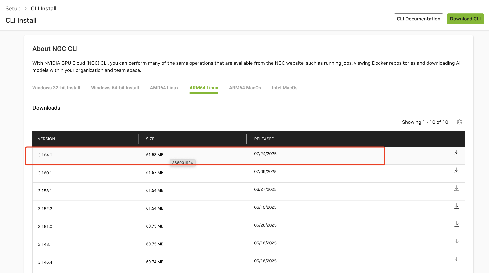

  b.执行下述命令进行安装配置

```SQL
wget --content-disposition https://api.ngc.nvidia.com/v2/resources/nvidia/ngc-apps/ngc_cli/versions/3.164.0/files/ngccli_arm64.zip -O ngccli_arm64.zip && unzip ngccli_arm64.zip
chmod u+x ngc-cli/ngc
echo "export PATH=\"\$PATH:$(pwd)/ngc-cli\"" >> ~/.bash_profile && source ~/.bash_profile
```

  c. 然后配置ngc`ngc config set`，这里需要[申请密钥](https://org.ngc.nvidia.com/service-keys) ,需要下载最新版本的CLI，执行下述命令安装：

```SQL
ngc registry resource download-version "nvidia/riva/riva_quickstart_arm64:2.19.0"
```

### **3.配置config.sh**

**riva提供ASR、NLP、TTS、NMT四个服务**，同时有不同的模型，不同的语言可以选择（但是nlp工具仅仅支持en-US）,`vim config.sh`进行服务配置，首先可以选择需要的四个服务

- service_enabled_asr=true （语音识别）
- service_enabled_nlp=false （自然语言处理）
- service_enabled_tts=false （文本转语音）
- service_enabled_nmt=false （翻译）

这里简单介绍一下asr服务，也是本教程用到的核心服务，官方提供了多模型多语言供用户进行选择

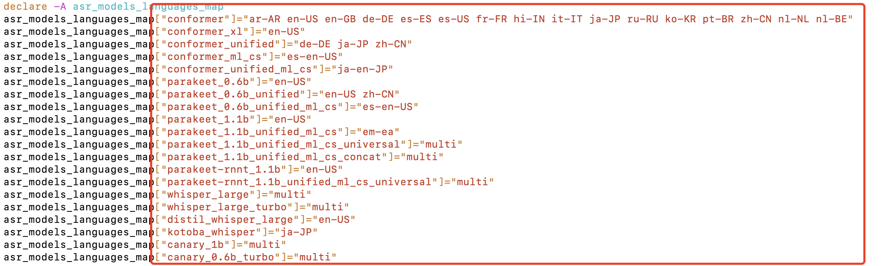

### **4.初始化riva_init**

配置完成后，进行目录执行`sudo bash riva_init.sh`即可拉取配置的模型以及docker环境。

### **5.启动docker**

这里通过`sudo bash riva_start.sh`或者docker启动命令都可以，进入docker环境。

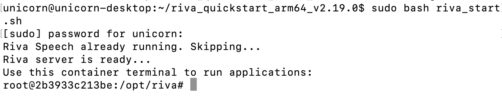

列出**下载的流式识别模型**如下所示，可以看到下载的是**conformer中文版的模型，这是google在2020年提出的一种用于** **自动语音识别** **的模型，**后面模型介绍部分进行介绍。

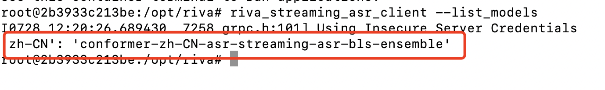

给一个测试样例wav文件，测试结果`riva_streaming_asr_client --audio_file=/opt/riva/wav/zh-CN_sample.wav --language_code=zh-CN`

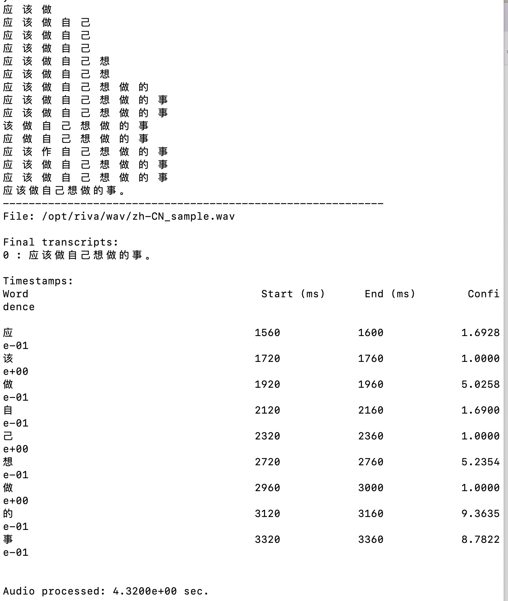

成功识别语音，得到文字，同时得到时间戳和置信度

| 词   | 开始时间(ms) | 结束时间(ms) | 置信度  |
| ---- | ------------ | ------------ | ------- |
| 应   | 1560         | 1600         | 0.16928 |
| 该   | 1720         | 1760         | 1       |
| 做   | 1920         | 1960         | 0.50258 |
| 自   | 2120         | 2160         | 0.169   |
| 己   | 2320         | 2360         | 1       |
| 想   | 2720         | 2760         | 0.52354 |
| 做   | 2960         | 3000         | 1       |
| 的   | 3120         | 3160         | 0.93635 |
| 事   | 3320         | 3360         | 0.87822 |

**总时长和音频时长相同，为流式识别。**

其他例子：

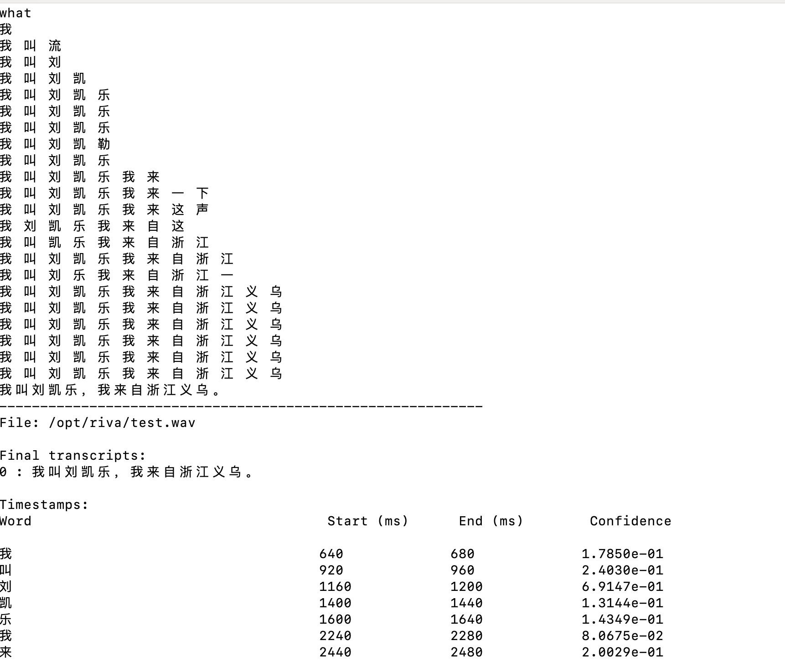

### **6.简单测试脚本**

由于jetson agx orin不支持麦克风接口，所以需要通过usb接口转麦克风。

首先**启动一个交互式shell，允许容器访问主机的音频设备和网络**

```SQL
docker run -it --rm \
  --device /dev/snd:/dev/snd \
  --group-add audio \
  --ipc=host \
  --network=host \
  -v /home/unicorn/test:/opt/riva/test \
  nvcr.io/nvidia/riva/riva-speech:2.19.0-l4t-aarch64 /bin/bash
```

执行` riva_streaming_asr_client --language_code=zh-CN --audio_device=plughw:2,0`

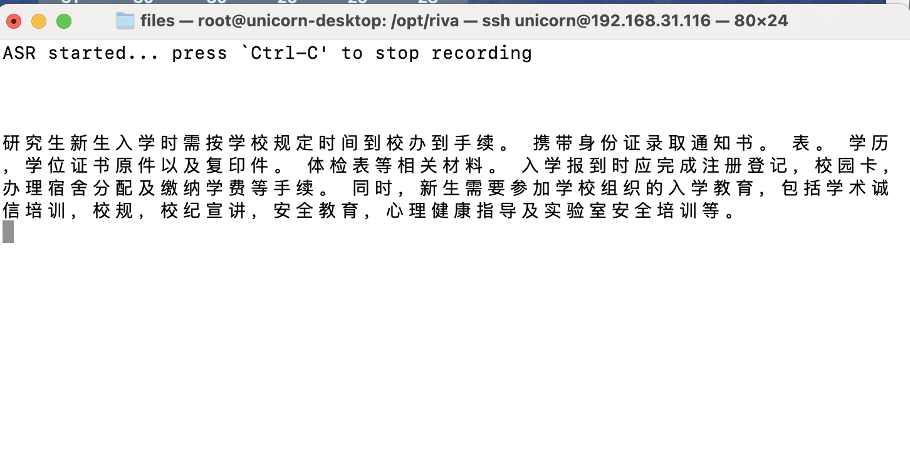

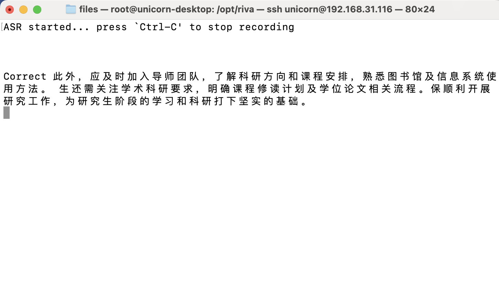

> 使用管道等方式可能会出现**`No audio files or audio device specified`**问题：Riva 版本 2.x 的 `riva_streaming_asr_client` 不支持直接从 stdin 流读取 PCM 原始数据，所以文件只能从文件（wav/pcm）或通过 `--audio_device` 直接读取硬件

### 7.下一步说明

- 尝试 [**Riva** **ASR** **API**](https://github.com/nvidia-riva/tutorials/tree/stable) ，后续满足复杂需求 ，作为一个ASR模块和其他模块进行连接 
- 尝试使用 [**NeMo框架**](https://docs.nvidia.com/deeplearning/riva/user-guide/docs/tutorials/asr-deploy-am-and-ngram-lm.htm) 部署一个使用 NeMo 训练的ASR语言模型 ，NeMo框架提供从训练、部署、微调预训练模型（允许自定义数据集）
  - **使用 NeMo 训练或加载模型**：可选择预训练模型（如 Conformer-CTC）或从零开始训练。
  - **部署模型**：按照 [官方文档](https://docs.nvidia.com/deeplearning/riva/user-guide/docs/tutorials/asr-deploy-am-and-ngram-lm.html) ，将 NeMo 模型导出成 `.riva` 格式，放入 Riva 服务中。
  - **测试部署效果**：使用 Riva API 验证部署后的 NeMo 模型是否能正常推理。
- 尝试使用 [NeMo 框架](https://github.com/nvidia-riva/tutorials/blob/main/asr-finetune-conformer-ctc-nemo.ipynb  )去微调,需要服务器
  - 首先尝试教程中的英文人声数据集
  - 构建中文数据集，分词器构建...
  - 使用构建的中文数据集进行训练...
  - 导出可以供orin部署推理的模型...

### 8.其他实现方式：llamaspeak

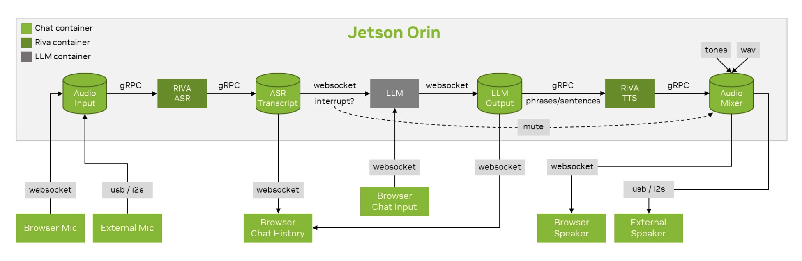

除了语音识别外，还有llm问答，tts语音合成输出，官方提供了docker和简单文档可以供使用。参考链接https://build.nvidia.com/explore/speech

1. 输入可以通过浏览器麦克风和外部麦克风，统一由 Audio Input 模块接收，通过 gRPC 传送至 RIVA ASR 进行语音识别
2. **RIVA** **ASR** 将音频转录为文字，经由 **gRPC** 发送至 **ASR Transcript**
3. **LLM** 模块接收 ASR 文本并生成回复
4. LLM Output 将短语/句子经由 **gRPC** 传给 **RIVA** **TTS** 生成语音
5. **Audio** **Mixer** 负责合成音频（可为语音、提示音 tones、wav 文件等）

## 二.使用grpc通信，实现asr识别结果的传输

需要在一台orin上实现asr模块，且能够做到识别到**关键字及其同音字（例如机器人）**，且3s内无语音识别，则自动发送识别结果文件到另外一台orin上，供另外一台orin作为输入的命令。下面是**参考hyl师兄点云部分的代码，给出**详细的说明。

### **1.定义gprc接口**

xfer/protos/file_sink.proto

```ProtoBuf
syntax = "proto3";
package filexfer;

service FileSink {
  rpc Upload(FileUpload) returns (Ack);
}

message FileUpload {
  string filename = 1;  
  bytes  data     = 2;  
}

message Ack {
  string status = 1;    
}
```

**在两台机器中各自生成一次python代码**

```SQL
python -m grpc_tools.protoc \
  -I xfer/protos \
  --python_out=xfer/protos \
  --grpc_python_out=xfer/protos \
  xfer/protos/file_sink.proto
```

生成后会得到 `file_sink_pb2.py` 和 `file_sink_pb2_grpc.py`。

### **2.Orin-B：文件接收服务（收一个文件就保存）**

xfer/server/file_sink_server.py

```Python
import os, sys, grpc
from concurrent import futures

BASE = os.path.dirname(os.path.dirname(os.path.abspath(__file__)))  # xfer/
sys.path.insert(0, os.path.join(BASE, "protos"))

import file_sink_pb2 as pb2
import file_sink_pb2_grpc as pb2_grpc

SAVE_DIR = os.environ.get("ASR_INBOX", os.path.expanduser("~/asr_inbox"))
PORT = int(os.environ.get("FILESINK_PORT", "50111"))
MAX_MSG = 50 * 1024 * 1024

class FileSink(pb2_grpc.FileSinkServicer):
    def Upload(self, request, context):
        try:
            os.makedirs(SAVE_DIR, exist_ok=True)
            fname = request.filename or "asr_result.txt"
            path = os.path.join(SAVE_DIR, os.path.basename(fname))
            with open(path, "wb") as f:
                f.write(request.data)
            print(f"[FileSink] saved: {path} ({len(request.data)} bytes)")
            return pb2.Ack(status="ok")
        except Exception as e:
            return pb2.Ack(status=f"error: {e}")

def main():
    server = grpc.server(
        futures.ThreadPoolExecutor(max_workers=4),
        options=[("grpc.max_send_message_length", MAX_MSG),
                 ("grpc.max_receive_message_length", MAX_MSG)]
    )
    pb2_grpc.add_FileSinkServicer_to_server(FileSink(), server)
    server.add_insecure_port(f"[::]:{PORT}")
    server.start()
    print(f"[FileSink] listening on {PORT}, saving to {SAVE_DIR}")
    server.wait_for_termination()

if __name__ == "__main__":
    main()
```

**运行（Orin-B）**：

```SQL
pip install grpcio grpcio-tools
mkdir -p ~/asr_inbox #存储接收到的文件
python xfer/server/file_sink_server.py
```

默认监听 `50111`，保存到 `~/asr_inbox`。可用环境变量 `FILESINK_PORT` / `ASR_INBOX` 调整

### 3.Orin-A：容器内脚本（保存后通过 gRPC 发送）

xfer/client/send_file_client.py

```Python
import os, sys, grpc

BASE = os.path.dirname(os.path.dirname(os.path.abspath(__file__)))  # xfer/
sys.path.insert(0, os.path.join(BASE, "protos"))

import file_sink_pb2 as pb2
import file_sink_pb2_grpc as pb2_grpc

MAX_MSG = 50 * 1024 * 1024

def send_file(host: str, port: int, filepath: str, rename: str = None):
    with open(filepath, "rb") as f:
        data = f.read()
    filename = rename or os.path.basename(filepath)
    options = [("grpc.max_send_message_length", MAX_MSG),
               ("grpc.max_receive_message_length", MAX_MSG)]
    with grpc.insecure_channel(f"{host}:{port}", options=options) as ch:
        stub = pb2_grpc.FileSinkStub(ch)
        resp = stub.Upload(pb2.FileUpload(filename=filename, data=data))
        if not resp.status.startswith("ok"):
            raise RuntimeError(resp.status)
        print(f"[Sender] ok -> {host}:{port}/{filename} ({len(data)} bytes)")

if __name__ == "__main__":
    # 用法：python send_file_client.py ORIN_B_IP 50111 /opt/riva/test/asr_*.txt [optional_rename]
    host, port, fpath = sys.argv[1], int(sys.argv[2]), sys.argv[3]
    rename = sys.argv[4] if len(sys.argv) > 4 else None
    send_file(host, port, fpath, rename)
```

### 4.asr脚本

xfer/run_asr_and_send_grpc.sh

```Bash
#!/bin/bash
set -euo pipefail

# ========= 配置 =========
LANGUAGE_CODE="${LANGUAGE_CODE:-zh-CN}"
AUDIO_DEVICE="${AUDIO_DEVICE:-plughw:2,0}"     # 用 arecord -l 查到的 plughw:X,Y
SAVE_DIR="${SAVE_DIR:-/opt/riva/test}"         
TMP_FILE="${TMP_FILE:-/tmp/asr_buffer.txt}"

# Orin-B gRPC 接收端
ORIN_B_IP="${ORIN_B_IP:-}"                     
FILESINK_PORT="${FILESINK_PORT:-50111}"
ORIN_B_RENAME="${ORIN_B_RENAME:-}"             

KEYWORDS=("机器人" "几奔" "机奔" "积奔" "机人" "几人" "极奔" "极人")

mkdir -p "$SAVE_DIR"
: > "$TMP_FILE"


PY_OK=1
python3 - <<'PY' >/dev/null 2>&1 || PY_OK=0
import grpc, sys
from packaging import version
assert version.parse(grpc.__version__) >= version.parse("1.71.0")
PY
if [[ $PY_OK -eq 0 ]]; then
  echo "[WARN] 未检测到匹配版本的 grpcio (>=1.71.0)，将跳过 gRPC 发送。"
fi

send_via_grpc() {
  local path="$1"
  if [[ -z "${ORIN_B_IP}" ]]; then
    echo "[SKIP] 未配置 ORIN_B_IP，跳过 gRPC 发送：$path"; return 0
  fi
  if [[ $PY_OK -eq 0 ]]; then
    echo "[SKIP] grpcio 版本不匹配，跳过 gRPC 发送：$path"; return 0
  fi
  local rename_arg=()
  [[ -n "${ORIN_B_RENAME}" ]] && rename_arg=("${ORIN_B_RENAME}")
  python3 /opt/riva/xfer/client/send_file_client.py "${ORIN_B_IP}" "${FILESINK_PORT}" "$path" "${rename_arg[@]}"
}


echo "[INFO] Using device: $AUDIO_DEVICE"
# -o0 -> 关闭 stdout 缓冲；确保逐行/即时输出
coproc RIVA { stdbuf -o0 riva_streaming_asr_client --language_code="${LANGUAGE_CODE}" --audio_device="${AUDIO_DEVICE}" 2>/dev/null; }
RIVA_PID=${RIVA_PID:-$COPROC_PID}   # bash 5: RIVA_PID；bash 4 用 COPROC_PID

if [[ -z "${RIVA_PID}" ]]; then
  echo "[ERR] 无法启动 riva_streaming_asr_client"; exit 1
fi
echo "[INFO] riva_streaming_asr_client pid=${RIVA_PID}"

cleanup() {
  exec {RIVA[0]}>&- 2>/dev/null || true
  exec {RIVA[1]}>&- 2>/dev/null || true
  [[ -n "${RIVA_PID}" ]] && kill "$RIVA_PID" 2>/dev/null || true
  rm -f "$TMP_FILE"
}
trap cleanup EXIT INT TERM

# ========= 关键词触发 + 静默 3 秒 =========
triggered=0
last_activity_time=$(date +%s)


while true; do
  line=""
  if IFS= read -r -t 0.2 -u "${RIVA[0]}" line; then
    # 收到一行识别文本
    [[ -z "$line" ]] && continue
    echo "$line"
    echo "$line" >> "$TMP_FILE"
    last_activity_time=$(date +%s)

    # 关键字检测
    for kw in "${KEYWORDS[@]}"; do
      [[ "$line" == *"$kw"* ]] && { echo "[Trigger] 检测到关键字：$kw"; triggered=1; }
    done
  else
    # 0.2s 内无新行：检查是否静默超时
    if [[ $triggered -eq 1 ]]; then
      current_time=$(date +%s)
      diff=$((current_time - last_activity_time))
      if (( diff >= 3 )); then
        timestamp=$(date +"%Y%m%d_%H%M%S")
        save_path="${SAVE_DIR}/asr_${timestamp}.txt"
        mv "$TMP_FILE" "$save_path"
        echo "[Saved] 无语音输入3秒，保存文件到 $save_path"
        send_via_grpc "$save_path" || true
        echo "[Exit] 程序即将退出。"
        exit 0
      fi
    fi
    # 如果 Riva 进程退出，则报错并退出
    if ! kill -0 "$RIVA_PID" 2>/dev/null; then
      echo "[ERR] riva_streaming_asr_client 已退出。"
      exit 1
    fi
  fi
done
```

### 5.启动方式

**（1）先在 Orin-B 启动接收服务**

```SQL
# 准备环境
pip install grpcio grpcio-tools
mkdir -p ~/asr_inbox

# 启动 FileSink（默认端口 50111）
python xfer/server/file_sink_server.py
```

**（2）Orin-A 以挂载方式进入 Riva 容器并运行脚本**

确保包含 `protos/*.py` 和 `client/send_file_client.py` 以及 `run_asr_and_send_grpc.sh`在宿主机放在 `/home/unicorn/xfer`。

```Bash
docker run -it --rm \
  --device /dev/snd:/dev/snd \
  --group-add audio \
  --ipc=host \
  --network=host \
  -v /home/unicorn/test:/opt/riva/test \
  -v /home/unicorn/xfer:/opt/riva/xfer \
  -e ORIN_B_IP=172.20.10.2 \
  -e FILESINK_PORT=50111 \
  -e LANGUAGE_CODE=zh-CN \
  -e AUDIO_DEVICE=plughw:2,0 \
  -e SAVE_DIR=/opt/riva/test \
  nvcr.io/nvidia/riva/riva-speech:2.19.0-l4t-aarch64 /bin/bash
```

进入容器后，首先需要升级grpcio

```Python
# 看当前版本
python3 -c "import grpc,sys; print('grpcio=', grpc.__version__)"

# 升级到与生成代码匹配的版本
pip3 install --no-cache-dir --upgrade "grpcio==1.71.0" "grpcio-status==1.71.0"

# 再确认
python3 -c "import grpc,sys; print('grpcio=', grpc.__version__)"
```

执行脚本

```SQL
bash /opt/riva/xfer/run_asr_and_send_grpc.sh
```

**Riva 实时识别 → 关键字触发 → 静默 3 秒保存到** **`/opt/riva/test/asr_\*.txt`（宿主机可见） → 立刻通过 **gRPC **发到 Orin-B  → 退出**。

### 结果展示

在asr主机：

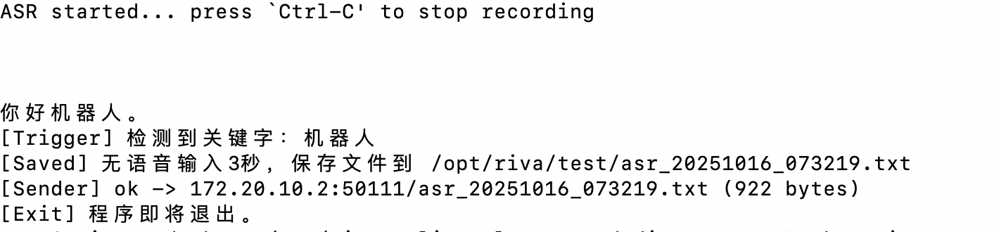

**在接收主机**


**传输文件展示**

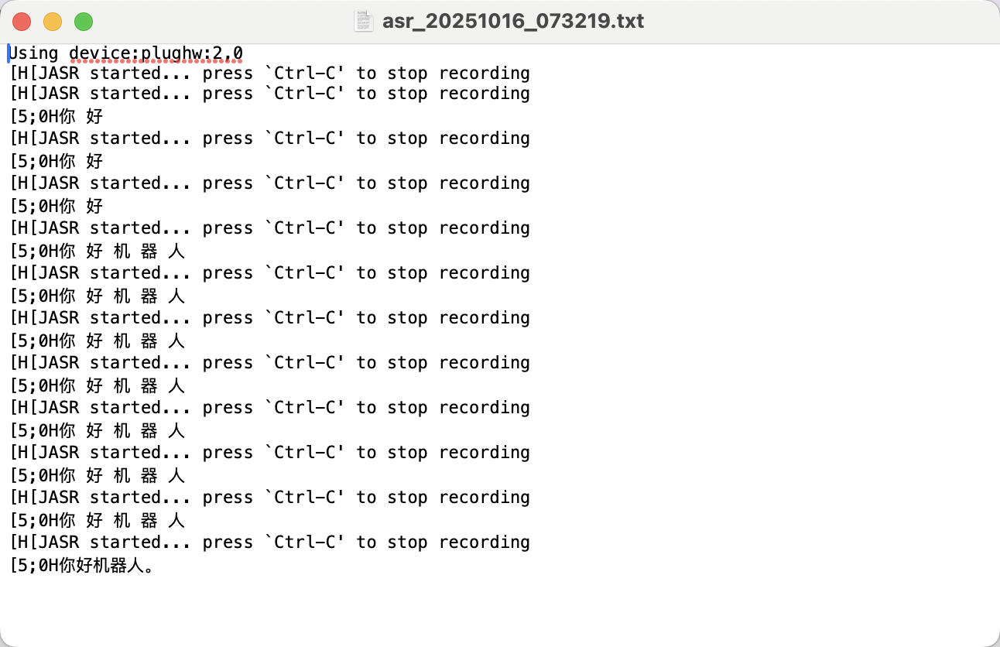