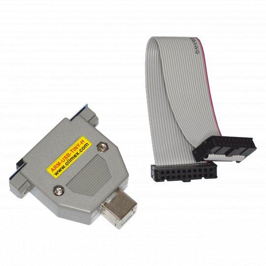

# 使用 Jtag 在树莓派上调试 ArceOS

时间：2023.6.1

作者：袁世平

联系方式：robert_yuan@pku.edu.cn


## 摘要

这篇文章主要讲述了连接树莓派需要准备的硬件和软件

同时讲述了连接的方法和调试的方法，对于移植部分只是基于非常浅的讲述了最基本的串口地址的修改，以及调试所需要的对内核起始地址的修改，具体更多的关于将 ArceOS 运行到 树莓派4 上的内容，可以见后一篇文章。


## **准备工作：**

### **硬件：**

1. 树莓派4B
2. USB 转串口线
3. ARM-USB-TINY-H



3所提到的设备如上图所示，淘宝上可以买到，不过不会配对应的线，其连接树莓派需要串口连接的线，连接电脑则还需要配一根 usb-a 转 usb 的线：


### **软件：**

1. https://github.com/rust-embedded/rust-raspberrypi-OS-tutorials
2. https://github.com/rcore-os/arceos
3. 安装 docker


### **硬件连接：**

【这里都是根据 rust-raspberrypi-OS-tutorials 中配置的，建议先学习该 Tutorial 的第六章和第八章】

1. 串口连接


2. jtag 连接


## **执行步骤：**

### **1.** **烧录基本启动需要的内容：**

给 sd 卡分一个 FAT32 的 boot 区

在sd卡上烧录启动需要的内容

在这里下载：

https://github.com/raspberrypi/firmware/tree/master/boot

需要的是这三个文件：

`bcm2711-rpi-4-b.dtb` 

`start4.elf` 

`fixup4.dat` 


同时创建一个文件 `config.txt` 

```
arm_64bit=1
init_uart_clock=48000000
enable_jtag_gpio
```


同时你需要烧一个基本的启动的 `kernel8.img` 

进入 `rust-raspberrypi-OS-tutorials/06_uart_chainloader` 中 `make BSP=rpi4` 生成 `kernel8.img`

然后把 `kernel8.img` 也放到 sd 卡中

然后把 sd 卡放入树莓派


**2.** **使用** **jtag** **进行调试**

先把 arceos 的代码复制到 rust-raspberrypi-OS-tutorials  下

在 Makefile 后加入内容（更建议将其放入 `scripts/raspi4.mk` 中，然后在 Makefile 中 Include 进来）

这里增加的内容大部分就是 08_HW_DEBUG_JATG 目录下的 Makefile，然后重新设置了 Kernel_elf 和
Kernel_bin 为之前的 OUT_ELF 和 OUT_BIN

因为这个 Makefile 需要依赖 rust-raspberrypi-OS-tutorials 目录下的一些工具，所以需要把 arceos 放进这
个目录里来运行

```makefile
include ../common/docker.mk
include ../common/format.mk
include ../common/operating_system.mk

##--------------------------------------------------------------------------------------------------
## Optional, user-provided configuration values
##--------------------------------------------------------------------------------------------------

# Default to the RPi4.
BSP ?= rpi4

# Default to a serial device name that is common in Linux.
DEV_SERIAL ?= /dev/ttyUSB0


##--------------------------------------------------------------------------------------------------
## BSP-specific configuration values
##--------------------------------------------------------------------------------------------------
QEMU_MISSING_STRING = "This board is not yet supported for QEMU."

ifeq ($(BSP),rpi3)
    TARGET            = aarch64-unknown-none-softfloat
    KERNEL_BIN        = kernel8.img
    QEMU_BINARY       = qemu-system-aarch64
    QEMU_MACHINE_TYPE = raspi3
    QEMU_RELEASE_ARGS = -serial stdio -display none
    OBJDUMP_BINARY    = aarch64-none-elf-objdump
    NM_BINARY         = aarch64-none-elf-nm
    READELF_BINARY    = aarch64-none-elf-readelf
    OPENOCD_ARG       = -f /openocd/tcl/interface/ftdi/olimex-arm-usb-tiny-h.cfg -f /openocd/rpi3.cfg
    JTAG_BOOT_IMAGE   = ../X1_JTAG_boot/jtag_boot_rpi3.img
    LD_SCRIPT_PATH    = $(shell pwd)/src/bsp/raspberrypi
    RUSTC_MISC_ARGS   = -C target-cpu=cortex-a53
else ifeq ($(BSP),rpi4)
    TARGET            = aarch64-unknown-none-softfloat
	KERNEL_BIN		  := $(OUT_BIN)
#    KERNEL_BIN        = kernel8.img
    QEMU_BINARY       = qemu-system-aarch64
    QEMU_MACHINE_TYPE =
    QEMU_RELEASE_ARGS = -serial stdio -display none
    OBJDUMP_BINARY    = aarch64-none-elf-objdump
    NM_BINARY         = aarch64-none-elf-nm
    READELF_BINARY    = aarch64-none-elf-readelf
    OPENOCD_ARG       = -f /openocd/tcl/interface/ftdi/olimex-arm-usb-tiny-h.cfg -f /openocd/rpi4.cfg
    JTAG_BOOT_IMAGE   = ../X1_JTAG_boot/jtag_boot_rpi4.img
    LD_SCRIPT_PATH    = $(shell pwd)/src/bsp/raspberrypi
    RUSTC_MISC_ARGS   = -C target-cpu=cortex-a72
endif

# Export for build.rs.
export LD_SCRIPT_PATH


##--------------------------------------------------------------------------------------------------
## Targets and Prerequisites
##--------------------------------------------------------------------------------------------------
KERNEL_MANIFEST      = Cargo.toml
KERNEL_LINKER_SCRIPT = kernel.ld
LAST_BUILD_CONFIG    = target/$(BSP).build_config

# KERNEL_ELF      = target/$(TARGET)/release/kernel
KERNEL_ELF			:= $(OUT_ELF)
# This parses cargo's dep-info file.
# https://doc.rust-lang.org/cargo/guide/build-cache.html#dep-info-files
KERNEL_ELF_DEPS = $(filter-out %: ,$(file < $(KERNEL_ELF).d)) $(KERNEL_MANIFEST) $(LAST_BUILD_CONFIG)


##--------------------------------------------------------------------------------------------------
## Command building blocks
##--------------------------------------------------------------------------------------------------
RUSTFLAGS = $(RUSTC_MISC_ARGS)                   \
    -C link-arg=--library-path=$(LD_SCRIPT_PATH) \
    -C link-arg=--script=$(KERNEL_LINKER_SCRIPT)

RUSTFLAGS_PEDANTIC = $(RUSTFLAGS) \
    -D warnings                   \
    -D missing_docs

FEATURES      = --features bsp_$(BSP)
COMPILER_ARGS = --target=$(TARGET) \
    $(FEATURES)                    \
    --release

RUSTC_CMD   = cargo rustc $(COMPILER_ARGS)
DOC_CMD     = cargo doc $(COMPILER_ARGS)
CLIPPY_CMD  = cargo clippy $(COMPILER_ARGS)
OBJCOPY_CMD = rust-objcopy \
    --strip-all            \
    -O binary

EXEC_QEMU          = $(QEMU_BINARY) -M $(QEMU_MACHINE_TYPE)
EXEC_TEST_DISPATCH = ruby ../common/tests/dispatch.rb
EXEC_MINIPUSH      = ruby ../common/serial/minipush.rb

##------------------------------------------------------------------------------
## Dockerization
##------------------------------------------------------------------------------
DOCKER_CMD            = docker run -t --rm -v $(shell pwd):/work/tutorial -w /work/tutorial
DOCKER_CMD_INTERACT   = $(DOCKER_CMD) -i
DOCKER_ARG_DIR_COMMON = -v $(shell pwd)/../common:/work/common
DOCKER_ARG_DIR_JTAG   = -v $(shell pwd)/../X1_JTAG_boot:/work/X1_JTAG_boot
DOCKER_ARG_DEV        = --privileged -v /dev:/dev
DOCKER_ARG_NET        = --network host

# DOCKER_IMAGE defined in include file (see top of this file).
DOCKER_QEMU  = $(DOCKER_CMD_INTERACT) $(DOCKER_IMAGE)
DOCKER_TOOLS = $(DOCKER_CMD) $(DOCKER_IMAGE)
DOCKER_TEST  = $(DOCKER_CMD) $(DOCKER_ARG_DIR_COMMON) $(DOCKER_IMAGE)
DOCKER_GDB   = $(DOCKER_CMD_INTERACT) $(DOCKER_ARG_NET) $(DOCKER_IMAGE)

# Dockerize commands, which require USB device passthrough, only on Linux.
ifeq ($(shell uname -s),Linux)
    DOCKER_CMD_DEV = $(DOCKER_CMD_INTERACT) $(DOCKER_ARG_DEV)

    DOCKER_CHAINBOOT = $(DOCKER_CMD_DEV) $(DOCKER_ARG_DIR_COMMON) $(DOCKER_IMAGE)
    DOCKER_JTAGBOOT  = $(DOCKER_CMD_DEV) $(DOCKER_ARG_DIR_COMMON) $(DOCKER_ARG_DIR_JTAG) $(DOCKER_IMAGE)
    DOCKER_OPENOCD   = $(DOCKER_CMD_DEV) $(DOCKER_ARG_NET) $(DOCKER_IMAGE)
else
    DOCKER_OPENOCD   = echo "Not yet supported on non-Linux systems."; \#
endif


##--------------------------------------------------------------------------------------------------
## Targets
##--------------------------------------------------------------------------------------------------
.PHONY: all doc qemu chainboot clippy clean readelf objdump nm check

all: $(KERNEL_BIN)

##------------------------------------------------------------------------------
## Save the configuration as a file, so make understands if it changed.
##------------------------------------------------------------------------------
$(LAST_BUILD_CONFIG):
	@rm -f target/*.build_config
	@mkdir -p target
	@touch $(LAST_BUILD_CONFIG)

##------------------------------------------------------------------------------
## Run the kernel in QEMU
##------------------------------------------------------------------------------
ifeq ($(QEMU_MACHINE_TYPE),) # QEMU is not supported for the board.

qemu:
	$(call color_header, "$(QEMU_MISSING_STRING)")

else # QEMU is supported.

qemu: $(KERNEL_BIN)
	$(call color_header, "Launching QEMU")
	@$(DOCKER_QEMU) $(EXEC_QEMU) $(QEMU_RELEASE_ARGS) -kernel $(KERNEL_BIN)

endif

##------------------------------------------------------------------------------
## Push the kernel to the real HW target
##------------------------------------------------------------------------------
chainboot: $(KERNEL_BIN)
	@$(DOCKER_CHAINBOOT) $(EXEC_MINIPUSH) $(DEV_SERIAL) $(KERNEL_BIN)


##------------------------------------------------------------------------------
## Run readelf
##------------------------------------------------------------------------------
readelf: $(KERNEL_ELF)
	$(call color_header, "Launching readelf")
	@$(DOCKER_TOOLS) $(READELF_BINARY) --headers $(KERNEL_ELF)

##------------------------------------------------------------------------------
## Run objdump
##------------------------------------------------------------------------------
objdump: $(KERNEL_ELF)
	$(call color_header, "Launching objdump")
	@$(DOCKER_TOOLS) $(OBJDUMP_BINARY) --disassemble --demangle \
                --section .text   \
                --section .rodata \
                $(KERNEL_ELF) | rustfilt

##------------------------------------------------------------------------------
## Run nm
##------------------------------------------------------------------------------
nm: $(KERNEL_ELF)
	$(call color_header, "Launching nm")
	@$(DOCKER_TOOLS) $(NM_BINARY) --demangle --print-size $(KERNEL_ELF) | sort | rustfilt


##--------------------------------------------------------------------------------------------------
## Debugging targets
##--------------------------------------------------------------------------------------------------
.PHONY: jtagboot openocd gdb gdb-opt0

##------------------------------------------------------------------------------
## Push the JTAG boot image to the real HW target
##------------------------------------------------------------------------------
jtagboot:
	@$(DOCKER_JTAGBOOT) $(EXEC_MINIPUSH) $(DEV_SERIAL) $(JTAG_BOOT_IMAGE)

##------------------------------------------------------------------------------
## Start OpenOCD session
##------------------------------------------------------------------------------
openocd:
	$(call color_header, "Launching OpenOCD")
	@$(DOCKER_OPENOCD) openocd $(OPENOCD_ARG)

##------------------------------------------------------------------------------
## Start GDB session
##------------------------------------------------------------------------------
gdb: RUSTC_MISC_ARGS += -C debuginfo=2
gdb-opt0: RUSTC_MISC_ARGS += -C debuginfo=2 -C opt-level=0
gdb gdb-opt0: $(KERNEL_ELF)
	$(call color_header, "Launching GDB")
	@$(DOCKER_GDB) gdb-multiarch -q $(KERNEL_ELF)

```


**修改** **ArceOS** **以支持树莓派**

1. 修改起始地址

在 `modules/axconfig/src/platform/qemu-virt-aarch64.toml` 中修改内核的起始地址

```rust
kernel-base-paddr = "0x0008_0000"
kernel-base-vaddr = "0x0000_0000_0008_0000"
phys-virt-offset = "0x0000_0000_0000_0000"
```

（这个方案只是用于调试的，因为不设置 Offset=0，就没有办法加载到第一条指令，还不清楚解决方案）

在后续版本中应该会增加 raspi4 的 PLATFORM 选项，也就不用修改 qemu 部分的代码了


2. 修改串口地址

在 `modules/axhal/src/platform/qemu_virt_aarch64/pl011.rs` 中修改

```rust
const UART_BASE: PhysAddr = PhysAddr::from(0xFE20_1000);
```


3. 修改 Makefile 默认 aarch64 执行

```rust
ARCH ?= aarch64
```

也可以在执行时修改

然后 make 编译生成 apps/helloworld/ 下的 .bin 的执行文件

把 usb转串口 和 jtag 插入电脑

创建三个终端

第一个： make jtagboot，在看到 power the target 的提示之后树莓派开机

第二个： make openocd

第三个: make gdb

在 gdb 中:

target remote :3333

load

然后就可以开始调试了


## 问题和解决方案

一些可能遇到的问题和暂时的解决方案：

1. 如果docker 报错，var/run/docker.sock 权限不够，就 sudo chmod 666 var/run/docker.sock
2. 如果make jtagboot 报错，串口连接树莓派没有最开始的 chainboot 的启动的输出，可能需要去看一下 /dev 目录下是不是 dev*/*USB0，因为在代码中默认设置了串口的地址
3. init_mmu 中报错，需要修改Boot页表，把 DEVICE 类型改成 EXECUTE （这一篇文章主要讲的是连接和调试方法，具体的移植问题，可以看之后的文章）